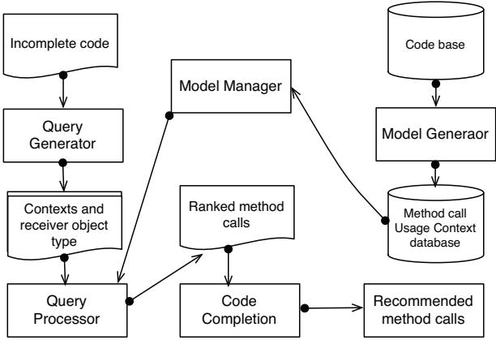

# Context-Sensitive Code Completion Tool for Better API Usability

Muhammad Asaduzzaman Chanchal K. Roy Kevin A. Schneider Daqing Hou† Department of Computer Science, University of Saskatchewan, Canada †Electrical and Computer Engineering Department, Clarkson University, USA {md.asad, chanchal.roy, kevin.schneider}@usask.ca, dhou@clarkson.edu

*Abstract*—Developers depend on APIs of frameworks and libraries to support the development process. Due to the large number of existing APIs, it is difficult to learn, remember, and use them during the development of a software. To mitigate the problem, modern integrated development environments provide code completion facilities that free developers from remembering every detail. In this paper, we introduce CSCC, a simple, efficient context-sensitive code completion tool that leverages previous code examples to support method completion. Compared to other existing code completion tools, CSCC uses new sources of contextual information together with lightweight source code analysis to better recommend API method calls.

# *Keywords*-API methods, Code Completion, Eclipse plugin

# I. INTRODUCTION

Developers extensively use Application Programming Interfaces (APIs) during the development of a software. However, this does not come without a price. Developers need to learn and remember these APIs to use them effectively. The problem is that APIs have grown considerably these days. For example, the Java Development Kit started with only 212 classes, but reaches to over 3000 classes by the release of version 5.0 1. Thus, it is difficult to learn and remember them completely. Furthermore, insufficient or inadequate examples, incomplete documentation, and unspecified issues in the documentation are only a few of the factors that make APIs difficult to learn [1], [2]. To help developers learn and use APIs, modern integrated development environments (IDEs) introduce code completion facilities. As a developer types code, the code completion engine tries to complete the remaining part by filling in various kinds of details.

A number of techniques have been developed to support Code Completion in IDEs. For example, Eclipse 2, a popular Java development environment, supports static type-based code completion that can sort the completion proposals either alphabetically, or by relevance, a positive value computed by considering various factors (expected type of the expression, return types, cast types, variable types etc.). However, it has been found that code completion techniques based on static type-based systems often fail to provide correct completion proposals in the top position, mostly because there are a large number of choices that match with the expected type. This requires developers to browse through the completion popups,

1http://www.headfirstlabs.com/books/hfjava/ 2http://www.eclipse.org/

thus reducing one of the important benefits of code completion for speeding up the coding process. BCC [3], [4] addresses limitations of the Eclipse JDT code completion technique and tries to improve it by using user defined context-sensitive filters together with frequency of method calls. Despite the improvements, BCC also has limitations in predicting correct method calls. In general, example-based code completion techniques, such as BMN [5] or Code Recommenders 3, have been found more effective than static type-based systems. However, their performance can be improved by considering additional sources of information [6].

In this paper, we present a simple, efficient, contextsensitive example-based tool, CSCC, to support the method call completion. The tool only requires the type information of the receiver object and uses tokenization, instead of deep parsing, to collect method call usage patterns. Upon request from a user (one way is typing a dot after a receiver object name), the tool collects the context of the current method call request and looks for a match from its code examples. CSCC employs the *simhash* technique [7] to quickly look for the possible matching candidates and then further refine the results by employing a more expensive but accurate textual distance measures. Matching method calls from the examplecode base are presented to the developers in descending order of similarity values. Full details, including a comprehensive evaluation of the tool, can be found elsewhere [6].

The remainder of the paper is organized as follows. Sections II and III describe the design of CSCC. Section IV presents the performance of CSCC as well as the benefit of using *simhash*. We discuss several key issues we observe from a user study in Section V. Section VI summarizes related work. Lastly, Section VII concludes the paper.

# II. CSCC: AUTO-COMPLETE OF METHOD CALLS

The CSCC tool is available as an Eclipse plugin and leverages the Eclipse Java Development Tools (JDT) to contribute to method completion proposals of the Eclipse Java editor. The integration is non-interfering, meaning it does not interrupt other forms of code completions supported by JDT, such as subwords completion. The code completion engine can be enabled or disabled by accessing the advanced content assistant preference page of the Eclipse. CSCC uses method

1063-6773/14 \$31.00 © 2014 IEEE

DOI 10.1109/ICSME.2014.110

3http://www.eclipse.org/recommenders/

Fig. 1: Configuration options for CSCC (Figure on the left hand side). The plugin can be enabled or disabled by selecting or deselecting the checkbox associated with the CSCC label (Figure on the right hand side)

call usage context collected from code examples of various open source software projects to recommend method calls. The tool comes with a model database that contains the code examples and users can add or delete additional model databases later. The tool offers two other options that can be configured by users of the plugin (see Figure 1). By default, CSCC inserts three completion proposals on top of the original list of method calls presented by the JDT. Users can change this number to a different value (ranging from one to ten) by accessing the first combo-box. Using the second combo-box users can change the confidence value used by the CSCC to recommend completion proposals. A high confidence value means CSCC will recommend completion proposals only if it finds they are very likely to call in the given context of the method call request. After careful experimentation we set the default confidence value to 30%.

The CSCC tool operates in three different phases. We briefly summarize the three phases as follows (further details of the technique can be found elsewhere [6]):

# *A. Step 1: Formulating Method Call Context*

The first step involves with collecting usage context of method calls from source code of open source software projects. CSCC collects two different forms of usage contexts. For the first context, known as the overall context, CSCC collects any method names, Java keywords except access specifiers, and any class or interface names that appear within top four lines prior to a method call. While collecting overall context, CSCC ignores any blank lines, comment lines and curly braces. For the second form of context, known as the line context, CSCC collects the same information of the overall context including the assignment operators that appear on the same line but prior to the target method call. The objective of collecting line context separately is to give more weight on the close matches when the other lines differ considerably. The name of the method, type name of the receiver object, and the two different forms of context constitute an entry in the model database. This step does not require any input from the users since the plugin comes with a model.

# *B. Step 2: Matching with Existing Calls Based on Context*

The plugin activates when a developer types a dot after an expression or an object name to complete the method call. It loads the content of the model database in a two level inverted index structure. Consider that a developer is typing code to read a file from Java and she has already created two objects of the FileReader and the BufferedReader classes. Consider also that she is now in the condition block of a while loop and invokes the method completion request on the BufferedReader object to read the content of the file. The plugin collects both the overall and line contexts for the current editing position. Now, CSCC first uses the type name of the receiver object to the inverted index structure to collect all those method calls in the code examples that have the same type of the receiver object. It then uses the tokens of the overall context as keys to find method calls whose context can be matched with the target context. We call this set of method calls as the base candidate list.

We can use string edit distance to determine similarity between the contexts of the base candidate list and the target context. However, such operations are computationally very expensive. Code completions need to be done at real-time and thus we introduce an intermediate step. To make the search process faster, CSCC leverages the *simhash* technique [7]. The technique uses cryptographic hash function to generate a binary *simhash* value for each method call context. Strings that are similar to each other have small Hamming Distance difference between their *simhash* values. CSCC sorts the base candidate list in ascending order of Hamming distance between the *simhash* values of their context and that of the target context. Next, it selects the top 200 method calls from the base candidate list, also known as the refined candidate list.

Fig. 2: An example method call recommendation by CSCC

Fig. 3: An overview of CSCC's architecture

The tool now uses normalized Longest Common Subsequence distance between the token sequences of the overall contexts to sort the refined candidate list. CSCC sorts the refined candidate list in descending order of the overall context similarity. In case of a tie, it uses Levenshtein distance of the line context to break the tie. Any matching candidates whose similarity value drops below the value specified in the *Level of Confidence* parameter are ignored by the CSCC.

### *C. Step 3: Recommending Top Candidates*

Since there are many code examples associated with the same method calls, the sorted and filtered refined list may contain many duplicates. After removing duplicates, the tool recommends the top three method names to complete the method call request. The number of recommendations can be changed by changing the *Number of Suggestions* parameter in the preference page of the plugin. Figure 2 shows an example method call recommendation by CSCC.

### III. CSCC ARCHITECTURE

Figure 3 shows the architectural overview of CSCC. The tool consists of five major components. The model generator component receives source code from open source software projects and generates a collection of method call usage contexts, also known as model. The model manager component is responsible for the management of models. It is also responsible for loading the method call usage contexts into the inverted index structure.

The query generator is responsible for capturing the code completion request from a user. It analyzes source file under editing and generate context for a method call request. It then passes the target context to the query processor component.

The query processor component is responsible for finding those method calls in a model whose context matches with the context of the query using a combination of *simhash* technique and textual distance measures. It then sorts them the method calls in descending order of similarity value between their context and the query context. Finally, passes the result to the code completion component.

The code completion component accepts the sorted list of completion proposals and puts them on top of JDT completion proposals. This number can be configured by a user.

### IV. EVALUATION

This section briefly summarizes the accuracy and runtime performance of CSCC. Details of the evaluation procedure and results can be found in a separate paper [6]. We also highlight the benefits of *simhash*.

### *A. Accuracy and Runtime Performance*

We compared *CSCC* with other state-of-the-art code completion techniques using source code examples that are collected from real-world applications. Our evaluation results reveal that CSCC outperforms other techniques. For example, the tool achieves an F-measure value of 88% for recommending correct method calls in the top three positions for the SWT library and the Eclipse system. The closest score to CSCC is 69% by BMN. In terms of execution time, CSCC is comparable with other state-of-the-art techniques. On average, the tool required 1.94 ms to recommend completion proposals when we tested the tool with 4,500 queries and the model contains 40,863 method call usage contexts.

### *B. Benefits of Simhash Technique*

The tool leverages *simhash* technique as a rough measure to quickly look for method calls whose context matches with that of the query context. The calculated similarity score provides a rough estimation of the relevance of a method call to the current context and CSCC refines the search result with textual distance measures. However, we cannot use textual distance measures in the first place because they are computationally expensive. To identify the benefit of using *simhashing*, we run the tool two different times where both the test and training method calls are collected from the Eclipse system and for the SWT library methods. In the first case we run the tool by enabling both *simhashing* and textual distance measures, but the matching in the later case is done using only textual distance measures. While on average the tool takes 50 ms to complete method call without using the *simhash* technique, it takes on average only 1.94 ms to complete method calls using the technique.

### V. USER STUDY

We conducted a preliminary user study to understand the usefulness of the CSCC tool and to identify any usability issues. We used a simple observation process where each participant worked on three tasks that require developing graphical user interfaces using Swing and AWT libraries. We then conducted a semi-structured interview to gain more insights about the design of the tool. The six volunteers that participated on this study were all graduate students and had previous experience working with Eclipse IDE and Java Swing/AWT libraries. However, the level of experience differs across the participant pool. We provided written description of the tasks and allowed 45 minutes to complete the tasks. We observed user actions and interviewed each participant at the end of the study. In general, the participants agreed that the tool was easy to use, recommendations were useful and the tool made recommendations reasonably fast.

However, we learned a few important lessons from the study. First, participants reported a few cases where CSCC either failed to recommend completion proposals or failed to rank the correct one within top three positions. When we investigated further, we found that these were the cases where many language constructs become part of the overall context that are not relevant to the current method call and the line context is also empty. As a result, this affects the overall similarity score and the tool fails to rank the completion proposal correctly. Second, a developer asked to provide support for instantiating an object. This is because objects of some classes are created other than using constructors and it is difficult to remember them by a developer. For example, developers need to call ToolKit.getDefaultToolkit().getImage() method that creates a reference to an Image object. Third, during our observation, we found that none of the participants except one changed the confidence value. This indicates that most users possibly do not care, or don't know how to change default parameters.

### VI. RELATED WORK

Bruch et al. [5] propose an example-based code completion technique, called BMN. The technique uses k-nearest neighbor algorithm to recommend method calls for a variable. While BMN uses methods that are previously called on the variable and the enclosing method name to make recommendations, CSCC uses any method names, Java keywords, and class or interface names that appear within top four lines of a method call to recommend method calls. Hou and Pletcher [4], [3] leverages sorting, filtering and grouping of API methods to improve the performance of Eclipse code completion system. The technique has been implemented in a research prototype, called BCC. The tool differs from CSCC in that it does not use previous code examples. BCC also allows expert users to manually specify filtering rules to remove uninteresting method calls. CSCC, on the contrary, does not require input from expert users. Robbes and Lanza [8] propose a set of approaches that use source code change history to recommend method calls. Their technique requires a change-based software repository to work, but CSCC can work with any software repository.

GrePacc [9] is a code completion tool that mines API usage patterns from code examples. The tool leverages graph-based algorithm together with context sensitive features extracted from code under editing to rank the API usage patterns. The tool then completes the remaining code. CSCC and GrePacc have different objectives. While CSCC focuses on method completion, GrePacc focuses on API usage pattern completion. Hill and Rideout [10] propose a technique for automatic completion of method body using code clones. However, the objective is again different than CSCC. Keyword programming [11] is also related to our study. The technique accepts a set of keywords from users and expand them into valid expressions. However, it uses different approach for interacting with users than CSCC.

### VII. CONCLUSION

We describe CSCC, an example-based code completion tool, that leverages contextual information to provide better method call completion. CSCC can be downloaded as an Eclipse plugin from http://asaduzzamanparvez.wordpress. com/cscc/. The demonstration will show how CSCC can be used to complete method calls, real world examples where other techniques fail but CSCC succeeds or performs better. Currently, we are working to eliminate the limitations of CSCC that are discussed in the previous section. We also plan to support other forms of code completion, such as method parameter completion [12] and the completion of object instantiations.

### REFERENCES

- [1] M. P. Robillard, "What Makes APIs Hard to Learn? Answers from Developers", IEEE Softw., vol. 26, pp. 27-34, Nov. 2009.
- [2] D. Hou and L. Li, "Obstacles in Using Frameworks and APIs: An Exploratory Study of Programmers' Newsgroup Discussions", in ICPC 2011, pp. 91-100.
- [3] D. M. Pletcher and D. Hou, "BCC: Enhancing code completion for better API usability", in ICSM 2009, pp. 393-394.
- [4] D. Hou and D. M. Pletcher, "An evaluation of the strategies of sorting, filtering, and grouping API methods for Code Completion", in ICSM 2011, pp. 233-242.
- [5] M. Bruch, M. Monperrus, and M. Mezini, "Learning from examples to improve code completion systems", in FSE 2009, pp. 213-222.
- [6] M. Asaduzzaman, C. K. Roy, K. A. Schneider, and D. Hou, "CSCC: Simple, Efficient, Context Sensitive Code Completion ", accepted to be published in ICSME 2014, 10 pp.
- [7] M. S. Charikar, "Similarity estimation techniques from rounding algorithms", in STOC 2002, pp. 380-388.
- [8] R. Robbes and M. Lanza, "How Program History Can Improve Code Completion", in ASE 2008, pp. 317-326.
- [9] A. T. Nguyen, T. T. Nguyen, H. A. Nguyen, A. Tamrawi, H. V. Nguyen, J. Al-Kofahi, and T. N. Nguyen, "Graph-based pattern-oriented, contextsensitive source code completion", in ICSE 2012, pp. 69-79.
- [10] R. Hill and J. Rideout, "Automatic method completion", in ASE 2004, pp. 228-235.
- [11] G. Little, Greg and R. C. Miller, "Keyword Programming in Java", in ASE 2007, pp. 84-93.
- [12] C. Zhang, J. Yang, Y. Zhang, J. Fan, X. Zhang, J. Zhao, and P. Ou, "Automatic parameter recommendation for practical API usage", in ICSE 2012, pp. 826-836.