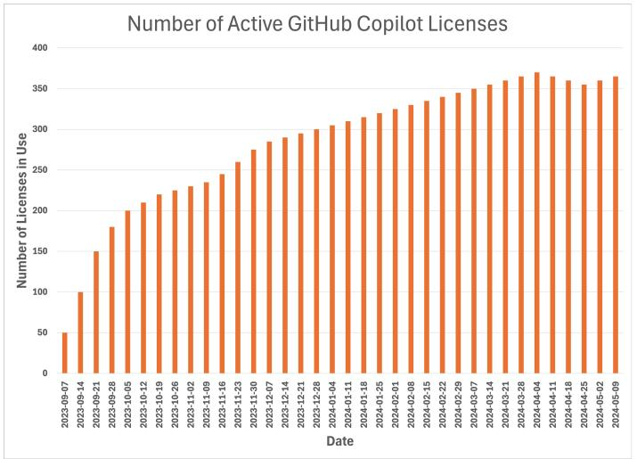
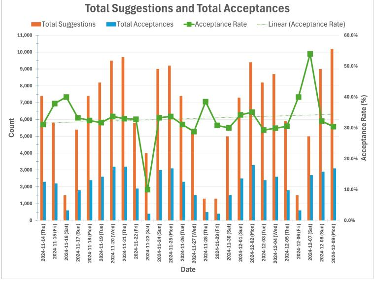
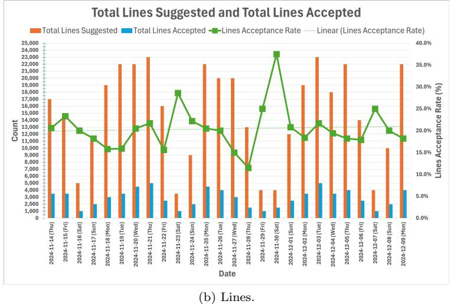
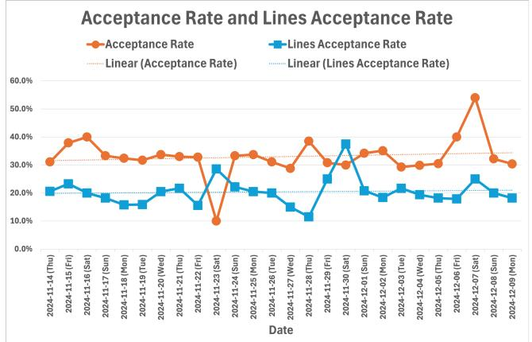
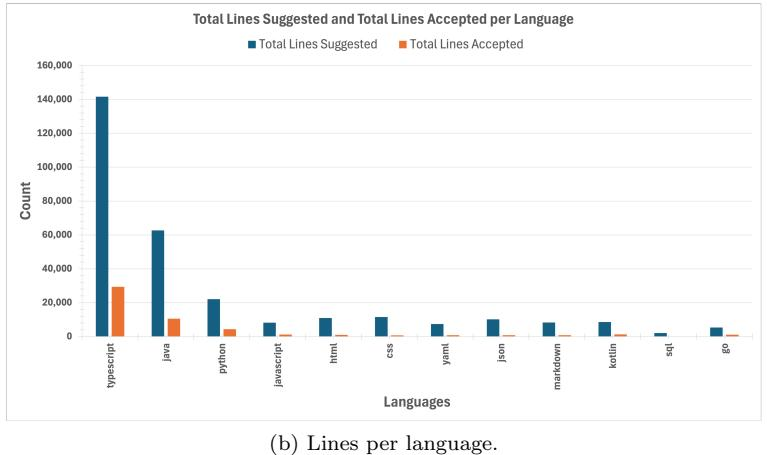
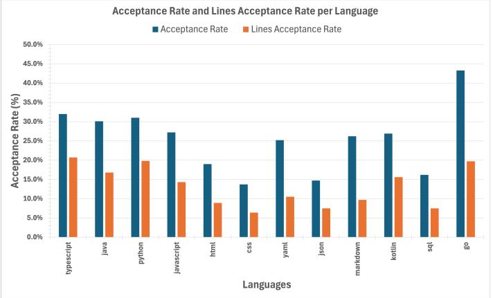

# Experience with GitHub Copilot for Developer Productivity at Zoominfo

Gal Bakal, Ali Dasdan, Yaniv Katz, Michael Kaufman, Guy Levin∗ Zoominfo

{gal.bakal, ali.dasdan, yaniv.katz, michael.kaufman, guy.levin}@zoominfo.com

January 24, 2025

#### Abstract

This paper presents a comprehensive evaluation of GitHub Copilot's deployment and impact on developer productivity at Zoominfo, a leading Go-To-Market (GTM) Intelligence Platform. We describe our systematic four-phase approach to evaluating and deploying GitHub Copilot across our engineering organization, involving over 400 developers. Our analysis combines both quantitative metrics, focusing on acceptance rates of suggestions given by GitHub Copilot and qualitative feedback given by developers through developer satisfaction surveys. The results show an average acceptance rate of 33% for suggestions and 20% for lines of code, with high developer satisfaction scores of 72%. We also discuss language-specific performance variations, limitations, and lessons learned from this medium-scale enterprise deployment. Our findings contribute to the growing body of knowledge about AI-assisted software development in enterprise settings.

### 1 Introduction

Developer productivity is a strategic priority at Zoominfo, driven by our fundamental belief that the speed at which a company transforms ideas into customer outcomes is strongly correlated with their competitive advantage. As such, we are continuously evaluating and adopting new methodologies and tools that enhance our developer's productivity.

The emergence of AI-powered coding assistants has sparked significant interest in their potential to enhance developer productivity. GitHub Copilot (sometimes referred as "the tool" in this paper), launched in 2021, represents a major advancement in this space, promising to accelerate software development through AI-generated code suggestions. However, while initial studies

∗The author names are in last name alphabetical order.

have shown promise, there remains limited empirical evidence of its evaluation, deployment, and effectiveness in medium- to large-scale enterprise environments.

This paper addresses this gap by presenting a detailed case study of GitHub Copilot's production deployment at Zoominfo, a leading Go-To-Market (GTM) Intelligence Platform, where it is used by over 400 developers who are geographically dispersed, with diverse technical disciplines, and programming languages. Our study aims to answer five key questions in a medium-scale enterprise setting:

- 1. How is GitHub Copilot evaluated to reach a production deployment decision?
- 2. What are the acceptance rates for different programming languages?
- 3. What are the key factors influencing developer satisfaction with AI-assisted coding?
- 4. How effective is GitHub Copilot in improving developer productivity?
- 5. What are the observed and potential limitations of GitHub Copilot?

We present a comprehensive case study of Zoominfo's evaluation, trial, and company-wide deployment of GitHub Copilot. As a major GTM platform managing hundreds of millions of business contact and company profiles and processing billions of daily events, we believe Zoominfo's experience offers valuable insights into the practical implementation and impact of AI-assisted software development at scale in similar enterprise companies.

Our analysis of GitHub Copilot usage combines both quantitative metrics, focusing on acceptance rates of the tool's suggestions, and qualitative feedback through developer satisfaction surveys. The results show an average acceptance rate of 33% for suggestions and 20% for lines of code, with high developer satisfaction scores of 72%. The acceptance rates we have observed are in line with the acceptance rates reported by a few other companies in industry, e.g., GitHub and Google

The acceptance rates for the top four programming languages used by our developers, i.e., TypeScript, Java, Python, and JavaScript, are sustained at about 30%. Interestingly we observe smaller acceptance rates for HTML, CSS, JSON, and SQL.

Our developers primarily enjoy the time savings (around 20%) due to GitHub Copilot while citing as limitations the tool's lack of domain-specific logic and lack of consistency in code quality. These limitations negatively impact time savings due to the need for additional scrutiny required while vetting the generated code.

Despite these limitations, we believe GitHub Copilot usage significantly contributed to the productivity of our developers. In addition the improvements in time savings and developer satisfaction, the number of lines of production code contributed is on the order of 100s of 1000s of lines of code.

The rest of the paper is organized as follows. § [2](#page-2-0) and § [3](#page-2-1) provide the necessary background for Zoominfo and developer productivity. § [4](#page-3-0) presents the projected benefits of GitHub Copilot after an initial ad hoc assessment. This is followed by the phases and details of our formal evaluation in § [5.](#page-4-0) § [6](#page-8-0) describes how we measured success, namely, acceptance rates. The quantitative and qualitative results due to GitHub Copilot usage in production are discussed in § [7,](#page-9-0) § [8,](#page-12-0) § [9,](#page-14-0) and § [10.](#page-14-1) The observed and potential limitations of GitHub Copilot are presented in § [11.](#page-16-0) A fairly comprehensive presentation of related work is in § [12.](#page-17-0) We conclude with § [13.](#page-20-0)

### 2 Background: Zoominfo

Zoominfo[\[36\]](#page-24-0) is the leading "Go-To-Market (GTM) Intelligence Platform"; it helps companies to acquire new customers as well as retain and grow their existing customer base. It has comprehensive and accurate data about 100s of millions of business contacts and companies. It has products built on the shared platform to serve multiple personas: Sales for sellers, Marketing for marketers, Talent for recruiters, Operations for data managers, and Data-as-a-Service (DaaS) for companies developing custom internal solutions.

Zoominfo has more than 37,000 customers (companies) and a few 100 thousands of monthly active users [\[36\]](#page-24-0). It has close to 4,000 employees in total, geographically distributed over the US, Europe, India, and Israel; a quarter of the employees are in the engineering department, and 400 engineers are active developers producing and deploying production software.

Zoominfo operates its platform on top of two public clouds, run by Google and Amazon. The platform consists of many microservices and a few monoliths interacting with data streaming and data management platforms [\[35\]](#page-24-1). The most common programming languages are TypeScript, Python, Java, and JavaScript, distributed over 1000s of code repositories hosted mainly with selfhosted GitHub Enterprise Server instance but also remotely with GitLab.

The scale challenges at Zoominfo [\[4,](#page-21-0) [28\]](#page-23-0) include the management of 100s of millions of business contact and company profiles, keeping them accurate and up-to-date, collecting and serving in real time billions of events per day, processing big data using AI and serving insights to users in real-time, responding to 10s of millions of search and other user queries a day, serving user experience queries in less than 1 second response time, providing 99.9% uptime per month for the most frequent user experience journeys (which means stability objectives more stringent than 99.9% for the backend systems), and delivering very high security and privacy requirements.

### 3 Productivity Refresher

At Zoominfo, the productivity principle we follow is this: How fast a company moves in transforming ideas into customer outcomes is the primary advantage of the company. We assert that companies prioritizing rapid execution will ultimately outperform their slower competitors, regardless of other competitive advantages those competitors may possess. As such, developer productivity is a top priority for us.

As detailed in [\[6\]](#page-21-1), there are many factors that affect developer productivity. Among those factors, providing the best tooling to developers in writing, testing, and reviewing code is fundamental. This represents our primary deployment area for GitHub Copilot.

At a basic level productivity is defined as the amount of output produced for a given amount of inputs. For developer productivity, the inputs are usually limited to time spent building the output while the output may include many features but the end result is outcomes or value for customers.

Developer productivity is measured in two ways: Quantitative and qualitative [\[6\]](#page-21-1). The quantitative metrics include objective metrics like the DORA metrics [\[7,](#page-21-2) [25\]](#page-23-1) measured via software development and deployment pipelines while the qualitative metrics include subjective metrics like developer satisfaction measured via developer surveys. Refer to [\[6,](#page-21-1) [8,](#page-21-3) [17\]](#page-22-0) for more information.

### 4 Projected Benefits of GitHub Copilot

A few months after GitHub Copilot was released, the excitement it generated also prompted us to conduct an ad hoc assessment of its potential benefits. The result of this ad hoc assessment was positive, and we proceeded with procuring GitHub Copilot for a formal assessment.

The following benefits were projected based on this initial ad hoc assessment.

#### 4.1 Augmenting Day-to-day Software Development

- Automated Code Generation: GitHub Copilot can generate code snippets and even complete functions based on the contextual information provided. It can suggest logic for the developers while they're coding, which can be a significant time-saver, especially when dealing with routine or repetitive code patterns.
- Code Review Assistance: Copilot can also serve as a pseudo-code-reviewer. It learns from billions of lines of code, meaning it can help spot potential bugs, suggest improvements, and ensure that the code aligns with best practices.
- Documentation and Commenting: The AI can provide useful comments and assist with documentation. It can explain complex code snippets, making it easier for other team members to understand the codebase, hence promoting collaboration.
- Learning New Technologies: When working with new languages, libraries, or frameworks, GitHub Copilot can be a great companion. It can pro-

vide code suggestions that adhere to the latest syntax and best practices, reducing the learning curve for developers.

### 4.2 Overall Productivity Gains

- Time Efficiency: With automated code generation and intelligent suggestions, developers can save significant time. This time can be used for more critical tasks, such as designing software architecture or addressing complex problems.
- Quality Improvement: By acting as a pseudo-code-reviewer, GitHub Copilot can help improve the quality of the code, reducing the likelihood of bugs and rework.
- Onboarding and Training: For new hires or junior developers, GitHub Copilot can act as a learning tool, helping them quickly understand the codebase, best practices, and contributing effectively.
- Accelerated Development Cycles: By reducing the time spent on routine tasks, improving code quality, and facilitating faster onboarding, GitHub Copilot can significantly accelerate our development cycles.

### 5 Methodology: From Evaluation to Rollout

After the initial ad hoc assessment in early July of 2023, we implemented a systematic four-phase approach from July to August of 2023 to evaluate and deploy GitHub Copilot across our engineering organization: Initial assessment phase, trial recruitment phase, the two-week trial phase, and the rollout phase. The rollout started in early September of 2023 and it took a few months for GitHub Copilot to be adopted by all the developers due to our pacing of the license distribution.

#### 5.1 Phase 1: Initial Assessment Phase

We conducted an initial qualitative assessment with five engineers from July 10th, 2023 to July 17th, 2023 to evaluate GitHub Copilot's potential impact on development workflows. This preliminary evaluation focused on identifying key benefits and potential challenges within our existing software development lifecycle.

The preliminary feedback was overwhelmingly positive, with key metrics including:

- Overall experience rating: 8.8 out of 10;
- Productivity improvement rating: 8.6 out of 10; and
- Code standards alignment: All five participants reported good to excellent alignment with existing coding standards.

Qualitative feedback highlighted several key observations:

- Strong adaptation to existing codebase patterns and conventions;
- No reported negative impact on code quality;
- Minimal integration challenges with existing development processes; and
- Particularly effective for unit test generation and boilerplate code.

Notable concerns included the following:

- Need for modification of suggested code (reported by 3 out of 5 participants);
- Limited visibility across multiple projects; and
- Potential over-reliance on automated suggestions.

This initial assessment informed our subsequent trial design and helped establish baseline metrics for the broader evaluation phase.

Procurement of GitHub Copilot for Business licenses were also acquired during this phase to facilitate the trial and subsequent rollout.

#### 5.2 Phase 2: Trial Recruitment Phase

We implemented a structured recruitment process for the controlled trial phase, conducted from July 17th to August 14th, 2023. The recruitment strategy employed stratified voluntary sampling to ensure representative participation across multiple dimensions of our engineering organization.

The trial cohort comprised 126 engineers (about 32% of the developers), with participation stratified across technical specializations, experience levels, geographical locations, and technology stacks.

To ensure compliance with organizational standards and maintain data integrity, participants were required to fulfill several prerequisite conditions:

- 1. Completion of internal security code review training.
- 2. Written acknowledgment of corporate compliance requirements:
	- Generative AI usage policies,
	- General AI governance framework,
	- Data governance protocols,
	- Data ethics guidelines, and
	- Data classification standards.
- 3. Commitment to provide structured feedback through a follow up survey.

The public versions of some of these compliance documents can be found at [\[37\]](#page-24-2).

The trial protocol was designed to maintain both broad participation and controlled evaluation conditions while ensuring compliance with corporate security requirements. Participation was voluntary but managed through a formal application and governance framework that included:

- Structured application and prerequisite verification;
- Documentation of training completion and policy acknowledgments;
- Assignment of unique participant identifiers for tracking;
- Comprehensive code review requirements;
- Mandatory functionality validation and testing;
- Documentation standards compliance;
- Production deployment guidelines; and
- Security compliance measures.

This comprehensive methodology enabled effective participant management while maintaining consistent code quality standards throughout the trial period. All participants were required to adhere to these guidelines to ensure the validity and security of the evaluation process.

#### 5.3 Phase 3: Two-Week Trial Phase

We conducted a two-week controlled trial from August 15th to August 29th, 2023, with 126 participating engineers actively integrating GitHub Copilot into their daily development workflows.

At the trial's conclusion, we collected feedback through a comprehensive survey (72 respondents, about 57% response rate).

The survey addressed three key dimensions:

- 1. Overall experience and productivity impact,
- 2. Code quality and standards alignment, and
- 3. Security considerations.

The overall experience was positive with the following ratings:

- Mean satisfaction rating: 8.0 out of 10, and
- Mean productivity improvement rating: 7.6 out of 10.

Developers reported time savings for generating boilerplate and repetitive code, unit tests, meaningful variable names, documentation, and comments.

Regarding code quality and standards alignment, the majority of participants were satisfied:

- Majority of participants reported good to excellent alignment with existing coding standards.
- No participants reported a decline in code quality across their team's pull requests.
- Majority of participants reported needing to make minimal modifications to suggested code.

Developers reported that the tool was useful across various languages and tech stacks, although with reservations due to some inconsistencies regarding the tool's performance on domain-specific or highly innovative tasks, requiring additional oversight.

Regarding security considerations, survey participants demonstrated high security consciousness:

- Mean security vulnerability assessment confidence: 8.2 out of 10;
- Mean sensitive information exposure awareness: 8.2 out of 10; and
- Mean security consideration in development: 8.6 out of 10.

Despite these high scores, developers emphasized the need for rigorous reviews of AI-generated code to mitigate security and quality risks.

Overall, our analysis revealed strong participant satisfaction with GitHub Copilot's core capabilities. Unit test generation and boilerplate code creation showed the highest utility, while code documentation and pattern recognition demonstrated moderate to high effectiveness. Variable naming features showed modest utility.

Implementation challenges primarily involved technical integration and context management across codebases. Despite these initial adoption hurdles, the trial demonstrated strong positive outcomes, particularly in security awareness and code quality maintenance, with most of participants reporting improved productivity.

This structured trial phase was instrumental in preparing ZoomInfo for the full rollout of GitHub Copilot, ensuring alignment with organizational objectives and addressing key developer concerns.

#### 5.4 Phase 4: Rollout Phase

Following the successful trial, an analysis of the survey data from Phase 3 determined that there were no outstanding issues that needed to be addressed before rolling out GitHub Copilot to the remainder of our engineers.

Thus, we initiated the full-scale deployment of GitHub Copilot across our engineering organization on September 7th, 2023 by releasing a ServiceNow Workflow for measured deployment of GitHub Copilot licenses, as shown in Fig. [1.](#page-8-1) This streamlined the process of GitHub Copilot provisioning and enabled tracking for compliance and utilization metrics. This also enabled ZoomInfo engineers to promptly get access to the tool.

Figure 1: Adoption of GitHub Copilot during the first 8 months at Zoominfo. We released licenses at a controlled pace to ensure daily usage and success.

### 6 Success Measure

The impact of GitHub Copilot on developer productivity seems difficult to measure after a short-term usage. As such, we resorted to a measure that was recommended by GitHub after it was found to be a "better predictor of perceived productivity" [\[34\]](#page-24-3): Acceptance rate of shown suggestions.

Acceptance rate of shown suggestions [\[10\]](#page-22-1) for one developer is the ratio of the suggestions accepted by the developer to the total number of suggestions shown to the developer.

For this measure, even a partial acceptance gets the full credit. Moreover, the number of lines shown is not included in the rate. This means a single line as well as 100s of lines get the same credit. Both of these may be seen as limitations of this measure but for now, the acceptance rate measure seems like a good one among the alternatives considered in [\[34\]](#page-24-3).

The acceptance rate of shown suggestions for a team is the average over the rates for developers.

After months of usage, we have also been monitoring for any changes in our regular developer productivity metrics such as the DORA metrics and developer satisfaction scores. Once we establish a reliable causality between these metrics and the GitHub Copilot usage, we are planning to report the results in a subsequent paper.

Figure 2: Daily data from Nov. 14th to Dec. 9th in 2024. For each day, this table shows the total number of suggestions, acceptances, lines suggested, lines accepted, acceptance rate, lines acceptance rate, lines per suggestion and lines per acceptance. The rows at the bottom show the averages (Average), standard deviations (Stdev), and medians (Median) for each relevant column. The conditional formatting of two columns in tones of green and red colors are to highlight larger values (green) and smaller values (red).

### 7 Quantitative Results: Overall Acceptance Rates

Fig. [2](#page-9-1) shows the table of data for 26 days in 2024, from from Nov. 11th to Dec. 9th. The table shows the number of suggestions, acceptances, lines suggested, and lines accepted.

For each prompt from a developer, GitHub Copilot makes a suggestion, which has one or more lines of code or comments, and the developer accepts or declines the suggestion. The ratio is the acceptance rate. The acceptance rates in terms of suggestions and lines are also given in the table.

The average numbers of suggestions and lines suggested are close to 6,500 and 15,000, respectively. The standard deviations are close to the half of these numbers in each case but such large deviations are due to the weekday and weekend periods rather than the variations from day to day. The averages over weekdays are about 20% and 35% larger than these overall averages. Similarly, the averages over weekends are about 60% and 75% smaller than these overall averages.

Note that for our developers in Israel, the weekend is from Friday to Saturday while for the developers in the US and India, the weekend is from Saturday to Sunday.

Each suggestion has a few lines of code or comments; the average is 2.8 lines

(a) Suggestions.

Figure 3: Daily total number of suggestions and acceptances (a) and daily total number of suggested and accepted lines (b). Both figures cover the days from Nov. 14th to Dec. 9th in 2024. The acceptance rate in each case is the ratio of the suggested unit to the accepted unit. The trend lines are for the acceptance rates, showing a slight upward trend in each case. The wavy pattern is due to weekdays (high) and weekends (low).

though the number of lines ranges from one to ten. The median is also close to the average.

Fig. [3](#page-10-0) shows the same data in the table in Fig. [2](#page-9-1) but as bar charts and line plots for ease of understanding. As the acceptance rate plots show, the acceptance rates during weekends usually increase rather than decrease. We do not know the reason for this behavior. Also, as the acceptance rate trend lines show, there is a slight upward trend in acceptance rates.

Figure 4: Acceptance rates for suggestions and lines. The former is about 1.5 times larger than the latter. The trend lines for each also show slight upward trends.

As shown in Fig. [4,](#page-11-0) for the period discussed in this section, the average acceptance rate over suggestions is 33% and over lines is 20%. In other words, one third of the suggestions and one fifth of the suggested lines are accepted by developers on average. These numbers are in line with what has been reported by GitHub [\[34\]](#page-24-3) as well as other companies in industry, e.g., [\[18\]](#page-22-2) while using a different AI pair programmer. It would interesting to find out in the future why this alignment across different companies and tools occurs.

When we divide the number of suggestions or lines suggested by the number of developers, we get a few 10s of suggestions per day per developer. Though these numbers look reasonably small, the total number of GitHub Copilot generated lines in our codebase has reached 100s of 1000s of lines. During the time period shown in Fig. [2](#page-9-1) alone, the total number of lines accepted is about 75,000. This shows the impact of the tool when used by a large number of developers.

Figure 5: Data for the top dozen languages (collected on Jan. 9th, 2025. For each language, this table shows the total number of suggestions, acceptances, lines suggested, lines accepted, acceptance rate, and lines acceptance rate. The conditional formatting of two columns in tones of green and red colors are to highlight larger values (green) and smaller values (red).

## 8 Quantitative Results: Per Language Acceptance Rates

Fig. [5](#page-12-1) shows the table of data for about a month in 2024, from from Nov. 11th to Dec. 9th. The table shows per (programming) language the number of suggestions, acceptances, lines suggested, and lines accepted. These numbers are the largest for the top four languages in the table, i.e., TypeScript, Java, Python, and JavaScript, which is not surprising given the most of our codebase is in these four languages.

For simplicity, we include data in the table for only the top dozen languages, sorted in decreasing order of the total number of suggestions. We excluded data for languages such as Groovy, Shell (e.g., zsh or bash), Scala, Ruby, and the like since their numbers are too small.

Fig. [6](#page-13-0) shows the same data in the table in Fig. [5](#page-12-1) but as bar charts and line plots for ease of understanding. The top four languages cover close to 80% and 75% of the total number of suggestions and lines suggested, respectively, as well as close to 85% of the total number of acceptances and lines accepted.

As shown in Fig. [7,](#page-14-2) for the 26-day period discussed in this section, the acceptance rates per language varies between about 14% to 32%. The highest acceptance rate is for the Go language but the number of suggestions is far smaller. Interestingly the number of lines per suggestion for the Go language is also the highest, over 6, while the number ranges from 2 to 3 for the other languages.

The acceptance rates for the top three languages are among the highest, over 30%, which agrees with the overall acceptance rate we presented in the previous section. The acceptance rates for HTML, CSS, JSON, and SQL are interestingly smaller compare to those of the general-purpose languages. We do not know the reason for this difference.

(a) Suggestions per language.

Figure 6: Daily total number of suggestions and acceptances (a) and daily total number of suggested and accepted lines (b) per language. Both figures cover the days from Nov. 14th to Dec. 9th in 2024. The acceptance rate in each case is the ratio of the suggested unit to the accepted unit. The trend lines are for the acceptance rates, showing a slight upward trend in each case. The wavy pattern is due to weekdays (high) and weekends (low).

Figure 7: Acceptance rates for suggestions and lines per language. The former is 1.5 to over 2 times larger than the latter. The trend lines for each also show slight upward trends.

Figure 8: Data for the top two IDEs ("editors") used by our developers, Jet-Brains and VS Code, in the order of usage. For each editor, we show the acceptance rates and share of each editor across multiple measures.

## 9 Quantitative Results: Per Editor Acceptance Rates

Fig. [8](#page-14-3) shows the table of data for the top two IDEs ("editors") used by our developers: JetBrains (by JetBrains) and VS Code (by Microsoft). The usage of the former editor is more widespread, hence, the larger number of suggestions and lines suggested for JetBrains.

The acceptance rates of suggestions are close to each other and also close to the 30% figure we cited for the overall rate. At the same time, the lines acceptance rates differ with VS Code having about 50% higher value. We do not know the reason for this difference but it is interesting to note the lower number of lines per suggestion for VS Code.

### 10 Qualitative Results: Developer Satisfaction

In our pursuit of creating the best environment for engineering talent to thrive, we are committed to employing both quantitative and qualitative approaches

Figure 9: Developer satisfaction statistics. The red boxes indicate the relevant parts. The table also shows the data for some other tools such as Jenkins, Sonar-Qube, ArgoCD, and Backstage that developers love to use. GitHub Copilot has the highest positive sentiment. The dark black box hides an internal tool that is not relevant to this paper.

to understand the drivers of developer productivity.

We collect qualitative data through quarterly pulse surveys. Our aim for doing so is to gauge the sentiments and perceptions of our engineers regarding our development and release toolchain involved in producing software.

This approach is not only providing structured insights into specific areas but also allow unstructured feedback to capture the sentiments and opinions of our engineering workforce.

By leveraging feedback from our surveys, we are navigating towards optimizing our investments and identifying areas that require enhancement. After these surveys are done, we promptly evaluate the results and communicate back to our developers our learnings and action items we are planning to take the following quarter.

Since the second iteration of this quarterly survey (Q2 2024), we have started asking a Likert scale [\[27\]](#page-23-2) question gauging satisfaction with various tools in the software delivery toolchain.

Each tool is presented alongside a five-category satisfaction scale ranging from "Very satisfied" (highest) to "Very unsatisfied" (lowest) that gauges the satisfaction sentiment for that specific tool. Open comments are also permitted.

When analyzing the results of the toolchain section, the overall satisfaction score is calculated as the difference between the two positive sentiment scores and the two negative sentiment scores, where the total satisfaction is the result of subtracting the negative sentiment from the positive sentiment while ignoring neutralities. This method is similar to those metrics used to measure customer satisfaction of goods and services offered to customers, and is referred to internally as "DevSat", an abbreviation of "Developer Satisfaction" [\[1\]](#page-21-4).

As seen in Fig. [9,](#page-15-0) GitHub Copilot leads the chart with the highest satisfaction rate, showing consistent results with 72% total satisfaction among all surveyed tools.

In addition to the favorable sentiment, we have the following observations:

- 90% respondents stated that GitHub Copilot reduces the amount of time it takes to complete their tasks with a median reduction of 20%.
- 63% respondents stated using GitHub Copilot allowed them to complete more tasks per sprint.
- 77% respondents stated that the quality of their work was improved when using GitHub Copilot.

The survey also allows participants to enter free-form text for their feedback. The following three examples show a positive, somewhat neutral, and negative feedback.

- (Positive): "Github Copilot has been a great productivity tool after I learned how to leverage it for certain things."
- (Neutral) "Github Copilot is a hit or miss with correct code in VSCode. I don't use the prompt and use the code suggestion if it makes sense, but that is wrong a lot of the time. If it's repeated code that I already wrote example line(s) of code for, then it's usually correct and saves time but it's still one line at a time."
- (Negative) "Copilot sometimes use copilot, usually not giving me good results."

### 11 Limitations: Observed and Potential

These are the limitations of GitHub Copilot that we were able to observe so far:

- Contextual Understanding: Struggles with understanding domain-specific logic, leading to irrelevant or redundant suggestions.
- Security Concerns: Potential security risks from auto-generated code requiring additional vetting.
- Creativity Limitations: Generates predictable, less innovative solutions in some cases.

Though we have not observed yet, we can envision a number of potential limitations with GitHub Copilot, as follows.

- Sensitive Data Exposure: GitHub Copilot may inadvertently suggest or generate code containing sensitive or proprietary information due to its training on public repositories.
- Intellectual Property Issues: GitHub Copilot might suggest code snippets resembling copyrighted or proprietary code, leading to potential intellectual property infringement.
- Code Quality and Vulnerabilities: The generated code could contain security vulnerabilities, requiring thorough review before being integrated.
- Data Privacy: If telemetry data from GitHub Copilot is collected, there could be privacy concerns over how this information is stored and used.
- Compliance Risks: Some industries have strict compliance requirements, and GitHub Copilot may unintentionally violate these by generating code or comments not in line with regulatory guidelines.
- Over-reliance on AI: Developers might become too reliant on AI-generated suggestions, potentially overlooking best practices in favor of quicker implementation.
- Unintended Patterns: GitHub Copilot might reinforce problematic or insecure coding patterns it has learned from public repositories.
- GitHub Copilot helps with writing code but may make developers less creative and even less productive eventually. It is important to think about how developers should use it and not rely on it too much. Developers should try to balance working fast with coming up with their own ideas.

### 12 Related Work

There are many factors that affect developer productivity. A high-level summary of those factors is given in [\[6\]](#page-21-1). § [3](#page-2-1) presents a preview. For this section, we will consider only the factors that can be impacted by GitHub Copilot. For more information, refer to [\[7,](#page-21-2) [25,](#page-23-1) [8,](#page-21-3) [17,](#page-22-0) [21\]](#page-23-3).

The news on the launch of GitHub Copilot is given in [\[9\]](#page-21-5) with some additional information in [\[26\]](#page-23-4). The tool is launched as "a new AI pair programmer that helps you [developers] write better code." The description of the tool reads "GitHub Copilot draws context from the code you're working on, suggesting whole lines or entire functions. It helps you quickly discover alternative ways to solve problems, write tests, and explore new APIs without having to tediously tailor a search for answers on the internet. As you type, it adapts to the way you write code—to help you complete your work faster."

GitHub Copilot uses a version of Codex, which is originally a GPT language model from Open AI fine-tuned on publicly available code from GitHub [\[3\]](#page-21-6). The Codex introduction in [\[3\]](#page-21-6) discusses limitations and impact of the model and provides related work on similar tools. The limitations and impact mention over-reliance, misalignment, bias and representation, economic and labor market impacts, security implications, environmental impacts, and legal implications. The paper also touches upon some risk mitigation.

There are a growing number of publications on measuring the impact of GitHub Copilot on developer productivity.

A comprehensive, somewhat "official", report on the productivity impact of the tool is presented in [\[34\]](#page-24-3) by researchers from GitHub, the company that had created the tool. The researchers use survey responses from developers using the tool as well as measurements collected from IDEs (interactive development environment) used by the same developers. The measurements include the number of suggestions, the number of acceptances, and the amount of code contributed by and accepted by the developers. The researchers "find that acceptance rate of shown suggestions is a better predictor of perceived productivity than the alternative measures." As we discuss in § [6,](#page-8-0) we have adopted the same measure to gauge the productivity impact of the tool. For more details on the measurements and other aspects of the tool, refer to [\[10\]](#page-22-1).

According to [\[15\]](#page-22-3), correctness from the code suggested by GitHub Copilot is around 60% for Java and around 30% for JavaScript. The paper uses problems from a popular interview questions site, LeetCode, to generate solutions and then runs LeetCode's problem tests to evaluate correctness.

[\[20\]](#page-22-4) uses open source development hosted at GitHub and finds that GitHub Copilot enhances project-level productivity by 6.5% as measured by code contributions; the enhancement is due to increases in both individual productivity and participation. On the negative side, the paper finds increase in integration time by about 42%.

[\[33\]](#page-23-5) collects programming-related discussions about GitHub Copilot from two popular sites, Stack Overflow and GitHub. The analysis shows that JavaScript and Python are the most commonly used languages, Visual Studio Code is the most used IDE, and data processing is the most commonly used function for code generation. The discussions also point out challenges with integration of generated code, confirming the related findings in [\[20\]](#page-22-4).

[\[11\]](#page-22-5) evaluates GitHub Copilot for test generation and finds that the tool is not a panacea. It uses tests generated by the tool for open source projects. Within an existing test suite, the paper finds that about 55% of generated tests fail while outside an existing test suite, about 92% of generated tests fail.

[\[30\]](#page-23-6) does a systematic evaluation for limits and benefits of GitHub Copilot; it evaluates the quality of the generated code and finds that valid code is generated with around 92% success rate. Diving deeper, it also finds that suggested code is correct at around 29%, incorrect at around 20%, and partially correct for the rest.

[\[14\]](#page-22-6) evaluates the robustness of code generation using GitHub Copilot. The study prompts the model using semantically equivalent natural language descriptions and expects the same suggested function as the result. In close to 50% of the cases, the generated function is expected to be the same but is different. Moreover, the correctness also gets affected in about 30% of the cases. The findings shed some negative light on the robustness of the tool while highlighting the importance of prompting and experimenting.

[\[24\]](#page-23-7) uses two versions of the Codex, one behind GitHub Copilot and another (Davinci) that is the most performant, to run experiments on simple programming assignments to measure the correctness of the generated code and the limitations of the tool. The paper reports somewhat negative results on Copilot's capabilities compared to Davinci; it also emphasizes that students using the tool need to be aware of its limitations; the onus is on them to correct the generated code for the final solutions.

[\[19\]](#page-22-7) is similar to [\[24\]](#page-23-7) in that both study GitHub Copilot in tasks for introductory programming assignments. This paper reports more positive results for the tool, stating that the generated code correctness ranges from around 70% to 95% when evaluated by human graders.

[\[5\]](#page-21-7) studies the capabilities of GitHub Copilot on generating solutions for fundamental algorithmic problems like sorting and basic data structures implementations; it also studies the performance with respect to human programmers on a number of programming tasks. The paper reports that while Copilot generates correct solutions most of the time, its performance is still not as good as human programmers.

[\[2\]](#page-21-8) is a work similar to ours in many respects: deployment and use on realworld engineering tasks in a corporate environment, four weeks of evaluation, use by about 1,000 engineers, and results assessment via surveys and objective data collection using controlled experiments. The paper reports notable boost in productivity, code quality, and job satisfaction due to the use of the tool. The study measures productivity using the time spent solving a given programming tasks. The boost is approximately between 40% and 50% with the gap in average time spent between those engineers not using the tool and those using it growing in favor of the latter as the difficulty of the task is increasing.

Taking the impact of GitHub Copilot on individual productivity as a given, [\[31\]](#page-23-8) evaluates the impact on a collaborative work setting by focusing on collaborations to open source projects. The paper finds more maintenance-related contributions than code-development contributions.

GitHub Copilot is not the only AI model for developer productivity. For example, AI models for bug fixing and unit test generation are presented in [\[23\]](#page-23-9) and [\[22\]](#page-23-10), respectively. Both models learn from all the code hosted at GitHub. Both papers claim positive impact on developer productivity.

There are multiple other studies comparing GitHub Copilot against similar tools.

[\[29\]](#page-23-11) compares GitHub Copilot against two other tools, Amazon's CodeWhisperer and Open AI's ChatGPT. The paper reports Copilot taking the second place after ChatGPT in the quality of the generated code on the HumanEval benchmark problems proposed and also used by the authors of [\[3\]](#page-21-6).

[\[32\]](#page-23-12) attempts to measure the performance of GitHub Copilot and ChatGPT on code generated by such tools and hosted at GitHub. The paper dismisses the use of the HumanEval benchmark problems as not a representative of the real-world problems. The paper reports that GitHub Copilot and ChatGPT are the top two models used; Python, Java, and TypeScript are the most common languages for code generation especially for data processing and transformation while C/C++ and JavaScript are the most common ones for algorithm, data structure, and user interface implementations. It also reports that the generated code is mostly small functions with low complexity and sparse comments; the generated code by these tools also goes through fewer modifications compared to human generated code.

There are a couple of studies about aspects of GitHub Copilot beyond code

correctness alone.

[\[12\]](#page-22-8) experiments with three human languages used for prompting GitHub Copilot: Chinese, English, and Japanese. Possibly not surprisingly due to the amount of training data in these languages, it finds the worst performance occurs with Chinese and the performance for all three languages drops with increasing question difficulty.

[\[16\]](#page-22-9) introduces and evaluates a semi-automated pipeline for extracting sensitive personal information from the Codex model used in GitHub Copilot. It finds that the generated code for about 8% of test cases has privacy leaks.

[\[13\]](#page-22-10) gathers instructor perspectives about how they plan to adapt to these AI coding tools that more students will likely have access to in the future. It states that there is no consensus yet; in the short term instructors are divided on whether to ban or allow AI usage.

After this related work review, we feel our findings regarding benefits and limitations of GitHub Copilot are mostly in alignment with those of the relevant related work but the exact figures naturally differ due to such reasons as types of tasks, interview questions vs. production work, programming languages, students vs. developers, etc.

### 13 Conclusions and Future Work

In addition to sharing our comprehensive evaluation methodology, our study provides several key insights into the enterprise-scale deployment of GitHub Copilot for developers:

- Quantitative impact: The tool shows consistent acceptance rates (33% for suggestions, 20% for lines) across different programming languages, indicating reliable utility across diverse development contexts.
- Developer satisfaction: High satisfaction rates (72%) and positive feedback suggest that GitHub Copilot effectively supports daily development tasks, particularly in areas like boilerplate code generation and unit testing.
- Implementation considerations: Our phased deployment approach, including security training and policy alignment, proved effective for managing the transition to AI-assisted development.
- Limitations and challenges: While generally successful, the tool shows limitations in understanding domain-specific logic and requires careful consideration of security implications.

Future work should focus on long-term impact assessment, particularly regarding DORA metrics, code quality, and maintenance implications. Additionally, investigating the tool's effect on developer learning and skill development would provide valuable insights for enterprise adoption strategies.

### References

- [1] G. Bakal. How ZoomInfo is making a quantum leap in infrastructure operations by employing an internal developer platform. [https://engineering.](https://engineering.zoominfo.com/) [zoominfo.com/](https://engineering.zoominfo.com/). Accessed: 2024-01-21.
- [2] S. Chatterjee, C.L. Liu, G. Rowland, and T. Hogarth. The impact of AI tool on engineering at ANZ bank an empirical study on GitHub Copilot within corporate environment. Arxiv at <https://arxiv.org/abs/2402.05636>, Feb 2024.
- [3] M. Chen, J. Tworek, H. Jun, Q. Yuan, H.P. de Oliveira Pinto, J. Kaplan, H. Edwards, Y. Burda, N. Joseph, G. Brockman, A. Ray, R. Puri, G. Krueger, M. Petrov, H. Khlaaf, G. Sastry, P. Mishkin, B. Chan, S. Gray, N. Ryder, M. Pavlov, A. Power, L. Kaiser, M. Bavarian, C. Winter, P. Tillet, F. Petroski Such, D. Cummings, M. Plappert, F. Chantzis, E. Barnes, A. Herbert-Voss, W.H. Guss, A. Nichol, A. Paino, N. Tezak, J. Tang, I. Babuschkin, S. Balaji, S. Jain, W. Saunders, C. Hesse, A.N. Carr, J. Leike, J. Achiam, V. Misra, E. Morikawa, A. Radford, M. Knight, M. Brundage, M. Murati, K. Mayer, P. Welinder, B. McGrew, D. Amodei, S. McCandlish, I. Sutskever, and W. Zaremba. Evaluating large language models trained on code. Arxiv at <https://arxiv.org/abs/2107.03374>, Jul 2021.
- [4] J. Chou, H. Sarkezians, and A. Dasdan. How we built search for go to market platforms at zoominfo. [https://www.youtube.com/watch?v=](https://www.youtube.com/watch?v=3IBmeR3jv0E) [3IBmeR3jv0E](https://www.youtube.com/watch?v=3IBmeR3jv0E), May 2024. Accessed: 2024-12-08.
- [5] A.M. Dakhel, V. Majdinasab, A. Nikanjam, F. Khomh, M.C. Desmarais, and Z.M. Jiang. GitHub Copilot AI pair programmer: Asset or liability? Arxiv at <https://arxiv.org/abs/2206.15331>, Jun 2022.
- [6] A. Dasdan. How to measure and improve developer productivity. [https://www.linkedin.com/pulse/](https://www.linkedin.com/pulse/how-measure-improve-developer-productivity-ali-dasdan-lmq7c/) [how-measure-improve-developer-productivity-ali-dasdan-lmq7c/](https://www.linkedin.com/pulse/how-measure-improve-developer-productivity-ali-dasdan-lmq7c/). Accessed: 2024-12-08.
- [7] DORA. Get better at getting better. <https://dora.dev/>. Accessed: 2024-12-08.
- [8] N. Forsgren, M.-A. Storey, C. Maddila, T. Zimmermann, B. Houck, and J. Butler. The SPACE of developer productivity: There's more to it than you think. ACM Queue, 19(1):20–48, Mar 2021.
- [9] N. Friedman. Introducing GitHub Copilot: your AI pair programmer. [https://github.blog/news-insights/product-news/](https://github.blog/news-insights/product-news/introducing-github-copilot-ai-pair-programmer/) [introducing-github-copilot-ai-pair-programmer/](https://github.blog/news-insights/product-news/introducing-github-copilot-ai-pair-programmer/), Jun 2021. Accessed: 2024-12-04.
- [10] GitHub. Glossary: Measuring the impact of GitHub Copilot. [https://resources.github.com/artificial-intelligence/](https://resources.github.com/artificial-intelligence/how-to-measure-github-copilot-impact/) [how-to-measure-github-copilot-impact/](https://resources.github.com/artificial-intelligence/how-to-measure-github-copilot-impact/), Apr 2024. Accessed: 2024-12-07.
- [11] K. El Haji, C. Brandt, and A. Zaidman. Using GitHub Copilot for test generation in Python: An empirical study. In Proc. 5th Int. Conf. Automation of Soft. Test (AST), pages 106–21. ACM/IEEE, Apr 2024.
- [12] K. Koyanagi, D. Wang, K. Noguchi, M. Kondo, A. Serebrenik, Y. Kamei, and N. Ubayashi. Exploring the effect of multiple natural languages on code suggestion using GitHub Copilot. Arxiv at [https://arxiv.org/abs/](https://arxiv.org/abs/2402.01438) [2402.01438](https://arxiv.org/abs/2402.01438), Feb 2024.
- [13] S. Lau and P. Guo. From "ban it till we understand it" to "resistance is futile": How university programming instructors plan to adapt as more students use AI code generation and explanation tools such as ChatGPT and GitHub Copilot. In Proc. Conf. Int. Comput. Edu. Research (ICER), pages 106–21. ACM, Sep 2023.
- [14] A. Mastropaolo, L. Pascarella, E. Guglielmi, M. Ciniselli, S. Scalabrino, R. Oliveto, and G. Bavota. On the robustness of code generation techniques: An empirical study on GitHub Copilot. Arxiv at [https://arxiv.](https://arxiv.org/abs/2302.00438) [org/abs/2302.00438](https://arxiv.org/abs/2302.00438), Feb 2023.
- [15] N. Nguyen and S. Nadi. An empirical evaluation of GitHub Copilot's code suggestions. In Proc. 19th Int. Conf. Mining Soft. Repositories (MSR), pages 1–5. ACM, May 2022.
- [16] L. Niu, S. Mirza, Z. Maradni, and C. Poepper. Codexleaks: Privacy leaks from code generation language models in GitHub Copilot. In Proc. 32nd USENIX Security Symp., pages 2133–50. USENIX, Aug 2023.
- [17] A. Noda, M.-A. Storey, N. Forsgren, and M. Greiler. DevEx: What actually drives productivity: The developer-centric approach to measuring and improving productivity. ACM Queue, 21(2):35–53, May 2023.
- [18] S. Pichai. Google q3 earnings call: Ceo's remarks. [https://blog.google/](https://blog.google/inside-google/message-ceo/alphabet-earnings-q3-2024/) [inside-google/message-ceo/alphabet-earnings-q3-2024/](https://blog.google/inside-google/message-ceo/alphabet-earnings-q3-2024/), Oct 2024. Accessed: 2024-01-13.
- [19] B. Puryear and G. Sprint. GitHub Copilot in the classroom: learning to code with AI assistance. J. of Computing Sciences in Colleges, 38(1):37–47, Nov 2022.
- [20] F. Song, A. Agarwal, and W. Wen. The impact of generative AI on collaborative open-source software development: Evidence from GitHub Copilot. Arxiv at <https://arxiv.org/abs/2410.02091>, Oct 2024.
- [21] L. Tacho. DORA, SPACE, and DevEx: Which framework should you use. <https://getdx.com/guide/dora-space-devex/>. Accessed: 2024-12-25.
- [22] M. Tufano, D. Drain, A. Svyatkovskiy, S.K. Deng, and N. Sundaresan. Unit test case generation with transformers and focal context. Arxiv at <https://arxiv.org/abs/2009.05617>, Sep 2020.
- [23] M. Tufano, C. Watson, G. Bavota, M. Di Penta, M. White, and D. Pshyvanyk. An empirical study on learning bug-fixing patches in the wild via neural machine translation. Arxiv at [https://arxiv.org/abs/1812.](https://arxiv.org/abs/1812.08693) [08693](https://arxiv.org/abs/1812.08693), Dec 2019.
- [24] M. Wermelinger. Using GitHub Copilot to solve simple programming problems. In Proc. 14th Tech. Symp. Comp. Sci. Edu. (SIGCSE), pages 172–8. ACM, Mar 2023.
- [25] Wikipedia. Devops research and assessment. [https://en.wikipedia.org/](https://en.wikipedia.org/wiki/DevOps_Research_and_Assessment) [wiki/DevOps\\_Research\\_and\\_Assessment](https://en.wikipedia.org/wiki/DevOps_Research_and_Assessment). Accessed: 2024-12-08.
- [26] Wikipedia. GitHub Copilot. [https://en.wikipedia.org/wiki/](https://en.wikipedia.org/wiki/{GitHub}_Copilot) [{GitHub}\\_Copilot](https://en.wikipedia.org/wiki/{GitHub}_Copilot). Accessed: 2024-12-04.
- [27] Wikipedia. Likert scale. [https://en.wikipedia.org/wiki/Likert\\_](https://en.wikipedia.org/wiki/Likert_scale) [scale](https://en.wikipedia.org/wiki/Likert_scale). Accessed: 2025-01-22.
- [28] J. Yao, S. Acharya, P. Parida, S. Attipalli, and A. Dasdan. Leveraging llms to enable natural language search on go-to-market platforms. Arxiv at <https://arxiv.org/abs/2411.05048>, Nov 2024.
- [29] B. Yetistiren, I. Ozsoy, M.. Ayerdem, and E. Tuzun. Evaluating the code quality of AI-assisted code generation tools: An empirical study on GitHub Copilot, Amazon CodeWhisperer, and ChatGPT. Arxiv at <https://arxiv.org/abs/2304.10778>, Apr 2023.
- [30] B. Yetistiren, I. Ozsoy, and E. Tuzun. Assessing the quality of GitHub Copilot's code generation. In Proc. 18th Int. Conf. Predictive Models and Data Analytics in Soft. Engg. (PROMISE), pages 62–71. ACM, Nov 2022.
- [31] D. Yeverechyahu, R. Mayya, and G. Oestreicher-Singer. The impact of large language models on open-source innovation: Evidence from GitHub Copilot. Arxiv at <https://arxiv.org/abs/2409.08379>, Sep 2024.
- [32] X. Yu, L. Liu, X. Hu, J.W. Keung, J. Liu, and X. Xia. Where are large language models for code generation on GitHub? Arxiv at [https://arxiv.](https://arxiv.org/abs/2406.19544) [org/abs/2406.19544](https://arxiv.org/abs/2406.19544), Jun 2024.
- [33] B. Zhang, P. Liang, X. Zhou, A. Ahmad, and M. Waseem. Practices and challenges of using GitHub Copilot: An empirical study. Arxiv at [https:](https://arxiv.org/abs/2303.08733) [//arxiv.org/abs/2303.08733](https://arxiv.org/abs/2303.08733), Mar 2023.
- [34] A. Ziegler, E. Kalliamvakou, X.A. Li, A. Rice, D. Rifkin, S. Simister, G. Sittampalam, and E. Aftandilian. Measuring github copilot's impact on productivity. Communications of the ACM, 67(3):54–63, Mar 2024.
- [35] Zoominfo. Engineering blog. <https://engineering.zoominfo.com/>. Accessed: 2024-12-08.
- [36] Zoominfo. It is our business to grow yours. <https://www.zoominfo.com/>. Accessed: 2024-12-08.
- [37] Zoominfo. Zoominfo trust center. [https://www.zoominfo.com/](https://www.zoominfo.com/trust-center) [trust-center](https://www.zoominfo.com/trust-center). Accessed: 2024-12-08.