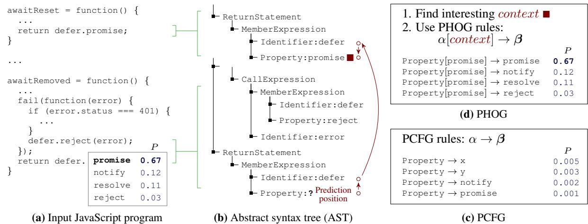

Pavol Bielik PAVOL.BIELIK@INF.ETHZ.CH Veselin Raychev VESELIN.RAYCHEV@INF.ETHZ.CH Martin Vechev MARTIN.VECHEV@INF.ETHZ.CH Department of Computer Science, ETH Zurich, Switzerland ¨

## Abstract

We introduce a new generative model for code called *probabilistic higher order grammar* (PHOG). PHOG generalizes probabilistic context free grammars (PCFGs) by allowing conditioning of a production rule beyond the parent non-terminal, thus capturing rich contexts relevant to programs. Even though PHOG is more powerful than a PCFG, it can be learned from data just as efficiently. We trained a PHOG model on a large JavaScript code corpus and show that it is more precise than existing models, while similarly fast. As a result, PHOG can immediately benefit existing programming tools based on probabilistic models of code.

## 1. Introduction

Recent years have seen an emerging interest in new kinds of software tools that learn probabilistic models from large codebases (e.g., GitHub) and use these models to provide probabilistic solutions to important programming tasks including code completion [\(Nguyen et al.,](#page-8-0) [2013;](#page-8-0) [Tu et al.,](#page-9-0) [2014;](#page-9-0) [Raychev et al.,](#page-8-0) [2014;](#page-8-0) [2016;](#page-9-0) [Nguyen & Nguyen,](#page-8-0) [2015\)](#page-8-0), statistical deobfuscation [\(Raychev et al.,](#page-9-0) [2015\)](#page-9-0), patch generation [\(Long & Rinard,](#page-8-0) [2016\)](#page-8-0), translation between languages [\(Allamanis et al.,](#page-8-0) [2015b;](#page-8-0) [Gvero & Kun](#page-8-0)[cak,](#page-8-0) [2015a;](#page-8-0) [Karaivanov et al.,](#page-8-0) [2014\)](#page-8-0), and others.

The core component underlying many of these tools is a probabilistic model of source code used to score the predictions. So far, most tools have focused on using either generic but relatively naive models such as PCFGs and n-grams [\(Gvero & Kuncak,](#page-8-0) [2015b;](#page-8-0) [Raychev et al.,](#page-8-0) [2014\)](#page-8-0) which can suffer from loss of precision, or have built task-specific, carefully engineered (usually discriminative) models, with limited applicability and reuse across tasks [\(Long & Rinard,](#page-8-0) [2016;](#page-8-0) [Raychev et al.,](#page-9-0) [2015\)](#page-9-0).

This Work We present a generative probabilistic model of code which addresses a key challenge of coming up with scalable and precise probabilistic models that are reusable across different tasks and programming languages. The model is based on a new concept we call a *probabilistic higher order grammar (PHOG)*. PHOG cleanly generalizes PCFGs by conditioning the production rules not only on a (static) parent non-terminal, but also on a context that is dynamically obtained by navigating an abstract syntax tree. This navigation takes place by executing a function on the current tree, where the function itself is learned from data. PHOG has a number of benefits:

*Efficient Learning*: Even though PHOG generalizes PCFGs, it can be trained just as efficiently as PCFGs and n-gram models (by simply counting production rules). PHOG provides a valid probability distribution without an expensive to compute partition function.

*Flexible Representation*: Because the rules of PHOG are parameterized on a (learned) function, it means that for each program, the representation upon which the prediction is made is determined *dynamically* and is not hard-coded as in prior work [\(Raychev et al.,](#page-8-0) [2014;](#page-8-0) [Hindle et al.,](#page-8-0) [2012\)](#page-8-0). This is important, as finding the right program representation over which the probabilistic model is learned is key to the overall model precision. That is, at prediction time, PHOG is able to automatically select the suitable features.

*Widely Applicable*: As PHOG operates on parse trees it can be learned over any programming language that provides a parser and we believe that it has the potential to be useful even in scenarios beyond programs (e.g., natural language).

We provide a two-step training procedure that first learns the underlying HOG followed by maximum likelihood estimation (via counting) to generate its probabilistic version (PHOG). We evaluate PHOG on a large and diverse corpus of JavaScript code containing 150,000 files and find PHOG to perform better than widely-used state-of-the-art models by: (i) assigning higher probabilities to existing JavaScript programs outside our training set, and (ii) achieving lower error rate on specific tasks (e.g., code completion).

*Proceedings of the* 33 rd *International Conference on Machine Learning*, New York, NY, USA, 2016. JMLR: W&CP volume 48. Copyright 2016 by the author(s).

<span id="page-1-0"></span>

Figure 1. Example JavaScript code with position at which a probabilistic model for code makes a prediction.

## 2. PHOG: An Illustration

In this section, we illustrate the intuition behind PHOG on a running example. In later sections, we provide formal definitions for the various concepts. Consider the JavaScript code fragment shown in Fig. 1 (a). The code is parsed by a *context-free grammar* (CFG) in order to obtain an *abstract syntax tree* (AST), shown in Fig. 1 (b). Now, consider the last statement in Fig. 1 (a) that returns a property of the defer object. The JavaScript CFG permits any valid identifier here, yet not every identifier would produce a desirable program. In a box akin to a code completion window, we show some reasonable values for which property should be returned along with their probabilities.

The Problem of CFGs and PCFGs Context-free grammars are useful for parsing, but they are less effective when it comes to assessing program correctness. As a result, many programs that successfully parse are incorrect and undesired by users. A probabilistic version of a contextfree grammar (PCFG) takes every production rule of a CFG and learns the frequency with which it is used in the training data. In Fig. 1 (c), we show possible learned rules for object property names along with their probabilities. In the JavaScript CFG, each rule selects an object property only based on the fact that it is an object Property without taking into account any information about the object itself. As a result, the PCFG probability estimates in Fig. 1 (c) are poor: the most likely suggestions generate an undesirable program.

The Need for Better Conditioning To counter this problem of CFGs, in this work we define a grammar that conditions its production rules not only on the current nonterminal symbol. In Fig. 1 (d), we show a conditioning that predicts an object property by finding a place in the code where it was used in the same context (a return statement with the same variable), and then including the property used there as conditioning context (arrows show movement over the AST that leads to computing this context). Using this insight, we define a new grammar called HOG where on the left side of the production rule instead of using only a non-terminal α, we use a non-terminal parameterized by context. In Section [3](#page-2-0) we show that a HOG is more powerful than a CFG and can parse languages beyond the capabilities of context-sensitive grammars. Then, we define a probabilistic version of a HOG called PHOG. Since this new grammar is much better conditioned than a PCFG, the probability estimates of a PHOG in Fig. 1 (d) are more realistic and the correct property used in this code is ranked first in terms of probability.

Finding the Best Conditioning Once we know how to compute context, training a PHOG is easy and similar to training a PCFG: counting the ratio of the cases from the training data in which a production rule with the given left-hand side was applied. Computing probabilities with PHOG is also very efficient and involves only a lookup of this ratio. However, arriving at the insight for how to compute the best context is non-trivial. Previous works have suggested use of hard-coded models that are a special case of a PHOG and condition on a fixed, statically determined context. For example, the (fixed) context can be tokens preceding the completion position at which the production rule is applied [\(Allamanis et al.,](#page-8-0) [2015b\)](#page-8-0) or the API call preceding this position [\(Raychev et al.,](#page-8-0) [2014\)](#page-8-0). In this work, we propose a more general approach, one that searches for functions from a domain specific language (DSL) which given a tree, return a conditioning context. The optimization problem is then to select a function for which the resulting PHOG maximizes the probability of the dataset.

<span id="page-2-0"></span>During learning, we discover programs that describe how to effectively condition (as illustrated in Fig. [1](#page-1-0) (b,d)) in order to predict any terminal or non-terminal symbols from a context-free grammar. Thus, our learning procedure effectively builds a PHOG from a CFG (for a given programming language).

# 3. Probabilistic Higher Order Grammar

In this section we define a new type of grammar called a Higher Order Grammar (HOG) and its probabilistic version (PHOG). The key concept behind PHOG is to replace the left side of the production rule: a fixed non-terminal is replaced by a non-terminal that is parameterized by a context computed as a result of evaluating a function (thus the term higher-order). This introduces a level of indirection and allows us to specify rich contexts for a given production rule by defining the function appropriately. As we will see, a standard CFG is a special case in our grammar.

We begin by providing the standard definition of a tree followed by partial trees (needed for defining HOG).

Definition 3.1 (Tree). *A tree* T *is a tuple* (X, x0, ξ) *where* X *is a finite set of nodes,* x<sup>0</sup> ∈ X *is the root node and* ξ : X → X<sup>∗</sup> *is a function that given a node returns a list of its children. In a tree every node except the root appears exactly once in all the lists of children.*

Let Trees be the set of all trees. Next, we define partial tree T0..k ∈ Trees as a subtree of T ∈ Trees that includes all nodes to the left of and above x<sup>k</sup> in T. To proceed formally, assume the nodes X of tree T = (X, x0, ξ) are ordered in a sequence x0, x1, ..., xn−<sup>1</sup> where the root is first and all nodes are sequentially numbered in a depth-first left-toright traversal order. Then:

Definition 3.2 (Partial tree). *A partial tree* T0..k = (X<sup>0</sup> , x0, ξ<sup>0</sup> ) *of a tree* T = (X, x0, ξ) *(with* 0 ≤ k < |X|*) is a tree where* X<sup>0</sup> = {x0, x1, ..., xk}*,* ξ 0 (x 0 ) = ( x | x ∈ ξ(x 0 ), x ∈ X<sup>0</sup> )*, and* ξ 0 (xk) = *.*

Next, we define our higher-order grammar HOG.

Definition 3.3 (HOG). *A higher-order grammar (HOG) is the tuple* (N, Σ, s, C, R, p) *where* N *is a set of nonterminal symbols,* Σ *is a set of terminal symbols,* s ∈ N *is a start symbol,* C *is referred to as a conditioning set,* R *is a set of rules of the form:* α[γ] → β1...β<sup>n</sup> *where* α ∈ N*,* γ ∈ C*, and* β<sup>i</sup> ∈ N ∪Σ *for* i ∈ [1..n]*. Note that there might be multiple rules with same left hand side (e.g.,* α[γ] → β *and* α[γ] → β 0 *). Finally,* p: Trees → C*.*

That is, the definition of HOG is the same as a context-free grammar except that the left hand side of a production rule is now parameterized with a context γ that is computed by applying function p on a (partial) tree generated so far. This function allows us to cleanly condition the expansion of a production rule on richer information than the parent nonterminal as in CFGs (learning of the function p is described in Section [4\)](#page-3-0). Note that we do not require a finite set of rules R but only that for every choice of α and γ, there is a finite number of possible outcomes β1...β<sup>n</sup> (denoted as β).

Example An example of a HOG is shown in Fig. [1](#page-1-0) (d) (ignore the probabilities for now). The figure shows four rules where the non-terminal is Property and there are four terminals, one on the right side of each rule. Here, there is a single context promise (we have not shown the function p which generated the context for each rule).

The connection between the domain of the function p (i.e., partial trees), its result (i.e., a context) and the product rules is made explicit in the semantics of HOG, described next.

Semantics of HOG We now define what it means for a HOG to accept a tree. A HOG (N, Σ, s, C, R, p) accepts a tree T = (X, x0, ξ) with nodes X = {x0, ..., xn} if there exists a function σ : X → Σ ∪ N where for all x<sup>k</sup> ∈ X:

- 1. if ξ(xk) = xa<sup>1</sup> ...xa<sup>n</sup> (n ≥ 1), then σ(xk) ∈ N such that: there exists a rule α[p(T0..k)] → β1...β<sup>n</sup> ∈ R with σ(xk) = α and ∀i ∈ [1..n]. σ(xa<sup>i</sup> ) = β<sup>i</sup> .
- 2. if ξ(xk) = then σ(x) ∈ Σ.

Informally, the above definition states that an internal node in the tree is expanded according to the grammar rules while the leafs are terminals. The expansion of an internal node is such that first, the function p is evaluated on the partial tree at that node, obtaining a context then used to condition the rule. A definition for the standard CFG semantics is the same as above, except that each rule only conditions on the parent non-terminal x<sup>k</sup> and not p(T0..k).

### 3.1. Expressiveness of HOG

An important property of a HOG is that every tree it accepts is also accepted by a corresponding CFG from which the HOG was obtained. This is important because in the setting of programs we are normally given a CFG of the programming language and want to make sure that any program generated by HOG (and later its probabilistic version) is parsable by that CFG.

Theorem 1. *Let* G<sup>H</sup> = (N, Σ, s, C, R, p) *be a HOG. Let* R<sup>0</sup> *be a set of rules such that for every* α[γ] → β ∈ R *there is a rule* α → β ∈ R<sup>0</sup> *. Then* G<sup>C</sup> = (N, Σ, s, R<sup>0</sup> ) *is a CFG that accepts any tree* T = (X, x0, ξ) *accepted by* GH*.*

*Proof sketch:* We must show that the σ function defined for G<sup>H</sup> satisfies the similar definition for a CFG G<sup>C</sup> . The second case in the definition of σ is the same for a PHOG and a CFG. Consider the first case. Then ξ(xk) = x<sup>a</sup><sup>1</sup> ...x<sup>a</sup>n

<span id="page-3-0"></span>(n ≥ 1) and σ(xk) ∈ N. It follows that there exists a rule α[p(T0..k)] → β1...β<sup>n</sup> ∈ R with σ(xk) = α and ∀i ∈ [1..n].σ(xa<sup>i</sup> ) = β<sup>i</sup> . Then α → β1...β<sup>n</sup> ∈ R<sup>0</sup> and the first condition of σ for G<sup>C</sup> is also satisfied.

Additionally, we note that HOG is at least as expressive as context-sensitive grammars since HOG can trivially express any left context-sensitive language (by simply setting the conditioning set γ to a prefix of desired length) which are equivalent to full context-sensitive grammars [\(Pentto](#page-8-0)[nen,](#page-8-0) [1974\)](#page-8-0). Further, since we do not restrict the function p, our conditioning allows for HOG grammars that can generate the a nb nc nd <sup>n</sup> language, which is outside the class of context sensitive grammars.

#### 3.2. Probabilistic HOG

We next define PHOG, the probabilistic version of HOG.

Definition 3.4 (PHOG). *A probabilistic higher order grammar is a tuple* (G, q) *where* G = (N, Σ, s, C, R, p) *is a HOG and* q : R → R <sup>+</sup> *scores rules such that they form a probability distribution, i.e.,* ∀α ∈ N, γ ∈ C*:*

$$\sum\_{\alpha[\gamma]\to\beta\in R} q(\alpha[\gamma]\to\beta) = 1$$

Here, R <sup>+</sup> denotes the set of non-negative real numbers. The above definition ensures that for a given context, the available rules at a non-terminal sum to one. Note that if we eliminate γ, we will obtain the definition of a PCFG.

Example An example of a PHOG is shown in Fig. [1](#page-1-0) (d). Here, each rule is assigned some probability (we do not show all of the rules for the non-terminal Property and context promise).

To define the probability of a tree according to PHOG, we use a helper function ρ: X → R ∪ {⊥} which maps an internal node to the production rule that expanded it. That is, ρ(x) returns the rule α → β ∈ R that was applied in case 1 of defining the semantics of HOG. Then, given a parse tree T = (X, x0, ξ) and a PHOG (G, q), we define the probability of a tree T in (G, q) as follows:

$$Pr(T) = \prod\_{x\_i \in X, \sigma(x\_i) \in N} q(\rho(x\_i))$$

That is, for all non-terminal nodes, we multiply the probabilities associated with the rules that expanded each node.

Efficient Training An important property of PHOG is that it can be trained efficiently. That is, despite the added expressiveness, its training follows the same procedure as PCFGs: counting the production rules applied to generate the training data. Counting can be done since the HOG

```
TCOND ::=  | WriteOp TCO N D| MoveOp TCO N D
WriteOp ::= WriteValue | WritePos | WriteType
 MoveOp ::= Up | Left | Right | DownFirst | DownLast |
       NextDFS | NextLeaf | PrevDFS | PrevLeaf |
       PrevNodeType | PrevNodeValue | PrevNodeContext
```
Figure 2. The TCOND language for extracting context from trees.

production rules are non-ambiguous when the corresponding CFG rules are non-ambiguous. Note, however, that this training assumes that the production rules are already given. As opposed to a PCFG where the production rules are typically provided by an expert, learning the production rules for a PHOG is a non-trivial task as it involves learning the parametric part γ of each production rule (which can range over an infinite set). In the next section, we discuss how to learn the production rules from data.

## 4. Learning PHOG

The learning of a PHOG is done in two steps. First, we learn the function p that parameterizes the HOG and then we learn the weights of the rules in PHOG. This is in contrast to previous n-gram or PCFG models that only perform the second step of learning rule weights.

#### 4.1. TCOND Language

To learn useful PHOGs we adopt a domain specific language called TCOND similar to [\(Raychev et al.,](#page-9-0) [2016\)](#page-9-0) for writing programs that describe the conditioning context function p.

The TCOND language summarized in Fig. 2 is a language for traversing (partial) trees and accumulating context with values from the tree during the traversal. The trees we consider are organized as ASTs for which every node has a type (essentially the non-terminal symbol) and some of them have a value – the terminal symbol under it. Such a tree is shown in Fig. [1](#page-1-0) (b) where type and value are separated by ":". TCOND consists of two basic kinds of instructions MoveOp and WriteOp. Move instructions facilitate tree traversal by moving the current position in the tree to the parent node (Up), left and right siblings (Left, Right), first and last child (DownFirst, DownLast), previous and next node in depth first search traversal order (PrevDFS, NextDFS), previous and next leaf node (PrevLeaf, NextLeaf), previous node with the same type or value (PrevNodeType, PrevNodeValue) and finally to the previous node where the parent and grandparent have the same type and values (PrevNodeContext). The write instructions WriteType, WriteValue and WritePos append facts about the currently visited node to the accumulated context by writing the type, value and position of the node in the parent respectively.

TCOND functions operate on a state defined as ht, n, ctxi ∈ P artialT ree × X × C where t is a partial tree, n is the current position in the tree and ctx accumulates the context γ used to parameterize PHOG production rules. The accumulated context γ ∈ C = (N ∪Σ∪N) <sup>∗</sup> by a TCOND function is a sequence of observations on the partial tree where each observation can be a non-terminal from N, a terminal from Σ or a natural number from N. Initially, execution starts with the empty observation list [] ∈ C and instructions from the function are executed and each WriteOp instruction appends to the observation list.

Example: Consider the following TCOND function pobj :

#### PrevDFS PrevNodeContext NextDFS WriteValue

executed on the example in Fig. [1\(](#page-1-0)b). The arrows in Fig. [1](#page-1-0) (b) trace the execution of this function. Execution starts at the position where JavaScript object property is to be predicted. The first instruction moves to the receiver object defer, the second instruction moves to the previous location where the same receiver is used in a return statement, the third instruction moves to the property used at this statement and finally, the name of the property (promise) is recorded in the context used by the PHOG rules.

Note that pobj is good for predicting object properties, but a different TCOND function may be good for predicting integer constants. Thus, the overall learned function p upon which a PHOG is parameterized is simply a switch statement on the type of α used in the rules, where each case in the switch is a function from the TCOND language. As a result, each rule α[γ] → β in the grammar uses a different case of the switch statement of p depending on α.

#### 4.2. From TCOND Function and Data to PHOG

Finally, once a function p ∈ TCOND is given, we can build a PHOG from p and data that consists of parsed AST trees. For every production rule α → β at node x<sup>k</sup> in tree T of the training data, we compute α[γ] where γ is obtained as the result of applying p on T0..k starting at position k. Subsequently we train a PHOG (G, q) by counting as:

$$q(\alpha[\gamma] \to \beta) = \frac{Count(\alpha[\gamma] \to \beta)}{Count(\alpha[\gamma])}$$

Smoothing A common issue inherent to learning probabilistic language models is adjusting the maximum likelihood estimation by taking into account data sparseness. This is critical in improving the overall precision of the system as otherwise the model becomes overconfident in predictions based on rarely seen conditioning sets (by assigning them high probability) and conversely can completely reject unseen contexts (by assigning them zero probability). To deal with data sparseness we use both modified Kneser-Ney smoothing [\(Chen & Goodman,](#page-8-0) [1998\)](#page-8-0) as well as Witten-Bell interpolation smoothing [\(Witten & Bell,](#page-9-0) [1991\)](#page-9-0). In both cases the backoff order is the order in which features were added to the context when executing p.

#### 4.3. Learning of TCOND Functions

To obtain the best PHOG grammar, we learn the respective TCOND function by solving the following optimization problem:

$$p\_{best} = \underset{p \in \text{TCON}}{\text{arg}\min} \, cost(D, p)$$

where cost(D, p) = −logprob(D, p) + λ · Ω(p). Here logprob(D, p) is the log-probability of the trained models on a subset D of the training dataset used for learning the function and Ω(p) is a regularization that penalizes overly complex functions in order to avoid over-fitting to the data. We instantiate Ω(p) to return the number of instructions.

We use a combination of two techniques to solve this optimization problem and find p ≈ best – an *exact* enumeration and *approximate* genetic programming search. Since the number of functions in enumerative search is exponential we use it only on short functions with up to 5 instructions. The resulting functions serve as a starting population for a follow-up genetic programming search. The genetic programming search proceeds in several epochs, where in each epoch we mutate random instructions in the functions from the population in order to obtain a new set of candidate functions added to the population. Candidate functions are scored and the worst of them are discarded. We do not apply a cross-over operation in the genetic search procedure. Overall, this search procedure explores ≈ 20, 000 functions out of which the best one is selected.

Scaling to Large Datasets In order for the learning procedure to explore large number of candidate programs in a reasonable time it is important the algorithm scales to large datasets (in our experiments |D| = 10<sup>8</sup> ) without the need to restrict how much data can be used for learning. To mitigate this problem, we use the representative dataset sampling technique [\(Raychev et al.,](#page-9-0) [2016\)](#page-9-0). The main idea is to select a small sample |d| |D| such that |cost(D, pi) − cost(d, pi)| ≤ for all previously generated programs p<sup>i</sup> . That is, evaluating programs on a small dataset d approximates evaluation on the full dataset D within error that is as small as possible.

## 5. Evaluation

This section provides an experimental evaluation of our approach. We compare the ability of a PHOG to score JavaScript programs and to predict program elements in unseen code. We also evaluate the speed of a PHOG. Experiments were done on a 32-core 2.13 GHz Xeon E7-4830 server with 256GB RAM and running Ubuntu 14.04.

Dataset The dataset for our experiments consists of JavaScript ASTs as defined by the ESTree specification.We used the Acorn parser to extract parse trees from the JavaScript files. In our experiments, we use a corpus of 150, 000 de-duplicated and non-obfuscated JavaScript files from GitHub [\(Raychev et al.,](#page-9-0) [2016\)](#page-9-0) 1 . Two thirds of the data is used for training and the remaining one third is used only for evaluation. Evaluation data was used as a blind set – no parameters were tweaked based on evaluation results.

From each JavaScript AST we generate multiple queries used for training and evaluation, one per AST node, by removing the node (plus its subtree and all nodes to the right of the query node) from the tree and then attempting to predict back the node. These queries correspond to various predictions for code completion in an intelligent IDE – for example completion of object property names as the developer types "." is already present in many IDEs. By taking all AST nodes, however, the queries also include predicting constants, variable names or non-terminal symbols in the AST. Our dataset consists of 1.07 · 10<sup>8</sup> queries used for training and 5.3 · 10<sup>7</sup> queries used for evaluation.

Evaluation Metrics We use standard metrics to evaluate different probabilistic models. These metrics also reflect the performance of a code completion application:

*Error rate* is the proportion of cases in which the most likely prediction was not equal to the removed node that was originally in the AST.

*Log-Probability* is an average of the base 2 logarithm of the probability per predicted AST node. Lower absolute value is better since this metric corresponds to (minus) the number of bits of information in every prediction. The metric captures not only the cases when the most probable prediction is correct, but also when the correct result is with high probability in the list of most likely predictions.

Program ASTs The ASTs include two kinds of nodes – non-terminals and terminals. There are 44 different non-terminals for JavaScript such as Identifier or BinaryExpr. Terminals on the other hand have a much larger range with 10<sup>9</sup> unique values in our corpus. A terminal may be any program identifier (e.g.jQuery), literal (e.g., 99), program operator (e.g., +, -, \*), etc. ASTs are structured such that one (possibly empty) terminal symbol is attached to every non-terminal symbol. Fig. [1](#page-1-0) (b) shows example pairs of non-terminals and terminals (":" is used as a separator if the terminal symbol is non-empty). 45% of the terminals in our corpus are empty, such as terminal for ReturnStatement as shown in Fig. [1](#page-1-0) (b).

To learn a complete PHOG for JavaScript, we learn

| Table 1. Evaluation of prediction for various JavaScript elements. |  |  |
|--------------------------------------------------------------------|--|--|
|                                                                    |  |  |

| MODEL            | LOG-PROBABILITY | ERROR RATE |
|------------------|-----------------|------------|
| NON-TERMINALS    |                 |            |
| PCFG             | -1.99           | 48.5%      |
| 3-GRAM           | -1.46           | 30.8%      |
| 10-GRAM          | -2.55           | 35.6%      |
| PHOG (this work) | -1.09           | 25.9%      |
| TERMINALS        |                 |            |
| PCFG             | -6.32           | 49.9%      |
| 3-GRAM           | -3.92           | 28.7%      |
| 10-GRAM          | -4.70           | 29.0%      |
| PHOG (this work) | -2.50           | 18.5%      |

TCOND functions that determine on what AST elements to condition each prediction. To predict node values, we learn a TCOND function depending on the parent non-terminal type. This is, we learn one TCOND function for predicting identifier names, another one for predicting number constants, etc. The final function p is a switch statement on the type of the parent non-terminal (as described earlier). For a fair comparison we apply the same procedure for all other models considered in the evaluation. Later in Table [2](#page-6-0) we evaluate these individual predictors separately.

#### 5.1. Model Precision

We start by comparing the precision of PHOG against the two most widely used probabilistic models of code – PCFGs and n-grams. Both models can be described by specific (non-optimal) conditioning TCOND functions as opposed to the best functions for a PHOG. PCFGs only condition on the parent non-terminal node. Similarly, ngram models condition on the n − 1 previous terminal and non-terminal symbols in the left-to-right AST traversal as used in Allamanis et al. [\(2015b\)](#page-8-0).

Table 1 shows the precision of the n-gram and PCFG models compared to PHOG. While widely used, PCFGs make incorrect predictions about both terminals and nonterminals in about half of the cases. Note that a large amount (45%) of terminals in the corpus are empty. Therefore, fewer than 10% of the terminals that are non-empty are predicted correctly by a PCFG. This is not surprising: predicting a constant, an object property name or a variable name can rarely be correct if the prediction is only conditioned on the fact it is a property or a constant.

The n-gram models are more precise than a PCFG and these models also allow various trade-offs via the model order parameter n. Increasing the value of n makes predictions to capture more context. However, for large values of n, the models suffer from data sparseness issues and overall have worse error rates.

<sup>1</sup><http://www.srl.inf.ethz.ch/js150.php>

<span id="page-6-0"></span>Table 2. Detailed breakdown of PHOG error rate when predicting terminal values of given type. The example completions show successful predictions made by our code completion system.

| VALUE TYPE  |     | ERROR RATE EXAMPLE COMPLETION |
|-------------|-----|-------------------------------|
| Identifier  |     |                               |
|             | 38% | contains = jQuery             |
| Property    | 35% | start = list.length           |
| String      | 48% | "[" + attrs + "]"             |
| Number      | 36% | canvas(xy[0], xy[1],          |
| RegExp      | 34% | line.replace(/(   )+/         |
| UnaryExpr   | 3%  | if (!events    !              |
| BinaryExpr  | 26% | while (++index < )            |
| LogicalExpr | 8%  | frame = frame                 |

The best PHOG model outperforms the n-grams and PCFG models on both evaluation metrics: PHOG makes significantly fewer errors and assigns higher probabilities to correct completions. As PHOG generalizes the n-gram and PCFG models, higher precision for a code completion task is unsurprising. Our experiments quantify the PHOG improvement – reducing the error rates by 5 − 10%.

In Table 2, we give detailed breakdown of the error rate for different completion tasks when performed by a PHOG. Out of these tasks, string constants and identifier names tend to be the most difficult to predict. Despite this large ratio of errors, the results are quite encouraging – the predictions range from a huge set of values, they are typically very program specific and a PHOG still manages to correctly predict more than half of them.

Finally, we also evaluated n-grams based on lexicalized representation of the program which corresponds to purely syntactical predictions that disregard any structure contained in the program AST. Such n-gram model achieves error rate 40.8% compared to error rate 33.5% of PHOG. Note that here we exclude empty terminal symbols as these are an artifact of the AST representation and are not present at syntactic source code level.

#### 5.2. Linear Models Based on Shallow Features

When creating new types of probabilistic models, a natural question is whether the same or better accuracy can be achieved by conventional state-of-the-art linear classifiers. Towards this, for every query in our training and evaluation data, we collected features that correspond to the 10 previous non-terminal and terminal symbols preceding the completion position in the parse tree.

Then, we trained linear classifiers (for each non-terminal type) that predict the corresponding terminal and nonterminal symbols based on these features. We used two Table 3. Error rate of linear models based on shallow features.

|             | ERROR RATE    |           |  |
|-------------|---------------|-----------|--|
| MODEL       | NON-TERMINALS | TERMINALS |  |
| NAIVE BAYES | 41.6%         | 45.8%     |  |
| SVM         | 32.5%         | 29.5%     |  |

Table 4. Training and query time comparison of various models.

| MODEL              | TRAINING TIME        | QUERIES PER SECOND |
|--------------------|----------------------|--------------------|
| PCFG<br>PHOG       | 1 MIN<br>162 + 3 MIN | 71, 000<br>50, 000 |
| N-GRAM             | 4 MIN                | 15, 000            |
| NAIVE BAYES<br>SVM | 3 MIN<br>36 HOURS    | 10, 000<br>12, 500 |
|                    |                      |                    |

kinds of linear classifiers: Na¨ıve Bayes classifier and Support Vector Machine (SVM). Since our training data is large, we used a fast online SVM algorithm. In addition, to make sure we make a fair comparison, we performed a grid-search for the parameters controlling regularization (L∞), the learning rate and the margin of the online SVM.

In Table 3 we summarize the precision of these linear models for predicting JavaScript code elements. In our experiments, SVMs predict program elements more accurately than the Na¨ıve Bayes classifier. However, the linear classifiers have higher error rates than our learned PHOG model both for terminal and non-terminal symbols. The reason for the better accuracy of the PHOG model is that it was capable of discovering long distance semantic relationships between program elements in the source code that cannot be learned by a linear classifier.

#### 5.3. Performance and Scalability

In Table 4 we summarize the speed for training and querying each of the models we considered. Training most models except SVM only involves counting the number of applied production rules (or features) in the training data and is fast – in fact faster than reading the input. Reading all 1.07 · 10<sup>8</sup> training samples takes 8 minutes. Additionally, training a PHOG involves the cost of learning the TCOND function that parameterizes the HOG, taking another 162 minutes. The SVM was quite slow to train because of the large number of possible labels – all terminal or nonterminal symbols are possible labels for the classifier.

Once the learning is done, all models are quite efficient to query with the PHOG model being about as fast as a PCFG. Note that, for performance reasons, Na¨ıve Bayes and SVM do not return probabilities at query time, only the best label (we use a beam of size 4 since the space of labels is large). Summary Overall, our evaluation shows that our best PHOG model for JavaScript predicts program elements more accurately than existing PCFGs and n-gram models while having similar query times. The price paid is another 162 minutes at training time to discover the HOG rules. As a result, we believe that PHOG can immediately benefit existing programming tools based on probabilistic models.

## 6. Related Work

In this section we review existing techniques for building probabilistic models of code – n-gram models, model based on probabilistic grammars and log-bilinear models.

N-gram Models The most popular and widely used probabilistic model of code is the n-gram model, due to its simplicity and efficient learning (first explored by Hindle et al., [\(2012\)](#page-8-0) for modelling source code). Although the model used by Hindle is based on a syntactic representation of the code (e.g., including tokens such as (,) or ;), it was a promising first step in finding regularities in natural code. Shortly after, various improvements of the representation over which the model is learned were proposed including structural and data dependencies [\(Nguyen et al.,](#page-8-0) [2013\)](#page-8-0) and defining task specific abstractions [\(Allamanis et al.,](#page-8-0) [2014;](#page-8-0) [Raychev et al.,](#page-8-0) [2014\)](#page-8-0). Additionally, to address some of the n-gram limitations, several extensions were developed such as modeling local and global context [\(Tu et al.,](#page-9-0) [2014\)](#page-9-0) or including topic models [\(Nguyen et al.,](#page-8-0) [2013\)](#page-8-0).

In contrast, this work defines a new probabilistic model that is more precise than the n-gram model and with a similar training procedure. This is because the n-gram model can be seen as a hard-coded TCOND function. Further, we can easily change the parameterization of PHOG by varying the choice of the domain specific language. We note that we can incorporate any of the above n-gram extensions as these do not require the underlying model to be n-gram.

Probabilistic Grammars Another line of work considers probabilistic grammars, typically a PCFG, with various extensions built on top. A close work from the domain of natural language processing are lexicalized grammars, such as those produced by annotating the non-terminals with summaries of decision sequences used to generate the tree so far [\(Collins,](#page-8-0) [2003\)](#page-8-0). Instead, in our work we parametrize the production rules of the grammar and phrase the task of finding best parametrization as an optimization problem.

Additionally, several approaches have been developed to improve the precision specifically in the domain of modelling source code. To capture code idioms, [\(Allamanis](#page-8-0) [& Sutton,](#page-8-0) [2014\)](#page-8-0) use probabilistic tree substitution grammars which extend a PCFG with production rules that allow tree fragments on the right-hand side. Gvero et al., [\(2015a\)](#page-8-0) augment grammar production rules with additional semantic checks that allow picking local variables in the current scope. Similarly, to model code locality and code reuse, various extensions were proposed that incorporate the context of the already generated AST by extending a PCFG with traversal variables [\(Maddison & Tarlow,](#page-8-0) [2014\)](#page-8-0) and using adaptor grammars with a cache [\(Liang et al.,](#page-8-0) [2010\)](#page-8-0).

These extensions are applicable to PHOG and are mainly orthogonal to our work. Instead, we focus on a probabilistic model which can be used as a more precise basic building block that can replace the PCFG used in the above works.

Log-bilinear Models An alternative model to n-grams and probabilistic grammars is a log-bilinear model. This model is especially suited when we have a large set of features and the goal is to learn optimal weights per feature that reveal which features are relevant for the prediction. Such features are either simply generated (e.g, previous 10 non-terminals and terminals [\(Allamanis et al.,](#page-8-0) [2015b\)](#page-8-0)) or manually designed for a given task (e.g., 17 features relevant for name prediction [\(Allamanis et al.,](#page-8-0) [2015a\)](#page-8-0)).

PHOG is as expressive as log-bilinear models as it can easily encode any features via additional instructions in the TCOND language. However, PHOG is orders of magnitude faster to train and provides an easy to compute valid probability distribution. Further, instead of supplying the features manually, we learn these automatically, which is especially useful when training generic models of a full scale programming language. This is important and as illustrated in our experiments, PHOG achieved lower error rate (by 5% to 10%) compared to models trained on shallow features (considered in [\(Allamanis et al.,](#page-8-0) [2015b\)](#page-8-0)).

# 7. Conclusion

We presented a new generative probabilistic model of code called a probabilistic higher order grammar (PHOG). The key idea behind PHOG is to parameterize the production rules of the grammar on a powerful context obtained as a result of executing a function learned from data.

We also presented a two step procedure for learning PHOG from data. PHOG cleanly generalizes classic PCFGs and enables more precise predictions, yet is similarly efficient to use and learn from data.

We evaluated PHOG on a large corpus of JavaScript programs and showed that PHOG is more precise at predicting program elements than state-of-the-art probabilistic models.

As a result, PHOG can be a fundamental building block for emerging tools based on probabilistic models of code and beyond, enabling precision not possible otherwise.

## <span id="page-8-0"></span>Acknowledgements

We thank Nico S. Gorbach and the anonymous reviewers for providing us useful feedback on drafts of this paper.

## References

- Allamanis, Miltiadis and Sutton, Charles. Mining idioms from source code. In *Proceedings of the 22nd ACM SIG-SOFT International Symposium on Foundations of Software Engineering*, FSE 2014, pp. 472–483, New York, NY, USA, 2014. ACM. ISBN 978-1-4503-3056-5.
- Allamanis, Miltiadis, Barr, Earl T., Bird, Christian, and Sutton, Charles. Learning natural coding conventions. In *Proceedings of the 22Nd ACM SIGSOFT International Symposium on Foundations of Software Engineering*, FSE 2014, pp. 281–293, New York, NY, USA, 2014. ACM. ISBN 978-1-4503-3056-5.
- Allamanis, Miltiadis, Barr, Earl T., Bird, Christian, and Sutton, Charles. Suggesting accurate method and class names. In *Proceedings of the 2015 10th Joint Meeting on Foundations of Software Engineering*, ESEC/FSE 2015, pp. 38–49, New York, NY, USA, 2015a. ACM. ISBN 978-1-4503-3675-8.
- Allamanis, Miltiadis, Tarlow, Daniel, Gordon, Andrew D., and Wei, Yi. Bimodal modelling of source code and natural language. In Bach, Francis R. and Blei, David M. (eds.), *ICML*, volume 37 of *JMLR Proceedings*, pp. 2123–2132. JMLR.org, 2015b.
- Chen, Stanley F. and Goodman, Joshua. An empirical study of smoothing techniques for language modeling. Technical report, Harvard University, 1998.
- Collins, Michael. Head-driven statistical models for natural language parsing. *Comput. Linguist.*, 29(4):589– 637, December 2003. ISSN 0891-2017. doi: 10.1162/ 089120103322753356.
- Gvero, Tihomir and Kuncak, Viktor. Synthesizing java expressions from free-form queries. In *Proceedings of the 2015 ACM SIGPLAN International Conference on Object-Oriented Programming, Systems, Languages, and Applications, OOPSLA 2015, part of SLASH 2015, Pittsburgh, PA, USA, October 25-30, 2015*, pp. 416–432, 2015a.
- Gvero, Tihomir and Kuncak, Viktor. Interactive synthesis using free-form queries. In *Proceedings of the 37th International Conference on Software Engineering - Volume 2*, ICSE '15, pp. 689–692, Piscataway, NJ, USA, 2015b. IEEE Press.
- Hindle, Abram, Barr, Earl T., Su, Zhendong, Gabel, Mark, and Devanbu, Premkumar. On the naturalness of software. In *Proceedings of the 34th International Conference on Software Engineering*, ICSE '12, pp. 837–847, Piscataway, NJ, USA, 2012. IEEE Press. ISBN 978-1- 4673-1067-3.
- Karaivanov, Svetoslav, Raychev, Veselin, and Vechev, Martin T. Phrase-based statistical translation of programming languages. In *Onward! 2014, Proceedings of the 2014 ACM International Symposium on New Ideas, New Paradigms, and Reflections on Programming & Software, part of SLASH '14, Portland, OR, USA, October 20-24, 2014*, pp. 173–184, 2014.
- Liang, Percy, Jordan, Michael I., and Klein, Dan. Learning programs: A hierarchical bayesian approach. In *Proceedings of the 27th International Conference on Machine Learning (ICML-10), June 21-24, 2010, Haifa, Israel*, pp. 639–646, 2010.
- Long, Fan and Rinard, Martin. Automatic patch generation by learning correct code. In *Proceedings of the 43rd Annual ACM SIGPLAN-SIGACT Symposium on Principles of Programming Languages*, POPL 2016, pp. 298–312, New York, NY, USA, 2016. ACM. ISBN 978-1-4503- 3549-2.
- Maddison, Chris J. and Tarlow, Daniel. Structured generative models of natural source code. In *Proceedings of the 31th International Conference on Machine Learning, ICML 2014, Beijing, China, 21-26 June 2014*, pp. 649– 657, 2014.
- Nguyen, Anh Tuan and Nguyen, Tien N. Graph-based statistical language model for code. In *Proceedings of the 37th International Conference on Software Engineering - Volume 1*, ICSE '15, pp. 858–868, Piscataway, NJ, USA, 2015. IEEE Press. ISBN 978-1-4799-1934-5.
- Nguyen, Tung Thanh, Nguyen, Anh Tuan, Nguyen, Hoan Anh, and Nguyen, Tien N. A statistical semantic language model for source code. In *Proceedings of the 2013 9th Joint Meeting on Foundations of Software Engineering*, ESEC/FSE 2013, pp. 532–542, New York, NY, USA, 2013. ACM. ISBN 978-1-4503-2237-9.
- Penttonen, Martti. One-sided and two-sided context in formal grammars. *Information and Control*, 25(4):371 – 392, 1974. ISSN 0019-9958.
- Raychev, Veselin, Vechev, Martin, and Yahav, Eran. Code completion with statistical language models. In *Proceedings of the 35th ACM SIGPLAN Conference on Programming Language Design and Implementation*, PLDI '14, pp. 419–428, New York, NY, USA, 2014. ACM. ISBN 978-1-4503-2784-8.
- <span id="page-9-0"></span>Raychev, Veselin, Vechev, Martin, and Krause, Andreas. Predicting program properties from "big code". In *Proceedings of the 42nd Annual ACM SIGPLAN-SIGACT Symposium on Principles of Programming Languages*, POPL '15, pp. 111–124. ACM, 2015. ISBN 978-1-4503- 3300-9.
- Raychev, Veselin, Bielik, Pavol, Vechev, Martin, and Krause, Andreas. Learning programs from noisy data. In *Proceedings of the 43rd Annual ACM SIGPLAN-SIGACT Symposium on Principles of Programming Languages*, POPL 2016, pp. 761–774, New York, NY, USA, 2016. ACM. ISBN 978-1-4503-3549-2.
- Tu, Zhaopeng, Su, Zhendong, and Devanbu, Premkumar. On the localness of software. In *Proceedings of the 22Nd ACM SIGSOFT International Symposium on Foundations of Software Engineering*, FSE 2014, pp. 269–280, New York, NY, USA, 2014. ACM. ISBN 978-1-4503- 3056-5.
- Witten, Ian H. and Bell, Timothy C. The zero-frequency problem: Estimating the probabilities of novel events in adaptive text compression. *IEEE Transactions on Information Theory*, 37(4):1085–1094, 1991.