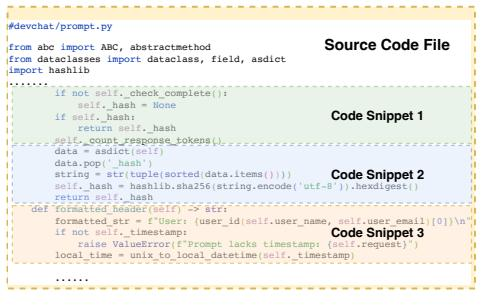
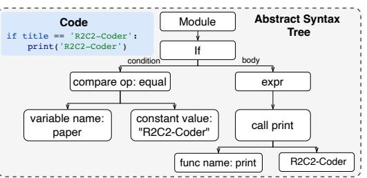
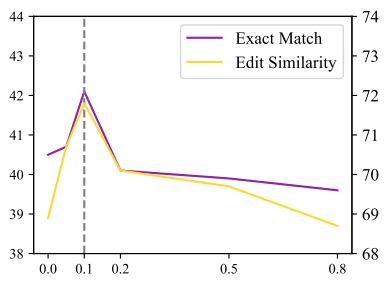
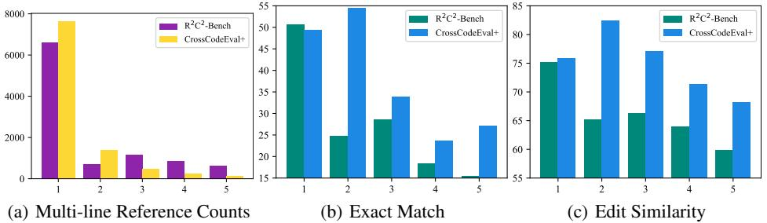
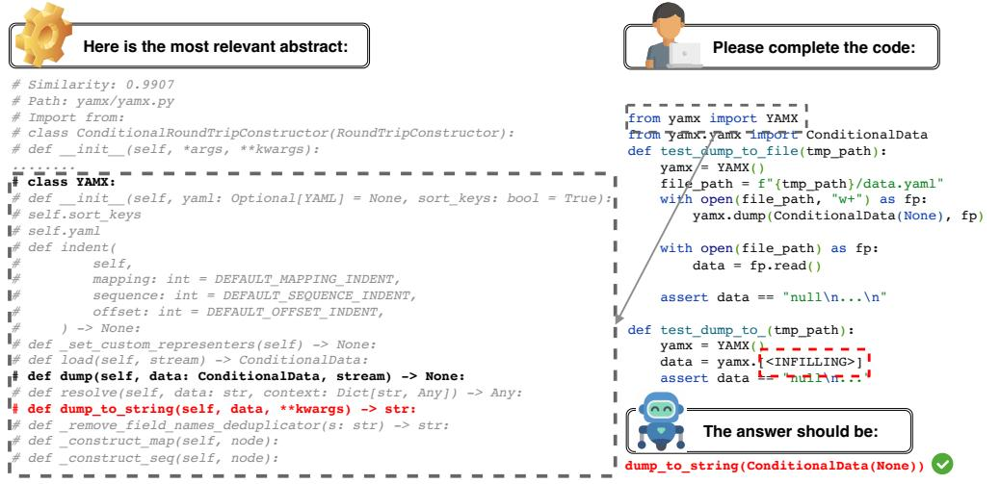
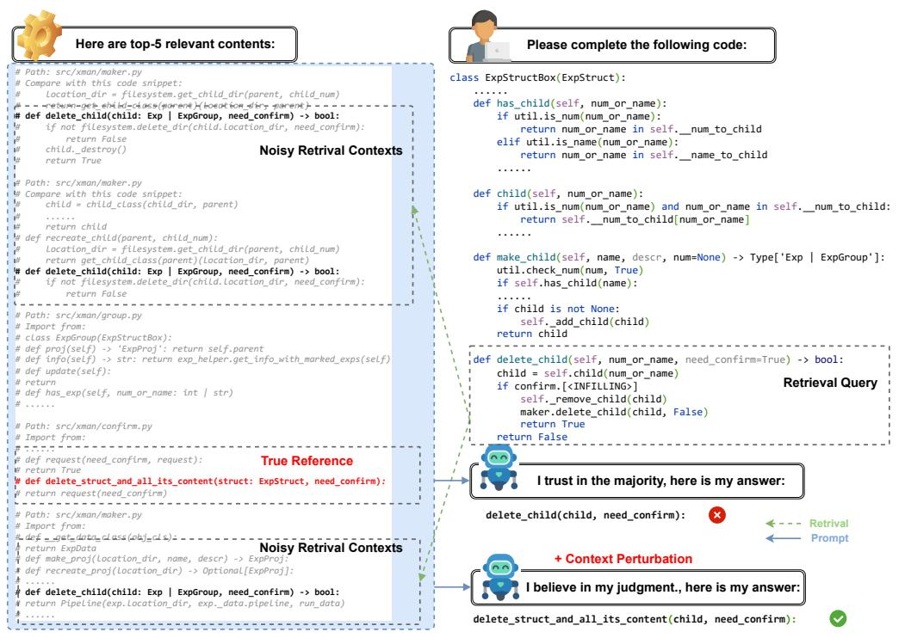
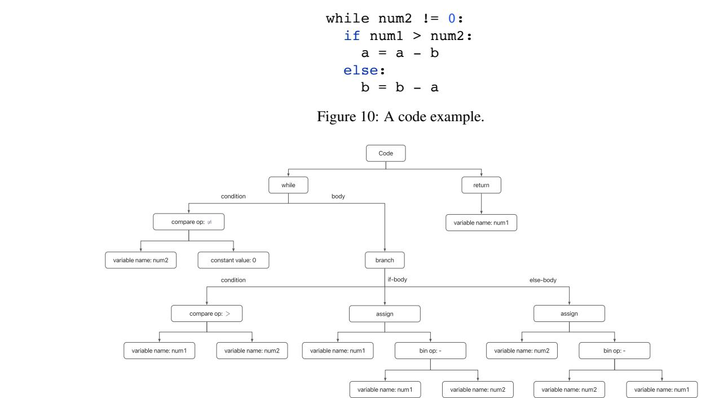

#### R 2C 2 -Coder: Enhancing and Benchmarking Real-world Repository-level Code Completion Abilities of Code Large Language Models

Ken Deng\*, Jiaheng Liu\*† , He Zhu\*, Congnan Liu, Jingxin Li, Jiakai Wang, Peng Zhao, Chenchen Zhang, Yanan Wu, Xueqiao Yin, Yuanxing Zhang, Wenbo Su, Bangyu Xiang, Tiezheng Ge, Bo Zheng Alibaba Group {dengken.deng, ljh411989}@taobao.com

## Abstract

Code completion models have made significant progress in recent years. Recently, repository-level code completion has drawn more attention in modern software development, and several baseline methods and benchmarks have been proposed. However, existing repository-level code completion methods often fall short of fully using the extensive context of a project repository, such as the intricacies of relevant files and class hierarchies. Besides, the existing benchmarks usually focus on limited code completion scenarios, which cannot reflect the repository-level code completion abilities well of existing methods. To address these limitations, we propose the R<sup>2</sup>C 2 -Coder to enhance and benchmark the real-world repository-level code completion abilities of code Large Language Models, where the R<sup>2</sup>C 2 -Coder includes a code prompt construction method R<sup>2</sup>C 2 -Enhance and a well-designed benchmark R<sup>2</sup>C 2 -Bench. Specifically, first, in R<sup>2</sup>C 2 -Enhance, we first construct the candidate retrieval pool and then assemble the completion prompt by retrieving from the retrieval pool for each completion cursor position. Second, based on R 2C 2 -Enhance, we can construct a more challenging and diverse R<sup>2</sup>C 2 -Bench with training, validation and test splits, where a context perturbation strategy is proposed to simulate the real-world repository-level code completion well. Extensive results on multiple benchmarks demonstrate the effectiveness of our R<sup>2</sup>C 2 -Coder.

## 1 Introduction

Large Language Models for Code (Code LLMs), such as Codex [\[12\]](#page-10-0), CodeGen [\[40,](#page-11-0) [41\]](#page-12-0), and Star-Coder [\[32\]](#page-11-1), have shown their power to enhance developer productivity as their promising results in code completion [\[4,](#page-9-0) [5,](#page-9-1) [12,](#page-10-0) [39\]](#page-11-2). Besides, to evaluate these models in real-world scenarios, multiple code completion benchmarks are proposed. Recently, the challenging repository-level code completion has drawn more attention, where the extensive cross-file dependencies (i.e., contextual information from other code files within the same repository) are used to enhance the completion performance. Therefore, a direct but complex solution is to enhance the context length of LLMs [\[13,](#page-10-1) [14,](#page-10-2) [43\]](#page-12-1). Nonetheless, increasing the context length significantly raises costs and is not affordable, especially concerning the large number of files in a given repository. Hence, several recent baseline methods [\[16,](#page-10-3) [37\]](#page-11-3) apply the widely-used Retrieval-Augmented Generation (RAG) strategy by retrieving the most relevant code snippets to improve the repository-level code completion.

<sup>\*</sup> First three authors contributed equally.

<sup>†</sup> Corresponding Author: Jiaheng Liu.

However, this vanilla strategy exhibits significant limitations. First, it usually preprocesses the source code files into code snippets under a repository in Fig. [1,](#page-1-0) and performs retrieval on these code fragments for retrieval query. However, these fragments only preserve local and discrete information and fail to cover more diverse and fundamental contexts of program semantics, such as the intricate network of dependencies, shared utility functions, definition of the input and output parameters, etc. Besides, as retrieved code snippets based on retrievers (e.g., BM25 [\[48\]](#page-12-2)) usually contain irrelevant or noisy contexts, which may affect the completion results, it is important to evaluate and improve the robustness of the noisy contexts for Code LLMs. Moreover, we observe that the existing repository-level code completion benchmarks focus on limited completion scenes and cannot fully simulate real-world usage well (See Section [4.3\)](#page-7-0).

To address these limitations, we propose the R <sup>2</sup>C 2 - Coder to enhance and benchmark the Real-world Repository-level Code Completion abilities of Code LLMs, where a code prompt construction method (i.e., R <sup>2</sup>C 2 -Enhance) and a challenging benchmark (i.e., R <sup>2</sup>C 2 -Bench) are proposed.

First, R<sup>2</sup>C 2 -Enhance includes two stages (i.e., candidate retrieval pool construction, and completion prompt construction). In the retrieval pool construction stage, we first build the retrieval pool using the abstraction context based on the parser generator tool (e.g., Tree-sitter[1](#page-1-1) ) and the snippet context, where the



<span id="page-1-0"></span>Figure 1: Examples of code snippets.

abstraction context aims to represent the coarse-grained global information of each programming file and the snippet context is built by extracted code fragments to provide the fine-grained local information for completion. Then, in completion prompt construction stage, for the current cursor position[2](#page-1-2) , we first build the retrieval query and produce the retrieved contexts by performing the retrieval between the retrieval query and the retrieval pool, where the retrieved contexts are then combined with the current code file to generate the completion prompt. Finally, the completion prompt is sent to Code LLMs to generate the completion response.

Second, based on R<sup>2</sup>C 2 -Enhance, we can easily build a real-world repository-level code completion benchmark called R <sup>2</sup>C 2 -Bench, which includes the training, validation and test splits in 4 languages. Note that when producing R<sup>2</sup>C 2 -Bench, we also apply a context perturbation strategy to simulate more diverse and challenging code completion samples for generating the completion prompt.

By performing experiments on the validation and test splits of R<sup>2</sup>C 2 -Bench, we observe that our R 2C 2 -Enhance achieves significant improvements when compared with the existing methods without training. Besides, when we further fine-tune the Code LLMs using the training split of R<sup>2</sup>C 2 -Bench, better results are obtained on the validation and testing splits of R<sup>2</sup>C 2 -Bench. Moreover, we also validate the generalization abilities of R<sup>2</sup>C 2 -Enhance on the widely-used CrossCodeEval benchmark.

The contributions of our R<sup>2</sup>C 2 -Coder are as follows:

- We investigate the limitations of existing repository-level code completion (e.g., lack of sufficient context and benchmark with limited scenarios) and propose the R<sup>2</sup>C 2 -Coder including R<sup>2</sup>C 2 -Enhance and R<sup>2</sup>C 2 -Bench to enhance and benchmark real-world repositorylevel code completion abilities of Code LLMs.
- For R<sup>2</sup>C 2 -Enhance, we propose to construct the candidate retrieval pool with abstract and snippet contexts and generate the completion prompt using context retrieval and prompt assemble. Based on R<sup>2</sup>C 2 -Enhance, we build a new repository-level code completion benchmark called R<sup>2</sup>C 2 -Bench with training, validation, and testing splits, where a context perturbation strategy is used to simulate the real-world completion scenes better.
- Comprehensive experimental results on multiple benchmark datasets demonstrate the effectiveness and efficiency of our R<sup>2</sup>C 2 -Coder.

<span id="page-1-1"></span><sup>1</sup><https://tree-sitter.github.io/tree-sitter/>

<span id="page-1-2"></span><sup>2</sup>The cursor position denotes the location, where code completion is about to be triggered.

# 2 Related Works

Code Large Language Models. The successive achievements of generative language modeling [\[9](#page-9-2)[–11,](#page-10-4) [46,](#page-12-3) [55,](#page-12-4) [56,](#page-12-5) [6,](#page-9-3) [60,](#page-13-0) [35,](#page-11-4) [53,](#page-12-6) [23,](#page-10-5) [59,](#page-13-1) [22,](#page-10-6) [64,](#page-13-2) [18\]](#page-10-7) have inspired extensive studies on generative AI for software engineering. While closed-source models [\[1,](#page-9-4) [12,](#page-10-0) [15\]](#page-10-8) achieve significant dominance in the benchmark leaderboards [\[12,](#page-10-0) [24,](#page-10-9) [36\]](#page-11-5), their inaccessible model checkpoints and source code are detrimental to subsequent innovation. In contrast, plenty of open-source models, for instance, Code T5 [\[57,](#page-12-7) [58\]](#page-13-3), CodeGen [\[40,](#page-11-0) [41\]](#page-12-0), StarCoder [\[3,](#page-9-5) [32,](#page-11-1) [38\]](#page-11-6), Code Llama [\[49\]](#page-12-8) and DeepSeekCoder [\[21\]](#page-10-10), have been proposed and have substantially driven the development of code intelligence.

Repository-level Code Completion. Existing methods are usually based on a retrieval augmented generation (RAG), and we categorize related works into ranking-based and fusion-based methods. Ranking-based approaches [\[34,](#page-11-7) [42,](#page-12-9) [44,](#page-12-10) [63\]](#page-13-4) explicitly select those code snippets in the repository that are highly similar to the incomplete code. In contrast, fusion-based methods [\[17,](#page-10-11) [50,](#page-12-11) [51\]](#page-12-12) focus on organizing the repository-level context to be jointly modeled with the language model and allow the model to automatically select the most relevant information.

Code Benchmark. Program synthesis is to prompt code models to solve programming problems using the input description. The generated code snippet should be functional to pass all test cases [\[4,](#page-9-0) [5,](#page-9-1) [12,](#page-10-0) [19,](#page-10-12) [31,](#page-11-8) [36,](#page-11-5) [62\]](#page-13-5). Besides, numerous benchmarks can be used to comprehensively evaluate code models, such as code translation [\[29,](#page-11-9) [61,](#page-13-6) [65\]](#page-13-7), code retrieval [\[25,](#page-10-13) [27,](#page-11-10) [33,](#page-11-11) [39\]](#page-11-2), and vulnerability repair [\[26,](#page-11-12) [45,](#page-12-13) [47,](#page-12-14) [54\]](#page-12-15). Recently, several benchmarks have been proposed on repository-level code completion [\[2,](#page-9-6) [3,](#page-9-5) [7,](#page-9-7) [17,](#page-10-11) [37,](#page-11-3) [42,](#page-12-9) [51,](#page-12-12) [50,](#page-12-11) [63\]](#page-13-4). For example, RepoBench [\[37\]](#page-11-3) measures the retrieval and completion performance of the system. CrossCodeEval [\[16\]](#page-10-3) evaluates three cross-file prompting levels: in-file, retrieval, and retrieval within references. However, RepoBench only supports two programming languages and neglects the FIM setting. CrossCodeEval only considers explicit file imports, resulting in few cross-file dependencies and low multi-line prediction difficulty.

#### 3 R<sup>2</sup>C 2 -Coder

In this section, we discuss the details of R <sup>2</sup>C 2 -Coder, which includes a code prompt construction method R <sup>2</sup>C 2 -Enhance and a new benchmark R <sup>2</sup>C 2 -Bench. For R<sup>2</sup>C 2 -Enhance, in Fig. [2,](#page-3-0) we first build the candidate retrieval pool based on the abstract context and the snippet context to produce the coarse-grained global information of each programming file and the fine-grained local information of each code fragment, respectively. Then, for the current triggered cursor location, we produce the retrieval query and obtain the retrieved contexts based on the completion query and the candidate context pool, where the retrieved contexts and the current in-file context are used to construct the completion prompt. Based on R<sup>2</sup>C 2 -Enhance, we can easily produce the R<sup>2</sup>C 2 -Bench, where a context perturbation strategy is used to generate more diverse and challenging completion scenes.

#### <span id="page-2-3"></span>3.1 R2C 2 -Enhance

## <span id="page-2-2"></span>3.1.1 Construction of the Candidate Retrieval Pool

Given a repository, we extract abstract and snippet contexts to construct the candidate retrieval pool.

Abstract Context Extraction. In Fig. [2,](#page-3-0) we propose to use the parser generator tool (i.e., Tree-sitter[3](#page-2-0) ) to extract the abstract context for each file in the repository. Specifically, we use Tree-sitter to generate the abstract syntax tree in Fig. [3,](#page-2-1) and then preserve these nodes to represent the declarations (e.g., functions, variables, classes etc.). After that, for each node, we remove the redundant information (e.g., middle variables, empty lines, comments etc.) and only preserve the information related to the definition for each declaration. Note that the extraction



<span id="page-2-1"></span>Figure 3: An example of the abstract syntax tree generated by the Tree-sitter tool.

<span id="page-2-0"></span><sup>3</sup><https://tree-sitter.github.io/tree-sitter/>


<span id="page-3-0"></span>Figure 2: Overview of our R<sup>2</sup>C 2 -Enhance. For the current completion cursor position, we first generate the retrieval query using the prefix and suffix contexts. Then, we perform context retrieval between the retrieval query and the pre-constructed candidate retrieval pool to produce the retrieved contexts. After that, we use the in-file context of the current code and the retrieved contexts to assemble the completion prompt, which is then sent to LLMs to generate the completion response.

process is easy and efficient (See Appendix [B.1](#page-14-0) for more details.). Moreover, in Fig. [9](#page-15-0) of Appendix [B.1,](#page-14-0) we provide examples of the extracted abstract contexts and observe that the abstract context mainly provides the coarse-grained global information for each code file.

Snippet Context Extraction. For the snippet context, we iteratively scan the files in the repository and extract contiguous M lines (in all our experiments, we set M = 10 follow [\[16\]](#page-10-3)) of overlapping code fragments, which are the candidates for context retrieval.

## <span id="page-3-1"></span>3.1.2 Construction of the Completion Prompt

Context Retrieval. In Fig. [2,](#page-3-0) for the current cursor position, we first build the retrieval query based on the prefix and suffix contexts. Specifically, for the current cursor position, we first use the previous P lines and subsequent S lines as the prefix and suffix contexts, respectively. Therefore, the retrieval query usually has P +S lines. Note that if the prefix and suffix have one overlapped line, the retrieval query has P + S − 1 lines. Then, we use the retriever (e.g., BM 25 [\[48\]](#page-12-2)) to calculate the similarity between the retrieval query and the candidate retrieval pool. After that, we can select the retrieved contexts based on the similarities. Note that in the retrieval process, we remove the abstract context and snippet context of the current code file, where the cursor position is located.

Prompt Assemble. We assemble the completion prompt by using the current code file, and retrieved contexts. Specifically, we first follow [\[16\]](#page-10-3) to maintain all context of the current code file as the in-file context, where the completion cursor position is located. Then, we preserve the top-K similar abstract contexts as the coarse-grained global structure information, After that, we append the most relevant snippet context based on the similarity scores until the maximum number of tokens is N, where we set N as 4,096 by default. Finally, we can obtain the assembled prompt with N tokens, which will be sent to the Code LLMs for generating the completion results.

#### 3.2 R<sup>2</sup>C 2 -Bench

In this section, we provide the details of our R<sup>2</sup>C 2 -Bench with training, validation and test splits.

#### <span id="page-4-2"></span>3.2.1 Dataset Generation

Initial Repository Collection. We collect permissively licensed repositories from GitHub. Specifically, following [\[16\]](#page-10-3), we contain four languages and keep only repositories with the number of stars >= 3. Then we filter out repositories with fewer than 10 or more than 50 source code files. Finally, we remove these repositories with at least one source code file that exactly matches one of the code files in the Stack [\[30\]](#page-11-13) dataset. As a result, we ended up with 54972, 51796, 49790, and 35410 repositories for Python, Java, TypeScript, and C#, respectively.

Completion Cursor Position Generation. Based on R<sup>2</sup>C 2 -Enhance, given completion cursor position, we can easily generate the completion prompt. Therefore, it is critical to generate informative and sufficient cursor positions for our R<sup>2</sup>C 2 -Bench. Specifically, in Fig. [3,](#page-2-1) for each file in the repository, we reuse the abstract syntax tree generated in the abstract context extraction stage, and randomly choose one node of the tree as the cursor position to be triggered for completion. Then, for the selected node, we can easily generate one completion prompt sample for our R2C 2 -Bench.

Context Perturbation. In real-world

repository-level code completion scenes, we cannot always retrieve the relevant context well. For example, in certain software development scenes, we create code files to implement different usages under a repository. However, the relationships between these code files are relatively low, which indicates that the constructed completion prompt contains many irrelevant contexts. Therefore, to

| Feature                      | Python  | Java   | TypeScript | C#      |
|------------------------------|---------|--------|------------|---------|
| # Repositories               | 260     | 397    | 451        | 245     |
| # Files                      | 2500    | 2500   | 2500       | 2500    |
| # Examples                   | 4394    | 6900   | 6506       | 5028    |
| Avg. # cross files in prompt | 6.4     | 7.8    | 6.8        | 10.1    |
| Avg. # lines in prompt       | 320.5   | 333.7  | 365.7      | 373.8   |
| Avg. # tokens in prompt      | 3192.25 | 3262.3 | 3200.52    | 3313.23 |
| Avg. # lines in reference    | 1.73    | 1.75   | 2.02       | 1.78    |
| Avg. # tokens in reference   | 17.47   | 14.22  | 15.00      | 13.32   |

<span id="page-4-0"></span>Table 1: The statistics of the testing split of R<sup>2</sup>C 2 -Bench.

simulate the real-world repository-level code completion scene and improve the semantic variety of the completion prompt, we introduce a so-called context perturbation strategy. Specifically, for Q% completion cursor position (we set Q = 10 by default), we first sort the contexts based on the similarities and follow the uniform distribution to determine the proportion R%. Then we randomly discard top R% contexts with high similarities. After that, we perform the context retrieval based on the retrieval query and the remaining contexts, and the generated retrieved contexts are then combined with the current file to produce the completion prompt as discussed in Sec. [3.1.2.](#page-3-1)

Based on the above meticulous procedure, we can produce sufficient completion prompt samples using these repositories, and randomly select 400,000 as training samples, where each language has 100,000 samples. For the validation and testing samples, to ensure the quality of the dataset, we apply a series of rule-based and model-based post-processing filter strategies discussed in Appendix [B.2.](#page-14-1)

### 3.2.2 Dataset Statistics

The statistics of R<sup>2</sup>C 2 -Bench are shown in Table [1](#page-4-0)[4](#page-4-1) . We have provided the statistics of CrossCodeEval and validation split of R<sup>2</sup>C 2 -Bench in Appendix [B.4](#page-16-0)

## 4 Experiments

We conduct experiments on CrossCodeEval [\[16\]](#page-10-3), CrossCodeEval+, and R<sup>2</sup>C 2 -Bench with three popular Code LLMs (i.e., StarCoder-7B [\[32\]](#page-11-1), DeepSeekCoder-7B [\[21\]](#page-10-10) and Code Llama-7B [\[49\]](#page-12-8)) (See Appendix [C.1](#page-16-1) for more details). For CrossCodeEval+, we collect the original repositories of CrossCodeEval [\[16\]](#page-10-3) then parse and extract the cross-file dependencies using R<sup>2</sup>C 2 -Enhance. During retrieval, the abstracts and the snippets are placed together in the candidate pool (Sec. [3.1.1\)](#page-2-2). Note that we keep the cursor positions and the expected outputs the same as those in the original CrossCodeEval (See Appendix [C.2](#page-17-0) for more details).

<span id="page-4-1"></span><sup>4</sup>We use the StarCoder tokenizer [\[32\]](#page-11-1) to compute the number of tokens.

<span id="page-5-0"></span>

| Model                            | Python |      |      | Java |      | TypeScript |      | C#   |      | Average |
|----------------------------------|--------|------|------|------|------|------------|------|------|------|---------|
|                                  | EM     | ES   | EM   | ES   | EM   | ES         | EM   | ES   | EM   | ES      |
| StarCoder-7B                     | 17.0   | 49.5 | 21.6 | 55.9 | 18.1 | 53.6       | 17.6 | 51.0 | 18.6 | 52.5    |
| + R2C<br>2<br>-Enhance           | 21.4   | 46.2 | 27.6 | 51.9 | 24.8 | 52.8       | 25.2 | 45.8 | 24.8 | 49.2    |
| + R2C<br>2<br>-Enhance w.o. Abs. | 21.5   | 46.2 | 26.1 | 51.4 | 24.6 | 52.8       | 24.9 | 45.7 | 24.3 | 49.0    |
| + R2C<br>2<br>-Enhanced Tuning   | 34.0   | 65.0 | 45.3 | 74.4 | 37.0 | 68.9       | 45.0 | 71.6 | 40.3 | 70.0    |
| Code Llama-7B                    | 13.7   | 44.1 | 20.6 | 54.5 | 17.4 | 51.2       | 16.0 | 48.4 | 16.9 | 49.5    |
| + R2C<br>2<br>-Enhance           | 16.3   | 39.0 | 22.3 | 45.0 | 22.1 | 46.5       | 18.8 | 36.0 | 19.9 | 41.6    |
| + R2C<br>2<br>-Enhance w.o. Abs. | 16.2   | 38.9 | 21.6 | 44.8 | 22.0 | 46.4       | 19.1 | 36.9 | 19.7 | 41.7    |
| + R2C<br>2<br>-Enhanced Tuning   | 34.5   | 66.5 | 47.4 | 77.2 | 40.2 | 71.7       | 48.0 | 74.7 | 42.5 | 72.5    |
| DeepSeekCoder-6.7B               | 19.4   | 52.5 | 24.2 | 59.3 | 22.0 | 58.8       | 20.7 | 54.1 | 21.6 | 56.2    |
| + R2C<br>2<br>-Enhance           | 25.8   | 51.3 | 31.8 | 56.5 | 29.7 | 57.8       | 33.1 | 53.6 | 30.1 | 54.8    |
| + R2C<br>2<br>-Enhance w.o. Abs. | 25.8   | 51.3 | 30.7 | 55.6 | 29.6 | 58.0       | 31.9 | 52.5 | 29.5 | 54.3    |
| + R2C<br>2<br>-Enhanced Tuning   | 38.0   | 69.6 | 49.2 | 78.0 | 43.0 | 73.8       | 52.3 | 77.5 | 45.6 | 74.7    |

Table 2: Exact match (%) and edit similarity (%) performance on R2C 2 -Bench. The baseline results are produced under the "In-file Context Only" setting while "+R<sup>2</sup>C 2 -Enhance" means the input is prepended with retrieval results fetched by R<sup>2</sup>C 2 -Enhance at inference. In "+ R<sup>2</sup>C 2 -Enhance w.o. Abs.", we report results without using abstract contexts in the candidate retrieval pool. "R<sup>2</sup>C 2 -Enhance w/ F.T." means we fine-tune these LLMs on the training set of R<sup>2</sup>C 2 -Bench with R<sup>2</sup>C 2 -Enhance.

#### 4.1 Experimental Setup

In-file Context Only. We only provide the original code file, where the cursor position is located. Without any explicit cross-file context as input, the model should rely on its knowledge-based reasoning capabilities to accomplish the code generation process.

Retrieval in CrossCodeEval. This setup is similar to the "+ Retrieval" setting of CrossCodeEval [\[16\]](#page-10-3), where the retrieval candidates are constructed by exhaustively scanning files in the same repository and extracting contiguous-M-line code fragments (M = 10). Then, the top 5 similar candidates and the test query assemble the prompt. Note that for better baseline performance, we do not truncate cross-file contents into a total length of 512 tokens as [\[16\]](#page-10-3).

Retrieval with R<sup>2</sup>C 2 -Enhance. Based on R<sup>2</sup>C 2 -Enhance in Sec. [3.1,](#page-2-3) given a repository, we first construct the candidate retrieval pool via abstract and snippet context extraction. Then, we build the retrieval query including prefix length P = 5 and suffix length S = 5. After that, candidates are concatenated to the beginning of the in-file context based on their Jaccard similarity [\[28\]](#page-11-14) in descending order, until the cumulative length, including the in-file context, reaches the maximum token limit of N = 4096. Note that we set the number of the abstract context K as 3.

R <sup>2</sup>C 2 -Enhanced Tuning. To further boost the performance, we fine-tune code LLMs on the training split of R<sup>2</sup>C 2 -Bench including 400,000 files mentioned in Sec. [3.2.1.](#page-4-2)

Evaluation Metrics. Following CrossCodeEval [\[16\]](#page-10-3), we evaluate code LLMs with code match metrics including exact match (EM) and edit similarity (ES). Exact match expects that the prediction and the real code are extremely identical, while edit similarity flexibly allows the generated samples to match the original code through a certain number of editing operations.

#### 4.2 Results

We present results on R<sup>2</sup>C 2 -Bench in Table [2,](#page-5-0) CrossCodeEval [\[16\]](#page-10-3) in Table [3,](#page-6-0) and CrossCodeEval+ in Table [4.](#page-6-1) Based on Table [3](#page-6-0) and Table [4,](#page-6-1) cross-file context is undoubtedly efficacious, while retrieval with R<sup>2</sup>C 2 -Enhance surely exhibits its superiority compared with retrieval method in CrossCodeEval. Moreover, fine-tuning strategy significantly improves the performance on both benchmarks. Besides, when abstract contexts are removed from the candidate retrieval pool, these code LLMs suffer from degraded performance. Notably, in Table [2,](#page-5-0) after applying R<sup>2</sup>C 2 -Enhanced tuning, the Code Llama-7B, which is the worst in the in-file setting, outperforms the StarCoder-7B. Overall, we could say

that there exists a performance promotion path, "In-file" → "+ R<sup>2</sup>C 2 -Enhance w.o. Abs." → "+ R 2C 2 -Enhance" → "+ R2C 2 -Enhanced Tuning".

| Model                          |      | Python |      | Java |      | TypeScript |      | C#   |      | Average |
|--------------------------------|------|--------|------|------|------|------------|------|------|------|---------|
|                                | EM   | ES     | EM   | ES   | EM   | ES         | EM   | ES   | EM   | ES      |
| StarCoder-7B                   | 24.3 | 51.3   | 27.7 | 61.4 | 30.8 | 67.1       | 44.7 | 69.8 | 30.9 | 62.1    |
| + Retrieval                    | 27.0 | 51.0   | 33.6 | 62.9 | 33.1 | 66.7       | 47.1 | 67.7 | 34.1 | 61.9    |
| + R2C<br>2<br>-Enhanced Tuning | 34.2 | 64.3   | 40.2 | 73.7 | 37.8 | 72.4       | 50.6 | 77.8 | 39.6 | 71.5    |
| Code Llama-7B                  | 22.0 | 46.8   | 28.6 | 60.4 | 10.1 | 63.0       | 44.5 | 71.3 | 23.4 | 59.6    |
| + Retrieval                    | 23.0 | 45.3   | 33.8 | 61.3 | 10.7 | 63.1       | 49.3 | 70.1 | 25.8 | 59.2    |
| + R2C<br>2<br>-Enhanced Tuning | 34.7 | 65.4   | 41.0 | 72.7 | 11.4 | 69.5       | 53.2 | 77.8 | 31.5 | 70.6    |
| DeepSeekCoder-6.7B             | 25.9 | 51.8   | 31.3 | 62.5 | 33.8 | 67.5       | 42.9 | 67.6 | 32.8 | 62.2    |
| + Retrieval                    | 28.0 | 52.6   | 36.2 | 62.3 | 35.6 | 66.7       | 48.4 | 67.7 | 35.9 | 62.1    |
| + R2C<br>2<br>-Enhanced Tuning | 37.7 | 67.3   | 45.1 | 75.3 | 42.0 | 75.7       | 59.3 | 81.8 | 44.6 | 74.5    |

<span id="page-6-0"></span>Table 3: Exact match (%) and edit similarity (%) performance on CrossCodeEval.

| Model                            | Python |      | Java |      |      | TypeScript | C#   |      | Average |      |
|----------------------------------|--------|------|------|------|------|------------|------|------|---------|------|
|                                  | EM     | ES   | EM   | ES   | EM   | ES         | EM   | ES   | EM      | ES   |
| StarCoder-7B                     | 24.3   | 51.3 | 27.7 | 61.4 | 30.8 | 67.1       | 44.7 | 69.8 | 30.9    | 62.1 |
| + R2C<br>2<br>-Enhance           | 30.9   | 51.9 | 38.1 | 63.6 | 35.5 | 67.7       | 68.4 | 78.2 | 40.7    | 64.5 |
| + R2C<br>2<br>-Enhance w.o. Abs. | 30.9   | 51.8 | 35.3 | 62.6 | 34.5 | 67.6       | 65.2 | 77.1 | 39.2    | 64.0 |
| + R2C<br>2<br>-Enhanced Tuning   | 41.8   | 68.5 | 46.2 | 76.0 | 40.7 | 74.4       | 69.3 | 86.5 | 47.3    | 75.3 |
| Code Llama-7B                    | 22.0   | 46.8 | 28.6 | 60.4 | 10.1 | 63.0       | 44.5 | 71.3 | 23.4    | 59.6 |
| + R2C<br>2<br>-Enhance           | 23.6   | 42.9 | 35.6 | 58.5 | 10.6 | 61.6       | 67.8 | 78.5 | 29.7    | 58.9 |
| + R2C<br>2<br>-Enhance w.o. Abs. | 23.9   | 43.0 | 34.1 | 58.9 | 11.0 | 62.3       | 65.4 | 78.0 | 29.1    | 59.2 |
| + R2C<br>2<br>-Enhanced Tuning   | 43.0   | 71.8 | 48.8 | 76.8 | 13.0 | 73.2       | 70.3 | 87.0 | 39.0    | 76.1 |
| DeepSeekCoder-6.7B               | 25.9   | 51.8 | 31.3 | 62.5 | 33.8 | 67.5       | 42.9 | 67.6 | 32.8    | 62.2 |
| + R2C<br>2<br>-Enhance           | 32.7   | 54.0 | 41.6 | 64.6 | 38.8 | 67.9       | 69.0 | 78.8 | 43.1    | 65.4 |
| + R2C<br>2<br>-Enhance w.o. Abs. | 32.5   | 53.7 | 38.8 | 63.5 | 37.8 | 67.5       | 65.7 | 77.5 | 41.5    | 64.7 |
| + R2C<br>2<br>-Enhanced Tuning   | 46.9   | 73.5 | 53.2 | 79.3 | 45.8 | 78.2       | 78.9 | 89.9 | 53.6    | 79.3 |

<span id="page-6-2"></span><span id="page-6-1"></span>Table 4: Exact match (%) and edit similarity (%) performance on CrossCodeEval+.

| Ablation Models                             |                   | S                 | Python                       |                              | Java                         |                              | TypeScript                   |                              | C#                           |                              | Average                      |                              |
|---------------------------------------------|-------------------|-------------------|------------------------------|------------------------------|------------------------------|------------------------------|------------------------------|------------------------------|------------------------------|------------------------------|------------------------------|------------------------------|
|                                             |                   |                   | EM                           | ES                           | EM                           | ES                           | EM                           | ES                           | EM                           | ES                           | EM                           | ES                           |
| StarCoder-7B + R2C<br>-Enhanced Tuning<br>2 | 5                 | 5                 | 40.8                         | 68.5                         | 42.0                         | 74.1                         | 35.6                         | 68.1                         | 50.0                         | 76.6                         | 42.1                         | 71.8                         |
| Prefix & Suffix                             | 5<br>5            | 1<br>3            | 38.0<br>40.0                 | 64.0<br>66.8                 | 41.6<br>41.6                 | 71.8<br>73.8                 | 31.6<br>32.0                 | 64.7<br>65.5                 | 48.0<br>49.2                 | 74.2<br>75.6                 | 39.8<br>40.7                 | 68.7<br>70.4                 |
| Prefix Only                                 | 10                | -                 | 39.2                         | 68.7                         | 39.2                         | 71.0                         | 32.4                         | 67.5                         | 47.6                         | 74.5                         | 39.6                         | 70.4                         |
| w.o. Snippet Context                        | 1<br>3<br>5<br>10 | 1<br>3<br>5<br>10 | 24.8<br>26.4<br>25.6<br>24.0 | 59.1<br>59.7<br>59.0<br>58.1 | 36.4<br>36.0<br>37.6<br>36.4 | 71.5<br>71.5<br>71.4<br>71.5 | 26.8<br>25.6<br>24.8<br>25.2 | 64.4<br>64.0<br>64.0<br>64.2 | 36.8<br>35.6<br>38.4<br>35.2 | 70.3<br>70.0<br>70.8<br>68.4 | 31.2<br>30.9<br>31.6<br>30.2 | 66.3<br>66.3<br>66.3<br>65.5 |
| w.o. Abstract Context                       | 1<br>3<br>5<br>10 | 1<br>3<br>5<br>10 | 38.0<br>37.2<br>37.2<br>37.6 | 65.9<br>62.9<br>65.1<br>66.1 | 37.6<br>39.2<br>38.8<br>37.2 | 69.3<br>68.3<br>69.8<br>68.2 | 31.6<br>31.6<br>33.2<br>32.4 | 65.3<br>62.5<br>65.2<br>64.8 | 42.8<br>42.4<br>45.2<br>44.8 | 71.4<br>69.3<br>73.3<br>72.8 | 37.5<br>37.6<br>38.6<br>38.0 | 68.0<br>65.7<br>68.4<br>68.0 |

Table 5: Exact match (%) and edit similarity (%) performance on R<sup>2</sup>C 2 -Bench for StarCoder-7B. During retrieval, P prefix lines and S suffix lines are concatenated as the query. In "Prefix Only", no suffix lines are taken as the query. "w.o." stands for removing the snippet contexts or abstract contexts at the fine-tuning and the inference stages simultaneously.

#### 4.3 Analysis

Ablations. We conduct ablation studies on R<sup>2</sup>C 2 -Enhance and present the results in Table [5.](#page-6-2) We fine-tune StarCoder-7B [\[32\]](#page-11-1) with R<sup>2</sup>C 2 -Enhance and report the performance on the validation set of R<sup>2</sup>C 2 -Bench. Meanwhile, we conduct experiments on the retrieval manner, where we replace the FIM mode with "prefix-only". We could find that suffix contexts are necessary as the results of P = 5, S = 3 even surpass those of P = 10. Additionally, we remove either snippet contexts ("w.o. Snippet Contexts") or abstract contexts ("w.o. Abstract Contexts") simultaneously in fine-tuning and testing. Results on various prefix lengths (P) and suffix lengths (S) are further reported for the ablation model. Despite the larger impact without using snippet contexts, abstract contexts still deliver 3.5% and 3.4% performance gains. Furthermore, a case study in Fig. [6](#page-13-8) shows how the code LLMs benefit from abstract context extraction.

Context Perturbation Helps Cope with Confusing Contexts. In real-world scenarios, retrievers would produce low-quality results as shown in Fig. [7.](#page-14-2) To enhance the model robustness on irrelevant contexts, we select Q% of the cursors and randomly remove the top similar contexts during R<sup>2</sup>C 2 - Enhanced tuning. Fig. [4](#page-7-0) visualizes how the performance of StarCoder-7B on EM and ES scales when using different perturbation rates for R<sup>2</sup>C 2 -Enhanced tuning. The perturbation rate Q% for fine-tuning varies in 0%, 10%, 20%, 50%, and 80%, while the perturbation rate for the validation set is always kept as 10%. The best results are achieved under perturbation rate Q% = 10%, which is also the default setting of R<sup>2</sup>C 2 -Enhanced tuning for Table [2](#page-5-0) , [3](#page-6-0) and [4.](#page-6-1)

|           | Python<br>Similarity Metric |      |      | Java |      | TypeScript |      | C#   |      | Average | Execution Time |  |
|-----------|-----------------------------|------|------|------|------|------------|------|------|------|---------|----------------|--|
|           | EM                          | ES   | EM   | ES   | EM   | ES         | EM   | ES   | EM   | ES      | (ms)           |  |
| Jaccard   | 40.8                        | 68.5 | 42.0 | 74.1 | 35.6 | 68.1       | 50.0 | 76.6 | 42.1 | 71.8    | 2.941          |  |
| BM25      | 38.4                        | 64.6 | 40.8 | 71.5 | 31.6 | 65.6       | 50.0 | 75.4 | 40.2 | 69.3    | 3.142          |  |
| UniXCoder | 39.2                        | 66.0 | 40.8 | 70.9 | 33.6 | 66.1       | 49.2 | 75.9 | 40.7 | 69.7    | 250.9          |  |

Table 6: Performance of StarCoder-7B with different similarity metrics on the validation set of R 2C 2 -Bench. The retrieval time consumption (ms) per sample is further reported.

Lexical Retrievers are Cost-effective. For ranking-based code retrieval, several approaches could be adopted as the similarity metric. We categorize the metrics into lexical ones, including Jaccard similarity [\[28\]](#page-11-14) and BM25 [\[48\]](#page-12-2), and neural ones such as UniXcoder [\[20\]](#page-10-14). In real-world scenarios, we often need to make a trade-off, as lexical retrievers could save more response time (RT) while neural retrievers would theoretically achieve higher performance. To find the most suitable retriever for R 2C 2 -Enhance, we evaluate the code match performance and retrieval duration with Jaccard similarity, BM25, and UniXCoder. Table [6](#page-7-1) presents the code match performance and retrieval duration of each retriever. Although UniXCoder outperforms BM25 on code match, its time consumption is extremely worse than lexical retrievers. We find that Jaccard similarity is the best retriever regarding both effectiveness and efficiency. Thus, we choose Jaccard similarity by default. See Appendix [C.3](#page-17-1) for details of execution time benchmarking.

<span id="page-7-1"></span>

<span id="page-7-0"></span>Figure 4: Performance of StarCoder-7B + R<sup>2</sup>C 2 -Enhanced Tuning at various perturbation rates on the validation set of R 2C 2 -Bench.

Scalability of Model Performance. We present how the performance of StarCoder scales w.r.t model parameters in Table [7.](#page-8-0) We find that almost no performance gain is obtained for StarCoder-3B when using R<sup>2</sup>C 2 -Enhance with abstract and snippet contexts. After R<sup>2</sup>C 2 -Enhanced tuning, StarCoder-3B can outperform the inference-only results of StarCoder-7B. In Table [8](#page-8-1) we further evaluate the fine-tuned StarCoder-7B when using different sizes of tuning datasets based on our R<sup>2</sup>C 2 -Enhanced tuning. We observe that when increasing from 10K samples to 100K samples per language, better results are obtained. When continually increasing, the results are relatively stable. Thus, we choose 10K samples per language as the default training set size of R<sup>2</sup>C 2 -Bench.

Scalability on Multi-line Predictions. In Fig. [5,](#page-8-2) we provide a detailed analysis of the scalability on multi-line predictions. Specifically, in Fig. [5\(](#page-8-2)a), we provide the counts of completion references with different lines and observe that our R<sup>2</sup>C 2 -Bench has more multi-line completion scenes. Then, in Fig. [5\(](#page-8-2)b) and Fig. [5\(](#page-8-2)c), we provide the results of StarCoder-7B with R<sup>2</sup>C 2 -Enhanced Tuning on CrossCodeEval+ and R<sup>2</sup>C 2 -Bench, and observe that the scores on R<sup>2</sup>C 2 -Bench are lower than CrossCodeEval+ a lot, specifically in multi-line scenes, which means that our R<sup>2</sup>C 2 -Bench is more challenging than the CrossCodeEval+.

Limitations of CrossCodeEval. We summarize three major drawbacks of CrossCodeEval [\[16\]](#page-10-3) as follows: 1) The retrieval results provided in CrossCodeEval are produced by sliding-window-based searching, which could potentially miss long-term dependencies that exceed the length of M. In contrast, abstract extraction expands the reception field of code LLMs with coarse-grained global information. 2) CrossCodeEval only considers explicit dependencies (i.e., file imports), but there could be implicit references during software development. For example, in Java, usages in the same package do not require the import statement. As shown in Fig. [8,](#page-15-1) such implicit dependencies could not be detected by Ding et al. [\[16\]](#page-10-3), but are successfully covered by our R2C 2 -Enhance during constructing CrossCodeEval+. 3) Compared with CrossCodeEval, our R<sup>2</sup>C 2 -Bench provides more complex cross-file dependencies (see "Avg. # cross files in prompt" in Table [1](#page-4-0) and Table [B.4\)](#page-16-0) and more difficult multi-line test samples in Fig. [5\)](#page-8-2).



Figure 5: (a) Statistics of references from 1 to 5 lines in R<sup>2</sup>C 2 -Bench and CrossCodeEval+. (b) Exact Match of StarCoder-7B w/ R<sup>2</sup>C 2 -Enhanced tuning on R<sup>2</sup>C 2 -Bench and CrossCodeEval+ when expected output varies from 1 to 5 lines. (c) Edit Similarity of StarCoder-7B w/ R<sup>2</sup>C 2 -Enhanced tuning on R<sup>2</sup>C 2 -Bench and CrossCodeEval+ when expected output varies from 1 to 5 lines.

| Model                          | Python |      | Java |      | TypeScript |      | C#   |      | Average |      |
|--------------------------------|--------|------|------|------|------------|------|------|------|---------|------|
|                                | EM     | ES   | EM   | ES   | EM         | ES   | EM   | ES   | EM      | ES   |
| StarCoder-3B                   | 10.8   | 38.6 | 18.0 | 51.1 | 12.4       | 49.0 | 14.8 | 50.0 | 14.0    | 47.2 |
| + R2C<br>2<br>-Enhance         | 16.8   | 34.1 | 18.0 | 39.7 | 16.0       | 39.0 | 12.8 | 31.2 | 15.9    | 36.0 |
| + R2C<br>2<br>-Enhanced Tuning | 40.0   | 64.4 | 37.2 | 68.0 | 28.0       | 61.8 | 45.6 | 71.0 | 37.7    | 66.3 |
| StarCoder-7B                   | 15.2   | 45.2 | 26.0 | 59.1 | 14.4       | 52.4 | 16.0 | 52.6 | 17.9    | 52.3 |
| + R2C<br>2<br>-Enhance         | 23.2   | 46.4 | 30.8 | 56.8 | 25.2       | 52.6 | 26.4 | 48.9 | 26.4    | 51.2 |
| + R2C<br>2<br>-Enhanced Tuning | 40.8   | 68.5 | 42.0 | 74.1 | 35.6       | 68.1 | 50.0 | 76.6 | 42.1    | 71.8 |

<span id="page-8-2"></span><span id="page-8-1"></span><span id="page-8-0"></span>Table 7: Performance on the validation set of R<sup>2</sup>C 2 -Bench.

| Training samples<br>Python |      |      | Java |      | TypeScript |      | C#   |      | Average |      |
|----------------------------|------|------|------|------|------------|------|------|------|---------|------|
| (×4)                       | EM   | ES   | EM   | ES   | EM         | ES   | EM   | ES   | EM      | ES   |
| 10,000                     | 38.0 | 63.7 | 40.4 | 71.3 | 31.2       | 65.6 | 44.0 | 74.4 | 38.4    | 68.7 |
| 50,000                     | 40.0 | 67.2 | 39.6 | 71.1 | 34.0       | 66.3 | 49.2 | 75.6 | 40.7    | 70.0 |
| 100,000                    | 40.8 | 68.5 | 42.0 | 74.1 | 35.6       | 68.1 | 50.0 | 76.6 | 42.1    | 71.8 |
| 200,000                    | 39.6 | 66.9 | 43.6 | 73.9 | 35.4       | 66.0 | 49.6 | 75.6 | 42.1    | 70.6 |

Table 8: Performance of StarCoder-7B with R<sup>2</sup>C 2 -Enhanced Tuning on the validation set of R<sup>2</sup>C 2 - Bench. Experiments are conducted on R<sup>2</sup>C 2 -Bench using different sizes of training data.

## 5 Conclusion

In this paper, we propose the R<sup>2</sup>C 2 -Coder including R<sup>2</sup>C 2 -Enhance and R<sup>2</sup>C 2 -Bench to enhance and benchmark the real-world repository-level code completion abilities of code LLMs. Specifically, first, R<sup>2</sup>C 2 -Enhance is a code prompt construction method, which includes candidate retrieval pool construction and completion prompt construction. Second, the R<sup>2</sup>C 2 -Bench is a more challenging repository-level code completion dataset with R<sup>2</sup>C 2 -Bench with training, validation, and test splits. Comprehensive results on multiple benchmarks demonstrate the effectiveness of our R2C 2 -Coder.

## 6 Acknowledgement

This research project is supported by the Alibaba Aone Copilot Group.

## References

- <span id="page-9-4"></span>[1] Achiam, J., Adler, S., Agarwal, S., Ahmad, L., Akkaya, I., Aleman, F.L., Almeida, D., Altenschmidt, J., Altman, S., Anadkat, S., et al., 2023. Gpt-4 technical report .
- <span id="page-9-6"></span>[2] Agrawal, L.A., Kanade, A., Goyal, N., Lahiri, S.K., Rajamani, S.K., 2023. Guiding language models of code with global context using monitors .
- <span id="page-9-5"></span>[3] Allal, L.B., Li, R., Kocetkov, D., Mou, C., Akiki, C., Ferrandis, C.M., Muennighoff, N., Mishra, M., Gu, A., Dey, M., et al., 2023. Santacoder: don't reach for the stars! arXiv preprint arXiv:2301.03988 URL: <https://arxiv.org/abs/2301.03988>.
- <span id="page-9-0"></span>[4] Athiwaratkun, B., Gouda, S.K., Wang, Z., Li, X., Tian, Y., Tan, M., Ahmad, W.U., Wang, S., Sun, Q., Shang, M., Gonugondla, S.K., Ding, H., Kumar, V., Fulton, N., Farahani, A., Jain, S., Giaquinto, R., Qian, H., Ramanathan, M.K., Nallapati, R., Ray, B., Bhatia, P., Sengupta, S., Roth, D., Xiang, B., 2023. Multi-lingual evaluation of code generation models, in: The Eleventh International Conference on Learning Representations. URL: <https://openreview.net/forum?id=Bo7eeXm6An8>.
- <span id="page-9-1"></span>[5] Austin, J., Odena, A., Nye, M., Bosma, M., Michalewski, H., Dohan, D., Jiang, E., Cai, C., Terry, M., Le, Q., et al., 2021. Program synthesis with large language models. ArXiv preprint abs/2108.07732. URL: <https://arxiv.org/abs/2108.07732>.
- <span id="page-9-3"></span>[6] Bai, G., Liu, J., Bu, X., He, Y., Liu, J., Zhou, Z., Lin, Z., Su, W., Ge, T., Zheng, B., Ouyang, W., 2024. Mt-bench-101: A fine-grained benchmark for evaluating large language models in multi-turn dialogues. arXiv .
- <span id="page-9-7"></span>[7] Bairi, R., Sonwane, A., Kanade, A., Iyer, A., Parthasarathy, S., Rajamani, S., Ashok, B., Shet, S., et al., 2023. Codeplan: Repository-level coding using llms and planning. arXiv preprint arXiv:2309.12499 .
- <span id="page-9-8"></span>[8] Bavarian, M., Jun, H., Tezak, N., Schulman, J., McLeavey, C., Tworek, J., Chen, M., 2022. Efficient training of language models to fill in the middle. arXiv preprint arXiv:2207.14255 URL: <https://arxiv.org/abs/2207.14255>.
- <span id="page-9-2"></span>[9] Black, S., Biderman, S., Hallahan, E., Anthony, Q., Gao, L., Golding, L., He, H., Leahy, C., McDonell, K., Phang, J., Pieler, M., Prashanth, U.S., Purohit, S., Reynolds, L., Tow, J., Wang, B., Weinbach, S., 2022. GPT-NeoX-20B: An open-source autoregressive language model, in: Proceedings of BigScience Episode #5 – Workshop on Challenges & Perspectives in Creating Large Language Models, Association for Computational Linguistics, virtual+Dublin. pp. 95–136. URL: <https://aclanthology.org/2022.bigscience-1.9>, doi:[10.](http://dx.doi.org/10.18653/v1/2022.bigscience-1.9) [18653/v1/2022.bigscience-1.9](http://dx.doi.org/10.18653/v1/2022.bigscience-1.9).
- [10] Black, S., Gao, L., Wang, P., Leahy, C., Biderman, S., 2021. GPT-Neo: Large Scale Autoregressive Language Modeling with Mesh-Tensorflow. URL: [https://doi.org/10.5281/](https://doi.org/10.5281/zenodo.5297715) [zenodo.5297715](https://doi.org/10.5281/zenodo.5297715), doi:[10.5281/zenodo.5297715](http://dx.doi.org/10.5281/zenodo.5297715).
- <span id="page-10-4"></span>[11] Brown, T.B., Mann, B., Ryder, N., Subbiah, M., Kaplan, J., Dhariwal, P., Neelakantan, A., Shyam, P., Sastry, G., Askell, A., Agarwal, S., Herbert-Voss, A., Krueger, G., Henighan, T., Child, R., Ramesh, A., Ziegler, D.M., Wu, J., Winter, C., Hesse, C., Chen, M., Sigler, E., Litwin, M., Gray, S., Chess, B., Clark, J., Berner, C., McCandlish, S., Radford, A., Sutskever, I., Amodei, D., 2020. Language models are few-shot learners, in: Larochelle, H., Ranzato, M., Hadsell, R., Balcan, M., Lin, H. (Eds.), Advances in Neural Information Processing Systems 33: Annual Conference on Neural Information Processing Systems 2020, NeurIPS 2020, December 6- 12, 2020, virtual. URL: [https://proceedings.neurips.cc/paper/2020/hash/](https://proceedings.neurips.cc/paper/2020/hash/1457c0d6bfcb4967418bfb8ac142f64a-Abstract.html) [1457c0d6bfcb4967418bfb8ac142f64a-Abstract.html](https://proceedings.neurips.cc/paper/2020/hash/1457c0d6bfcb4967418bfb8ac142f64a-Abstract.html).
- <span id="page-10-0"></span>[12] Chen, M., Tworek, J., Jun, H., Yuan, Q., Pinto, H.P.d.O., Kaplan, J., Edwards, H., Burda, Y., Joseph, N., Brockman, G., et al., 2021. Evaluating large language models trained on code. ArXiv preprint abs/2107.03374. URL: <https://arxiv.org/abs/2107.03374>.
- <span id="page-10-1"></span>[13] Chen, S., Wong, S., Chen, L., Tian, Y., 2023a. Extending context window of large language models via positional interpolation. CoRR abs/2306.15595.
- <span id="page-10-2"></span>[14] Chen, Y., Qian, S., Tang, H., Lai, X., Liu, Z., Han, S., Jia, J., 2023b. Longlora: Efficient fine-tuning of long-context large language models. arXiv:2309.12307 .
- <span id="page-10-8"></span>[15] Chowdhery, A., Narang, S., Devlin, J., Bosma, M., Mishra, G., Roberts, A., Barham, P., Chung, H.W., Sutton, C., Gehrmann, S., et al., 2023. Palm: Scaling language modeling with pathways 24, 1–113.
- <span id="page-10-3"></span>[16] Ding, Y., Wang, Z., Ahmad, W.U., Ding, H., Tan, M., Jain, N., Ramanathan, M.K., Nallapati, R., Bhatia, P., Roth, D., Xiang, B., 2023. Crosscodeeval: A diverse and multilingual benchmark for cross-file code completion, in: Oh, A., Naumann, T., Globerson, A., Saenko, K., Hardt, M., Levine, S. (Eds.), Advances in Neural Information Processing Systems 36: Annual Conference on Neural Information Processing Systems 2023, NeurIPS 2023, New Orleans, LA, USA, December 10 - 16, 2023. URL: [http://papers.nips.cc/paper\\_files/paper/](http://papers.nips.cc/paper_files/paper/2023/hash/920f2dced7d32ab2ba2f1970bc306af6-Abstract-Datasets_and_Benchmarks.html) [2023/hash/920f2dced7d32ab2ba2f1970bc306af6-Abstract-Datasets\\_](http://papers.nips.cc/paper_files/paper/2023/hash/920f2dced7d32ab2ba2f1970bc306af6-Abstract-Datasets_and_Benchmarks.html) [and\\_Benchmarks.html](http://papers.nips.cc/paper_files/paper/2023/hash/920f2dced7d32ab2ba2f1970bc306af6-Abstract-Datasets_and_Benchmarks.html).
- <span id="page-10-11"></span>[17] Ding, Y., Wang, Z., Ahmad, W.U., Ramanathan, M.K., Nallapati, R., Bhatia, P., Roth, D., Xiang, B., 2022. Cocomic: Code completion by jointly modeling in-file and cross-file context. arXiv preprint arXiv:2212.10007 URL: <https://arxiv.org/abs/2212.10007>.
- <span id="page-10-7"></span>[18] Du, X., Yu, Z., Gao, S., Pan, D., Cheng, Y., Ma, Z., Yuan, R., Qu, X., Liu, J., Zheng, T., Luo, X., Zhou, G., Yuan, B., Chen, W., Fu, J., Zhang, G., 2024. Chinese tiny llm: Pretraining a chinese-centric large language model. [arXiv:2404.04167](http://arxiv.org/abs/2404.04167).
- <span id="page-10-12"></span>[19] Gu, A., Rozière, B., Leather, H., Solar-Lezama, A., Synnaeve, G., Wang, S.I., 2024. Cruxeval: A benchmark for code reasoning, understanding and execution .
- <span id="page-10-14"></span>[20] Guo, D., Lu, S., Duan, N., Wang, Y., Zhou, M., Yin, J., 2022. Unixcoder: Unified crossmodal pre-training for code representation, in: Proceedings of the 60th Annual Meeting of the Association for Computational Linguistics (Volume 1: Long Papers), pp. 7212–7225.
- <span id="page-10-10"></span>[21] Guo, D., Zhu, Q., Yang, D., Xie, Z., Dong, K., Zhang, W., Chen, G., Bi, X., Wu, Y., Li, Y., et al., 2024a. Deepseek-coder: When the large language model meets programming–the rise of code intelligence. arXiv preprint arXiv:2401.14196 .
- <span id="page-10-6"></span>[22] Guo, H., Yang, J., Liu, J., Yang, L., Chai, L., Bai, J., Peng, J., Hu, X., Chen, C., Zhang, D., et al., 2023. Owl: A large language model for it operations. arXiv preprint arXiv:2309.09298 .
- <span id="page-10-5"></span>[23] Guo, J., Wu, J., Wang, Z., Liu, J., Yang, G., Ding, Y., Gong, R., Qin, H., Liu, X., 2024b. Compressing large language models by joint sparsification and quantization. ICML .
- <span id="page-10-9"></span>[24] Hendrycks, D., Burns, C., Basart, S., Zou, A., Mazeika, M., Song, D., Steinhardt, J., 2020. Measuring massive multitask language understanding .
- <span id="page-10-13"></span>[25] Huang, J., Tang, D., Shou, L., Gong, M., Xu, K., Jiang, D., Zhou, M., Duan, N., 2021. Cosqa: 20,000+ web queries for code search and question answering .
- <span id="page-11-12"></span>[26] Huq, F., Hasan, M., Haque, M.M.A., Mahbub, S., Iqbal, A., Ahmed, T., 2022. Review4repair: Code review aided automatic program repairing 143, 106765.
- <span id="page-11-10"></span>[27] Husain, H., Wu, H.H., Gazit, T., Allamanis, M., Brockschmidt, M., 2019. Codesearchnet challenge: Evaluating the state of semantic code search. arXiv preprint arXiv:1909.09436 URL: <https://arxiv.org/abs/1909.09436>.
- <span id="page-11-14"></span>[28] Jaccard, P., 1912. The distribution of the flora in the alpine zone. 1. New phytologist 11, 37–50.
- <span id="page-11-9"></span>[29] Jiao, M., Yu, T., Li, X., Qiu, G., Gu, X., Shen, B., 2023. On the evaluation of neural code translation: Taxonomy and benchmark, in: 2023 38th IEEE/ACM International Conference on Automated Software Engineering (ASE), IEEE. pp. 1529–1541.
- <span id="page-11-13"></span>[30] Kocetkov, D., Li, R., Allal, L.B., Li, J., Mou, C., Ferrandis, C.M., Jernite, Y., Mitchell, M., Hughes, S., Wolf, T., et al., 2022. The stack: 3 tb of permissively licensed source code. arXiv preprint arXiv:2211.15533 URL: <https://arxiv.org/abs/2211.15533>.
- <span id="page-11-8"></span>[31] Lai, Y., Li, C., Wang, Y., Zhang, T., Zhong, R., Zettlemoyer, L., Yih, W., Fried, D., Wang, S.I., Yu, T., 2023. DS-1000: A natural and reliable benchmark for data science code generation, in: Krause, A., Brunskill, E., Cho, K., Engelhardt, B., Sabato, S., Scarlett, J. (Eds.), International Conference on Machine Learning, ICML 2023, 23-29 July 2023, Honolulu, Hawaii, USA, PMLR. pp. 18319–18345. URL: [https://proceedings.mlr.press/v202/](https://proceedings.mlr.press/v202/lai23b.html) [lai23b.html](https://proceedings.mlr.press/v202/lai23b.html).
- <span id="page-11-1"></span>[32] Li, R., Allal, L.B., Zi, Y., Muennighoff, N., Kocetkov, D., Mou, C., Marone, M., Akiki, C., Li, J., Chim, J., et al., 2023. Starcoder: may the source be with you! arXiv preprint arXiv:2305.06161 URL: <https://arxiv.org/abs/2305.06161>.
- <span id="page-11-11"></span>[33] Li, Z., Zhang, J., Yin, C., Ouyang, Y., Rong, W., 2024. Procqa: A large-scale community-based programming question answering dataset for code search .
- <span id="page-11-7"></span>[34] Liao, D., Pan, S., Huang, Q., Ren, X., Xing, Z., Jin, H., Li, Q., 2023. Context-aware code generation framework for code repositories: Local, global, and third-party library awareness .
- <span id="page-11-4"></span>[35] Liu, J., Bai, Z., Zhang, Y., Zhang, C., Zhang, Y., Zhang, G., Wang, J., Que, H., Chen, Y., Su, W., et al., 2024. E2-llm: Efficient and extreme length extension of large language models. arXiv preprint arXiv:2401.06951 .
- <span id="page-11-5"></span>[36] Liu, J., Xia, C.S., Wang, Y., Zhang, L., 2023a. Is your code generated by chatgpt really correct? rigorous evaluation of large language models for code generation, in: Oh, A., Naumann, T., Globerson, A., Saenko, K., Hardt, M., Levine, S. (Eds.), Advances in Neural Information Processing Systems 36: Annual Conference on Neural Information Processing Systems 2023, NeurIPS 2023, New Orleans, LA, USA, December 10 - 16, 2023. URL: [http://papers.nips.cc/paper\\_files/paper/2023/hash/](http://papers.nips.cc/paper_files/paper/2023/hash/43e9d647ccd3e4b7b5baab53f0368686-Abstract-Conference.html) [43e9d647ccd3e4b7b5baab53f0368686-Abstract-Conference.html](http://papers.nips.cc/paper_files/paper/2023/hash/43e9d647ccd3e4b7b5baab53f0368686-Abstract-Conference.html).
- <span id="page-11-3"></span>[37] Liu, T., Xu, C., McAuley, J.J., 2023b. Repobench: Benchmarking repository-level code auto-completion systems abs/2306.03091. URL: [https://doi.org/10.48550/arXiv.](https://doi.org/10.48550/arXiv.2306.03091) [2306.03091](https://doi.org/10.48550/arXiv.2306.03091), doi:[10.48550/ARXIV.2306.03091](http://dx.doi.org/10.48550/ARXIV.2306.03091), [arXiv:2306.03091](http://arxiv.org/abs/2306.03091).
- <span id="page-11-6"></span>[38] Lozhkov, A., Li, R., Allal, L.B., Cassano, F., Lamy-Poirier, J., Tazi, N., Tang, A., Pykhtar, D., Liu, J., Wei, Y., et al., 2024. Starcoder 2 and the stack v2: The next generation .
- <span id="page-11-2"></span>[39] Lu, S., Guo, D., Ren, S., Huang, J., Svyatkovskiy, A., Blanco, A., Clement, C., Drain, D., Jiang, D., Tang, D., Li, G., Zhou, L., Shou, L., Zhou, L., Tufano, M., GONG, M., Zhou, M., Duan, N., Sundaresan, N., Deng, S.K., Fu, S., LIU, S., 2021. CodeXGLUE: A machine learning benchmark dataset for code understanding and generation, in: Thirty-fifth Conference on Neural Information Processing Systems Datasets and Benchmarks Track (Round 1). URL: <https://openreview.net/forum?id=6lE4dQXaUcb>.
- <span id="page-11-0"></span>[40] Nijkamp, E., Hayashi, H., Xiong, C., Savarese, S., Zhou, Y., 2023a. Codegen2: Lessons for training llms on programming and natural languages. arXiv preprint arXiv:2305.02309 URL: <https://arxiv.org/abs/2305.02309>.
- <span id="page-12-0"></span>[41] Nijkamp, E., Pang, B., Hayashi, H., Tu, L., Wang, H., Zhou, Y., Savarese, S., Xiong, C., 2023b. Codegen: An open large language model for code with multi-turn program synthesis, in: International Conference on Learning Representations. URL: [https://openreview.](https://openreview.net/forum?id=iaYcJKpY2B_) [net/forum?id=iaYcJKpY2B\\_](https://openreview.net/forum?id=iaYcJKpY2B_).
- <span id="page-12-9"></span>[42] Pei, H., Zhao, J., Lausen, L., Zha, S., Karypis, G., 2023. Better context makes better code language models: A case study on function call argument completion, in: Proceedings of the Thirty-Seventh AAAI Conference on Artificial Intelligence and Thirty-Fifth Conference on Innovative Applications of Artificial Intelligence and Thirteenth Symposium on Educational Advances in Artificial Intelligence, AAAI Press. URL: [https://doi.org/10.1609/](https://doi.org/10.1609/aaai.v37i4.25653) [aaai.v37i4.25653](https://doi.org/10.1609/aaai.v37i4.25653), doi:[10.1609/aaai.v37i4.25653](http://dx.doi.org/10.1609/aaai.v37i4.25653).
- <span id="page-12-1"></span>[43] Peng, B., Quesnelle, J., Fan, H., Shippole, E., 2023. Yarn: Efficient context window extension of large language models. CoRR abs/2309.00071.
- <span id="page-12-10"></span>[44] Phan, H.N., Phan, H.N., Nguyen, T.N., Bui, N.D., 2024. Repohyper: Better context retrieval is all you need for repository-level code completion. arXiv preprint arXiv:2403.06095 .
- <span id="page-12-13"></span>[45] Prenner, J.A., Robbes, R., 2023. Runbugrun–an executable dataset for automated program repair .
- <span id="page-12-3"></span>[46] Radford, A., Wu, J., Child, R., Luan, D., Amodei, D., Sutskever, I., 2019. Language models are unsupervised multitask learners. OpenAI preprint URL: [https://cdn.openai.com/better-language-models/language\\_models\\_](https://cdn.openai.com/better-language-models/language_models_are_unsupervised_multitask_learners.pdf) [are\\_unsupervised\\_multitask\\_learners.pdf](https://cdn.openai.com/better-language-models/language_models_are_unsupervised_multitask_learners.pdf).
- <span id="page-12-14"></span>[47] Richter, C., Wehrheim, H., 2022. Tssb-3m: Mining single statement bugs at massive scale, in: Proceedings of the 19th International Conference on Mining Software Repositories, pp. 418–422.
- <span id="page-12-2"></span>[48] Robertson, S., Zaragoza, H., et al., 2009. The probabilistic relevance framework: Bm25 and beyond. Foundations and Trends® in Information Retrieval 3, 333–389.
- <span id="page-12-8"></span>[49] Roziere, B., Gehring, J., Gloeckle, F., Sootla, S., Gat, I., Tan, X.E., Adi, Y., Liu, J., Remez, T., Rapin, J., et al., 2023. Code llama: Open foundation models for code .
- <span id="page-12-11"></span>[50] Shrivastava, D., Kocetkov, D., de Vries, H., Bahdanau, D., Scholak, T., 2023a. Repofusion: Training code models to understand your repository. arXiv preprint arXiv:2306.10998 .
- <span id="page-12-12"></span>[51] Shrivastava, D., Larochelle, H., Tarlow, D., 2023b. Repository-level prompt generation for large language models of code, in: Krause, A., Brunskill, E., Cho, K., Engelhardt, B., Sabato, S., Scarlett, J. (Eds.), Proceedings of the 40th International Conference on Machine Learning, PMLR. pp. 31693–31715. URL: [https://proceedings.mlr.press/v202/](https://proceedings.mlr.press/v202/shrivastava23a.html) [shrivastava23a.html](https://proceedings.mlr.press/v202/shrivastava23a.html).
- <span id="page-12-16"></span>[52] Su, J., Ahmed, M., Lu, Y., Pan, S., Bo, W., Liu, Y., 2024. Roformer: Enhanced transformer with rotary position embedding 568, 127063.
- <span id="page-12-6"></span>[53] Sun, T., Chai, L., Jian Yang, Y.Y., Guo, H., Liu, J., Wang, B., Yang, L., Li, Z., 2024. Unicoder: Scaling code large language model via universal code. ACL .
- <span id="page-12-15"></span>[54] Tian, R., Ye, Y., Qin, Y., Cong, X., Lin, Y., Liu, Z., Sun, M., 2024. Debugbench: Evaluating debugging capability of large language models .
- <span id="page-12-4"></span>[55] Touvron, H., Lavril, T., Izacard, G., Martinet, X., Lachaux, M.A., Lacroix, T., Rozière, B., Goyal, N., Hambro, E., Azhar, F., et al., 2023. Llama: Open and efficient foundation language models .
- <span id="page-12-5"></span>[56] Wang, B., Komatsuzaki, A., 2021. GPT-J-6B: A 6 Billion Parameter Autoregressive Language Model. <https://github.com/kingoflolz/mesh-transformer-jax>.
- <span id="page-12-7"></span>[57] Wang, Y., Le, H., Gotmare, A.D., Bui, N.D., Li, J., Hoi, S.C., 2023a. Codet5+: Open code large language models for code understanding and generation .
- <span id="page-13-3"></span>[58] Wang, Y., Wang, W., Joty, S., Hoi, S.C., 2021. CodeT5: Identifier-aware unified pretrained encoder-decoder models for code understanding and generation, in: Proceedings of the 2021 Conference on Empirical Methods in Natural Language Processing, Association for Computational Linguistics, Online and Punta Cana, Dominican Republic. pp. 8696–8708. URL: <https://aclanthology.org/2021.emnlp-main.685>, doi:[10.](http://dx.doi.org/10.18653/v1/2021.emnlp-main.685) [18653/v1/2021.emnlp-main.685](http://dx.doi.org/10.18653/v1/2021.emnlp-main.685).
- <span id="page-13-1"></span>[59] Wang, Z.M., Peng, Z., Que, H., Liu, J., Zhou, W., Wu, Y., Guo, H., Gan, R., Ni, Z., Zhang, M., Zhang, Z., Ouyang, W., Xu, K., Chen, W., Fu, J., Peng, J., 2023b. Rolellm: Benchmarking, eliciting, and enhancing role-playing abilities of large language models. arXiv preprint arXiv: 2310.00746 .
- <span id="page-13-0"></span>[60] Wu, Y., Liu, J., Bu, X., Liu, J., Zhou, Z., Zhang, Y., Zhang, C., Bai, Z., Chen, H., Ge, T., Ouyang, W., Su, W., Zheng, B., 2024. Conceptmath: A bilingual concept-wise benchmark for measuring mathematical reasoning of large language models. arXiv .
- <span id="page-13-6"></span>[61] Yan, W., Tian, Y., Li, Y., Chen, Q., Wang, W., 2023. Codetransocean: A comprehensive multilingual benchmark for code translation .
- <span id="page-13-5"></span>[62] Yu, H., Shen, B., Ran, D., Zhang, J., Zhang, Q., Ma, Y., Liang, G., Li, Y., Wang, Q., Xie, T., 2024. Codereval: A benchmark of pragmatic code generation with generative pre-trained models, in: Proceedings of the 46th IEEE/ACM International Conference on Software Engineering, pp. 1–12.
- <span id="page-13-4"></span>[63] Zhang, F., Chen, B., Zhang, Y., Liu, J., Zan, D., Mao, Y., Lou, J.G., Chen, W., 2023. Repocoder: Repository-level code completion through iterative retrieval and generation. arXiv preprint arXiv:2303.12570 URL: <https://arxiv.org/abs/2303.12570>.
- <span id="page-13-2"></span>[64] Zhang, G., Qu, S., Liu, J., Zhang, C., Lin, C., Yu, C.L., Pan, D., Cheng, E., Liu, J., Lin, Q., Yuan, R., Zheng, T., Pang, W., Du, X., Liang, Y., Ma, Y., Li, Y., Ma, Z., Lin, B., Benetos, E., Yang, H., Zhou, J., Ma, K., Liu, M., Niu, M., Wang, N., Que, Q., Liu, R., Liu, S., Guo, S., Gao, S., Zhou, W., Zhang, X., Zhou, Y., Wang, Y., Bai, Y., Zhang, Y., Zhang, Y., Wang, Z., Yang, Z., Zhao, Z., Zhang, J., Ouyang, W., Huang, W., Chen, W., 2024. Map-neo: Highly capable and transparent bilingual large language model series. arXiv preprint arXiv: 2405.19327 .
- <span id="page-13-7"></span>[65] Zhu, M., Jain, A., Suresh, K., Ravindran, R., Tipirneni, S., Reddy, C.K., 2022. Xlcost: A benchmark dataset for cross-lingual code intelligence .

<span id="page-13-8"></span>

Figure 6: A test case from CrossCodeEval+. With the help of abstract extraction, the code model could understand the entire class YAMX at a glance and then generate the correct method invocation.



<span id="page-14-2"></span>Figure 7: A test case from R<sup>2</sup>C 2 -Bench. The statement delete\_child occurs multiple times in the prefix and suffix, resulting in retrieval contexts that are highly relevant to delete\_child. The vanilla code model tends to predict the term that frequently appears in retrieval results. On the contrary, the model could focus on the true reference after R<sup>2</sup>C 2 -Enhanced tuning.

# A Broader Impacts and Limitations

Broader Impacts. In this paper, we propose a methodology with prominent efficiency and ingenious utilization of cross-file information for real-world code completion. We anticipate that this methodology, alongside our fine-tuning strategy and the corresponding benchmarks, will assist developers in enhancing coding efficiency and liberating productivity. Therefore, we hope our work can enable programmers to focus on scenarios with greater creativity.

Limitations. Firstly, to attain enhanced performance, it is essential to fine-tune several hyperparameters. Secondly, despite the need for only 400,000 training samples to achieve outstanding performance, the process demands a certain amount of GPU resources for fine-tuning. Thirdly, four programming languages are covered in our setting, and a large number of languages are not considered in our paper. In our future work, we will continue to investigate to support more languages for facilitating research in this field.

# B More Details

## <span id="page-14-0"></span>B.1 Details on Abstract Context Extraction

In Fig. [11,](#page-16-2) we have provided a relatively complex abstract syntax tree for the code in Fig. [10.](#page-16-3) Besides, we also provide two examples of the extracted abstract context for Python and Java in Fig. [9.](#page-15-0)

## <span id="page-14-1"></span>B.2 Quality Control Procedure

We first define the ground-truth completion result as the "reference", and design a series of rule-based and model-based post-processing filters to ensure the quality of the dataset as follows. First, we filter examples if (1) too short (< 10 tokens) reference. (2). too long (5 lines) reference. Second, we keep

```
/**
* This class represents a service that handles communication with a Telegram Bot.
* It receives messages from the bot and processes them accordingly,
* either executing commands or generating responses using GPT technology.
*/
package es.achousa.services;
import com.pengrad.telegrambot.TelegramBot;
import com.pengrad.telegrambot.UpdatesListener;
import com.pengrad.telegrambot.model.Chat;
import com.pengrad.telegrambot.model.Update;
......
import org.apache.commons.logging.LogFactory;
import org.springframework.beans.factory.annotation.Autowired;
import org.springframework.beans.factory.annotation.Value;
import org.springframework.stereotype.Service;
import javax.annotation.PostConstruct;
import javax.annotation.PreDestroy;
import java.util.List;
@Service
public class TelegramBotService {
   protected final Log log = LogFactory.getLog(this.getClass());
   private static final String EMOJI_UFF = "\uD83D\uDE13" ;
   @Autowired
   GptService gptService;
   @Value("${bot.token}")
   private String BOT_TOKEN;
   @Value("${bot.name}")
   private String botName;
   @Value("${bot.presentation}")
   private String presentationText;
   private TelegramBot bot;
}
                                       Implict Dependency in Package
                                                 Import Statements
                                           Package Statement
```
Figure 8: A case found in CrossCodeEval [\[16\]](#page-10-3). As Java supports the package statement, developers could call cross-file APIs in the same package. Such kinds of implicit dependencies are ignored by Ding et al. [\[16\]](#page-10-3).

| (a). An example of abstract context for Python<br>class row_type(Enum):   | (b). An example of abstract context for Java                                               |  |
|---------------------------------------------------------------------------|--------------------------------------------------------------------------------------------|--|
| class cmake_row:                                                          | public class MinecraftProvider extends MiniProvider                                        |  |
| def __init__(self, raw_row: str, row_number: int, comment: List[str]=[]): | public MinecraftProvider(Project project, String version)                                  |  |
| self.val                                                                  | public final String version;                                                               |  |
| self.name                                                                 | public Result getMinecraft() throws Exception                                              |  |
| self._cmake_type                                                          | public static class Result                                                                 |  |
| self.row_number                                                           | public Result(VanillaJarFetcher.Result vanilla, Path minecraft, List<String> dependencies) |  |
| self.comment                                                              | public final VanillaJarFetcher.Result vanilla;                                             |  |
| self.row_type                                                             | public final Path minecraft;                                                               |  |
| def is_comment(self, row: str) -> bool:                                   | public final List<String> dependencies;                                                    |  |
| def is_slash_comment(self, row: str) -> bool:                             | public void installTo(Project project, String configurationName)                           |  |
| def is_pound_comment(self, row: str) -> bool:                             | public void installMinecraftTo(Project project, String configurationName)                  |  |
| def serialize(self) -> str:                                               | public void installDependenciesTo(Project project, String configurationName)               |  |
| def get_val(self) -> str:                                                 | @Override public String toString()                                                         |  |
|                                                                           |                                                                                            |  |

<span id="page-15-1"></span><span id="page-15-0"></span>Figure 9: Examples of the generated abstract contexts for Python and Java.

that the percentage of the multiple lines for the reference is larger than 30%. Moreover, to ensure that the reference isn't predictably inferred solely from the current file (possibly owing to strong clues in function names and comments), we feed the examples (input prompts) to DeepSeekCoder-1.3B model [\[21\]](#page-10-10) to complete the statement and remove the exact matches. This step removes 57.1%, 39.8%, 48.0%, and 47.2% of the samples for Java, Python, TypeScript, and C#, respectively. Finally, we perform human annotations on a subsample of R<sup>2</sup>C 2 -Bench and found that the dataset has a satisfactory quality to serve the goal of cross-file code completion.

while num2 != 0: if num1 > num2: a = a - b else: b = b - a 15px 30%

<span id="page-16-3"></span>Figure 10: A code example.



<span id="page-16-2"></span>Figure 11: An example of the abstract syntax tree generated by the Tree-sitter tool.

#### B.3 Dataset Statistics of the validation split of R2C 2 -Bench

In Table [9,](#page-16-4) we provide the statistics of the validation split of R<sup>2</sup>C 2 -Bench.

#### <span id="page-16-0"></span>B.4 Dataset Statistics of CrossCodeEval

返回⽂档

完善图

As shown in Table [10,](#page-17-2) we have provided the dataset statistics of the CrossCodeEval benchmark.

## C More Experiments

字

#### <span id="page-16-1"></span>C.1 Details of the baseline models

<span id="page-16-4"></span>StarCoder [\[32\]](#page-11-1) is a generative decoder-only LM series whose size varies from 1B to 15.5B. Trained on the Stack [30] dataset, StarCoder supports a maximum context length of 8K.

| # Repositories<br>23<br>43<br>42<br>21<br>250<br>250<br>250            |      |
|------------------------------------------------------------------------|------|
| # Files                                                                |      |
|                                                                        | 250  |
| # Examples<br>425<br>717<br>687                                        | 521  |
| Avg. # cross files in prompt<br>6.03<br>7.76<br>6.84<br>11.28          |      |
| Avg. # lines in prompt<br>326.04<br>333.98<br>367.46<br>374.81         |      |
| Avg. # tokens in prompt<br>3527.72<br>3467.47<br>3451.46<br>3460.65    |      |
| Avg. # lines in reference<br>1.65<br>1.80<br>2.12                      | 1.77 |
| Avg. # tokens in reference<br>16.19<br>14.64<br>15.06<br>13.52         |      |
| Table 9: The statistics of the validation split of R2C<br>2<br>-Bench. |      |

| Feature                      | Python | Java  | TypeScript | C#    |
|------------------------------|--------|-------|------------|-------|
| # Repositories               | 471    | 239   | 193        | 99    |
| # Files                      | 1368   | 745   | 779        | 642   |
| # Examples                   | 2665   | 2139  | 3356       | 1768  |
| Avg. # cross files in prompt | 3.19   | 3.15  | 3.16       | 3.98  |
| Avg. # lines in prompt       | 90.6   | 106.7 | 116.5      | 71.1  |
| Avg. # tokens in prompt      | 938.9  | 995.3 | 944.9      | 584.1 |
| Avg. # lines in reference    | 1.0    | 1.1   | 1.7        | 1.7   |
| Avg. # tokens in reference   | 13.2   | 14.5  | 17.4       | 12.5  |

<span id="page-17-2"></span>Table 10: The statistics of the CrossCodeEval.

(RoPE) [\[52\]](#page-12-16), these models are capable of efficient code generation and infilling under a 16K context window.

Code Llama [\[49\]](#page-12-8) is a family of large language models based on Llama 2 [\[55\]](#page-12-4) with 7B, 13B, 34B, and 70B parameters. These models are trained on sequences of 16K tokens and capable of inference on 100K. We conduct experiments with the foundational Code Llama models, not the Python-specialized versions or instruction-tuned ones.

### <span id="page-17-0"></span>C.2 Details of CrossCodeEval and CrossCodeEval+

CrossCodeEval [\[16\]](#page-10-3) is an arising benchmark for cross-file code completion that is built on a diverse set of real-world, open-sourced, permissively-licensed Github repositories in four popular programming languages: Python, Java, TypeScript, and C#. To create accurate and high-quality test samples, the authors adopt static analysis and filter out those samples solved by starcoderbase-1B within in-file only context.

CrossCodeEval+. We collect the original code bases of CrossCodeEval [\[16\]](#page-10-3) then parse and extract the cross-file dependencies with our R<sup>2</sup>C 2 -Enhance. During retrieval, the abstracts and the snippets are placed together in the candidate pool (Sec. [3.1.1\)](#page-2-2). Note that we keep the cursor positions and the expected outputs the same as those in CrossCodeEval. Here, we name the reconstructed CrossCodeEval as CrossCodeEval+.

### <span id="page-17-1"></span>C.3 Execution Time Benchmarking

Execution time measurements are conducted on an Intel Xeon CPU E5-2682 v4 with a base frequency of 2.50 GHz and a turbo boost of up to 4.00 GHz.