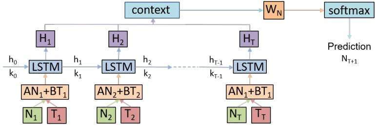
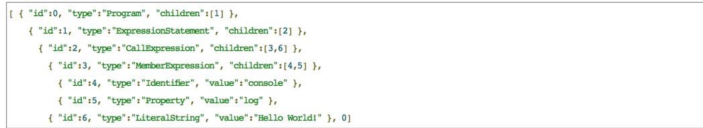
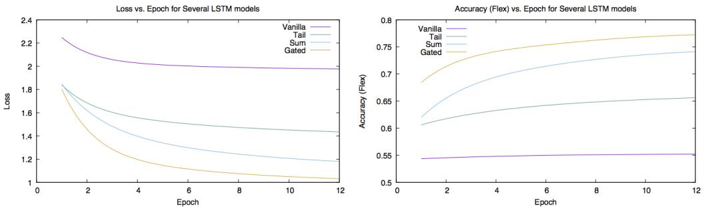
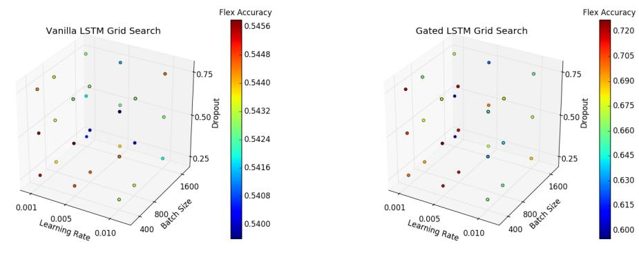

# Automatic Code Completion

Adam Ginzberg, Lindsey Kostas, Tara Balakrishnan Computer Science Department, Stanford University, Stanford, CA, 94305, USA {ginzberg,lmkostas,taragb}@stanford.edu

### Abstract

Code completion software is an important tool for many developers, but it traditionally fails to model any long term program dependencies such as scoped variables, instead settling for suggestions based on static libraries. In this paper we present a deep learning approach to code completion for non-terminals (program structural components) and terminals (program text) that takes advantage of running dependencies to improve predictions. We develop an LSTM model and augment it with several approaches to Attention in order to better capture the relative value of the input, hidden state, and context. After evaluating on a large dataset of JavaScript programs, we demonstrate that our Gated LSTM model significantly improves over a Vanilla LSTM baseline, achieving an accuracy of 77% on the non-terminal prediction problem and 46% accuracy on the terminal prediction problem.

### 1 Introduction

Modern software engineers rely on a multitude of tools to expedite their development process. Many utilize integrated development environments (IDEs) that offer services such as text editors, debuggers, and even intelligent code completion. Code completion software has become ubiquitous in the contemporary IDE and traditionally relies on static analysis of libraries and code to provide helpful suggestions about method names or object fields. It is useful for avoiding typos or syntax errors and often saves the developer from having to constantly consult documentation.

Prior work in code completion has primarily focused on the aforementioned static and syntactic approaches in generating code suggestions [1]-[4]; however recent work has also began to examine statistical and learning based language models [5]-[7]. Learning based approaches offer an exciting new lens on the code completion problem as the suggestions can hope to capture deeper semantic and idiomatic meaning and represent a small step towards automated code generation. Our work intends to build upon learning based approaches by applying techniques grounded in the deep learning literature [8]-[9] such as Long Short-Term Memory (LSTM) and Attention to the code completion problem.

We contend that leveraging deep learning techniques allows us to gain insight into code structure and locality that was heretofore unavailable to traditional code completion systems. Syntactic and library based suggestions ignore crucial information such as the names of currently scoped variables and common structural idioms such as the try/catch/finally paradigm that deep learning approaches can hope to capture.

We introduce an LSTM model with Attention that makes considerable progress towards generalized code completion by predicting program structure through non-terminal prediction (Variable Declaration, For Loop, If Statement, etc) and modest progress for the challening problem of terminal prediction (program text). This improves significantly over a statistical language model or simple LSTM baseline and is the primary contribution of this paper.

Figure 1: An example of modern code completion systems that offers static suggestions based on available methods or fields independent of the preceding code.

We evaluate our models on a large dataset of JavaScript programs that has been used as a benchmark in prior work [10]. The dynamically typed nature of JavaScript creates an added challenge for the code completion problem as there is far less syntactic information available. While static library information would still be useful for predicting object method and field names, we choose to focus our attention solely on building a deep language model for code prediction independent of these static libraries.

In this paper, we first describe the relevant prior work in code completion. We then describe, the models we implemented, our dataset, and the experiments we ran. Then, in our final section, we share our conclusions from this research and characterize the space of future work.

# 2 Related Work

The majority of existing approaches to the task of code completion can be categorized as ngram models [11], probabilistic grammars [5], and log-bilinear models. However, these initial approaches are naive in that they only encode hierarchical library information based on a very local scope to make predictions and are unable to understand long range running dependencies which are often necessary to make useful completions. Considering this limitation, various works [2]-[4] have demonstrated that these approaches, which are implemented in existing IDEs, can be improved significantly with the incorporation of a greater context by considering program history.

Bielik et al. addresses this proposition by generalizing the traditional probabilistic context free grammar approach to condition on grammar rules beyond those of the parent non-terminal thus capturing a richer context relevant to the current prediction [5], and Raychev et al. further build upon this work by introducing decision tree approaches within this infrastructure [6]. Finally, Raychev et al. and White et al. model code as an abstract syntax tree (AST) on which they explore the ability of recurrent neural networks (RNNs) to perform code completion [10], [12], however; neither RNN directly leverages the structural information contained in the AST, and the RNNs are both only run on top of a token sequence to build their probabilistic models.

To address the limitations demonstrated by the existing RNN models, there is a body of recent work that explores the application of deep learning techniques that leverage syntactic, as well as semantic, information to accomplish the task of code completion. Specifically, we modeled our work on that done by Liu et.al who recently attempted a solution to the problem we are trying to solve; providing intelligent code completion for dynamically typed languages using natural language neural network techniques [Paper Under Review]. These authors use a repository of JavaScript source files and the associated abstract syntax trees (AST) as their dataset which they represent as a serialized sequence of non-terminal node and terminal node pairs where non-terminal nodes encode program structure and terminal node encode program text. They then consider segments of 50 non-terminal terminal tokens to represent partial ASTs from which they attempt to make three types of predictions: next non-terminal; next terminal; next non-terminal, terminal pair.

To make these predictions, the authors first compute embeddings for each token which they feed through a standard LSTM model with a single hidden layer, a softmax layer and Adam optimization. The authors only utilize one-hot vectors rather than word vector representations, which we hope to improve upon in our work. Additionally, while the authors claim that they can outperform the existing state of the art code completion technology, their evaluation metrics ignore cases where the model predicts the next token as one that isnt in the vocabulary.

Notwithstanding the questions raised by the work presented by Liu et al., it is a valuable starting point for the work presented in this paper. That said, we will look to build upon the implementation of a standard LSTM by augmenting the model with various techniques used in other natural language problems. We find particular inspiration in the works presented by Bhoopchand et al and Merity et al [7], [9]. Bhoopchand et al. demonstrate the ability of attention models to enhance the performance of a code completion system for Python source code. They draw motivation from the absence of relatively little support for dynamically typed languages from existing IDEs which are inherently more difficult to model due to relaxed grammars. Bhoopchand et al. also extend the existing work by implementing local attention models of various window sizes and a sparse pointer network neural language model in which they probabilistically sample from the current LSTM state and an attention window to make predictions. As done by Liu et. al, the authors predict separate terminal and non-terminal predictions and their results demonstrate that standard attention models provide significant improvements for both types of predictions, and the sparse pointer network outperforms existing models for the top 5 most likely next nodes. However, we will note that these results are produced for a single source code file and it is unclear if the demonstrated level of success will generalize across a larger code base with noisier input.

The work of Merity et al. presents the seminal discussion of pointer sentinel mixture models which may address the aforementioned limitation. As in traditional attention and pointer models, this model considers a global vocabulary of all possible tokens, and a context vocabulary consisting of tokens within the context window. This model then incorporating a gate function to dictate the importance placed on the entire vocabulary versus the context vocabulary, and a probabilistic weighting of whether to use the gating function. While this approach has yet to be applied to the task of code completion, it effectively addresses low frequency and/or unobserved tokens, and we believe it has the potential to better capture long range syntactic and semantic dependencies across an entire code base and will generalize well in the implementation of an IDE for dynamic languages.

### 3 Deep Learning Models for Code Completion

One of the key limitations of the existing n-gram, probabilistic grammar, and even to an extent RNN, approaches is their inability to encode, in whole or in part, complex long range dependencies. The ability to model such relationships is crucial to a task such as code completion in which the system must recall variables and function calls in previous portions of the code in order to intelligently predict the next token. Given the depth of work surrounding n-gram and probabilistic grammar approaches to the task of code completion and the demonstrated limitations, we begin our work with the implementation of a vanilla LSTM model.

#### 3.1 Vanilla LSTM

Specifically, we feed an embedded sequence of non-terminal, terminal token sequences through an LSTM layer which consists of a forget gate, input gate, and output gate which encode the extent to which the model should remember the past outputs, emphasize the current input, and expose the current output, respectively. The embedding of each non-terminal, terminal token is calculated as

$$x\_i = AN\_i + BT\_i$$

where N<sup>i</sup> is the randomly initialized non-terminal embedding and T<sup>i</sup> is the terminal embedding trained with GloVe. We then define the LSTM layer as:

$$f = \sigma(x\_t U^i + h\_{t-1} W^i)$$

$$\begin{aligned} i &= \sigma(x\_t U^f + h\_{t-1} W^f) \\ o &= \sigma(x\_t U^w + h\_{t-1} W^w) \\ g &= \tanh(x\_t U^g + h\_{t-1} W^g) \\ c &= c\_{t-1} \circ f + g \circ i \\ h\_t &= \tanh(c\_t) \circ o \end{aligned}$$

This layer takes the token embedding xt, as well as the previous state (ct−1, ht − 1) as inputs and processes these inputs through the series of the aforementioned gates i, f, and g to produce a new state (ct, ht). For non-terminal prediction, at the last state K, we apply a softmax layer to the output (cK, hK) from the LSTM layer defined as:

$$N\_{K+1} = softmax(W\_N h\_K + b\_N)$$

where NK+1 is the output predicted vector, and W<sup>N</sup> and b<sup>N</sup> are trained weights. For terminal prediction, we consider one extra partial token consisting of just a non-terminal, xK+1 which is appended to the end of the non-terminal, terminal token sequence. We obtain the hidden state h<sup>K</sup> as above and then calculate the final output vector TK+1 as:

$$T\_{K+1} = 
of t 
max(W\_T h\_K + W\_{NT} N\_{K+1} + b\_T)$$

where NK+1 is calculated as above and W<sup>T</sup> , WNT and b<sup>T</sup> are trainable weights.

Finally we apply a cross entropy loss to this final output vector.

We next create a series of attention models which we layer on top of this baseline LSTM model in an attempt to make more intelligent predictions by better honing the focus of our model.

#### 3.2 Tail Attention

We start with the implementation of a standard global attention model which we will refer to as tail end attention.



Figure 2: Simplified tail LSTM architecture for predicting the next non-terminal node.

Tail end attention implements the same basic LSTM layer described above but inserts an additional calculation at the last time step of the LSTM to produce a context vector, cntx, which aggregates the outputs of the past K − 1 hidden states and is used to create the final output vector. Specifically, we calculate cntx by first defining a score, α for each of the past K − 1 hidden states, hs:

$$\alpha = h\_s W h\_K, \text{ for each s } \in 1, ...K - 1.$$

We then use this score to calculate a normalized weighted sum of the past K − 1 hidden states. The result of this calculation is the context vector cntx which is then concatenated with the current hidden state h<sup>K</sup> and fed into two softmax layers to produce the final output vector:

$$cntx = \sigma(\sum\_{s=1}^{K-1} \alpha\_s h\_s)$$

$$v = softmax(W\_ccntx + W\_h h\_K + b\_1)$$

$$o = softmax(o = U\_o v + b\_o)$$

While tail end attention enhances the maintenance of running dependencies, this solution is incomplete in that this model does not retain the relative importance of individual past states.

#### 3.3 Sum Attention

To address this problem, we create a novel attention model which we will call sum attention. Like tail attention, sum attention is a global attention model which uses the same series of calculations; however, we apply these calculations at every time step within the LSTM layer and feed the resulting output as the input into the next hidden state. Specifically, for any time step k, we calculate a context vector, cntxk, based on the past k − 1 hidden states and then set h<sup>k</sup> = cntx<sup>k</sup> before proceeding to the next state.

Sum attention accomplishes our goal of propagating the relevant information of each individual hidden state across future states; however, the calculation of relevance is still naive in that all states are weighted equally. To improve upon this model we experiment with two variations of a weighted sum attention model which we will refer to as p-sum attention and alpha-beta sum attention. Rather than simply summing h<sup>k</sup> and cntx<sup>k</sup> at each time step k, we now calculate the new hidden state output vector as a weighted sum with weights p, 1 − p in the case of p-sum and α, β in the case of alpha-beta sum. Specifically, for p-sum attention we calculate the output as:

$$\hat{h\_k} = p h\_k + (1 - p)cntx\_k.$$

where p is a trainable constant with the constraint that 0 <= p <= 1 such that the weights represent probabilities. For alpha-beta sum attention we calculate the output as:

$$\hat{h\_k} = \alpha h\_k + \beta c n t x\_k$$

where α and β are trainable constants initialized to a random number between -1 and 2. We initially looked at a range from 0 and 1 but found that slightly expanding the range decreased our training loss and performed better than pSum (all Sum Attention results below refer to αβSum).

#### 3.4 Gated Attention

Finally, the iterative improvements to our attention model culminate in the creation of a gated attention model. This model was created to address the limitation of the weighted sum models which, by utilizing trained constants, do not have the flexibility to adapt to different inputs, but instead must use the same set of weights for all inputs. Its implementation is motivated by the LSTM gated structure whereby, rather than using trained constants, the layer learns functions which are applied to inputs and thus has the flexibility to make different decisions for different inputs. To create our model we replace the aforementioned weights with two gates, a context gate g<sup>c</sup> and a hidden gate g<sup>h</sup> which moderate the relative influence of the context vector and current hidden state in the calculation of the output hidden state, respectively, and are defined as:

$$g\_c = \sigma(U\_ccntx\_k + W\_cx\_k).$$

$$g\_h = \sigma(U\_h h\_k + W\_x x\_k).$$

We then calculate the output of the hidden state as

$$o\_k = g\_c \circ cnt x\_k + g\_h \circ h\_k$$

### 4 Experiments

#### 4.1 Data

We conduct our experiments on a 150,000 program Javascript dataset[1](#page-4-0) containing source files and their corresponding parsed ASTs, released by the Software Reliability Lab at ETH Zurich.

For example, the simple program:

Has the corresponding AST:

<span id="page-4-0"></span><sup>1</sup><http://www.srl.inf.ethz.ch/js150>



We split this dataset into a train set of 100,000 JavaScript files, a development set of 20,000 files, and a test set of the remaining 30,000 files.

We preprocessed the data by converting the program ASTs into their corresponding Left-Child Right-Sibling (LCRS) representations so that we can explore the tree structure in a binarized format. We then conduct an in-order traversal of the LCRS to serialize it into sequences of 49 tokens, each containing a non-terminal and terminal node pair.

Terminal nodes contain a value that encodes the literal text of a program. Non-terminal nodes only contain a type (i.e. IfStatement, LiteralString) that describes a structural attribute of the program. We choose to allow non-terminal nodes to encode two additional bits of information about the tree structure that makes it possible to re-create the original AST. For each non-terminal node type, we include binary variables describing whether the node has a terminal child and/or a right sibling. In total, there are 176 possible non-terminal nodes.

Because there is an infinite space of possible terminals, we chose to make the terminal prediction problem more tractable by restricting our consideration to the 50,000 most frequent terminals in the codebase and an additional UNK, or unknown terminal to represent all other terminals.

We then trained word vector representations for the 50,000 most frequent terminals and UNK and the 176 non-terminals. The most frequent terminal vectors are trained using GloVe [13] over the codebase, while the vectors for UNK and the non-terminals are randomly initialized and are updated during training. Token embeddings are represented as the concatenation of their terminal and nonterminal component embeddings.

### 4.2 Setup

We ran several experiments on our dataset to explore the effectiveness of our models. In our experiments, the input was a partial code segment comprised of 49 tokens (non-terminal, terminal pairs) and the output was a prediction for the next non-terminal or terminal in the sequence.

We focused on two different prediction problems: next non-terminal and next terminal prediction. Because non-terminal prediction is more tractable - only 176 possible outputs compared to an infinite number for terminal (which we reduce to 50000), we focused the majority of our exploration on nonterminal prediction.

For non-terminal prediction, we evaluated our models using two measures of accuracy. Standard accuracy is the ratio of correct non-terminal predictions to total predictions. Flex accuracy is the ratio of correct non-terminal predictions (ignoring the bits encoding structural aspects of the AST) to total predictions.

For terminal prediction, we again evaluate our models using accuracy. However, because we are using an UNK terminal to allow the models to choose not to predict one of the 50000 most frequent terminals, we must account for this in our accuracy measure. To do so, we define the accuracy to be the ratio of the correct terminal predictions (ignoring UNK predictions) to the total predictions (again ignoring UNK).

Unless otherwise stated, we trained our models for 12 epochs on a GPU with 6 cores and 56 GB of memory.

# 4.3 Results

Figure 3(a) shows the train loss at each epoch for each of our models run on non-terminal prediction. As one might expect, as we increased the model complexity we found a decrease in train loss, and our most advanced model, the Gated LSTM shows the lowest loss. In Figure 3(b) we see comparable



(a) Loss per epoch for non-terminal prediction. (b) Flex accuracy per epoch for non-terminal prediction

Figure 3: Non-terminal prediction loss and flex accuracy.

| System                | Accuracy | Flex Accuracy |
|-----------------------|----------|---------------|
| Baseline Vanilla LSTM | 0.44     | 0.55          |
| with Tail Attention   | 0.54     | 0.66          |
| with Sum Attention    | 0.61     | 0.74          |
| with Gated Attention  | 0.65     | 0.77          |
| Terminal LSTM         | 0.46     |               |

Table 1: Accuracy results.

flex accuracy scores to what we would expect from the loss graph. Gated LSTM performs the best with Sum LSTM not far behind. There is a clear improvement over the Vanilla LSTM when we add Attention, with the Tail LSTM doing a full 10% better than the Vanilla LSTM and the Gated LSTM improving over the Vanilla LSTM baseline by over 20%. Clearly, the enhanced maintenance of running dependencies from attention has a strong positive effect on the accuracy of non-terminal prediction, and as we build up our model to vary the relative importance of previous states we do even better.



(a) Grid search for Vanilla LSTM accuracy. (b) Grid Search for Gated LSTM accuracy

Figure 4: Grid search for two of our models.

We also ran grid search to tune several hyperparameters of our models: namely the dropout rate, the learning rate, and the batch size. Figure 4 shows the results of our grid search on the Vanilla LSTM and the Gated LSTM. When comparing the two plots, we notice that the effect of the hyperparameters on the Gated LSTM accuracy has a much larger range than on the Vanilla LSTM. We hypothesize that this is due to the greater complexity of the Gated LSTM model and so the impacts of small variations in the hyperparameters build up and manifest in the overall accuracy.

Table 3 summarizes our results for the experiments that we ran. For non-terminal prediction (the first 4 rows of results), we see that attention clearly offers a strong boost in accuracy and that our more complex models of Sum and Gated Attention truly offer impressive results for the non-terminal prediction problem. The final row shows the accuracy we got for running our model on the terminal prediction problem. Recall that for terminal prediction we only measure accuracy for non-UNK predictions, so what this means is that 46% of the time that we predicted a non-UNK terminal we predicted the correct one. This turns out to be a reasonably impressive result as there were 50000 possible terminals that could have been predicted.

Figure 5 shows that our model was able to correctly predict the terminal result in the console.log. This indicates an understanding of variable locality which is a vague approximation of scope (or hoisting in JavaScript) - because result appeared near the terminal node that we wanted to predict our model was able to make a correct prediction. In Figure 6 we see that our model is able to correctly predict the non-terminal else if block. From a human perspective it makes complete sense as to why else if is the next logical attribute in the program structure, particularly because of the condition in the if statement. But this is a subtle point and hard to capture even with longer term dependencies. We were pleased that our model was able to make this correct prediction and suspect that the combination of being in a closure, the kinds of terminals found in this passage, and of course the previous if statement all played a role.

```
// Correctly predicting the variable result in console.log
if (true) {
  for (var result in foo) {
    console.log (result);
  }
}
```
Figure 5: Predicting the terminal result in console.log

### 5 Conclusion

We have found that deep learning techniques are well suited to the task of code completion. LSTM models augmented with Attention perform well on the task of next non-terminal prediction. In particular, our Gated LSTM model performs best with a flex accuracy of 77% as it is able to continually learn the relative value of the input, hidden state, and context. This marks a sizable improvement over the Vanilla LSTM which had flex accuracy of 55% for non-terminal prediction. We also made a first attempt at the very difficult problem of next terminal prediction. However, we were pleased to find that when our model was confident enough to make a prediction, it did reasonably well scoring an accuracy of 46%. These results indicate that this area and approach are worth continued research.

### 5.1 Future Work

We characterize several opportunities for future work. One augmentation to the terminal prediction models is a probabilistic copying function which would allow the model to copy terminals it had seen in the window with learned probabilities. We think this would be a promising approach as terminals are scoped and often repeated within functions and code blocks, and so it is often a good idea to copy terminals you have seen previously even if they are not in the top 50000. Another direction would be to augment our models with syntactic features that exploit the structured nature of code. For example, we could reject predicting a terminal string when syntactically the code requires an integer. Finally, we hope to see a deep learning model integrated into an existing code completion system in order to augment the existing static library approach and offer much more powerful code completion.

```
// Correctly predicts a non-terminal else if block.
var burrito = require(./);
window.onload = function () {
  var res = burrito.microwave(Math.sin(2), function (node) {
    if (node.name === num) {
      node.wrap(Math.PI);
    }
  });
  document.body.innerHTML = res;
  if (document.readyState === complete) {
    window.onload();
  } else if(...) {
    ...
  }
};
```
Figure 6: Predicting the non-terminal else if block.

### 6 Appendix

#### Acknowledgments

We acknowledge the support of the cs224n teaching staff in particular our mentor Arun Chaganty and the instructors Christopher Manning and Richard Socher. We also acknowledge Microsoft for providing free computing resources through their Microsoft Azure platform.

#### Contributions

We all contributed equally - each working on various parts of preprocessing, model development, and evaluation.

#### References

[1] Han, Sangmok, David R. Wallace, and Robert C. Miller. "Code completion from abbreviated input." Automated Software Engineering, 2009. ASE'09. 24th IEEE/ACM International Conference on. IEEE, 2009.

[2] Robbes, Romain, and Michele Lanza. "How program history can improve code completion." Proceedings of the 2008 23rd IEEE/ACM International Conference on Automated Software Engineering. IEEE Computer Society, 2008.

[3] Hou, Daqing, and David M. Pletcher. "An evaluation of the strategies of sorting, filtering, and grouping API methods for code completion." Software Maintenance (ICSM), 2011 27th IEEE International Conference on. IEEE, 2011.

[4] Bruch, Marcel, Martin Monperrus, and Mira Mezini. "Learning from examples to improve code completion systems." Proceedings of the the 7th joint meeting of the European software engineering conference and the ACM SIGSOFT symposium on The foundations of software engineering. ACM, 2009.

[5] Bielik, Pavol, Veselin Raychev, and Martin T. Vechev. "PHOG: probabilistic model for code." Proceedings of the 33nd International Conference on Machine Learning, ICML. 2016.

[6] Raychev, Veselin, Pavol Bielik, and Martin Vechev. "Probabilistic model for code with decision trees." Proceedings of the 2016 ACM SIGPLAN International Conference on Object-Oriented Programming, Systems, Languages, and Applications. ACM, 2016.

[7] Bhoopchand, Avishkar, et al. "Learning Python Code Suggestion with a Sparse Pointer Network." arXiv preprint arXiv:1611.08307 (2016).

[8] Hochreiter, Sepp, and Jrgen Schmidhuber. "Long short-term memory." Neural computation 9.8 (1997): 1735-1780.

[9] Merity, Stephen, et al. "Pointer Sentinel Mixture Models." arXiv preprint arXiv:1609.07843 (2016).

[10] Raychev, Veselin, et al. "Learning programs from noisy data." ACM SIGPLAN Notices. Vol. 51. No. 1. ACM, 2016.

[11] Hindle, Abram, et al. On the naturalness of software. In 2012 34th International Conference on Software Engineering (ICSE), pp. 837847. IEEE, 2012.

[12] White, Martin et al. Toward deep learning software repositories. In 2015 IEEE/ACM 12th Working Conference on Mining Software Repositories, 2015.

[13] Pennington, Jeffrey, Richard Socher, and Christopher D. Manning. "Glove: Global Vectors for Word Representation." EMNLP. Vol. 14. 2014.