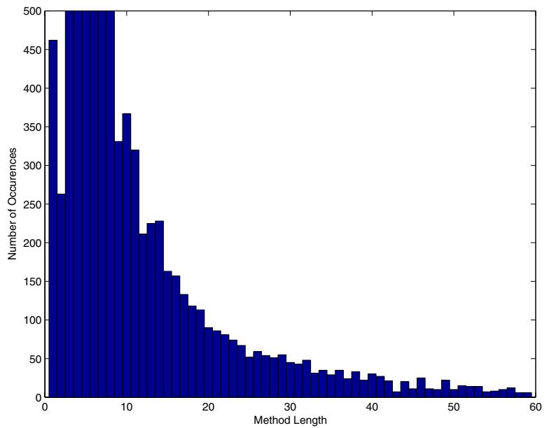
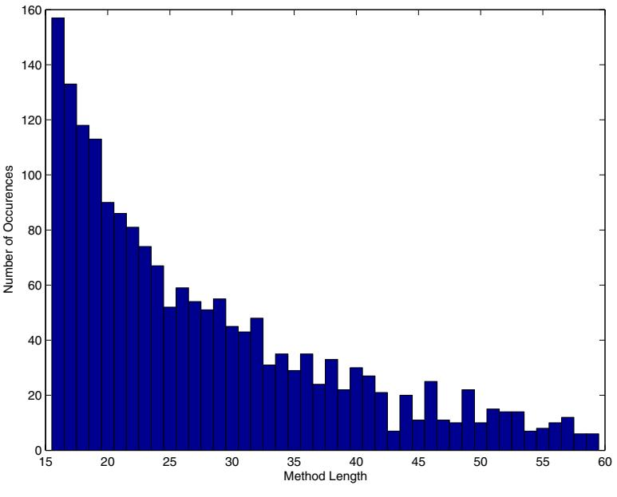
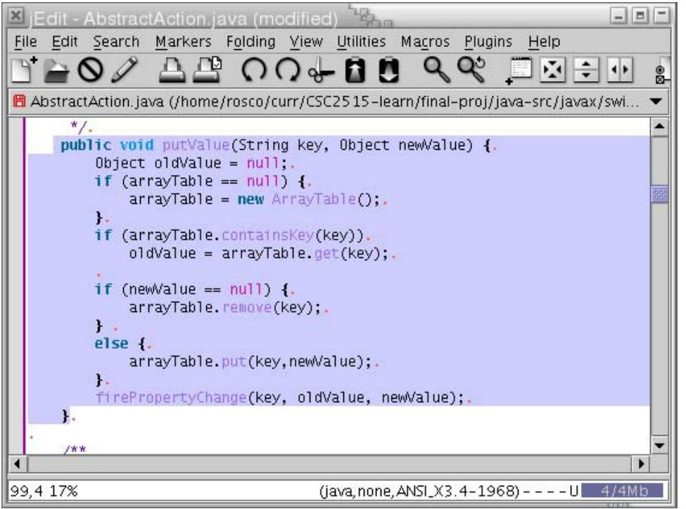
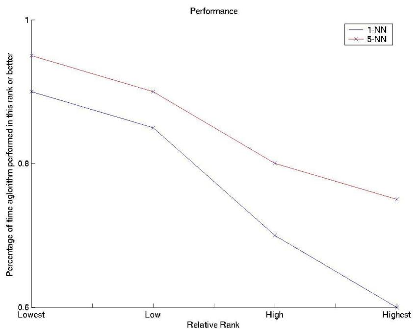

# **Automatic Method Completion**

Rosco Hill Joe Rideout University of Toronto Department of Computer Science 10 King's College Road, Toronto, Ontario, Canada

#### **Abstract**

*Modern software development environments include tools to help programmers write code efficiently and accurately. For example many integrated development environments include variable name completion, method name completion and recently refactoring tools have been added to some environments. This paper extends the idea of automatic completion to include completion of the body of a method by employing machine learning algorithms on the near duplicate code segments that frequently exist in large software projects.*

#### **1 Introduction**

At heart the authors are software engineers, but, in practice we are also programmers who cuts corners when deadlines are tight. We admit it. We use "copy / paste". Results presented in clone detection research indicate that the authors are not alone in this practice. While previous research has focused on detecting and eliminating software clones, this paper explores the possibilities of using the power of copy/paste for good, and not evil.

Softwares exhibit a phenomenon called "software aging" [11] as they progress from the design stage to becoming a burdensome legacy system. Large software projects undergoing continual development and maintenance often have a significant amount of duplicated code. In the last decade, several researchers have investigated this phenomenon and studies [2, 9] indicate that 7-23% of the source code for large software projects are duplicate code (clones). Lague et al. [7] discovered that programmers often missed some copies of duplicate code when modifying a large software system. Research in the area of clone detection has focused on creating tools to find clones, thereby allowing the programmer to extract or restructure the code, and alleviating this maintenance problem.

The authors experimented by running freely available clone detection software CPD [13] and Simian [4] on the source code for the large software packages listed in Section 6. When the minimum size for a match was large (25 lines or more) the clones that the algorithm detected were convincing evidence that clones are bad. However, when the minimum size was tuned down to a small value (5-10 lines) the clones detected were less convincing. Though they still reflected a copy/paste action by the programmer, they seemed to be motivated by a small unit of implementation, for example implementing a listener interface, or handling an keyboard event. The authors refer to these as "atomic clones". Due to the encapsulation of implementations in Java it is unavoidable that reasonably designed implementations will contain a noticeable number of atomic clones. The atomic clones observed by the authors were minimal chunks of code containing idioms necessary for implementing an interface. Methods of this kind are not well suited for refactoring to another class, and the variance between them is very small. In Java, for example, many objects implement the cloneable interface, and many graphical objects implement an event listener interface. The examples in figures 1 and 2 illustrate atomic clones that were detected.

```
Starting at line 38 of
java-src/javax/swing/text/EditorKit.java
Starting at line 228 of
java-src/javax/swing/text/Segment.java
    /**
     * Creates a shallow copy.
     *
     * @return the copy
     */
    public Object clone() {
Object o;
try {
    o = super.clone();
} catch (CloneNotSupportedException cnse) {
    o = null;
}
return o;
    }
```
#### **Figure 1. Clone: Cloneable implementation**

Given this evidence justifying the existence of atomic clones, one asks whether development environments should provide a tool to support this practice. Since little gain is incurred from discovering after the fact that two methods are atomic clones, the clone detector should run continuously and detect such clones as early as possible. Such a

The results presented in Nichell and Smith [14] lend cre-

Starting at line 1038 of java-src/javax/swing/JComboBox.java Starting at line 982 of

> } }

}

wheel.

**2 Related Work**

find similar functions.

return isListener;

java-src/javax/swing/AbstractButton.java

private boolean isListener(Class c, ActionListener a) { boolean isListener = false;

job more efficiently and/or accurately.

Object[] listeners = listenerList.getListenerList(); for (int i = listeners.length-2; i>=0; i-=2) { if (listeners[i]==c && listeners[i+1]==a) { isListener=true;

**Figure 2. Clone: Listener Implementation**

tool would have to execute speculatively as opposed current clone detectors which are offline and batch oriented. From the perspective of machine learning, this question boils down to whether we can exploit the statistical regularity in atomic clones to help the programmer do his/her

When a programmer requires an idiomatic unit of implementation he/she will take one of two approaches: search through the existing source to find an appropriate implementation to copy/paste or write the method from scratch. Both approaches are time-consuming and the second may introduce inconsistencies between these atomic units.

The authors' contribution is a tool which facilitates a compromise between the two approaches: the programmer begins his/her implementation and the tool automatically suggests a completion for the method body. The suggested completion saves the programmer from manually searching for an implementation to copy and from reinventing the

Related work on clone detection falls into three main categories: string-based matching, tree-based matching, and metrics-based matching. Baker [1] and Heuvel [5] describe line-based matching algorithms that find matching pairs of "parameterized" code fragments. These line matching algorithms detect identical as well as similar lines of code. Kontogiannis et al [9] describe a dynamic programming approach that computes the similarity between "begin-end" blocks as the minimum number of inserts and deletions to make the blocks identical. Baxter [2] presents a method for detecting exact and near-miss clones for arbitrary fragments of program source code using abstract syntax trees. Mayrand et al [6] present a technique based on matching functional level metrics (e.g. number of lines of code, number of function calls contained, number of arguments) to of clones in projects developed with extreme programming (XP) versus projects developed with traditional software engineering principles. Their findings were that XP projects produced smaller clones and that traditionally developed software tended to contain large copy/paste regions. Nichell describes many of the clones in XP projects as "related to test code" and "false positives", however, he does not indicate that this code could be elegantly modified to avoid the clones. This shows that even with two pairs of eyes scrutinizing the code there still tends to be a disposition towards replicating small units of implementation.

# **3 Method Representation**

The data structure plays a key role in the performance of the algorithm. As described earlier there are three techniques for matching software clones: string-based, syntax tree-based and fingerprint-based. In the fingerprint technique each method is represented as fixed-length feature vector. The encoding is defined such that similar method bodies possess similar representational vectors. The fixedlength vector representation is well-suited for compact representation and efficient computation and maps well into the machine learning algorithms.

To measure similarity in the feature vector domain we consider the distance of the vector projected into Euclidean space. Specifically, the difference between method *A* and method *B* is defined as the norm of difference of the vector representations *<sup>v</sup><sup>a</sup>* and *<sup>v</sup><sup>b</sup>*. If *<sup>A</sup>* is similar to *<sup>B</sup>* then *<sup>v</sup><sup>a</sup>* <sup>−</sup> *<sup>v</sup><sup>b</sup>* is small.

The key question for this representation is what metrics should be contained in the vector. For completeness and expedience we opted for a wholesale approach to the the metrics vector. For each method in the software project we generate a 154-dimensional vector of metrics. This representation includes four complex metrics as well as 150 simple metrics. The 150 simple metrics are an empirical frequency count of each of the 150 token types that the Java Language Specification [3] defines. In addition the vector contains an entry for the number of lines of code, the number of arguments, a hash of the return type, and the cyclomatic complexity (a widely used static software metric [10] ).

For each method *<sup>m</sup><sup>k</sup>* in the software project, we generate a corresponding *<sup>v</sup><sup>k</sup>* of the form:

$$\begin{array}{rcl} v\_k & = & [lines\\_args\\ type\\_complexity & + & \dots & token150 \end{array}$$

This representation has some limitations since it is not feasible to compute a feature vector for arbitrary blocks of code. Rather, we compute one feature vector for every method. Consequently this paper presents a tool for automatic completion of methods, and not a more general au-


tomatic completion for arbitrary blocks of code. Furthermore, using static metrics to represent a method means that the richness of the structure in the syntax tree is lost, and run-time call trees are not exploited.

Rysselberghe [8] reported that feature vector methods are more susceptible to detecting *false matches* and *useless matches*. *False matches* are defined to be pieces of code incorrectly identified as duplicates. However, Rysselberge admits that this is due to a lack of accuracy in the choice of metrics and we noticed very few *false matches* using our wholesale feature vector approach. *Useless matches*, typically short, are defined as those not worth removing by refactoring. This definition matches quite nicely with our notion of atomic clones.

Usually it is desirable to whiten/sphere the vector before feeding into the machine learning algorithm since algorithms can be sensitive to the scale of the axis. This means that the vector set is transformed such that each element of the vector *<sup>v</sup><sup>k</sup>* is uncorrelated and has variance one. However, for our application it is desirable to have a smaller weight on the 150 simple empirical and larger weight on the four complex metrics, so sphering the inputs is not ideal. Furthermore, some of the features have a very low likelihood of occurrence (for example the "?" ternary operator) and generated large noise if their variance was increased to one. Therefore the authors left the inputs unchanged.

#### **4 Detection**

The first phase in method completion is essentially clone detection with missing information. The programmer has begun writing a method and the method completion tool guesses the final method by first computing the likely final method fingerprint and then using a machine learning algorithm to complete the method.

The most likely value of the feature vector is the expected value over the distribution of feature vectors of all methods that are longer than the current method. Intuitively, this assumes that the programmer is only interested in completions which make the method longer, not ones that truncate it shorter. The distribution of the first element in the feature vector (lines of code) for the data set in the project is shown in Figure 3a. Suppose that a programmer has already typed 16 lines of code then Figure 3b shows the distribution for the method lengths of 16 lines or longer which should be considered candidates for completion.

This new distribution can be modeled as a random variable who's distribution is characterized by the lengths of methods of 16 lines or longer. The expected value for this distribution is:

$$E[v\_i] = \frac{\sum\_{1}^{n} v\_{k\_i}}{n}$$

And the target feature vector is now:

$$\begin{array}{c} v = [E[lines] \to E[args] \to E[type] \\ E[complexity] \to E[token1] \quad \dots \quad E[token150] \end{array}$$

To determine instances similar to this target method in the data set the authors ran the K-Nearest Neighbor algorithm with either *k* = 1 or *k* = 5 using the Euclidean measure of distance. Though minimum-Euclidean distance is affected by the scale and highly correlated features, it is desirable in this case since the feature vector was hand-crafted with these considerations in mind.

The feature vector for the nearest neighbor is then used to retrieve the body of the method that best matches the current method, and a method completion is suggested to the programmer. In the *k* = 5 case, no attempt is made to blend the most similar methods together. Instead, the tool allows the user to select from a list of these five nearest neighbors. This increases the likelihood that the algorithm will find a good match.

### **5 Integration**

The tool is implemented as a plugin for jEdit 4.2 [12]. jEdit is an open-source development environment that is designed with easy integration for plugins. For expedience, the current implementation simply sends the method fingerprint over TCP sockets to a Matlab server1.

The programmer writes the beginning of a method. He/she then highlights the partial method and selects "Complete Method" from the plugin menu. Figure 4 shows this tool in use. The highlighted partial method in Figure 4a is "complete" by the tool and the completion is shown in Figure 4b. The tool in fact replaces the highlighted text with the complete body of the most likely match as determined by the machine learning algorithm. Notice that although our machine learning algorithm will identify methods with similar semantics regardless of the choice of variable names, it makes no attempt to reconcile the choice of variable names between the partial method and the best match; the best match replaces the partial method and the programmer may then modify names as he/she chooses.

#### **6 Selected Cases**

To measure the accuracy of the method completion the authors selected three medium to large sized software packages that are known to contain some code duplication, although the authors did not know the location or kind of duplication.

<sup>1</sup>The authors prototyped the algorithm in Matlab first

- **Java Swing Package** is the code that provides support for lightweight GUI elements in the Java environment. Since it evolved from an older package AWT, and is undergoing continual change, it contains a high degree of duplication.
- **Java Language Package** provides support for core feature in the Java programming language.
- **jEdit** is a popular open-source editor that contains code contributed by many authors.

### **7 Accuracy**

This section reports the accuracy of the tool according to a suite of comparative tests. The authors used a relative ranking algorithm to determine the goodness of each method completion suggested by the tool.

For each of the software packages, the authors wrote ten partial methods. The authors chose methods that we consider typical for atomic clones such as listeners and interface implementations. To derive a quantitative comparison, the authors came up with three possible completions for each method: the correct one, a good one, and a mediocre one. The fourth completion was generated by the tool. The authors then ranked the four methods relatively against each other.

To illustrate the ranking process, consider the example shown below. The method shown in Figure 5 is from a custom text-area widget that the authors were writing. The methods shown in Figure 6 are some completions the authors dreamed up plus the automatic completion generated by the algorithm (Completion 4).

```
protected void fireCaretUpdateTwo(CaretEvent e) {
            // Should I check if listeners is null?
            Object[] listeners = listenerList.getListenerList();
            // Send event to all listeners
            for(int i = listener.length;i>=0;i-=1) {
                    ((CaretListener)listeners[i]).caretUpdate(e);
            }
    }
```
#### **Figure 5. Partial Method**

For this example, the authors consider the automatically generated completion to be an excellent completion. The rankings for the completions are shown in Table 1.

Figure 7 below shows the relative accuracy of the generated completion as it is ranked against its three competitors. The y-axis shows the percentage of trials where the generated method was as good or better than the ranking on the x-axis. For the 1-NN case we can see that the method generated a good completion in 60% of the cases. For the 5-NN case where the programmer can choose from a list of completions, this jumps to 80%. Therefore if the algorithm's performance is boosted if the programmer selects from a

```
Completion 1:
...
            for(int i = listener.length-2;i>=0;i-=2) {
                     ((CaretListener)listeners[i+1]).caretUpdate(e);
            }
    }
Completion 2:
...
            for(int i = listener.length-2;i>=0;i-=2) {
               CaretListener l = (CaretListener)listeners[i+1];
               l.caretUpdate(e);
            }
    }
Completion 3:
...
return void;
    }
Completion 4:
...
   for (int i = listeners.length-2; i>=0; i-=2) {
            if (listeners[i]==CaretListener.class) {
                ((CaretListener)listeners[i+1]).caretUpdate(e);
            }
        }
    }
```
#### **Figure 6. Method Completion Candidates**

| Table 1. Relative Ranking |              |  |  |  |  |
|---------------------------|--------------|--|--|--|--|
| Quality                   | Completion   |  |  |  |  |
| Highest                   | Completion 4 |  |  |  |  |
| High                      | Completion 1 |  |  |  |  |
| Low                       | Completion 2 |  |  |  |  |

| Lowest | Completion 3 |
|--------|--------------|

list of completions and picks the best one for the current method.

Furthermore, if we look in detail at the best four matches for the method we see that there is a definite relation between the matches. All of the matches have to do with operations on the caret and code related to this concept. Therefore the programmer is exposed to the right context for code related to the method completion even if the method completions are inaccurate. An example of the the top four matches for a method is show below.

- JTextComponent.fireCaretUpdate
- AccessibleAbstractButton.getCaretPosition
- AccessibleAbstractButton.getSelectionStart
- AccessibleAbstractButton.getSelectionEnd

Though not shown in the results above, the accuracy of this tool is poor if the programmer is writing arbitrary methods and not atomic clones. Since the completion is extracted from the data set, if the data set has no related method instances then the likelihood that a guess is correct is quite low. This is mitigated by the fact that the programmer must choose a menu option to complete the method, so the programmer should only use this tool to complete atoms.


Clone detection has traditionally focused on eliminating software clones. While this helps to identify and clean up large portions of code, there are many instances that require programmers to implement small portions of code that replicate behavior already in the system. These "atomic clones" can provide the programmer with insight about implicit contracts or corner-cases that he should remember to address.

The authors have presented a system that demonstrates the viability of automatic method completion. The performance of the system was good, but not great. The authors focused on a completely automated approach; however, it is reasonable to suggest a middle-ground. The system could be modified to present a "context" around the programmer's current line of code. This would enable the programmer to see similar methods, and decide whether to complete the current method automatically, or simply to have the chance to read similar code regions and be aware of any aspects of the method that the programmer could otherwise miss.

#### **Acknowledgments**

The authors would like to acknowledge CPD and Simian for producing great freely available software clone detectors. TM.

# **References**

- [1] B. S. Baker. On finding duplication and near-duplication in large software systems. In L. Wills, P. Newcomb, and E. Chikofsky, editors, *Second Working Conference on Reverse Engineering*, pages 86–95, Los Alamitos, California, 1995. IEEE Computer Society Press.
- [2] I. D. Baxter, A. Yahin, L. M. D. Moura, M. Sant'Anna, and L. Bier. Clone detection using abstract syntax trees. In *ICSM*, pages 368–377, 1998.
- [3] J. Gosling et al. *The Java Language Specification*. GOTOP Information Inc., 5F, No.7, Lane 50, Sec.3 Nan Kang Road Taipei, Taiwan; Unit 1905, Metro Plaza Tower 2, No. 223 Hing Fong Road, Kwai Chung, N.T., Hong Kong, 19xx.
- [4] S. Harris. Simian clone detector, http://www.redhillconsulting.com.au.
- [5] G. Heuvel. Parameterized matching: a technique for the detection of duplicated code. Master's thesis, University of Antwerp, 2002.
- [6] ICSM. *Experiment on the Automatic Detection of Function Clones in a Software System Using Metrics*, 1996.
- [7] in Proceedings of International Conference on Software Maintenance. *Assessing the Benefits of Incorporating Function Clone Detection in a Development Process*, Bari, Italy, October 1997.
- [8] In proceedings of the International Workshop on Evolution of Large Scale Industrial Applications (ELISA). pages 25- 36. *Evaluating Clone Detection Techniques*, 2003.
- [9] K. Kontogiannis, M. Galler, and R. DeMori. Detecting code similarity using patterns, 1995.
- [10] A. H. McCabe, Thomas J. Watson. Software complexity. *Crosstalk Journal of Defense Software Engineering*, December 1994.
- [11] D. L. Parnas. Software aging. In *Proceedings of the 16th international conference on Software engineering*, pages 279– 287. IEEE Computer Society Press, 1994.
- [12] S. Pestov. jedit : Open source programmer's text editor : www.jedit.org.
- [13] P. Ultra. Copy/paste detector, http://pmd.sourceforge.net/cpd.html, dec 2003. December 2003.
- [14] WCRE 2003. *Extreme Programming And Software Clones*, 2003.




(a) Distribution of Method Lengths



(b) Distribution of Relevant Method Lengths

**Figure 3. Feature Vector Distributions**


(a) Send partial method to Matlab server



(b) Receive completed method

**Figure 4. Method Completion Integrated into jEdit**




**Figure 7. Accuracy**

