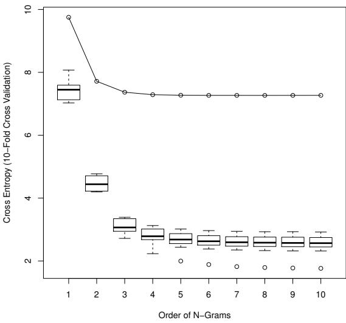
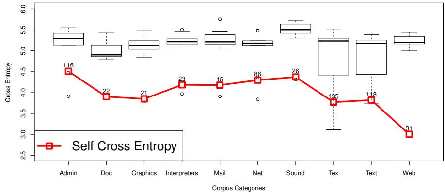
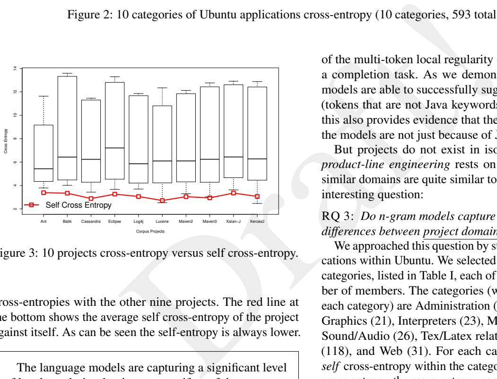
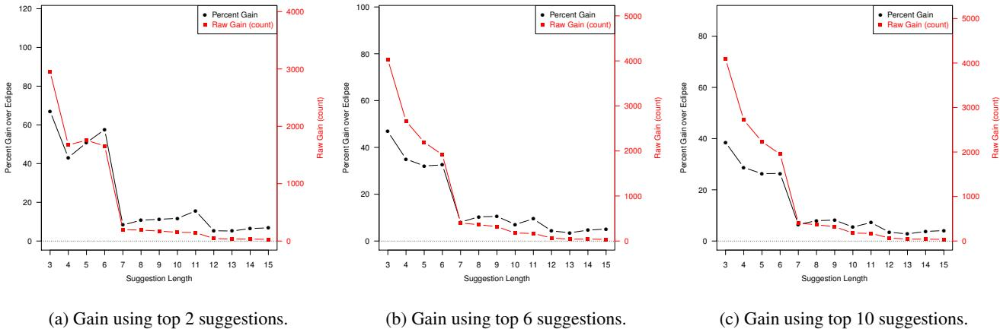

# On the Naturalness of Software

Abram Hindle, Earl Barr, Mark Gabel, Zhendong Su, Prem Devanbu *devanbu@cs.ucdavis.edu*

*Unpublished version of ICSE 2012 paper, with expanded future work section* Enjoy! Comments Welcome.

*Abstract*—Natural languages like English are rich, complex, and powerful. The highly creative and graceful use of languages like English and Tamil, by masters like Shakespeare and Avvaiyar, can certainly delight and inspire. But in practice, given cognitive constraints and the exigencies of daily life, most human utterances are far simpler and much more repetitive and predictable. In fact, these utterances can be very usefully modeled using modern statistical methods. This fact has led to the phenomenal success of statistical approaches to speech recognition, natural language translation, question-answering, and text mining and comprehension.

Draft!We begin with the conjecture that *most software is also natural*, in the sense that it is created by humans at work, with all the attendant constraints and limitations—and thus, like natural language, it is also likely to be repetitive and predictable. We then proceed to ask whether a) code can be usefully modeled by statistical language models and b) such models can be leveraged to support software engineers. Using the widely adopted n-gram model, we provide empirical evidence supportive of a positive answer to both these questions. We show that code is also very repetitive, and in fact even more so than natural languages. As an example use of the model, we have developed a simple code completion engine for Java that, despite its simplicity, already improves Eclipse's completion capability. We conclude the paper by laying out a vision for future research in this area.

*Keywords*-language models; n-gram; nature language processing; code completion; code suggestion

#### I. INTRODUCTION

The word "natural" in the title of this paper refers to the fact that code, despite being written in an artificial language (like C or Java) is a *natural product of human effort*. This use of the word *natural* derives from the field of *natural language processing*, where the goal is to automatically process texts in natural languages, such as English and Tamil, for tasks such as translation (to other natural languages), summarization, understanding, and speech recognition.

The field of natural language processing ("NLP", see Sparck-Jones [ [1\]](#page-10-0) for a brief history) went through several decades of rather slow and painstaking progress, beginning with early struggles with dictionary and grammar-based efforts in the 1960's. In the 70's and 80's, the field was reanimated with ideas from logic and formal semantics, which still proved too cumbersome to perform practical tasks at scale. Both these approaches essentially dealt with NLP from first principles—addressing *language*, in all its rich theoretical glory, rather than examining corpora of actual *utterances* , *i.e.* ,

 what people actually write or say. In the 1980's, a fundamental shift to *corpus-based, statistically rigorous* methods occurred. The availability of large, on-line corpora of natural language text, including "aligned" text with translations in multiple languages1 , along with the computational muscle (CPU speed, primary and secondary storage) to estimate robust statistical models over very large data sets has led to stunning progress and widely-available practical applications, such as statistical translation used by translate.google.com.[2](#page-0-1) We argue that an essential fact underlying this modern, exciting phase of NLP is this: *natural language may be complex and admit a great wealth of expression, but what people write and say is largely regular and predictable* .

Our central hypothesis is that the same argument applies to software:

*Programming languages, in theory, are complex, flexible and powerful, but the programs that real people actually write are mostly simple and rather repetitive, and thus they have usefully predictable statistical properties that can be captured in statistical language models and leveraged for software engineering tasks.*

We believe that this is a general, useful and practical notion that, together with the very large publicly available corpora of open-source code, will enable a new, rigorous, statistical approach to a wide range of applications, in program analysis, error checking, software mining, program summarization, and code searching.

This paper is the first step in what we hope will be a long and fruitful journey. We make the following contributions:

- 1) We provide support for our central hypothesis by instantiating a simple, widely-used statistical language model, using modern estimation techniques over large software corpora;
- 2) We demonstrate, using standard cross-entropy and per-

1This included the Canadian Hansard (parliamentary proceedings), and similar outputs from the European parliament.

2 Indeed, a renowned pioneer of the statistical approach, Fred Jelenik, is reputed to have exclaimed: "everytime a linguist leaves our group, the performance of our speech recognition goes up"!!! See [http://en.wikiquote.org/](http://en.wikiquote.org/wiki/Fred_Jelinek) [wiki/Fred](http://en.wikiquote.org/wiki/Fred_Jelinek) Jelinek .

plexity measures, that the model is indeed capturing the high-level statistical regularity that exists in software at the n-gram level (probabilistic chains of tokens);

- 3) We illustrate the use of such a language model by developing a simple code suggestion tool that already substantially improves upon the existing suggestion facility in the widely-used Eclipse IDE; and
- 4) We lay out our vision for an ambitious research agenda that exploits large-corpus statistical models of natural software to aid in a range of different software engineering tasks.

#### II. MOTIVATION & BACKGROUND

There are many ways one could exploit the statistics of natural programs. We begin with a simple motivating example. We present more ambitious possibilities later in the paper.

Consider a speech recognizer, receiving a (noisy) radio broadcast corresponding to *"In Berlin today, Chancellor Angela* <radio buzz> *announced . . . "*. A good speech recognizer might guess that the buzzed-out word was *"Merkel"* from context. Likewise, consider an integrated development environment (IDE) into which a programmer has typed in the partial statement: "for(i=0;i<10". In this context, it would be quite reasonable for the IDE to suggest the completion ";i++){ " to the programmer.

Draft!Why do these guesses seem so reasonable to us? In the first case, the reason lies in the highly predictable nature of newscasts. News reports, like many other forms of culturally contextualized and stylized natural language expression, tend to be well-structured and repetitive. With a reasonable prior knowledge of this style, it is quite possible to fill in the blanks. Thus if we hear the world "Chancellor Angela", we can expect that, *in most cases* the next word is "Merkel". This fact is wellknown and exploited by speech recognizers, natural language translation devices, and even some OCR (optical character recognition) tools. The second example relies on a lesserknown fact: *natural programs are quite repetitive*. This fact was first observed and reported in a very large-scale study of code by Gabel & Su [ [2\]](#page-10-1), which found that code fragments of surprisingly large size tend to reoccur. Thus, if we see the fragment for(i=0;i<10 we know what follows in most cases. In general, if we know the most likely sequences in a code body, we can often help programmers complete code. What this essentially amounts to is the following: *using a code corpus to estimate the probability distribution of code sequences*. With the ability to calculate such a distribution *and* if this distribution has low-entropy, given a prefix of a code sequence, we should often be able to guess with high confidence what follows.

What should the form of a such a distribution be, and how should we estimate its parameters? In NLP, these distributions are called "language models".

#### *A. Language Models*

A language model essentially assigns a probability to an utterance. For us, "utterances" are programs. More formally, consider a set of allowable program tokens [3](#page-1-0) T , and the (overgenerous) set of possible program sequences T ∗ ; we assume the set of possible implemented systems to be S ⊂ T ∗ . A language model is a probability distribution p ( . ) over systems s ∈ S , *i.e.* ,

$$\forall s \in S \left[ 0 < p(s) < 1 \right] \land \sum\_{s \in S} p(s) = 1$$

In practice, given a corpus C of programs C ⊆ S, and a suitably chosen parametric distribution p ( . ), we attempt to calculate a maximum-likelihood estimate of the parameters of this distribution; this gives us an estimated language model. The choice of a language model is usually driven by practicalities: how easy is it to estimate and how easy is it to use. For these reasons, the most ubiquitous is the *n-gram* model, which we now describe.

 Consider the sequence of tokens in a document (in our case, a system s), a 1 a 2 . . . a i . . . a n . N-gram models statistically estimate how likely tokens are to follow other tokens. Thus, we can estimate the probability of a document based on the product of a series of conditional probabilities:

$$p(s) = p(a\_1)p(a\_2 \mid a\_1)p(a\_3 \mid a\_1a\_2)\dots p(a\_n \mid a\_1\dots a\_{n-1})$$

N-gram models assume a *Markov property* , *i.e.*, token occurrences are influenced only by a limited prefix of length n, thus for 4-gram models, we assume

$$p(a\_i | a\_1 \dots a\_{i-1}) \simeq p(a\_i \mid a\_{i-3} a\_{i-2} a\_{i-1})$$

These models are estimated from a corpus using simple maximum-likelihood based frequency-counting of token sequences. Thus, if "∗" is a wildcard, we ask, how relatively often are the tokens a 1, a 2, a 3 followed by a 4 :

$$p(a\_4|a\_1a\_2a\_3) = \frac{count(a\_1a\_2a\_3a\_4)}{count(a\_1a\_2a\_3\*)}$$

In practice, estimation of n-gram models is quite a bit more complicated. The main difficulties arise from data sparsity, *i.e.*, the richness of the model in comparison to the available data. For example, with 10 4 token vocabulary, a trigram model must estimate 1012 coefficients. Some trigrams may never occur in one corpus, but may in fact occur elsewhere. This will lead to technical difficulties; when we encounter a previously unseen n-gram, we are in principle "infinitely surprised", because an "infinitely improbable" event x estimated from the previously seen corpus to have p ( x) = 0 actually occurs; this leads to infinite entropy values, as will become evident below. *Smoothing* is a technique to handle cases we where have not seen the n-grams yet and still produce usable results with sufficient statistical rigour. Fortunately, there exist a variety of

3Here we use a token to mean its lexeme.

techniques for smoothing the estimates of a very large number of coefficients, some of which are larger than they should be and others smaller. Sometimes it is better to back-off from a trigram model to a bigram model. The technical details are beyond the scope of this paper, but can be found in any advanced NLP textbook. In practice we found that Kneser-Ney smoothing (*e.g.*, Koehn [ [3\]](#page-10-2), §7) gives good results for software corpora. However, we note that these are very early efforts in this area, and new software language models and estimation techniques might improve on the results presented below.

But how do we know when we have a good language model?

#### *B. What Makes a Good Model?*

[Dr](#page-1-1)aft!Given a repetitive and highly predictable corpus of documents (or programs), a good model captures the regularities in the corpus. Thus, a good model, estimated carefully from a representative corpus, will predict with high confidence the contents of a new document drawn from the same population. Such a model can guess the contents of the new document with very high probability. In other words, the model will not find a new document particularly surprising, or "perplexing". In NLP, this idea is captured by a measure called *perplexity* , or its log-transformed version, *cross-entropy* 4 . Given a document s = a1 . . . an, of length n, and a language model M, we assume that the probability of the document estimated by the model is p M ( s ). We can write down the cross-entropy measure as:

$$H\_{\mathcal{M}}(s) = -\frac{1}{n} \log \ p\_{\mathcal{M}}(a\_1 \dots a\_n)$$

and by the formulation presented in Section II-A :

$$H\_{\mathcal{M}}(s) = -\frac{1}{n} \sum\_{1}^{n} \log \, p\_{\mathcal{M}}(a\_i \mid a\_1 \dots a\_{i-1})$$

This is a measure of how "surprised" a model is by the given document. A good model has low entropy for most documents. It gives higher probabilities, (closer to 1, and thus lower absolute log values) to most words in the document. If one could manage to deploy a (hypothetical) truly superb model within an IDE to help programmers complete code fragments, it might be able to guess with high probability most of the program, so that most of the programming work can be done by just hitting a tab key! In practice of course, we would probably be satisfied with a lot less.

But how good are the models that we can actually build for "natural" software? Is software is really as "natural" (*i.e.* , unsurprising) as natural language?

#### III. METHODOLOGY & FINDINGS

To shed light on this question, we performed a series of experiments with both natural language and code corpora, first comparing the "naturalness" (using cross-entropy) of code

|                |          |         |          | Tokens  |  |
|----------------|----------|---------|----------|---------|--|
| Java Project   | Version  | Lines   | Total    | Unique  |  |
| Ant            | 20110123 | 254457  | 919148   | 27008   |  |
| Batik          | 20110118 | 367293  | 1384554  | 30298   |  |
| Cassandra      | 20110122 | 135992  | 697498   | 13002   |  |
| Eclipse-E4     | 20110426 | 1543206 | 6807301  | 98652   |  |
| Log4J          | 20101119 | 68528   | 247001   | 8056    |  |
| Lucene         | 20100319 | 429957  | 2130349  | 32676   |  |
| Maven2         | 20101118 | 61622   | 263831   | 7637    |  |
| Maven3         | 20110122 | 114527  | 462397   | 10839   |  |
| Xalan-J        | 20091212 | 349837  | 1085022  | 39383   |  |
| Xerces         | 20110111 | 257572  | 992623   | 19542   |  |
|                |          |         | Tokens   |         |  |
| Ubuntu Domain  | Version  | Lines   | Total    | Unique  |  |
| Admin          | 10.10    | 9092325 | 41208531 | 1140555 |  |
| Doc            | 10.10    | 87192   | 362501   | 15373   |  |
| Graphics       | 10.10    | 1422514 | 7453031  | 188792  |  |
| Interpreters   | 10.10    | 1416361 | 6388351  | 201538  |  |
| Mail           | 10.10    | 1049136 | 4408776  | 137324  |  |
| Net            | 10.10    | 5012473 | 20666917 | 541896  |  |
| Sound          | 10.10    | 1698584 | 29310969 | 436377  |  |
| Tex            | 10.10    | 1405674 | 14342943 | 375845  |  |
| Text           | 10.10    | 1325700 | 6291804  | 155177  |  |
| Web            | 10.10    | 1743376 | 11361332 | 216474  |  |
|                |          |         | Tokens   |         |  |
| English Corpus | Version  | Lines   | Total    | Unique  |  |
| Brown          | 20101101 | 81851   | 1161192  | 56057   |  |
| Gutenberg      | 20101101 | 55578   | 2621613  | 51156   |  |

Table I: 10 Java Projects, C code from 10 Ubuntu 10.10 Categories, 3 English Corpus used in our study. English is the concatenation of Brown and Gutenberg. Ubuntu 10.10 Maverick was released on 2010/10/10.

with English texts, and then comparing various code corpora to each other to further gain insight into the similarities and differences between code corpora.

Our natural language studies were based on two very widely used corpora: the Brown corpus, and the Gutenberg corpus [5](#page-2-1) . For code, we used several sets of corpora, including a collection of Java projects, as well a collection of applications from Ubuntu, broken up into application domain categories. All are listed in Table I .

After removing comments, the projects were lexically analyzed to produce token sequences that were used to estimate n-gram language models. Most of our corpora are in C and Java. Extending to other languages is trivial.

The Java projects were our central focus; we used them both for cross-entropy studies, and some experiments with an Eclipse plug-in for a language-model-based code-suggestion task. Table [I](#page-2-2) describes the 10 Java projects that we used. The *Version* indicates the date of the last revision in the Git repository when we cloned the project. *Unique Tokens* refers to the number of different kinds of tokens that make up the total token count given in the *Tokens* field. *Lines* is calculated using Unix wc on all files within each repository, and tokens

4[http://en.wikipedia.org/wiki/Cross](http://en.wikipedia.org/wiki/Cross_entropy) entropy; see also [\[4\]](#page-10-3), §2.2, page 75, equation 2.50

5We retrieved these corpora from [http://www.nltk.org/.](http://www.nltk.org/)

Figure 1: Comparison of English Cross-Entropy versus the Code Cross Entropy of 10 projects.

Draft!are extracted from each of these files. The Ubuntu domain categories were quite large in some cases, ranging up to 9 million lines, 41 million tokens (one million unique). The number of unique tokens is interesting and relevant, as they give a very rough indication on the potential "surprisingness" of the project corpus. If these unique token were uniformly distributed throughout the project (highly unlikely), we could expect a cross-entropy of log 2(1 .15 E6), or approximately 20 bits. A similar calculation for the Java projects ranges from about 13 bits to about 17 bits.

#### *A. Cross-Entropy of Code*

Cross-entropy is a measure of how surprising a test document is to a distribution model estimated from a corpus. Thus if one tests a corpus against itself, one has to set aside some portion of the corpus for testing, and estimate (train) the model on the rest of the corpus. In all our experiments, we measured cross-entropy by averaging out over a 10-fold cross-validation: we split the corpus 90%–10% (in lines) at random 10 locations, trained on the 90% and tested on 10%, and measured the average cross-entropy. A further bit of notation: when we say we measured the cross-entropy of X to Y , Y is the training corpus used to estimate the parameters of the distribution model M Y used to calculate HM Y ( X ) .

First, we wanted to see if there was evidence to support the claim that software was "natural", in the same way that English is natural, *viz.*, whether regularities in software could be captured by language models.

RQ 1: *Do n-gram language models capture regularities in software?*

To answer this question, we estimated *n*-gram models for several values of *n* over both the English corpus and the 10 Java language project corpora, using averages over 10-fold cross validation (each corpus to itself) as described above. The results are in Figure [1.](#page-3-0) The single line above is the average over the 10 folds for the English corpus, beginning at about 10 bits for unigram models, and trailing down to under 8 bits for *10*-gram models. The average self cross-entropy for the 10 projects are shown below in boxplots, one for each order from unigram models to 10-gram models. Several observations can be made. First, software unigram entropy is much lower than might be expected from a uniform distribution over unique tokens, because token frequencies are obviously very skewed.

 ● ● ● ● ● ● Second, *cross-entropy declines rapidly with n-gram order* , saturating around tri- or 4-grams. The similarity in the decline in English and the Java projects is striking. This decline suggests that there is as much of *repetitive local context that is being captured by the language model* in Java programs, as it is in the English corpora. We take this to be highly encouraging: the ability to model the regularity of the local context in natural languages has proven to be extremely valuable in statistical natural language processing; we hope (and in fact, provide some evidence to support the claim) that this regularity can be exploited for software tools.

> Last, but not least, *software is far more regular than English* with entropies sinking down to under 2 bits in some cases.

Corpus-based statistical language models can capture a high level of local regularity in software, even more so than in English.

This raises a worrying question: is the increased regularity we are capturing in software merely a difference between English and Java? Java is certainly a much simpler language than English, with a far more structured syntax. Might not the lower entropy be simply an artifact of the artificially simple syntax for Java? If the statistical regularity of the local context being captured by the language model were simply arising from the simplicity of Java, then we should find this uniformly across all the projects; in particular, if we train a model on one Java project, and test on another, we should successfully capture the local regularity in the language. Thus, we sublimate this anxiety-provoking question into the following:

## RQ 2: *Is the local regularity that the statistical language model captures merely language-specific or is it also project-specific?*

This is a pretty simple experiment. For each of the 10 projects, we train a trigram model, and evaluate its crossentropy with each of the 9 others, and compare the value with the average 10-fold cross-entropy against itself. This plot is shown in Figure [3.](#page-4-0) The x-axis lists all the different Java projects, and, for each, the boxplot shows the range of

Figure 2: 10 categories of Ubuntu applications cross-entropy (10 categories, 593 total packages).

Figure 3: 10 projects cross-entropy versus self cross-entropy.

cross-entropies with the other nine projects. The red line at the bottom shows the average self cross-entropy of the project against itself. As can be seen the self-entropy is always lower.

The language models are capturing a significant level of local regularity that is *not* an artifact of the programming language syntax, but rather arising from "naturalness" or repetitiveness specific to each project.

This is a rather noteworthy result: it appears each project has its own type of local, non-Java-specific regularity that is being captured by the model; furthermore, the local regularity of each project is *special unto itself*, and different from that of the other projects. Most software engineers will find this intuitive: each project has its own vocabulary, and specific local patterns of iteration, field access, method calls, *etc.* It is important to note that the models are capturing non-Javaspecific project regularity beyond simply the differences in unigram vocabularies. In section [IV,](#page-5-0) we discuss the application

 of the multi-token local regularity captured by the models to a completion task. As we demonstrate in that section, the models are able to successfully suggest non-linguistic tokens (tokens that are not Java keywords) about 50% of the time; this also provides evidence that the low entropy produced by the models are not just because of Java language simplicity.

But projects do not exist in isolation; the entire idea of *product-line engineering* rests on the fact that products in similar domains are quite similar to each other. This raises the interesting question:

### RQ 3: *Do n-gram models capture similarities within and differences between project domains?*

We approached this question by studying categories of applications within Ubuntu. We selected 10 the application domain categories, listed in Table I, each of which had a sizeable number of members. The categories (with number of projects in each category) are Administration (116), Documentation (22), Graphics (21), Interpreters (23), Mail (15), Networking (86), Sound/Audio (26), Tex/Latex related (135), Text processing (118), and Web (31). For each category, we calculated the *self* cross-entropy within the category (red box) and the *other* cross-entropy, the cross-entropy against all the other categories (boxplot), shown in Figure [2.](#page-4-1) Here again, as in Figure [3,](#page-4-0) we see that there appears to be a lot of local regularity repeated *within* application domains, and much less so across application domains. Some domains, *e.g.* the Web, appear to have a very high-level of regularity (and lower self-entropy); this is an interesting phenomenon, requiring further study.

Concluding Discussion We have seen that a high degree of local repetitiveness, or regularity, is present in code corpora and, furthermore, that n-gram models effectively capture these local regularities. We find evidence suggesting that these local regularities are specific to both projects and to application domains. We also find evidence that these regularities arise not merely from the relatively more regular (when compared to natural languages) syntax of Java, but also arise from other types of project- and domain-specific local regularities that exist in the code. In the next section, we demonstrate that these project-specific regularities are actually useful, by using project-specific models to extend the Eclipse suggestion engine; we also show that the n-gram models quite often (about 50% of the time) provide suggestions that are project-specific, rather than merely suggesting Java keywords guessable from context.

In Natural language, these local regularities have proven to be of profound value, for tasks such as translation. It is our belief that these simple local regularities can be used for code summarization and code searching; we also believe that deeper, semantic properties will also be in general manifest in these same local regularities. These are discussed further in future work section (Section VI).

#### IV. SUGGESTING THE NEXT TOKEN

The strikingly low entropy (between 3 and 4 bits) produced by the smoothed n-gram model indicates that even at the local token-sequence level, there is a high degree of "naturalness". If we make 8-16 guesses ( 2 3 − 2 4 ) as to what the next token is, we may very well guess the right one!

Eclipse Suggestion Plug-in We built an Eclipse plug-in to test this idea. Eclipse, like many other IDEs, has a built-in *suggestion* engine that suggests a next token whenever it can. Eclipse (and other IDEs) suggestions are typically based on type information available in context. We conjectured that corpus-based n-gram models suggestion engine (for brevity, N GSE) could enhance eclipse's built-in suggestion engine (for brevity, ECSE) by offering tokens that tend to *naturally* follow from preceding ones in the relevant corpus.

The N GSE uses a trigram model built from the corpus of a lexed project. At every point in the code, N GSE uses the previous two tokens, already entered into the text buffer, and attempts to guess the next token. The language model built from the corpus gives maximum likelihood estimates of the probability of a specific choice of next token; this probability can be used to rank order the likely next tokens. Our implementation produces rank-ordered suggestions in less than 0.2 seconds on average. Both N GSE and ECSE produce many suggestions. Presenting all would be overwhelming. Therefore we need to come up with a heuristic to merge the lists from the two groups: given an admissible number n of suggestions to be presented to the user, choose n candidates from both N GSE's and ECSE's offers.

We observed that in general, N GSE was good at recommending *shorter* tokens, and ECSE was better at longer tokens (we discuss the reasons for this phenomenon later in this section). This suggested the simple merge algorithm MSE , defined in Algorithm [1.](#page-5-1) Whenever Eclipse offers long tokens (we picked 7 as the break-even length, based on observation) within the top n, we greedily pick all the top n offers from

Algorithm 1 MSE(eproposals, nproposals, maxrank, minlen) Require: eproposals and nproposals are ordered sets of

Eclipse and N-gram proposals.

| { ∈ eproposals[1maxrank ]   strlen } elong := p ( p ) > 6             |
|-----------------------------------------------------------------------------------------------------|
| if elong 6= ∅ then                                                                            |
| return eproposals[1maxrank]                                                                         |
| end if                                                                                              |
| maxrank maxrank d e ◦ nproposals[1 b c return eproposals[1 ] ] 2 2 |

Eclipse. Otherwise, we pick half from Eclipse and half from n-grams.

 The relative performance of MSE and ECSE in actual practice might depend on a great many factors, and would require a well-controlled, human study to be done at scale. A suggestion engine can present more or fewer choices; it may offer all suggestions, or only offer suggestions that are long. Suggestions could be selected with a touch-screen, with a mouse, or with a down-arrow key. Since our goal here is to gauge the power of corpus-based language models, as opposed to building the most user-friendly merged suggestion engine (which remains future work) we conducted an automated experiment, rather than a human-subject study.

Draft!We controlled for 2 factors in our experiments: the string length of suggestions l, and the number of choices n presented to the user. We repeated the experiment varying n, for n = 2 , 6 , 10 and l, for l = 3 , 4 , 5, . . . 15. We omitted suggestions less than 3 characters, as not useful. Also, when merging two suggestion lists, we chose to pick at least one from each, and thus n ≥ 2. We felt that more than 10 choices would be overwhelming—although our findings do not change very much at all even with 16 and 20 choices. We choose 5 projects for study: *Ant, Maven, Log4J, Xalan*, and *Xerces*. In each project, we set aside a test set of 40 randomly chosen files (200 set aside in all) and built a trigram language model on the remaining files for each project. We then used the MSE and ECSE algorithms to predict every token in the 40 set-aside files, and evaluated how many *more* times the MSE made a successful suggestion, when compared to the basic ECSE. In each case, we evaluated the advantage of MSE over ECSE , measured as the (percent and absolute) gain in number of correct suggestions at each combination of factors n and l .

> How does the language model help? The results are presented in Figure [4.](#page-6-0) Note that the figure has two y-scales: the left side (black circle points) is percent additional correct suggestions, and the right side (red square points) are the raw counts. Since the raw count of successful suggestions from the Eclipse engine ECSE also declines with length, both measures are useful. As can be seen MSE provides measurable advantage over ECSE in all settings of both factors, although the advantage in general declines with l. The gains up through 6-character tokens are quite substantial, in the range of 33–

Figure 4: Suggestion gains from merging n-gram suggestions into those of Eclipse.

67% additional suggestions from the language model that are correct; between 7 and 15 characters, the gains range from 3–16%.

Draft!The additional suggestions from N GSE run the gamut, including methods, classes & fields predictable from frequent trigrams in the corpus, (*e.g.*, println, iterator, IOException, append, toString, assertEquals, transform), package names (*e.g.*, apache, tools, util, java) as well as language keywords (*e.g.*, import, public, return, this). An examination of the tokens reveals why the n-grams approach adds most value with shorter tokens. The language model we build is based on *all* the files in the system, and the most frequent n-grams are those that occur frequently in all the files. In the corpus, we find that coders tend to choose shorter names for entities that are used more widely and more often; naturally these give rise to stronger signals that are picked up by the n-gram language model. It is worth repeating here that a significant portion, *viz.*., 50% of the successful suggestions are not Java keywords guessed from language context—they are project-specific tokens. This reinforces our claim that the statistical language model is capturing a significant level of local regularity in the project corpus.

In the table below, we present we present a different way of looking at the benefit of MSE; the total number of keystrokes saved by using the base ECSE, (first row) the MSE (second row) and the percent gain from using MSE.

|          | Top 2 | Top 6  | Top 10 |
|----------|-------|--------|--------|
| ECSE     | 42743 | 77245  | 95318  |
| MSE      | 68798 | 103100 | 120750 |
| Increase | 61%   | 33%    | 27%    |

We close this section by pointing out that we used one specific language model to enhance one specific software tool, a

suggestion engine. With more sophisticated language models, specifically ones that combines syntax, scoping and type information, we expect to achieve even lower entropy, and thus better performance in this and other software tools.

#### V. RELATED WORK

There are a few related areas of research, into which this line of work could be reasonably contextualized.

Code Completion and Suggestion By *completion* we mean the task of completing a partially typed-in token; by *suggestion* we mean suggesting a complete token. The discussion above concerned *suggestion* engines.

Several modern mature software development environments (SDEs) provide both code completion and code suggestion, often with a unified interface. Two notable open-source Javabased examples are Eclipse and IntelliJ IDEA. As in our work, these tools draw possible completions from existing code, but the methods of suggestion are fundamentally different.

Eclipse and IntelliJ IDEA respond to a programmer's completion request (a keyboard shortcut such as ctrl+space) by deducing what tokens "might apply" in the current syntactic context. Here, the tools are primarily guided by Java programming language semantics. For example, both Eclipse and IntelliJ IDEA respond to a completion request, by parsing available source code, and create a short list of expected token types. If this list contains, say, a reference type, the tools use the rules of the type system to add a list of currently-defined type-names to the list of completions. Similarly, if a variable is expected, the tools names visible in the symbol table. Eclipse and IDEA implement dozens of these "syntactic and semantic rules" for various classes of syntactic constructs. As a final step, both tools rank the completions with a collection of apparently hand-coded heuristics.

Our approach is complementary. Rather than using language semantics and immediate context, to guess what *might* apply, our n-gram language model captures what *most often does* apply. Our approach offers a great deal more flexibility and it also has the potential to be much more precise: the space of commonly used completions is naturally far smaller than the space of "language-allowed" completions. We emphasize, however, that our approach is generally complementary; language based guesses can be enhanced (or ordered) using corpus statistics. It's noteworthy that perhaps some of the strongest evidence for the "naturalness" of software, though, is how well our completion prototype functions *in spite of not doing this* .

There are approaches arguably more advanced than those currently available in IDEs. The BMN completion algorithm of Bruch *et al.* [ [5\]](#page-10-4) is focused on finding the most likely *method calls* likely to complete an expression by using frequency of method calls and prior usage in similar circumstances. We propose a broad vision for using language models of code corpora in software tools. Our specific illustrative completion application has a broader completion goal, completing all types of tokens, not just method calls. Later, Bruch *et al.* [ 6 ] lay out a vision for next-generation IDEs that take advantage of "collective wisdom" embodied in code bodies and recorded human action. We enthusiastically concur with this vision; our specific approach is that "natural software" has statistical regularities that allow techniques from statistical NLP to be profitably applied in the endeavor to make this vision a reality.

[D](#page-10-7)ra[ft!](#page-10-16)Robbes and Lanza [ [7\]](#page-10-6) compare a set of different methodcall and class-name completion strategies, which start with a multi-*letter* prefix. They introduce an approach based on history and show that it improves performance. Our approach is complementary to theirs: it can provide full-token completion of any token and is based a language model that exploits regularities in program corpora. Han *et al.* [ 8] uses Hidden Markov Models (HMM) to infer likely tokens from short form tokens mentioned. They make use of a dynamic programming trellis approach for backtracking and suggestion. Their HMM is in fact a language model, but the paper does not describe how effective a model it is or how well it would perform for completion tasks without user-provided abbreviations.

Jacob and Tairas [ [9\]](#page-10-8) used N-gram language models for a different application: to find matching code clones relevant to partial programming task. Language models were built over clone groups (not entire corpora as we propose) and used to retrieve and present candidate clones relevant to a partially completed coding task.

Hou and Pletcher [\[10\]](#page-10-9) used context-specific API information in order to enable the sorting of Eclipse code completions by using static type-based information. Users may optionally filter out future completion proposals.

The "naturalness" of names in code There has been a line of work on automatically evaluating the quality of entity names in code: do the names reflect the meanings of the artifacts, and if not, how could they be improved [\[11](#page-10-10) , [12\]](#page-10-11)? Work by Høst and Østvold [\[13](#page-10-12) , [14\]](#page-10-13) also concerns method naming: they combine static analysis with an entropy-based measure over the distribution of simple semantic properties of methods in a corpus to determine which method names are most discriminatory, and they use it to detect names whose usage are inconsistent with the corpus. While this work does not explicitly use a language model to capture the general "naturalness" of software over a large corpus, it does have some similarity to a future line of work we propose below.

Summarization and Concern Location There is also a line of work on generating natural language descriptions (summaries) of code [\[15](#page-10-14)[–17\]](#page-10-15). This work relies on inferring semantic properties of code by static analysis, rather than leveraging the "natural" regularities of software corpora as captured by statistical models; it is complementary to ours: properties derived by static analysis (as long as they can be done efficiently, and at scale) could be used to enrich statistical models of large software corpora. Another line of work seeks to locate parts of code relevant to a specified concern (*e.g.* "place auction bid"), which could be local or cross-cutting, based on fragments of code names [18], facts mined from code [\[19\]](#page-10-17), or co-occurrence of related words in code [20].

NLP and Requirements Researchers have studied the use of natural language in requirements engineering: can we utilize natural language specifications to automatically generate more formal specifications, or even code? [\[21](#page-10-19) [–23\]](#page-10-20) Some of these approaches make use of NLP tools like parsers and part-ofspeech taggers. Our approach considers instead the "naturalness" of *code*, as embodied in statistical models built from large corpora of artifacts; however we also consider (in future work) the possibility of using aligned (code/natural language) corpora for tasks such as code summarization or code search, which could be viewed as translation tasks.

Software Mining Work in this very active area [\[24\]](#page-10-21) aims to mine *useful information* from software repositories. Many papers can be found in MSR conference series at ICSE, and representative works include mining API usages [\[25,](#page-10-22) [26\]](#page-10-23), patterns of errors [27 , [28\]](#page-10-25), topic extraction [\[29\]](#page-10-26), guiding changes [\[30](#page-10-27) ] and several others. The approaches used vary. We argue that the "naturalness" of software provides a *conceptual perspective* for this work, and also offers some novel *implementation* approaches. The *conceptual perspective* rests on the idea *useful information* is often manifest in software in uniform, and uncomplicated ways; the *implementation approach* indicates that the uniform and uncomplicated manifestation of useful facts can be determined from a large, representative software corpus in which the required information is already known and annotated. This corpus can be used to estimate the statistical relationship between the required information and readily observable facts; this relationship can be used to reliably find similar information in new programs similar to the corpus. We explain this further in future work (Sections [VI-C](#page-8-1) and [VI-D\)](#page-8-2).

#### VI. FUTURE DIRECTIONS

We present now possible applications of corpus-based statistical methods to aid software engineering tasks.

#### *A. Improved Language Models*

In this paper, we exploited a common language model (ngrams) that effectively captures local regularity. There are several avenues for extension. Existing, very large bodies of code can be readily parsed, typed, scoped, and even subject to simple semantic analysis. All of these can be modeled using enhanced language models to capture regularities that exist at syntactic, type, scope, and even semantic levels.

There's a difficulty here: the richer a model, the more data is needed to provide good estimates for the model parameters; thus the risk of data sparsity grows as we enrich our models. Ideas analogous to the smoothing techniques used in n-gram models will have to be adapted and applied to build richer models of software corpora. Still, if regularities in syntax, type, scope, and even semantic properties can be captured in models, these may then be exploited for software engineering tasks, some of which we discuss further below.

#### *B. Language Models for Accessibility*

Some programmers have difficulty using keyboards, because of RSI or visual impairment. There has been quite a bit of work on aiding such programmers using speech recognition (*e.g.*, [\[31–](#page-10-28)[33\]](#page-10-29)). However, these approaches suffer from fairly high recognition error rates and are not widely used [34]. None of the published approaches make use of a statistical language model trained on specific code corpora. We hypothesize that the use of a language model can significantly reduce the error rates; they certainly play a crucial role in conventional speech recognition engines. Because a large proportion of development work occurs in a maintenance or re-engineering context, language models derived from existing code should improve the performance of these speech recognition systems. Even when only a small amount of relevant code exists, language model adaptation techniques [35] could be applied, using corpora of similar code.

#### *C. Summarizing and/or Retrieving Code*

Consider the task of summarizing a fragment of code (or change to code) in English. Consider also the approximate reverse task: finding/retrieving a relevant fragment of code (*e.g.* method call) given an English description. We draw an analogy between these two problems and *statistical natural language translation*, (SN LT ). Code and English are two languages, and essentially both the above are *translation* tasks. SN LT relies on access to an *aligned corpus*, which is a large set of sentences simultaneously presented in two or more languages (*e.g.*., proceedings of parliaments in Canada and Europe). Consider the problem of translating a Tamil sentence T to an English sentence E. The translation process works by

calculating the most likely sentence using a conceptually simple Bayesian probability formulation, by maximizing the right hand size of this equation over all possible English sentences E:

$$p(E \mid T) = \frac{p(T \mid E).p(E)}{p(T)}$$

The denominator can safely be ignored, as long as we just maximize the numerator. Of the two terms in the numerator, the distribution p ( T | E ) is estimated using an aligned corpus; and the distribution p ( E ) can be estimated over the English part of the aligned corpus, or another available English corpus. Note the formulations works both ways, and be used for the reverse translation task.

[D](#page-10-31)[r](#page-10-30)aft! We propose to tackle the summarization/retrieval task using statistical estimates derived from several corpora. First, we use an aligned (English/Code) corpora built from multiple sources: One source arises from the version history of a program. Each commit in a typical project offers a matched pair of a log message (English), and some changes (Code). Another source of aligned examples are in-line comments that are clearly matchable with nearby code [\[36\]](#page-10-32). Second, we can use the any available English language text associated with a given project, including all comments in the code, any available code or design documents, bug reports, discussions on mailing lists etc, to build a relevant English corpus. Finally, we use the code of the project to build the code corpus. With these corpora one can build estimate models of distributions of the form p ( C ) for code fragments, p ( C|E ) of code probability distributions conditional on aligned English text, and vice versa; these models can then be used to select maximally likely code fragments given English descriptions, or vice versa, using the standard Bayesian formulation presented above. This approach could use semantic properties of code, as well; however, unlike Buse & Weimer [16], who document the semantics of each change in isolation, we would use statistics of semantic properties over large aligned code/text corpora; these statistics might allow us to provide the *reason* why changes were made, rather than just documenting *what* was changed.

#### *D. Software Tools*

We hypothesize that the "naturalness" of software implies a "naturalness" of deeper properties of software, such as those normally computed by powerful but expensive software tools; we hypothesize that (because programmers tend to be repetitive, and not too creative) deeper, more semantic properties of programs are *also* manifest in programs in superficially similar ways. More specifically, we hypothesize that semantic properties are *usually* manifest in *superficial* ways that are computationally cheap to detect, particularly when compared to the cost (or even infeasibility) of determining these properties by sound (or complete) static analysis.

For example, the use of unprotected string functions like strcat (as opposed to strncat) is evidence for a potential buffer flow, but not conclusive proof. As another example, suppose 3 related methods (wherein the "relatedness" has been detected using a recommender system [\[37](#page-10-34) , [38\]](#page-10-35)) open, access, close are called together in the same method, with the 3 methods occurring in that textual order in the code, and access occurring within a loop. This is evidence (albeit not conclusive) that the 3 methods are to be used with the protocol open-access∗-close. These are heuristics, analogous to the probabilistic constraints used in Merlin (See Livshits *et al.* [\[39\]](#page-11-0), Figure 3). But where do they come from? In Merlin, they are hard-coded heuristics based on researchers' intuitions; we argue rather that they should be derived from building corpus-level distribution models, making using of prior knowledge about protocols already known to be in use in those corpora.

This admittedly is a leap of faith; however, if it holds up (and we have found anecdotal evidence that it does, and some prior research implicitly makes a version of this assumption [39]) one can leverage this notion to build simple, scalable, and effective approximations in a wide variety of settings, as we now describe.

Consider a very general formulation of a software tool that computes a function f over a system s, drawn from a domain of systems S thus:

#### f ( s) : S −→ D ,

Draft!where the range D represents a fact derived by analysis (*e.g.* a may-alias fact), or a mined rule (*e.g.* an API protocol), or a error message (*e.g.* buffer-overflow warning), or even a new, transformed version of the input system s ∈ S. Let us assume that the function f is in general expensive or even infeasible to calculate, and is thus subject to approximation error and calculation delays in practice. We reformulate this problem by estimating f using an alternative formulation, ˆf, which chooses the *most likely* value of f ( s ), given an easily calculated and readily observed set of *evidence features* e 1 ( s ), e 2 ( s ), . . . Features ei(s) are like "symptoms" that are not deterministic, conclusive proof of a specific conclusion f ( s ), but nevertheless provide varying levels of justification for a probabilistic belief in f ( s ) .

We can formulate this from a Bayesian perspective. First, we write down the probability that d holds of system s, given the observed bits of evidence e i ( s ) :

$$p(d \mid s) = \frac{p(e\_1(s), e\_2(s), \dots, e\_n(s)) \mid d).p(d)}{p(e\_1(s), e\_2(s), \dots, e\_n(s))}$$

We argue that the distributions on the right-hand side can be estimated using large-corpus statistics. The denominator can be estimated using the observed frequencies of evidence events. For the numerator, the prior distribution p ( d ) is the prior frequency of the output domain of f. The prior could be estimated from observations in the corpus (*e.g.* How often due concurrency or buffer overflow errors occur? How often do different protocol patterns occur? *etc.*). In the absence of such information, a uninformative (uniform) prior could be chosen.

 Next, we estimate the strength of the association (likelihood) between the conclusion *d* and the observed features e1(s). . . en(s) in the corpus. p(e1(s), e2(s), . . . en(s))|d) is the conditioned frequency of observation of feature observations in the corpus when the output domain property d holds. This term requires the availability of a corpus annotated with property d . Even in cases where d must be manually annotated, we argue that such corpora may be well-worth the investment (by analogy with the Penn Tree Bank [\[40\]](#page-11-1)) and can be constructed using volunteer open-source community, and perhaps such market mechanisms as the Mechanical Turk [\[41\]](#page-11-2). In some cases, the manual annotation is not a huge effort. Consider the problem of mining a protocol for a given API from a code body. Assume for example a (previously known) API with 3 methods, grouped in the protocol connect-access ∗-disconnect , and a large corpus of code known to correctly use this API. This corpus can then be used to evaluate the strength of the association between this known protocol and features in the code; the only manual effort required here is to select the indicative features, and identify the corpus and the relevant protocol. Once the association strength of a number of known protocols is evaluated, it becomes possible, given a new API and a code corpus that uses this API, to scan through a corpus quickly and evaluate the evidence in support of the different possible protocols applicable to this API.

A similar case applies when a good body of bug-fix data is available, in version history, and the etiology of the bugs is well-known. In this case, we could use version control tools to establish the provenance of different types of bugs, which are a form of annotation d over the buggy code fragments.

Finally, assuming suitable models to enable calculation of p ( d | s ) can be estimated, we write the alternative, probabilistic function ˆf to choose the most likely d:

$$\hat{f}(s) = \underset{d \in \mathcal{D}}{\text{arg}\max} \, p(d \mid s)$$

We hasten to add that this Bayesian formulation is just to provide an intuition on how corpus-based statistics can be used in a principled way to aid in the construction of approximating software engineering tools. In practice, a machine learning formulation (such as decision-trees, support-vector machines, or even simple regression models) might prove more expedient.

#### VII. CONCLUSION

Although Linguists (sometimes) revel in the theoretical complexities of natural languages, most "natural" utterances, in practice, are quite regular and predictable and can in fact be modeled by rigorous statistical methods. This fact has revolutionized computational linguistics. We offer evidence supporting an analogous claim for software: *though software in theory can be very complex, in practice, it appears that even a fairly simple statistical model can capture a surprising amount of regularity in "natural" software*. This simple model is strong enough for us to quickly and easily implement a fairly powerful suggestion engine that already improves a state-of-the-art

IDE. We also lay out a vision for future work. Specifically, we believe that natural language translation approaches can be used for code summarization and code search in a symmetric way; we also hypothesize that the "naturalness" of software implies a sort of "naturalness" of deeper properties of software, such as those normally computed by powerful, traditional software analysis tools. These are challenging tasks, but with potentially high pay-off, and we hope others will join us in this work.

#### REFERENCES

- [1] K. Sparck Jones, "Natural language processing: a historical review," *Current Issues in Computational Linguistics: in Honour of Don Walker (Ed Zampolli, Calzolari and Palmer), Amsterdam: Kluwer*, 1994.
- [2] M. Gabel and Z. Su, "A study of the uniqueness of source code," in *Proceedings, ACM SIGSOFT FSE*. ACM, 2010, pp. 147–156.
- [3] P. Koehn, *Statistical Machine Translation*. Cambridge University Press, 2010.
- [4] C. Manning, H. Sch "utze, and MITCogNet, *Foundations of statistical natural language processing*. MIT Press, 1999, vol. 59.
- [5] M. Bruch, M. Monperrus, and M. Mezini, "Learning from examples to improve code completion systems," in *Proceedings, ACM SIGSOFT ESEC/FSE*, 2009.
- [6] M. Bruch, E. Bodden, M. Monperrus, and M. Mezini, "Ide 2.0: collective intelligence in software development," in *Proceedings of the FSE/SDP workshop on Future of software engineering research*. ACM, 2010, pp. 53–58.
- [7] R. Robbes and M. Lanza, "Improving code completion with program history," *Automated Software Engineering*, vol. 17, no. 2, pp. 181–212, 2010.
- [8] S. Han, D. R. Wallace, and R. C. Miller, "Code completion from abbreviated input," in *ASE*. IEEE Computer Society, 2009, pp. 332–343.
- [9] F. Jacob and R. Tairas, "Code template inference using language models," in *Proceedings of the 48th Annual Southeast Regional Conference*, 2010.
- [10] D. Hou and D. Pletcher, "An Evaluation of the Strategies of Sorting, Filtering, and Grouping API Methods for Code Completion," in *Proceedings, ICSM*, 2011.
- [11] D. Lawrie, C. Morrell, H. Feild, and D. Binkley, "What?s in a name?; a study of identifiers," *Proceedings, ICPC*, 2006.
- [12] D. Binkley, M. Hearn, and D. Lawrie, "Improving identifier informativeness using part of speech information," in *Proceedings, MSR*. ACM, 2011.
- [13] E. W. Hø st and B. M. Ø stvold, "Software language engineering," D. Gasevi ˇ c, R. L ´ ammel, and E. Wyk, Eds. Berlin, ¨ Heidelberg: Springer-Verlag, 2009, ch. The Java Programmer's Phrase Book.
- [14] E. Høst and B. Østvold, "Debugging method names," in *Proceedings ECOOP*. Springer, 2009, pp. 294–317.
- [15] G. Sridhara, E. Hill, D. Muppaneni, L. Pollock, and K. Vijay-Shanker, "Towards automatically generating summary comments for java methods," in *Proceedings, ASE*, 2010.
- [16] R. Buse and W. Weimer, "Automatically documenting program changes," in *Proceedings, ASE*. ACM, 2010, pp. 33–42.
- [17] G. Sridhara, L. Pollock, and K. Vijay-Shanker, "Automatically detecting and describing high level actions within methods," in *Proceedings, ICSE*, 2011.
- [18] D. Shepherd, Z. Fry, E. Hill, L. Pollock, and K. Vijay-Shanker, "Using natural language program analysis to locate and under-

stand action-oriented concerns," in *Proceedings, AOSD*. ACM, 2007, pp. 212–224.

- [19] R. S., G. Murphy, and A. Bradley, "Generating natural language summaries for cross-cutting source code concerns," in *Proceedings, ICSM*, 2011.
- [20] D. Shepherd, L. Pollock, and T. Tourwe, "Using language clues ´ to discover crosscutting concerns," in *ACM SIGSOFT Software Engineering Notes*, vol. 30, no. 4. ACM, 2005, pp. 1–6.
- [21] S. J. Korner and W. F. Tichy, "Text to software," in ¨ *Proc. FSE/SDP Workshop on the Future of Software Engineering Research*. ACM, Nov. 2010.
- [22] S. Konrad and B. Cheng, "Real-time specification patterns," in *Proceedings ICSE*, 2005.
- [23] C. Rolland and C. Proix, "A natural language approach for requirements engineering," in *Advanced Information Systems Engineering*. Springer, 1992, pp. 257–277.
- [24] T. Xie, S. Thummalapenta, D. Lo, and C. Liu, "Data mining for software engineering," *IEEE Computer*, vol. 42, no. 8, pp. 35–42, 2009.
- [25] M. Gabel and Z. Su, "Javert: fully automatic mining of general temporal properties from dynamic traces," in *Proceedings, ACM SIGSOFT FSE*. ACM, 2008, pp. 339–349.
- [26] D. Mandelin, L. Xu, R. Bod ´ık, and D. Kimelman, "Jungloid mining: helping to navigate the api jungle," in *ACM SIGPLAN Notices*, vol. 40, no. 6. ACM, 2005, pp. 48–61.
- Draft! [27] B. Livshits and T. Zimmermann, "Dynamine: finding common error patterns by mining software revision histories," *ACM SIGSOFT Software Engineering Notes*, vol. 30, no. 5, pp. 296– 305, 2005.
	- [28] S. Kim, K. Pan, and E. Whitehead Jr, "Memories of bug fixes," in *Proceedings, ACM SIGSOFT FSE*. ACM, 2006, pp. 35–45.
	- [29] E. Linstead, S. Bajracharya, T. Ngo, P. Rigor, C. Lopes, and P. Baldi, "Sourcerer: mining and searching internet-scale software repositories," *Data Mining and Knowledge Discovery*, vol. 18, no. 2, pp. 300–336, 2009.
	- [30] T. Zimmermann, P. Weisgerber, S. Diehl, and A. Zeller, "Mining version histories to guide software changes," in *Proceedings of the 26th international conference on Software Engineering* . IEEE Computer Society, 2004, pp. 563–572.
	- [31] S. Arnold, L. Mark, and J. Goldthwaite, "Programming by voice, VocalProgramming," in *Proceedings, ACM Conf. on Assistive technologies*. ACM, 2000, pp. 149–155.
	- [32] A. Begel, "Spoken Language Support for Software Development," in *Proceedings, VL/HCC*. IEEE Computer Society, 2004, pp. 271–272.
	- [33] T. Hubbell, D. Langan, and T. Hain, "A voice-activated syntaxdirected editor for manually disabled programme rs," in *Proceedings, ACM SIGACCESS*. ACM, 2006.
	- [34] S. Mills, S. Saadat, and D. Whiting, "Is voice recognition the solution to keyboard-based RSI?" in *Automation Congress, 2006. WAC '06. World*, 2006.
	- [35] J. Bellegarda, "Statistical language model adaptation: review and perspectives," *Speech Communication*, vol. 42, no. 1, pp. 93–108, 2004.
	- [36] G. Antoniol, G. Canfora, G. Casazza, A. D. Lucia, and E. Merlo, "Recovering traceability links between code and documentation," *IEEE Transactions on Software Engineering*, vol. 28, pp. 970– 983, 2002.
	- [37] Z. Saul, V. Filkov, P. Devanbu, and C. Bird, "Recommending random walks," in *Proceedings, ACM SIGSOFT ESEC/FSE* . ACM, 2007, pp. 15–24.
	- [38] M. Robillard, "Automatic generation of suggestions for program investigation," in *ACM SIGSOFT Software Engineering Notes* , vol. 30, no. 5. ACM, 2005, pp. 11–20.
- [39] B. Livshits, A. Nori, S. Rajamani, and A. Banerjee, "Merlin: specification inference for explicit information flow problems," in *ACM SIGPLAN Notices*, vol. 44, no. 6. ACM, 2009, pp. 75–86.
- [40] M. Marcus, M. Marcinkiewicz, and B. Santorini, "Building a

large annotated corpus of english: The penn treebank," *Computational linguistics*, vol. 19, no. 2, pp. 313–330, 1993.

[41] A. Kittur, E. Chi, and B. Suh, "Crowdsourcing user studies with mechanical turk," in *Proceedings, CHI*. ACM, 2008.

Draft!