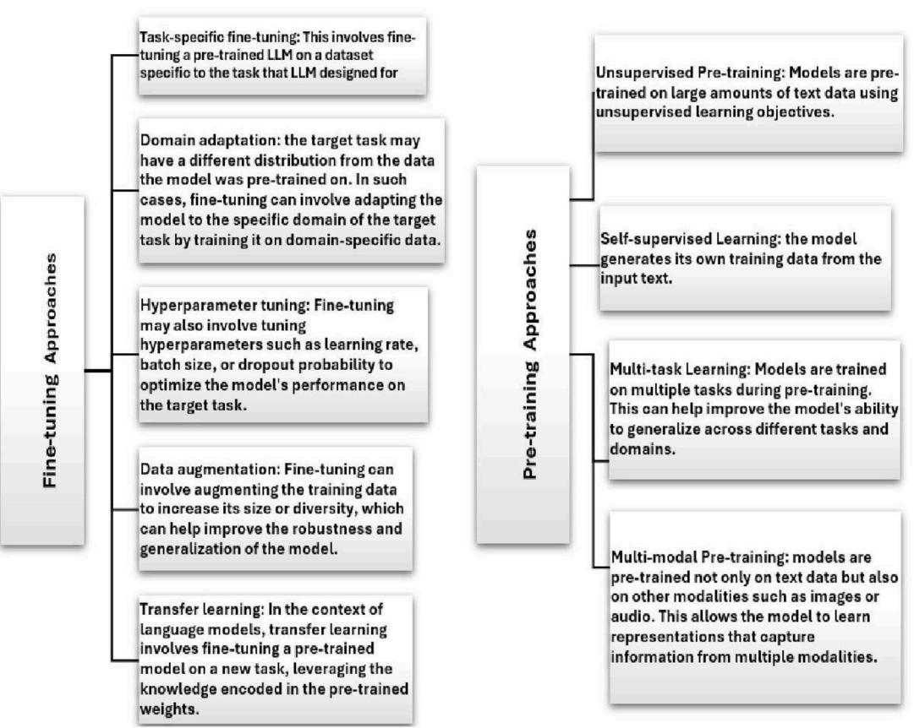
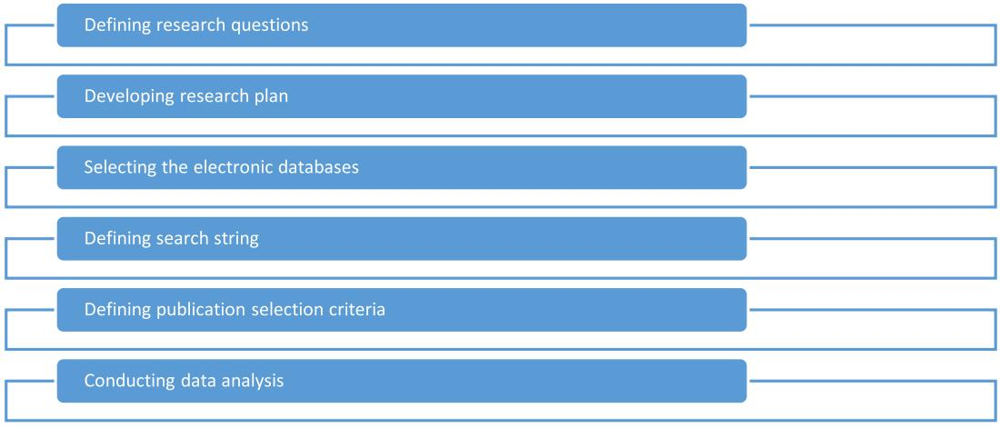
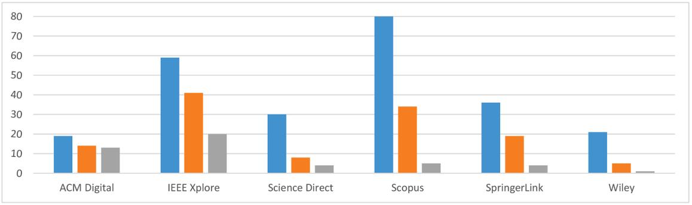
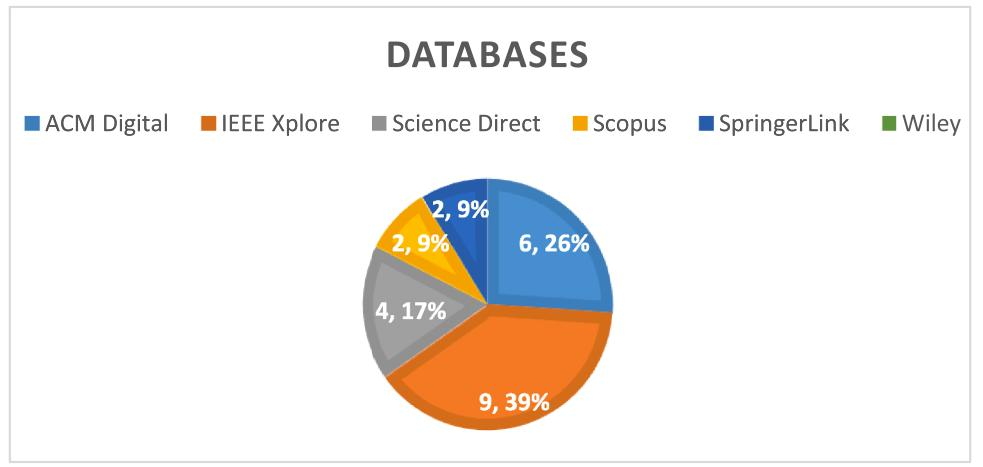
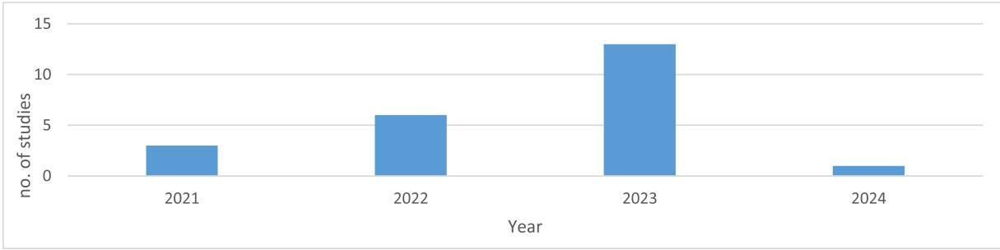
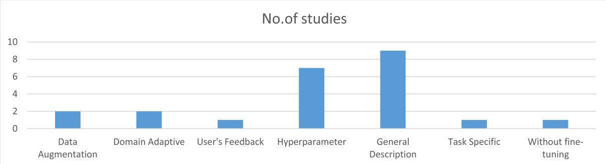
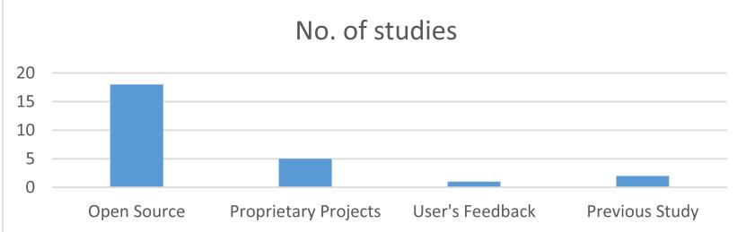
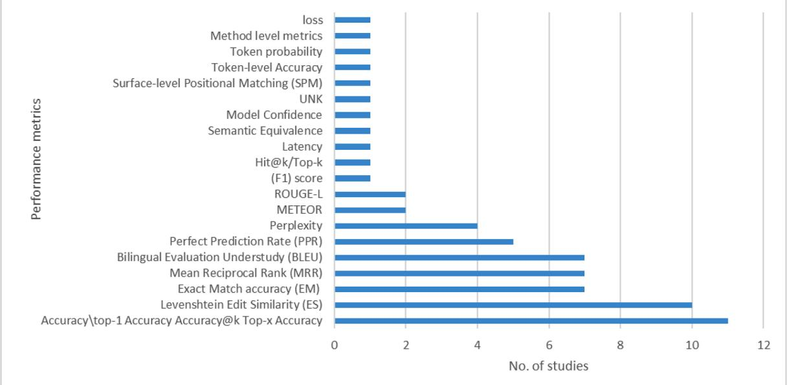

Contents lists available at [ScienceDirect](www.sciencedirect.com/science/journal/09205489)

Computer Standards & Interfaces

journal homepage: [www.elsevier.com/locate/csi](https://www.elsevier.com/locate/csi)

# Large language models for code completion: A systematic literature review

#### Rasha Ahmad Husein a , Hala Aburajouh a , Cagatay Catal 1,\*

a *Department of Computer Science and Engineering, Qatar University, Doha, Qatar*

#### ARTICLE INFO

*Keywords:* Code completion Large language models Deep learning Transformers

ABSTRACT

Code completion serves as a fundamental aspect of modern software development, improving developers' coding processes. Integrating code completion tools into an Integrated Development Environment (IDE) or code editor enhances the coding process and boosts productivity by reducing errors and speeding up code writing while reducing cognitive load. This is achieved by predicting subsequent tokens, such as keywords, variable names, types, function names, operators, and more. Different techniques can achieve code completion, and recent research has focused on Deep Learning methods, particularly Large Language Models (LLMs) utilizing Transformer algorithms. While several research papers have focused on the use of LLMs for code completion, these studies are fragmented, and there is no systematic overview of the use of LLMs for code completion. Therefore, we aimed to perform a Systematic Literature Review (SLR) study to investigate how LLMs have been applied for code completion so far. We have formulated several research questions to address how LLMs have been integrated for code completion-related tasks and to assess the efficacy of these LLMs in the context of code completion. To achieve this, we retrieved 244 papers from scientific databases using auto-search and specific keywords, finally selecting 23 primary studies based on an SLR methodology for in-depth analysis. This SLR study categorizes the granularity levels of code completion achieved by utilizing LLMs in IDEs, explores the existing issues in current code completion systems, how LLMs address these challenges, and the pre-training and fine-tuning methods employed. Additionally, this study identifies open research problems and outlines future research directions. Our analysis reveals that LLMs significantly enhance code completion performance across several programming languages and contexts, and their capability to predict relevant code snippets based on context and partial input boosts developer productivity substantially.

#### **1. Introduction**

The introduction of LLMs has led to substantial advancements in software development, particularly in the area of automatic code completion. Code completion is critical in today's IDEs and code editors, as it significantly helps developers compose their source code faster and more efficiently by predicting subsequent code tokens (e.g., variable names, function names) based on contextual clues. Recent developments in utilizing language models have revealed substantial improvements in the correctness of code completion by extensively learning from vast source code datasets [\[3\]](#page-13-0). The rapid and continuous growth in the software engineering domain provides the availability of extensive source code corpora, allowing for the training of LLMs for different tasks [[3](#page-13-0)]. In recent times, LLMs have gained substantial attention in the field of code completion tasks due to their ability to provide several advantages over traditional techniques. They excel in contextual understanding, semantic analysis, and managing ambiguity, offering relevant completions aligned with the provided context [[20\]](#page-13-0). Their multilingual support and integration of feedback mechanisms ensure accurate suggestions and adaptability to evolving coding practices [\[20](#page-13-0)].

LLMs are characterized by their massive parameter sizes and exceptional learning capabilities. They are at the forefront of Natural Language Processing (NLP) research field. The core component behind many LLMs, such as GPT-3, InstructGPT, and GPT-4, is the self-attention module in the Transformer architecture [[24\]](#page-13-0). Transformers have revolutionized NLP by utilizing sequential data, enabling parallelization, and capturing long-range dependencies in text. A key feature of LLMs is in-context learning, where the model generates text based on a given context, resulting in more coherent and contextually relevant responses. This makes LLMs highly suitable for interactive applications. Another critical aspect of LLMs is Reinforcement Learning from Human Feedback (RLHF), which involves fine-tuning the model using human-generated responses as rewards. This technique enables the model to learn from its mistakes and improve its performance over time [\[24](#page-13-0)].

\* Corresponding author. *E-mail addresses:* [rd2201566@qu.edu.qa](mailto:rd2201566@qu.edu.qa) (R.A. Husein), [ha1906848@qu.edu.qa](mailto:ha1906848@qu.edu.qa) (H. Aburajouh), [ccatal@qu.edu.qa](mailto:ccatal@qu.edu.qa) (C. Catal).

<https://doi.org/10.1016/j.csi.2024.103917>

Available online 18 August 2024 0920-5489/© 2024 The Author(s). Published by Elsevier B.V. This is an open access article under the CC BY license [\(http://creativecommons.org/licenses/by/4.0/\)](http://creativecommons.org/licenses/by/4.0/). Received 22 May 2024; Received in revised form 15 July 2024; Accepted 12 August 2024

In coding tasks, developers rely on and trust LLMs to assist them in several ways during their work. Many language models such as GitHub Copilot, Generative Pre-trained Transformer (GPT), and Bidirectional Encoder Representations from Transformers (BERT), have emerged to provide coding support to developers [\[20](#page-13-0)]. Studies, such as those conducted at Carnegie Mellon University, have shown substantial improvements in programming proficiency when participants utilized LLM tools within their IDEs, indicating the effectiveness of these tools in helping developers. This led to a remarkable increase in code productivity, offering suggestions, code review, and generating code from extensive datasets of trained programs. LLMs also promote creativity by automating tedious tasks, thereby freeing up valuable time and energy for developers [[20\]](#page-13-0).

The increasing utilization of LLMs in coding, both generally and specifically in code completion, has brought significant changes in development practices. These models excel in predicting entire lines of code, unlike traditional native auto-completions. However, despite their advantages, LLMs for code still have shortcomings. While many research-focused LLMs are accurate on synthetic data, only a few of them are integrated into products, indicating a gap between theoretical advancements and practical applications [\[1\]](#page-13-0). Some studies have investigated these models in online settings, reporting the possibility of performance decreases; also, they often lack detailed analysis and involve proprietary models and specialized scenarios. Therefore, there is a need for a comprehensive, comparative, and open evaluation of LLMs for code, particularly in real-world contexts, to enhance their effectiveness. Although LLMs are valuable resources for software developers, potential disadvantages must be considered when utilizing them to coding tasks. Another disadvantage is the difficulty of integrating generated code into pre-existing codebases, which can result in errors, faults, and failures [[1](#page-13-0)].

LLMs significantly enhance the accuracy, relevance, and efficiency of code completion systems, utilizing advanced natural language processing (NLP) capabilities and extensive training on code corpora. These LLMs offer code assistant services and provide developers with real-time code suggestions fitted to the current context, thereby improving the software development process [[20\]](#page-13-0). However, while LLMs have advanced the code completion process, limited research exists on the integration of such technologies within programming environments, affecting a comprehensive understanding of their utility and effectiveness. In light of these facts, this systematic literature review seeks to address these gaps by examining the existing research related to the utilization of LLMs in code completion. By synthesizing and analyzing the literature, this review aims to highlight the challenges, opportunities, and best practices associated with the integration of LLMs in the code completion process. Finally, the findings of this SLR study can help for future research efforts and contribute to the advancement of code completion technologies. This research adopts a systematic and disciplined approach, aligning with the principles of Systematic Literature Review (SLR) guidelines, to provide targeted answers to research questions and offer different insights into the research topic.

The following research questions have been formulated in this research article:

- RQ-1: What is the granularity level achieved when using LLMs in the scope of code completion?
- RQ-2: What problems associated with existing code completion approaches do LLMs address?
- RQ-3: What are the fine-tuning and pre-training approaches used by LLMs in the field of code completion?
- RQ-4: What are the key architectures of LLMs used in code completion tasks?
	- RQ-5: How does the size of the training dataset influence the performance of LLMs in code completion?
- RQ-7: How does the effectiveness of code completion using LLMs vary across different programming languages and codebases?
- RQ-8A: What are the baseline methods?

RQ-8B: What are the performance metrics used?

• RQ-9: What are the main challenges and potential proposed solutions?

We retrieved 244 studies from scientific databases using specific keywords; however, after study selection criteria and quality assessment process were applied, we selected 23 of them for further analysis. The study selection procedure and quality assessment process that was applied in this research are discussed in more detail in [Section 4](#page-5-0) - Research Methodology. This study systematically reviews the state-ofthe-art LLMs used for code completion, providing research ideas for further exploration, and paving the way for new research.

The contributions of this research article are three-fold as follows:

- 1. This is the most up-to-date SLR article on the use of LLMs for code completion.
- 2. We have investigated several aspects when using LLMs for code completion tasks, including granularity levels, architecture, approaches, performance metrics, dataset sizes, and challenges.
- 3. We observed that LLMs significantly enhance the performance of code completion across different programming languages and contexts. Their ability to predict relevant code snippets based on context and partial input enhances developer productivity.

The following sections are organized as follows: Section 2 shows background and related work. Section 3 discusses the research methodology. [Section 4](#page-5-0) presents the results. [Section 5](#page-11-0) shows the discussion. [Section 6](#page-12-0) explains the conclusion and future work.

#### **2. Background and related work**

#### *2.1. Large language models*

Code repositories, books, social media, projects, and online content are just a few of the many sources of data that are used to train LLMs [[1](#page-13-0)]. By identifying patterns and connections in the data, these models enable the creation of related content that matches the characteristics and style of a particular writer or type. These models are first exposed to a severe pre-training process using massive datasets retrieved from open platforms. They then go through an adjustment process that is tailored to particular jobs and scenarios called fine-tuning. In code completion, for example, code samples are used to pre-train and fine-tune LLMs. LLMs are capable of providing realistic answers to user inquiries by processing a variety of input data types acquired during training.

To train the model, a large amount of data must be gathered. This data must be appropriate for the LLMs that are being built. Such datasets are becoming easier to gather as communication networks advance. When it comes to LLMs designed to achieve code completion, largescale, and varied open source software projects offer an excellent choice for this purpose [[1](#page-13-0)]. Another potential source is propriety projects, which also provide valuable knowledge. As a result, LLMs are able to handle several source code tasks, proving beneficial for software tasks such as code completion, code cloning, and code summarization [[20\]](#page-13-0).

Once a massive dataset is collected, it is divided into two parts [\[25](#page-13-0)]:

- 1. **General data**: This part contains a broad range of data.
- 2. **Specialized data**: This one contains relevant aspects related to the special task that the model is designed for.

Next, the following essential data processing steps are followed:

- **Noise Removal**: This eliminates noisy, irrelevant, and potentially harmful data from the dataset.
- **Quality Filtering**: This employs techniques like language filtering, statistical analysis, and keyword filtering to get rid of low-quality, unrelated, and unneeded data from the training corpus.
- **Deduplication:** Redundant data can destabilize models and affect performance. In this step, identification and removal of duplicate entries must be done.
- **Privacy Redaction**: Given privacy concerns, especially when dealing with user-generated content containing sensitive information, measures should be taken to ensure privacy by eliminating private details from the pre-training corpus.
- **Tokenization**: This is an essential process where raw text is segmented into individual tokens. These tokens serve as input for LLMs. Granularity comes in three levels: character, sub word, and word levels [\[7\]](#page-13-0). Although word-level tokenization is straightforward, it can lead to a large vocabulary size, causing an Out-of-Vocabulary (OOV) problem [\[7\]](#page-13-0). Additionally, character-level representation alleviates the OOV issue but may require lengthy source code sequences [\[26](#page-13-0),[12\]](#page-13-0).

These steps ensure that the data fed into LLMs is well-prepared and optimized for effective language understanding and generation.

The LLM is later prepared for the fine-tuning procedure, which involves training the model on a specific task or domain when the pretraining phase is completed [\[27](#page-13-0)]. In the process, labeled examples are given to the model, and it is guided to provide responses that are more accurate and contextually appropriate. The LLM can specialize in certain applications, including text production, question-answering, and language translation via fine-tuning [[28\]](#page-13-0).

There are many approaches for training and fine-tuning LLMs. Fig. 1 summarizes the approaches related to our research.

The goal of training is to maximize the probability that the model will produce the right next token in a given context by optimizing its parameters [\[3\]](#page-13-0). This optimization is usually achieved by combining backpropagation, which calculates gradients to update the parameters frequently, with an algorithm known as Stochastic Gradient Descent (SGD) (or its variants) [[28\]](#page-13-0).

Auto completion occurs at different levels of granularity. At the basic level, next-token prediction is applied where the model predicts the subsequent code token. In line completion, a model is employed to complete a line of code given a specific context. In the most extensive form of code completion, block completion, models generate entire blocks, functions, or classes. Based on the type of code that needs to be completed, code completion can also be categorized into three groups: arbitrary token completion, variable name completion, and Application Programming Interface (API) name completion [[2](#page-13-0)]. By mining the API call sequence, API name completion attempts to complete API calls from a third-party library [[2](#page-13-0)]. Variable references from declared variables are suggested by variable name completion. The goal of arbitrary token completion is to finish any token in the code sequence [[29\]](#page-13-0).

In assessing an LLM's performance, it is critical to take into account the following elements:

- Dataset size
- Quality of the training set
- Architecture of the model
- Model's parametric size
- Task on which the model is being assessed
- Performance metrics and baselines

The architecture and function of LLMs depend heavily on the task they are designed to accomplish. There is a wide range of LLMs, each with its exclusive properties and tasks. Many LLMs for coding tasks,

**Fig. 1.** Fine-tuning and pre-training approaches.

especially code completion, are based on transformer architectures, which have become the dominant architecture for NLP tasks [\[30](#page-13-0)].

Transformer algorithms for code completion utilize the tokens as input and calculate portions of new tokens comparable to the input. Transformers consist of several layers of self-attention layers that allow the model to weigh the significance of tokens in the input sequence during their work while making predictions. Transformer models present an improved understanding of the semantic and syntactic structure of code, making them valuable in coding tasks. Common types of transformer-based algorithms are listed as follows [[31\]](#page-13-0):

- **Transformer**: The Transformer architecture was first proposed by Vaswani et al. in the paper entitled *"Attention is All You Need''*. This paper introduced the algorithm as a stack of encoder and decoder layers. A layer contains multi-head self-attention mechanisms, which are later followed by feed-forward neural networks [\[25](#page-13-0)].
- **BERT (Bidirectional Encoder Representations from Transformers):** BERT, introduced by Devlin et al., is a bidirectional language model trained on extensive, large-scale textual data. It employs masked language modeling and next-sentence prediction during pre-training and can be fine-tuned for a wide range of tasks.
- **GPT (Generative Pre-trained Transformer):** GPT, created by OpenAI, is a Transformer variant consisting of a stack of decoder layers. It is trained using an autoregressive language modeling objective, which identifies the next token in a sequence according to the preceding tokens. GPT models excel in text generation tasks.
- **XLNet**: Proposed by Yang et al., XLNet enhances BERT by incorporating permutation-based language modeling. It leverages all probable arrangements of the input sequence during training, allowing the model to understand the bidirectional context without relying on masked language modeling.
- **RoBERTa (Robustly Optimized BERT Approach):** RoBERTa, introduced by Liu et al., is a BERT variant that achieves better performance by training on more data for longer durations and removing the next sentence prediction objective. It employs dynamic masking during the pre-training process and achieves high performance results across several NLP benchmarks [[32,](#page-13-0)[33\]](#page-14-0).
- **T5 (Text-To-Text Transfer Transformer):** T5, developed by Google, utilizes a unified framework in which all NLP tasks are categorized as text-to-text transformations. It utilizes a Transformer architecture pre-trained on an extensive range of tasks using a text-to-text format, enabling it to perform different tasks with minimal task-specific finetuning [\[33](#page-14-0)].
- **ALBERT (A Lite BERT):** ALBERT, introduced by Lan et al., aims to reduce the parameter count of BERT while sustaining or enhancing performance. It achieves this by sharing parameters and using factorized embedding parameterization, making it more efficient [\[34](#page-14-0)].

The following categories represent different architectures of Transformer models [[35\]](#page-14-0):

- **Encoder-only models:** For masked token prediction and classification, this kind of architecture is frequently employed. The attention layers have access to every word in the first sentence at every stage (bi-directional attention). An implementation of this architecture is the BERT family of models.
- **Decoder-only models:** Coding completion and text generation are two common uses for the decoder architecture. The GPT family uses this architecture. Large varieties of these models work well for fewshot learning. GPT-2, GPT-3, and GPT-4 are the more recent members of this family.
- **Encoder-Decoder models:** Combining the previous two architectures, encoder-decoder models have gained popularity.

Although the research found that LLMs excel in the scope of code completion tasks and the performance metrics show a promising solution compared to the current solutions, some drawbacks have been also encountered as follows:

- *Lack of domain-specific knowledge:* Current LLMs may not excel at completing code that requires domain-specific expertise, such as library names, even after fine-tuning [[2](#page-13-0)]. Although the deep learning model can produce a set of candidate codes, developers may need to modify some of them to adhere to varying coding standards across projects [\[8](#page-13-0)].
- *Opaque parameters:* LLMs function as black box systems, making their internal parameters inaccessible to users and impeding fine-tuning efforts.
- *Constantly changing parameters:* Continuous project development leads to frequent changes in model parameters, complicating the tuning process.
- *Challenges of requiring a large data store of domain tokens:* LLMs are sensitive to manually selected training data and require a large volume of domain-specific tokens to perform optimally. This can be resource-intensive and challenging to maintain.
- *Challenges of fine-tuning:* Fine-tuning the models is challenging because it requires large datasets and significant computational power and resources that academic researchers may lack. Training models on extensive code corpora can be time-consuming, and the process may be influenced by the particular code patterns and practices present in the training data.

Recent research like [[36\]](#page-14-0) tried to provide guidelines to increase benefits and decrease limitations while using LLMs in coding tasks.

#### *2.2. Related work*

We encountered some related review studies while conducting this study. [Table 1](#page-4-0) summarizes the related review papers that discussed the use of Machine Learning and Artificial Intelligence in code related tasks. The methodological and systematical review is known as a Systematic Literature Review (SLR) study, which focuses on evaluating primary studies published on a specific topic. In SLR studies, researchers systematically organize and categorize literature to address predefined research questions, rather than simply summarizing individual paper content. Our objective is to gain more information about LLMs while using them for code completion tasks. Our SLR primarily analyzes studies to deepen our knowledge of LLMs while applying them in coding tasks. It sets itself apart from traditional literature reviews (also known as review or survey papers) with its systematic approach. We performed thorough searches across electronic databases, identified relevant papers, extracted essential data, and synthesized findings to address specific research questions.

From the collected related work, we found six review papers and two SLRs, which presented a different contribution compared to our study. The review paper [[42\]](#page-14-0) discussed the use of LLMs in different code related tasks, while the review paper [\[37](#page-14-0)] focused on the use of LLMs for code generation tasks. The review paper [[39\]](#page-14-0) specifically discussed the GPT-3 family and explored its application across different tasks. The review paper [\[40](#page-14-0)] focused on Java code generation using Deep Learning models. The review paper [\[41](#page-14-0)] and the SLR paper [\[29](#page-13-0)] studied the use of ML and Transformers for software engineering tasks but did not focus on code completion task. The SLR paper [\[38](#page-14-0)] studied the effect of code related tasks like code generation and code completion on solving competitive programming problems. The review paper [[43\]](#page-14-0) did focus on code completion tasks; however, it did not study the use of LLMs. This SLR is the first one that focuses on the use of LLMs on code completion task.

An overview of related review papers.

| Ref. | Paper name                                                                                                       | Database          | Year | Contribution                                                                                                                                                                                                                                                                                                                                                                                                                                                                                                                          | Type   | No. Of analyzed papers |
|------|------------------------------------------------------------------------------------------------------------------|-------------------|------|---------------------------------------------------------------------------------------------------------------------------------------------------------------------------------------------------------------------------------------------------------------------------------------------------------------------------------------------------------------------------------------------------------------------------------------------------------------------------------------------------------------------------------------|--------|------------------------------|
| [37] | A Review on Code Generation with LLMs: Application and Evaluation                                             | IEEE Xplore       | 2023 | It reviews recent studies on (LLMs) emphasizing their possible for enhancing developer productivity. It highlights a gap between the attention on LLM-generated code applications versus its evaluation.                                                                                                                                                                                                                                                                                                                        | Review | 38                           |
| [38] | Systematic Literature Review on Solving Competitive Programming Problems with Artificial Intelligence (AI) | IEEE Xplore       | 2022 | Reviewing the effect of (AI) systems on successfully understanding and generating code and assessing tools like CC.                                                                                                                                                                                                                                                                                                                                                                                                                | SLR    | 30                           |
| [39] | A survey of GPT-3 family large language models including ChatGPT and GPT-4                                    | Science Direct | 2024 | This survey paper explores foundational concepts in natural language processing (NLP), comprising transformers, transfer learning, self supervised, pre-trained PLMs, LLMs. It provides an overview of LLMs and assesses their performance across various tasks, domains, and languages.                                                                                                                                                                                                                                  | Review | 85                           |
| [40] | A review of State-of-The-Art methods for Java code generation from Natural Language Text                   | Science Direct | 2023 | This review provides an outline of the advancements in DL models for Java code generation tasks. It focuses on key methods, their strengths and weaknesses, as well as the objectives commonly employed by researchers. it offers insights into datasets and performance metrics utilized in the literature.                                                                                                                                                                                                              | Review | 302                          |
| [41] | A survey on machine learning techniques applied to source code                                                | Science Direct |      | An overview of the growing trend of applying ML to various SW engineering responsibilities. It categorizes studies into twelve task specific areas, describing the ML techniques, tools, and datasets utilized. Findings indicate a rising trend in using machine learning for such tasks, with synthesized workflows, commonly employed techniques, and available datasets and tools. Challenges discussed include standard dataset availability, reproducibility, and hardware constraints within this domain. | Review | 576                          |
| [42] | A systematic evaluation of large language models of code                                                      | ACM Digital       | 2022 | The paper provides an evaluation of LLMS for code, like Codex, GPT J, GPT-Neo, GPT-NeoX-20B, and CodeParrot, across multiple programming languages. It also introduces a novel model called PolyCoder, which outperforms all models including Codex in the C programming language.                                                                                                                                                                                                                                        | Review | 37                           |
| [43] | Automating Code-Related Tasks Through Transformers: The Impact of Pre-training                                | IEEE Xplore       | 2023 | It emphasizes the impact of the pre-training process on transformers' performance in automating coding tasks within the software engineering (SE) domain.                                                                                                                                                                                                                                                                                                                                                                       | SLR    | 33                           |
| [44] | A methodology for refined evaluation of neural code completion approaches                                     | SpringerLink      | 2022 | It surveys the existing ML-code autocomplete models to indicate that there is a request for a set of standard benchmarks for code autocompletion methods.                                                                                                                                                                                                                                                                                                                                                                       | Review | 26                           |

#### **3. Research methodology**

#### *3.1. Primary study selection*

Our SLR process adheres to the guidelines established by Kitchenham 2009 [\[44](#page-14-0)], including the following key steps:

1.Formulation of research questions

2.Identification of databases to be utilized: Science Direct, ACM Digital, IEEE Xplore, Wiley, SpringerLink, and Scopus. Related papers from other article repositories are not included as primary references. For example, some studies found on arXiv.org, despite their relevance, have been excluded as primary references due to the absence of peer review.

3.Specification of initial search strings, which is: ('code completion') or (code autocomplete) and (('large language \*model\*') or ('LLM\*')) or (deep learning), targeted within [title, abstract, keywords]. 4.Establishment of publication selection criteria, comprising:

- Inclusion of only English language publications
- Inclusion of studies that report quantitative or qualitative measures of LLM models in the domain of code completion
- Exclusion of publications lacking essential text
- Elimination of duplicate publications retrieved from other databases
- Disregarding surveys, reviews, books, or thesis documents
- Excluding studies that do not specify the methodologies being evaluated or does not focus on code completion specifically.

5.Following the identification of relevant studies, a filtration process is employed considering study selection criteria mentioned above and also, a quality assessment process. With the help of quality assessment process and the selected quality assessment questions, low-quality papers are eliminated.

6.Extraction of relevant data from the selected studies, followed by a synthesis of the extracted data.

The following [Fig. 2](#page-5-0) outlines what has been done during the planning stage.

To comprehensively explore this research field, numerous articles were gathered from electronic databases including Science Direct, ACM Digital, IEEE Xplore, Wiley, SpringerLink, and Scopus. Initially, a search string was formulated as follows:

" "code completion" OR "code autocomplete"" AND ""large language model" OR "LLM" " which was applied to [abstract, keywords, title].

The search string had to be adapted according to the options provided by every database, taking into account limitations that we faced, for example, Wiley did not allow us to search within multiple fields [abstract, keywords, title], which made us adjust the search to: "ANY-WHERE". Another example, SpringerLink does not support searching selected fields, so we had to search "everywhere" instead. Numerous combinations of terms were employed to enhance the search scope and therefore, the articles were retrieved from the databases. Next, articles underwent filtering according to selection criteria outlined in the methodology section. Additionally, to address instances where unrelated articles were retrieved due to the simple mention of terms in the abstract, a secondary review was conducted, concentrating on reviewing the abstracts and introduction sections of each paper to confirm relevance of the retrieved articles.

We conducted a snowballing search to detect any other potentially related primary studies. Snowballing involves examining a paper's

reference list (backward snowballing) or its citations (forward snowballing) to find more related papers. Table 2 shows the statistics as follows: the number of studies obtained from each database after applying the initial search string, followed by the application of the criteria specified in steps 4, 5, and 6 of [Section 3.1,](#page-4-0) and finally the number of studies remaining after a second review for each database. [Fig. 3](#page-6-0) depicts the distribution of studies after applying these steps.

Next, the publications that met the selection criteria underwent a quality assessment to confirm that only high-quality papers were kept as primary studies. These articles were checked according to the criteria shown in [Table 3,](#page-6-0) and the articles satisfying the threshold level were used for data synthesis. [Table 3](#page-6-0) shows the criteria for quality assessment [[45\]](#page-14-0). As these questions have been applied by the third author in several other SLR published articles, we have used them as-is in this research. As the maximum score can be 16 based on the following table, the threshold level was set to 8 (i.e., mean value). Papers reaching a score less than 8 had to be eliminated.

#### *3.2. Data extraction*

23 studies resulted after applying the quality assessment criteria. Their distribution according to their source is presented in [Fig. 4](#page-6-0).

#### *3.3. Data synthesis and reporting*

A spreadsheet was prepared for data extraction and synthesis. All the studies satisfying quality assessment procedure have been summarized and the data required was collected as shown in Appendix A. The data gathered was related to the following concepts:

• **Architecture**: Most of the research described the model architecture.

#### **Table 2**

Statistics after applying search string, selection criteria, snowballing, and second review.

| Database                | No. of studies after Applying the search string | No. of studies after applying selection criteria | No. of studies After applying snowballing and a second review |
|-------------------------|-------------------------------------------------------|--------------------------------------------------------|---------------------------------------------------------------------|
| ACM Digital             | 19                                                    | 14                                                     | 13                                                                  |
| IEEE Xplore             | 58                                                    | 40                                                     | 20                                                                  |
| Science Direct          | 30                                                    | 8                                                      | 4                                                                   |
| Scopus                  | 80                                                    | 34                                                     | 5                                                                   |
| SpringerLink            | 36                                                    | 19                                                     | 4                                                                   |
| Wiley                   | 21                                                    | 5                                                      | 1                                                                   |
| Total no. of studies | 244                                                   | 120                                                    | 47                                                                  |

- **Dataset**: All the research papers described the dataset used to train their model, which makes it easy to search in more detail about the subjects related to the dataset.
- **Programming languages**: All the research papers mentioned the chosen program languages, which allowed us to search in detail about the subjects.
- **Fine-tuning and pre-training approaches:** Not all the research papers named exactly the approach that they used during the pretraining and fine-tuning, they only described the process.

The process of data synthesis involves combining gathered data to address specific research questions. As we stated previously, we created a file to analyze the gathered data where each research question was addressed using the data extracted. Our approach to answering research questions involves both qualitative and quantitative methodologies. To address qualitative questions, we summarize data collected from primary studies. To address quantitative questions, we extracted precise values from the primary studies and presented them visually using tables and figures for enhanced clarity. This involved analyzing performance metrics and levels of granularity.

#### **4. Results**

Initially, 244 studies were retrieved from the predefined electronic databases, however, 23 studies were deemed suitable for further intensive analysis. During the full-text review, data were extracted from the studies and used to address the research questions in [Section 6](#page-12-0). The selected 23 studies, along with their titles, sources, and year of publication, are listed in [Table 4.](#page-7-0)

#### *4.1. Primary studies*

This section is particularly focused on the research papers that have been accurately selected based on stringent criteria to ensure their relevance and contribution to the field of code completion using LLMs. Each study is presented in [Table 4](#page-7-0) with its reference, title, database, and year of publication, providing a clear overview of the selected studies. These primary studies are important in addressing the research questions outlined previously and offer a comprehensive understanding of the advancements and challenges in the domain of LLMs for code completion. The insights derived from these studies can pave the way for future research and improvement in the field.

#### *4.2. Yearly distribution of primary studies*

Our research, conducted in early 2024, involved carefully selecting

**Fig. 3.** Distribution of studies after applying the steps.

Questions related to the quality assessment criteria [\[45](#page-14-0)].

| ID | Criteria                                                                           | YES (2) | PARTIAL (1) | NO (0) |
|----|------------------------------------------------------------------------------------|------------|----------------|-----------|
| 1  | Are the aims of the study clearly stated?                                          |            |                |           |
| 2  | Are the scope and context of the study clearly defined?                         |            |                |           |
| 3  | Is the proposed solution clearly explained and validated by an empirical study? |            |                |           |
| 4  | Are the variables used in the study likely to be valid and reliable?            |            |                |           |
| 5  | Is the research process documented adequately?                                  |            |                |           |
| 6  | Are all study questions answered?                                                  |            |                |           |
| 7  | Are the negative findings presented?                                               |            |                |           |
|    |                                                                                    |            |                |           |

8 Are the main findings stated clearly in terms of creditability, validity, and reliability?

primary studies that met stringent criteria for quality and relevance to our research questions. Despite the limited number of publications achieving these criteria, our analysis demonstrated that these studies significantly contributed to new advancements in the field of our research. While the current number of publications may be limited, there is an overall trend toward increasing research output in this area, offering opportunities for more analysis and exploration. [Fig. 5](#page-7-0) shows the yearly distribution of selected studies, providing insights into the developments in the field.

#### *4.3. Responses to research questions*

RQ-1: WHAT IS the GRANULARITY LEVEL ACHIEVED WHEN USING LLMS IN THE SCOPE OF CODE COMPLETION?

The granularity levels achieved by LLMs in code completion tasks are diverse and significantly enhance the development process. We recognized four granularity levels in the papers analyzed and a summary of this can be seen in [Table 5](#page-7-0). At the token level, LLMs predict the next token in a sequence, such as variable names or keywords, based on the current context. This fine-grained level of prediction is crucial for providing immediate and accurate suggestions during the coding process, making it easier for developers to write error-free code efficiently. The most mentioned granularity level was the token level, which was used in 17 papers as seen in [Table 5.](#page-7-0) The second most utilized level was the line level, where the model predicts the following entire line of code. This method is essential in scenarios where the model can understand a broader context and can generate coherent and appropriate lines of code..API calls were only mentioned twice in the papers [\[2,20\]](#page-13-0), this method involves suggesting method names and parameters from third-party libraries, which help developers integrate different APIs easily into their projects. The last level is the block level prediction where the model predicts entire blocks of code, which helps developers boost their productivity and avoid errors.

Study [[7](#page-13-0)] demonstrates a proposed model with a line-level prediction accuracy of 77.12%, surpassing baselines by 0.43% to 24.25%. It achieves a 43.37% exact match rate for line-level predictions, exceeding baselines by 3.63% to 84.73%. Study [\[1\]](#page-13-0) proposed a model that surpasses all baselines in single token prediction (MRR: 70.9% vs. 66.2% and 67.8%) and outperforms the state of the art for multi-token prediction (ROUGE-L: 63.7% vs. 52.4% and 59.2% for *n* = 4 tokens). Study [[4](#page-13-0)] shows that perfect predictions range from ~7% for entire blocks to ~58% for a few masked tokens within the same statement, indicating a viable solution for code completion. Study [\[13](#page-13-0)] reports approximately 95% accuracy in correct syntax token prediction within the top three ranks for Java and 90% accuracy for source code prediction within the

**Fig. 4.** Distribution of primary studies.

Primary studies included in this SLR.

| Ref. | Paper Title                                                                                   | Database      | Year |
|------|-----------------------------------------------------------------------------------------------|---------------|------|
| [1]  | CodeFill: Multi-token Code Completion y Jointly Learning rom Structure nd Naming Sequences | ACM Digital   | 2022 |
| [2]  | Domain Adaptive Code Completion ia Language                                                   | IEEE Xplore   | 2023 |
| [3]  | Models nd Decoupled Domain Databases Multi-task Learning Based Pre-trained Language        | ACM Digital   | 2021 |
| [4]  | Model or Code Completion An Empirical Study n he Usage f BERT Models or                    | IEEE Xplore   | 2021 |
| [5]  | Code Completion Enriching Source Code with Contextual Data for                             | IEEE Xplore   | 2023 |
| [6]  | Code Completion Models: An Empirical Study AdaComplete: Improve DL-based Code              | Springer Link | 2023 |
| [7]  | Completion Method's Domain Adaptability Syntax-Aware n-he-ly Code Completion               | Science       | 2023 |
|      |                                                                                               | Direct        |      |
| [8]  | An Empirical Investigation on the Performance of Domain Adaptation for T5 Code Completion  | IEEE Xplore   | 2023 |
| [9]  | A Unified Multi-ask Learning Model for AST-level and Token-level Code Completion           | Scopus        | 2023 |
| [10] | Non-Autoregressive Line-Level Code Completion                                                 | ACM Digital   | 2024 |
| [11] | ReACC: A Retrieval-Augmented Code Completion                                                  | Scopus        | 2022 |
|      | Framework                                                                                     |               |      |
| [12] | DCServCG: A Data-entric Service Code Generation                                               | Science       | 2023 |
|      | Using Deep Learning                                                                           | Direct        |      |
| [13] | Boosting Source Code Suggestion with Self                                                     | Science       | 2023 |
|      | Supervised Transformer Gated Highway                                                          | Direct        |      |
|      |                                                                                               |               |      |
| [14] | CodeBERT-nt: Code Naturalness via CodeBERT                                                    | IEEE Xplore   | 2022 |
| [15] | Code Prediction by Feeding Trees to Transformers                                              | IEEE Xplore   | 2021 |
| [16] | Enhancing Code Completion with Implicit                                                       | IEEE Xplore   | 2023 |
| [17] | Feedback Benchmarking Causal Study to Interpret Large                                      | IEEE Xplore   | 2023 |
|      | Language Models for Source Code                                                               |               |      |
| [18] | Better Context Makes Better Code Language                                                     | ACM Digital   | 2023 |
|      | Models: A Case Study on Function Call Argument                                                |               |      |
|      | Completion                                                                                    |               |      |
| [19] | Neural Language Models for Code Quality                                                       | ACM Digital   | 2022 |
|      | Identification                                                                                |               |      |
| [20] | VSCuda: LLM-based CUDA Extension for Visual                                                   | ACM Digital   | 2023 |
|      | Studio Code                                                                                   |               |      |
| [21] | Source Code Auto-completion Using Various Deep                                                | SpringerLink  | 2022 |
|      | Learning Models under Limited Computing                                                       |               |      |
|      | Resources                                                                                     |               |      |
| [22] | On the Applicability of Language Models to Block Based Programs                            | IEEE Xplore   | 2022 |
| [23] | Enhancing Intelligent IoT Services Development                                                | Science       | 2023 |
|      | by Integrated Multi-token Code Completion                                                     | Direct        |      |
|      |                                                                                               |               |      |

top 10 ranks, similar to the model in Study [\[9\]](#page-13-0), which excels in token-level code completion, outperforming leading models. Study [\[15](#page-13-0)] highlights that Transformer-based models, particularly TravTrans, significantly boost mean reciprocal rank (MRR) to 58.0%, a 14% to 18% increase over earlier models. Additionally, the model proposed for token-level completion outperforms baselines over n-gram models and CodeGRU.

These findings underscore the high accuracy and adaptability of token-level models across different programming languages and coding standards. By providing granular suggestions, token-level models help catch syntactic and semantic errors early in the coding process, leading to cleaner, more reliable code completion [\[4\]](#page-13-0) Furthermore, token-level predictions are less computationally intensive and faster and these features make them more practical for real-time applications. Increased complexity and lower prediction accuracy are some of the challenges associated with predicting larger code blocks. Our analysis provides a thorough understanding of the benefits and limitations of different prediction granularities, thereby offering valuable insights to the researchers and practitioners.

RQ-2: WHAT problems ASSOCIATED WITH EXISTING CODE COMPLETION AP-PROACHES DO LLMS ADDRESS?

Existing code completion approaches face several significant challenges, and a summary of the analyzed challenges can be seen in [Table 6](#page-8-0). Traditional auto completion systems struggle with dynamically typed languages due to lack of type information resulting in less accurate predictions. These systems usually treat code as natural language ignoring its structure and semantic complexities. LLMs offer solutions to these problems by providing their advanced contextual understanding and semantic analysis capabilities. Another challenge in the existing code completion systems is the lack of generality, where only the current context is being examined. Generally, current methods lack context and syntax understanding, alongside other challenges like grammar-based and hierarchical-based challenges.

RQ-3: WHAT ARE THE FINE-TUNING AND PRETRAINING APPROACHES USED BY LLMS IN THE FIELD OF CODE completion?

There are many approaches for fine-tuning and pre-training that the large language model can utilize. By investigating and answering this research question, we aim to know what approaches are preferred by researchers. The fine-tuning and pretraining approaches for LLMs in code completion tasks are crucial for optimizing their performance and accuracy. During pretraining, the model is exposed to a large dataset of general code and language data such as GitHub Code dataset, Stack Overflow data, and other public code repositories. This enables the model to learn basic code structures and patterns across different programming languages such as Python, C++, C, and Java. This phase is followed by fine-tuning, where the model is trained on more specific datasets related to the target task or domain, such as specialized datasets for enterprise applications, machine learning scripts, mobile applications, and web applications. Hyper parameter fine-tuning is the adjustment of the parameters of the model, such as batch size, learning rate,

| Table 5 |  |  |
|---------|--|--|
|         |  |  |

| Granularity level. |  |  |  |
|--------------------|--|--|--|
|--------------------|--|--|--|

| Ref.                                                                                                                        | Granularity Level                                    |
|-----------------------------------------------------------------------------------------------------------------------------|------------------------------------------------------|
| [1] [2] [3] [4] [5] [7] [9] [11] [12] [13] [14] [15] [16] [18] [19] [22] [23] [1] [2] [4] [5] [7] [10] [11] [14] [23] | Token-level predictions Line-level             |
| [2,20] [4] [23]                                                                                                          | completion API calls Block-level completion |

**Fig. 5.** Distribution of primary studies per year.

| Limitations of existing code completion methods. |  |  |  |  |  |  |
|--------------------------------------------------|--|--|--|--|--|--|
|--------------------------------------------------|--|--|--|--|--|--|

| Ref. | Problems Associated with the Existing Approaches                            |
|------|-----------------------------------------------------------------------------|
| [1]  | Grammar-Based Challenges: Traditional auto completion systems face          |
|      | difficulties in dynamically typed languages due to the absence of type      |
|      | information, resulting in less accurate suggestions.                        |
|      | NLP-Based Drawbacks: AutoCompletes using NLP treat code like natural        |
|      | language, ignoring its structural and semantic degrees. This leads to broad |
|      | prediction scopes and fails to understand developer intent.                 |
|      | Evaluation Limitations: Current methods for assessing auto completion       |
|      | do not mirror real-world use. They treat all tokens equally and do not      |
|      | account for the specific syntactic points where developers typically invoke |
|      | auto completion.                                                            |
| [3]  | Static Embeddings: Statistical language models utilize static embeddings    |
|      | that map each word to a fixed vector, ignoring its various meanings in      |
|      | different contexts. This approach overlooks the contextual differences of   |
|      | tokens.                                                                     |
| [3]  | Identifier Completion Issues: Current models treat all tokens as equal      |
| [9]  | completion targets without accounting for their types. They often ignore    |
|      | the type of identifiers, which is crucial for accurate completion.          |
|      | Type-Value Connection: Existing methods do not recognize the                |
|      | connection between the type and value of code variables, which constrains   |
|      | code completion precision.                                                  |
| [4]  | Limited Developer Support: Existing code completion systems provide         |
| [16] | limited assistance by predicting only a few tokens at a time, thereby       |
|      | offering minimal support to developers. Additionally, these techniques      |
|      | often overlook valuable user input, resulting in suggestions that may not   |
|      | match with the developer's objectives. This can lead to challenging and     |
|      | time-consuming manual edits.                                                |
| [6]  | Generic performance: N-gram models perform poorly in generic domains        |

- [\[11](#page-13-0)] compared to generic deep learning-based models. **Generability: C**urrent methods just consider the code context within a project, focusing solely on the internal context.
- [\[7\]](#page-13-0) **On-the-Fly Limitations:** Traditional code completion methods that work on-the-fly lack sensitivity of syntactic information, hindering their performance. **Syntax-Aware Limitations:** Current syntax-aware code completion

methods are not on-the-fly, requiring error-free source code to function. This is unrealistic in real-world scenarios where code frequently contains errors**.**

- [\[9\]](#page-13-0) Current code completion systems aim to predict tokens based on the surrounding source code, but they often neglect syntactic constraints like static type information. This oversight can lead to missing out on long-term semantic relationships within programs. In addition, they may struggle to capture the long-term dependencies within code, which are essential for accurate code completion**.**
- [\[9\]](#page-13-0) **Utilization of Hierarchical Structure:** Traditional models do not effectively harness the hierarchical structure of programs.
- [\[10](#page-13-0)] [\[15](#page-13-0)] **Granularity level:** Existing models predict one token at a time, but recommending longer code snippets can lead to a higher chance of errors. This forces developers to spend additional time reviewing code, identifying mistakes, and correcting them, which ultimately reduces development efficiency.
- [\[12](#page-13-0)] Current general-purpose systems often lack crucial service-based code characteristics such as sequence overlap and bias issues, which can lead to the failure of code auto-completion tools.
- [\[13](#page-13-0)] Traditional code completion tools base their predictions on the existing code context in IDEs, often sorting them by frequency or alphabetically. This approach greatly restricts their capabilities.
- [\[14](#page-13-0)] Traditional statistical language models are typically trained on small
- [\[15](#page-13-0)] datasets to estimate language naturalness within specific programming styles or project types. They are based on types rank suggestions alphabetically or using basic statistics, possibly yielding less accurate outcomes. For instance, the IDE model Jedi ranks type-compatible suggestions alphabetically, often producing suboptimal predictions. This challenge is particularly pronounced in dynamic languages like Python, where generating an accurate list of type-compatible tokens in a given context can be highly complex.
- [\[16](#page-13-0)] Current code completion methods overlook user feedback during the completion process.

and epochs. Domain adaptive fine-tuning is the training of the model on a domain-specific data to enhance its ability to manage the tasks in that specific domain such as healthcare applications.

[Fig. 6](#page-9-0) illustrates the common pretraining approaches utilized in the analyzed papers. In fact, most of the analyzed papers did not specify the exact method and provided a general description instead (i.e., the category General Description in [Fig. 6](#page-9-0)). In addition, multi-task learning was mentioned in 4 papers, while transfer learning and self-supervised learning were mentioned in one paper each. While one paper mentioned that they used a special technique, another paper stated that they did not use pretraining.

Regarding fine-tuning techniques, [Fig. 7](#page-9-0) summarizes the mentioned techniques and the corresponding number of studies. As can be seen in the figure, many papers did not mention the utilized fine-tuning technique. The hyperparameter fine-tuning technique was stated in seven papers, while data augmentation and domain adaptive fine-tuning were mentioned twice, and user feedback and task specific fine-tuning were specified once.

Overall, the combination of extensive pretraining and targeted finetuning enables LLMs to provide highly accurate and useful code completion suggestions, significantly enhancing developer productivity. For instance, a study [\[6\]](#page-13-0) demonstrated that LLMs fine-tuned with domain specific datasets resulted in average 7% improvement in code suggestion accuracy, another study [\[8](#page-13-0)] shows that domain-adapted model improves 5.3% of the perfect prediction rate and, 3.4% of the edit distance rate, compared to the fine-tuned model with the out-of-domain dataset.

RQ-4: WHAT ARE THE KEY ARCHITECTURES OF LLMS USED IN CODE COMPLETION TASKS?

Multiple architectures for LLMs exist. Our goal is to identify which architecture is the most suitable for code completion tasks, effectively handling programming language syntax, semantics, and context to produce accurate code completions. Transformer-based architectures are particularly prevalent, with models like GPT-2, T5, and BERT and many others leading the way. This architecture has been adapted for various LLMs to handle the complexities of code completion tasks effectively. The GPT models were the most used ones as can be seen in [Table 7,](#page-9-0) followed by BERT and its variations, each one of these models has its benefits compared to the others and with this being a fastgrowing field, many new models are being introduced frequently. By employing these advanced architectures, LLMs can provide more accurate and contextually relevant code completion suggestions, thereby improving the efficiency and effectiveness of the coding process.

RQ-5: HOW DOES THE SIZE OF THE TRAINING DATASET INFLUENCE THE PERFORMANCE OF LARGE LANGUAGE MODELS IN CODE COMPLETION?

By answering this research question, we aim to investigate the size of the training dataset and whether the effect of increasing or decreasing the dataset can affect the efficiency of the LLMs. [Table 8](#page-9-0) illustrates the impact of dataset size on the models. It is important to note that not all 23 studies provided insight into how dataset size affects model performance. The size of the training dataset has a significant impact on the performance of LLMs in code completion tasks, where larger datasets provide more examples for the model to learn from, enabling it to capture a wider range of patterns in code. This leads to better generalization and more accurate predictions. Studies such as [\[6,8](#page-13-0),[9,11,13](#page-13-0)] demonstrate that models trained on extensive datasets perform significantly better in both token and identifier completion accuracy compared to those trained on smaller datasets. Larger datasets allow the models to learn complex code structures and long-range dependencies, which are crucial for generating contextually relevant code completions. In addition, the diversity of the training data also plays a crucial role, a dataset that includes a wide variety of programming languages, coding styles, and project types enables the model to perform well across different contexts and codebases. This diversity helps reduce the out-of-vocabulary (OOV) rate, where the model encounters a token that it has not seen during training, thereby improving its robustness and reliability. Overall, a larger and more diverse training dataset significantly enhances the performance of LLMs in code completion tasks, enabling them to provide more accurate and useful suggestions to developers.

RQ-6: What are the sources of the datasets?

**Fig. 6.** Common pre-training approaches.

#### **Fig. 7.** Common fine-tuning approaches.

## **Table 7**  Model Architectures.

| Ref.                    | Model Architecture               |
|-------------------------|----------------------------------|
| [5] [7] [11] [13] [23]  | Transformer                      |
| [1] [12] [17] [19] [21] | Transformer-basedGPT             |
| [3] [15]                | Transformer-based Neural Network |
| [4] [21] [22]           | Transformer-based RoBERTa        |
| [5]                     | Transformer-based Pre-trained    |
| [6] [9]                 | Transformer XL Network           |
| [8]                     | Transformer-based T5             |
| [1] [10]                | Parallel Transformer             |
| [14] [16]               | Transformers-based BERT          |
|                         |                                  |

Since datasets form the foundation of LLMs and given the substantial volume of data required for these models to function effectively, we aim to explore the most common sources for acquiring these datasets. [Fig. 8](#page-10-0) shows the sources of the datasets used in the research. The datasets used for training LLMs in code completion tasks are sourced from a variety of resources, each contributing unique characteristics that enhance the models' learning capabilities. Open source software projects are a primary source, providing large-scale and diverse codebases that reflect real-world coding practices. These projects are vital for pre-training and fine-tuning LLMs as they offer extensive examples of different programming languages, coding styles, and software development patterns. These sources were the most frequently used sources. In addition to open source projects, proprietary projects and previously conducted studies also serve as valuable data sources. These datasets often contain domainspecific code, which helps the models adapt to specialized tasks and environments. User-generated feedback and contextual data from IDEs further enrich the training datasets, providing insights into how developers interact with code completion tools in real-time. By utilizing these diverse data sources, LLMs can develop a comprehensive understanding of code structures and semantics, leading to more accurate and contextually relevant code completion suggestions.

#### **Table 8**

Observations on the Influence of the dataset size.

| Ref.                | Observations                                                                                                                                                                                                                               |
|---------------------|--------------------------------------------------------------------------------------------------------------------------------------------------------------------------------------------------------------------------------------------|
| [6]                 | Identifier Prediction: A larger dataset allows for a higher proportion of masked identifiers during pre-training, which is crucial for generating better contextual representations and improving identifier prediction accuracy. |
| [8]                 | Type Information: The extensive dataset enables the extraction of type information for identifiers, which assists in making more accurate predictions during code completion.                                                        |
| [8]                 | Smaller projects: They offer small datasets that may not benefit as much from domain adaptation due to insufficient fine-tuning data.                                                                                                   |
| [8] [9]          | Performance Improvement: The models achieve significant improvements over existing methods in both token and identifier completion accuracy, demonstrating the effectiveness of using large-scale                                    |
|                     | datasets for training. Training Data Adequacy: A larger dataset provides more examples for the model to learn, which can lead to improved generalization and performance.                                                         |
| [8]                 | Domain adaptation: when it is done with a larger dataset the performance is improved significantly, but with a small dataset, the improvement is minimal.                                                                            |
| [9]                 | Model Complexity: With a larger dataset, more complex models can be trained without overfitting, allowing the model to capture patterns in the data.                                                                                 |
| [9]                 | Out-of-Vocabulary (OOV) Rate: a larger dataset can reduce the OOV rate, leading to better model performance.                                                                                                                            |
| [9] [11] [13] | Diversity of Examples A larger dataset is likely to contain a more diverse range of examples, which helps the model perform well on a wide range of tasks.                                                                           |
| [11] [13]        | Training on a large-scale source code corpus allows language models to better comprehend the code domain, leading to rapid progress in code related tasks.                                                                           |
| [11]                | Pre-training Effectiveness: The effectiveness of pre-training techniques like transformers is enhanced with large datasets, enhancing accuracy in tasks such as code completion.                                                     |
| [13]                | Generalization Ability: Increasing the dataset size can improve the model's capacity to generalize from the training data to unseen data, which possibly results in better performance on real-world tasks                           |

RQ-7: How does the effectiveness of code completion using large

**Fig. 8.** Sources of dataset.

language models vary across different programming languages and codebases?

The effectiveness of LLMs in code completion tasks varies significantly across different programming languages and codebases, influenced by factors such as language syntax, semantics, and coding patterns. For instance, models like those discussed in studies [[3](#page-13-0)] and [[10\]](#page-13-0) perform well in statically typed languages like Java, where type information is readily available. This type of information is crucial for making accurate predictions, as it helps the model understand the context and relationships between different code elements. In contrast, dynamically typed languages like Python pose greater challenges due to their more flexible and less explicit type information. Additionally, other effects can be recognized as shown in Table 9.

RQ-8A: WHAT ARE THE BASELINE METHODS? RQ-8B: WHAT ARE THE PERFOR-MANCE METRICS USED?

By exploring this research question, we aim to gain a deeper understanding of how researchers evaluate their proposed solutions in the field of utilizing LLMs for code completion. We examine which evaluation metrics are selected, as well as which baseline models are chosen for comparison in terms of effectiveness. In the evaluation of LLMs for code completion tasks, various baseline models and performance metrics are employed to assess their effectiveness. Baseline models serve as benchmarks for comparison, providing a reference point to measure the improvements offered by new models. Common baselines include n-gram models, pointer mixture models, and other advanced LLMs like GPT-2, BERT, and CodeT5. These baselines are selected based on their relevance and effectiveness in similar tasks. [Table 10](#page-11-0) provides a summary of the baselines used in the analyzed papers.

Performance metrics used in evaluating LLMs for code completion include accuracy, levenshtein, BLEU score, perplexity, and many others as demonstrated in [Fig. 9.](#page-11-0) These metrics provide quantitative measures of how well the models predict the next token, line, or code block. For instance, top-k accuracy measures the proportion of correct predictions within the top-k suggestions made by the model, providing insights into its practical utility in code completion tasks. Exact match accuracy assesses the model's ability to generate the exact next token or line, while BLEU score and perplexity offer insights into the fluency and coherence of the generated code. By using these performance metrics, researchers comprehensively evaluate the models' effectiveness and identify areas for additional improvement.

RQ-9 What WERE THE CHALLENGES AND PROPOSED SOLUTIONS?

In the scope of integrating LLMs into code completion tools, a total of seven distinct challenge types were found. [Table 11](#page-12-0) summarizes the challenges and proposed solutions. Integrating LLMs into code completion systems presents several challenges, including contextual and semantic understanding, resource constraints, and many other challenges. One of the primary challenges is ensuring that the model accurately understands the context in which code completion is required. This involves capturing both local and global code dependencies, which is critical for generating relevant and accurate suggestions. Studies [1–[3\]](#page-13-0) and [[5](#page-13-0)] propose solutions like enriching source code with contextual data and leveraging multi-task learning approaches to enhance the models' contextual understanding.

#### **Table 9**

The variation effect across different programming languages.

- REF Effect [3] **Identifier Prediction**: The model's accuracy in predicting identifiers differs between different languages. This is attributed to the static analysis capability in Java that allows for the extraction of type information, which is crucial for the model's predictions. **Type Information Utilization**: leverages type information to assist in token prediction. This is particularly effective in statically typed languages such as Java, where type information is readily available, resulting in improved performance. **Semantic Understanding**: The model's ability to comprehend the syntax of the code is influenced by the programming language. For instance, it facilitates semantic understanding and, consequently, better completion suggestions. **Dataset Characteristics**: The datasets used for pre-training and fine-tuning the model in different programming languages can contribute to performance. The model's efficiency in code completion tasks is influenced by the proportion of identifiers and keywords. [4] **Vocabulary Size**: vocabulary size in source code, is a challenge across different programming languages. [6] **Local Model Integration:** In the domain-specific code completion model, training the model on the target domain's source code, can improve the performance of DL models for specific programming languages. [8] Coding rules and patterns specific to a language within a project may influence the effectiveness of the model. [9] **Type-Value Correlation**: The correlation between the type and value varies across different languages, influencing the model's accuracy. This can lead to a decrease in performance due to a weaker correlation. **Long-Term Dependency**: The Transformer employed in the model captures long-range dependencies and semantic relationships amongst contextual tokens, which is essential for languages with long semantic dependencies. **Multi-Task Learning (MTL):** When the model uses MTL to predict the type and value of the next code element, it offers syntactic and semantic constraints for code completion process. This improves the performance significantly and substantially across different languages. [10] **Language Characteristics**: The inherent differences between dynamic languages like Python and static languages like Java can impact the relevance of context lines in code, making it more challenging to complete a whole line in Python compared to Java.
- [10] **Contextual Relevance:** In Python, the relevance of context lines in general is low, which increases the ambiguity and difficulty for the models to complete a complete line accurately.
- [12] **Model Generalization**: Better model generalization performance could be influenced by the language employed in the training process.

Another significant challenge is the semantic understanding of code. LLMs must accurately interpret the syntactic and semantic relationships between code elements to provide useful completions. Some of the solutions proposed are in studies [[1](#page-13-0)] and [\[12](#page-13-0),[13\]](#page-13-0) including self-supervised learning and data-centric approaches and learning from structure and naming sequences to improve the models' ability to capture semantic nuances. Resource constraints, such as computational power and latency issues, are also addressed by optimizing training processes and utilizing hardware acceleration techniques, as discussed in studies [\[10,21](#page-13-0), and [23\]](#page-13-0). By tackling these challenges, researchers aim to enhance the effectiveness and usability of LLMs in real-world code completion tasks.

This structured analysis provides a clear overview of the key challenges in integrating LLMs into code completion tools and the diverse

**Table 10**  Baseline models.

| No. | Baseline    | Ref.      | No. | Baseline     | Ref.         |
|-----|-------------|-----------|-----|--------------|--------------|
| 1   | AR 12–1     | [10]      | 27  | Llama 2      | [20]         |
| 2   | Bi-LSTM     | [1]       | 28  | LSTM         | [7] [9]      |
| 3   | BM25        | [2]       | 29  | n- gram      | [1] [4] [14] |
|     |             |           |     |              | [16] [22]    |
|     |             |           |     |              | [23]         |
| 4   | BPE         | [6] [7]   | 30  | OpenVocab    | [1]          |
| 5   | BPE NLM     | [3]       | 31  | OPT          | [23]         |
| 6   | CG8         | [12]      | 32  | PLBART       | [11] [18]    |
| 7   | Code2Seq    | [15]      | 33  | PMN          | [9]          |
| 8   | CodeGen     | [18]      | 34  | Pointer      | [1] [3]      |
|     |             |           |     | Mixture      |              |
| 9   | CodeGPT     | [5] [7]   | 35  | ReACC        | [2]          |
|     |             | [18] [21] |     |              |              |
|     |             | [2]       |     |              |              |
| 10  | CodeGPT/    | [7] [11]  | 36  | Roberta      | [21]         |
|     | CodeGPT     |           |     |              |              |
|     | adapted     |           |     |              |              |
| 11  | CodeGRU     | [16]      | 37  | Roberta-CC   | [23]         |
| 12  | CodeLSTM    | [13]      | 38  | SeqRNN       | [15]         |
| 13  | CodeT5      | [8] [11]  | 39  | ServCG       | [12]         |
|     |             | [18] [23] |     |              |              |
| 14  | CodeTran 3  | [13]      | 40  | StarCoder    | [20]         |
| 15  | Codex       | [18]      | 41  | T5-CC        | [23]         |
| 16  | CugLM:      | [6]       | 42  | Transformer  | [23]         |
| 17  | DA-CodeT5   | [8]       | 43  | Transformer  | [7]          |
|     |             |           |     | (12 L)       |              |
| 18  | Deep3       | [15]      | 44  | Transformer  | [3] [6] [9]  |
|     |             |           |     | XL           |              |
| 10  | GPT-2       | [7] [10]  | 45  | TravTrans+   | [1]          |
|     |             | [21]      |     |              |              |
| 20  | GPT-2       | [17]      | 46  | T-XL         | [1]          |
|     | (TravTrans) |           |     |              |              |
| 21  | GPT-4       | [20]      | 47  | UMTLM (RNN)  | [9]          |
| 22  | GPT-C       | [1]       | 48  | UniXcoder    | [5] [2] [10] |
| 23  | GPT-J       | [18]      | 49  | UniXcoder    | [5]          |
| 24  | Hybrid      | [2]       | 50  | UniXcoder    | [10]         |
| 25  | InCoder     | [5]       | 51  | Vanilla LSTM | [3]          |
| 26  | kNN-LM      | [2]       | 52  | X-CodeGPT    | [11]         |

solutions proposed across the literature, highlighting areas for further research and development.

#### **5. Discussion**

#### *5.1. General discussion*

We examined the application of LLMs in code completion, addressing several research questions (RQs) to investigate the current view of this novel technology. In this section, we discuss our findings for our research questions:

RQ1: Our review categorized code completion granularity into token-level, line-level, API calls, and block-level. LLMs have been found effective at all these levels, enhancing the precision of code suggestions. LLMs achieve various granularity levels in code completion, from nexttoken prediction to entire blocks or functions.

RQ2: It focused on exploring issues related to existing code completion systems, comparing these issues, and analyzing the granularity and performance evaluation of LLMs. Our findings suggest that leveraging LLMs for code completion shows promise and could significantly affect the field. LLMs address issues in current code completion systems by improving contextual understanding and reducing ambiguity.

RQ3: It involved exploring pre-training and fine-tuning approaches used with LLMs for code completion tasks. While some studies lack specificity in their approach descriptions, we aimed to highlight common methodologies. We found that studies discussed various approaches used for pre-training and fine-tuning LLMs, with a focus on enhancing model accuracy and context relevance.

RQ4: It identified different architectures utilized for code completion tasks with LLMs, each offering unique advantages. We provided an overview of these architectures and their characteristics based on performance evaluations across studies. It highlights the key architectures of LLMs used in code completion tasks, such as Transformers, BERT, GPT, XLNet, RoBERTa, and T5.

RQ5: It involved investigating model performance using large vs. small datasets. We compiled these comparisons into a table for easy reference. The size of the training dataset significantly influences the performance of LLMs in code completion. With larger datasets, more complex models can be trained without overfitting, allowing the model

**Fig. 9.** Performance Metrics.

Identified Challenges in LLM Integration for Code Completion.

| No. | Challenge                           | No. of studies | Proposed solutions                                                                                                                                                                                                                                                                                                                                                                                                                                   |
|-----|-------------------------------------|-------------------|------------------------------------------------------------------------------------------------------------------------------------------------------------------------------------------------------------------------------------------------------------------------------------------------------------------------------------------------------------------------------------------------------------------------------------------------------|
| 1   | Contextual understanding         | 14                | Multi-Task Learning Approach [1][2] [3] Enriching source code with contextual data [5][20][23] Leveraging both internal and external contexts [6][11] Train model using additional data from the target project [8] Use pre-trained models fine-tuned on code-related tasks [14][16][17] Use database that include full projects and dependencies [18] Enhancing models with context-aware architectures [19] |
| 2   | Semantic Understanding           | 5                 | Learning from structure and naming sequences [1] Utilizing BLEU score and Levenshtein distance [4] Utilizing multi-task learning approach [9] Data-centric approaches [12] Self-Supervised Learning Approach [13]                                                                                                                                                                                                            |
| 3   | Resource and Latency Constraints | 3                 | Generating tokens in parallel [10] Optimizing the training and evaluation process to use code sequences directly [21] Model distillation or hardware acceleration [23]                                                                                                                                                                                                                                                                |
| 4   | Syntactic structure ignorance    | 2                 | Encodes path from predicted node to AST root which preserves hierarchical structure [9] Making the transformer architecture aware of the structure [15]                                                                                                                                                                                                                                                                                  |
| 5   | Difficulty in Fine Tuning        | 1                 | Pointer model balances generic and local predictions[6]                                                                                                                                                                                                                                                                                                                                                                                           |
| 6   | AST extraction failures          | 1                 | Proposed solution that uses token types as lightweight syntactic information, training multi-tasking to improve performance without requiring syntactically correct source code [7]                                                                                                                                                                                                                                                      |
| 7   | Blocks inhibit predictability    | 1                 | Using n-gram models and transformers [22]                                                                                                                                                                                                                                                                                                                                                                                                         |

to capture patterns in the data more effectively.

RQ6: We focused on identifying common sources of datasets used to train LLMs, emphasizing valuable resources for researchers in this domain. Datasets are sourced from large-scale, diverse open-source software projects and proprietary projects, providing a comprehensive and extensive dataset for model training.

RQ7: This RQ explored how LLMs perform across different programming languages in code completion tasks, highlighting their strengths and challenges. The effectiveness of LLMs varies across different programming languages and codebases, with some models outperforming others in specific contexts. The effectiveness of code completion using LLMs varies across different programming languages and codebases. Fine-tuning LLMs may be influenced by the specific code patterns and practices present in the training data.

RQ8: Baseline models and performance metrics used for evaluation are identified, highlighting the most effective ones. We investigated methods for evaluating model performance, utilizing performance metrics, and comparing them against baseline models. Our findings are summarized in tables and figures. Baselines refer to models within the domain that function similarly, serving as benchmarks for researchers to measure their models' performance. These baselines range from statistical language models like n-grams and pointer mixture models to other advanced LLMs. Common performance metrics for evaluating LLMs include accuracy, top-k accuracy, exact match accuracy, BLEU score, perplexity, and ROUGE-L.

RQ9: We aim to identify challenges, limitations, and drawbacks associated with integrating LLMs into code completion systems, offering insights for future research and designs. Challenges like those that integrating generated code into existing codebases are addressed, with solutions such as multi-task learning and context enrichment proposed.

#### *5.2. Potential threats to validity*

In this subsection, we highlight possible threats to validity:

**Construct Validity**: This assesses whether our SLR accurately measures the intended constructs. We used automated search queries across various databases to capture insights from existing literature. However, different databases require different query modifications due to varying formats and logical operators, possibly leading to missed or irrelevant studies. To mitigate this, our query design underwent thorough discussion among authors and multiple testing iterations. We also manually checked abstracts to ensure search validity. If the results were inadequate, we refined our queries and repeated the search. Another concern was the subjective nature of result screening despite predefined criteria, leading to possible oversight of relevant papers. Our data extraction process was continually updated to capture all relevant information from the literature, ensuring completeness while avoiding inessential data.

**Internal Validity:** This relates to the coherence of our research findings and their relationship to the study's objectives. Each research question was crafted to explore essential elements for applying LLMs in code completion tasks, maintaining clear alignment with our research goals.

**External Validity:** Our SLR focuses on published papers utilizing LLMs for code completion. As mentioned earlier, our research was conducted in early 2024, with the search and selection of studies taking place during the first quarter of the year. While some unpublished models may hold potential, they are beyond the scope of this review study.

**Conclusion Validity:** We ensured the reproducibility and reliability of our SLR by following the protocol established by Kitchenham et al. (2009) [\[44](#page-14-0)]. Our research questions, search process, screening criteria, and quality assessment adhered to this protocol. We minimized individual biases through collaborative discussions among authors and relied on objective data presented in tables and figures to derive conclusions, reducing subjective interpretations.

#### **6. Conclusion and future work**

To the best of our knowledge, this is the first SLR study that explicitly discusses the state-of-the-art of LLMs for code completion tasks. Several insights have been derived from this study. This review identified key areas of progress and outlined challenges and solutions, offering a roadmap for future research in the field. We examined and analyzed 23 research studies on the use of LLMs for code completion tasks. We addressed several research questions, such as the granularity achieved, problems solved by LLMs, pre-training and fine-tuning approaches, and the influence of dataset size and different programming languages on LLM performance. We discussed challenges such as contextual understanding and proposed solutions like multi-task learning and enriching source code with contextual data. The novel approaches demonstrated promising results and enabled access to vast amounts of data, which are essential for training LLMs, though they require substantial computational resources. We also explored common methods for performance measurement, and baselining, as well as several model architectures. LLMs offer extensive applications and present promising solutions across multiple fields. Researchers are encouraged to explore this domain, particularly in integrating LLMs with other technologies and addressing current limitations and best practices to improve their effectiveness. The following areas are suggested for future work:

#### *R.A. Husein et al.*

- *Granularity improvement:* Researchers can enhance the granularity levels of code completion, aiming for more precise and contextaware suggestions.
- *Domain-specific models:* Researchers can develop domain-specific LLMs that can better handle the variabilities of programming languages and frameworks.
- *Integration challenges:* Researchers can address the integration challenges of LLMs into existing IDEs and code editors to improve developer experience.
- *Performance metrics:* Researchers can establish standardized performance metrics for evaluating LLMs in code completion tasks across various contexts.
- *Computational resources:* As LLMs need high computational resources, an in-depth investigation can be performed.

## **CRediT authorship contribution statement**

**Rasha Ahmad Husein:** Writing – review & editing, Writing – original draft, Visualization, Validation, Methodology, Investigation, Formal analysis, Data curation. **Hala Aburajouh:** Writing – review & editing, Writing – original draft, Validation, Methodology, Investigation, Formal analysis, Data curation. **Cagatay Catal:** Writing – review & editing, Writing – original draft, Visualization, Validation, Supervision, Resources, Project administration, Methodology, Investigation, Funding acquisition, Formal analysis, Data curation, Conceptualization.

#### **Declaration of competing interest**

The authors declare that they have no known competing financial interests or personal relationships that could have appeared to influence the work reported in this paper.

#### **Data availability**

Data will be made available on request.

#### **Supplementary materials**

Supplementary material associated with this article can be found, in the online version, at [doi:10.1016/j.csi.2024.103917.](https://doi.org/10.1016/j.csi.2024.103917)

#### **References**

- [1] M. Izadi, R. Gismondi, G. Gousios, Codefill: multi-token code completion by jointly learning from structure and naming sequences, in: Proceedings - International Conference on Software Engineering 2022-May, 2022, pp. 401–412, [https://doi.](https://doi.org/10.1145/3510003.3510172) [org/10.1145/3510003.3510172.](https://doi.org/10.1145/3510003.3510172)
- [2] Z. Tang, et al., Domain adaptive code completion via language models and decoupled domain databases, in: Proceedings - 2023 38th IEEE/ACM International Conference on Automated Software Engineering, ASE 2023, 2023, pp. 421–433, [https://doi.org/10.1109/ASE56229.2023.00076.](https://doi.org/10.1109/ASE56229.2023.00076)
- [3] F. Liu, G. Li, Y. Zhao, Z. Jin, Multi-task learning based pre-trained language model for code completion, in: Proceedings - 2020 35th IEEE/ACM International Conference on Automated Software Engineering, ASE 2020, 2020, pp. 473–485, [https://doi.org/10.1145/3324884.3416591.](https://doi.org/10.1145/3324884.3416591)
- [4] M. Ciniselli, N. Cooper, L. Pascarella, D. Poshyvanyk, M. Di Penta, G. Bavota, An empirical study on the usage of BERT models for code completion, in: Proceedings - 2021 IEEE/ACM 18th International Conference on Mining Software Repositories, MSR 2021, 2021, pp. 108–119,<https://doi.org/10.1109/MSR52588.2021.00024>.
- [5] T. Van Dam, M. Izadi, A. Van Deursen, Enriching source code with contextual data for code completion models: an empirical study, in: Proceedings - 2023 IEEE/ACM 20th International Conference on Mining Software Repositories, MSR 2023, 2023, pp. 170–182, <https://doi.org/10.1109/MSR59073.2023.00035>.
- [6] Z. Wang, F. Liu, Y. Hao, Z. Jin, AdaComplete: improve DL-based code completion method's domain adaptability, Autom. Softw. Eng. 30 (1) (2023) 1–28, [https://doi.](https://doi.org/10.1007/s10515-023-00376-y)  [org/10.1007/s10515-023-00376-y.](https://doi.org/10.1007/s10515-023-00376-y)
- [7] W. Takerngsaksiri, C. Tantithamthavorn, Y.F. Li, Syntax-aware on-the-fly code completion, Inf. Softw. Technol. 165 (August 2023) (2024) 107336, [https://doi.](https://doi.org/10.1016/j.infsof.2023.107336) [org/10.1016/j.infsof.2023.107336.](https://doi.org/10.1016/j.infsof.2023.107336)
- [8] D. Fukumoto, Y. Kashiwa, T. Hirao, K. Fujiwara, H. Iida, An empirical investigation on the performance of domain adaptation for T5 code completion, in: Proceedings -

2023 IEEE International Conference on Software Analysis, Evolution and Reengineering, SANER 2023, 2023, pp. 693–697, [https://doi.org/10.1109/](https://doi.org/10.1109/SANER56733.2023.00073)  [SANER56733.2023.00073.](https://doi.org/10.1109/SANER56733.2023.00073)

- [9] F. Liu, G. Li, B. Wei, X. Xia, Z. Fu, Z. Jin, A unified multi-task learning model for AST-level and token-level code completion, Empir. Softw. Eng. 27 (4) (2022), [https://doi.org/10.1007/s10664-022-10140-7.](https://doi.org/10.1007/s10664-022-10140-7)
- [10] F. Liu, et al., Non-Autoregressive Line-Level Code Completion, ACM Transac. Softw. Engineer. Methodol (2024), <https://doi.org/10.1145/3649594>.
- [11] S. Lu, N. Duan, H. Han, D. Guo, S.W. Hwang, A. Svyatkovskiy, ReACC: a retrievalaugmented code completion framework, in: Proceedings of the Annual Meeting of the Association for Computational Linguistics 1, 2022, pp. 6227–6240, [https://doi.](https://doi.org/10.18653/v1/2022.acl-long.431)  [org/10.18653/v1/2022.acl-long.431.](https://doi.org/10.18653/v1/2022.acl-long.431)
- [12] Z. Alizadehsani, H. Ghaemi, A. Shahraki, A. Gonzalez-Briones, J.M. Corchado, DCServCG: a data-centric service code generation using deep learning, Eng. Appl. Artif. Intell. 123 (April) (2023) 106304, [https://doi.org/10.1016/j.](https://doi.org/10.1016/j.engappai.2023.106304)  [engappai.2023.106304](https://doi.org/10.1016/j.engappai.2023.106304).
- [13] Y. Hussain, Z. Huang, Y. Zhou, S. Wang, Boosting source code suggestion with selfsupervised transformer gated highway, J. Sys. Softw 196 (2023) 111553, [https://](https://doi.org/10.1016/j.jss.2022.111553)  [doi.org/10.1016/j.jss.2022.111553.](https://doi.org/10.1016/j.jss.2022.111553)
- [14] A. Khanfir, M. Jimenez, M. Papadakis, Y. Le Traon, "CodeBERT-nt: code Naturalness via CodeBERT, in: IEEE International Conference on Software Quality, Reliability and Security, QRS 2022-Decem, 2022, pp. 936–947, [https://doi.org/](https://doi.org/10.1109/QRS57517.2022.00098)  [10.1109/QRS57517.2022.00098.](https://doi.org/10.1109/QRS57517.2022.00098)
- [15] S. Kim, J. Zhao, Y. Tian, S. Chandra, Code prediction by feeding trees to transformers, in: Proceedings - International Conference on Software Engineering, 2021, pp. 150–162, [https://doi.org/10.1109/ICSE43902.2021.00026.](https://doi.org/10.1109/ICSE43902.2021.00026)
- [16] H. Jin, Y. Zhou, Y. Hussain, Enhancing code completion with implicit feedback, in: IEEE International Conference on Software Quality, Reliability and Security, QRS, 2023, pp. 218–227, [https://doi.org/10.1109/QRS60937.2023.00030.](https://doi.org/10.1109/QRS60937.2023.00030)
- [17] D. Rodriguez-Cardenas, D.N. Palacio, D. Khati, H. Burke, D. Poshyvanyk, Benchmarking causal study to interpret large language models for source code, in: Proceedings - 2023 IEEE International Conference on Software Maintenance and Evolution, ICSME 2023, 2023, pp. 329–334, [https://doi.org/10.1109/](https://doi.org/10.1109/ICSME58846.2023.00040) [ICSME58846.2023.00040.](https://doi.org/10.1109/ICSME58846.2023.00040)
- [18] H. Pei, J. Zhao, L. Lausen, S. Zha, G. Karypis, Better context makes better code language models: a case study on function call argument completion, in: Proceedings of the 37th AAAI Conference on Artificial Intelligence, AAAI 2023 37, 2023, pp. 5230–5238,<https://doi.org/10.1609/aaai.v37i4.25653>.
- [19] S. Sengamedu, H. Zhao, Neural language models for code quality identification, in: MaLTeSQuE 2022 - Proceedings of the 6th International Workshop on Machine Learning Techniques for Software Quality Evaluation, co-located with ESEC/FSE 2022, 2022, pp. 5–10, <https://doi.org/10.1145/3549034.3561175>.
- [20] B. Chen, N. Mustakin, A. Hoang, S. Fuad, D. Wong, VSCuda: LLM based CUDA extension for visual studio code, in: ACM International Conference Proceeding Series, 2023, pp. 11–17,<https://doi.org/10.1145/3624062.3624064>.
- [21] M. Sharma, T.K. Mishra, A. Kumar, Source code auto-completion using various deep learning models under limited computing resources, Compl. Intell. Sys. 8 (5) (2022) 4357–4368, [https://doi.org/10.1007/s40747-022-00708-7.](https://doi.org/10.1007/s40747-022-00708-7)
- [22] E. Griebl, B. Fein, F. Obermuller, G. Fraser, R. Just, On the applicability of language models to block-based programs, in: Proceedings - International Conference on Software Engineering, 2023, pp. 2374–2386, [https://doi.org/10.1109/](https://doi.org/10.1109/ICSE48619.2023.00199)  [ICSE48619.2023.00199](https://doi.org/10.1109/ICSE48619.2023.00199).
- [23] Y. Xia, T. Liang, W.H. Min, L. Kuang, H. Gao, Enhancing intelligent IoT services development by integrated multi-token code completion, Comput. Commun. 212 (June) (2023) 313–323,<https://doi.org/10.1016/j.comcom.2023.10.014>.
- [24] Y. Chang, et al., A survey on evaluation of large language models, ACM. Trans. Intell. Syst. Technol. 15 (3) (2024) 1–45, <https://doi.org/10.1145/3641289>.
- [25] A. Al-Kaswan, T. Ahmed, M. Izadi, A.A. Sawant, P. Devanbu, A. Van Deursen, Extending source code pre-trained language models to summarise decompiled binarie, in: Proceedings - 2023 IEEE International Conference on Software Analysis, Evolution and Reengineering, SANER 2023, 2023, pp. 260–271, [https://](https://doi.org/10.1109/SANER56733.2023.00033)  [doi.org/10.1109/SANER56733.2023.00033.](https://doi.org/10.1109/SANER56733.2023.00033)
- [26] J. Cruz-Benito, S. Vishwakarma, F. Martin-Fernandez, I. Faro, Automated source code generation and auto-completion using deep learning: comparing and discussing current language model-related approaches, AI (Switzerland) 2 (1) (2021) 1–16,<https://doi.org/10.3390/ai2010001>.
- [27] J. He, et al., Representation learning for stack overflow posts: how far are we? ACM Transac. Softw. Engineer. Methodol 33 (3) (2024) 1–24, [https://doi.org/10.1145/](https://doi.org/10.1145/3635711)  [3635711](https://doi.org/10.1145/3635711).
- [28] C. Ling et al., "Domain specialization as the key to make large language models disruptive: a comprehensive survey," 2023, [Online]. Available: [http://arxiv.](http://arxiv.org/abs/2305.18703) [org/abs/2305.18703](http://arxiv.org/abs/2305.18703).
- [29] R. Tufano, L. Pascarella, G. Bavota, Automating code-related tasks through transformers: the impact of pre-training, in: Proceedings - International Conference on Software Engineering, 2023, pp. 2425–2437, [https://doi.org/10.1109/](https://doi.org/10.1109/ICSE48619.2023.00203) [ICSE48619.2023.00203](https://doi.org/10.1109/ICSE48619.2023.00203).
- [30] T. van Dam, F. van der Heijden, P. de Bekker, B. Nieuwschepen, M. Otten, M. Izadi, Investigating the Performance of Language Models For Completing Code in Functional Programming Languages: a Haskell Case Study, 1, Association for Computing Machinery, 2024, <https://doi.org/10.1145/3650105.3652289>.
- [31] A.T. Nguyen, A. Yadavally, T.N. Nguyen, Next syntactic-unit code completion and applications, in: ACM International Conference Proceeding Series, 2022, [https://](https://doi.org/10.1145/3551349.3559544)  [doi.org/10.1145/3551349.3559544.](https://doi.org/10.1145/3551349.3559544)
- [32] A. Diera, A. Dahou, L. Galke, F. Karl, F. Sihler, A. Scherp, GenCodeSearchNet: a benchmark test suite for evaluating generalization in programming language understanding, in: GenBench 2023 - GenBench: 1st Workshop on Generalisation

#### *R.A. Husein et al.*

- [33] M. Ciniselli, et al., An empirical study on the usage of transformer models for code completion, IEEE Transac. Softw. Engineer 48 (12) (2022) 4818–4837, [https://doi.](https://doi.org/10.1109/TSE.2021.3128234)  [org/10.1109/TSE.2021.3128234.](https://doi.org/10.1109/TSE.2021.3128234)
- [34] [Z. Lan, M. Chen, S. Goodman, K. Gimpel, P. Sharma, R. Soricut, Albert: a lite bert](http://refhub.elsevier.com/S0920-5489(24)00086-2/sbref0034)  [for self-supervised learning of language representations, in: 8th International](http://refhub.elsevier.com/S0920-5489(24)00086-2/sbref0034) [Conference on Learning Representations, ICLR 2020, 2020, pp. 1](http://refhub.elsevier.com/S0920-5489(24)00086-2/sbref0034)–17.
- [35] T. Lin, Y. Wang, X. Liu, X. Qiu, A survey of transformers, AI Open 3 (September) (2022) 111–132, <https://doi.org/10.1016/j.aiopen.2022.10.001>.
- [36] J. Sallou, T. Durieux, A. Panichella, Breaking the silence: the threats of using LLMs in software engineering, in: Proceedings of the 46th International Conference on Software Engineering (ICSE '24) 1, 2024, [https://doi.org/10.1145/](https://doi.org/10.1145/3639476.3639764) [3639476.3639764](https://doi.org/10.1145/3639476.3639764).
- [37] J. Wang, Y. Chen, A review on code generation with LLMs: application and evaluation, in: Proceedings - 2023 1st IEEE International Conference on Medical Artificial Intelligence, MedAI 2023, 2023, pp. 284–289, [https://doi.org/10.1109/](https://doi.org/10.1109/MedAI59581.2023.00044)  [MedAI59581.2023.00044.](https://doi.org/10.1109/MedAI59581.2023.00044)
- [38] F. Alexander, E.A. Abdiwijaya, F. Pherry, A.A.S. Gunawan, Anderies, "systematic literature review on solving competitive programming problem with artificial intelligence (AI), in: 2022 1st International Conference on Software Engineering and Information Technology, ICoSEIT 2022, 2022, pp. 85–90, [https://doi.org/](https://doi.org/10.1109/ICoSEIT55604.2022.10029949) [10.1109/ICoSEIT55604.2022.10029949.](https://doi.org/10.1109/ICoSEIT55604.2022.10029949)
- [39] K.S. Kalyan, A survey of GPT-3 family large language models including ChatGPT and GPT-4, Natural Lang. Proces. J 6 (December 2023,) (2024) 100048, [https://](https://doi.org/10.1016/j.nlp.2023.100048) [doi.org/10.1016/j.nlp.2023.100048.](https://doi.org/10.1016/j.nlp.2023.100048)
- [40] J. Lopez ´ Espejel, M.S. Yahaya Alassan, E.M. Chouham, W. Dahhane, E.H. Ettifouri, A comprehensive review of state-of-the-art methods for java code generation from natural language text, Natural Lang. Proces. J 3 (November 2022) (2023) 100013, <https://doi.org/10.1016/j.nlp.2023.100013>.
- [41] T. Sharma, et al., A survey on machine learning techniques applied to source code, J. Sys. Softw 209 (741278) (2024) 111934, [https://doi.org/10.1016/j.](https://doi.org/10.1016/j.jss.2023.111934)  [jss.2023.111934.](https://doi.org/10.1016/j.jss.2023.111934)
- [42] F.F. Xu, U. Alon, G. Neubig, and V.J. Hellendoorn, "A systematic evaluation of large language models of code," pp. 1–10, 2022, [doi: 10.1145/3520312.3534862.](http://10.1145/3520312.3534862)
- [43] K.T. Le, G. Rashidi, A. Andrzejak, A methodology for refined evaluation of neural code completion approaches, Data Min. Knowl. Discov. 37 (1) (2023) 167–204, [https://doi.org/10.1007/s10618-022-00866-9.](https://doi.org/10.1007/s10618-022-00866-9)
- [44] B. Kitchenham, O. Pearl Brereton, D. Budgen, M. Turner, J. Bailey, S. Linkman, Systematic literature reviews in software engineering - A systematic literature review, Inf. Softw. Technol. 51 (1) (2009) 7–15, [https://doi.org/10.1016/j.](https://doi.org/10.1016/j.infsof.2008.09.009)  [infsof.2008.09.009.](https://doi.org/10.1016/j.infsof.2008.09.009)
- [45] Z. Kang, C. Catal, B. Tekinerdogan, Machine learning applications in production lines: a systematic literature review, Comput. Ind. Eng. 149 (April) (2020) 106773, <https://doi.org/10.1016/j.cie.2020.106773>.