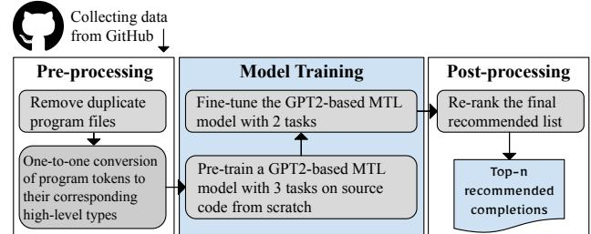
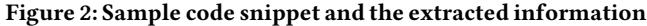
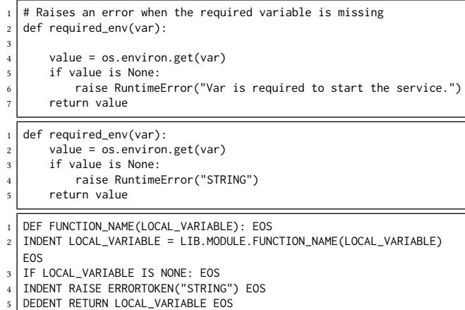
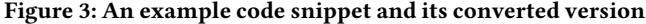
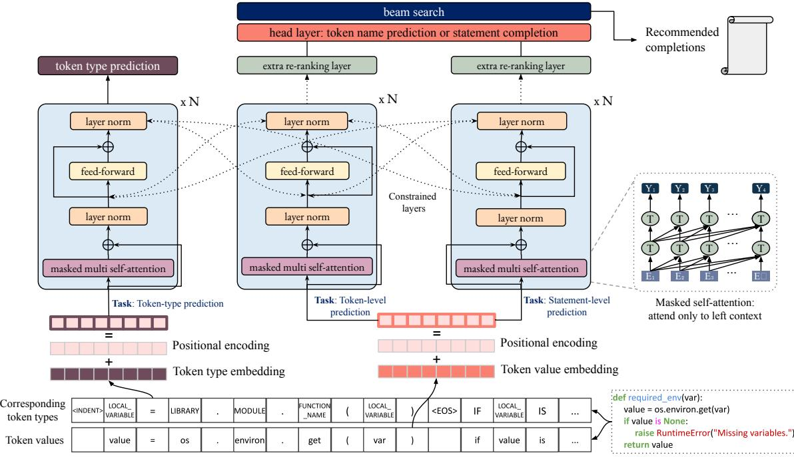
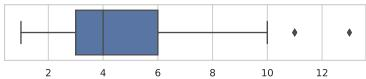
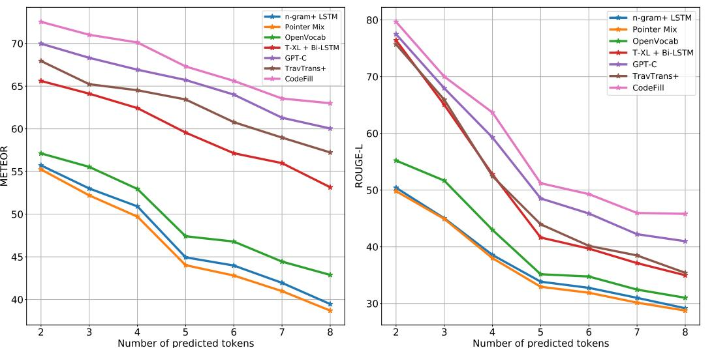

# CodeFill: Multi-token Code Completion by Jointly Learning from Structure and Naming Sequences

Maliheh Izadi M.Izadi@tudelft.nl Delft University of Technology Delft, Netherlands

Roberta Gismondi R.Gismondi@student.tudelft.nl Delft University of Technology Delft, Netherlands

Georgios Gousios G.Gousios@tudelft.nl Delft University of Technology Delft, Netherlands

#### ABSTRACT

Code completion is an essential feature of IDEs, yet current autocompleters are restricted to either grammar-based or NLP-based single token completions. Both approaches have significant drawbacks: grammar-based autocompletion is restricted in dynamicallytyped language environments, whereas NLP-based autocompleters struggle to understand the semantics of the programming language and the developer's code context.

In this work, we present CodeFill, a language model for autocompletion that combines learned structure and naming information. Using a parallel Transformer architecture and multi-task learning, CodeFill consumes sequences of source code token names and their equivalent AST token types. Uniquely, CodeFill is trained both for single-token and multi-token (statement) prediction, which enables it to learn long-range dependencies among grammatical and naming elements. We train CodeFill on two datasets, consisting of 29M and 425M lines of code, respectively. To make the evaluation more realistic, we develop a method to automatically infer points in the source code at which completion matters. We compare CodeFill against four baselines and two state-of-the-art models, GPT-C and TravTrans+. CodeFill surpasses all baselines in single token prediction (MRR: 70.9% vs. 66.2% and 67.8%) and outperforms the state of the art for multi-token prediction (ROUGE-L: 63.7% vs. 52.4% and 59.2%, for = 4 tokens). We publicly release our source code and datasets.

#### CCS CONCEPTS

• Software and its engineering → Software notations and tools.

#### KEYWORDS

Automatic Code Completion, Transformers, Multi-Task Learning, Types, Dynamically-typed Languages

#### ACM Reference Format:

Maliheh Izadi, Roberta Gismondi, and Georgios Gousios. 2022. CodeFill: Multi-token Code Completion by Jointly Learning from Structure and Naming Sequences. In 44th International Conference on Software Engineering (ICSE '22), May 21–29, 2022, Pittsburgh, PA, USA. ACM, New York, NY, USA, [12](#page-11-0) pages.<https://doi.org/10.1145/3510003.3510172>

ICSE '22, May 21–29, 2022, Pittsburgh, PA, USA

© 2022 Copyright held by the owner/author(s).

ACM ISBN 978-1-4503-9221-1/22/05.

<https://doi.org/10.1145/3510003.3510172>

#### 1 INTRODUCTION

Automatic code completion (also called autocompletion) is the task of completing source code statements by predicting what the developer would write given the current context. It helps developers finish their programming tasks faster by decreasing the typing effort and saving keystrokes, correcting typographical errors, and enabling them to explore APIs in a context-sensitive manner [\[5\]](#page-10-0). Autocompletion has therefore emerged as one of the most prominent features in Integrated Development Environments (IDEs).

To support autocompletion, current IDEs exploit the regular structure of programming languages. For example, an IDE knows that an opening parenthesis character ('(') at a function-call position must be followed by enough arguments to match the function's arity. It can therefore propose argument names for variables that are in scope. The availability of types in the host programming language helps increase the precision of suggestions; continuing with the example above, the IDE will only propose variable names for variables whose types match the function argument. Recent autocompletion systems also take into account past completions [\[43\]](#page-11-1) and analyze large code bases [\[9\]](#page-10-1) to rank suggestions according to their past popularity. Despite the best efforts of researchers and IDE developers, developers find rule-based code completion mechanisms lacking. Ranking suggestions based on alphabetical or usage frequency (or even the suggestion list length [\[23\]](#page-11-2)) neglects the current context, leading to unrelated recommendations [\[3\]](#page-10-2). These problems are exacerbated in dynamically typed language settings, as the IDE is lacking significant information to provide accurate suggestions.

To mitigate rule-based autocompletion issues, researchers have proposed statistical [\[17,](#page-11-3) [37\]](#page-11-4) and learning-based [\[6,](#page-10-3) [17,](#page-11-3) [29,](#page-11-5) [31,](#page-11-6) [32,](#page-11-7) [51\]](#page-11-8) autocompletion models. Motivated by the naturalness hypothesis [\[19\]](#page-11-9), learning-based models treat source code as natural language text, hence code completion becomes an instance of the well-studied text completion problem. However, treating source code as text deprives learning-based models of important code structure and semantic information [\[18\]](#page-11-10). Moreover, the open-ended nature of code leads to extremely large prediction spaces due to developers constantly inventing identifier names [\[24\]](#page-11-11).

In an illuminating study, Hellendoorn et al. [\[18\]](#page-11-10) identified a set of issues with current research in code completion. Initially, the current approach of evaluating accuracy as masked token prediction does not reflect how autocompletion is used; developers only trigger autocompletion after specific, and certainly not arbitrary, points in a program's syntax (e.g., after an opening parenthesis). Thus, treating all tokens equally masks the fact that some tokens (e.g., punctuation) are much easier to predict than others (e.g., identifiers). Moreover, most approaches (especially learning-based ones) do not

Permission to make digital or hard copies of part or all of this work for personal or classroom use is granted without fee provided that copies are not made or distributed for profit or commercial advantage and that copies bear this notice and the full citation on the first page. Copyrights for third-party components of this work must be honored. For all other uses, contact the owner/author(s).

account for names coming from dependencies, which deprives them of important context.

In this work, we propose CodeFill, a novel learning-based approach that aims to address the problems identified above. CodeFill borrows from the bimodality hypothesis [\[12\]](#page-10-4) to model source code inputs. Specifically, CodeFill exploits that information is conveyed by source code through two channels; the natural language channel (variable names, functions, etc.), and the code structure channel (inheritance, containment, etc.). Inputs are fed into the model simultaneously as both sequences of token values, which enable it to learn relationships among token values, and, uniquely, sequences of token types, which enable it to learn associations between syntactic elements. CodeFill is then asked to predict either the value or the type of the next n tokens. To enable CodeFill to learn name dependencies across longer ranges, we also train it with an additional task, multi-token statement completion at the value level. The input token names to CodeFill is encoded with Byte-Pair Encoding (BPE), which enables CodeFill to both compress the input name space and generate names that are not in the input vocabulary. To present suggestions relevant to the developer's context, CodeFill includes a post-processing step that re-ranks the predictions based on the context visible to the model at the completion point. CodeFill is instantiated as a set of three Transformers (GPT2-based) trained with soft parameter sharing Multi-Task Learning (MTL) setting. Each transformer models one of the three tasks, namely token value, token type, and multi-token prediction; a joint loss function across all three tasks updates the weights of all three model components. During each epoch, the model is trained on one task according to a configurable task-picking policy. Our target language is Python, to both demonstrate the efficiency of the model when type information is missing and also make our work comparable with the state of the art.

We pit CodeFill against four baseline models and two the-stateof-the-art models, namely GPT-C [\[49\]](#page-11-12) and TravTrans+ [\[25\]](#page-11-13). We use two deduplicated datasets: the ETH150K dataset (deduplicated: PY117K) and a manually collected dataset consisting of practically all non-forked Python repositories on GitHub (PY1690K). We evaluate all models on two tasks: Token-Level and Statement-Level Predictions (TLP and SLP). For TLP, we evaluate for i) next token prediction (TLP-A), ii) next token type prediction (TLP-B), iii) next token value prediction (TLP-C). To ensure that the evaluation setting reflects real-world use of autocompletion, we also evaluate completions after specific syntactic elements, e.g., a dot . or an AWAIT keyword (TLP-D). We devise an algorithm to identify those syntactic elements (cardinal points) automatically given a corpus. We use top-1 Accuracy and the Mean Reciprocal Rank (MRR) as evaluation metrics. For the SLP task, we assess the models on statement completion with tokens and we compare them using ME-TEOR and ROUGE-L measures. To show that each component in the CodeFill model is necessary, we perform an ablation study.

The results demonstrate that CodeFill outperforms all the competing approaches in all tasks. Indicatively, for each of the TPL-A, TPL-B, TPL-C, and TPL-D evaluation tasks, CodeFill achieves a state of the art MRR of 81.7%, 87.2%, 69.5%, 70.2% while TravTrans+, a current state of the art, scores 79.4%, 83.6%, 63.8%, and 66.2%, respectively. In the SLP evaluation task, for completing statements with four tokens (the average completion length in our datasets)

CodeFill obtains 70.2% and 63.8% for the METEOR and ROUGE-L metrics respectively, and thus significantly surpasses TravTrans+ (64.5% and 52.4%).

The main contributions of this work are:

- CodeFill, a model that unifies learning of structural and name-based information for the autocompletion task.
- An implementation of CodeFill, including training procedures, for the Python programming language. We make our code and datasets available. [1](#page-1-0)
- An extensive evaluation of CodeFill against four baseline models and two state-of-the-art approaches, demonstrating its superior performance.

#### 2 BACKGROUND AND RELATED WORK

In this section, we briefly review the background work relating to our approach. Then, we present the main approaches to autocompletion, including the baselines we used for comparison.

#### 2.1 Language Models and Transformers

Statistical Language Modeling (LM) is the task of developing a probabilistic model for predicting the next tokens in a sequence given its preceding tokens, i.e., the context [\[14\]](#page-10-5). This context for simpler LMs is a short sequence of words, while it can be sentences or paragraphs for larger models [\[46\]](#page-11-14). LMs are either used without modification, e.g., in a text generation task, or used inside a downstream task which requires language understanding. Programming languages also contain predictable statistical properties which can be learned using LMs [\[19\]](#page-11-9).

Recently, Neural LMs have gained popularity due to their superior performance and generalization capabilities [\[14,](#page-10-5) [35\]](#page-11-15). Neural LMs address the n-gram data sparsity problem through parameterization of words as vectors [\[26\]](#page-11-16). A real-valued vector (word embedding) is used to represent each word in a vector space. This representation of words is learned based on their usage. This allows words with a similar meaning to have a similar representation. Note that traditional statistical LMs were not able to achieve this level of generalization [\[47\]](#page-11-17). Moreover, the distributed representation approach makes it easier for the embedding representation to scale with the vocabulary size. This is specifically useful with source code, where the vocabulary size can be unlimited due to the use of arbitrary identifiers. Initially, feed-forward neural network models, then Recurrent Neural Networks (RNNs) and next, networks with long-term memory, such as Long Short Term Memory (LSTM) networks were used.

Most recently, there have been significant improvements with the introduction of self-attention architectures in the Transformer which is a sequence-to-sequence architecture for transforming a given sequence of elements to another form [\[53\]](#page-11-18). Attention enable Transformers to focus on selective parts of an input, thus generating more relevant outputs [\[34\]](#page-11-19). Transformers outperform previous deep models such as RNNs and LSTMs on multiple NLP tasks [\[53\]](#page-11-18). A Transformer consists of two main components, an encoder, and a decoder. GPT-2 introduced by OpenAI [2](#page-1-1) , is a large generative Transformer-based LM trained on a dataset of 8M web pages [\[39\]](#page-11-20).

1<https://github.com/saltudelft/codefill>

2<https://openai.com/>

GPT-2 has been successfully exploited for various NLP and source code analysis tasks [\[10,](#page-10-6) [16,](#page-11-21) [28,](#page-11-22) [49\]](#page-11-12).

### 2.2 Multi-Task Learning

Multi-Task Learning (MTL) is a model training technique that combines multiple tasks and a joint loss function, with the goal of maximizing performance on one or all of the tasks. MTL enables knowledge transfer across related tasks and improves generalization by leveraging the domain-specific information contained in the training signals of related tasks [\[11\]](#page-10-7). An MTL model captures the common features among all the tasks through sharing hidden layers among them. MTL has been applied successfully in both NLP [\[13\]](#page-10-8) and source code analysis [\[32,](#page-11-7) [33\]](#page-11-23). There are two approaches to jointly train models using MTL, hard-parameter and soft-parameter sharing. In the former, the hidden layers are shared between all tasks while keeping several task-specific output layers. For the latter, each task has its own model with its own parameters. However, the distance between them is regularized to encourage the parameters to be similar. In the soft-parameter sharing case, training can happen either sequentially (one task per training round) or alternatively (one task per epoch).

#### 2.3 Related Work

Autocompletion is an active research area for both practitioners and researchers. Below, we review the latest approaches to autocompletion.

2.3.1 Conventional Autocompletion. Traditionally, autocompleters used heuristic rules static type information [\[20\]](#page-11-24), similar code examples [\[9\]](#page-10-1), and program history data [\[42\]](#page-11-25) for suggesting completions. For instance, IDEs conventionally return a list of type-checked names either based on the order of alphabet or usage frequency.

2.3.2 Statistical LMs and Grammar-based Models. Several studies use statistical LMs for modeling source code [\[17,](#page-11-3) [19,](#page-11-9) [37,](#page-11-4) [52\]](#page-11-26). Tu et al. [\[52\]](#page-11-26) built upon an n-gram model using a cache mechanism to capture locality in source code. Hellendoorn and Devanbu [\[17\]](#page-11-3) improved the n-gram model by exploiting various techniques including nested scopes, locality, and unlimited vocabulary. Raychev et al. [\[40\]](#page-11-27) proposed a probabilistic model based on decision trees and domain-specific grammars. Researchers also studied the use of syntactic structure through exploiting probabilistic graphical models. Allamanis et al. [\[4\]](#page-10-9) employ probabilistic context-free grammars, while Raychev et al. [\[8,](#page-10-10) [40,](#page-11-27) [41\]](#page-11-28) use probabilistic higher order grammars to this end.

2.3.3 Deep Learning for Autocompletion. Recently, deep neural networks such as RNNs, LSTMs and Transformers are being effectively used for modeling source code [\[6,](#page-10-3) [17,](#page-11-3) [24,](#page-11-11) [25,](#page-11-13) [29\]](#page-11-5). In 2018, Li et al. [\[29\]](#page-11-5) proposed a pointer mixture model to mitigate the Out-Of-Vocabulary (OOV) problem. They trained two LSTM models on types and tokens. Karampatsis et al. [\[24\]](#page-11-11) presented a large-scale open-vocabulary neural LM. They incorporated BPE, beam search, and cache mechanism to address the OOV problem. Most recently, Kim et al. [\[25\]](#page-11-13), incorporated the syntactic structure of trees into their Transformer-based model to better learn from source code.

2.3.4 Multi-token Autocompletion. Although most research on code completion is focused on single-token prediction, several studies aimed to complete entire statements or blocks of code [\[36,](#page-11-29) [49,](#page-11-12) [54,](#page-11-30) [55\]](#page-11-31). Yang et al. [\[55\]](#page-11-31) proposed PCC and introduced an intermediate representation for source code, to put tokens into groups using lexeme and variable relative order. Nguyen et al. [\[36\]](#page-11-29) proposed AUTOSC to combine program analysis and software naturalness and fill in a partially completed statement with frequent and valid recommendations. Svyatkovskiy et al. [\[49\]](#page-11-12) recently proposed a GPT-2 based multi-lingual model, GPT-C, for completing lines. Wen et al. [\[54\]](#page-11-30) introduced FeaRS which recommends the next method given the current code in an IDE using implementation patterns learned through mining open source projects.

2.3.5 MTL for Autocompletion. MTL has been used in various NLPrelated tasks [\[45,](#page-11-32) [48,](#page-11-33) [56\]](#page-11-34). Recently, it has also been employed for programming language processing tasks. Liu et al. [\[32,](#page-11-7) [33\]](#page-11-23) proposed two approaches based on MTL for autocompletion. In the first study, the authors used a Transformer-XL and an RNN for predicting next token type and value [\[32\]](#page-11-7). They develop a partial AST encoder and a path2root encoder and use them in their MTL framework. In their second study, Liu et al. [\[33\]](#page-11-23) pre-train their model with hybrid objective functions for code understanding and code generation tasks. Next, they fine-tune it on code completion. The pre-training tasks are masked bidirectional LM, next code segment prediction, and unidirectional LM. The fine-tuning tasks are unidirectional masked LM, and unidirectional LM.

2.3.6 Practical Aspects of Autocompletion. Hellendoorn et al. [\[18\]](#page-11-10) claim the accuracy of autocompleters evaluated on synthetic data can drop on real-world data. Aye et al. [\[7\]](#page-10-11), trained models on realworld code completion examples of an internal dataset (Facebook). They showed that models trained on data distributions that are closer to those of where the model will be deployed can outperform models trained on committed source code in public repositories. Svyatkovskiy et al. [\[51\]](#page-11-8) integrated Pythia, an LSTM model, to IntelliCode, an extension to Microsoft VS Code IDE. In a followup study [\[49\]](#page-11-12), they introduced IntelliCode Compose as a generalpurpose multilingual autocompletion using Transformers. The improved model predicts sequences of code tokens, generating up to entire statements. IntelliCode Compose is integrated into the Microsoft VS Code IDE. Finally, Svyatkovskoy et al. [\[50\]](#page-11-35) implemented and evaluated several neural code completion models, which offer varying trade-offs in terms of memory, speed, and accuracy. Commercial autocompletion tools, such as TabNine and GitHub Copilot also exist, but very little technical information has been shared about them.

#### 2.4 Baselines

We include six recent models as baselines to provide a comprehensive evaluation. For all baselines, we use the replication packages provided by the authors and set the parameters as defined in each respective study. For the statement level prediction task, we modified the output layer of the baselines to predict up until the end of a statement.

N-gram + LSTM (FSE, 2017): Hellendoorn et al. [\[17\]](#page-11-3) claim that a well-engineered and simple approach (n-gram based language models) can provide better performance than more complex models (deep neural networks). The authors show that the combination of an n-gram and LSTM-based model outperforms the rest of their models.

Pointer Mixture (IJCAI, 2018): Li et al. [\[29\]](#page-11-5), propose a pointer mixture model to address the OOV problem. They also try to incorporate structural information in their models by training two models (token types and values) separately.

T-XL + Bi-LSTM (ICPC, 2020): Liu et al. [\[32,](#page-11-7) [33\]](#page-11-23), propose two models based on the MTL technique. The first study uses Transformer-XL and a Bi-LSTM to train two models for tokens and AST paths for dynamically-typed languages such as Python. The second study by the same group presents a pre-trained language model which is fine-tuned for code completion. The authors use static analysis and type annotations for their type prediction task, for Java. We compare against the first model only, as it most closely matches our setup.

OpenVocab (ICSE, 2020): To address the OOV problem, Karampatsis et al. [\[24\]](#page-11-11) present a BPE-based language model. We include it here for completeness, even though their model is not tuned for autocompletion.

IntelliCode Compose (FSE, 2020): Svyatkovskiy et al. [\[49\]](#page-11-12) propose a general-purpose, multi-lingual autocompletion supporting multi-token statement completion. They train a GPT-2 model on 1.2 LOC written in Python, C#, TypeScript, and JavaScript. This tool is deployed as a cloud-based web service and uses client-side caching and parallel implementation to speed up the predictions. As the source code is not publicly available, we trained a GPT-2 model for source code and did our best to adhere to the settings reported in the study. As the focus of our study is mono-lingual, we only train this model on Python code.

TravTrans+ (ICSE, 2021): Kim et al. [\[25\]](#page-11-13) propose a transformerbased approach which exploits AST paths. We use their best model, TravTrans+, as the state of the art in our evaluation.

#### 3 APPROACH

The CodeFill pipeline comprises two main phases; pre-processing, model training. Figure [1](#page-3-0) presents the overall workflow. Initially, CodeFill pre-processes, tokenizes and converts the input source code to equivalent syntax token sequences. Training consists of two main phases pre-training with 3 tasks (token sequence type and name completion, statement completion) and fine-tuning on 2 tasks (name and statement completion). For both stages, CodeFill uses soft-parameter sharing MTL to learn from different representations of source code. At evaluation time, Codefill also re-orders recommendations based on their type and the visible context.

In the following section, we present how the proposed approach works in detail.

#### 3.1 Pre-processing

During pre-processing, CodeFill converts the input program files to an equivalent format where keywords and identifiers are swapped with their AST equivalents. The algorithm starts by removing comment sections, blank spaces, and blank lines. It then extracts the list of modules, libraries, and their aliases using the Python AST library. Those are stored in a dictionary and, using it, CodeFill replaces all

Figure 1: CodeFill Workflow

| def transform(node, ctx): 1 node = qual_names.resolve(node) 2 node = CallTreeTransformer(ctx).visit(node) 3 return node 4 |  |        |        |       |          |  |  |  |
|------------------------------------------------------------------------------------------------------------------------------------------------|--|--------|--------|-------|----------|--|--|--|
|                                                                                                                                                |  | Type   | Value  | #Line | Position |  |  |  |
|                                                                                                                                                |  | RETURN | return | 4     | 1        |  |  |  |
|                                                                                                                                                |  | NAME   | node   | 4     | 2        |  |  |  |

their occurrences in code with their respective types (i.e., MODULE, LIBRARY, and ALIAS).

CodeFill also pre-processes and tokenizes the input source code. For each line, it reads the tokenized information and stores four types of information about each token namely (1) its value, (2) its type, (3) its line number, and (4) its position in the line. For instance, for the statement return node in Figure [2,](#page-3-1) it stores two tokens as shown in the table following the code example. Moreover, variable visibility information (e.g., global vs. local variables), is maintained, to differentiate between different name usages in the same context.

To address the OOV problem, CodeFill uses a BPE-encoded name representation. Exploiting word segmentation, BPE iteratively merges the most frequently occurring character sequences. Prior to applying BPE encoding, and similarly to other studies [\[21,](#page-11-36) [22,](#page-11-37) [49\]](#page-11-12), CodeFill normalizes the input strings by replacing string, and numeric literals with respective special tokens, i.e., STRING and NUMBER.

A unique characteristic of the Python language is that indentation defines code blocks; it is therefore important for source code models to learn to encode indentation as part of their learned representation. To do so, CodeFill stores the positioning of indentation markers. For the first line with an indentation, it adds a special token ⟨ ⟩ at the beginning of the given line. It passes through the following lines with the same indentation, to reach the next indentation or a dedentation position, at which point it adds a respective ⟨ ⟩ or ⟨ ⟩ token.

The pre-processing step results in two files for each input source code file; (1) one containing sequences of token names minus the comments and extra blank lines, and (2) one containing sequences of token types. Both are fed into CodeFill as two different but corresponding representations of source code. Figure [3](#page-4-0) shows a

sample function and its corresponding type information with the correct indention.

#### 3.2 Model Training

In this phase, CodeFill learns from two granularity levels; tokenand statement-level completions with three simultaneous tasks, namely (1) next Token Value Prediction (TVP), (2) next Token Type Prediction (TTP), and (3) Statement Completion (SC). Model training follows a two-stage process; First, a generic language modeling objective is used on the unlabeled data to learn the initial parameters. Then, these parameters are adapted to the target tasks using the corresponding objective. Thus, while pre-training, CodeFill learns from all three tasks while fine-tuning is restricted to the TVP and SC tasks. The reason for excluding the TTP task is that the number of types for all the program files is limited. Hence, the model quickly learns how to properly predict these type sequences (i.e., learns an effective representation of the Python grammar), eliminating the need for further fine-tuning.

The main neural network architecture for all tasks is based on the GPT-2 Transformer with layers. CodeFill uses three distinct GPT-2 transformers, each with its own input and training objective. The models are initialized with random weights. Transformer blocks include self-attention layer, feed-forward neural nets, and a normalization layer. Self-attention blocks identify which tokens to focus on. Feed-forward neural nets consist of an input layer to accept information, hidden layers to capture the hidden correlations between each data point, and finally, an output layer to transmit information. The parameters are transferred to the next decoder in the stack after being regularised (with 2 norm) to be similar to the respective decoder's parameters. CodeFill uses softmax activation function in the output layer to generate probability distributions over the vocabulary.

To train the model to predict a sequence of tokens, { } ⊂ , ∈ [1, . . . , ], with as the vocabulary, and as the existing code context, CodeFill estimates the following conditional probability distribution, :

$$P(\boldsymbol{\upsilon}\_{0},\ldots,\boldsymbol{\upsilon}\_{N}|\boldsymbol{c}\_{0},\ldots,\boldsymbol{c}\_{T}) = \prod\_{l=1}^{N} P(\boldsymbol{\upsilon}\_{l}|\boldsymbol{c}\_{0},\ldots,\boldsymbol{c}\_{T},\boldsymbol{\upsilon}\_{0},\ldots,\boldsymbol{\upsilon}\_{l-1}) . \tag{1}$$

We use a standard language modeling objective, predicting the next token given a context, and maximize the following likelihood based on our unsupervised corpus of tokens. In Equation [2,](#page-4-1) is the length of the predicted sequence of code token values and is the set of parameters that is learned through stochastic gradient descent optimization to model [\[44\]](#page-11-38).

$$L(V) = \sum\_{i} \log P(\upsilon\_i | \mathbf{c}\_0, \dots, \mathbf{c}\_T, \upsilon\_{i-m}, \dots, \upsilon\_{i-1}; \theta). \tag{2}$$

In each layer, multi-attention heads are used to aggregate the output of the previous layer for each transformer block. Multi-headed self-attention is applied over the input context tokens followed by position-wise feed-forward layers to produce the output distribution.

$$h\_0 = C\mathcal{W}\_\mathfrak{e} + \mathcal{W}\_{\mathfrak{P}},\tag{3}$$

$$h\_l = \text{transformer\\_block}(h\_{l-1}), l \in \{1, \dots, L\}, \tag{4}$$

$$P(\upsilon\_t) = \operatorname{softmax}(h\_L W\_\mathbf{e}^T), t \in \{0, \dots, N\} \tag{5}$$

where is the context vector of tokens, is the number of layers, is the token embedding matrix, and is the position embedding matrix.

For training with MTL, CodeFill uses the alternative training strategy, which aims to prevent catastrophic forgetting (as opposed to the sequential strategy). With a probability of 20%, 40%, and 40% for each of the TTP, TVP, and SC tasks, respectively, CodeFill picks a random task for each epoch. TTP requires fewer epochs as its vocabulary is fairly limited. Further on, for TVP and SC tasks, CodeFill uses beam search to identify the most likely (sub-)token sequences.

Loss is shared among all tasks. During pre-training, the parameters are tuned to minimize the absolute minimum of the cross entropy losses among the three pre-training tasks, namely, TVP, TTP, and SC (Equation [6\)](#page-4-2). When fine-tuning, only TVP and SC losses are used.

$$Loss\_{final} = |\min(Loss\_{TVP}, Loss\_{TVP}, Loss\_{SC})|\tag{6}$$

3.2.1 Token Value Prediction Task (TVP). CodeFill uses different representations of programs for each task within the soft-parameter sharing MTL framework. CodeFill treats the TVP task as masked unidirectional prediction; left-side context is used to predict the next token. The inputs to the task are sequences of token values, represented as real-valued vectors of [1, 2, . . . , ].

3.2.2 Token Type Prediction Task (TTP). Similarly to TVP, TTP is also treated as left-to-right masked unidirectional prediction. The input are corresponding token type representations as realvalued vector of [1, 2, . . . , ] As both the TTP and TVP models are trained jointly, CodeFill is capable of exploiting token types when the ultimate goal is to predicting token values.

Figure 4: Model training

3.2.3 Statement Completion Task (SC). As useful as next-token prediction may be, developers can also benefit from getting longer suggestions to complete code statements [\[6,](#page-10-3) [36,](#page-11-29) [49\]](#page-11-12). Correspondingly, CodeFill can also benefit from training to predict longer sequences, as training will enable it to better prioritize context use. Thus, we add a third task to train CodeFill to provide completion suggestions up and until the end of a statement. To predict a whole statement given the existing code context , and the vocabulary , CodeFill attempts to generate token values { } ⊂ , conditioned on the sequence of preceding token values { } ⊂ , For this task, the pre-processing steps introduce a special token (⟨⟩) to demarcate the end of a statement. CodeFill is trained to keep predicting sequences of token names until it produces an ⟨⟩ token.

3.2.4 Beam search. CodeFill uses greedy (beam) search to identify the most probable sequences given a sequence of probabilistic predictions. Specifically, || (width of the beam) top probabilities, are recorded partially for every step. This heuristic algorithm does not necessarily optimize results; however, its computational complexity equals to(||× | |) which is much faster than computing all cases. As || increases, the quality of generated summaries improves, however, the learning time increases as well. We experimented with several beam values (3, 5, and 10), and settled to 5, as it provided a good balance of accuracy and speed.

#### 3.3 Post-processing

Re-ranking Recommendations. For a recommendation system to be useful, predictions should be ranked similarly to user expectations. To optimize ranking, CodeFill includes a post-processing

layer to re-rank the leaf nodes in the final recommendation list based on the visible scope (i.e., the current file). This is based on the observation that most completions should be local to the edited file, as naming visibility rules should force names to cluster.

To re-rank the suggestions, CodeFill hierarchically divides the visible scope to file, class, and closest function. The intuition here is, when the model is predicting the next token and its type is expected to be a variable name, candidates in the closest scope have a higher probability of being correct. However, when the next token is predicted to be a function name, candidates from the same class (functions defined in the same class) should be probably at the top of the list. The re-ranking process consists of multiplying the prediction probabilities of the top-10 predictions with a corresponding weight coefficient. The weights are selected based on the type of the predicted token and the scope of the declaration of the identifier. Each prediction consists of a <token, type, probability> triplet with respect to the prediction point that it is made available, We generate the list of all visible names and their hierarchical scope (function, class, file). Each prediction is then cross-checked with this list, in the case where the predicted identifier is indeed already declared in the file (and thus in the list), its prediction probability is multiplied by a weight depending on the type of the predicted token and the scope associated with the item in the list. As the weights impact the quality of predictions, we first defined a range/ratio for different categories based on our programming intuition. Then, we experimented with this range and selected the best performing weights. Table [1](#page-6-0) presents the weights used in this process.

Table 1: Weights in the post-processing layer for re-ranking

| Leaf node type   | Function | Class | File  |  |
|------------------|----------|-------|-------|--|
| Attribute Access | 1.625    | 1.250 | 1.125 |  |
| Variable names   | 1.625    | 1.125 | 1.500 |  |
| Function names   | 1.125    | 1.625 | 1.500 |  |

|  |  |  |  | Algorithm 1 Re-ranking final recommendations |
|--|--|--|--|----------------------------------------------|
|--|--|--|--|----------------------------------------------|

- 1: input Predictions, WeightsList
- 2: output Predictions ⊲ List of updated predictions
- 3: Names ← getSignificantNames() ⊲ Get the list of important names in left context from the file
- 4: for pred in Predictions do
- 5: while true do

| Names ← getSignificantName.pop() 6: if significantName.token = prediction.token then 7: typeCategory ← getTypeCategory() 8: weight ← weights[typeCategory][scope] 9: pred.probability ← pred.probability × weight 10: break 11: end if 12: end while 13: 14: end for |  |
|----------------------------------------------------------------------------------------------------------------------------------------------------------------------------------------------------------------------------------------------------------------------------------------------------------------------|--|
|                                                                                                                                                                                                                                                                                                                      |  |
|                                                                                                                                                                                                                                                                                                                      |  |
|                                                                                                                                                                                                                                                                                                                      |  |
|                                                                                                                                                                                                                                                                                                                      |  |
|                                                                                                                                                                                                                                                                                                                      |  |
|                                                                                                                                                                                                                                                                                                                      |  |
|                                                                                                                                                                                                                                                                                                                      |  |
|                                                                                                                                                                                                                                                                                                                      |  |
|                                                                                                                                                                                                                                                                                                                      |  |

Although the current weights improve the predictions, this only sets the minimum bar. Future work can exploit automatic learning of these weights.

#### 4 EXPERIMENTAL SETUP

To train and evaluate CodeFill, we use two Python datasets. We evaluate the models based on different evaluation scenarios, to achieve a more realistic and comprehensive outlook on the performance of code completion models to benefit developers in real-world cases.

#### 4.1 Evaluation Tasks

We evaluate CodeFill on two tasks, namely Token-Level and Statement-Level Predictions (TLP and SLP).

4.1.1 Token-Level Prediction. We use TLP to assess the ability of the model to predict a single next token. We split this part of the evaluation into four subtasks presented below.

Any token prediction. Our first sub-task is to evaluate the predictions of any token irrespective of its type (TLP-A). This is the baseline evaluation task employed in the literature, but as research has shown [\[18\]](#page-11-10), it is not representative of real-world autocompletion use. For this reason, we resort to more detailed evaluations, as presented below.

Token Type Prediction. To assess the model's ability to learn grammatical sequences, we evaluate how well a model can predict a correct AST token given a context (TLP-B). We group together AST tokens in the following categories: Identifiers, Keywords, Operators, Punctuation, and finally numerals and string Literals.

Figure 5: Length of statements in the PY117K dataset

Leaf Node Prediction. Inspired by the evaluation setup of the state-of-the-art study by Kim et al. [\[25\]](#page-11-13), we investigate the ability of models when predicting AST leaf nodes (TLP-C), including Attribute access, Names, Function parameters, and Constants.

Cardinal Point Prediction. The three tasks presented up to now give a comprehensive view of the prediction ability of a model. However, in practical settings, autocompletion is only triggered at specific points (e.g., after a dot, or after specific keywords such as for) while the developer is editing source code. To ensure that predictions translate to practical benefits for the developers, we evaluate completions on cardinal points (TLP-D). To obtain a list of keywords after which autocompletion is likely to be triggered, we first select the list of punctuation and keywords tokens that can be completed. We then compute the frequency of all bi-grams with any of these tokens as their first token in our dataset. Then, we remove three sets of bi-grams; (1) those that are mostly written together with occurrence frequency above 95% (e.g., async def), (2) those that are normally not predictable (e.g., class NAME or def FUNCTION-NAME), and finally (3) those that are usually not practical completions (e.g., TRUE :). The resulting list of tokens after which it is most beneficial for autocompletion to be triggered is as follows.

DOT, AWAIT, ASSERT, RAISE, DEL, LAMBDA, YIELD, RETURN, EXCEPT, WHILE, FOR, IF, ELIF, ELSE, GLOBAL, IN, AND, NOT, OR, IS, BINOP, WITH, ;, " [, (, {, ~

Evaluation Metrics. As the model only predicts a single token in the TLP task, we include two evaluation metrics, namely the Accuracy of the top prediction and the Mean Reciprocal Rank (MRR) for the top-10 recommendations.

Accuracy measures the proportion of samples for which the suggested completion token exactly matches the single target label.

MRR assesses the whole top recommended completions and takes into account the first position the target is matched [\[38\]](#page-11-39). For a single query, the reciprocal rank is 1 where is the position of the highest-ranked answer (1, 2, 3, ..., for answers). If no correct answer exists in top-, then the reciprocal rank is 0. For multiple queries , the MRR is the mean of the reciprocal ranks.

4.1.2 Statement Level Prediction (SLP). The SLP task assesses a model's ability to complete statements with up to tokens. The boxplot in Figure [5](#page-6-1) shows the distribution of number of tokens for completions in the evaluation dataset (117). In our datasets, statements are 4.2 tokens long on average (median: 4, maximum: 13). To provide a comprehensive view, we evaluate the performance of the models when predicting next- tokens with ∈ [2, 3, . . . , 8].

Evaluation Metrics: On absence of code-specific metrics, we use two metrics commonly-used for automatic evaluation of text generation, namely Metric for Evaluation of Translation with Explicit

Table 2: Datasets used for training and evaluation

|                  | PY1690K | PY117K |
|------------------|---------|--------|
| #Repositories    | 32.7K   | 24.9K  |
| #Files           | 1.7M    | 117K   |
| #LOC             | 425M    | 29M    |
| #Tokens (unique) | 5.7M    | 766K   |
| #Types (unique)  | 103     | 103    |

Table 3: TPL-A results: Any token prediction

| Approach             | Venue         | Accuracy | MRR  |
|----------------------|---------------|----------|------|
| n-gram + LSTM [17]   | (FSE, 2017)   | 65.1     | 67.9 |
| Pointer Mixture [29] | (IJCAI, 2018) | 65.8     | 70.0 |
| OpenVocab [24]       | (ICSE, 2020)  | 67.2     | 69.8 |
| T-XL + Bi-LSTM [32]  | (ICPC, 2020)  | 75.0     | 76.4 |
| GPT-C [49]           | (FSE, 2020)   | 79.8     | 80.0 |
| TravTrans+ [25]      | (ICSE, 2021)  | 78.9     | 79.4 |
| CodeFill             | Proposed      | 80.6     | 81.7 |

#### 4.3 Implementation and Configuration We use Python's AST [3](#page-7-1) , Tokenize [4](#page-7-2) , and the DIS [5](#page-7-3)

conversion tool. Moreover, we use the HuggingFace [6](#page-7-4) implementation of our GPT-2 and MTL models. We set the learning rate to 0.00001, maximum sequence length to 2048, and trained our model for 100 epochs. We set the remaining parameters to default values. Our experiments are conducted on a machine equipped with two GeForce GTX 1080 Ti GPUs, an Intel(R) Xeon(R) CPU E5-2690

## 5 RESULTS AND DISCUSSION

In this section, we present the results for each evaluation task, along with an ablation study and a characterization of the models' performance.

v4 @ 2.60GHz CPU with 14 core processors, and 128G RAM.

#### 5.1 Token-level Prediction (TLP)

5.1.1 Any token prediction. The most basic form of evaluation for an autocompletion model is to gauge its ability to predict the next token given some context as input. TLP-A can provide an overview on the ability of an autocompleter to predict, however, it does not account for the prior probabilities of different types of tokens. We present this task for compatibility with existing work, and further elaborate CodeFill's performance in the following tasks. The results can be seen in Table [3;](#page-7-5) our model outperforms all the baselines across all metrics.

5.1.2 Token Type Prediction. We investigate the performance of the models when predicting different types of tokens, i.e., their ability to assimilate how developers use grammar to express concepts. Models generally struggle more with specific token types. For instance, it is known that predicting identifiers is harder than predicting keywords [\[18\]](#page-11-10). Table [4](#page-8-0) present the Accuracy and MRR results based on all token types. As demonstrated, CodeFill outperforms the baselines for all token types based on both metrics (except for MRR on keywords and punctuation, where its performance is on par). Transformer-based approaches are highly capable of predicting specific types of tokens, namely keywords and punctuation; effectively, this means that given enough training examples, they can efficiently learn syntactical patterns. Predicting identifiers and literals across all models is more challenging. For identifiers,

ORdering (METEOR) [\[27\]](#page-11-40) and Recall-Oriented Understudy for Gisting Evaluation (ROUGE-L) [\[30\]](#page-11-41).

ROUGE: ROUGE-N refers to overlapping n-grams. ROUGE-L, one of the variations of the ROUGE metric, counts longest matching sequence of words using the Longest Common Subsequence algorithm. It considers sentence-level structure similarity and automatically identifies the longest co-occurring chain of in sequence n-grams. Thus, it does not require consecutive matches but insequence matches that reflect sentence-level word order.

METEOR is based on the term-to-term mapping of the generated code with its corresponding reference code. It focuses mainly on recall. Lavie et al. [\[27\]](#page-11-40) showed metrics based on recall consistently achieve higher correlation with user preferences than those based on precision alone.

#### 4.2 Datasets

We use two Python datasets for training and evaluation:

- The ETH 150K Python dataset [\[40\]](#page-11-27) for compatibility with previous work. The authors collected Python programs from GitHub repositories and removed duplicate files, project forks, files that do not parse and have more than 30K nodes in their ASTs. They also removed obfuscated files and only used repositories with permissive licenses including MIT, BSD, and Apache.
- The CodeFill dataset, which was collected by querying GHTorrent [\[15\]](#page-10-12) for all non-forked Python repositories with more than 20 stars (58k repositories).

After deduplication, using the method proposed by Allamanis [\[2\]](#page-10-13), we ended up with two versions of the original datasets, 117 and 1690 for the ETH and CodeFill datasets, respectively. Note that 1690 and 117 do not have any common files. Table [2](#page-7-0) presents an overview of the contents of the datasets.

We use 1690 exclusively for pre-training our LM. We then use 90% of 117 for fine-tuning the model on the tasks presented in Section [4.1,](#page-6-2) and finally the last 10% of 117 for evaluation. For the baselines, we concatenate 1690 with the same 90% portion of 117 as above for training, and evaluate on the remaining 10% of 117.

libraries in our

library for the

3<https://docs.python.org/3/library/ast.html>

4<https://docs.python.org/3/library/tokenize.html>

5<https://docs.python.org/3/library/dis.html>

6https://huggingface.co

Table 4: TPL-B Results: Token type predictions

| Metric   | Approach             | Identifier | Keyword | Punctuation | Literals | Operators | All  |
|----------|----------------------|------------|---------|-------------|----------|-----------|------|
|          | Token Percentage     | 21%        | 28%     | 33%         | 5%       | 13%       | -    |
| Accuracy | N-gram+LSTM [17]     | 40.2       | 74.2    | 81.4        | 46.2     | 62.7      | 66.6 |
|          | Pointer Mixture [29] | 37.0       | 85.3    | 80.0        | 43.9     | 62.8      | 68.4 |
|          | OpenVocab [24]       | 42.3       | 89.8    | 93.4        | 54.4     | 65.0      | 76.0 |
|          | T-XL + Bi-LSTM [32]  | 47.4       | 93.1    | 92.4        | 59.4     | 68.7      | 78.4 |
|          | GPT-C [49]           | 50.0       | 96.5    | 95.1        | 62.0     | 71.0      | 81.2 |
|          | TravTrans+ [25]      | 51.1       | 95.9    | 97.0        | 59.3     | 71.3      | 81.8 |
|          | CodeFill             | 54.4       | 97.3    | 98.0        | 65.8     | 71.4      | 83.8 |
| MRR      | N-gram+LSTM [17]     | 40.6       | 76.8    | 84.6        | 49.8     | 64.2      | 68.8 |
|          | Pointer Mixture [29] | 38.5       | 85.9    | 85.2        | 46.7     | 64.5      | 71.0 |
|          | OpenVocab [24]       | 43.2       | 90.3    | 96.0        | 57.0     | 67.1      | 77.6 |
|          | T-XL + Bi-LSTM [32]  | 49.8       | 96.1    | 96.6        | 61.3     | 70.0      | 81.4 |
|          | GPT-C [49]           | 52.3       | 98.8    | 98.8        | 64.0     | 73.3      | 83.9 |
|          | TravTrans+ [25]      | 53.7       | 97.1    | 98.6        | 62.2     | 73.0      | 83.6 |
|          | CodeFill             | 56.0       | 98.1    | 98.0        | 66.1     | 74.4      | 87.2 |

all models' result range from 37% to 56% accuracy. In both cases, CodeFill maintains a non-trivial edge over the baselines, which we attribute to the statement completion task. We believe it helps CodeFill to learn syntactical patterns over longer ranges.

5.1.3 Leaf Node Prediction. We compare each model's performance in predicting different types of leaf nodes in an AST, e.g., function calls, variables, and attribute names. Tables [5](#page-8-1) present the Accuracy and MRR results for this task. CodeFill is the best model in both accuracy, and, especially, MRR. This means that its name predictions, which is arguably the most important feature for an autocompleter, are 2 out of 3 times correct and have a high probability (> 70%) of being included in the top suggestions.

5.1.4 Cardinal Point Completion. In Table [6,](#page-8-2) we report the performance of models when predicting at cardinal points (described in Section [4.1\)](#page-6-2). As indicated, CodeFill outperforms all the baselines. Consequently, it is more capable of presenting correct recommendations at points where autocompletion is more likely to be triggered.

#### 5.2 Statement-Level Prediction (SLP)

We report the results for autocompleting code statements, by predicting the remaining tokens at a given statement position (with ranging between 2 and 8). Figure [6](#page-9-0) presents the results of this experiment based on the achieved METEOR and ROUGE-L scores. All Transformer-based models [\[25,](#page-11-13) [32,](#page-11-7) [49\]](#page-11-12), are consistently more capable than the three baseline approaches. CodeFill improves over all competitors. The margin grows wider as the number of tokens required to complete statements increase (especially in the ROUGE-L case). This result highlights the merits of our statement completion task. In turn, this can help developers code faster by reducing the number of required keystrokes; the experience of using statement completion should be reminiscent of text line completion in popular

Table 5: TLP-C results: Leaf node prediction

| Approach                                                                                                                         | Attribute Access                                  | Names                                                | Function names                                    | Numeric constant                                  | All                                                  |
|----------------------------------------------------------------------------------------------------------------------------------|------------------------------------------------------|------------------------------------------------------|------------------------------------------------------|------------------------------------------------------|------------------------------------------------------|
| Token Percentage                                                                                                                 | 32%                                                  | 13%                                                  | 33%                                                  | 22%                                                  |                                                      |
| N-gram + LSTM [17] Pointer Mixture [29] OpenVocab [24] T-XL + Bi-LSTM [32] GPT-C [49] TravTrans+ [25] CodeFill | 56.3 53.5 59.8 59.9 60.0 60.2 64.0 | 61.8 62.0 63.7 58.1 59.9 65.4 67.3 | 63.5 59.8 66.2 62.8 64.0 68.3 72.2 | 45.1 42.0 51.7 54.8 56.0 52.7 53.1 | 56.9 54.2 60.6 59.5 60.4 61.7 66.3 |
| N-gram + LSTM [17] Pointer Mixture [29] OpenVocab [24] T-XL + Bi-LSTM [32] GPT-C [49] TravTrans+ [25] CodeFill | 57.9 57.1 61.2 61.9 63.4 62.8 72.0 | 64.7 59.0 64.8 65.3 62.9 65.4 69.7 | 65.2 60.2 70.1 69.9 66.5 70.0 76.9 | 47.5 43.1 51.7 55.3 57.2 55.2 56.0 | 58.9 55.3 62.5 63.5 63.0 63.8 69.5 |
|                                                                                                                                  |                                                      |                                                      |                                                      |                                                      |                                                      |

Table 6: TPL-D Results: Cardinal Points Completion

| Approach             | Accuracy | MRR  |
|----------------------|----------|------|
| N-gram + LSTM [17]   | 49.0     | 52.3 |
| Pointer Mixture [29] | 51.3     | 52.4 |
| OpenVocab [24]       | 52.2     | 53.5 |
| T-XL + Bi-LSTM [32]  | 64.0     | 64.7 |
| GPT-C [49]           | 66.1     | 67.8 |
| TravTrans+ [25]      | 65.0     | 66.2 |
| CodeFill             | 70.0     | 70.9 |

online email or document editors. Statistically, more than 2 out of 3 statement completions of 4 or fewer tokens will be correct.

#### 5.3 Ablation Study

We perform an ablation study to examine the impact of different components of CodeFill . Table [7](#page-9-1) presents the results of this study. We include the performance of a vanilla GPT-2 model to show the importance of employing the MTL approach to jointly train models on different representations of source code. The results show that employing the MTL technique to train the models jointly on multiple tasks indeed helps the model learn better. Next, we conduct experiments to compare hard-parameter and soft-parameter models with the two-task MTL model. It is worth mentioning that for the hard-parameter sharing variation, we need to input a unified representation to the models. Thus, we concatenate the type and value of each token as = [ , ] and then feed the vectors of this concatenated representation to the MTL model. The results indicate that the soft-parameter sharing works better in our case. This is probably because this setting allows each task to have its own model and parameters and then regularizes the distance between them to

Figure 6: Results for the SLP task

Table 7: Effectiveness of Different Components of the Model

| Approach | Tasks                  | Train Time | Accuracy | MRR  |
|----------|------------------------|------------|----------|------|
| GPT-2    | Value                  | 12h        | 77.7     | 78.2 |
| MTL HP   | Value, Type            | 17h        | 78.3     | 79.6 |
| MTL SP   | Value, Type            | 19h        | 78.9     | 79.5 |
| MTL SP   | Value, Type, Statement | 24h        | 80.6     | 81.7 |

encourage the parameters to be similar. Finally, to verify whether adding information regarding statements helps, we investigate the effect of adding the third task, statement completion. The results demonstrate that training on two different granularity (single-token and statement) also helps them learn better. To conclude, each component of the proposed model adds to its value. Although the training time increases, it can be argued that training time is a onetime cost, and can be significantly reduced with parallel training on multiple GPUs.

#### 5.4 Runtime Characteristics

An important aspect of ML-based autocompletion tools is their prediction latency. A very accurate model that takes 1 second per prediction will not be very useful in practice as it will interfere with the developer's workflow. As Table [8,](#page-9-2) all models feature an average latency of less than 100 milliseconds, which is considered the golden standard in the industry.

Moreover, the model size and number of parameters are important practical aspects that affect a model's deployment; if the model is too big, it will need to be deployed centrally and clients should connect to the model server over a network connection (which may affect latency negatively), otherwise, it could be distributed to the clients. As Table [8](#page-9-2) shows, CodeFill's number of parameters is more

Table 8: Runtime Characteristics

| Approach             | Train Time (hr) | Latency (ms) | #Params |
|----------------------|-----------------|--------------|---------|
| n-gram + LSTM [17]   | 23              | 75           | 168M    |
| Pointer Mixture [29] | 18              | 62           | 177M    |
| OpenVocab [24]       | 21              | 61           | 145M    |
| T-XL + Bi-LSTM [32]  | 24              | 79           | 173M    |
| GPT-C [49]           | 23              | 74           | 125M    |
| TravTrans+ [25]      | 15              | 53           | 119M    |
| CodeFill             | 24              | 73           | 258M    |

than other baselines due to our architecture specification. However, the size of all Transformer-based models makes them impractical for distribution to clients, necessitating centralized deployments.

#### 6 CONTRIBUTIONS AND IMPLICATIONS

Autocompletion is a popular research area, however, the existing challenges leave substantial margin for improvement, particularly for recommending identifiers or completing longer sequences [\[18\]](#page-11-10). In this study, CodeFill learns from sequences of both token types and token names simultaneously using MTL. The contribution of this work is twofold;

Technical novelty: Similar to the state-of-the-art [\[25,](#page-11-13) [49\]](#page-11-12), we use transformers for learning a name-based sequencing model, and similar to the studies by Liu et al. [\[32,](#page-11-7) [33\]](#page-11-23), we use the MTL technique to condition our models under different tasks. However, IntelliCodeCompose [\[49\]](#page-11-12) treats code as natural text, neglecting the rich structure inherent in programs. Moreover they focus on multilingual LMs. TravTrans+ [\[25\]](#page-11-13) uses serialized ASTs in an attempt to learn from structure, however, we show that our novel transformation, which we designed so that it is closer to how developers

treat source code structure, outperforms TravTrans+. CodeFill also learns from our novel statement completion task to consider longer contexts. Both [Figure 6](#page-9-0) and [Table 7](#page-9-1) show that this technique improves the model, probably by helping it better utilize completion context. The combination of the above demonstrably results in higher evaluation scores and better recommendations.

Evaluation: We propose two novel evaluation tasks, cardinal point, and statement completion, to address deficiencies in current autocompletion evaluation setups. We also collect, pre-process, deduplicate, and share an large Python dataset, consisting of practically all Python code on GitHub.

#### 7 THREATS TO THE VALIDITY

Threats to internal validity: These include the threats pertaining to the parameters affecting the performance of the model. Another threat in this section relates to the errors in the implementation of the baselines. For all of these approaches, we have used the replication packages provided by these studies.

Threats to external validity: These threats relate to the quality of the datasets we used and the generalizability of the results. We used two Python datasets; PY117K is a benchmark dataset [\[40\]](#page-11-27) frequently used in the literature [\[24,](#page-11-11) [25,](#page-11-13) [29,](#page-11-5) [32\]](#page-11-7). PY1690K, our second dataset, is ten times larger with approximately 1.7 program files. More data can lead to more generalizable results. Furthermore, as Allamanis. [\[2\]](#page-10-13) suggests, we have de-duplicated both datasets to avoid biasing the models. All of the programs in both datasets are collected from open-source GitHub repositories. However, further studies are needed to validate and generalize our findings to other programming languages.

Threats to construct validity: These relate to the suitability of the evaluation setting and metrics. In this work, we have tried to incorporate diverse evaluation measures. For the TLP task, we have used standard evaluation metrics, namely Accuracy and MRR in the top-one and top-ten recommendations which are both frequently used in the literature [\[24,](#page-11-11) [25,](#page-11-13) [29,](#page-11-5) [32\]](#page-11-7). Furthermore, we use ROUGE-L and METEOR scores for evaluation in the SLP task as used in previous studies on source sequence of code generation, summarization, and translation [\[1,](#page-10-14) [49\]](#page-11-12).

#### 8 CONCLUSION AND FUTURE WORK

Unlike natural language text, source code is more structured, its grammar is more well defined but its vocabulary is orders of magnitude bigger. Consequently, NLP-based models and corresponding evaluation methods need to be adapted to the particular case of source code.

In this work, we proposed CodeFill, a Transformer-based generative LM for source code pre-trained on three tasks closely relevant to programming. Given a context of tokens (and their types), CodeFill is trained to predict (1) the type of the next token, (2) its value, and (3) the values of up to next tokens. We employ the MTL approach to jointly train CodeFill on the above tasks. We also propose 2 novel evaluation tasks, cardinal point prediction and statement-level multi-token prediction, which we argue that they better represent how autocompletion systems are used in practice. We extensively evaluate CodeFill against six baselines on both tasks. Our results indicate that CodeFill outperforms all the baselines in all

scenarios, achieving state of the art scores on both accuracy (80.6%) and MRR (81.7%) in the basic token-level prediction task. Moreover, we show that CodeFill also learns to autocomplete statements of up to 4 tokens with over 70% accuracy, a significant improvement over the baselines, making it practical to offer statement completions as an IDE feature.

In the future, we plan to incorporate more domain specific knowledge on aspects of training and evaluating a training ML models. For instance, one can limit the context fed to the model based on the programming language to better incorporate related information of functions and nested scopes in a piece of code. We also plan to further investigate statement completion, including better metrics for its evaluation.

#### ACKNOWLEDGMENTS

This work has received funding from the European Union's Horizon 2020 research and innovation programme under grant number 825328 (FASTEN project), and also the NWO MIPL project, grant number 628.008.003.

#### REFERENCES

- [1] Alireza Aghamohammadi, Maliheh Izadi, and Abbas Heydarnoori. 2020. Generating summaries for methods of event-driven programs: An Android case study. Journal of Systems and Software 170 (2020), 110800. [https://doi.org/10.1016/j.jss.](https://doi.org/10.1016/j.jss.2020.110800) [2020.110800](https://doi.org/10.1016/j.jss.2020.110800)
- [2] Miltiadis Allamanis. 2019. The adverse effects of code duplication in machine learning models of code. In Proceedings of the 2019 ACM SIGPLAN International Symposium on New Ideas, New Paradigms, and Reflections on Programming and Software. 143–153.
- [3] Miltiadis Allamanis, Earl T Barr, Premkumar Devanbu, and Charles Sutton. 2018. A survey of machine learning for big code and naturalness. ACM Computing Surveys (CSUR) 51, 4 (2018), 1–37.
- [4] Miltiadis Allamanis and Charles Sutton. 2014. Mining idioms from source code. In Proceedings of the 22nd ACM SIGSOFT International Symposium on Foundations of Software Engineering. 472–483.
- [5] Sven Amann, Sebastian Proksch, Sarah Nadi, and Mira Mezini. 2016. A study of visual studio usage in practice. In 2016 IEEE 23rd International Conference on Software Analysis, Evolution, and Reengineering (SANER), Vol. 1. IEEE, 124–134.
- [6] Gareth Ari Aye and Gail E Kaiser. 2020. Sequence model design for code completion in the modern IDE. arXiv preprint arXiv:2004.05249 (2020).
- [7] Gareth Ari Aye, Seohyun Kim, and Hongyu Li. 2021. Learning autocompletion from real-world datasets. In 2021 IEEE/ACM 43rd International Conference on Software Engineering: Software Engineering in Practice (ICSE-SEIP). IEEE, 131– 139.
- [8] Pavol Bielik, Veselin Raychev, and Martin Vechev. 2016. PHOG: probabilistic model for code. In International Conference on Machine Learning. 2933–2942.
- [9] Marcel Bruch, Martin Monperrus, and Mira Mezini. 2009. Learning from examples to improve code completion systems. In Proceedings of the 7th joint meeting of the European software engineering conference and the ACM SIGSOFT symposium on the foundations of software engineering. 213–222.
- [10] Paweł Budzianowski and Ivan Vulić. 2019. Hello, It's GPT-2-How Can I Help You? Towards the Use of Pretrained Language Models for Task-Oriented Dialogue Systems. In Proceedings of the 3rd Workshop on Neural Generation and Translation. 15–22.
- [11] Rich Caruana. 1997. Multitask learning. Machine learning 28, 1 (1997), 41–75.
- [12] Santanu Kumar Dash, Miltiadis Allamanis, and Earl T. Barr. 2018. RefiNym: Using Names to Refine Types. In Proceedings of the 2018 26th ACM Joint Meeting on European Software Engineering Conference and Symposium on the Foundations of Software Engineering (Lake Buena Vista, FL, USA) (ESEC/FSE 2018). Association for Computing Machinery, New York, NY, USA, 107–117. [https://doi.org/10.](https://doi.org/10.1145/3236024.3236042) [1145/3236024.3236042](https://doi.org/10.1145/3236024.3236042)
- [13] Jacob Devlin, Ming-Wei Chang, Kenton Lee, and Kristina Toutanova. 2018. Bert: Pre-training of deep bidirectional transformers for language understanding. arXiv preprint arXiv:1810.04805 (2018).
- [14] Yoav Goldberg. 2017. Neural network methods for natural language processing. Synthesis lectures on human language technologies 10, 1 (2017), 1–309.
- [15] Georgios Gousios and Diomidis Spinellis. 2012. GHTorrent: GitHub's Data from a Firehose. In MSR '12: Proceedings of the 9th Working Conference on Mining Software Repositories (Zurich, Switzerland), Michael W. Godfrey and Jim Whitehead (Eds.). IEEE, 12–21.<https://doi.org/10.1109/MSR.2012.6224294>
- [16] Donghoon Ham, Jeong-Gwan Lee, Youngsoo Jang, and Kee-Eung Kim. 2020. End-to-end neural pipeline for goal-oriented dialogue systems using GPT-2. In Proceedings of the 58th Annual Meeting of the Association for Computational Linguistics. 583–592.
- [17] Vincent J Hellendoorn and Premkumar Devanbu. 2017. Are deep neural networks the best choice for modeling source code?. In Proceedings of the 2017 11th Joint Meeting on Foundations of Software Engineering. 763–773.
- [18] Vincent J Hellendoorn, Sebastian Proksch, Harald C Gall, and Alberto Bacchelli. 2019. When code completion fails: A case study on real-world completions. In 2019 IEEE/ACM 41st International Conference on Software Engineering (ICSE). IEEE, 960–970.
- [19] Abram Hindle, Earl T Barr, Zhendong Su, Mark Gabel, and Premkumar Devanbu. 2012. On the naturalness of software. In 2012 34th International Conference on Software Engineering (ICSE). IEEE, 837–847.
- [20] Daqing Hou and David M Pletcher. 2010. Towards a better code completion system by API grouping, filtering, and popularity-based ranking. In Proceedings of the 2nd International Workshop on Recommendation Systems for Software Engineering. 26–30.
- [21] Maliheh Izadi, Kiana Akbari, and Abbas Heydarnoori. 2022. Predicting the objective and priority of issue reports in software repositories. Empirical Software Engineering 27, 2 (2022), 1–37.<https://doi.org/10.1007/s10664-021-10085-3>
- [22] Maliheh Izadi, Abbas Heydarnoori, and Georgios Gousios. 2021. Topic recommendation for software repositories using multi-label classification algorithms. Empirical Software Engineering 26, 5 (2021), 1–33. [https://doi.org/10.1007/s10664-](https://doi.org/10.1007/s10664-021-09976-2) [021-09976-2](https://doi.org/10.1007/s10664-021-09976-2)
- [23] Xianhao Jin and Francisco Servant. 2018. The Hidden Cost of Code Completion: Understanding the Impact of the Recommendation-List Length on Its Efficiency. In Proceedings of the 15th International Conference on Mining Software Repositories (Gothenburg, Sweden) (MSR '18). Association for Computing Machinery, New York, NY, USA, 70–73.<https://doi.org/10.1145/3196398.3196474>
- [24] Rafael-Michael Karampatsis, Hlib Babii, Romain Robbes, Charles Sutton, and Andrea Janes. 2020. Big code!= big vocabulary: Open-vocabulary models for source code. In 2020 IEEE/ACM 42nd International Conference on Software Engineering (ICSE). IEEE, 1073–1085.
- [25] Seohyun Kim, Jinman Zhao, Yuchi Tian, and Satish Chandra. 2021. Code Prediction by Feeding Trees to Transformers. In 2021 IEEE/ACM 43rd International Conference on Software Engineering (ICSE). 150–162. [https://doi.org/10.1109/](https://doi.org/10.1109/ICSE43902.2021.00026) [ICSE43902.2021.00026](https://doi.org/10.1109/ICSE43902.2021.00026)
- [26] Yoon Kim, Yacine Jernite, David Sontag, and Alexander M Rush. 2016. Characteraware neural language models. In Thirtieth AAAI conference on artificial intelligence.
- [27] Alon Lavie, Kenji Sagae, and Shyamsundar Jayaraman. 2004. The significance of recall in automatic metrics for MT evaluation. In Conference of the Association for Machine Translation in the Americas. Springer, 134–143.
- [28] Jieh-Sheng Lee and Jieh Hsiang. 2020. Patent claim generation by fine-tuning OpenAI GPT-2. World Patent Information 62 (2020), 101983.
- [29] Jian Li, Yue Wang, Michael R Lyu, and Irwin King. 2017. Code completion with neural attention and pointer networks. arXiv preprint arXiv:1711.09573 (2017).
- [30] Chin-Yew Lin. 2004. Rouge: A package for automatic evaluation of summaries. In Text summarization branches out. 74–81.
- [31] Chang Liu, Xin Wang, Richard Shin, Joseph E Gonzalez, and Dawn Song. 2016. Neural code completion. (2016).
- [32] Fang Liu, Ge Li, Bolin Wei, Xin Xia, Zhiyi Fu, and Zhi Jin. 2020. A Self-Attentional Neural Architecture for Code Completion with Multi-Task Learning. In Proceedings of the 28th International Conference on Program Comprehension. 37–47.
- [33] Fang Liu, Ge Li, Yunfei Zhao, and Zhi Jin. 2020. Multi-task Learning based Pre-trained Language Model for Code Completion. In 2020 35th IEEE/ACM International Conference on Automated Software Engineering (ASE). IEEE, 473–485.
- [34] Minh-Thang Luong, Hieu Pham, and Christopher D Manning. 2015. Effective approaches to attention-based neural machine translation. arXiv preprint arXiv:1508.04025 (2015).
- [35] Tomáš Mikolov, Martin Karafiát, Lukáš Burget, Jan Černocky, and Sanjeev Khu- ` danpur. 2010. Recurrent neural network based language model. In Eleventh annual conference of the international speech communication association.
- [36] Son Nguyen, Tien Nguyen, Yi Li, and Shaohua Wang. 2019. Combining program analysis and statistical language model for code statement completion. In 2019 34th IEEE/ACM International Conference on Automated Software Engineering (ASE). IEEE, 710–721.
- [37] Tung Thanh Nguyen, Anh Tuan Nguyen, Hoan Anh Nguyen, and Tien N Nguyen. 2013. A statistical semantic language model for source code. In Proceedings of the 2013 9th Joint Meeting on Foundations of Software Engineering. 532–542.
- [38] Dragomir R Radev, Hong Qi, Harris Wu, and Weiguo Fan. 2002. Evaluating Web-based Question Answering Systems.. In LREC. Citeseer.
- [39] Alec Radford, Jeff Wu, Rewon Child, David Luan, Dario Amodei, and Ilya Sutskever. 2019. Language Models are Unsupervised Multitask Learners. (2019).
- [40] Veselin Raychev, Pavol Bielik, and Martin Vechev. 2016. Probabilistic model for code with decision trees. ACM SIGPLAN Notices 51, 10 (2016), 731–747.
- [41] Veselin Raychev, Pavol Bielik, Martin Vechev, and Andreas Krause. 2016. Learning programs from noisy data. ACM Sigplan Notices 51, 1 (2016), 761–774.
- [42] Romain Robbes and Michele Lanza. 2008. How program history can improve code completion. In 2008 23rd IEEE/ACM International Conference on Automated Software Engineering. IEEE, 317–326.
- [43] Romain Robbes and Michele Lanza. 2010. Improving code completion with program history. Automated Software Engineering 17, 2 (2010), 181–212.
- [44] Herbert Robbins and Sutton Monro. 1951. A stochastic approximation method. The annals of mathematical statistics (1951), 400–407.
- [45] Sebastian Ruder. 2017. An overview of multi-task learning in deep neural networks. arXiv preprint arXiv:1706.05098 (2017).
- [46] Hinrich Schütze, Christopher D Manning, and Prabhakar Raghavan. 2008. Introduction to information retrieval. Vol. 39. Cambridge University Press Cambridge.
- [47] Holger Schwenk and Jean-Luc Gauvain. 2002. Connectionist language modeling for large vocabulary continuous speech recognition. In 2002 IEEE International Conference on Acoustics, Speech, and Signal Processing, Vol. 1. IEEE, I–765.
- [48] Ozan Sener and Vladlen Koltun. 2018. Multi-task learning as multi-objective optimization. arXiv preprint arXiv:1810.04650 (2018).
- [49] Alexey Svyatkovskiy, Shao Kun Deng, Shengyu Fu, and Neel Sundaresan. 2020. Intellicode compose: Code generation using transformer. In Proceedings of the 28th ACM Joint Meeting on European Software Engineering Conference and Symposium on the Foundations of Software Engineering. 1433–1443.
- [50] Alexey Svyatkovskiy, Sebastian Lee, Anna Hadjitofi, Maik Riechert, Juliana Vicente Franco, and Miltiadis Allamanis. 2021. Fast and memory-efficient neural code completion. In 2021 IEEE/ACM 18th International Conference on Mining Software Repositories (MSR). IEEE, 329–340.
- [51] Alexey Svyatkovskiy, Ying Zhao, Shengyu Fu, and Neel Sundaresan. 2019. Pythia: Ai-assisted code completion system. In Proceedings of the 25th ACM SIGKDD International Conference on Knowledge Discovery & Data Mining. 2727–2735.
- [52] Zhaopeng Tu, Zhendong Su, and Premkumar Devanbu. 2014. On the localness of software. In Proceedings of the 22nd ACM SIGSOFT International Symposium on Foundations of Software Engineering. 269–280.
- [53] Ashish Vaswani, Noam Shazeer, Niki Parmar, Jakob Uszkoreit, Llion Jones, Aidan N Gomez, Lukasz Kaiser, and Illia Polosukhin. 2017. Attention is all you need. arXiv preprint arXiv:1706.03762 (2017).
- [54] Fengcai Wen, Emad Aghajani, Csaba Nagy, Michele Lanza, and Gabriele Bavota. 2021. Siri, Write the Next Method. In 2021 IEEE/ACM 43rd International Conference on Software Engineering (ICSE). IEEE, 138–149.
- [55] Yixiao Yang, Yu Jiang, Ming Gu, Jiaguang Sun, Jian Gao, and Han Liu. 2017. A language model for statements of software code. In 2017 32nd IEEE/ACM International Conference on Automated Software Engineering (ASE). IEEE, 682– 687.
- [56] Yu Zhang and Qiang Yang. 2021. A survey on multi-task learning. IEEE Transactions on Knowledge and Data Engineering (2021).