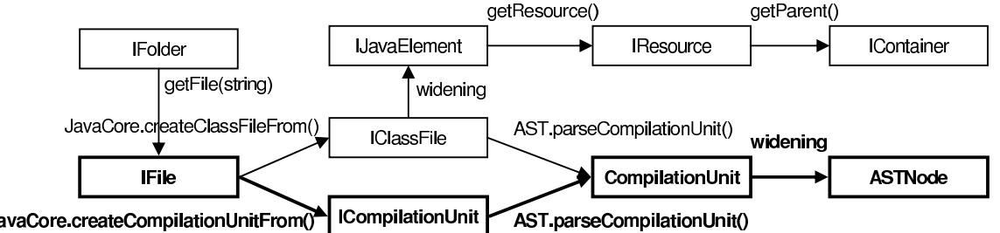
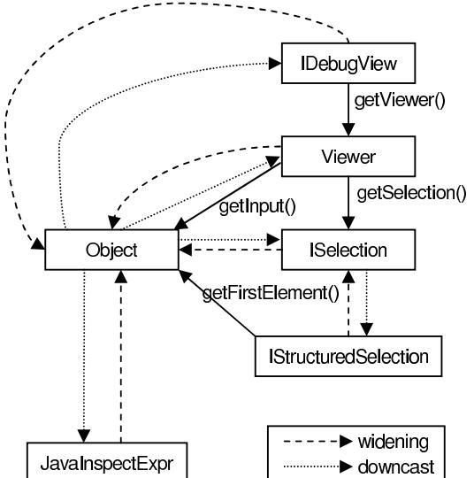
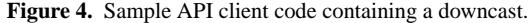
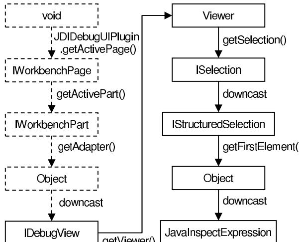
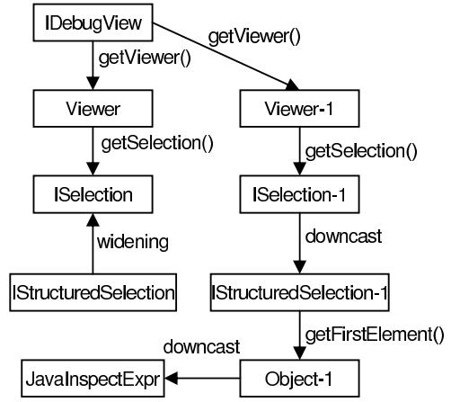
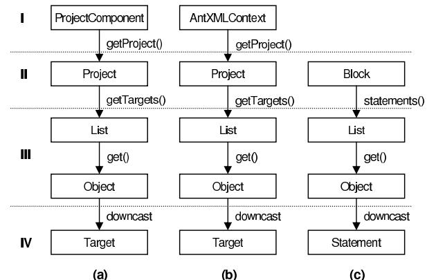
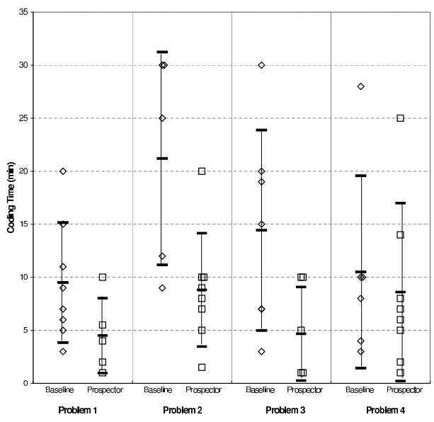

# **Jungloid Mining: Helping to Navigate the API Jungle** <sup>∗</sup>

David Mandelin Lin Xu Rastislav Bod´ık

University of California, Berkeley {mandelin,lin xu,bodik}@cs.berkeley.edu Doug Kimelman IBM Corporation dnk@us.ibm.com

# **Abstract**

Reuse of existing code from class libraries and frameworks is often difficult because APIs are complex and the client code required to use the APIs can be hard to write. We observed that a common scenario is that the programmer knows what type of object he needs, but does not know how to write the code to get the object.

In order to help programmers write API client code more easily, we developed techniques for synthesizing *jungloid* code fragments automatically given a simple query that describes that desired code in terms of input and output types. A jungloid is simply a unary expression; jungloids are simple, enabling synthesis, but are also versatile, covering many coding problems, and composable, combining to form more complex code fragments. We synthesize jungloids using both API method signatures and jungloids *mined* from a corpus of sample client programs.

We implemented a tool, PROSPECTOR, based on these techniques. PROSPECTOR is integrated with the Eclipse IDE code assistance feature, and it infers queries from context so there is no need for the programmer to write queries. We tested PROSPECTOR on a set of real programming problems involving APIs; PROSPECTOR found the desired solution for 18 of 20 problems. We also evaluated PROSPECTOR in a user study, finding that programmers solved programming problems more quickly and with more reuse when using PROSPECTOR than without PROSPECTOR.

*Categories and Subject Descriptors* D.2.6 [*Software Engineering*]: Programming Environments–Integrated Environments; D.2.13 [*Software Engineering*]: Reusable Software–Reuse Models; I.2.2 [*Artificial Intelligence*]: Automatic Programming– Program synthesis

*General Terms* Experimentation, Languages

*Keywords* reuse, program synthesis, mining

PLDI'05,June 12–15, 2005, Chicago, Illinois, USA.

# **1. Introduction**

When implementing common software features,such as HTML parsing, developers prefer to reuse existing libraries and frameworks. Unfortunately, the same features that make libraries potentially reusable tend to make library APIs difficult for programmers. The first feature is API size. For example, J2SE, the Java standard library, exposes a wide range of reusable components as thousands of classes with 21,000 methods, too many to learn or remember easily. The second feature is flexibility. In order to make libraries flexible while keeping them maintainable, designers package functionality as small composable units. Often the programmer must find and integrate several such units to use even basic features of the library.

Consider the programming task of parsing a Java source code file using the Eclipse IDE framework version 2.1, assuming the file is represented by an IFile object. Two of the authors encountered this problem independently, and in each case it took several hours to arrive at the desired code, which is shown here.

IFile file = ...; ICompilationUnit cu = JavaCore.createCompilationUnitFrom(file); ASTNode ast = AST.parseCompilationUnit(cu, false);

This example illustrates some of the difficulties programmers often encounter. First, a programmer unfamiliar with the framework would not think to look at class JavaCore, yet JavaCore is a crucial link: one of its static methods converts one type of file handle, IFile, to another, ICompilationUnit, that can be used by the parser. Second, the programmer may look for clues using the class browsing features provided by object-oriented IDEs, but that will not help here: the IDE can easily show members of IFile, but the first step is a static method of a different class. Finally, although a programmer might know that the result of parsing is an ASTNode, and might therefore grep for methods returning ASTNode, the method parseCompilationUnit would not be found because its return type is actually CompilationUnit, a subclass of ASTNode. Issuessuch asthese make it hard for programmers to write the code they need in order to use complex APIs.

To help programmers use APIs more easily and thus achieve more of the potential of reuse, we have developed techniques for synthesizing API client code automatically. As an application of these techniques, we have implemented PROSPECTOR, a tool that looks to the user like a programmer's "search engine" packaged inside Eclipse's "code completion" assistant. A programmer trying to write code for an API can express his needs to PROSPECTOR as a simple query, and PROSPECTOR will synthesize a list of candidate code snippets like the one above. These snippets refer to variables in the user's program,

<sup>∗</sup> This work is supported in part by the National Science Foundation, with grants CCF-0085949, CCR-0105721, CCR-0243657, CNS-0225610, CCR-0326577, an award from University of California MICRO program, the Okawa Research Award, as well as donations from IBM and Intel. This work has also been supported in part by the Defense Advanced Research Projects Agency (DARPA) under contract No. NBCHC020056. The views expressed herein are not necessarily those of DARPA or IBM.

Permission to make digital or hard copies of all or part of this work for personal or classroom use is granted without fee provided that copies are not made or distributed for profit or commercial advantage and that copies bear this notice and the full citation on the first page. To copy otherwise, to republish, to post on servers or to redistribute to lists, requires prior specific permission and/or a fee.

Copyright °c 2005 ACM 1-59593-080-9/05/0006. . . \$5.00.

and they are suitable for immediate insertion into the user's source code. Like familiar text search engines, PROSPECTOR does not guarantee that the results are exactly what the user wanted, but given a short list of examples from PROSPECTOR, it is not too difficult for the user to select a result and verify it manually. An experiment found that PROSPECTOR was able to answer 18 of 20 queries derived from real problems, and in each case, the user found the answer to the original programming problem after looking at fewer than 5 code snippets.

For the synthesis results to be accurate, the query language must be specific, but it must also let the programmer express her needs easily and naturally, otherwise writing the queries will be more effort than writing the code by hand. For example, describing parsing exactly is almost as much effort as writing a parser, and requires much more text than the code to be generated. In our query language, which balances specificity with ease of use, a query is a pair (τin, τout), where τin and τout are class types. An answer to the query is a synthesized code snippet that takes a single input object of type τin and returns a single output object of type τout. Code snippets that satisfy these queries solve many programming problems involving reuse, as we will explain later. In our parsing example, once the programmer learns that ASTs are represented by ASTNode objects, she can describe parsing a file with the query (IFile, ASTNode). Many programming problems, especially those arising during reuse attempts, can be expressed fairly naturally as a query of thisform, including but not limited to converting between data representations, traversing object schemas, and finding replacements for code containing deprecated methods.

Note that a query expresses only a part of the programmer's intent, so some code snippets that satisfy the query may not solve the programmer's problem. Most classes are specific enough so that the results match the programmer's intent, but some classes have multiple meanings. For example, if the user has a String representing the name of a Java source code file he wants to parse, he might run the query (String, ASTNode), which describes the desired code, but also describes code that parses Java source contained in a String. However, the programmer can easily find the desired result in a short list, and this is much easier than writing a query that describes the desired result exactly.

Some programming problems that are not directly expressible in our query language can still be reduced to one or more queries. In particular, the programmer may know only that he needs an object of type τout. For example, a programmer writing a GUI may need the active window, which is represented by a Shell object, without knowing or caring what input object to use. We reduce this problem to our base problem by collecting the set of types of objects lexically visible at the current point, {τ0,. .. , τk}, and generating queries (τ1, τout),. . .,(τk, τout). This reduction is especially useful because it allows PROSPECTOR to be integrated with code completion. Code completion is a feature supported by many IDEs that the user can invoke while typing to view a list of suggestions and insert a selected suggestion automatically. For example, if the programmer invokes code completion just after typing the text myList., code completion will show a list of members of myList. With PROSPECTOR, when the user is typing code that requires a value of a certain type, e.g., when the cursor is on the right-hand side of an assignment, code completion suggests complete code snippets for computing the value, so there is no need for the user to even know that there is a query language.

Having described our query language, we now turn our attention to the code snippets we synthesize in response to queries. The desired answer to a query could use almost any features of the programming language, but we have found that the answer often has a single input object and a single output object, with a chain of intervening objects obtained with method calls. We call this kind of code snippet a jungloid.<sup>1</sup> When programmers get stuck writing API client code, the desired code is often a jungloid: an informal study of 16 cases where a programmer got stuck attempting reuse found that in 9 cases the desired code was a jungloid, and in 3 others the desired code could be decomposed into multiple jungloids.

Not only do jungloids cover many problems, but their simple form makes synthesizing them easy. Observe that the basic expressions that form jungloids are unary expressions, such as calls to unary methods. The set of such basic expressions supported by an API can be derived from its signatures.<sup>2</sup> A directed graph can then be formed, in which each class is represented by a node, and each basic expression is represented by an edge from its input type to its output type. Thus, every jungloid supported by the API is represented as a path in the graph. We find jungloids in response to a query (τin, τout) by searching the graph for paths from τin to τout. Because there can be many paths, we rank the jungloids using a heuristic, placing jungloids more likely to be wanted by the programmer at the top of the list. This list is presented to the user, who selects the desired jungloid, which is then inserted into the user's code.

However, some jungloids cannot be synthesized using signatures alone because they contain features not precisely described by the static type system, such as downcasts. Here is an example, which retrieves an IResource object representing a file selected by the user in the Eclipse GUI:

```
SelectionChangedEvent event = ...
IStructuredSelection sel =
  (IStructuredSelection) event.getSelection();
IResource res = (IResource) sel.getFirstElement();
```
The type of the value returned by getFirstElement() is determined at run time by a configuration file, so the method signature must declare return type Object. In order to use the returned value, the programmer must provide its type in the form of a downcast.<sup>3</sup>

Because signatures do not contain enough information about which downcasts are legal at run time, we turn to another source of information: examples. Existing API client code contains many examples of using downcasts correctly. Thus, we can mine a corpus of working code for snippets containing downcasts and expect these snippets to function properly if inserted into other programs. In fact, finding and copying ex-

<sup>1</sup> A jungloid consists of just the chain of objects and method calls you need to get from something you have (e.g. an IFile) to something you need (e.g. an ASTNode), like a monkey swinging from vine to vine through the jungle.

<sup>2</sup> We use the term more generally here to refer to all the elements of the static type system: method signatures, field declarations, and class hierarchy declarations.

<sup>3</sup> Because the type is determined at run time, unless Eclipse is substantially redesigned, the cast in this example would be required even with Java 5 Generics.

amples is a common coding technique used by programmers even for APIs that do not require downcasts. Unfortunately, programmers often find examples hard to understand and make errors adapting the example to their own code, because examples in real code are often woven together with other code and spread across multiple methods and files. Our automatic techniques do not suffer from these problems, because we convert examples to jungloids, which are simple, concise summaries of API usages.

However, a collection of example jungloids by itself does not provide enough information to answer many jungloid queries. First, simply searching a collection of examples for references to τin and τout would miss a relevant example that yields a subclass of τout. Second, examples are often too short, showing only a part of the task. Consider our parsing query (IFile, ASTNode): if all the available examples of calling parseCompilationUnit() take ICompilationUnit as input instead of IFile, then even if searching finds examples, they will not show how to solve the problem completely.

We have seen two ways of discovering jungloids, synthesizing from signatures and searching for examples, each of which has unique advantages. Signatures can be used to form a simple representation of all jungloids that type check, but they provide little information about how downcasts behave at run time. Examples allow us to find downcasts that are likely to pass run-time type checking, but an example is often only a partial solution to a reuse problem. In order to combine these advantages, we have developed a common representation that allows efficient, precise query processing, the *jungloid graph*. Signatures are represented as explained earlier, in a directed graph where the nodes are types and edges are expressions derived from signatures. Examples are extracted from their context as jungloids, converted to paths, and added to the graph. The result is a graph with refined types, which indicate more accurately which downcasts will succeed at run time. We can run the same search and ranking algorithms developed for the signature graph on the jungloid graph to synthesize jungloids from signatures and any number of examples.

We can even synthesize code snippets that are more general than jungloids, in particular snippets that call methods with more than one input. Such code snippets can be built up from several jungloids, each synthesized in response to a separate user query. A typical scenario is that the first query returns a jungloid in which the second argument of a method has not been synthesized. We can generate such a jungloid simply by pretending during synthesis that multi-input methods have only one input. To complete the code, the user simply issues another query with the type of the second argument as τout.

Finally, we tested whether programmers are able to reuse code more effectively with PROSPECTOR. We asked programmers to complete four programming problems that could be solved by reuse, solving two problems with PROSPECTOR and two without. We found that, on average, programmers using PROSPECTOR solved the problems twice as fast as the baseline programmers. We also found that when programmers had PROSPECTOR they solved the problems by reuse, but without PROSPECTOR they often resorted to reimplementation. Thus, PROSPECTOR helps programmers solve problems faster while writing better code.

The main contributions of this work are as follows:

- We designed an easy-to-use, yet sufficiently specific, query language for describing object-oriented API client code, and identified an easily synthesized kind of query result, jungloids.
- We developed a representation for combining two sources of information about API usage, signatures and examples, along with algorithms that operate on this representation to synthesize jungloids from queries.
- We constructed PROSPECTOR, a practical Eclipse plugin tool based on these ideas. We performed a user study that found that programmers can solve reuse problems twice as fast with PROSPECTOR then without. PROSPECTOR is available for download at:

#### www.cs.berkeley.edu/~mandelin/prospector

The rest of this paper is organized as follows. Section 2 presents definitions of our terms and the jungloid synthesis problem. Section 3 describes our solution based on the signature graph to the jungloid synthesis problem for jungloids that do not contain downcasts. Section 3 also explains how we rank jungloids to make it easier for the user to find the desired solution. Section 4 explains how to synthesize jungloids that contain downcasts using jungloid mining. Section 5 describes the implementation of PROSPECTOR. Section 6 describes the design of our experiments, and Section 7 lists and discusses the results. Section 8 surveys related work and Section 9 concludes the paper.

# **2. The Jungloid Synthesis Problem**

This section defines the jungloid synthesis problem formally. We begin with definitions of queries, jungloids and the search problem. Then, we present a real programming problem and show how queries and jungloids are used to solve the problem.

#### **2.1 Definitions**

We start by defining the query that acts as a partial specification of the jungloid to be synthesized.

DEFINITION 1. *A jungloid query is a pair* (τin, τout)*, where* τin *and* τout *are class types.*<sup>4</sup>

Jungloids are formed by composing elementary jungloids, defined as follows.

DEFINITION 2. *An elementary jungloid is a typed unary elementary expression* λx . e : τin → τout*, where* τin *and* τout *are class types.*

Elementary jungloids may contain free variables. Free variables cannot be bound during jungloid synthesis; they can be bound only after the jungloid is inserted into user code. Because free variables are not used for synthesis, we allow them to be of any type, including primitive types.

For Java, we define six kinds of elementary jungloids.

• **Field Access.** If class T declares a field of type U, U f, then there is an elementary jungloid λx . x.f : T → U.

<sup>4</sup> In our Java implementation, τin and τout may be any reference type, which includes class, interface, and array types. The only types we exclude are primitive types such as int, which could represent anything from an array bound to a cryptographic key.

• **Static method or constructor invocation.** If class C declares a static method (or constructor) with at least one class-typed parameter, U m(...,T a,...), then there is an elementary jungloid λx . C.m(..., x, ...) : T → U. The other parameters are free variables. There is one elementary jungloid for each class-typed parameter of m().

If class C declares a static method (or constructor) with no parameters, T m(), there is an elementary jungloid λx . C.m() : void → T. Using void in this way extends jungloids to cover expressions with no input values, such as constructor invocations with no arguments.

- **Instance method invocation.** Instance methods are handled like static methods, with the receiver treated as another parameter. For example, if there is an instance method U T.m(), then there is an elementary jungloid λx . x.m() : T → U.
- **Widening reference conversion.** In Java, a widening reference conversion (henceforth *widening*) is a conversion from a reference type T to one of its supertypes. Widening has no syntax; the compiler inserts widening conversions automatically as needed for method and constructor arguments. We use a widening elementary jungloid to connect a jungloid that outputs a T to a jungloid that inputs a supertype of T.

If T is a subtype of U (T extends U or T implements U), then there is an widening elementary jungloid λx . x : T → U.

• **Downcast.**<sup>5</sup> If U is a subtype of T, then there is an elementary jungloid λx . (U) x : T → U.

DEFINITION 3. *A jungloid is a well-typed composition of elementary jungloids.* Well-typed *means that the output type of each elementary jungloid (except the outermost) is the same as the input type of the elementary jungloid it is composed with.*

DEFINITION 4. *A solution jungloid for the query* (τin, τout) *is a jungloid* λx.e : τin′ → τout′ *such that* τin′ = τin *and* τout′ = τout*.*

The jungloid synthesis problem is the problem of finding solution jungloids for queries. Our solution to the search problem is described in Sections 3 and 4. Also, Section 3.2 describes techniques for ranking jungloids, with the goal of identifying solution jungloids that are likely to satisfy the aspects of the user's intent not expressed in the query.

#### **2.2 Programming with Jungloids**

We will illustrate the preceding definitions on a simplified version of Eclipse FAQ 270 [3], a common problem in practice. Eclipse JDT is an extensible Java IDE with a complex API, with which developers can create visual editors for different kinds of programs and data. New developers are often stumped by the question "How do I manipulate the data in my visual editor?"

The first step is to learn that the visual aspects of the editor are represented by an IEditorPart object and the underlying data is manipulated through an IDocumentationProvider object. A programmer can find this out by searching documentation and class libraries. (Finding these classes is an important part of answering the question, and has been addressed by prior work, such as CodeBroker [16]. In this paper, we focus on the problem of synthesizing the code to coordinate these classes, once the classes are known.)

Given the class names, the developer can refine the question to: "What code takes an IEditorPart as input and returns an IDocumentationProvider object that represents the data contained in the editor?" The query

(IEditorPart, IDocumentationProvider)

expresses this question, but only partially, because the query does not describe the desired semantic relationship between the objects.

We can build up one of the solution jungloids for the query by composing the following two elementary jungloids, which is legal because the output type of the first is the same as the input type of the second.

- 1. λx. x .getEditorInput() :
	- IEditorPart → IEditorInput
- 2. λx. dpreg.getDocumentProvider(x ) :

IEditorInput → IDocumentProvider

Here is the solution jungloid, which contains a free variable, dpreg:

```
λx. dpreg.getDocumentProvider(x.getEditorInput()):
IEditorPart → IDocumentProvider
```
Assuming that the user has declared a variable named ep of type IEditorPart for the input object, we would translate the solution jungloid to the following Java code:

IEditorInput inp = ep.getEditorInput(); DocumentProviderRegistry dpreg; // free variable IDocumentProvider dp = dpreg.getDocumentProvider(inp);

We generated a variable declaration for the free variable so that the user knows he needs to create another object. The best way to do this is with a query that expresses the output type only, because the user does not necessarily know from what values the object should be computed. As mentioned in the introduction, such a query can be reduced to jungloid queries by using the types of lexically visible objects as input types. Assuming there are no other declarations, the visible objects are IEditorPart ep and IEditorInput inp. The resulting jungloid queries are:

(IEditorPart, DocumentProviderRegistry)

```
(IEditorInput, DocumentProviderRegistry)
```
(void, DocumentProviderRegistry)

We include void so that if none of the visible objects can be used to compute a DocumentProviderRegistry, we can try to compute one from constructors and static methods. In fact, the first two queries have no solution jungloids, and the void query is the one that returns the desired jungloid:

λx. DocumentProviderRegistry.getDefault() : void → DocumentProviderRegistry

Translating this jungloid to Java finishes the problem:

```
IEditorInput inp = ep.getEditorInput();
DocumentProviderRegistry dpreg =
  DocumentProviderRegistry.getDefault();
IDocumentProvider dp = dpreg.getDocumentProvider(inp);
```
<sup>5</sup> The Java specification calls downcasts *narrowing reference conversions*, but this paper uses the more familiar term *downcast*.

Thus, we have seen how a difficult programming problem can be decomposed into two jungloid queries, and how the solution jungloids for the queries can be used to generate the required Java code. In the next section, we describe how to synthesize solution jungloids for queries.

# **3. Finding Jungloids Using Signatures**

In this section, we describe how to find solution jungloids that do not contain downcasts. Our techniques use API signatures only; we make no use of method implementations or client code. In the first part, we describe the signature graph, a representation of the jungloids of an API constructed from its signatures, and how it is used to find solution jungloids. In the second part, we explain why some solution jungloids are better than others and describe ranking a heuristic for identifying the best jungloids.

#### **3.1 The Signature Graph**

The class declarations, field declarations, and method signatures of an API determine the set of elementary jungloids provided by the API. (See Section 2.1.) In turn, these elementary jungloids determine the complete set of jungloids that may be written using the API. We represent this set of jungloids using the *signature graph*. The nodes of the signature graph are the class types declared by the API (including array types that appear in declarations). The edges represent the elementary jungloids of the API: for each non-downcast elementary jungloid λx . e : T → U there is a labeled edge (T,U, λx.e).

Figure 1 shows a small part of the signature graph constructed from the Java standard libraries and the Eclipse API, including the jungloid used in our parsing example from Section 1.

The set of solution jungloids for the query (τin, τout) corresponds exactly to the set of paths from τin to τout. Thus, solution jungloids can be enumerated by standard graph search algorithms. Note that there may be infinitely many paths from (τin, τout), but all the desired solution jungloids we have observed so far are acyclic,so we limit our search to acyclic paths, which are finite in number.

#### **3.2 Ranking Jungloids**

In general, a query has multiple solution jungloids, and not all of these jungloids are equally desirable for the user. First, instead of returning a value of the requested type, some solution jungloids return a null value or throw an exception. This is because some API methods require state properties of their arguments that are not expressed by their types, e.g., that field foo is non-null. Second, some jungloids return a value of the requested type, but the relation between input and output does not satisfy the programmer's intent. For example, if a programmer wants to parse code stored in a named file, he might issue the query (String, ASTNode), but a solution jungloid may parse code stored in the string itself. Finally, among jungloids that do satisfy the user's intent, some are simpler, more efficient, or more concise than others. Ideally, we want to show the programmer the simplest jungloid that satisfies his intent.

We cannot evaluate how well a jungloid satisfies the user's intent using Java types, so we will show the jungloids to the user and ask him to select one. Unfortunately, some queries have too many jungloids to examine by hand (in the worst case, factorially many in the size of the signature graph). This situation is similar to that encountered by a text search engine, which can find millions of documents in response to a query. Search engines solve this problem by ranking the documents according to their likelihood of being relevant to the user's original question. Similarly, we rank jungloids, with the goal of minimizing the number of jungloids the programmer must examine before finding the desired one.

Because user intent is hard to analyze, our ranking relies on a heuristic: ordering jungloids by length, assigning the top ranks to the shortest jungloids. Although simple, this heuristic is very effective, for several reasons. First, between two jungloids that satisfy the user's intent, the more concise one is preferred. Second, a shorter jungloid is less likely to fail by throwing an exception or returning a null value: if we assume that each elementary jungloid fails with fixed probability p, then a shorter jungloid has a lower probability of failing. Finally, shorter jungloids are more likely to satisfy the programmer's intent. In particular, a programmer would not be able to understand a jungloid with too many method calls, and thus would never intend to write such a jungloid. Also, we conjecture that well-designed libraries allow programmers to express common tasks with concise code.

Experience backs this conjecture: In an informal test of an early prototype of PROSPECTOR that returned an arbitrarily chosen shortest jungloid, the result satisfied the programmer's intent in 9 trials out of 10. Thus, finding a single shortest path in the signature graph is an effective, practical algorithm for finding a single solution jungloid. However, we use the more effective approach of presenting several jungloids sorted in length order. The programmer can examine each one in turn, and will most likely find the desired jungloid after looking at a small number (see our experimental results in Section 7).

Note that we do not count widening elementary jungloids in computing the length. Widening has no syntax, so it does not increase code size or complexity for the programmer. Also, widening never throws an exception.

Jungloid length does not apply directly to jungloids with free variables because they are not complete programming solutions: more code must be generated to compute the values of the free variables, making a larger code snippet. The length heuristic must be extended to account for this; the proper extension seems to be to estimate the total number of elementary jungloids in the complete code snippet. Our current implementation assumes that each free variable will require a jungloid of size two, because with this value ranking appears to perform well empirically. More precise, systematic estimation is left for future work.

For a few queries, there are many shortest jungloids, and some are simpler than others. For example, a programmer who wants to read lines from a file may issue the query (FileInputStream, BufferedReader), which has 20 shortest jungloids, including the following:

- new java.io.BufferedReader( new java.io.InputStreamReader(in))
- new org.apache.lucene.demo.html.HTMLParser(in) .getReader()

Both of these perform as desired, but the first one is the standard programming idiom, while the second one does more than what was intended and has software-engineering disadvantages. Generalizing from this and other examples, we inferred that jungloids that cross many Java package boundaries



**Figure 1.** Part of the signature graph. The jungloid for our parsing example is shown in bold face. Widening edges, such as the one from IClassFile to IJavaElement, allow the graph to represent jungloids that use inheritance, such as classFile.getResource().

are less likely to be useful, and we refined our heuristic so that it ranks jungloids of equal length according to the number of package boundaries they cross.

Another observation we made is that a jungloid that returns a subclass of the type the user requested may also perform more than was asked for. For example, say that the programmer wants a jungloid that returns the active Eclipse visual editor, so she specifies IEditorPart as the output type. A jungloid that returns an XMLEditor would be too specific, assuming that if the programmer wanted an XML editor specifically she would have asked for it. Therefore, for jungloids of equal length, we assign a higher rank to the one that returns the more general output type.

Our heuristic is efficient and easy to implement. It is also effective; usually the top-ranked jungloids return a non-null value without throwing an exception when inserted into the user's code. A major limitation is that although the heuristic rules out very long jungloids that would never satisfy the user's intent, it ranks shorter, more reasonable jungloids arbitrarily. Consider the (String, ASTNode) example from the beginning of this section: parsing code from a named file and parsing code in the string are both reasonable. The heuristic favors the latter because its code happens to be shorter. Fortunately, there are usually not too many reasonable jungloids. Experimentally, we have found that a programmer using the search tool implemented with the signature graph and this heuristic can find useful jungloids quickly, usually after examining fewer than five jungloids (see Section 7).

# **4. Refining the signature graph with examples**

In this section, we expand our solution to cover jungloids with downcasts. First, we discuss why the signature graph is not effective for finding jungloids with downcasts. Next, we describe our solution, which is based on jungloid mining. Finally, we discuss the accuracy and limitations of jungloid mining.

#### **4.1 Jungloids containing downcasts**

Some APIs require the user to write client code containing downcasts. Such code is particularly hard to write manually or to synthesize, because the library signatures do not document which downcasts are legal. Thus, we excluded downcast elementary jungloids from the signature graph.

Including downcast elementary jungloids in the signature graph is not a practical way of synthesizing jungloids with downcasts. The resulting graph would represent all jungloids with downcasts, but most of these jungloids are

```
IDebugView debugger = ...;
Viewer viewer = debugger.getViewer();
IStructuredSelection sel =
  (IStructuredSelection) viewer.getSelection();
JavaInspectExpression expr =
  (JavaInspectExpression) sel.getFirstElement();
```
**Figure 2.** A jungloid containing downcasts, which cannot be synthesized from the signature graph.

not useful to a programmer because they always throw ClassCastException. Consider class Object: Every class T is a subclass of Object, so for every T there is a downcast elementary jungloid λx . (T) x : Object → T. Thus, for every method foo declared to return Object, there are jungloids casting the result of foo to every class T, while usually there are only a few different classes that foo can return. These jungloids are particularly bad because they are short, so they are favored by the ranking heuristic.

We cannot simply give up on synthesizing jungloids with downcasts because downcasts are important in many APIs. Many existing APIs require downcasts because they use legacy collections instead of Java 5 Generics. Also, APIs for especially complex systems such as Eclipse will continue to require downcasts, because they use design features (e.g. creating objects dynamically through reflection instead of with a call to a statically typed constructor) that cannot be described exactly even by Java 5 parameterized types.

Figure 2 shows an example of a jungloid containing a downcast taken from Eclipse code. This jungloid gets the watch expression currently selected in the GUI of the Java debugger. A programmer trying to write this jungloid by hand would run into difficulty right away because the class representing the debugger, IDebugView, has no methods for getting the selection. Browsing methods manually, he might find the jungloid getViewer().getSelection(), but this jungloid returns an ISelection object, which has no Javadoc documentation and only a single method, getEmpty(). ISelection appears to be a dead end, although a cast, a method call, and another cast will complete the desired jungloid.

Figure 3 shows what happens if we try to represent the jungloid in Figure 2 by adding all downcast elementary jungloids to the signature graph. The resulting graph represents our jungloid, but also many short, useless jungloids, such as this one:

```
(JavaInspectExpression)
  debugger.getViewer().getInput()
```


**Figure 3.** Part of the signature graph with all downcast elementary jungloids added. This represents many undesired jungloids, such as those casting any object to JavaInspectExpression.

We call such a jungloid *inviable*, by which we mean that it always either throws an exception or returns null. A jungloid is *viable* if there is at least one environment (i.e., combination of global program state and input values) that makes the jungloid return normally, which means it has the possibility of satisfying the programmer's intent. In order to obtain useful search results, we must solve the problem of adding as many viable jungloids containing downcasts to the graph as possible, while adding only a few inviable jungloids.

#### **4.2 Jungloid mining**

Our solution is based on the observation that jungloids previously written by programmers in well-tested programs are almost always viable. This suggests that we can learn a set of viable jungloids containing casts from a set of example programs. We call this approach *jungloid mining* because it learns from a *corpus* of example programs rather than analyzing the API implementation directly.

*Extracting Jungloids.* The key idea behind extracting jungloids containing downcasts from a corpus is that there are certain sequences of calls that establish the state in which the downcast will succeed, and the corpus contains examples of these sequences, which we call *example jungloids*. For example, most Objects cannot be downcast to JavaInspectExpression, but an Object obtained by the jungloid in Figure 2 can. Figure 4 shows part of an Eclipse corpus method (from production code) containing this jungloid.

Note that we do not need to extract all jungloids containing downcasts, only those that end in downcasts. We assume that an object that is successfully downcast can be used like any other object of the same type, so calls after the downcast can be synthesized from the signature graph.

Our implementation extracts a superset approximation of the example jungloids ending in casts that the corpus can execute given any input. The algorithm is closely related to

```
protected IJavaObject getObjectContext() {
  IWorkbenchPage page= JDIDebugUIPlugin.getActivePage();
  IWorkbenchPart activePart= page.getActivePart();
  IDebugView view = (IDebugView)
    activePart.getAdapter(IDebugView.class);
  ISelection s = view.getViewer().getSelection();
  IStructuredSelection sel =
    (IStructuredSelection) s;
  Object selection = sel.getFirstElement();
    JavaInspectExpression var =
      (JavaInspectExpression) selection;
  ...
}
```


slicing: for each cast, we take a backward, interprocedural, flow-insensitive slice using a conservative approximation of the call graph based on the type hierarchy. Then, we follow each acyclic data-flow path going backward from the cast until it reaches a zero-argument expression (such as a constructor call), collecting the sequence of elementary jungloids as an example jungloid.

Note that call sites in the slice can be interpreted in two ways. First, a call can be interpreted as an elementary jungloid connecting its input to its output. Alternatively, a call can be interpreted as transferring data flow, effectively inlining the method body at the call site. An example will illustrate this:

| C clientMethod1() { | B a2b(A a) {     |
|---------------------|------------------|
| A a = new A();      | G g = a.getG();  |
| B b = a2b(a);       | return new B(g); |
| return (C) b;       | }                |
| }                   |                  |

Using the two different interpretations, we extract:

- (C) a2b(new A()) // a2b as elementary jungloid
- (C) new B(new A().getG()) // inlining a2b

We treat API methods as elementary jungloids, and if method implementations are available, we inline them as well. Client methods are always inlined, because they are not elementary jungloids (only API methods are).

Note that the number of example jungloids extracted for a given cast may be very large. The backward data-flow path branches when it reaches either a variable that is assigned into multiple places or an elementary jungloid with multiple arguments. The path also branches when we apply both interpretations to an API method call. In some client methods, branching causes extraction to take many hours and generate several gigabytes of example jungloids. Our implementation avoids this by stopping after a defined maximum number of example jungloids is extracted for a given cast expression in the corpus. Fortunately, this happens for only a small fraction of the downcasts in the corpus, and the maximum number is a reasonable sample of examples reaching a cast.

*Adding jungloids to the graph.* Once we have extracted a set of example jungloids, we transform the signature graph to represent the examples, so they can be used in synthesis. For each example jungloid λx . (U)e : T → U, we create a new path connecting existing nodes T and U, but creating fresh nodes for all intermediate objects in the example jungloid. The new nodes represent typestates [12] in which casts or jungloids end-



**Figure 5.** An example jungloid extracted from the code in Figure 4. Only the part drawn in solid lines is necessary for the final downcast to succeed; our generalization algorithm removes the dashed part.



**Figure 6.** Part of the jungloid graph, showing the example jungloid from Figure 5.

ing with casts will complete without throwing cast exceptions. The transformed graph, called the *jungloid graph*, represents all jungloids that can be formed by composing jungloids in the signature graph and any number of example jungloids.

Figure 6 shows part of the jungloid graph, including the path for the example jungloid in Figure 5. Notice that if we had not created the new node Object-1, the jungloid graph would represent jungloids casting any Object to JavaInspectExpression; most of these jungloids are inviable, and the example does not suggest that they are viable. Note also that instead of adding the entire example, we added only the suffix necessary for the final downcast to succeed; we will explain later in this section how to identify the necessary suffix.

*Generalizing example jungloids.* As Figure 5 hints, example jungloids often contain more elementary jungloids than needed, making them less effective for synthesizing jungloids.



**Figure 7.** Example jungloids with unneeded prefixes, shown with dashed lines. The list returned by Project.getTargets() contains Target objects, regardless of the methods called to obtain the Project.

The entire jungloid in Figure 5 is not necessary to make the downcasts succeed: we need only the *suffix jungloid* starting with IDebugView. The suffix jungloid can be composed with any other jungloid that returns an IDebugView,so it represents not only the example jungloid, but also the set of jungloids produced by composing the suffix with other viable jungloids. Thus, the suffix is more general than the original example jungloid, and we will be able to synthesize more viable jungloids if we apply a transformation that generalizes our example jungloids.

However, we must take care not to overgeneralize to a suffix that represents inviable jungloids. Consider the extreme case of generalizing to a suffix consisting of a single elementary jungloid, the final downcast: this suffix represents all jungloids containing that downcast, most of which are inviable, as discussed in Section 4.1. Note that generalization is not the only source of inviable jungloids (e.g., one of the original examples might be inviable because of a bug in the corpus), but we do not want generalization to introduce more inviable jungloids. Thus, we define the goal of generalizing an example jungloid J as finding the shortest suffix that does not represent inviable jungloids (other than inviable jungloids represented by J).

We have devised an algorithm that approximates generalization given a set of examples. The algorithm is based on our notion that the jungloid before the downcast determines which downcasts may succeed: thus, we find the shortest suffix that is sufficient to distinguish an example jungloid from other example jungloids that end in different casts. Consider Figure 7. Since jungloids (b) and (c) end in different casts, we must keep a long enough suffix to distinguish them. The parts of the jungloids in area III of the figure match exactly, so we must retain area II and everything after it, but we do not need area I.

The rule followed by the algorithm is as follows: If there are two example jungloids β.a.α.(T) and γ.b.α.(U) where a 6= b and T 6= U, then we must retain a.α.(T) and b.α.(U) (a, b are elementary jungloids, α, β, γ are jungloids, and T,U are types, and (T) is a downcast elementary jungloid). The algorithm finds the shortest suffix that obeys all constraints. We implement this algorithm in time O(nk), where n is the number of elementary jungloids in the example set and k is the number of types that appear in casts, by storing examples in a trie and removing subtries all of whose examples end in the same casts.

In the remainder of this subsection, we formally define the set of jungloids represented by an example jungloid and from this definition deduce the conditionsrequired to guarantee that a suffix truly is a generalization of the original example. Specifically, we show that if we form the jungloid graph from the signature graph and some suffix of every example jungloid, each suffix represents all of the jungloids represented by the example it was derived from and is thus a generalization.

For brevity, we write jungloids as sequences, with variables a, b, c ranging over elementary jungloids, α, β, γ, δ over jungloids, and S, T,U over classes. A downcast elementary jungloid is written (T). The composition that feeds the output of jungloid α to the input of jungloid β is written α.β. The input type of a jungloid α is denoted in(α), and the output type is denoted out(α).

First, we define the set of jungloids represented by an example jungloid, which is simply the set of jungloids formed by composing the example jungloid with another jungloid. To make this definition precise, we must specify the set of jungloids that can be composed with the example. For now, simply let the set be an arbitrary set E, and define the set of jungloids represented by an example jungloid J as:

$$\operatorname{rep}\_{\mathfrak{C}}(J) \quad \stackrel{\text{def}}{=} \{ \delta J \mid \delta \in \mathcal{E} \text{ and } out(\delta) = in(J) \}.$$

Now can define *generalization*: J ′ is a generalization of J if rep<sup>E</sup> (J ′ ) ⊇ rep<sup>E</sup> (J).

Now, we will determine the conditions under which a suffix J' is a generalization of J by trying to show that rep<sup>E</sup> (J ′ ) ⊇ rep<sup>E</sup> (J) in the process discovering what conditions are required to finish the argument. Let J be an example jungloid ending in a cast and J ′ a non-empty suffix of J, so that J = α.β.(U) and J ′ = β.(U). Substituting the expressions for J and J ′ into the definition of rep<sup>E</sup> , we have:

$$\begin{array}{rcl}rep\_{\mathcal{E}}(J) &=& \{\delta.\alpha.\beta.(U) \mid \delta \in \mathcal{E} \text{ and } out(\delta) = in(\alpha)\} \\rep\_{\mathcal{E}}(J') &=& \{\delta.\beta.(U) \mid \delta \in \mathcal{E} \text{ and } out(\delta) = in(\beta)\} \end{array}$$

Consider any δ.α.β.(U) ∈ rep<sup>E</sup> (J). To show that δ.α.β.(U) ∈ rep<sup>E</sup> (J ′ ), we must show (*i*) out(δ.α) = in(β) and (*ii*) δ.α ∈ E. For (*i*), observe that α.β is a jungloid, so out(α) = in(β) and thus out(δ.α) = in(β) as well. If we can also show (*ii*), then δ.α.β.(U) ∈ rep<sup>E</sup> (J), and therefore rep<sup>E</sup> (J ′ ) ⊇ rep<sup>E</sup> (J). To complete this argument, we need only to show (*ii*) δ.α ∈ E. Because we know little about about α and E, we will need to introduce some additional assumptions.

We can gain some insight about these assumptions by reasoning at the level of the original jungloid generalization problem: informally, we are simply trying to ensure that there is a jungloid in E that can be composed with J ′ to form J, so that we do not lose any jungloids by using J ′ instead. First, consider the simplest case, where J contains no downcasts other than the one at the end. In this case, we can form J by composing J ′ with a jungloid in the signature graph. We can state this more generally: assuming that E contains all jungloids represented by the signature graph, if α (from above) contains no downcasts, then δ.α contains no downcasts, δ.α is represented by the signature graph, and δ.α ∈ E. Thus, if we restrict our generalization so that J ′ contains all the downcasts in J (so that α contains no downcasts), then J ′ is a generalization of J if E contains all jungloids represented by the signature graph.

Now, consider the case where α contains a downcast. Then α is not contained by the signature graph, so we must try to cover α using other example jungloids. Because our example jungloids end in downcasts, we break down α as α = α1.(V ).α<sup>2</sup> such that α<sup>2</sup> has no casts, so α<sup>2</sup> is represented by the signature graph. α1.(V ) ends in a cast, and our example jungloid extraction finds jungloids going backward from every cast in the corpus, so our set of example jungloids must contain α1.(V ). Now, we are trying to show that δ.α1.(V ).α<sup>2</sup> ∈ E, where δ ∈ E, α1.(V ) is in our set of example jungloids, and α<sup>2</sup> is in the signature graph. Thus, J ′ is guaranteed to be a generalization of J if E contains the jungloids in the signature graph and the extracted example jungloids and is closed under composition, i.e., if γ<sup>1</sup> ∈ E, γ<sup>2</sup> ∈ E, and out(γ1) = in(γ2), then γ1.γ<sup>2</sup> ∈ E.

This is not quite the condition we want because we generalize all example jungloids, so the E we actually use contains the jungloids in the signature graph and some suffix of every example jungloid, and is closed under composition. However, this E is sufficient as well, because we can show that for α ∈ E for any example jungloid J = α.β by strong induction on the number of casts in α. In the base case, α has no casts, so α is in the signature graph, and thus α ∈ E. In the inductive case, α has n + 1 casts. Write α = α1.(V ).α2, where α<sup>2</sup> has no casts. Now, α1.(V ) was extracted from the corpus as part of α, and we extract example jungloids from every cast in the corpus, so our set of examples contains α1.(V ) as well. Because E contains some suffix of this example, we can write α1.(V ) = α ′ 1 .γ.(V ) where γ.(V ) ∈ E. The number of casts in α ′ 1 is at most n, so by the inductive hypothesis, α ′ <sup>1</sup> ∈ E. As already stated, γ.(V ) ∈ E, and α<sup>2</sup> ∈ E because α<sup>2</sup> has no casts. Therefore, α = α ′ 1 .γ.(V ).α<sup>2</sup> ∈ E.

#### **4.3 Other applications of jungloid mining**

Downcasts are not the only API feature that cannot be handled well by the signature graph. In particular, for methods with input arguments of type Object or String, usually not any Object or String is acceptable. For example, some methods in Eclipse take as input *model classes*, which are classes that represent data underlying a visual component, such as a class hierarchy browser. To make the interface more flexible, Eclipse allows model classes to be of any type, so the method parameters are declared as Object. Thus, although the declaration suggests that any object may be used as input, we would like to synthesize only jungloids that use objects of appropriate model classes as input. Many String method parameters have similar restrictions, e.g., the string should be a URL. As a result, many jungloids that call methods with Object or String parameters are inviable.

We believe that jungloid mining can be used to find viable jungloids that end by calling these methods, although we have not tested this application of jungloid mining. The algorithms would be the same, with methods having Object or String parameters playing the role of downcasts.

#### **4.4 Accuracy of jungloid mining**

This section discusses the accuracy of mining-based jungloid synthesis. We have two desired accuracy properties. First, we want jungloid synthesis to be complete, by which we mean that any viable jungloid can be synthesized as a solution jungloid. Second, we want synthesis to be precise, by which we mean that inviable jungloids are not synthesized. Because the synthesis results depend entirely on the set of jungloids represented by the jungloid graph, we can restate these properties in terms of the graph: a complete graph contains all viable jungloids, and a precise graph contains only viable jungloids. These properties are too strict to satisfy, or even verify. However, the jungloid graph does in fact approach these properties as the corpus and mining extraction algorithm approach certain ideal conditions. We will first discuss these properties for mining without generalization, and then we will extend our analysis to cover mining with generalization.

*Without generalization.* The jungloid graph is complete if the corpus contains all viable jungloids that end in casts.

The jungloid graph is as precise as the corpus and the underlying jungloid extraction algorithm. That is, inviable jungloids are added to the jungloid graph only if (a) the corpus may throw ClassCastException (usually indicating a bug), or (b) the extraction algorithm finds jungloids that correspond to infeasible paths. Our extraction algorithm can follow infeasible paths because it is flow-insensitive and because it conservatively approximates the call graph.

As would be expected, a large corpus with many usage examples leads to a complete jungloid graph, and a precise (i.e., not buggy) corpus and extraction algorithm lead to a precise jungloid graph. In practice, the corpus may not be large enough to closely approximate completeness, necessitating generalization.

*With generalization.* Mining with generalization yields a complete jungloid graph if (i) the corpus contains some viable suffix of every viable jungloid that ends with a cast, and (ii) the extracted examples do not contain inviable jungloids (because of corpus bugs or extraction imprecision) that share a suffix with a viable jungloid but end with a different cast. The first condition simply states that all the desired examples are present in the corpus. The second condition illustrated by this example:

```
1 (T) a.getB().getP() // viable
```

```
2 (U) a.getC().getQ() // viable
```

```
3 (U) a.getD().getP() // inviable
```
Assume that the jungloid (T) b.getP() is also viable, which means we wish to generalize example 1 to (T) b.getP(), which we will do if the example set contains only examples 1 and 2. If the example set contains all three jungloids, then generalization will not generalize example 1, in order to distinguish its cast from example 3. Condition (i) is roughly equivalent to requiring that the corpus contain an example of each API usage ending in a cast. This condition is reasonable because a corpus could very well contain all the short viable suffixes of jungloids that end in casts, and we have not observed very long jungloids to be the desired answers for a user query. Condition (ii) is difficult to characterize, but we do not expect it to be a major issue.

Mining with generalization is as precise as mining without generalization on the same corpus if (a) the corpus contains some viable suffix of every viable jungloid that ends with a cast and (b) for every jungloid ending with a downcast a.α.(T) that is minimal (i.e., no proper suffix is viable), there is some viable jungloid b.α.(U). Condition (a) is the same as for completeness. Condition (b) is a technical property of the API that prevents overgeneralization, as shown by these example jungloids:

```
1 (T) a.getB().getP() // viable
```
2 (U) a.getC().getP() // may be viable or inviable

Assume that example 1 is minimal. If example 2 is present in the corpus, example 1 will not be generalized further, which is correct. However, if example 2 is not present, then example 1 will be imprecisely generalized to (T) b.getP(). Example 2 could fail to be present because of a violation of either condition (a), with the corpus simply not containing example 2, or condition (b), with the API disallowing example 2. This might happen if T is the sole subclass of P (the return type of getP()) and getP() returns a T only when called in the jungloid getB().getP(). We expect such situations to be rare.

# **5. Implementation**

The core of our implementation is a representation of the jungloid graph and a library for searching the graph and synthesizing code from paths. We have deployed the implementation in several environments: a test harness, an web demonstration, and the PROSPECTOR programming tool.

PROSPECTOR itself is an Eclipse plugin that integrates jungloid synthesis results with Eclipse Java content assist. Content assist is a feature that the user can invoke while typing code to getsuggestionsfor what to type next. Content assist can also insert a selected suggestion automatically. For example, standard content assist can complete variable names or suggest methods that can be called on a given variable. PROSPECTOR extends content assist to suggest jungloids that output a value of type τout required by the code surrounding the point of the cursor, which we call the *context*.

Our current implementation invokes jungloid synthesis for two contexts, variable initializers (Type var = |, where | indicates cursor position) and the right-hand sides of assignment statements (var = |). The type of the variable assigned is taken as τout. The set of types of variables visible at the cursor point is used as a set of τin classes. Conceptually, we run one query per τin class. The implementation actually runs all queries at once by using multiple starting points in its graph search, which takes approximately the same amount of time as running a single query.

We conclude this section with some performance measurements. All times were recorded on a 2.26 GHz Pentium 4 with 1 GB RAM. The graph representation occupies 8 MB of space on disk and 24 MB when loaded into memory. Loading the graph takes 1.5 seconds. Table 1 gives the time taken to process a variety of queries. All queries were answered in under 1.1 seconds, and 85% of were answered in under 0.5 seconds. It should be noted that for these tests we configured the graph search library to construct all paths of length less than or equal to m + 1 where m is the length of the shortest path for the query. We used the same configuration for the experiments described in Section 6. We used this particular setting because we found it to balance speed and quantity of paths found. Having this particular configuration parameter is a detail of how we implemented the k-shortest-paths search and is not required by our techniques in general.

# **6. Experiments**

We performed two experiments: a test of PROSPECTOR's query processing engine, and a study of the performance of developers using PROSPECTOR.

*Query Processing.* The query processing test measures whether PROSPECTOR can solve programming problems that can be expressed as jungloid queries. In this test, we collected a set of programming problems, and for each problem, expressed it as a jungloid query, ran the query, and read the results in order until we found a jungloid that gave the desired solution to the problem. The desired solution was defined as the most concise, efficient solution possible as judged by a human programmer. This test measures both whether PROSPECTOR can synthesize the desired answer, and how many jungloids a programmer needs to read to find the answer. The underlying factors necessary to achieve good results are query specificity and accurate ranking.

The main difficulty with this experiment is selecting the set of test problems. The ideal set would be obtained by distributing a production-quality implementation and recording what queries are run by real developers. We approximated a sample of this set by collecting 20 problems that we encountered during our own development, found in the Eclipse FAQs [3] or on javaalmanac.com, an online Java programming resource, or were reported to us by PROSPECTOR testers. When we selected the problems, we knew that they could be expressed as jungloid queries, but we did not know whether PROSPECTOR could solve them. Note that we cannot say what fraction of programming problems can be expressed as jungloid queries, because "programming problem" is not a precisely defined concept, but we can say that 12 of 16 problems that we encountered when trying to write code in order to reuse a library were expressible as jungloid queries.

*User Study.* The user study measures whether developers finish programming tasks involving reuse more reliably and quickly when they use PROSPECTOR. To measure this, we designed a set of four programming problems that can be solved by reuse and assigned them to a group of test users. Each user attempted two problems without using PROSPECTOR and two problems with PROSPECTOR. We assigned the problems to be solved using PROSPECTOR randomly to each user. We recorded the users' answers and the time spent on each problem. We manually classified the answers as being correct based on reuse, correct without reuse (i.e., reimplementing), and incorrect.

We provided each user a tutorial briefly explaining when and how to use PROSPECTOR. We did not provide a handson training session. No other training was provided, and none of the users had ever used PROSPECTOR before performing the study. The users were a mixture of undergraduates who had taken at least one course involving Java programming, TopCoder Java programmers, and graduate students.

The programming problems were designed to somewhat vague, in order to approximate real programming. For some of the problems, we did not give the users the desired output type. The experiment tests whether users are able to identify an opportunity to use PROSPECTOR, identify the desired output type, understand the query results, and select the best result. As noted in Section 5, users do not need to specify input types explicitly.

Here are the problems we assigned for the user study:

- **Problem 1.** In Java 1.2, Enumeration was deprecated in favor of Iterator. An old Java API, written before Java 1.2, has returned an Enumeration. Convert it to an Iterator. (Can be answered by the query (Enumeration, Iterator).)
- **Problem 2.** The Java API supports reading URLs as if they were files. Java also has support for playing sound files or audio clips. I want to play a sound file at a particular URL: String url. (Can be answered by the query (String, AudioClip).)
- **Problem 3.** In Eclipse, the visual representation of editors the actual window you see on the screen - are represented by subclasses of IEditorPart. For example, the Java editor which edits Java files is called JavaEditor. Often times in plugins you want to retrieve the currently active editor. How do I get the editor part that represents the active editor from IWorkbench (which represents the entire UI)? (Can be answered by the query (IWorkbench, EditorPart).)
- **Problem 4.** Often Eclipse plugins use common images, which are placed in a shared image class, and exposed to other plugins. One example is the menu images that are shown in Eclipse menus. I want to get an image from the shared image cache, which is of type ImageRegistry. (Can be answered by the query (IWorkbench, ImageRegistry).)

# **7. Experimental Results**

The results of the query processing accuracy test are shown in Table 1. PROSPECTOR found the desired answer to 18 of the 20 queries, and in each case the programmer had to look at fewer than 5 jungloids to find the correct answer. In 11 cases, the desired jungloid was first on the list.

The query (IWorkspace, IFile), for which PROSPECTOR did not find the desired answer, reveals a limitation of our techniques. The classes referred to by that jungloid are connected by many methods, so there are a large number of similar "parallel" jungloids, crowding out the desired jungloid from the top of the results. Future work may be able to solve this problem by identifying clusters of similar jungloids and presenting to the user only one representative of the cluster.

PROSPECTOR failed to find the answer for one other query, (AbstractGraphicalEditPart, ConnectionLayer), because the desired jungloid includes a call to a protected method, and our current implementation supports only public methods. To handle protected methods, we would only need to determine what protected methods are visible at the point of the cursor and allow synthesis to use those methods.

Figure 8 shows the time taken by each programmer on each problem in the user study. In every problem except Problem 4, PROSPECTOR users on average finished the problem twice as fast as the baseline users. The study is not large enough to measure the difference with statistical significance, but the averages and the distributions shown in the chart suggest that PROSPECTOR often helps users solve problems faster.

In fact, we also found that individual users usually solved their own problems faster when using PROSPECTOR. Ideally, we would like to compare how long a given user takes to solve the same problem with PROSPECTOR and without, but of course thisisimpossible. Instead, we simply compared the time

| Programming problem                                         | τin                       | τout                 | Time (s) | Rank |
|-------------------------------------------------------------|---------------------------|----------------------|----------|------|
| Read lines from an input stream (Tester)                    | InputStream               | BufferedReader       | 0.32     | 1    |
| Open a named file for memory-mapped I/O (Al<br>manac)       | String                    | MappedByteBuffer     | 0.17     | 1    |
| Get table widget from an Eclipse view (FAQs)                | TableViewer               | Table                | 0.04     | 1    |
| Get the active editor (Eclipse FAQs)                        | IWorkbench                | IEditorPart          | 0.16     | 1    |
| Retrieve canvas from scrolling viewer (Author)              | ScrollingGraphicalViewer  | FigureCanvas         | 0.08     | 1    |
| Get window for MessageBox (Author)                          | KeyEvent                  | Shell                | 0.09     | 1    |
| Convert legacy class (Author)                               | Enumeration               | Iterator             | 0.06     | 1    |
| Get selection from event (Author)                           | SelectionChangedEvent     | ISelection           | 0.02     | 1    |
| Get image handle for lazy image loading                     | ImageRegistry             | ImageDescriptor      | 0.08     | 1    |
| Iterate over map values (Tester)                            | Map                       | Iterator             | 0.17     | 1    |
| Add menu bars to a view (Eclipse FAQs)                      | IViewPart                 | MenuManager          | 0.21     | 1    |
| Set captions on table columns (Author)                      | TableViewer               | TableColumn          | 0.37     | 2    |
| Track selection changes in another widget (Eclipse<br>FAQs) | IEditorSite               | ISelectionService    | 0.01     | 2    |
| Read lines from a file (Almanac)                            | String                    | BufferedReader       | 0.17     | 3    |
| Find out what object is selected (Eclipse FAQs)             | IWorkbenchPage            | IStructuredSelection | 0.15     | 3    |
| Manipulate document of visual editor (Eclipse<br>FAQs)      | IWorkbenchPage            | IDocumentProvider    | 1.07     | 3    |
| Convert file handle to file name (Author)                   | IFile                     | String               | 0.11     | 4    |
| Get an Eclipse view by name (Eclipse FAQs)                  | IWorkbenchWindow          | IViewPart            | 0.61     | 4    |
| Set graph edge routing algorithm (Author)                   | AbstractGraphicalEditPart | ConnectionLayer      | 0.08     | No   |
| Retrieve file from workspace (Author)                       | IWorkspace                | IFile                | 0.59     | No   |
| Average Time                                                |                           |                      | 0.23     |      |

**Table 1.** Query processing experiment results. (τin, τout) is the query that was run to try to solve the problem. **Time** is the time in seconds taken by PROSPECTOR to return the query results. **Rank** is the rank of the desired solution in the results, or "No" if not in the results.

each user spent on his two problems with PROSPECTOR against the time he spent on his two problems without PROSPECTOR. We found that 10 of the 13 users were faster using PROSPEC-TOR, with one user being 8 times as fast. Two users took the same amount of time with PROSPECTOR and without. One user was 1.5 times slower when using PROSPECTOR: that user reported to us that he did not really understand how to use it until after completing the study. <sup>6</sup> Note also that the three users who were not faster with PROSPECTOR were all assigned to solve Problem 2, the hardest problem, with PROSPECTOR, and Problem 1, the easiest, without. The average speedup over all users was 1.9.

An informal finding was that on Problem 1 (converting an Enumeration to an Iterator), of 8 non-PROSPECTOR users, only 2 found the expected, concise, efficient solution based on reusing a wrapper class, while 3 found a less efficient solution based on copying the elements into a list, and the last 3 reimplemented a wrapper class. One programmer reimplemented Iterator incorrectly: calling remove() silently fails, while the specification requires the method either to remove an element or throw an exception indicating that remove() is not implemented. While the user's solution still passed our test, in a real programming environment some other programmer might write buggy code by attempt to reuse the reimplementation according to the library specification. In contrast, all 5 PROSPECTOR users solved the problem with reuse.

On Problem 2, one of the non-PROSPECTOR users copied a large chunk of code found on the web. Another solved the

<sup>6</sup> Other users also told us that they thought they understood how to use PROSPECTOR after the study. This suggests that solving three or four problems with PROSPECTOR is enough to learn how to use it.



**Figure 8.** Time spent coding in the performance study. Horizontal lines indicate average and one standard deviation intervals.

problem with reuse, but wrote much more code than the best solution required. All PROSPECTOR users found the best solution for this problem.

All users solved Problem 3 by reuse, but 4 out of 7 non-PROSPECTOR solutions to question 3 exhibited the same subtle bug, in which the code would throw an exception if the currently highlighted window in Eclipse was not an editor. In our user study setup, users did not have the opportunity to test their answersto question 3, so in a real situation they may have eventually found the correct solution, but testing could easily miss this bug. Even if testing would have caught the bug, the users would have had to spend even more time finding the correct solution. In contrast, all of the PROSPECTOR users found the correct solution.

On Problem 4, PROSPECTOR users took approximately the same length of time as non-PROSPECTOR users. Many non-PROSPECTOR users found the jungloid workbench.getSharedImages().getImage(imgName), which can be found quickly without PROSPECTOR because it is short and consists of instance methods with easily understood names. This jungloid did not actually solve the problem we posed, which asked the users to use an ImageRegistry object in their solution, but we accepted it as a reasonable solution to the general problem posed.

# **8. Related Work**

There is a body of work on finding reusable code based on declarative queries. We list a only a selection of papers in this area. One major area of this work is *signature matching*, which finds reusable units such as classes or methods that match a signature given by the user. Rittri's signature matching [10] finds ML library functions that closely match a signature, allowing variations in the order of arguments and other minor aspects. Zaremski and Wing [18] define a more general query language for ML signature matching consisting of composable operators and extend matching to cover modules. Stringer-Calvert [11] applies signature matching to Ada. Ye and Fisher's CodeBroker [16] finds Java classes and methods using signature matching as well as textual similarity of comments. Other areas find reusable units based on complete specifications [19].

All of the preceding share the common features of a query language and a system that finds complete units, such as functions or classes, that match the query. Our work has a query language as well that is similar to a function signature. Our results are different: jungloids are snippets of code, which may be complete units, extracted examples, or synthesized code. Ko, Myers, and Aung [6] provide a classification of barriers to learning programming system that helps explain how the problem we solve is different from that of the preceding work. Signature matching and related work focus on *selection* barriers, where the user knows what he wants to do but doesn't know which unit to select. Our work attacks two other barriers. First, we help the user get past *use* barriers, which occur when he has selected the correct unit but does not know how to use it. In languages such as Java, once the user passes a selection barrier by selecting the right class, he often encounters a use barrier because the class requires special configuration. Second, we help with *coordination* barriers, where the user knows what units to use, but not how to make them work together. These barriers are common in large systems built from several frameworks and libraries.

There is some related work on the coordination problem. The Demeter Project [8, 9] designed a programming environment that allowed the user to write a PROSPECTOR-like query as part of the source code and would generate code to traverse the object schema accordingly. Yellin and Strom [17] show how to generate adapters to connect components with defined temporal interfaces that are semantically compatible but syntactically incompatible. These papers and our work both try to generate code to connect program units, but the kinds of code are completely different, and also our work does not rely on any specifications outside of the source code.

At a higher level, the problem is that reusable components such as classes are difficult for programmers to configure and connect, and PROSPECTOR solves this problem by generating the needed code. Other work solves the same problem by creating a high-level, declarative, domain-specific language (DSL) and a compiler that configures and connects components according to the program. There has been much work in this area, such as Amphion [13].

Turning to the technology enabling PROSPECTOR, mining the jungloid graph is related to work on extracting models from source code. Whaley, Martin, and Lam [15] and Alur et al. [1] extract temporal interfaces from Java source code by static analysis rather than mining.

Jungloid mining is related to backward slicing [14, 4, 5] and program dependence graphs (PDGs), because a jungloid is like a single data-flow path from a PDG. Also, PDGs have been used to extract procedures from code [7]. This is related to jungloid extraction, but the extracted procedures contain control flow, which jungloids do not. Also, the extracted procedure is used directly, our extracted jungloids are combined with other sources of information to make other jungloids.

Because PDGs can be general graphs, unlike jungloids, which have a linear shape, PDGs can represent some data-flow structures that jungloids cannot, namely converging data-flow paths as in (T) f(g(a),h(a)), where this is an example of code using an API that constrains both arguments to come from the same a. We have found these structures to be uncommon for the APIs for which we are trying to mine code, so we used jungloids, which are simpler, and thus easier to represent and search in a graph.

Finally, authors of this paper have done previous work on mining temporal specifications for APIs from sample client code with Strauss [2]. This work includes mining, but there are substantial differences: Strauss learn temporal specifications from dynamic slices, while PROSPECTOR learns jungloids, which are simpler and hence can be handled more effectively with simpler algorithms.

# **9. Conclusion**

This paper described jungloids, which often need to be written in order to reuse code, but are difficult to write. We described techniques for automatically finding jungloids in response to user queries. We implemented these techniques in a tool, which was shown to be effective in experimental tests.

# **Acknowledgements**

We thank Mark Wegman for discussion and comments, and Brian Fields, AJ Shankar, and Manu Sridharan for comments on drafts of this paper and helping test PROSPECTOR.

# **References**

- [1] R. Alur, P. Cern ˇ y, ´ P. Madhusudan, and W. Nam. Synthesis of interface specifications for java classes.
- [2] G. Ammons, R. Bod´ık, and J. Larus. Mining specifications. *ACM SIGPLAN Notices*, 37(1):4–16, Jan. 2002.
- [3] J. Arthorne and C. Laffra. *Official Eclipse 3.0 FAQs*. Addison-Wesley Professional, 2004.
- [4] J. Ferrante, K. J. Ottenstein, and J. D. Warren. The program dependence graph and its use in optimization. *ACM Trans. Program. Lang. Syst.*, 9(3):319–349, 1987.
- [5] S. Horwitz and T. Reps. The use of program dependence graphs in software engineering. In *Proceedings of the 14th international conference on Software engineering*, pages 392–411. ACM Press, 1992.
- [6] A. J. Ko, B. A. Myers, and H. H. Aung. Six learning barriers in end-user programming systems.
- [7] R. Komondoor and S. Horwitz. Effective, automatic procedure extraction. In *Proceedings of the 11th IEEE International Workshop on Program Comprehension*, page 33. IEEE Computer Society, 2003.
- [8] K. J. Lieberherr. Component enhancement: An adaptive reusability mechanism for groups of collaborating classes. In J. van Leeuwen, editor, *Information Processing '92, 12th World Computer Congress*, pages 179–185, Madrid, Spain, 1992. Elsevier.
- [9] K. J. Lieberherr, W. Hursch, ¨ I. Silva-Lepe, and C. Xiao. Experience with a graph-based propagation pattern programming tool. In G. F. et al., editor, *International Workshop on CASE*, pages 114–119, Montreal, ´ Canada, 1992. IEEE Computer Society.
- [10] M. Rittri. Retrieving library identifiers via equational matching of types, Jan. 24 1997.
- [11] D. W. Stringer-Calvert. *Signature Matching for Ada Software Reuse*. Master of engineering, Department of Computer Science, University of York, Mar. 1994.
- [12] R. E. Strom and S. Yemini. Typestate: A programming language concept for enhancing software reliability. *IEEE Trans. Softw. Eng.*, 12(1):157–171, 1986.
- [13] J. van Baalen, P. Robinson, M. R. Lowry, and T. Pressburger. Explaining synthesized software. In *Automated Software Engineering*, pages 240–248, 1998.
- [14] M. Weiser. Program slicing. In *Proceedings of the 5th international conference on Software engineering*, pages 439–449. IEEE Press, 1981.
- [15] J. Whaley, M. C. Martin, and M. S. Lam. Automatic extraction of object-oriented component interfaces, July 11 2002.
- [16] Y. Ye and G. Fischer. Supporting reuse by delivering task-relevant and personalized information. In *Proceedings of the 24th International Conference on Software Engineering (ICSE-02)*, pages 513–523, New York, May 19–25 2002. ACM Press.
- [17] D. M. Yellin and R. E. Strom. Protocol specifications and component adaptors. *ACM Trans. Program. Lang. Syst.*, 19(2):292–333, 1997.
- [18] A. M. Zaremski and J. M. Wing. Signature matching: a tool for using software libraries, July 22 1996.
- [19] A. M. Zaremski and J. M. Wing. Specification matching of software components, Dec. 11 1997.