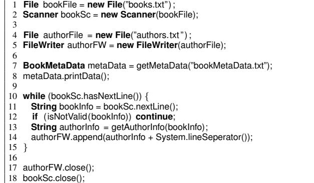
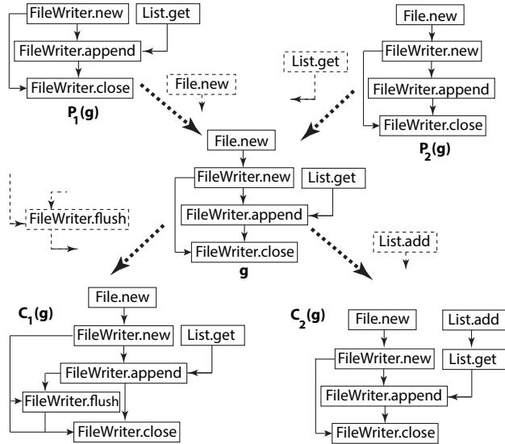
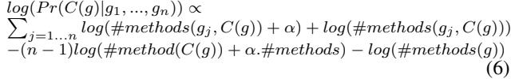
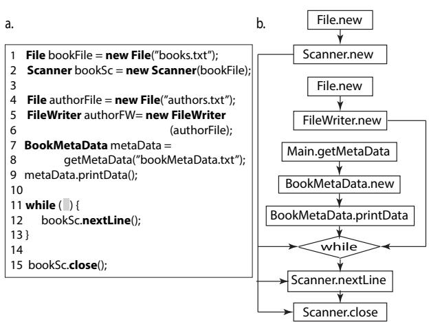
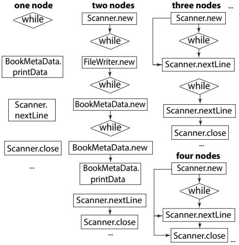
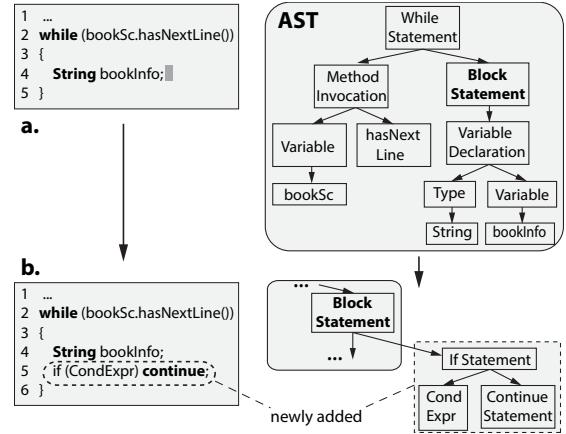

# Graph-based Statistical Language Model for Code

Anh Tuan Nguyen Iowa State University, USA Email: anhnt@iastate.edu

Tien N. Nguyen Iowa State University, USA Email: tien@iastate.edu

*Abstract*—n-gram statistical language model has been successfully applied to capture programming patterns to support code completion and suggestion. However, the approaches using ngram face challenges in capturing the patterns at higher levels of abstraction due to the mismatch between the sequence nature in n-grams and the structure nature of syntax and semantics in source code. This paper presents GraLan, a graph-based statistical language model and its application in code suggestion. GraLan can learn from a source code corpus and compute the appearance probabilities of any graphs given the observed (sub)graphs. We use GraLan to develop an API suggestion engine and an AST-based language model, ASTLan. ASTLan supports the suggestion of the next valid syntactic template and the detection of common syntactic templates. Our empirical evaluation on a large corpus of open-source projects has shown that our engine is more accurate in API code suggestion than the state-of-the-art approaches, and in 75% of the cases, it can correctly suggest the API with only five candidates. ASTLan also has high accuracy in suggesting the next syntactic template and is able to detect many useful and common syntactic templates.

## I. INTRODUCTION

Source code is repetitive [1], [2]. The programming patterns detected from code have been shown to be useful in many software engineering (SE) applications including integrated development environment (IDE) supports (e.g., code completion/ suggestion [1], [3]), code search [4], documentation [5], framework adaptation [6], program repair [7], [8], language migration [9], etc. Recognizing their importance, many approaches have been proposed to detect code patterns in various forms. They can generally be classified into two categories. The first one is based on *deterministic* pattern mining algorithms, e.g., mining frequent item sets [10], frequent subsequences [11], frequent graphs [12], associate rules [13], etc. Instances occurring at least a number of times are reported as patterns.

The second category is based on *statistical* language models. A statistical language model L is a generative model defined via three components: a vocabulary V of basic units, a generative process G, and a likelihood function P(.|L). P(s|L) is the probability that a sequence s of the elements in V is "generated" by the language model L following the process G. Recent research in SE [1], [14], [15], [16] has shown that ngram language model is useful in capturing fine-grained code patterns to support code suggestion (Code suggestion is the suggestion of a complete code element given a code portion).

*N-gram* model is a statistical language model with two assumptions. First, it assumes that a sequence is generated from left to right. Second, the generating probability of a word in that sequence is dependent only on its local context, i.e., a window of previously n generated words. N-gram is popularly used for text analysis in natural language processing (NLP). However, source code in a program has well-defined syntax and semantics according to the programming languages. The syntax and many levels of semantics can be represented by tree-based data structures (e.g., Abstract Syntax Tree – AST) or graph-based data structures (e.g., Control Flow Graph and Program Dependency Graph). The programming patterns at those levels have been shown to be useful in several SE applications as listed above. However, using n-gram creates a mismatch to those structured data representations, thus, making it not well-suited and less accurate in detecting patterns at those levels. For example, using n-gram model to capture API usage patterns faces the following issues.

First, in a usage pattern, it is not always that there is a required order between two API method calls, e.g., between the instantiations of two objects Scanner and FileWriter in a pattern of *reading data from a file with Scanner and writing to another file with FileWriter* in JDK. However, to model that pattern, n-gram requires a total order among API calls. Thus, it might consider two instances of that pattern with different orders as not related. Second, the code of a pattern often interleaves with the code for *project-specific logic*, e.g., a usage for reading from a file is used together with project-specific processing for the texts in the file. An n-gram could incorrectly include the nearby tokens of the project-specific usage into the pattern. Thus, the model could potentially miss the correct pattern and incorrectly suggest the next API call.

Third, in many cases, the prior n API calls do not sufficiently provide the context for code suggestion since the API calls in the same usage/pattern could be far apart and cannot be captured within n elements. Extending n to a large value does not solve the problem since more irrelevant API elements would be included. Similarly, using n-gram to capture syntactic templates is not well-suited since the structural and containment relations among AST nodes are not considered.

In this work, we introduce GraLan, a graph-based statistical language model, that can learn from a corpus of graphs (produced from training data of source code) to compute the probability that a graph B would appear given a set of context graphs Ctxt. Ctxt includes a subgraph A of B in which A or subgraphs of A were observed. We further consider the cases where B has exactly one more node than A and the inducing edges. A is called the parent graph of B. During training, we identify the (sub)graphs with parent-child relations in the corpus, and compute such probabilities by using the Bayesian formula on the graphs in Ctxt, and by counting the occurrences of (sub)graphs and co-occurrences among them.

To demonstrate the applications of GraLan, we used it to build a code suggestion engine for the "next" API element. API elements are API method calls and field accesses, and related control units (e.g., if, while, for) used in an API usage. The "next" API element is the one that is requested to be filled in at the current editing position L (which is not necessarily at the end of the current code). First, the current code is parsed to build a Groum [5], a graph representing API usages. For suggestion, we consider as the context the API usages surrounding L (represented by subgraphs) and use GraLan to suggest a list of API candidates ranked by their probabilities.

We also developed ASTLan, an AST-based language model, that was adapted from GraLan to support the suggestion of the next valid syntactic template and the detection of common syntactic templates. IDEs could provide developers such commonly used syntactic templates during editing.

We have conducted an empirical evaluation on GraLan's and ASTLan's code suggestion capability. With a single suggestion, in one out of three cases, GraLan is able to correctly suggest the API element. In one of two cases, the correct API element is from two suggestions. In 3 out 4 cases, the correct API element is within the top-5 suggested APIs.

We also compared GraLan's accuracy with that of two stateof-the-art approaches used in Bruch *et al.* [10] and Raychev *et al.* [16]. While Bruch *et al.* is based on *sets of API elements* in the methods of a corpus, Raychev *et al.* is based on n*-grams on such API elements*. Our results showed that GraLan's top-5 accuracy is *7.1–10.2%* and *20.4–35.2%* higher than those of the set-based and n-gram based approaches, respectively. ASTLan is able to achieve high accuracy as well. In 63% of the cases, the correct next template is in ASTLan's top-5 list of candidates. Importantly, ASTLan is able to mine several correct syntactic templates. Our key contributions include:

1. GraLan and ASTLan, the graph-based and tree-based statistical language models for object-oriented source code,

2. Their applications in API and syntactic template suggestion engines, and in syntactic template detection, and

3. An empirical evaluation on the performance of the models to show their accuracy in code suggestion.

## II. A MOTIVATING EXAMPLE

Let us start with an example that explains the challenges when using n-gram model for code suggestion, and motivates GraLan. Figure 1 shows the code in which the book data is read from a text file via the classes File and Scanner, and then stored into another text file via File and FileWriter of the JDK library. After the metadata is read (lines 7–8), a while loop (lines 10–15) is used to iterate over all the lines in the first text file to retrieve the authors' data, and write to the second file.

From the example, we see that to achieve a programming task, developers use the Application Programming Interface elements (API elements, APIs for short), which are the *classes*, *methods*, and *fields* provided by a framework or library. The API elements are used in some order with specific data

Fig. 1. An API Usage Example

and/or control flow dependencies, and control structures (i.e., condition/repetition) according the API specification. A usage of API elements is used to achieve a programming task and is called an API usage. An example of a usage is for reading data from a file, involving File.new, Scanner.new, Scanner.hasNextLine, Scanner.nextLine, Scanner.close, and the control unit while.

Using n-gram to capture common usages (called *patterns*) and give code suggestion would face the following challenges:

1. Total order. The API elements in a usage do not always have a specific required order, e.g., the instantiations of the Scanner and FileWriter objects. However, n-gram requires a total order among APIs. Thus, it would not consider two sequences FileWriter.new-Scanner.new and Scanner.new-FileWriter.new as two instances of the same pattern. Using a graph model could help to represent the partial order among APIs.

2. Interleaving between the code of patterns and projectspecific code. The code for the pattern "reading from a file and writing to another" is interleaved with the code for the project-specific logic, e.g., reading metadata (lines 7–8), checking information validity (line 12), or retrieving authors' information (line 13). An n-gram could incorrectly include the nearby tokens of the project-specific usage (e.g., getAuthorInfo or isNotValid) into a pattern, leading to incorrect suggestion.

3. API elements of the same pattern could be far apart in the code. For example, reading from a file involves File.new, Scanner.new (lines 1–2), the while loop with Scanner.hasNextLine (line 10), Scanner.nextLine (line 11), and Scanner.close (line 18). Such patterns can not be captured well with n-grams with limited lengths. However, considering dependency graphs among API elements can help to connect them together.

4. Non-sequential order of editing. For example, a developer could write the body of the while loop (line 10) before writing its condition. If (s)he requests for code suggestion at the condition, n-gram will use the code prior to line 10 for suggestion. However, the code after that such as bookSc.nextLine could suggest the use of bookSc.hasNextLine at the condition of the while loop since they often go together. This also suggests us to expand the context for code suggestion to include the code after the requested location.

## III. GRAPH-BASED STATISTICAL LANGUAGE MODEL

To address those issues, we propose *GraLan*, a graph-based statistical language model. Let us present it in the context of its application of API code suggestion where it is applied to the graphs representing API usages. However, GraLan is general for any graphs extracted from code. For the concepts specifically applicable to API suggestion, we will explicitly state so.

# *A. API Usage Representation*

*Definition 1 (*API Usage): *An API usage is a set of related API elements (i.e., classes, method calls, field accesses, and operators) in use in the client code, together with control units (i.e., condition and repetition) in a specific order, and with the control and data flow dependencies among API elements [3]*.

In our prior work [5], we developed a graph-based representation model, called *Groum* to represent API usages.

*Definition 2 (*Groum *[5]): A Groum is a graph in which the nodes represent actions (i.e., method calls, overloaded operators, and field accesses) and control points (i.e., branching points of control units if, while, for, etc.). The edges represent the control and data flow dependencies between nodes. The nodes' labels are from the names of classes, methods, or control units.*

Our prior work [5] shows that an API usage can be represented by a connected (sub)graph in a Groum. In Figure 2, P2(g) illustrates the pattern on FileWriter as a Groum. The action nodes such as File.new, FileWriter.new, etc. represent API calls, field accesses, or operators. The nodes' labels have fully qualified names and an action node for a method call also has its parameters' types (not shown). An edge connects two action nodes if there exist control and data flow dependencies between them. For example, FileWriter.new must be executed before FileWriter.append and the object created by the former is used in the latter call, thus, there is an edge from the former to the latter. If a usage involves a while loop (e.g., in Figure 1), a control node named WHILE is created after the node for the condition and is connected to the first node in the body of while. If a method call is an argument of another call, e.g., m(n()), the node for the call in the argument will be created before the node for the outside method call (i.e., the node for n comes before that of m). The rationale is that n is evaluated before m.

## *B. Generation Process*

A graph can be constructed from one of its subgraphs by adding nodes and edges. Thus, the graph generation process can be modeled by the addition of nodes and edges to alreadyconstructed subgraphs. Thus, we define the following concept:

*Definition 3 (*Parent and Children Graphs): *A connected graph* P(g) *is a parent graph of a graph* g *if adding a new node* N *and inducing edges from* N *to* P(g) *will create* g*.* g *is a child graph of* P(g)*. A child graph of* g *is denoted as* C(g)*. A graph can have multiple parents and multiple children.*

This relation is general for any graph. However, let us illustrate it via Figure 2 for API usage graphs (Groums). The graph P1(g) is a parent graph of g because adding the node File.new and the edge File.new-FileWriter.new to P1(g) will create g. g also has its children C1(g) and C2(g). The suggestion of

Fig. 2. Parent and Children Graphs

a new API given an already-observed Groum g can be done by considering all of its children C(g) 0s. We extend the concept of parents to ancestors and that of children to descendants.

*Definition 4 (*Context): *The context of a generation process of a new graph* C(g) *from a graph* g *is a set of graphs including* g *that are used to generate* C(g)*.*

We use P r(C(g)|Ctxt)=P r((g, N +, E+)|Ctxt) to denote such generation probability. N + is the additional node and E+ is the list of additional edges connecting g and N + to build C(g). All the graphs in Ctxt including g affects the generation of C(g). For the API suggestion application, the context contains the subgraphs g1, .., gn (of the Groum G built from the code) that surround the current editing location. Those subgraphs represent the potential usages that are useful in the prediction. For each child graph generated from a subgraph gi , the corresponding additional nodes Nj 's will be collected and ranked. Each new node will be added to G to produce a candidate graph G0 as a suggestion (see details in Section IV).

## *C. Computation based on Bayesian Statistical Inference*

Let us explain how we calculate the generation probability of a new graph with Bayesian statistical inference. We have:

$$\Pr(C(g)|Ctxt) = \Pr((g, N^+, E^+)|Ctxt) \qquad (1)$$

We want to compute the generation probability for the additional node and edges to g. That probability is learned from a training set via statistical learning. To do that, we start with:

$$\Pr(C(g)|Ctxt) = \Pr(C(g)|g\_1, \dots, g\_n) \tag{2}$$

where P r(..) represents a probability that a child graph C(g) is generated from its parent g, and g1, ..., gn is the set of graphs including g making up the context for generating C(g).

The Bayesian model is based on the Bayes' theorem to estimate the posterior probability given the prior probability:

$$\begin{aligned} Pr(A, B) &= Pr(A|B)Pr(B) = Pr(B|A)Pr(A) \\ \Rightarrow Pr(B|A) &= Pr(A|B)Pr(B)/Pr(A) \end{aligned}$$

where P r(B|A) is the probability of a hidden variable B having a state, given the observed state of the variable A. P r(A|B) is the learned knowledge on the impact relation (via conditional probability) between B and A. P r(A) and P r(B) are the prior probabilities that A and B have their respective states. In GraLan, the hidden variable B represents the graph C(g) to appear (i.e., to be generated), and the known variables As include the given graph g and the rest of the graphs in the context Ctxt having been observed. Thus, the formula (2) for the generation probability of C(g) becomes:

$$\begin{aligned} Pr(C(g)|g\_1, \dots, g\_n) &= Pr(C(g), g\_1, \dots, g\_n) / Pr(g\_1, \dots, g\_n) \\ \propto Pr(C(g), g\_1, \dots, g\_n) &= Pr(g\_1, \dots, g\_n | C(g)) Pr(C(g)) \end{aligned}$$

(3) 1) P r(C(g), g1, ..., gn) is the probability that all the graphs g1, ..., gn and C(g) co-appear.

2) P r(C(g)) is the probability that the child graph C(g) appears. It can be estimated by P r(C(g)) = #methods(C(g))/#methods where #methods is the number of all methods in a training dataset and #methods(C(g)) is the number of all the methods containing C(g).

3) P r(g1, ..., gn|C(g)) is the probability that the graphs g1, .., gn appears given that C(g) has been observed.

Similar to the n-gram model where the subsequences ngrams are assumed to be conditionally independent, we assume g1,..., gn to be conditionally independent given C(g). Thus,

$$\begin{array}{l} Pr(g\_1, \ldots, g\_n | C(g)) \\ = Pr(g\_1 | C(g)) \ldots Pr(g\_i | C(g)) \ldots Pr(g\_n | C(g)) \end{array} \tag{4}$$

P r(gj |C(g))(j = 1..n) is the probability that the graph gj appears given C(g), and is estimated by the Bayes formula: P r(gj |C(g)) = P r(gj , C(g))/P r(C(g)) =

(#methods(gj , C(g))+α) / (#method(C(g))+α.#methods) where #methods(gj , C(g)) is the number of all methods having both gj and C(g). A smoothing constant α is used to avoid zero value when there is no method having both gj and C(g).

Since g belongs to the context, let g = gi . The pair g and C(g) co-appears at least in one method, and they have parent-child relation, hence we give that pair a probability P r(C(g)|g) = #methods(g, C(g))/#method(g). Thus,

$$\begin{array}{l} Pr(C(g)|Cxt) = Pr((g, N^{+}, E^{+})|Ctx) = Pr(C(g)|g\_{1}, \ldots, g\_{n}) \\ \propto Pr(g\_{1}|C(g)) \ldots Pr(g\_{i-1}|C(g)) Pr(g|C(g)) \\ \propto Pr(g\_{i+1}|C(g)) \ldots Pr(g\_{n}|C(g)) Pr(C(g)) \\ = Pr(g\_{1}|C(g)) \ldots Pr(g\_{i-1}|C(g)) \mathbf{Pr}(\mathbf{g}|\mathbf{C}(\mathbf{g})) \mathbf{Pr}(\mathbf{C}(\mathbf{g})) \ldots Pr(g\_{n}|\ldots) \\ = Pr(g\_{1}|C(g)) \ldots Pr(g\_{i-1}|C(g)) \mathbf{Pr}(\mathbf{C}(\mathbf{g})|\mathbf{g}) \mathbf{Pr}(\mathbf{g}) \ldots Pr(g\_{n}|C(g)) \\ = \frac{\# methods(g\_{1}, C(g)) + \alpha \ldots \# methods}{\# methods(g\_{n}, C(g)) + \alpha} \ldots \frac{\# methods(g)}{\# methods} \frac{\# methods}{\# methods} \ldots \end{array} \tag{5}$$

The calculation of the product of probabilities, which are within [0, 1], is not resilient due to floating underflow. Thus, we calculate the logarithmic values of (5), and use them to compare the additional nodes corresponding to different C(gj )s.

Fig. 3. An API Suggestion Example and API Usage Graph

|    | 1 function APISuggestion(Code C, Location L, GraphDatabase GD) |
|----|----------------------------------------------------------------|
| 2  | G = BuildGroum(C)                                              |
| 3  | Ctxt = GetContextGraphs(G, L)                                  |
| 4  | NL = ∅ // a ranked list of recommended nodes                   |
| 5  | foreach g ∈ Ctxt                                               |
| 6  | {C(g)} = GetChildrenGraphs(g, GD)                              |
| 7  | foreach C(g) ∈ {C(g)}                                          |
| 8  | score = log(P r(C(g) Ctxt))                                    |
| 9  | NM = GetAddedNode(C(g))                                        |
| 10 | NL = UpdateRankedNodeList(NL, NM, score)                       |
| 11 | return NL                                                      |
|    | 12 end                                                         |
|    |                                                                |

Fig. 4. API Suggestion Algorithm

## IV. GRALAN IN API ELEMENT SUGGESTION

This section explains how we use GraLan to build an engine for suggesting the next API element for the current code. The suggestion task for API elements is to recommend an API element upon request at a location in the current code under editing (not necessarily at the end). An example of partially edited code is shown in Figure 3a. A developer requests the engine to suggest an API call at the while loop (line 11).

# *A. Algorithm*

Overview. The key idea of the API suggestion algorithm is to extract from the currently edited code the usage subgraphs (Groums) surrounding the current location, and use them as the context. Then, the algorithm utilizes GraLan to compute the probabilities of the children graphs given those usage subgraphs as the context. Each child graph has a corresponding additional node, which is collected and ranked as a candidate of API element for suggestion. Those probabilities are used to compute the scores for ranking the candidates.

Detailed Algorithm. Figure 4 shows the pseudo-code of our algorithm. The input includes the current code C, the current location L, and the trained model with graph database GD (see Section IV-B for building GD). First, we use Eclipse's Java parser to create the AST for the current code. If the incomplete code under editing is not parsable by the parser, we run the PPA tool [17] on it. The PPA tool accepts a portion of code and returns an AST with all available type binding information.

Fig. 5. Context Subgraphs

However, in some cases, there might exist some unresolved nodes, for example, their syntactic or data types are undetermined. Thus, they are assigned with an unknown type. Then, we build the Groum from the AST using the Groum building algorithm [5] (line 2). Due to the possible incompleteness of the current code, the unresolved nodes in the AST (if any) are considered as single-node graphs. Their labels are the lexemes. The Groum of the code in Figure 3a is shown in Figure 3b.

Next, APISuggestion determines the list of context graphs from the Groum G and the current location L (line 3). We use the graphs that contain the APIs surrounding L as the context. One or more of those context graphs are potentially the graphs that "generate" the child graphs in which the corresponding additional nodes are the candidates to be filled in at L. They represent the usages with high impact on the selection of the API to be filled. Details on context graphs are in Section IV-C. Figure 5 shows the context graphs for the code in Figure 3.

Then, for each graph g in the context, we search in the graph database GD of GraLan to determine all feasible children graphs C(g)s (line 6). We compute the score that each child graph C(g) would be generated (line 8) with the Equation (6). The respective additional nodes for those children graphs are collected (line 9) and ranked based on the computed probabilities as the candidate APIs for suggestion (line 10).

Table I shows a few examples of the context graphs and their corresponding children graphs for our example in Figure 3. In the interest of space, we show the graphs as a sequence of the nodes' labels. The respective additional nodes of the children graphs are written in bold, e.g., Scanner.hasNextLine is from the child graph #4 in Table I. Moreover, an additional node N + from a child graph C(g) will assume the location L in the code. The relative order between N + and other nodes in C(g) must be consistent with their corresponding order in the graph G. For example, the API Scanner.nextLine is after both the current location L and WHILE. Thus, the children graphs C(g)s with Scanner.nextLine appearing before N + or before WHILE are not considered. Any graph C(g) with its additional

TABLE I CONTEXT GRAPHS AND THEIR CHILDREN GRAPHS

| gi                     | C(gi)                                                                      | score |  |  |
|------------------------|----------------------------------------------------------------------------|-------|--|--|
| WHILE                  | 1. Scanner.hasNext WHILE                                                   | 0.010 |  |  |
|                        | 2. StringTokenizer.hasMoreElements WHILE                                   | 0.015 |  |  |
|                        |                                                                            |       |  |  |
| Scanner.new WHILE      | 3. Scanner.new Scanner.hasNext WHILE                                       |       |  |  |
|                        | 4. Scanner.new Scanner.hasNextLine WHILE                                   | 0.150 |  |  |
|                        | 5. Scanner.new Scanner.hasNextChar WHILE                                   | 0.050 |  |  |
|                        |                                                                            |       |  |  |
|                        | BookMetaData.new WHILE null, i.e., no child graph in GD (project-specific) | 0.000 |  |  |
| WHILE Scanner.nextLine | 6. Scanner.hasNextLine WHILE                                               |       |  |  |
|                        | Scanner.nextLine                                                           | 0.700 |  |  |
|                        | 7. Scanner.hasNext WHILE Scanner.nextLine                                  | 0.050 |  |  |
|                        | 8. Scanner.hasNextChar WHILE Scanner.nextLine 0.000                        |       |  |  |
|                        |                                                                            |       |  |  |

TABLE II RANKED CANDIDATE NODES

| Node                            | Scores          | Highest score |
|---------------------------------|-----------------|---------------|
| Scanner.hasNextLine             | 0.15, 0.7       | 0.7           |
| Scanner.hasNext                 | 0.01, 0.2, 0.05 | 0.2           |
| Scanner.hasNextChar             | 0.05, 0.0       | 0.05          |
| StringTokenizer.hasMoreElements | 0.015           | 0.015         |

node N + violating that condition will not be used. The graphs 6–8 in Table I conform to that condition. Such checking is part of UpdateRankedNodeList in line 10 of Figure 4. Note that in a Groum, the node for the condition of a while loop appears before the WHILE node. In Table I, the children graphs C(g)s with N + (in bold) connecting to WHILE are still valid.

The probability that a node is added to G is estimated by the probability that the respective child graph is generated given its context. Table II shows the examples of candidate APIs. Each candidate might be generated by more than one parent graphs. Thus, its highest score is used for ranking. For example, the additional node Scanner.hasNextLine appears in the two children graphs 4 and 6. Finally, the node with highest score could be used to be filled in the requested location L. The additional edges E+s are determined from the corresponding C(g)s, but we do not need them for this API suggestion application. A user just uses the suggested API with their chosen arguments.

# *B. Building Database* GD *of Parent and Children Graphs*

We use GrouMiner [5] to build Groums for the code in any given code corpus. To identify parent and child (sub)Groums, we traverse a Groum in a depth-first order and expand from a smaller parent graph by adding a new node and inducing edges to get a child graph. We repeat until all nodes/edges are visited.

## *C. Determining Context Subgraphs*

To determine the context graphs, at the current location L, we collect the surrounding API calls. A threshold θ is used to limit the number of such calls. The closer to L an API call is in the code, the higher priority it has. In Figure 3a, if θ = 4, the surrounding API elements are metaData.printData(), while, book-SC.nextLine(), and bookSC.close(). Thus, we collect into a set S the nodes BookMetaData.printData, WHILE, Scanner.nextLine, and Scanner.close. From those nodes, we expand them to all the subgraphs in G that satisfy the following: 1) containing at least one API in S, and 2) having the sizes smaller than a threshold δ. δ is also used to limit the number of context graphs, which can increase exponentially. For example, given the set S of BookMetaData.printData, WHILE, Scanner.nextLine, Scanner.close, and δ = 5, the context graphs are partially listed in Figure 5.

## V. AST-BASED LANGUAGE MODEL

We have adapted and extended GraLan into ASTLan, an AST-based language model to support the suggestion of a syntactic template at the current editing location, and to support the detection of popular syntactic templates. An example of such suggestion is shown in Figure 6. A developer wrote a while loop with a declaration of the String variable bookInfo. The cursor is at the end of bookInfo. The engine built with ASTLan could suggest to him/her the addition of a new if syntactic unit with a continue since it has often encountered such common structure where a checking is performed within a while loop. Such common syntactic structure (e.g., a while loop with an ifcontinue) is called *syntactic template*. Our engine can suggest such templates as part of its code completion. Unlike existing IDEs [18], [19], [20], which give *pre-defined* templates, our engine can suggest syntactic templates that *most likely occur at the current location, taking into account the current code*. ASTLan also has three key components: generation process,

the context, and the computation of generation probabilities.

## *A. Generative Process*

Similar to GraLan, the foundation of the generative process is the parent-child relation between ASTs. We want to model the generation from a smaller AST to a larger one.

*Definition 5 (*Parent and Children ASTs): *An AST* C *is a child of another AST* P *(*P *is a parent of* C*) if 1)* C *is formed by adding a minimal AST (sub)tree* T *to a node in* P*; and 2) both* P *and* C *are syntactically correct.*

A *minimal* T means that there is no way that we can delete one or multiple nodes in T and still make C syntactically correct. This first condition ensures that the newly added T for C is the one with the minimum number of nodes among all other (sub)trees that can be added to P at the same location with the same syntactic type. For example, the ASTs in Figures 6{a,b} satisfy this, since we cannot add to the BlockStatement any other smaller fragment of the type IfStatement to create a valid AST. All three nodes IfStatement, Cond, and ContinueStatement are needed. The rationale for this condition is that we want to suggest the smallest template of certain syntactic type. For example, the following suggested code does not satisfy that:

while (bookSc.hasNextLine()) { String bookInfo; if (Cond) continue; String authorInfo = getAuthorInfo(bookInfo); }

because it is larger and contains the AST in Figure 6b.

The rationale for the second condition on syntactic correctness (let us call it *valid* for short) is that we want to suggest a valid syntactic template for the current code. If one wants to build a suggestion engine for templates without concerning syntactic correctness, the validity condition is not needed. In Figure 6b, the suggested template is an if statement with a condition and continue. The corresponding subtree with IfStatement,

Fig. 6. An Example of Suggesting a Valid Syntactic Template

Cond, and ContinueStatement is valid. However, if we add only IfStatement → Cond, the resulting tree will be syntactically invalid. Finally, as in GraLan, a parent can have multiple children ASTs, and a child AST can have many parent ASTs.

## *B. Normalization on AST*

The concrete values in AST nodes are specific in different locations. For example, the variable name bookSc in Figure 6 is project-specific and might not be matched to other variables in other projects. To detect syntactic templates and enhance AST-Lan's suggestion capability, we perform a normalizing procedure on the AST's subtrees. An AST subtree is normalized by re-labeling the nodes for local variables and literals. For a local variable node in a subtree or a label in a switch statement, its new label is the name of that variable/label via *alpha-renaming* within the subtree, concatenated with its type. For instance, in Figure 6a, bookSc becomes var1 Scanner, and bookInfo becomes var2 String. A literal's label is 'LIT' concatenated with its data type. We abstract the special values such as empty string, zero, and null with special labels. Such values are often used for special meaning, e.g., successful execution, nullity checking, etc.

## *C. Building Database of Parent and Children ASTs*

An important task in ASTLan is to mine all the parent and child ASTs from a corpus of syntactically correct programs. Given a method, we parse it to build its AST. We traverse the AST from the top and identify the parent and children ASTs.

The first phase is to find one or more valid AST fragments and use them as initial parent ASTs. We examine the first child c of the BlockStatement of the method's body. Depending on the AST node type of c, we consider its children nodes that form with c a syntactically correct tree. For example, if c is an if node, we expand from c to its children in either one of the two following possibilities depending on its concrete children: 1) connecting if to both E and S1; or 2) connecting if to all three nodes E, S1, and S2 (Table III). Note that connecting if to only E and S2 creates an invalid AST fragment since the true branch is always needed. Table III shows the examples of such expansion rules. Next, we connect BlockStatement to c,

TABLE III EXAMPLES OF EXPANDING RULES

| Syntax                                   | Valid Expansion                                   |
|------------------------------------------|---------------------------------------------------|
| If ::= if E S1 S2                        | If → E                                            |
|                                          | If → E, S1                                        |
|                                          | If → E, S1, S2                                    |
| While ::= while E Stmt                   | While → E                                         |
|                                          | While → E, Stmt                                   |
| For ::= for Init E Update Stmt           | For → Init, E, Update                             |
|                                          | For → Init, E, Update, Stmt                       |
| Switch ::= switch E Case∗ Def Switch → E |                                                   |
|                                          | Switch → E, F with F ∈ all Case combinations      |
|                                          | Switch → E, Def                                   |
|                                          | Switch → E, F, Def with F ∈ all Case combinations |
| Case ::= case E: Stmt                    | Case → E                                          |
|                                          | Case → E, Stmt                                    |
| InfixOp ::= E1 Op E2                     | InfixOp → E1, E2                                  |
| Try ::= try Block {Catches               | Try → Block, all combinations of Catches          |
| Finally}                                 | Try → Block, Finally                              |
|                                          | Try → Block , all comb. of Catches, Finally       |

and to c's children nodes according to either one of those two possibilities. For each possibility, we apply the same expansion rules on each of the children of c and repeat the expansion until seeing a leaf node. Then, the next possibility is explored. At each step for a possibility, after traversing to c's children, if the resulting AST fragment formed by the tree expanding to c, c itself, and c's children, is valid, we will consider it as an initial parent AST(s) P. In Figure 6a, after this phase, we have two initial parent ASTs: 1) the left subtree at While (P1), and 2) left subtree at While and the node BlockStatement (P2).

In the second phase, for each of parent ASTs P, we consider the edges coming out of P in the method's AST. For each edge, let us use ni to denote the corresponding node. For example, for P1, ni is BlockStatement. For P2, ni is VariableDeclaration. We want to find the children ASTs of that parent tree P by attempting to expand from P to ni and to ni's children. To do that, we use the same expansion rules in Table III. We then collect ni and each of the valid combinations of its children nodes to form different possible subtree(s) T. The subtree(s) T with the minimum number of nodes is used to connect to P to form its child AST C(s). The ones with higher numbers of nodes will be used as the children or descendent ASTs for those Cs depending on their numbers of nodes. For example, the tree with all sub-components of if will be used for the child AST of the one with if, E, and S1. The process repeats as those resulting children ASTs C and their descendants will be used as the parent ASTs for further traversal. For example, after this phase, we have P1 is a parent AST of P2, which in turn is a parent AST of the entire subtree at While in Figure 6a.

To find other parent AST(s) for a child AST C, we take each parent AST of P and connect to the corresponding T of C (T is the newly added subtree). If the resulting tree is valid and connected to the parent AST of P in the method's AST, it will be noted as another parent AST of C as well.

## *D. Context Trees*

First, to determine the context trees in the AST, we find the smallest, valid subtree whose corresponding source code contains the current location L. Let us call the root of that

TABLE IV DATA COLLECTION

| Total projects                        | 1,000         |
|---------------------------------------|---------------|
| Total classes                         | 104,645       |
| Total methods                         | 638,293       |
| Total SLOCs                           | 7,144,198     |
| Total usage graphs involving JDK APIs | 795,421,354   |
| Total distinctive graphs              | 55,593,830    |
| Total distinctive API elements        | 463,324       |
| Total valid AST's fragments           | 1,047,614,720 |
| Total distinctive fragments           | 36,608,102    |
| Total distinctive AST nodes           | 302,367       |
|                                       |               |

subtree NL. Then, we collect all valid trees tis that satisfy two conditions: 1) ti contains NL, and 2) ti has a height not greater than a threshold γ.

As in GraLan, those nearby nodes provide a context to generate the next child AST(s). In Figure 6a, NL is the Block-Statement. If γ=3, the trees rooted at WhileStatement and Block-Statement whose heights are smaller than 4 are in the context.

## *E. Valid AST Suggestion with Bayesian Statistical Inference*

With the parent-child relation on ASTs and context trees, we can apply the same process with Bayesian statistical inference to calculate the generation probability of a new valid AST C(t) given the context including t (e.g., t = ti) (Section III-C):

$$\begin{array}{l} Pr(C(t)|Ctxt) = Pr((t, N^+, E^+) | t\_1, \dots, t\_n) \\ = \frac{\#methods(t\_1, C(t)) + \alpha}{\#methods(C(t)) + \alpha. \#methods(t\_{(i-1)}, C(t)) + \alpha} \cdot \frac{\#methods(t\_{(i-1)}, C(t)) + \alpha}{\#methods(t\_i) + \alpha. \# methods} \cdot \\ \frac{\#methods(t, C(t))}{\#methods(t)} \cdot \frac{\#methods(t)}{\#methods(t)} \cdots \frac{\# methods(t\_n, C(t)) + \alpha}{\#methods(C(t)) + \alpha. \# methods} \end{array} . \tag{7}$$

That probability is used in our algorithm to suggest the next valid syntactic template in the similar procedure as in the API suggestion algorithm in Figure 4. Let us explain the differences between two algorithms. First, PPA [17] is used to build the AST from the current code. Second, instead of collecting context graphs, we collect context trees in the AST considering the current location. Third, for each context tree t, the tree database is used to find children ASTs. The formula (7) for the probability P r(C(t)|Ctxt) is computed for each context tree tj . Finally, the corresponding additional AST's subtrees are computed and ranked using those probabilities.

## VI. EMPIRICAL EVALUATION

We conducted several experiments to study GraLan's and ASTLan's code suggestion accuracy with different data sizes and parameters, and to compare GraLan to the state-of-the-art approaches. They were run on a computer with Intel Xeon E5-2620 2.1GHz (configured with 1 thread and 32GB RAM).

We collected a large corpus of Java projects from Source-Forge.net (Table IV). To get higher quality code for mining, we filtered out the projects that is not parsable and might be experimental or toy programs based on the number of revisions in the history. We only kept projects with at least 100 revisions. We downloaded the last snapshots of each project. We eliminated from the snapshot of a project the duplicated code from different branches. For each project, we used Eclipse's Java parser to parse the code and built the ASTs and

TABLE V ACCURACY % WITH DIFFERENT NUMBERS OF CLOSEST NODES

| θ             | 1 | 2   | 3   | 4   | 5                                                 | 6   | 7   | 8 | 9              | 10 |
|---------------|---|-----|-----|-----|---------------------------------------------------|-----|-----|---|----------------|----|
| Top-1         |   |     |     |     | 26.3 29.3 32.6 32.9 33.0 33.1 33.3 33.4 33.4 33.4 |     |     |   |                |    |
| Top-5         |   |     |     |     | 70.7 71.1 71.7 72.1 72.8 73.4 73.9 73.9 73.9 73.9 |     |     |   |                |    |
| Top-10        |   |     |     |     | 85.0 85.7 86.0 86.3 86.8 87.0 87.1 87.1 87.1 87.1 |     |     |   |                |    |
| Time (ms) 0.1 |   | 0.2 | 0.5 | 0.9 | 1.8                                               | 3.6 | 7.3 |   | 14.6 29.1 59.0 |    |
|               |   |     |     |     |                                                   |     |     |   |                |    |

the usage graphs (Groums) for all methods. In experiments for APIs, we focus only on Java Development Kit (JDK). We built databases for Groums and ASTs (Section V-C). In total, we built almost 800M graphs (involving JDK APIs) with 55M distinctive ones, and 1.047 billion ASTs (both JDK/non-JDK).

## *A. API Recommendation Accuracy*

Our first study aims to evaluate GraLan's accuracy in API suggestion. We chose a project in SF named "Spring Framework" that does not belong to the above corpus. It has a long history and 9,042 methods. We kept 3,949 methods using JDK APIs.

Procedure and Setting. For each body of those methods m, we conducted the following. We collected into a list all the API elements and the control units in m (i.e., if, for, while, etc.), and sorted them in the appearance order for sequential suggestion. Let us call both of them APIs for short. We traverse that list sequentially from the second API to the last one (we did not start from the first since we want to have previous code as the context). At a position i, we use GraLan to compute the top-k most likely APIs a1, a2, ..., ak for that position based on the code prior to and not including it. We predicted only for JDK APIs because our database (Table IV) is built for JDK only.

To do that, since the previous code might be incomplete, we first used PPA tool [17] to perform partial parsing and semantic analysis for the code from the starting of the method to the current position in order to build the AST, and then the Groum G. The unresolved nodes in the AST (if any) are considered as single-node graphs. Next, we chose θ previous APIs (including JDK and non-JDK APIs) closest to the position i. From those APIs, we find in graph G the context subgraphs g1, g2, ..., gp that contain one or more of those APIs. Then, we used GraLan to suggest the top-ranked APIs. If the actual API at position i is among k suggested APIs, we count this as a hit. The top-k suggestion accuracy is the ratio of the total hits over the total number of suggestions. In total, for all methods, GraLan made 10,065 suggestions. We also measured suggestion time in ms.

*1)* Accuracy Sensitivity Analysis - Impact of Parameters*:* Let us explain our experiments to study the impact of three parameters on GraLan's API suggestion accuracy. Our first experiment was to study the impact of θ (the number of APIs closest to the position under question) on accuracy. Table V shows accuracy with different values of θ (for this study, the maximum size of Groums in the context is set to 7). As seen, when θ is increased, accuracy also increases. Thus, more related APIs should be added to the context. However, when θ is 8 or higher, accuracy does not change much.

Our next experiment aims to study the impact of the maximum size δ of the context graphs g on accuracy. This is a

TABLE VI ACCURACY % WITH DIFFERENT MAXIMUM CONTEXT GRAPHS' SIZES

| δ             | 1 | 2   | 3   | 4   | 5                                            | 6   | 7 | 8              | 9 |
|---------------|---|-----|-----|-----|----------------------------------------------|-----|---|----------------|---|
| Top-1         |   |     |     |     | 28.1 31.1 31.8 32.8 33.0 33.1 33.3 33.3 33.3 |     |   |                |   |
| Top-5         |   |     |     |     | 63.5 69.5 72.5 73.1 73.5 73.6 73.9 73.9 73.9 |     |   |                |   |
| Top-10        |   |     |     |     | 76.6 83.3 85.0 85.8 86.6 87.0 87.1 87.1 87.1 |     |   |                |   |
| Time (ms) 0.6 |   | 1.4 | 2.6 | 3.8 | 5.3                                          | 9.3 |   | 14.6 30.0 56.0 |   |

TABLE VII ACCURACY % WITH DIFFERENT DATASETS

| Datasets Top1 Top2 Top3 Top4 Top5 Top6 Top7 Top8 Top9 Top10 |      |      |      |      |      |      |      |      |      |      |
|-------------------------------------------------------------|------|------|------|------|------|------|------|------|------|------|
| S100                                                        | 29.3 | 48.7 | 58.7 | 65.2 | 70.4 | 74.3 | 77.4 | 79.6 | 81.2 | 82.7 |
| S300                                                        | 30.6 | 50.6 | 61.9 | 66.1 | 74.0 | 77.8 | 80.5 | 82.3 | 83.7 | 84.8 |
| S1000                                                       | 33.3 | 53.1 | 63.2 | 69.2 | 73.9 | 77.9 | 81.7 | 83.9 | 85.6 | 87.1 |

second threshold used to limit the number of context graphs (Section IV.B). We set θ=8 for this study. As seen in Table VI, when the size limit δ of graphs increases to 7 (i.e., more context graphs being used), accuracy also reaches higher values.

We also want to analyze the impact of the size of the training dataset on accuracy. For this study, we set θ=8 and δ=7 based on the two previous experiments. First, we randomly chose 300 projects in our original dataset of 1,000 projects. Then, among those 300 projects, we randomly selected 100 projects. We built 3 databases for 3 datasets, and ran GraLan for each case. As seen in Table VII, accuracy increases 1–5% when more data is used for model training. Thus, the larger the training dataset, the more likely the correct API usages are observed, thus, the less noise impacts the suggestion quality.

*As seen in the last row (Table VII), GraLan achieves high accuracy. With a single suggestion, in one out of three cases, it can correctly suggest the API element. In one of two cases, the correct API element is from two suggestions. In 3 out 4 cases, the correct API element is within the top-5 suggested APIs.*

Moreover, as seen in Tables V and VI, when θ and δ are increased, suggestion time increases (more context graphs are used). However, it is acceptable for interactive use in IDEs.

*2)* Accuracy Comparison*:* Our next experiment aims to compare GraLan to two state-of-the-art approaches for API suggestions: the *set-based* and n*-gram-based* approaches, which were used in the existing work by Bruch *et al.* [10] and Raychev *et al.* [16], respectively. We used the dataset in Table IV to build two databases for the sets of APIs and for the ngrams of APIs. For comparison, we also used 8 as the limit for the number of previous APIs in a n-gram and the limit for that in a set. We have our own implementations of API suggestion engines using the set-based and n-gram-based approaches.

We chose 5 projects that do not belong to the training data. We processed each of their methods in the same manner except the following. At the position i, we did not build Groum. We took at most 8 prior APIs *in the code prior to* i that have data and control flow dependencies. For the set-based approach, we built all subsets of those APIs. For the n-gram approach, we built n-grams from those APIs for the sizes from 1–8. We used the subsets and the n-grams as the respective inputs for the two suggestion engines to compute the appearing probabilities of APIs and rank the candidates. Top-k accuracy is measured.

TABLE VIII API SUGGESTION ACCURACY COMPARISON

| System Model |                                                          |  |  |                                                   |  | Top1 Top2 Top3 Top4 Top5 Top6 Top7 Top8 Top9 Top10 |
|--------------|----------------------------------------------------------|--|--|---------------------------------------------------|--|----------------------------------------------------|
| spring       | GraLan 35.3 53.1 63.2 69.2 73.9 77.9 81.7 83.9 85.6 87.1 |  |  |                                                   |  |                                                    |
| (10065) Set  |                                                          |  |  | 28.4 41.8 53.6 61.3 66.8 70.7 72.9 74.6 76.2 77.5 |  |                                                    |
|              | n-gram 31.6 40.4 44.8 47.8 50.0 51.5 52.7 53.8 54.5 55.4 |  |  |                                                   |  |                                                    |
| ant          | GraLan 30.9 48.0 62.3 70.5 74.7 78.1 80.2 84.5 87.9 89.6 |  |  |                                                   |  |                                                    |
| (38484) Set  |                                                          |  |  | 26.7 42.2 55.1 63.3 67.4 70.5 73.0 77.2 80.7 82.3 |  |                                                    |
|              | n-gram 27.3 32.7 35.3 39.0 39.5 41.2 42.1 42.6 45.1 45.4 |  |  |                                                   |  |                                                    |
| lucene       | GraLan 30.2 50.1 60.5 67.6 75.0 80.1 83.3 87.2 89.6 91.1 |  |  |                                                   |  |                                                    |
| (69905) Set  |                                                          |  |  | 27.1 42.2 56.0 63.1 67.9 72.2 75.9 78.3 80.1 82.5 |  |                                                    |
|              | n-gram 22.3 33.2 38.7 44.3 45.3 50.3 52.7 53.3 56.2 57.4 |  |  |                                                   |  |                                                    |
| log4j        | GraLan 28.7 37.3 46.3 57.0 65.7 69.0 72.3 76.3 78.7 80.3 |  |  |                                                   |  |                                                    |
| (11644) Set  |                                                          |  |  | 20.2 27.7 39.7 49.1 55.5 60.0 63.2 65.6 69.7 71.7 |  |                                                    |
|              | n-gram 25.1 31.0 37.3 40.7 41.6 44.1 46.2 47.6 48.2 49.2 |  |  |                                                   |  |                                                    |
| xerces       | GraLan 26.3 41.0 54.2 62.3 69.1 72.2 73.9 78.6 82.3 83.7 |  |  |                                                   |  |                                                    |
| (38591) Set  |                                                          |  |  | 23.0 36.7 49.0 56.7 60.5 62.6 64.5 68.1 69.3 70.3 |  |                                                    |
|              | n-gram 18.0 30.1 39.6 43.2 48.7 49.6 51.0 51.0 51.4 51.7 |  |  |                                                   |  |                                                    |

Table VIII shows accuracy comparison for each project with the total suggestions in parentheses. As seen, at top-1 accuracy, GraLan achieves better accuracy than the set-based and ngram approaches from 3.1–8.5%. At top-5 accuracy, it improves over the set-based approach from 7.1–10.2%, and over the n-gram approach from 20.4–35.2%. The improvements at top-10 accuracy are 7.3–13.4% and 31.1–44.2% respectively.

We investigated the reasons for such accuracy among the approaches. Via observing the results, we found that the n-gram model tends to collect APIs including project-specific ones (noises) due to the strict order of n-grams. Thus, its suggestion accuracy is affected more by noises. For example, let A = FileReader.new, B = FileReader.hasNext, C = Book.check(FileReader), D = FileReader.next. Assume that we currently have A, B, and C, and want to suggest D. n-gram would use the sequences A→B→C, B→C, or C. However, they do not commonly occur in the database since C is project-specific, thus, D might not be ranked high enough. In contrast, both GraLan and set-based approach do not require strict order among APIs. They can have the contexts relevant in suggesting D. For example, the set-based engine and GraLan could use the subset (A,B) and the subgraph A → B, respectively, for the suggestion of D.

We observed many cases where GraLan performs better than the set-based approach. That approach tends to include many irrelevant subsets of APIs as the context since it does not keep the partial order among APIs and control units as in GraLan.

## *B. AST Recommendation Accuracy*

*1)* Accuracy Sensitivity Analysis*:* This section presents our experiments to evaluate ASTLan's accuracy. For each body of the methods m of the projects in our dataset, we built the AST for m and traversed it from the top. Initially, we started from the first valid subtree in the AST (e.g., a statement). We set the current location L in the code corresponding to the right-most leaf node of that subtree. We then collected the context trees for L (Section V.D). We keep only the context trees that have the code tokens of their leaf nodes appearing prior to L. Next, we used ASTLan to suggest the top-k valid syntactic templates. Let us call a suggested tree T 0 . Then, we compare T 0 against the actual next valid AST after we normalized it. If they matches, we count it as a hit. Otherwise,

TABLE IX ACCURACY % WITH DIFFERENT MAXIMUM HEIGHTS OF CONTEXT TREES

| γ                             | 1 | 2                   | 3 | 4 |
|-------------------------------|---|---------------------|---|---|
| Top-1                         |   | 15.2 25.2 34.3 34.3 |   |   |
| Top-5                         |   | 17.2 39.6 58.2 63.3 |   |   |
| Top-10                        |   | 18.1 40.6 60.0 69.5 |   |   |
| Time (ms) 0.04 4.01 18.7 31.0 |   |                     |   |   |
|                               |   |                     |   |   |

TABLE X ACCURACY % OF ASTLAN WITH DIFFERENT DATASETS

| Datasets Top1 Top2 Top3 Top4 Top5 Top6 Top7 Top8 Top9 Top10 |      |      |      |      |      |      |      |      |      |      |
|-------------------------------------------------------------|------|------|------|------|------|------|------|------|------|------|
| S100                                                        | 29.8 | 31.0 | 39.5 | 47.0 | 47.1 | 58.3 | 59.0 | 59.0 | 60.0 | 60.0 |
| S300                                                        | 31.3 | 39.3 | 39.5 | 47.0 | 58.2 | 58.3 | 59.4 | 59.6 | 60.0 | 60.0 |
| S1000                                                       | 34.3 | 43.3 | 44.5 | 52.1 | 63.3 | 64.8 | 66.6 | 67.6 | 68.3 | 69.5 |

it is a miss. The process is repeated to the end of the method. Top-k accuracy is measured in the same way.

Our first experiment with ASTLan is to study the impact of the parameter γ (the maximum height of context trees) on suggestion accuracy. We varied different values for γ up to 4 and measured accuracy. As seen in Table IX, when γ is increased, accuracy increases due to more context trees.

Second, we built different databases for the datasets with 100, 300, and 1,000 projects, and ran ASTLan to suggest for Spring Framework. We set γ = 4. As seen in Table X, the same behavior as in GraLan was observed. More training data, more chances that ASTLan observes various syntactic templates.

*As seen in the last row (Table X), ASTLan achieves good accuracy. With a single suggestion, in 34% of the cases, it can suggest the next correct syntactic template. In 63% of the cases, it correctly suggests with five candidates.*

Note that the n-gram model is sequence-based and cannot always guarantee to suggest a syntactically correct code template. Thus, we did not compare ASTLan with n-gram model.

*2)* Common Syntactic Template Mining*:* We also used the database of ASTLan to mine the frequently used syntactic templates. We are interested in mining templates involving if, for, while, do, and switch. For each syntactic type, we collected the top-20 most frequently used, valid syntactic templates with the heights from 1–4. We manually verified 400 templates to see if they truly correspond to common editing ones. We found 366 correct ones. In addition, we mined common templates with additional abstractions for the condition expressions in the above syntactic units, and the Init, Update, and Expr in for. All results are listed in our website [21]. Here is two examples:

| for (Init; Expr; Update) { | while (!var1 Shell.isDisposed()) {     |
|----------------------------|----------------------------------------|
| if (Expr) {                | if (!var2 Display.readAndDispatch()) { |
| return Expr;               | var2 Display.sleep();                  |
| }                          | }                                      |
| }                          | }                                      |
|                            |                                        |

The left template (a loop with checking and return) is a popular template that is ranked 3rd among all templates with for. The right one is a template in SWT library for initializing a display.

## *C. Graph and Tree Databases and Suggestion Time*

We also studied our databases built for our models and the suggestion time. Tables XI and XII show the statistics on the graphs and ASTs. As seen, the number of distinctive graphs

| TABLE XI                     |  |  |  |  |  |  |  |  |  |  |
|------------------------------|--|--|--|--|--|--|--|--|--|--|
| STATISTICS ON GRAPH DATABASE |  |  |  |  |  |  |  |  |  |  |

|      | Train Distinctive                        | Nodes |       |   |    | Edges |       |   |    |       | Sug.time Training Storage |      |
|------|------------------------------------------|-------|-------|---|----|-------|-------|---|----|-------|---------------------------|------|
| Set  | Graphs Min Avg Mean Max Min Avg Mean Max |       |       |   |    |       |       |   |    | (ms)  | time                      | (GB) |
| S100 | 7,357,755                                | 1     | 5     | 4 | 7  |       | 0 7.1 | 7 | 11 |       | 1.28 1.7 hrs              | 0.5  |
|      | S300 13,371,842                          |       | 1 5.1 | 4 | 7  |       | 0 7.2 | 7 | 11 |       | 3.32 5.1 hrs              | 1.4  |
|      | S1000 55,593,830                         |       | 1 5.2 | 5 | 10 |       | 0 8.3 | 8 | 14 | 14.58 | 20 hrs                    | 4.5  |

TABLE XII STATISTICS ON TREE DATABASE

|      | Train Distinctive | Nodes |       |   |    |       | Edges                                   |    |      | Sug.time Training Storage |      |
|------|-------------------|-------|-------|---|----|-------|-----------------------------------------|----|------|---------------------------|------|
| Set  |                   |       |       |   |    |       | Trees Min Avg Mean Max Min Avg Mean Max |    | (ms) | time                      | (GB) |
| S100 | 6,104,241         |       | 1 9.5 | 8 | 25 | 0 8.5 | 7                                       | 24 | 4.9  | 2 hrs                     | 2.1  |
|      | S300 11,654,380   |       | 1 9.4 | 8 | 25 | 0 8.4 | 7                                       | 24 |      | 10.6 5.2 hrs              | 3.7  |
|      | S1000 36,608,102  |       | 1 9.5 | 9 | 28 | 0 9.5 | 10                                      | 27 | 31.0 | 24 hrs                    | 12.2 |

is high. The average/mean number of edges of graphs is small since most graphs are sparse. Moreover, searching isomorphic graphs over such sparse graphs is time efficient. The average time for suggestion (in ms) is acceptable for interactive use. For sparse graphs, we have applied highly efficient algorithms for storing/searching, thus, suggestion time is fast. However, we limit ASTLan's suggestion to syntactic templates with the height of 4 since the number of all syntactically correct ASTs in a corpus with the height of 5 or less can be trillions. Similar issues would occur for other graphs such as CFGs/PDGs. We will explore algorithms from VLDB [22] for handling ultralarge numbers of trees/graphs, and for graph matching [23]. Currently, with more data, suggestion time and storage size increase reasonably. In practice, one can load different databases for different libraries as needed for API suggestion.

Threats to Validity. The subject projects might not be representative. For comparison, we ran all approaches on the same dataset. We do not use the state-of-the-art tools since they are not available. However, our implementations follow their ideas of using sets and n-grams of APIs for suggestion. In the n-gram engine, we used multi-object n-grams, instead of perobject n-grams as in Raychev *et al.* [16]. We built the database only for JDK. For other libraries, the results might be different. Limitations. The first issue of GraLan is with ultra-large numbers of trees/graphs. Second, our result is affected by the qual-

ity of client code. Third, GraLan is limited by static analysis for type binding of the tools it uses. Fourth, we currently do not apply any heuristics in selecting children graphs. We consider them all, leading to too many candidates. Finally, it cannot suggest for an API that did not occur at all in the training data. However, to suggest a node from a graph h, it does not need to see entire h before. It still can work if it has seen subgraph(s) gj of h since it will include gj in the context.

Other potential applications. (1) To use GraLan on CFGs or PDGs, one could expect to detect common control flows or dependencies. One could use the common graphs in CFGs/PDGs to improve language constructs or IDE services; (2) One could use GraLan to predict/synthesize code or API usage examples; (3) One could rate the quality of an API example based on the likelihood of its graph; (4) One could detect subgraphs in CFGs/PDGs that least likely occur as potential code smells.

## VII. RELATED WORK

The statistical n-gram language model [24] has been used in capturing patterns in source code [1], [25]. Hindle *et al.* [1] use n-gram model on lexical tokens to suggest the next token. In SLAMC [14], we enhanced n-gram by associating code tokens with roles, data types, and topics. Tu *et al.* [15] improve n-gram with caching for recently seen tokens to improve next-token suggestion accuracy. Raychev *et al.* [16] capture common sequences of API calls with per-object n-grams to predict next call. We do not compare GraLan to SLAMC [14], Tu *et al.* [15], and other code completion methods [1] because GraLan works at the API level, rather than the lexical level. Allamanis and Sutton [26] present a token-based probabilistic language model for source code. Hidden Markov Model is used to learn from a corpus to expand abbreviations [27].

Deterministic pattern detection. Many approaches use such data structures as pairs, sets, trees, and graphs to model various abstractions in code. *Deterministic* pattern mining methods are used, e.g., mining frequent pairs, subsequences [11], [28], [4], item sets [10], subgraphs [5], [12], associate rules [13].

Code completion based on mined patterns. Bruch *et al.* [10]'s best-matching neighbor approach uses as features the *set* of API calls of the current variable v and the names of the methods using v. The set features in the current code is matched against those in the codebase for API suggestion. FreqCCS [10] suggests the most frequent call and ArCCS [10] mines associate rules on API calls. Grapacc [3] mines patterns as graphs and matches them against the current code. In comparison, Grapacc uses deterministic subgraph pattern mining. Statistic-based GraLan considers all subgraphs, thus requires higher computation/storage. While trying to complete a largest pattern as possible, Grapacc cannot suggest smaller subpattern. GraLan potentially can by using its subgraphs as explained.

There exist deterministic approaches to improve *code completion/suggestion* and *code search* by using recent editing history [29], [30], cloned code [31], developers' editing history [32], API usages, examples, and documentation [33], [34], [35], [36], [37], [38], structural context [39], parameter filling [40], interactive code generation [41], specifications on constraints between input and output [42], [43], etc.

## VIII. CONCLUSION

We present GraLan, a graph-based statistical language model that learns from a source code corpus and computes the appearance probabilities of usage graphs given the observed (sub)graphs. We use GraLan to develop an API suggestion engine and an AST-based language model, ASTLan, to support the suggestion of the next valid syntactic template. Our empirical evaluation on a large corpus showed that our engine is more accurate in API suggestion than existing approaches. ASTLan also has high accuracy in suggesting common templates.

#### ACKNOWLEDGMENT

This project is funded in part by US National Science Foundation grants: CCF-1018600, CNS-1223828, CCF-1349153, CCF-1320578, and CCF-1413927.

#### REFERENCES

- [1] A. Hindle, E. T. Barr, Z. Su, M. Gabel, and P. Devanbu, "On the naturalness of software," in *Proceedings of the 34th International Conference on Software Engineering*, ser. ICSE 2012. IEEE Press, 2012, pp. 837–847.
- [2] M. Gabel and Z. Su, "A study of the uniqueness of source code," in *Proceedings of the 18th ACM international symposium on Foundations of software engineering*, ser. FSE '10. ACM, 2010, pp. 147–156.
- [3] A. T. Nguyen, T. T. Nguyen, H. A. Nguyen, A. Tamrawi, H. V. Nguyen, J. Al-Kofahi, and T. N. Nguyen, "Graph-based pattern-oriented, context-sensitive source code completion," in *Proceedings of the 34th International Conference on Software Engineering*, ser. ICSE 2012. IEEE Press, 2012, pp. 69–79.
- [4] H. Zhong, T. Xie, L. Zhang, J. Pei, and H. Mei, "MAPO: Mining and Recommending API Usage Patterns," in *Proceedings of the 23rd European Conference on Object-Oriented Programming (ECOOP 2009)*. Springer-Verlag, 2009, pp. 318–343.
- [5] T. T. Nguyen, H. A. Nguyen, N. H. Pham, J. M. Al-Kofahi, and T. N. Nguyen, "Graph-based mining of multiple object usage patterns," in *Proceedings of the 7th Joint Meeting of the European Software Engineering Conference and the ACM SIGSOFT Symposium on The Foundations of Software Engineering*, ser. ESEC/FSE '09. ACM, 2009, pp. 383–392.
- [6] B. Dagenais and M. P. Robillard, "Recommending adaptive changes for framework evolution," in *Proceedings of the 30th International Conference on Software Engineering*, ser. ICSE '08. ACM, 2008, pp. 481–490.
- [7] D. Kim, J. Nam, J. Song, and S. Kim, "Automatic patch generation learned from human-written patches," in *Proceedings of the 35th International Conference on Software Engineering*, ser. ICSE '13. IEEE Press, 2013, pp. 802–811.
- [8] H. A. Nguyen, A. T. Nguyen, T. T. Nguyen, T. N. Nguyen, and H. Rajan, "A study of repetitiveness of code changes in software evolution," in *Proceedings of the 28th International Conference on Automated Software Engineering*, ser. ASE, 2013, pp. 180–190.
- [9] H. Zhong, S. Thummalapenta, T. Xie, L. Zhang, and Q. Wang, "Mining API mapping for language migration," in *Proceedings of the 32nd ACM/IEEE International Conference on Software Engineering*, ser. ICSE '10. ACM, 2010, pp. 195–204.
- [10] M. Bruch, M. Monperrus, and M. Mezini, "Learning from examples to improve code completion systems," in *Proceedings of the 7th Joint Meeting of the European Software Engineering Conference and the ACM SIGSOFT Symposium on the Foundations of Software Engineering*, ser. ESEC/FSE '09. ACM, 2009, pp. 213–222.
- [11] A. Wasylkowski, A. Zeller, and C. Lindig, "Detecting object usage anomalies," in *ESEC/FSE'07: Proceedings of the 6th joint meeting of European software engineering conference and ACM SIGSOFT symposium on Foundations of software engineering*. ACM, 2007, pp. 35–44.
- [12] R.-Y. Chang, A. Podgurski, and J. Yang, "Discovering neglected conditions in software by mining dependence graphs," *IEEE Trans. Softw. Eng.*, vol. 34, no. 5, pp. 579–596, Sep. 2008.
- [13] D. Lo and S. Maoz, "Mining scenario-based triggers and effects," in *Proceedings of the 23rd International Conference on Automated Software Engineering*, ser. ASE '08. IEEE CS, 2008, pp. 109–118.
- [14] T. T. Nguyen, A. T. Nguyen, H. A. Nguyen, and T. N. Nguyen, "A statistical semantic language model for source code," in *Proceedings of the 9th Joint Meeting on Foundations of Software Engineering*, ser. ESEC/FSE 2013. ACM, 2013, pp. 532–542.
- [15] Z. Tu, Z. Su, and P. Devanbu, "On the localness of software," in *Proceedings of the 22nd Symposium on Foundations of Software Engineering*, ser. FSE 2014. ACM, 2014, pp. 269–280.
- [16] V. Raychev, M. Vechev, and E. Yahav, "Code completion with statistical language models," in *Proceedings of the 35th ACM SIGPLAN Conference on Programming Language Design and Implementation*, ser. PLDI '14. ACM, 2014, pp. 419–428.
- [17] B. Dagenais and L. Hendren, "Enabling static analysis for partial Java programs," in *Proceedings of the 23rd ACM SIGPLAN conference on Object-oriented programming systems languages and applications*, ser. OOPSLA '08. ACM, 2008, pp. 313–328.
- [18] "Eclipse," www.eclipse.org.
- [19] "Intellisense," https://msdn.microsoft.com/en-us/library/hcw1s69b.aspx.
- [20] "Informer," http://javascript.software.informer.com/download-javascriptcode-completion-tool-for-eclipse-plugin/.
- [21] http://home.engineering.iastate.edu/%7Eanhnt/Research/GraLan/.
- [22] http://www.vldb.org/conference.html.
- [23] S. Kpodjedo, P. Galinier, and G. Antoniol, "Using local similarity measures to efficiently address approximate graph matching," *Discrete Appl. Math.*, vol. 164, pp. 161–177, Feb. 2014.
- [24] C. D. Manning and H. Schutze, ¨ *Foundations of statistical natural language processing*. Cambridge, MA, USA: MIT Press, 1999.
- [25] F. Jacob and R. Tairas, "Code template inference using language models," in *Proceedings of the 48th Annual Southeast Regional Conference*, ser. ACM SE '10. ACM, 2010, pp. 104:1–104:6.
- [26] M. Allamanis and C. Sutton, "Mining source code repositories at massive scale using language modeling," in *Proceedings of 10th Conference on Mining Software Repositories (MSR)*. IEEE, 2013, pp. 207–216.
- [27] S. Han, D. R. Wallace, and R. C. Miller, "Code completion from abbreviated input," in *Proceedings of the 24th IEEE/ACM International Conference on Automated Software Engineering*, ser. ASE '09. IEEE CS, 2009, pp. 332–343.
- [28] M. Acharya, T. Xie, J. Pei, and J. Xu, "Mining API patterns as partial orders from source code: from usage scenarios to specifications," in *ESEC-FSE '07: Proceedings of the 6th joint meeting of the European software engineering conference and the ACM SIGSOFT symposium on The foundations of software engineering*. ACM, 2007, pp. 25–34.
- [29] R. Robbes and M. Lanza, "How program history can improve code completion," in *Proceedings of the International Conference on Automated Software Engineering*, ser. ASE'08. IEEE CS, 2008, pp. 317–326.
- [30] D. Hou and D. M. Pletcher, "An evaluation of the strategies of sorting, filtering, and grouping API methods for code completion," in *Proceedings of the 27th IEEE International Conference on Software Maintenance*, ser. ICSM '11. IEEE CS, 2011, pp. 233–242.
- [31] R. Hill and J. Rideout, "Automatic method completion," in *Proceedings of the 19th IEEE international conference on Automated software engineering*, ser. ASE '04. IEEE CS, 2004, pp. 228–235.
- [32] M. Kersten and G. C. Murphy, "Using task context to improve programmer productivity," in *Proceedings of the 14th ACM SIGSOFT international symposium on Foundations of software engineering*, ser. SIGSOFT '06/FSE-14. ACM, 2006, pp. 1–11.
- [33] C. McMillan, D. Poshyvanyk, and M. Grechanik, "Recommending Source Code Examples via API Call Usages and Documentation," in *Proceedings of the 2nd Int. Workshop on Recommendation Systems for Software Engineering*, ser. RSSE '10. ACM, 2010, pp. 21–25.
- [34] E. Moritz, M. Linares-Vasquez, D. Poshyvanyk, M. Grechanik, C. McMillan, and M. Gethers, "Export: Detecting and visualizing api usages in large source code repositories," in *Proceedings of the 28th International Conference on Automated Software Engineering*, ser. ASE'13. IEEE, 2013, pp. 646–651.
- [35] A. Mishne, S. Shoham, and E. Yahav, "Typestate-based semantic code search over partial programs," in *Proceedings of the ACM International Conference on Object Oriented Programming Systems Languages and Applications*, ser. OOPSLA '12. ACM, 2012, pp. 997–1016.
- [36] R. P. L. Buse and W. Weimer, "Synthesizing API usage examples," in *Proceedings of the 34th International Conference on Software Engineering*, ser. ICSE '12. IEEE Press, 2012, pp. 782–792.
- [37] C. McMillan, M. Grechanik, D. Poshyvanyk, C. Fu, and Q. Xie, "Exemplar: A source code search engine for finding highly relevant applications," *IEEE Transactions on Software Engineering*, vol. 38, no. 5, pp. 1069–1087, 2012.
- [38] S. Subramanian, L. Inozemtseva, and R. Holmes, "Live api documentation," in *Proceedings of the 36th International Conference on Software Engineering*, ser. ICSE 2014. ACM, 2014, pp. 643–652.
- [39] R. Holmes and G. C. Murphy, "Using structural context to recommend source code examples," in *ICSE '05*. ACM, 2005, pp. 117–125.
- [40] C. Zhang, J. Yang, Y. Zhang, J. Fan, X. Zhang, J. Zhao, and P. Ou, "Automatic parameter recommendation for practical API usage," in *Proceedings of the 34th International Conference on Software Engineering*, ser. ICSE 2012. IEEE Press, 2012, pp. 826–836.
- [41] C. Omar, Y. Yoon, T. D. LaToza, and B. A. Myers, "Active code completion," in *Proceedings of the 34th International Conference on Software Engineering*, ser. ICSE 2012. IEEE, 2012, pp. 859–869.
- [42] S. P. Reiss, "Semantics-based code search," in *Proceedings of the 31st International Conference on Software Engineering*, ser. ICSE '09. IEEE CS, 2009, pp. 243–253.
- [43] K. T. Stolee and S. Elbaum, "Toward semantic search via smt solver," in *Proceedings of the ACM SIGSOFT 20th International Symposium on the Foundations of Software Engineering*, ser. FSE '12. ACM, 2012, pp. 25:1–25:4.