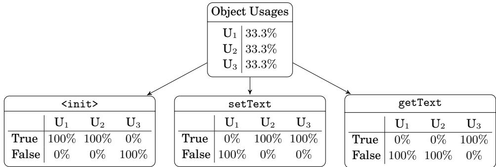
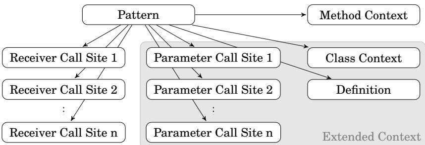
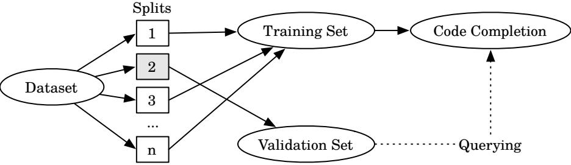
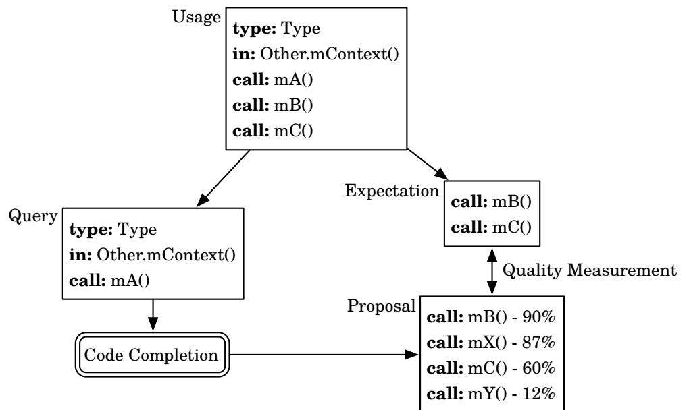
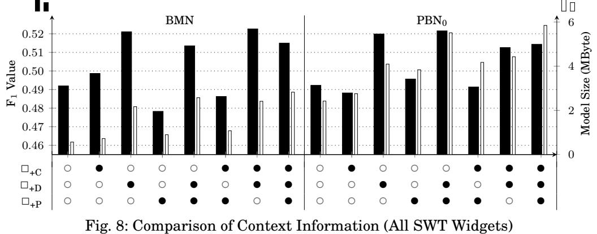
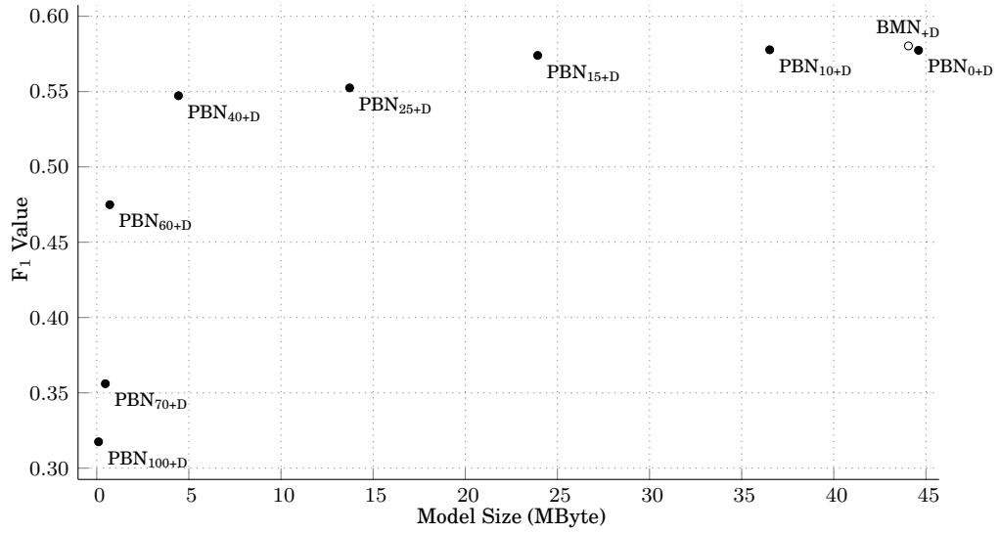
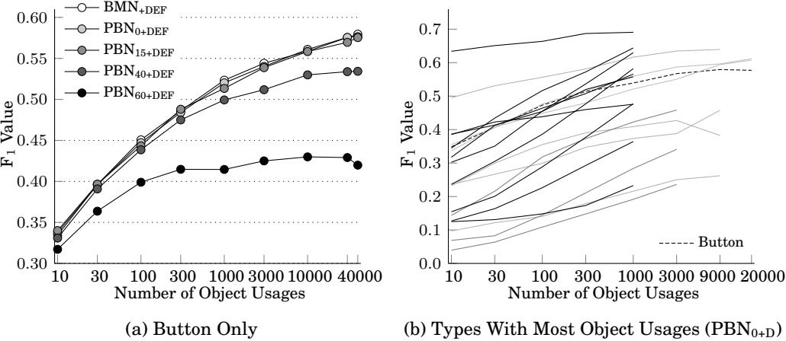
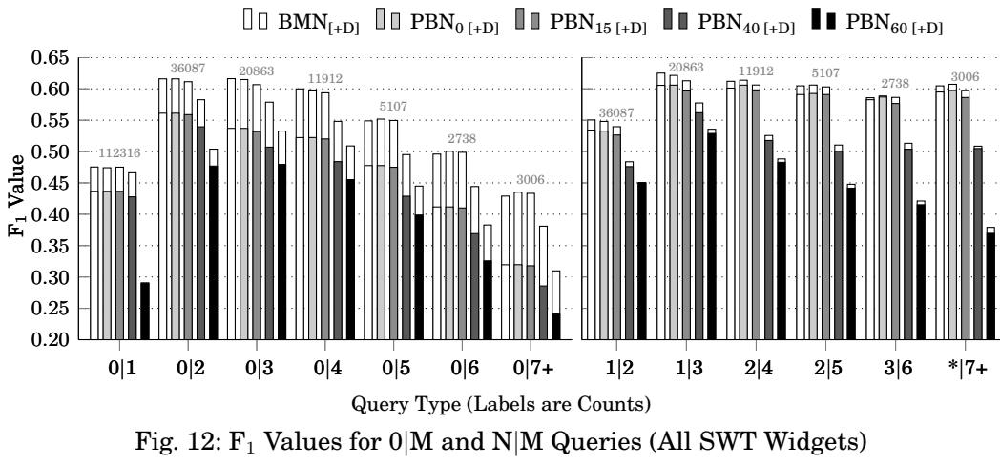
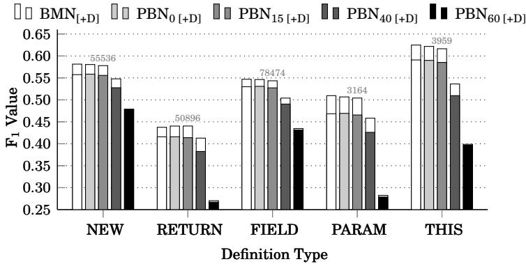

**This is a preliminary version of a paper that is accepted for publication in the ACM Transactions on Software Engineering and Methodology. This version is provided for reviewers of papers that reference this work and will be removed as soon as the publication process is completed. Please do not copy or redistribute this file.**

# **Intelligent Code Completion with Bayesian Networks**

SEBASTIAN PROKSCH, Technische Universitat Darmstadt ¨ JOHANNES LERCH, Technische Universitat Darmstadt ¨ MIRA MEZINI, Technische Universitat Darmstadt ¨

#### **Abstract**

Code completion is an integral part of modern Integrated Development Environments (IDEs). Developers often use it to explore Application Programming Interfaces (APIs). It is also useful to reduce the required amount of typing and to help avoid typos. Traditional code completion systems propose all type-correct methods to the developer. Such a list is often very long with many irrelevant items. More intelligent code completion systems have been proposed in prior work to reduce the list of proposed methods to relevant items.

This work extends one of these existing approaches, the Best Matching Neighbor (BMN) algorithm. We introduce Bayesian networks as an alternative underlying model, use additional context information for more precise recommendations, and apply clustering techniques to improve model sizes. We compare our new approach, Pattern-based Bayesian Networks (PBN), to the existing BMN algorithm. We extend previously used evaluation methodologies and, in addition to prediction quality, we also evaluate model size and inference speed.

Our results show that the additional context information we collect improves prediction quality, especially for queries that do not contain method calls. We also show that PBN can obtain comparable prediction quality to BMN, while model size and inference speed scale better with large input sizes.

Categories and Subject Descriptors: D.2.6 [**Software Engineering**]: Programming Environments—*Integrated Environments*; I.2.6 [**Artificial Intelligence**]: Learning—*Knowledge Acquisition*; K.6.3 [**Management of Computing and Information Systems**]: Software Management—*Software Development*

General Terms: Algorithms, Experimentation, Measurement, Performance

Additional Key Words and Phrases: Content Assist, Code Completion, Integrated Development Environments, Machine Learning, Evaluation, Code Recommender, Productivity

#### **ACM Reference Format:**

Sebastian Proksch, Johannes Lerch, and Mira Mezini, 2013. Intelligent Code Completion with Bayesian Networks. *ACM Trans. Softw. Eng. Methodol.* 9, 4, Article 39 (March 2010), 32 pages. DOI:http://dx.doi.org/10.1145/0000000.0000000

c 2010 ACM 1049-331X/2010/03-ART39 \$15.00 DOI:http://dx.doi.org/10.1145/0000000.0000000

Permission to make digital or hard copies of part or all of this work for personal or classroom use is granted without fee provided that copies are not made or distributed for profit or commercial advantage and that copies show this notice on the first page or initial screen of a display along with the full citation. Copyrights for components of this work owned by others than ACM must be honored. Abstracting with credit is permitted. To copy otherwise, to republish, to post on servers, to redistribute to lists, or to use any component of this work in other works requires prior specific permission and/or a fee. Permissions may be requested from Publications Dept., ACM, Inc., 2 Penn Plaza, Suite 701, New York, NY 10121-0701 USA, fax +1 (212) 869-0481, or permissions@acm.org.

#### **1. INTRODUCTION**

Code completion systems are an integral part of modern Integrated Development Environments (IDEs). They reduce the amount of typing required, thus accelerating coding, and are often used by developers as a quick reference for the *Application Programming Interface* (API), because they show which fields and methods can be used in a certain context. Typically, the context is determined by the static type of the variable on which the developer triggers the completion. However, using the static type of the variable as the only criteria for determining the developers's context, may produce spurious recommendations, thus diminishing the effectiveness of the completion system [\[Bruch](#page-29-0) [et al. 2009\]](#page-29-0): Showing the developer hundreds of recommendations (e.g., the type Text in the SWT framework of Eclips[e1](#page-1-0) lists 168 methods and field declarations) may be as ineffective as showing none. Many IDEs support prefix filtering to reduce the number of irrelevant recommendations. If completion is triggered on a prefix (e.g., toS*|*), then only proposals that start with that prefix (e.g., toString) will be shown. This effectively assists developers that know what they are looking for but, is of little help for developers that are unfamiliar with the API.

*Intelligent code completions* better target the needs of developers that are unfamiliar with an API. The FrUiT tool [\[Bruch et al. 2006\]](#page-29-1) and its successor using the *Best-Matching Neighbor* (BMN) algorithm [\[Bruch et al. 2009\]](#page-29-0), which resulted in Eclipse Code Recommender[s2,](#page-1-1) are examples of intelligent code completion systems. They use code repositories containing clients of an API to build a knowledge base that contains common usages for different types of that API. On a completion event, the models learned from the repositories are used to show relevant proposals. Besides the static type of the variable on which code completion is triggered, these systems also consider some structural context of the code being developed to select the models from which to extract the recommendations. The method within which the completion system was triggered is an example of such a structural context.

The usefulness of considering some form of structural context is illustrated in Figure [1.](#page-2-0) Here, the developer triggers code completion on the variable text. Like a standard code completion, an intelligent code completion system can determine that the static type of the variable is Text. But, additionally it can consider the following structural context features: (a) it was triggered inside the method createDialogArea, an overridden method originally declared in the type Dialog, and (b) the variable was assigned the result of the call to the constructor of Text. By considering typical usages, an intelligent code completion system may infer that the text widget is being initialized in the current situation, as indicated by both the enclosing method and the constructor call. Therefore, it proposes method calls known to appear in such contexts frequently, e.g., setText or addListener. Method calls that are unlikely in the given context (e.g., getText) appear at the end of completion proposals or are omitted altogether.

Bruch et al. [\[Bruch et al. 2009\]](#page-29-0) show that by applying the *Best-Matching Neighbor* algorithm and some context information to filter relevant usage patterns, intelligent code completions clearly outperform standard code completion systems with regard to prediction quality. Two metrics are used for judging prediction quality: precision and recall, which both need to be maximized. High precision means that a high percentage of proposals are relevant; high recall means that as few relevant proposals are missing in the recommended list as possible. Also, relevant method calls must be proposed before any irrelevant completions.

<span id="page-1-0"></span><sup>1</sup>http://www.eclipse.org/swt/

<span id="page-1-1"></span><sup>2</sup>http://www.eclipse.org/recommenders/

<span id="page-2-0"></span>

|            | MyDialog extends<br>Dialog<br>class<br>{<br>Text<br>text ;<br>private<br>@Override<br>void<br>createDialogArea ( Composite<br>parent )<br>{<br>text<br>= new Text ( parent );<br>text .<br>Cursor position, i.e., code<br>}<br>completion invoked here<br>} |            |                        |           |  |  |  |
|------------|-------------------------------------------------------------------------------------------------------------------------------------------------------------------------------------------------------------------------------------------------------------|------------|------------------------|-----------|--|--|--|
| Identifier | Type                                                                                                                                                                                                                                                        | Definition | Call Site              | Kind      |  |  |  |
| parent     | Composite                                                                                                                                                                                                                                                   | Parameter  | Text.<init>(Composite) | Parameter |  |  |  |
| text       | Text                                                                                                                                                                                                                                                        | New        | Text.<init>(Composite) | Receiver  |  |  |  |

Fig. 1: Example of a Code Completion and Extracted Information

However, the work presented in [\[Bruch et al. 2009\]](#page-29-0) represents only a first and partial step in investigating the design space of intelligent code completions. First, it lacks a comprehensive analysis of the kind of context to be considered and its effect on prediction quality. The structural context information used by this approach consists of the type of the receiver object, the set of already performed calls on the receiver, and the enclosing method definition. The effect of using additional context information (e.g., the enclosing class of the object, methods to which it was passed as an actual parameter, or information about its definition) on prediction quality is not considered. Second, the approach does not at all investigate two further important quality dimensions that need to be considered for code completion engines to effectively support developers: *inference speed* and *model size*.

First, it is of paramount importance that predictions are computed quickly, in order not to disturb the workflow of the developer. Based on prior research that analyzed the impact of user interface delays on users [\[Nielsen 1994\]](#page-30-0), we derive two timing constraints: (1) a code completion should provide information in less than 100 milliseconds to avoid any noticeable delay in the workflow of the developer, (2) it must answer in less than a second because the current thought of the developer is interrupted, otherwise. Given these constraints, it is infeasible to search for typical usages in large code repositories on the fly; typical usages must rather be extracted beforehand and provided in a model that allows efficient inference of potential completions. These models are provided for arbitrary framework types and are typically distributed over a network.

Second, we also need to take the model size into account, when evaluating an intelligent code completion system. It is preferable to have smaller models. As already mentioned, the models are usually distributed over a network and the distribution of small models is easier. Further, the models need to be loaded into the IDE of the developer and model size effectively affects the number of models that can be loaded simultaneously and the time necessary to read and deserialize them from the hard drive.

The three quality dimensions - prediction quality, prediction speed, and model sizes - are not orthogonal and the mutual effect they have on each other must be considered. The hypothesis is that prediction quality is increased by considering more features of the structural context. However, this will presumably increase the model size and negatively affect prediction speed. We need code completion engines that provide a good tradeoff between these quality dimensions or are even configurable along them.

This paper contributes towards tackling these problems. We will extract and use more context information than originally proposed and will show that this indeed im-

proves prediction quality by up to 3% at the cost of significantly increased model sizes by factor 2 and more. We propose *Pattern-based Bayesian Networks* (PBN) to tackle the issue of significantly increased model sizes, a new technique to infer intelligent code completions that enables to reduce model sizes via clustering.

Like BMN, PBN learns typical usage patterns of frameworks from data, which is extracted by statically analyzing source code repositories. Unlike BMN that uses a table of binary values to represent usages of different framework types in client code, PBN encodes the same information as a Bayesian network. A major technical difference is that PBN internally stores floating point values in multiple conditioned nodes, whereas BMN stores binary values in a table. A key consequence is that PBN allows to merge different patterns and to denote probabilities - instead of boolean existence - for all context information. We introduced a clustering approach for PBN that leverages this property and enables to trade-off model size for prediction quality. It is not clear how such a clustering could be adopted for BMN, because its binary representations does not allow for representing clustered results. While the approach is applicable to all object-oriented languages, our PBN implementation and evaluation is focussed on Java.

We perform comprehensive experiments to investigate the correlation between prediction quality and different model sizes. We show that by exploiting clustering PBN can indeed decrease the model size by as much as 90% with only minor decrease of prediction quality. We also perform a comprehensive analysis of the effect of input data size on prediction quality, speed and model size. Our experiments show that prediction quality increases with increased input data and that both the model size and prediction speed scales better with the input data size for PBN compared to BMN. With PBN, proposals can be inferred without noticeable delay even if thousands of examples are used as input.

To summarize, this work presents the following contributions:

- A description of (previously unpublished) implementation details of the existing static analysis of BMN to facilitate future replications.
- A novel extension of the static analysis that extracts the features required for machine learning to support extended contexts.
- An extensible inference engine for intelligent code completion systems, called Pattern-based Bayesian Network PBN.
- A novel approach for model training that uses the extended context information.
- A clustering approach for model learning that scales to large input sizes.
- An extensive evaluation of the resulting intelligent code completion system.

We have released downloadable artifacts to allow replication of our results.[3](#page-3-0) The released artifacts include all object usages used in this paper and the complete source code (i.e., all intelligent code completion engines and the evaluations). This should encourage other researches to compare their results based on the same data set.

The remainder of the paper is organized as follows. We start with a detailed description of our static analysis in Section [2.](#page-3-1) A detailed introduction of the intelligent code completion systems that we consider follows in Section [3.](#page-7-0) We continue with the evaluation in Section [4,](#page-13-0) threats to validity in Section [5,](#page-24-0) and related work in Section [6.](#page-25-0) The paper ends with an outlook to future work in Section [7](#page-27-0) and a conclusion in Section [8.](#page-28-0)

# <span id="page-3-1"></span>**2. STATIC ANALYSIS OF REPOSITORIES**

To learn how specific types of an API are typically used, we implemented a static analysis that extracts *object usages* from source code. The term object usage refers to

<span id="page-3-0"></span><sup>3</sup>http://www.st.informatik.tu-darmstadt.de/artifacts/pbn/

ACM Transactions on Software Engineering and Methodology, Vol. 9, No. 4, Article 39, Pub. date: March 2010.

an abstract representation of how an instance of an API type is used in example code and consists of two pieces of information: (1) all methods that are invoked on that instance and (2) the *context* in which the object usage was observed. The first captures the method calls that should be later proposed in the intelligent code completion. The second captures all information about the surrounding source code, i.e., the enclosing method and class. This idea is based on prior work [\[Bruch et al. 2009\]](#page-29-0), but it was not clearly described in the resulting publication. Our work contains a detailed description of the static analysis to allow other researchers to build their own implementations. Additionally, we extract more information than the original publication.

*Reusable Context Information.* The goal of the static analysis is to extract as much *reusable* context information from the source code as possible. In Object-oriented Programming Languages, there are two ways to make functionality reusable and to distribute it to others: *libraries* and *frameworks*. Libraries provide useful helpers that can be reused anywhere in your code. For example, the Java Database Connectivity (JDBC) API is an example of a library API. In such a context, an intelligent code completion engine can learn API protocols or which methods are usually invoked together. However, the surrounding source code usually refers to user-specifics, i.e., the names are unique and will never be re-used by other developers. This does not provide any information relevant for intelligent code completion. Contrary, a framework (e.g., Swing, the Java UI widget toolkit) is an example of the *inversion of control principle* [\[Martin](#page-30-1) [2003\]](#page-30-1). The framework authors decided for well-designed extension points and provide base classes and interfaces as the mean for extension. Custom functionality is added by extending or implementing these. Inside these custom functionality other building bricks of the framework are used. Because of that, the extensions of a framework contain useful pointers to overridden methods that can also be observed in source code of other developers. While intelligent code completion systems can also be provided for libraries, we focus on frameworks, because the surrounding code contains more context information and the intelligent code completion can provide more specific proposals.

Consider the example from Figure [1:](#page-2-0) the user-specific sub-class MyDialog extends the framework class Dialog. Learning how objects are usually used in a context referencing MyDialog does not provide shareable knowledge because other developers will name their user-specific subclass different than MyDialog, most likely. The extension point that was intended by the author of the framework was Dialog so we would reference this as the enclosing type. The enclosing method is even more concrete and follows the same pattern. Instead of pointing to MyDialog.createDialogArea, the analysis extracts Dialog.createDialog as the enclosing method. By going up in the class hierarchy as much as possible, we increase the likelihood that others use the same classes. This is valid because, according to the *Liskov Subsitution Principle* (LSP), the contract of all subclasses must not break the contract of the super class [\[Martin 2003\]](#page-30-1).

In addition to the information about the enclosing method, we further extend the notion of a *context* in this work and extract more information than in the original publication. We also capture the enclosing type context, all method invocations to which an object usage was passed to as parameter, and information about the definition of an object.

*Entry Points and Tracking.* We assume that the typical usage of a type is context dependent, therefore, we collect object usages separately for each context. Thereby, each public or protected method is considered as a single context and is used as an entry point for the analysis. Private methods do not form a context on their own, because they were created by the author of the concrete class, do not belong to the abstraction expressed in the base class or interface, and do not carry any reusable information. A call graph is computed for each entry point method *pentry*, in which all method invo-

```
public class A extends S {
  private Bb= new B();
  @Override
  public void entry1 ( ) {
    b .m1 ( ) ;
     helper ( );
    C c = fromS ( ) ;
     c . entry2 (b );
  }
  private void helper ( ) {
    b .m2 ( ) ;
  }
}
                                                   public class C {
                                                      public void entry2 (B b) {
                                                        b .m3 ( ) ;
                                                        entry3 ( );
                                                      }
                                                      protected void entry3 ( ) {
                                                        Dd= new D( );
                                                        try {
                                                          d .m4 ( ) ;
                                                        } catch( Exception e ) {
                                                          d .m5 ( ) ;
                                                        }
                                                      }
                                                   }
```

| Entry Point | Type | Class<br>Context | Method<br>Context | Definition | Call Site   | Call Site<br>Kind |
|-------------|------|------------------|-------------------|------------|-------------|-------------------|
| A.entry1    | B    | S                | S.entry1          | Field      | B.m1()      | Receiver          |
|             |      |                  |                   |            | B.m2()      | Receiver          |
|             |      |                  |                   |            | C.entry2(B) | Parameter         |
| A.entry1    | C    | S                | S.entry1          | Return     | C.entry2(B) | Receiver          |
| A.entry1    | S    | S                | S.entry1          | This       | S.fromS()   | Receiver          |
| C.entry2    | B    | Object           | C.entry2          | Parameter  | B.m3()      | Receiver          |
| C.entry3    | D    | Object           | C.entry3          | New        | D.m4()      | Receiver          |

Fig. 2: Object Usages Extracted From Three Entry Points

cations are pruned that leave the enclosing class. Additionally, all exception-handling edges are pruned from the intra-procedural control flow graph.

An object usage is created for every distinct object instance used in the scope of *pentry*. We use the call graph to track the object instances inter-procedurally in the class. The tracking stops on calls leaving the current class (e.g., calls to methods of other classes) or on calls in the current class that are either entry points or defined in a super class. In case we find a call to a private method, we step down in this method and *track* all objects of the current scope in the private method.

*Example.* We illustrate our static analysis in Figure [2.](#page-5-0) When starting at method A.entry1(), the analysis stores the method calls B.m1() and B.m2() on field b as well as the call to method C.entry2(B), for which b is used as an actual parameter. The call to method B.m2() is stored, because the private method A.helper() is called from within the entry point entry1() and b is tracked in it. b is not tracked in method C.entry2(B) (i.e., B.m3() is not stored) - even though it is called from within A.entry1() - because it is declared in another class than *pentry*. Instead of tracking b to this method, the static analysis stores the information that b is passed as an actual parameter to it. C.entry2(B) is another entry point for the static analysis. A separate object usage is created that extracts information about the usage of type B in the context C.entry2(B).

The interpretation of method invocations on this depends on the place of definition of the target method. Consider the call to A.helper in A.entry(). It is defined in the same class and it is no entry point, so the analysis steps down into the method and tracks all objects in it. In contrast to that, the call to S.fromS() is not tracked, because it is defined in another class. Objects are never tracked into calls to other entry points, independently of the defining class (same class or other class).

*Data structure.* The following list describes all properties that are collected for an *object usage*. The properties *Parameter Call Sites*, *Class Context*, and *Definitions* are introduced in this work. All other properties were previously used and are just included to complete the description.

- **Type:** The type name of a variable or, if discernible, the more specific type of an object instance. For example, if a String is assigned to a variable of type Object then String is stored as the type of this variable, if this is always the case.
- **Call Sites:** All call sites connected with the instance. These can be of two kinds:
	- *• Receiver Call Sites* are method calls invoked on the object instance. The statically linked method is stored. In the example in Figure [2,](#page-5-0) these are the methods m1() and m2() for variable b starting from entry point entry1().
	- *• Parameter Call Sites* are stored if the object instance is passed as the actual parameter to another method. The invoked method is looked up in the type hierarchy and the first declaration is stored, which can be an interface or an abstract base class to store the most reusable context reference. In the enclosing method entry1(), the method call entry2(B) is an example of a parameter call site for variable b. The argument index at which the object was passed is stored as well (omitted for brevity in the example).
- **Class Context:** The direct super type of the class enclosing *pentry*. In the example, the class context is type X for entry1(), and Object for entry2(B) and entry3().
- **Method Context:** The first declaration of *pentry* in the type hierarchy, i.e., the method declaration of a super type that is overridden by *pentry* or the method declaration in an interface that is implemented by *pentry*. In the example, A.entry1() overrides X.entry1(), therefore, X.entry1() is used as method context. If no method is overridden then the method itself is used as the context.
- **Definition:** Information about how the object instance became available in *pentry*. We distinguish five different definition kinds, each carrying specific information:
	- *• New:* The instance is created by calling a constructo[r4;](#page-6-0) the specific constructor is stored for this kind of definition. In the example, the object usage extracted for variable d in entry3() is defined by a call to a constructor. Note that field b of class A is not recognized as having a *new* definition, because the constructor is not called as part of the considered entry point.
	- *• Parameter:* The instance is a formal parameter of *pentry*; the parameter index is stored. In the example, the object usage extracted for b in entry2(B) is defined by a parameter.
	- *• Return:* The instance is returned by a method call; the name of the invoked method is stored. In the example, the object usage extracted for c is returned by a method call.
	- *• Field:* This definition kind denotes that the reference to the object was received by accessing a class field. We store the fully-qualified name of this field. In the example, the variable b used in entry1() is recognized as field.) If the field is initialized in *pentry*, e.g. assigned by a constructor call, then we refer to this definition instead, assuming it to be more precise.
	- *• This:* Denotes that the object usage was the receiver of the call to *pentry*. The same rules as for the enclosing methods apply here: only calls to methods de-

<span id="page-6-0"></span><sup>4</sup>In [\[Bruch et al. 2009\]](#page-29-0) constructor calls were treated as method calls. With the introduction of definition kinds as part of context information in this work this is changed.

ACM Transactions on Software Engineering and Methodology, Vol. 9, No. 4, Article 39, Pub. date: March 2010.

fined in any super type are collected. S.fromS() is an example of this definition in A.entry1(). However, the method A.helper() is not included, because it is defined in the same class as the entry point.

The static analysis always captures *fully-qualified* references to types, fields, and methods. A fully-qualified reference to a type includes the package name and the type name. A fully-qualified field name includes the fully-qualified declaring type, as well as the name and the fully-qualified type of the field. For a method it is the fully-qualified type of the declaring type, the method name, the fully-qualified return type, and fullyqualified types of parameters.

*Implementation.* We implemented the described algorithm to analyze arbitrary Java bytecode. Some context information are extracted from the class hierarchies so all types in the example code need to be fully-resolvable. Our implementation is based on WALA,[5](#page-8-0) the static-analysis toolkit for Java bytecode of IBM. We use the 1-CFA [\[Shiv](#page-30-2)[ers 1988;](#page-30-2) [Shivers 1991a;](#page-30-3) [Shivers 1991b\]](#page-30-4) implementation that is available in WALA for the points-to analysis to track object instances inter-procedurally. Note that the order of call sites cannot be retained because the 1-CFA implementation is flow insensitive. This is not an issue in our case since we already store call sites as unordered sets.

The work on the analysis was done in a cooperation with an external company; the source code of the analysis is proprietary and cannot be made public. However, as already mentioned in the introduction, we have released enough artifacts to make the results of the paper replicable even without the static analysis code.

### <span id="page-7-0"></span>**3. MODELS FOR INTELLIGENT CODE COMPLETION**

The object usages collected by the static analysis are the input data used to generate models for an intelligent code completion system. This paper compares two approaches to the design of such models. The first approach is the *Best Matching Neighbor* algorithm (BMN) [\[Bruch et al. 2009\]](#page-29-0). The second approach, called *Pattern-based Bayesian Network* (PBN), is a novel contribution of this paper.

We implemented both BMN and PBN to support the context information described in Section [2.](#page-3-1) Unfortunately, neither the original implementation of the BMN algorithms, nor the evaluation pipeline was publicly available so we had to re-build it. Both approaches have the same interface to the outside and take exactly the same input. This makes it very easy to replace the former implementation with the new one, both can be used interchangeably. In fact, the Eclipse Code Recommenders[6](#page-8-1) project adapted the PBN approach for their intelligent call completion in the meantime.

Both BMN and PBN can be queried with an incomplete *object usage* for a list of missing method calls. The proposed methods are ordered by the frequency of their occurrence in matching situations. Both BMN and PBN can be integrated into existing *code completion systems* of modern IDEs. Once the code completion is triggered, the query is generated automatically by analyzing the surrounding source code. The completions proposed by the models are integrated into the default code completion popup offered by the IDE. To propose a method, the equivalent non-recommended entry is looked up in the list of proposals given by the static type system. A newly created entry decorates the original proposal, includes the calculated confidence in its label, and is added to the top of the proposal list. A selection event is passed to the decorated proposal, no additional source code needs to be synthesized.

<span id="page-8-2"></span>

|          | Dialog.<br>createDialogArea | ModifyListener.<br>modifyText | <init> | setText | getText |
|----------|-----------------------------|-------------------------------|--------|---------|---------|
| Usage 1  | 1                           | 0                             | 1      | 0       | 0       |
| Usage 2  | 1                           | 0                             | 1      | 1       | 0       |
| Usage 3  | 0                           | 1                             | 0      | 1       | 1       |
| Query    | 1                           | 0                             | 1      | ?       | ?       |
| Proposal |                             |                               |        | 50%     | 0%      |

Fig. 3: Proposal Inference for BMN

# <span id="page-8-3"></span>**3.1. Best Matching Neighbor**

The *Best Matching Neighbor* (BMN) algorithm [\[Bruch et al. 2009\]](#page-29-0) is inspired by the *k-Nearest-Neighbor* (kNN) algorithm [\[Cover and Hart 2006\]](#page-29-2) and leverages domain knowledge specific to object usages. BMN represents each object usage as a binary vector, in which each dimension represents an observed *method context* or a *receiver call site*. In detail, each binary vector representing an object usage contains a "1" for each context information and call site that applies for the object usage at the corresponding dimension, and "0" otherwise. The model for each object type is a matrix that consists of multiple object usages, i.e., binary vectors. Each column in the matrix represents a context information or a call site. Each row represents an object usage found by the static analysis. For illustration, the matrix for the imaginary type Text is shown in the upper part of Figure [3.](#page-8-2) *Usage 1* is equivalent to the object usage of the Text widget listed in Figure [1.](#page-2-0)

Queries are partial object usages and treated similarly. A query is represented as a vector with the same dimensions as the vectors of object usages in the model. Each observed context information and all call sites already connected to the variable for which the completion is invoked are marked with a "1" in that vector. Context information that does not match is marked with a "0". All receiver call sites, which are not contained in the query, are potential method proposals, this is illustrated by marking them with "?". If a developer triggers code completion at the position illustrated in Figure [1,](#page-2-0) the query shown in the lower part of Figure [3](#page-8-2) is generated.

The nearest neighbors are determined by calculating the distance between the object usages and the query. The Euclidean distance is used as distance measure, whereby only dimensions containing a "1" or "0" in the query vector are considered. However, receiver call sites that do not exist in the query are not included in the calculation, because it cannot be decided if they are missing on purpose or if they should be proposed. The *nearest neighbors* are those *object usages* with the smallest distance to the query. Unlike kNN, all neighbors that share the smallest distance to the query are selected, not only the k nearest neighbors. In our example, *Usage 1* and *Usage 2* have both distance <sup>0</sup> and *Usage 3* has distance <sup>p</sup>3, thus the former two are nearest neighbors.

The nearest neighbors are considered for the second step of computing proposals. For each potential method proposal, the frequency of this method is determined in the set of nearest neighbors. The probability is computed by dividing it by the total number of nearest neighbors. In the running example in Figure [3,](#page-8-2) the call to setText is contained in one out of the two *nearest neighbors* of the query. Therefore, the call is recommended with a probability of 50%. The call getText is not contained in any nearest neighbor, the probability is 0%. The call sites are passed to the completion system as proposals for the developer, ordered by probability.

<span id="page-8-0"></span><sup>5</sup>T.J. Watson Libraries for Analysis (WALA), http://wala.sf.net/

<span id="page-8-1"></span><sup>6</sup>http://eclipse.org/recommenders/

ACM Transactions on Software Engineering and Methodology, Vol. 9, No. 4, Article 39, Pub. date: March 2010.

<span id="page-9-0"></span>

Fig. 4: Conditional Probabilities in a Bayesian Network

BMN was re-implemented for this work to be usable in the evaluation. We optimized it for inference speed of proposals and for model size. For example, we introduced an additional counter column in the matrix. Instead of inserting multiple occurrences of the same row, we increase the counter. In addition, we extended the model by more context information, represented as additional columns in the model matrix. Originally, only the method context and receiver call sites were included and we added support for the class context, definition, and parameter call sites to obtain a fair comparison of BMN and PBN. The inclusion in the table is configurable for all context information. We use this to evaluate if the extra context makes a difference.

### **3.2. Pattern-based Bayesian Network**

This paper introduces a novel approach for intelligent code completion called Patternbased Bayesian Network (PBN). Bayesian networks are directed acyclic graphs that consist of *nodes* and *edges*. A node represents a *random variable* that has at least two *states*, which again have probabilities. The states are complete for each random variable and the sum of their probabilities is always 1*.*0. Nodes can be connected by directed edges that indicate that the probabilities of the target node are conditioned by the state of the source node. A Bayesian network can be used to answer probabilistic queries about the modeled random variables. If the state of one variable is observed, this knowledge can be used to infer the updated probabilities of other variables. This has already been used in other areas, for example to rank web searches [\[Chapelle and](#page-29-3) [Zhang 2009\]](#page-29-3) or for recommendations in social networks [\[Yang et al. 2011\]](#page-30-5).

*Using Bayesian Networks as Code Completion Models.* PBN uses a Bayesian network to identify how likely specific method calls are, given that context information and potentially even other method calls have already been observed. The idea is to describe the probability of a method call conditioned by a specific object usage. We apply Bayes' theorem to answer the reverse question: how likely is a specific object usage, given that a method call is already present in the current code. This information can then be used to infer how likely other yet not present method calls are.

Figure [4](#page-9-0) shows the Bayesian network for the example from Figure [3.](#page-8-2) The *Object Usages* node has the states U1, U<sup>2</sup> and U3, representing *Usage 1* to *3* of Figure [3.](#page-8-2) We have observed three object usages and each of them exactly once, thus each has a probability of 33%. The remaining three nodes represent the method calls <init>, setText, and getText. The edge from the *Object Usages* node to the method call nodes indicate that the probabilities of the calls are conditioned by the object usage. The states of each method call node are *True* and *False*, which represents whether the method call appears in an object usage or not. For example, the call <init> is present in

*Usage 1*, but neither are setText nor getText. Therefore, the conditional probabilities for the different methods are:

$$P(\texttt{}|\mathbf{U}\_1) = 100\% \qquad P(\texttt{setText}|\mathbf{U}\_1) = 0\% \qquad P(\texttt{getText}|\mathbf{U}\_1) = 0\%$$

Please note that the correct notation is *P*(<init> = *true|*U1), but the check for the state is omitted for brevity. Although this kind of data is easily extractable from example object usages, we want to answer a different kind of question in the use case of code completion. It can be observed, for example, that the constructor <init> is called on an instance of type Text. The developer wants to know which method call is missing. Therefore, the probabilities of all method calls are calculated in such a case and method calls with a high probability are proposed as missing. Hence, if the method setText is one of the possible calls, we want to calculate the probability *P*(setText*|*<init>).

For the following equations, which show the calculations to answer the above question, we will need the probability of *P*(<init>). It is defined as the sum of the joint probabilities of <init> and each usage U*i*:

$$\begin{aligned} P(\text{citits}) &= \sum\_{i=1}^{3} P(\text{citits}, \mathbf{U}\_i) \\ &= 0.333 + 0.333 + 0 \\ &= 0.667 \end{aligned}$$

The probability of the method call setText, given that <init> was called before:

$$P(\texttt{setText}|\texttt{}) = \sum\_{i=1}^{3} P(\texttt{setText}, \mathbf{U}\_i | \texttt{})$$

Assuming the independence of all methods, Bayes' theorem can be applied to calculate the probability: [7](#page-10-0)

$$\begin{aligned} P(\mathsf{setText}, \mathbf{U}\_1 | \mathsf{}) &= P(\mathsf{setText} | \mathbf{U}\_1) \cdot P(\mathbf{U}\_1 | \mathsf{}) \\ &= \frac{P(\mathsf{setText} | \mathbf{U}\_1) \cdot P(\mathsf{} | \mathbf{U}\_1) \cdot P(\mathbf{U}\_1)}{P(\mathsf{})} \\ &= \frac{0 \cdot 1 \cdot 0.333}{0.667} = 0 \end{aligned}$$

The calculations of *P*(setText*,* U2*|*<init>) and *P*(setText*,* U3*|*<init>) are similar:

$$\begin{split}P(\texttt{setText},\mathbf{U}\_{2}|\texttt{}) &= \frac{P(\texttt{setText}|\mathbf{U}\_{2}) \cdot P(\texttt{}|\mathbf{U}\_{2}) \cdot P(\mathbf{U}\_{2})}{P(\texttt{})} \\ &= \frac{1 \cdot 1 \cdot 0.333}{0.667} = 0.5 \\\\P(\texttt{setText},\mathbf{U}\_{3}|\texttt{}) &= \frac{P(\texttt{setText}|\mathbf{U}\_{3}) \cdot P(\texttt{}|\mathbf{U}\_{3}) \cdot P(\mathbf{U}\_{3})}{P(\texttt{})} \\ &= \frac{1 \cdot 0 \cdot 0.333}{0.667} = 0 \end{split}$$

<span id="page-10-0"></span><sup>7</sup>Even though the methods might not be independent, previous work has shown that no direct correlation exists between the accuracy and the degree of feature dependencies [\[Rish 2001\]](#page-30-6). We will show in our experiments that the accuracy is comparable to existing techniques.

<span id="page-11-0"></span>

Fig. 5: Structural Representation of the Bayesian Network used in PBN

By combining the intermediate results, *P*(setText*|*<init>) can be calculated:

$$\begin{aligned} P(\mathbf{setText}|\mathbf{}) &= \sum\_{i=1}^{3} P(\mathbf{setText}, \mathbf{U}\_i | \mathbf{}) \\ &= 0 + 0.5 + 0 \\ &= 0.5 \end{aligned}$$

The interpretation of this result is that if <init> is observed for an object instance, a call to the method setText has a probability of 50%. The same calculations can be done to reason over getText. Generally, all states of context information and all calls present in the query are used as evidence in the Bayesian network. Accordingly, the probabilities of all remaining receiver calls are inferred with respect to these observations. These calls are collected in a proposal list that is ordered by probability.

If the query contains a combination of features never observed in the training data, proposals might be incomputable. To avoid such cases, we implemented *add-delta smoothing* in our learning algorithm [\[Chen and Goodman 1996\]](#page-29-4). A small delta of 0*.*000001 is added to all probabilities and their sum is normalized to 1*.*0 afterwards.

*Adding Context Information to the Network Structure.* So far, the Bayesian network presented in the example above does not include context information. To add the context information, the model is extended by adding more nodes that are conditioned by the object usage node. For example, the method context is modeled by a node that contains one state per observed method context. In contrast to call site nodes that only have two states, *true* and *false*, a state in the method context node corresponds to a method name and the number of states is not limited. Assume that the node contains M method contexts and, as it is conditioned by the pattern node with N patterns, the probability table of this node contains *M* ⇥*N* values. Each value describes how the corresponding method was observed, given a specific pattern. Other context information nodes are added in the same way.

The complete Bayesian network that will be used in experiments is illustrated in Figure [5.](#page-11-0) All nodes for call sites contain only two states, the nodes of the method context, the class context, and the definitions contain multiple states. Note the distinction between *receiver call sites* and *parameter call sites*.

Additionally, we changed the name of the root node from *Object Usages* to the more generic name *Pattern*, because the states of this node do not necessarily map exactly to observed object usages. In fact, we collapse all object usages that have the same receiver call sites into a single *pattern* state. Therefore, context information previously having conditional probabilities of 0% or 100% will now be represented by their frequency in the set of collapsed object usages. For example, consider the case of two

object usages for which both the method calls m1() and m2() were invoked. Additionally, assume that one usage was observed in method context C1 the other in C2. Both will be represented in a single state *P* of the pattern node, because they refer to the same combination of method calls. As the context was different for both, both method contexts m1() and m2() each have a probability of 50% given the pattern *P*. The probability of all states in the pattern node is calculated by normalizing their frequency.

<span id="page-12-0"></span>*Introducing Clustering for Improved Learning.* The number of detected patterns has a major impact on the size of the resulting model. Each detected pattern creates a new state in the pattern node so its size grows accordingly. Additionally, the number of stored values in all other nodes also depends on the number of patterns, because all nodes are conditioned by the pattern node. Each conditioned node needs to store an amount of values equal to the product of its own states and patterns. Therefore, reducing the number of states in the pattern node has a huge positive impact on the model size. We propose to use a clustering technique to reduce the number of detected patterns. Information may be lost in this process, because multiple *similar* object usages are merged and the quality of recommendations could be affected. On the other hand, clustering ensures the scalability of our approach. It is necessary to find a reasonable trade-off between model size and proposal quality.

We implemented a learning algorithm that is inspired by Canopy Clustering [\[Mc-](#page-30-7)[Callum et al. 2000\]](#page-30-7) to detect patterns for the PBN model. Similar to Canopy, a random object usage is chosen from the set of all object usages found for a specific type. This object usage becomes a cluster center. Each object usage that has a smaller distance to this cluster center than a specific threshold is assigned to the cluster and is removed from the set of object usages still to be assigned to clusters. The algorithm proceeds until all object usages are assigned to clusters. Each cluster becomes a state of the pattern node in the resulting Bayesian network. The probability of the pattern state is the number of object usages in that cluster divided by the total amount of object usages. Each value, i.e., call site or context that was set in any object usage belonging to the cluster, gets a conditioned probability reflecting the frequency of the respective value in the cluster.

To determine the distance between two object usages, the cosine similarity [\[Strehl](#page-30-8) [et al. 2000\]](#page-30-8) is used, which is also a common choice in the research area of information retrieval. There, vector representations have similar characteristics as in the context of representing object usages: they are typically sparse and high-dimensional. Cosine similarity can deal with such vector characteristics well [\[Schultz and Liberman 1999\]](#page-30-9). It is defined as the angle between two *vectors v*<sup>1</sup> and *v*2:

$$d\_{cosine} = 1 - \frac{v\_1 \cdot v\_2}{|v\_1| \cdot |v\_2|}$$

It has a helpful property for distance calculation between object usages: If vectors differ, their distance gets smaller with the number of (set) dimensions they have in common. For example, the distance between two vectors that differ by one call without having another call in common is bigger than the distance between two vectors that differ by one call but that have one or more calls in common. Note, that 1*.*0 is the maximum distance calculated by cosine similarity. A geometrical interpretation of this distance is that two vectors are orthogonal and no dimension is set for both.

Although this clustering approach is very simple, our experiments show reasonable results. The algorithm is fast and can handle huge amounts of data. Also, it implicitly solves the question of how many patterns are to be found, which for many clustering algorithms must be defined upfront. Additionally, the distance threshold can directly control the trade-off between prediction quality and model size. For example, the min-

ACM Transactions on Software Engineering and Methodology, Vol. 9, No. 4, Article 39, Pub. date: March 2010.

<span id="page-13-2"></span>

Fig. 6: One Iteration of an n-Fold Cross Validation

imum threshold 0*.*0 results in practically no clustering at all. The higher the value chosen, the more information will be lost and the smaller the size of the model will become. In the following sections, we will encode the concrete threshold used for a PBN instance in the name, e.g., a PBN10 instance uses a distance threshold of 0*.*10. By using a threshold of PBN100, all usages are merged into a single pattern. In that case, the model degenerates to a simple call-frequency based model in which context information has no influence on the proposals anymore.

### <span id="page-13-0"></span>**4. EVALUATION**

Two different recommender engines have been discussed in the last section. Both approaches can be used interchangeably: they work on the same input data generated by the same static analysis, have the same interface to the outside, and create the same kind of proposals. Differences between them will studied by a comprehensive evaluation in this section.

### <span id="page-13-3"></span>**4.1. Methodology**

The evaluation of previous recommender systems is usually focused on comparing prediction quality of different algorithms, performance or mode sizes are only mentioned as a side note.[8](#page-13-1) While we also thoroughly evaluate prediction quality, we also focus on additional criteria. Since recommender systems are supposed to be used by humans on typical developer machines with limited resources, we believe that an (empirical) evaluation of recommender systems should take two additional properties into consideration: (1) time needed to compute proposals and (2) size of the models that are used to make the proposals.

*Evaluating the Prediction Quality.* We evaluate each type in an API under investigation separately with a 10-fold cross-validation. We split all available object usages for a single type that have been extracted from the static analysis into 10 different splits as shown in Figure [6.](#page-13-2) Ten folds are built out of these splits, whereby each fold consists of one split used as *validation set* and the union of the remaining nine splits as *training set*. For each fold, models are learned from the training set and the validation set is used to query these models. Accordingly, it is guaranteed that no object usage is used for training and validation at the same time.

Our experiments have shown that intra-project comparisons introduce a positive bias to prediction quality. We want to avoid this kind of bias to better reflect development reality, i.e. the intelligent code completion engine is used in a code base that was not used to learn the models. Therefore, we ensure that all object usages generated from the same project are assigned to the same split. This means that the set

<span id="page-13-1"></span><sup>8</sup>For example in [\[Li and Zhou 2005;](#page-30-10) [Bruch et al. 2009;](#page-29-0) [Zhang et al. 2012\]](#page-31-0)

ACM Transactions on Software Engineering and Methodology, Vol. 9, No. 4, Article 39, Pub. date: March 2010.

<span id="page-14-0"></span>

Fig. 7: Conceptual Illustration of the Evaluation of a Single Proposal

of projects used to create queries is disjoint from the set of projects used to built the model. As a result, we can only include types in the evaluation that are used in at least 10 different projects and the sizes of the splits differ slightly, especially if the total number of object usages is small for a specific type.

Each usage from the *validation set* is used to query the model and to measure the results. This approach is illustrated in Figure [7.](#page-14-0) A *query* is created by removing information from a complete *usage*. The resulting incomplete usage is used as a *query*, and the removed information constitutes the *expectation*. When a completion is requested by passing a query, the recommender engine returns a list of *proposals* in descending order of the proposals confidence value. We follow previous work and filter all proposals with a confidence value lower than 30% [\[Bruch et al. 2009\]](#page-29-0). The *proposals* are compared to the *expectation* and the *F*<sup>1</sup> measure is calculated to quantify the quality of a given proposal. *F*<sup>1</sup> is the harmonic mean of the two measures *precision* and *recall*:

$$precision = \frac{\#hits}{\#proposed} \qquad recall = \frac{\#hits}{\#expected} \qquad F\_1 = 2 \cdot \frac{precision \cdot recall}{precision + recall}$$

Call sites are stored in an *unordered set*, so no information is available on the order in which the calls happen. We use different strategies of removing both receiver and parameter call sites to create queries. Other context information (e.g., the enclosing method) is not removed, because we think that they always exist in the context of a framework.

We make use of two different strategies to remove call sites from the set. The *No Calls* strategy removes all call sites and therefore creates exactly one query for each usage. This mimics a developer that starts to work in a new method and triggers code completion to get a first impression of what to do. The resulting queries are denoted as 0*|*M queries, where M is the number of receiver calls contained in the original object usage (i.e., a 0*|*3 query contains no calls from the three calls that are contained in the original object usage). The *Partial Calls* strategy removes *about half* of the call sites

(i.e., 0*|*1, 1*|*2, 1*|*3, 2*|*4, ...). The resulting queries are denoted as N*|*M queries, where N is the number of calls contained in the query, and M the number of calls in the original object usage. Both N and M refer to a number of receiver call sites. This strategy simulates developers, who started to do some work in a specific context, but came to a point where they did not know how to continue and trigger code completion for help. There are *<sup>M</sup> N* possibilities to remove calls from the set. Because this number gets impractically large with a growing number of calls in the set, only 3 random N*|*M queries are taken. We calculate the average result of these queries to merge the separate results into a single result value and store it as the quality for the originating object usage. Parameter call sites are removed separately with the same strategy. however, they are not part of the notation, as they are only context information and not proposed by the completion system. If not stated otherwise, the *Partial Calls* strategy is used in all experiments of this paper.

*Evaluating the Model Size.* The model size can be determined empirically by measuring the memory representation in the Java Runtime Environment (JRE). However, the result of this approach depends on implementation details of the model, the used JRE, and characteristics of the garbage collection, which might induce considerable noise. We decided to use a more simple approach of calculating the theoretical model size of the raw information that is contained. For BMN, the size is calculated by multiplying the number of rows in the table by the size of each row. For PBN, the total number of stored float values in the Bayesian network is calculated. We calculate the size in Byte for both approaches to create comparable values.

*Evaluating the Inference Speed.* All computations that depend on context information can be made efficient by pre-computing as much as possible and storing this information in the model. The pre-computation does not need to be fast, because it can happen offline on a powerful server. However, using intelligent code completion requires several steps which are complex to compute whenever code completion is activated:

- (1) Analysis of the working context in which the completion was triggered
- (2) Building a query
- (3) Loading of the appropriate model, used to answer the query
- (4) Inference of relevant method calls
- (5) Rendering of the code completion popup

The perceived duration of the completion task for the user is the sum of all of these steps, but not all of them are evaluated in this paper: the static analysis of the workingcontext is the same for BMN and PBN. Therefore, step 1 is not considered. All models are pre-computed and stored in a serialized form. To be usable, they need to be deserialized again and loaded into memory. Nevertheless, by using caches this loading time can be avoided in most cases. Additionally, I/O increases noise in performance measurements and the loading time itself mostly depends on the framework used for serialization. Therefore, we ignore step 3 as well. The two steps 2 & 5 are trivial compared to other phases and can safely be ignored. Step 4 is of relevance for this paper. First, it depends on the size of represented data in a model and is critical for scalability. Second, the inference process differs between the models.

The precision of timing information that can be read from the system timer is milliseconds[.9](#page-15-0) To increase the precision of the results, we (1) measured the total computation time for all proposals and divided this time by the number of queries and (2) ensured that at least 3000 proposals are requested per type. The second point mainly

<span id="page-15-0"></span><sup>9</sup>http://www.ibm.com/developerworks/java/library/j-benchmark1/

ACM Transactions on Software Engineering and Methodology, Vol. 9, No. 4, Article 39, Pub. date: March 2010.

addresses the evaluation for types with only a few object usages, because here the typical answer times are smaller than a millisecond. We repeated all experiments that include timing three times and calculated the average to overcome slight deviations caused by potential interfering processes.

Our experiments showed that the just-in-time compilation of modern runtime environments has a significant impact on the performance of the inference. The steady state is reached after thousands of queries for each model. Although this might be unrealistic for a practical usage of the completion system, we decided to repeat all experiments that evaluated inference speed multiple times until the resulting values were stable to create comparable and repeatable results.

*Experimental Setup.* To speed up the experiments, we implemented a map-reduce like computation in the evaluation framework and distributed the computation to multiple worker threads running on different machines. All machines were running Oracle Java 8 SE[.10](#page-16-0) Experiments that include measurement of timings were run locally on an Intel Core i7 machine.[11](#page-16-1) We designed the evaluation such that the results are not influenced by disc I/O (e.g., loading all necessary data into memory before starting the evaluation), hence further information about the storage system is omitted.

*Data set.* The SWT framework[,12](#page-16-2) the open-source UI toolkit used in the Eclipse development environment, is used to evaluate the code completion engines presented in the previous section. For both approaches, we learn from and test against SWT example code. We chose a snapshot of the Eclipse Kepler update sit[e13](#page-16-3) - the main source of plug-ins for all Eclipse developers - as the code base. We assume that the API usage reached a stable state because the source code is already released and no longer under development. Changes to it are only due to bugs being fixed. Our static analysis identified about 190,000 object usages for different SWT widget types within the 3,186 contained plug-ins. The type org.eclipse.swt.widgets.Button is by far the type with the most usage data with more than 47,000 object usages.

# **4.2. Analyzing Impact of Additional Context Information**

Section [2](#page-3-1) presented the context information that we collect per object usage. Three kinds of context information - the type of the receiver, the receiver call sites, and the enclosing method definition - were previously used for code completion recommendations. The other three kinds - parameter call sites (2+P), class context (2+C), and definitions (2+D) - are introduced in this work.

In this section, we investigate whether the new context information can be used to improve the quality of the intelligent code completion. The baseline for this experiment are models that do not use the new context information. We compare this to the models that are created with the new context information and exhaustively evaluate all combinations of enabled information classes. First, we activate all information classes separately, then we activate pairs (2+DP, 2+CP, 2+CD), and in the end, we activate all together (2+ALL). We are especially interested in first insights about the trade-off between increased model size and prediction quality gain.

We use all available object usages in this experiment that were extracted for types that belong to the org.eclipse.swt.widgets package. We average the prediction quality over all queries and average the model size over all models generated for different types. However, it is necessary to be cautious with the interpretation of the model size

<span id="page-16-0"></span><sup>10</sup>Java(TM) SE Runtime Environment (build 1.8.0 25-b17) with heap settings -Xmx3g

<span id="page-16-1"></span><sup>11</sup>Intel Core i7 with 2.8Ghz and 16GB of RAM with a clock speed of 1600Mhz

<span id="page-16-2"></span><sup>12</sup>http://www.eclipse.org/swt/

<span id="page-16-3"></span><sup>13</sup>http://download.eclipse.org/releases/kepler/, accessed September 30, 2013

ACM Transactions on Software Engineering and Methodology, Vol. 9, No. 4, Article 39, Pub. date: March 2010.

<span id="page-17-0"></span>

in this plot, for two reasons: First, a simple average puts an emphasis on types with only few object usages: the available input is not equally distributed among the types, the majority of object usages is extracted for a minority of types. Therefore, the resulting model sizes shown in the plot are biased towards small input sizes. Second, it is not possible to directly compare model sizes for BMN and PBN in this plot. As we will see in a later subsection, their implementation make them scale differently for types with only a few object usages. All the same, we decided to include the model size. Even though it is necessary to read it with caution, it is a first indicator of the impact of a specific information class on the resulting model size. The exact impact of the amount of available input on model sizes is analyzed in a later subsection.

Figure [8](#page-17-0) shows the experiment results. The horizontal axis of the plot shows different configurations of context; the legend under the plot shows which context information is used in each configuration. The vertical axis is organized in two dimensions: the prediction quality (on the left) is depicted with black bars and the average model size (on the right right) is depicted with smaller white bars. The plot contains results for different BMN and (unclustered) PBN0 models.

When comparing the configurations with activations of each context information kind in isolation, 2+D is the context information with the biggest impact (third bars in the plots of both BMN and PBN). Compared to baseline, this configuration increases the F<sup>1</sup> value by 0*.*03, which represents an improvement of 6% for both BMN+D and PBN+D. However, this comes at the cost of a model size that is three times bigger for BMN+D and 1*.*7 times bigger for PBN+D. The results are indecisive for both 2+C and 2+P: In case of BMN, the prediction quality is slightly increased for BMN+C and decreased for BMN+P, but it is the other way around for PBN0. We consider both deltas irrelevant for the results as they are small (i.e., 0*.*01). While 2+C has only a minor effect on the model size, 2+P significantly increases it.

2+D is the dominating context information; the others seem to be negligible.

The results are similar when multiple context information kinds are activated together. We can ignore 2+CP, because the prediction quality gain is low. In case of BMN+CP, it is even lower than the baseline. Both 2+CD and 2+DP show a comparable prediction quality to 2+D. However, the introduction of both information classes increases the model size. We conclude that adding them is unnecessary, since they do not increase the prediction quality. For both BMN and PBN the 2+ALL configuration leads to worse results. Presumably, the reason for this is that queries become too spe-

<span id="page-18-0"></span>

Fig. 9: Quality and Size of Different Recommenders (About 47,000 Usages for Button)

cific, i.e., different object usages become more similar because they share irrelevant features. However, we did not further analyze this result.

Given the results, in the remaining experiments, we focus on the evaluation of 2+D approaches only. Next, we investigate ways of reducing the model size of PBN via clustering and analyze the effect of doing so on the prediction quality. The model size cannot be reduced for BMN: BMN+D and PBN0 will be our reference points regarding prediction quality.

#### **4.3. Distance Thresholds of the Clustering for PBN**

In Subsection [3.2](#page-12-0) we introduced a clustering technique to reduce the size of learned models. Now, we compare BMN to several instances of the PBN approach that all have different thresholds for the clustering. The distance threshold is used to control how much information is dropped during the clustering. Recall that the threshold is encoded in the name, e.g., a PBN15 configuration clusters all data points with a mutual distance of less than 0*.*15. PBN0 is the unclustered instance. We conduct this experiment to identify distance thresholds that provide useful trade-offs between prediction quality and model size.

Model sizes will not only depend on the chosen threshold, but also on the number of available usages for a type. Therefore, this Subsection has a focus on org.eclipse.swt.widgets.Button. With about 47,000 usages, this is the type for which we have extracted the most object usages.

The results of this experiment are illustrated in the scatter plot in Figure [9.](#page-18-0) The plot contains data points for BMN+D and for several PBN+D variants with different distance thresholds. All points are positioned according to their respective model size in Megabytes and prediction quality denoted by the *F*<sup>1</sup> measure.

The plot shows that the data points for BMN+D and for the unclustered PBN0+D are very close. This means that they exhibit similar model sizes and prediction quality. The model size can be reduced through clustering by setting the distance threshold. Even with a conservative distance threshold of PBN15+D, it is already possible to significantly reduce the model size with virtually no effect on the prediction quality. If

ACM Transactions on Software Engineering and Methodology, Vol. 9, No. 4, Article 39, Pub. date: March 2010.

the threshold is further increased, a small decrease in quality can be measured while the model size constantly decreases. The imaginary curve that connects all PBN instances in the plot has an inflection point at PBN40+D. This inflection point seems to be a moderate clustering that leads to a good tradeoff between prediction quality and model size.

PBN40+D saves 90% of the model size with a F<sup>1</sup> decrease of only 0*.*03.

If the threshold is even further increased, the clustering generates fewer and fewer patterns, because all object usages are aggressively merged. This leads to a very fast decrease in prediction quality. The prediction quality of PBN60+D decreases by 0*.*08 when compared to PBN40+D. However, the model size is comparable to the minimal model size of the PBN100+D approach. The prediction quality drops significantly if the threshold is increased beyond 0*.*60. These cases can be ignored as the model size is already negligible for PBN60+D.

In summary, the distance threshold can be used to control the tradeoff between model size and prediction quality depending on the use case. The maximum prediction quality is provided by BMN+D or from the unclustered PBN0+D instance (there is no measurable difference between them); however, both come with large model sizes. If a small model size is important, then the aggressive clustering of PBN60+D still provides a reasonable prediction quality. For use cases, where both model size and prediction quality are important, PBN15+D or PBN40+D seem to be provide good trade-offs. We use these three thresholds in the remaining experiments to create clustered instances, in addition two the two unclustered variants.

The PBN distance threshold can be used to control the tradeoff between model size and prediction quality.

#### **4.4. Scale to Large Input Sizes**

We now look at the effect of increasing the number of object usages on the prediction quality, model size, and inference speed. We wanted to investigate two different questions: (1) How do different approaches scale from smaller to bigger input sizes? (2) Is it possible to further increase prediction quality by using bigger datasets. We wanted to extrapolate the results to predict saturation effects, i.e., when providing more usages will not increase prediction quality.

The experiment is limited to org.eclipse.swt.widgets.Button, because it is the only type for which we have more than 40*,* 000 object usages available. A random subset of all available object usages was used to conduct a cross-fold validation. We started with a minimal set of object usages and exponentially increased the input size in all experiments of this subsection. To get stable results, we ran three iterations for each input size and stored their average result. The previously chosen representative PBN instances and BMN are used in this experiment, all include 2+D context information.

*Model Size.* The impact that scaling the input size has on the model size is shown in Figure [10a.](#page-20-0) The input size is shown on the logarithmic horizontal axis and the resulting model size in Megabytes is shown on the vertical axis. The plot shows that the model size for PBN0+D is generally bigger than BMN+D. However, the model size grows faster with an increasing input size for BMN+D. At an input size of 40*,* 000, both have a comparable model size. We could not evaluate larger input sizes, but the plot shows that the model size of BMN+D grows faster. A non-logarithmic plot of the same values, which we omit for space reasons, shows a linear increase for BMN+D and a logarithmic increase for all PBN instances. If we extrapolate the results to more object usages, we expect that BMN+D has bigger models than PBN0+D. This is even more

<span id="page-20-0"></span>

Fig. 10: Effects of Increasing Number of Object Usages (Button)

obvious for clustered instances: the break-even for PBN15+D is reached at ⇠ 10*,* 000 usages, and at even less than 3*,* 000 usages for PBN40+D and PBN60+D.

The model size of PBN scales better than BMN with the input size.

*Inference Speed.* The impact of the scaled input size on the inference speed is shown in Figure [10b.](#page-20-0) The input size is shown on the logarithmic horizontal axis and the resulting inference speed in milliseconds is shown on the vertical axis. The plot shows that inference speed is irrelevant for input sizes less than 10*,* 000. However, starting from 3*,* 000, the slope of the BMN+D plot is much higher. A non-logarithmic plot, which we omit for space reasons, shows a linear increase for BMN and a logarithmic increase for PBN.

Inference speed is significantly higher with PBN and scales better than with BMN.

Section [4](#page-13-0) introduced time limits for the proposal for inference. The imperceivable delay of 100 milliseconds is hit by BMN+D at about 15*,* 000 usages. If the input size is larger than that, a delay is perceivable in the code completion. By extrapolating the results beyond 40*,* 000 object usages, it becomes obvious that a further increased input size soon exceeds the limit of a second. This would interrupt the developer's thought process and would present a disturbance in the work flow.

The inference computation of PBN is significantly faster than this limit. Even the unclustered PBN0+D takes only 15ms to compute the proposals with 40*,* 000 object usages. The inference speed is even higher for the clustered PBN instances. By extrapolating the results, it is obvious that the input size can be significantly increased before any time limit is reached.

Input size can be significantly increased before inference speed is an issue for PBN.

*Prediction Quality.* The last property to analyze was the impact of the scaled input size on the prediction quality. The results are shown in Figure [11.](#page-21-0) In both plots, the input size is shown on the logarithmic horizontal axis, the prediction quality denoted by the *F*<sup>1</sup> measure is shown in the vertical axis.

Figure [11a](#page-21-0) was created with input of Button only to compare the results of different approaches. Unsurprisingly, the plot shows that increasing the input size has a positive impact on prediction quality. BMN+D and PBN0+D show equal prediction quality and no

39:22 Proksch et al.

<span id="page-21-0"></span>

Fig. 11: Prediction Quality for Increasing Amounts of Object Usages per Type

difference in scaling behavior: the plot is flattening for larger input sizes, even though it has a logarithmic scale. The interpretation of this is two-fold: First, it is possible to see saturation effects starting at about 1*,* 000 object usages, i.e., every tripling of the input size leads to a smaller increase in prediction quality. This is a promising result, because for most types there is not so much input available. Second, even though the gain in prediction quality constantly decreases, it is still possible to further increase it by using more input. By extrapolating the results for larger input sizes, it seems that the boundary for Button is an F<sup>1</sup> value of 0*.*6 0*.*65.

First saturation effects can be observed with an input of 1*,* 000 object usages, use more input to maximize prediction quality.

The plot also contains the results of the three clustered PBN instances. Even though we have seen in the previous experiments that PBN15+D scales significantly better with input size than the unclustered PBN0+D, the prediction quality is exactly the same. If the clustering is more relaxed, a negative impact on the prediction quality can be seen. For PBN40+D, there seems to be a gap in prediction quality if more than 300 usages are used. For PBN60+D, the prediction quality seems to saturate between 300 1*,* 000 usages. Both results suggest that there might be potential to improve the clustering approach, which we want to address in future work.

Using PBN15+D for large input sizes preserves a reasonable prediction speed and model size, without negative effect on prediction quality.

We further analyzed whether these results for Button also hold for other types. Therefore, we conducted the same experiment for all types of SWT for which we could extract at least 1*,* 000 object usages. We used PBN0+D for the comparison. The results are shown in Figure [11b.](#page-21-0) The result for Button, which has already been shown in previous Figures, is shown as the dashed line. Lines that are not continued to the end of the plot belong to types for which we do not have enough object usages. The plot is not meant to present quantitative results of how well models for these types work, but to qualitatively illustrate general trends of saturation effects. The plot shows that recommender systems do not work equally well for all types: Some already start on a high F<sup>1</sup> level, others barely reach an F<sup>1</sup> level of 0*.*2 with models learned from 3*,* 000 usages. However, all plots roughly point into the same direction, which means that their

<span id="page-22-0"></span>

scaling with the input size is comparable and that the previous findings are also valid for all of them.

*Lessons Learned.* The experiments have shown that it is possible to increase the prediction quality even further by using more than 40*,* 000 usages as input. However, the number of input values that lead to further improvement grows exponentially. Such large input data sets make the evaluation very time consuming, though, because with a n-fold cross validation every usage is used as a query once. In total, we had an input data set of over 190*,* 000 usages. Even for fast code completion configurations, which infer the proposals in less than 100ms, computing all queries takes about 5*.*5 hours. All experiments exercised more than one configuration, including very slow ones that need more than a second for inferring proposals, therefore, a complete evaluation run took more than 7 days for some experiments.

We have shown that for our data set the prediction quality is already very close to the expected maximum with an input size of 10*,* 000 to 30*,* 000 usages. Even though we used all available input in our experiments, we postulate that it is enough to use only a subset to get reasonable evaluation results, as long as this subset is large enough. For future evaluations, a faster and nevertheless valid approach may be to run experiments multiple times with randomly selected subsets and to average the results. This would speed-up the experiments significantly without invalidating the results.

# **4.5. Closer Look at the Prediction Quality**

All experiments in prior sections were focussed on very general questions regarding configuration and scaling. We are also interested in a better understanding of the prediction quality of the recommender. This last series of experiments analyzes the impact of the new context information in different scenarios. We identify scenarios that greatly benefit from the added context information, but we also point to examples in which the added context information does not make a difference.

*Different Query Types.* We compare the results for different types of queries. We use two kinds of queries for the experiment: *No Calls* queries that do not contain any calls (i.e., 0*|*M) and *Partial Calls* queries that preserve about half of the calls from the original usage (i.e., N*|*M). As motivated in the description of the methodology in Section [4.1,](#page-13-3) these query types represent two different use cases.

<span id="page-23-0"></span>39:24 Proksch et al.



Fig. 13: Results for Different Definition Sites (All SWT Widgets)

The plot in Figure [12](#page-22-0) shows the results for the different recommender instances. The filled bars represent the result for instances that do not consider the additional context information. All bars have a white extension on top that represents the increase in prediction quality gained by considering 2+D. The rightmost category in both parts of the plot contains the aggregated results of all queries that contained 7 or more method calls and therefore did not fit into another category (i.e. 0*|*7+ contains 0*|*7, 0*|*8, ...; \**|*7+ contains 3*|*7, 4*|*8, 4*|*9, ...). The small grey number over the bar groups denotes the amount of queries that fall into this category.

Let us first consider only the filled bars of the approaches without additional context information. We find that 0*|*1 seems to be a special type of query for two reasons. First, it occurs about three times as often as 0*|*2 but the prediction quality is lower. Second, compared to the other query types and to PBN0, the impact of the clustering on prediction quality is notably different for PBN60 (i.e., 0*.*15 vs. ⇠ 0*.*08). All approaches show similar characteristics: they have a jump in prediction quality from 0*|*1 to 0*|*2, but the prediction quality constantly decreases for 0*|*2+ queries. However, the decrease is uniform for all approaches.

Prediction quality stays roughly on the same level across all N*|*M categories. Only PBN60+D exhibits a decreasing F<sup>1</sup> value for increasing M values. Both plots suggest that calls seem to be a very important piece of context information. Additionally, calls seem hard to predict when no other calls are given already, the F<sup>1</sup> value of 0*|*M is lower across all approaches.

Patterns that contain many calls are hard to predict if queries contain no calls.

Now, let us consider the white bar on top of all results, which represents the delta in prediction quality introduced by considering 2+D. The plot shows that the additional context information leads to a general increment of prediction quality. However, the increment is so small for some combinations that the white box is invisible.

A special case is the 0*|*M queries, which show a big delta. Apparently, the additional context information is especially helpful in situations where no calls are included. The delta seems to be comparable between all other query types and between all approaches, the differences seem to be negligible. It only seems to be a bit bigger for 0*|*7+ queries. The benefit of the additional context information for N*|*M queries is smaller, but present.

The greatest benefit of using 2+D is gained for queries that do not contain any calls.

*Different Definitions.* To get a better understanding about the scenarios in which the recommender systems performs well, we conducted an experiment that evaluated the different kinds of definition information discussed in Section [2](#page-3-1) separately. We generated queries with the *Partial Calls* strategy for the available object usages of all SWT types. The resulting F<sup>1</sup> value is the average over all queries.

The results of this experiment are shown in Figure [13.](#page-23-0) Each bar group in the plot represents a definition kind, denoted in the horizontal axis. Each single bar reflects the results for a specific approach. The filled part of the bar is the result if no additional context information is used, while the white part on top represents the delta introduced by 2+D. The small numbers attached to the bars denote how many queries are available for this kind of definition, please note the large differences in these numbers. Compared to the other definitions, there are only few usages available for PARAM and THIS. The vertical axis shows the prediction quality as F<sup>1</sup> value.

In general, it is interesting to see that the prediction quality is very different for the various kinds of definition. The best results are observed for queries on object usages with THIS definition, but the number of queries might not be big enough to decide that. Many queries exist on object usages with NEW and FIELD definitions and both show comparable results, even though queries on object usages with NEW definition perform with higher prediction quality. The prediction quality for queries on object usages with PARAM definition is slightly lower than this, but again, there is only a small number of usages available for this definition. The worst results are achieved for queries on object usages with RETURN definition, the prediction quality is ⇠ 0*.*15 lower than for NEW definition.

All recommenders in this experiment gained similar improvements from additional context information over all definitions. The only exception is the excessively clustered PBN60+D instance, for which the gain was so small that it is not visible in some bars of the plot.

The additional context information is equally valuable for all definition kinds.

### <span id="page-24-0"></span>**5. THREATS TO VALIDITY**

In the following, we outline some risks and threats to validity that we identified, alongside with a discussion of our countermeasures to mitigate them.

The selection of the data used in this work may not generalize. One decision that may be challenged is the use of SWT as the framework to learn typical usages for. It is questionable whether the findings generalize for other frameworks. However, SWT was already used in prior research [\[Bruch et al. 2009;](#page-29-0) [Zhang et al. 2012\]](#page-31-0) and by using the same dataset, the results are made comparable. In addition, we analyzed a newer Eclipse version with a bigger code base and observed a significantly higher number of object usages compared to those previous works. The second decision to justify is using the main Eclipse update site as the input source. We claim that this is the best source for SWT usages one can find for the following reasons: Eclipse is a major application that uses SWT and contains a variety of plug-ins implemented by different developers. Further, the code quality is very high: all code is released and actively used inside the Eclipse IDE, there is no unfinished code, and unmaintained or dead projects are removed from the official update site.

Another threat to the validity of the results is induced by the static analysis, the basis for all object usages used for learning and the evaluation. Potential errors propagate through both phases and would influence the results. To mitigate this issue, we created an extensive test-suite for the static analysis. Currently, it consists of 67 automated unit tests that contain code snippets and check the analysis results for va-

lidity. Several assumptions and design decisions are taken for the analysis (e.g., to take the first appearance of a method in the type hierarchy to define the method context, instead of for example using the super method). Another decision was to prune exception-handling edges from the call graph and therefore ignore all method calls inside catch blocks. These assumptions and decisions influence the results and should be further analyzed in the future. However, the only consequence is that the recommendations are potentially suboptimal. The assumptions do not introduce an unfair bias in the experiment results, so they are not a threat in a strict sense.

The evaluation methodology may also pose a threat. As it is based on complete source code, it is unclear in which order calls to methods were originally introduced by the developer. The sequence of method calls, as they appear in the finished source code, might not be the same as the order in which they were added. Not knowing this, it is unclear in N*|*M experiments which N method calls must be provided as known to be already called. The mitigation technique used is to randomly choose the method calls and generate three random queries for each object usage that should be used for validation. Another mitigation strategy could be to preserve the ordering of the method calls as they were found in the analyzed code, but we think the former is the more conservative assumption. The only real solution would be to use real user data for the validation, instead of an artificial evaluation, which is outside of the scope of this paper.

# <span id="page-25-0"></span>**6. RELATED WORK**

Robillard et al. [\[Robillard et al. 2013\]](#page-30-11) provide a comprehensive survey of research on inferring API properties in the last decade (2000 - 2011). We will discuss closely related work to our approach and refer the reader to the survey for a broader view.

The first paper in the area of learning reuse patterns is from Michail [\[Michail 2000\]](#page-30-12) who use association rule mining to document typical API usage. Li and Zhou also use association rule mining for PR-Miner [\[Li and Zhou 2005\]](#page-30-10). They learn the rules on item sets of program elements to automatically extract general programming rules. Potential bugs are identified by finding code that violates the learned rules.

DynaMine [\[Livshits and Zimmermann 2005\]](#page-30-13) uses check-ins extracted from the revision history of a project to learn about calls that are introduced together. Similar to the approach discussed before, the rules are used to detect potential bugs. However, in this case, the rules are checked at runtime instead of in a purely static analysis.

Monperrus et al. [\[Monperrus et al. 2010\]](#page-30-14) propose an approach to learn from object usages which methods are typically called on a type in specific contexts. On the learned data, they define a strangeness function to score user code. The higher the strangeness score is, the more likely the code misses a method call, which might be a bug and should be investigated further. Their strangeness function seem to be a reverse of our distance measure, but it is calculated differently (i.e., by relating the number of exact matches of an object usages to the number of almost exact matches). They evaluate their approach by artificially degrading real code and detecting the created bugs. Additionally, they manually investigate the 19 highest-confidence warnings reported for the user interface part of the Eclipse IDE and report them as potential bugs. Out of these, 8 were already fixed at the time they submitted their approach.

FrUiT is a Framework Understanding Tool integrated into Eclipse [\[Bruch et al.](#page-29-1) [2006\]](#page-29-1) that applies association rule mining on the class level. They use three kind of properties to learn the rules for an example class: all method calls existing in that class, the list of extended classes, and the list of overridden methods. The approach is evaluated using three case studies with rules learned for the SWT framework from code shipped together with the Eclipse IDE. The results are promising, but even the authors stated that the algorithm does not scale to large input sizes. Their more re-

cent work, the Best Matching Neighbor algorithm [\[Bruch et al. 2009\]](#page-29-0), which learns from existing example code to improve code completion systems, was discussed in detail in Section [3.1.](#page-8-3) We propose an alternative model, show potential extensions, and compare both models in our experiments. A position paper by the same authors proposes the idea to use graphical models as documentation for typical usage patterns [\[Bruch and Mezini 2008\]](#page-29-5). However, the structure of the models was in an early stage and the focus was primarily on documentation instead of code completion.

Zhang et al. develops the tool Precise [\[Zhang et al. 2012\]](#page-31-0) to recommend actual parameters to specific calls. They adapt the kNN algorithm [\[Cover and Hart 2006\]](#page-29-2) to find usages similar to the current context. The parameter call sites we extract could also be used to build a similar parameter recommender. It is also very likely that their approach would benefit from the context information introduced in this paper.

Gvero at al. proposes the code completion tool InSynth [\[Gvero et al. 2013\]](#page-29-6). In contrast to our approach, it does not require a receiver object as input, but instead the expected type of an expression which should be completed. Knowing the expected type, they search for possible expressions like constructor calls and method calls in reachable APIs and fit available locals as required arguments. They use weights to guide their search, but potentially propose all possible solutions, whereas our approach proposes only typical usages which are considered helpful in the current context.

Besides the above approaches for unordered usage patterns, several approaches infer *ordered usage patterns*. Obviously, capturing sequences in which calls appear in code requires more sophisticated data structures. Therefore, most approaches introduce graph based structures.

Zhong et al. [\[Zhong et al. 2008\]](#page-31-1) propose Program Rules Graphs (PRGs). PRGs are directed graphs whereas vertices denote methods and edges relationships between those. In their tool, Java Rule Finder, they use an iterative rule inference approach to extract PRGs from API source code, i.e., contrary to other approaches they do not require any client code of the API. Similarly, Nguyen et al. use a graph-based object usage model (Groum) for their tool GrouMiner [\[Nguyen et al. 2009\]](#page-30-15). However, their graph additionally contains data and temporal dependencies between method calls as well as control structures. GrouMiner is used to automatically document specific protocols of interplay between multiple objects. In a follow-up work, they introduce GraPacc [\[Nguyen](#page-30-16) [et al. 2012\]](#page-30-16) to use Groums extracted by GrouMiner for code completion.

Buse and Weimer use data-flow analysis to extract single type usages [\[Buse and](#page-29-7) [Weimer 2012\]](#page-29-7). They assume that a single type may have multiple common use-cases. They apply clustering to discover and merge related single-object usage patterns and generate human-readable documentations of these patterns.

Other work by [\[Hindle et al. 2012\]](#page-30-17) shows that source code contains regular and predictable utterances, similar to natural languages. They apply n-gram based techniques on program tokens to learn statistical models of programs. Their experiments prove that it is possible to predict potential tokens. Compared to our approach, they are not limited to code completion of method calls. However, this generalization results in a lower prediction quality.

The system proposed by Heinemann et al. recommends methods to a developer that are relevant in the class currently under development [\[Heinemann et al. 2012\]](#page-30-18). This is achieved by identifying the loopback of *n* preceding identifiers that occur in front of a method call. Queries to the system contain the preceding identifiers in front of the cursor. The recommendations are then inferred by matching them against the model. The intentions and knowledge of the developer, expressed in the identifiers, are used to learn the models in this approach, instead of using structural information.

# <span id="page-27-0"></span>**7. FUTURE WORK**

This paper evaluated different types of context information (i.e., receiver call sites, definition sites, etc.). However, there is other information that could also be used (e.g., the current package name, identifiers of variables, comments inside the analyzed code, etc.). Future work should include more information and analyze the effect on model size, inference speed, and prediction quality.

This paper showed that parameter call sites and the enclosing class context do not contribute much to prediction quality. However, this information could be crucial to find the right proposals for some types. Consider a method that takes two parameters of the same type and that copies contents from the one object to the other. In order to distinguish both objects, it is necessary to have the parameter information. It seems that a general decision about which context information are in- or excluded for learning is too coarse-grained. Instead, future work should improve the feature selection process and analyze if it is possible to answer this question on a lower level. As a first step, the importance of all context information should be evaluated per object type. The next step could be selecting the most helpful context information only, e.g. include only some parameter sites and exclude the rest.

Although parameter call site information is not very effective in terms of increasing prediction quality, it could be used to provide a new engine to recommend parameters to method calls. Such an engine was already proposed [\[Zhang et al. 2012\]](#page-31-0). Future work could compare both approaches and analyze whether the previous approach could benefit from extended contexts as proposed in this paper.

This paper introduced a clustering approach for PBN. However, the clustering approach could be replaced by more sophisticated machine learning techniques. For example, the machine learning algorithm could detect and remove outliers in the data set to further improve prediction quality. Future work could also leverage the fact that there are high correlations between some information to further reduce the model size. For example, if two method calls are always observed together, it is not necessary to include them separately in the model. Merging or removing these correlating information will most likely have a beneficial effect on the prediction quality, because this simplification also removes noise from the data.

The different scenarios and configurations (e.g., clustering thresholds) evaluated in this paper provided an overview of the average quality for all SWT widgets. However, the selection of the appropriate thresholds was only based on experiments with a single type because we assumed that it is the same for all types. Future work should analyze this assumption, because it might be beneficial to select the threshold per type instead of defining it globally.

Both BMN and PBN assume that the developer can decide in which order completed methods have to be used. Therefore, both do not consider the ordering information. We think that this information is important and we want to consider it in future work. However, we feel that the information cannot be meaningfully integrated in a simple call completion recommender because it cannot be considered in separation from control structures. Instead, it seems more promising to extend works on snippet completion to support ordering, like GrouMiner [\[Nguyen et al. 2009\]](#page-30-15).

The state-of-the-art evaluation methodology for code completion systems uses artificially generated queries. This automatic method is much better than approaches that qualitatively evaluate a small number of manually selected completion scenarios. There is no empirical evidence, which shows that artificially generated queries faithfully mimic real code completion events. Ideally, the evaluation should use implicit feedback of developers as ground truth that is collected during real usages of a code completion. An evaluation would then compare the collected data with the proposals of the code completion system. The results can be used to validate the evaluation methodology (i.e., evaluation with artificial queries) or to propose a valid alternative. However, major effort is necessary to collect such a data set.

All evaluations of this work were based on code completion for the SWT framework. However, the proposed algorithm is applicable to other frameworks too. By analyzing new frameworks as subjects for the experiments, future work could identify cases in which the approach could be further improved. Additionally, other work already pointed out the necessity of diversity in software engineering research [\[Nagappan et al.](#page-30-19) [2013\]](#page-30-19). We already sketched how this finding could be be adopted to recommender systems in software engineering [\[Proksch et al. 2014\]](#page-30-20). Future work should validate the representativeness of the results of this work for different datasets.

We have already discussed limitations of the static analysis, e.g. the pruning of exception-handling edges. Future work can reduce these limitations and increase the precision of the static analysis. Context information could be extracted that is currently ignored to distinguish usage scenarios that are currently indistinguishable.

# <span id="page-28-0"></span>**8. CONCLUSIONS**

This work presented advances the state of the art in intelligent code completion systems in three ways: (1) We extended the static analysis of the *best-matching neighbor* approach (BMN) and extracted more context information. (2) We introduced a new approach for intelligent code completion called *pattern-based bayesian network* (PBN), which uses extended context information. (3) We extended the state of the art methodology for evaluating code completion systems.

The summary of technical contributions in comparison to BMN is as follows. Both BMN and PBN approaches learn typical usage patterns of frameworks from data, which is extracted by statically analyzing source code repositories. Unlike BMN that uses a table of binary values to represent usages of different framework types in client code, PBN encodes the same information as a Bayesian network. A major technical difference is that PBN internally stores floating point values in multiple conditioned nodes, whereas BMN stores binary values in a table. A key consequence of this difference is that PBN allows to merge different patterns and to denote probabilities instead of boolean existence - for all context information and method calls. Therefore, a direct mapping between extracted usages and created patterns is no longer necessary. We introduced a clustering approach for PBN that leverages this property and enables to trade-off model size for prediction quality. It is not clear how such a clustering could be adopted for BMN, because its binary representations does not allow for representing clustered results.

This paper makes important contributions to the evaluation methodology of intelligent code completion engines. We argued that in addition to prediction quality, two other criteria ought to be considered: Memory needs for storing extracted models and the inference speed. To get meaningful results, it is also necessary to evaluate how well the results scale with an increasing input size. In the paper, we presented an extensive evaluation that uses all the above criteria to compare both approaches.

We used the additional context information and evaluated the impact. Our results have shown that not all contribute equally to the prediction quality; the definition is the most valuable context information with an increase in prediction quality of about 0*.*03. But at the same time, definitions significantly increase the model size. We found that using parameter call sites and the class context does not pay off in terms of model size. The prediction quality increases marginally, but this is disproportionate to the increased model sizes.

We have shown that BMN+D and (unclustered) PBN0+D exhibit very similar prediction quality in all experiments, but each approach has its own advantages and disad-

vantages. Their *model sizes* scale differently: the BMN tables are small for small input sizes and the network structure of PBN creates an overhead. However, model sizes of PBN scale better with the input size (logarithmic scaling for PBN, linear scaling for BMN). For input sizes of less than ⇠ 15*,* 000 usages, speed is not an issue for both approaches, even though PBN is already significantly faster than BMN. If the input size gets larger, PBN excels with a very high *inference speed*. With an input size of 40*,* 000 usages, both approaches have similar model size and prediction quality, but PBN is 10 times faster than BMN. In the code base used for our experiments we did not observe that many object usages for most of the types. However, these scaling properties might be of relevance for future work, when more data is available - and therefore more object usages are extracted - or when more context information is used.

We have shown that both the model size and the inference speed improved significantly for the clustered instances of PBN. It is possible to control the trade-off between model size and prediction quality by configuring the threshold of the clustering. Conservative clustering (PBN15+D) can save ⇠ 50% of the model size with negligible impact on the prediction quality. A moderate clustering (PBN40+D) saves ⇠ 90% model size with a loss of prediction quality of ⇠ 0*.*03. An aggressive clustering (PBN60+D) comes close to the minimal model size of a purely statistical model, but also exhibits a decreased prediction quality of ⇠ 0*.*1.

In the end, we would like to emphasize that PBN is not bound to a specific machine learning approach. It is an extensible inference engine for intelligent code completion systems. In the future, we hope to see other researchers using it, extending it, or creating networks for it with more sophisticated machine learning techniques.

#### **ACKNOWLEDGMENTS**

The work presented in this paper was partially funded by the German Federal Ministry of Education and Research (BMBF) within the Software Campus project *KaVE*, grant no. 01IS12054, as well as within EC SPRIDE. The authors assume responsibility for the content. Special thanks to Andreas Sewe and Sarah Nadi for valuable feedback on this paper.

#### **References**

- <span id="page-29-5"></span>Marcel Bruch and Mira Mezini. 2008. Improving Code Recommender Systems using Boolean Factor Analysis and Graphical Models. In *Proceedings of the International Workshop on Recommendation Systems for Software Engineering*. ACM, New York, NY, USA, Article 3, 3 pages.
- <span id="page-29-0"></span>Marcel Bruch, Martin Monperrus, and Mira Mezini. 2009. Learning from examples to improve code completion systems. In *Proceedings of the the 7th joint meeting of the European software engineering conference and the Symposium on the Foundations of Software Engineering*. ACM, New York, NY, USA, 213–222.
- <span id="page-29-1"></span>Marcel Bruch, Thorsten Schafer, and Mira Mezini. 2006. FrUiT: IDE support for framework understanding. ¨ In *Proceedings of the 2006 OOPSLA Workshop on Eclipse Technology eXchange*. ACM, New York, NY, USA, 55–59.
- <span id="page-29-7"></span>Raymond P. L. Buse and Westley Weimer. 2012. Synthesizing API Usage Examples. In *Proceedings of the 2012 International Conference on Software Engineering*. IEEE Press, Piscataway, NJ, USA, 782–792.
- <span id="page-29-3"></span>Olivier Chapelle and Ya Zhang. 2009. A dynamic bayesian network click model for web search ranking. In *Proceedings of the 18th international conference on World wide web*. ACM, New York, NY, USA, 1–10.
- <span id="page-29-4"></span>Stanley F. Chen and Joshua Goodman. 1996. An Empirical Study of Smoothing Techniques for Language Modeling. In *Proceedings of the 34th Annual Meeting on Association for Computational Linguistics (ACL '96)*. Association for Computational Linguistics, Stroudsburg, PA, USA, 310–318.
- <span id="page-29-2"></span>T. Cover and P. Hart. 2006. Nearest neighbor pattern classification. *IEEE Transactions on Information Theory* 13, 1 (2006), 21–27.
- <span id="page-29-6"></span>Tihomir Gvero, Viktor Kuncak, Ivan Kuraj, and Ruzica Piskac. 2013. Complete Completion Using Types and Weights. In *Proceedings of the 34th Conference on Programming Language Design and Implementation*. ACM, New York, NY, USA, 27–38.

- <span id="page-30-18"></span>Lars Heinemann, Veronika Bauer, Markus Herrmannsdoerfer, and Benjamin Hummel. 2012. Identifier-Based Context-Dependent API Method Recommendation. In *Proceedings of the 16th European Conference on Software Maintenance and Reengineering*. IEEE, Piscataway, NJ, USA, 31–40.
- <span id="page-30-17"></span>Abram Hindle, Earl T. Barr, Zhendong Su, Mark Gabel, and Premkumar Devanbu. 2012. On the Naturalness of Software. In *Proceedings of the International Conference on Software Engineering*. IEEE Press, Piscataway, NJ, USA, 837–847.
- <span id="page-30-10"></span>Zhenmin Li and Yuanyuan Zhou. 2005. PR-Miner: Automatically Extracting Implicit Programming Rules and Detecting Violations in Large Software Code. In *Proceedings of the 10th European Software Engineering Conference Held Jointly with 13th International Symposium on Foundations of Software Engineering*. ACM, New York, NY, USA, 306–315.
- <span id="page-30-13"></span>Benjamin Livshits and Thomas Zimmermann. 2005. DynaMine: Finding Common Error Patterns by Mining Software Revision Histories. In *Proceedings of the 10th European Software Engineering Conference Held Jointly with 13th International Symposium on Foundations of Software Engineering*. ACM, New York, NY, USA, 296–305.
- <span id="page-30-1"></span>Robert Cecil Martin. 2003. *Agile Software Development: Principles, Patterns, and Practices*. Prentice Hall PTR, Upper Saddle River, NJ, USA.
- <span id="page-30-7"></span>Andrew McCallum, Kamal Nigam, and Lyle H. Ungar. 2000. Efficient Clustering of High-Dimensional Data Sets with Application to Reference Matching. In *Proceedings of the 6th International Conference on Knowledge Discovery and Data Mining*. ACM, New York, NY, USA, 169–178.
- <span id="page-30-12"></span>Amir Michail. 2000. Data Mining Library Reuse Patterns Using Generalized Association Rules. In *Proceedings of the 22nd International Conference on Software Engineering*. ACM, New York, NY, USA, 167–176.
- <span id="page-30-14"></span>Martin Monperrus, Marcel Bruch, and Mira Mezini. 2010. Detecting Missing Method Calls in Object-Oriented Software. In *Proceedings of the 24th European Conference on Object-Oriented Programming*. Springer, Berlin, Germany, 2–25.
- <span id="page-30-19"></span>Meiyappan Nagappan, Thomas Zimmermann, and Christian Bird. 2013. Diversity in Software Engineering Research. In *Proceedings of the 9th Joint Meeting of the European Software Engineering Conference and the Symposium on the Foundations of Software Engineering*. ACM, New York, NY, USA, 466–476.
- <span id="page-30-16"></span>Anh Tuan Nguyen, Tung Thanh Nguyen, Hoan Anh Nguyen, Ahmed Tamrawi, Hung Viet Nguyen, Jafar Al-Kofahi, and Tien N. Nguyen. 2012. Graph-based Pattern-oriented, Context-sensitive Source Code Completion. In *Proceedings of the 2012 International Conference on Software Engineering*. IEEE Press, Piscataway, NJ, USA, 69–79.
- <span id="page-30-15"></span>Tung Thanh Nguyen, Hoan Anh Nguyen, Nam H. Pham, Jafar M. Al-Kofahi, and Tien N. Nguyen. 2009. Graph-based Mining of Multiple Object Usage Patterns. In *Proceedings of the 7th Joint Meeting of the European Software Engineering Conference and the Symposium on the Foundations of Software Engineering*. ACM, New York, NY, USA, 383–392.
- <span id="page-30-0"></span>Jakob Nielsen. 1994. *Usability engineering*. Elsevier, Amsterdam, Netherlands.
- <span id="page-30-20"></span>Sebastian Proksch, Sven Amann, and Mira Mezini. 2014. Towards Standardized Evaluation of Developerassistance Tools. In *Proceedings of the 4th International Workshop on Recommendation Systems for Software Engineering*. ACM, New York, NY, USA, 14–18.
- <span id="page-30-6"></span>Irina Rish. 2001. An Empirical Study of the Naive Bayes Classifier. In *Proceedings of the Workshop on Empirical Methods in Artificial Intelligence*. IBM New York, New York, NY, USA, 41–46.
- <span id="page-30-11"></span>Martin P. Robillard, Eric Bodden, David Kawrykow, Mira Mezini, and Tristan Ratchford. 2013. Automated API Property Inference Techniques. *IEEE Transactions on Software Engineering* 39, 5 (2013), 613–637.
- <span id="page-30-9"></span>J. Michael Schultz and Mark Liberman. 1999. Topic Detection and Tracking using idf-Weighted Cosine Coefficient. In *Proceedings of the DARPA Broadcast News Workshop*. Morgan Kaufmann Publishers, Inc, Athens, Greece, 189–192.
- <span id="page-30-2"></span>O. Shivers. 1988. Control flow analysis in scheme. In *Proceedings of the Conference on Programming Language Design and Implementation*. ACM, New York, NY, USA, 164–174.
- <span id="page-30-3"></span>Olin Shivers. 1991a. Data-Flow analysis and Type Recovery in Scheme. In *Topics in Advanced Language Implementation*. The MIT Press, Cambridge, MASS, USA.
- <span id="page-30-4"></span>Olin Shivers. 1991b. The semantics of Scheme control-flow analysis. In *Proceedings of the Symposium on Partial Evaluation and Semantics-based Program Manipulation*. ACM, New York, NY, USA, 190–198.
- <span id="page-30-8"></span>Alexander Strehl, Joydeep Ghosh, and Raymond Mooney. 2000. Impact of similarity measures on web-page clustering. In *Workshop on Artificial Intelligence for Web Search*. AAAI, Palo Alto, CA, USA, 58–64.
- <span id="page-30-5"></span>Xiwang Yang, Yang Guo, and Yong Liu. 2011. Bayesian-Inference Based Recommendation in Online Social Networks. In *INFOCOM, 2011 Proceedings IEEE*. IEEE, Piscataway, NJ, USA, 551–555.

- <span id="page-31-0"></span>Cheng Zhang, Juyuan Yang, Yi Zhang, Jing Fan, Xin Zhang, Jianjun Zhao, and Peizhao Ou. 2012. Automatic Parameter Recommendation for Practical API Usage. In *Proceedings of the 2012 International Conference on Software Engineering*. IEEE Press, Piscataway, NJ, USA, 826–836.
- <span id="page-31-1"></span>Hao Zhong, Lu Zhang, and Hong Mei. 2008. Inferring Specifications of Object Oriented APIs from API Source Code. In *Proceedings of the 2008 15th Asia-Pacific Software Engineering Conference*. IEEE Computer Society, Washington, DC, USA, 221–228.

Received February 2014; revised January 2015; accepted March 2015