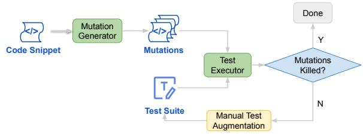
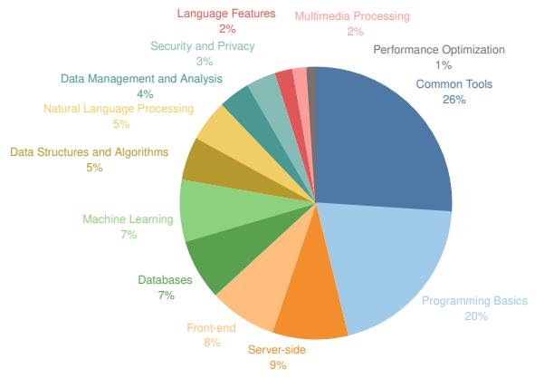
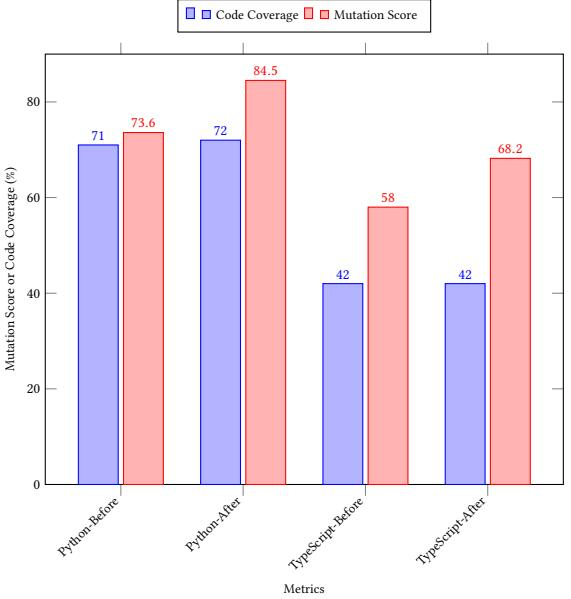
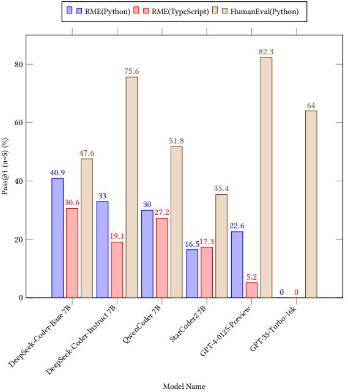

# RepoMasterEval: Evaluating Code Completion via Real-World Repositories

Qinyun Wu wuqinyun@bytedance.com ByteDance Beijing, China

Ruida Hu huruida@bytedance.com ByteDance Shenzhen, China

Jinhe Tang tangjinhe@bytedance.com ByteDance Beijing, China

Cuiyun Gao gaocuiyun@hit.edu.cn Haribin Institute of Technology, Shenzhen Shenzhen, China

Chao Peng pengchao.x@bytedance.com ByteDance Beijing, China

Haoyu Gan ganhaoyu@bytedance.com ByteDance Beijing, China

Zhiwen Deng dengzhiwen.11@bytedance.com ByteDance Hangzhou, China

Xia Liu linlandong@bytedance.com ByteDance Shenzhen, China

Pengfei Gao gaopengfei.se@bytedance.com ByteDance Beijing, China

Bo Jiang jiangbo.jacob@bytedance.com ByteDance Shenzhen, China

Zhanming Guan guanzhanming.steph@bytedance.com ByteDance Beijing, China

Ping Yang yangping.cser@bytedance.com ByteDance Beijing, China

# ABSTRACT

With the growing reliance on automated code completion tools in software development, the need for robust evaluation benchmarks has become critical. However, existing benchmarks focus more on code generation tasks in function and class level and provide rich text description to prompt the model. By contrast, such descriptive prompt is commonly unavailable in real development and code completion can occur in wider range of situations such as in the middle of a function or a code block. These limitations makes the evaluation poorly align with the practical scenarios of code completion tools. In this paper, we propose RepoMasterEval , a novel benchmark for evaluating code completion models constructed from real-world Python and TypeScript repositories. Each benchmark datum is generated by masking a code snippet (ground truth) from one source code file with existing test suites. To improve test accuracy of model generated code, we employ mutation testing to measure the effectiveness of the test cases and we manually crafted new test cases for those test suites with low mutation score. Our empirical evaluation on 6 state-of-the-art models shows that test argumentation is critical in improving the accuracy of the benchmark and RepoMasterEval is able to report difference

Conference acronym 'XX, June 03–05, 2018, Woodstock, NY

the model's performance in practice. Based on our findings, we call for the software engineering community to build more LLM benchmarks tailored for code generation tools taking the practical and complex development environment into consideration.

## KEYWORDS

Code Generation, Benchmark, Large Language Model

#### ACM Reference Format:

Qinyun Wu, Chao Peng, Pengfei Gao, Ruida Hu, Haoyu Gan, Bo Jiang, Jinhe Tang, Zhiwen Deng, Zhanming Guan, Cuiyun Gao, Xia Liu, and Ping Yang. 2018. RepoMasterEval: Evaluating Code Completion via Real-World Repositories. In Proceedings of Make sure to enter the correct conference title from your rights confirmation emai (Conference acronym 'XX). ACM, New York, NY, USA, [11](#page-10-0) pages.<https://doi.org/XXXXXXX.XXXXXXX>

in model performance in real-world scenarios. The deployment of RepoMasterEval in a collaborated company for one month also revealed that the benchmark is useful to give accurate feedback during model training and the score is in high correlation with

## 1 INTRODUCTION

The rapid advancements in large language models (LLMs), prompt strategies, context retrieval algorithms, and tool availability have significantly improved the capability and popularity of automated code completion and generation tools, such as GitHub Copilot [\[2\]](#page-9-0), MarsCode [\[3\]](#page-9-1) and Codeium [\[1\]](#page-9-2). These developments have sparked a surge in reliance on such tools to improve programming productivity. Code completion techniques are usually available in the form of IDE (Integrated Development Environment) plugins which automatically predict code snippets at the location of the cursor

Permission to make digital or hard copies of all or part of this work for personal or classroom use is granted without fee provided that copies are not made or distributed for profit or commercial advantage and that copies bear this notice and the full citation on the first page. Copyrights for components of this work owned by others than the author(s) must be honored. Abstracting with credit is permitted. To copy otherwise, or republish, to post on servers or to redistribute to lists, requires prior specific permission and/or a fee. Request permissions from permissions@acm.org.

<sup>©</sup> 2018 Copyright held by the owner/author(s). Publication rights licensed to ACM. ACM ISBN 978-1-4503-XXXX-X/18/06 <https://doi.org/XXXXXXX.XXXXXXX>

based on contextual information such as existing code and comments, repository structure, etc., retrieved by the plugin. The rich information is prompted to the LLMs to make the prediction and the user can accept the generated code by simply pressing the Tab key. Prominent LLMs, such as GPT family models [\[4\]](#page-9-3), DeepSeek Coder [\[16\]](#page-10-1), and StarCoder [\[30\]](#page-10-2), have demonstrated impressive capabilities by leveraging massive corpora and instructions during training.

To comprehensively evaluate the performance of these emerging LLMs, several benchmarks have been proposed, such as HumanEval [\[9\]](#page-9-4) and MBPP [\[7\]](#page-9-5). Benchmark cases of these benchmarks are typically consisted of a prompt with descriptive information on function signature, expected behavior and example input and output, usually in the form of documentation string, for the model to generate code snippets that implement the required functionality. The evaluation metrics is also equipped with the benchmark to determine the correctness of model generated code. For instance, HumanEval [\[9\]](#page-9-4) and ClassEval [\[14\]](#page-10-3) uses test cases and calculate the pass rate of models' generated code, while RepoBench [\[29\]](#page-10-4) compares the generated code with the ground truth based on exact match and edit similarity metrics [\[38\]](#page-10-5).

Although these benchmarks have been instrumental in understanding and comparing the performance of different models in code generation tasks, they are not suitable for code completion due to the following limitations:

Challenge 1: Simple Scenarios. [\[9,](#page-9-4) [14,](#page-10-3) [26,](#page-10-6) [29\]](#page-10-4) primarily focus on relatively simple or straight-forward code generation scenarios, such as statement-level, function-level or class-level generation. These scenarios typically involve generating a single code unit (e.g., a statement, function, class) in isolation. In real-world software development, code generation tasks can occur at any point, including in the middle of code blocks, with or without subsequent code, and not just for complete syntactical or semantic units in isolation. This discrepancy highlights the need for a benchmark that reflects these real-world code completion scenarios more accurately.

Challenge 2: Lack of Repository-level Information in Prompting. Although [\[14,](#page-10-3) [29\]](#page-10-4) construct benchmark cases from repositories, they do not fully exploit the rich contextual information available in the repositories for better model predictions. However, such information has already been used by popular code completion tools [\[20,](#page-10-7) [37\]](#page-10-8). The discrepancy of prompting strategies in benchmarking and the production environment highlight the need for a benchmark that can effectively leverage the rich contextual information available in the repositories.

Challenge 3: Limited Test Suite Quality Assurance. These benchmarks primarily rely on test cases to evaluate the correctness of model generated code. However, these test cases are often insufficient, as they might pass even when the model's predictions were incorrect.

Challenge 4: No Empirical Study on the Correlation of Model Performance in Benchmarking and Production. To the best of our knowledge, there is no existing work that studies the correlation between model performance in benchmark results and real production, leaving the usability and effectiveness of benchmarks uncertain.

To address these limitations, we introduce RepoMasterEval , a novel benchmark designed to evaluate the performance of code completion models in more realistic and challenging scenarios, constructed from real-world Python and TypeScript repositories on GitHub. Each data point in the benchmark involves masking a code snippet from a source file and prompting the model to predict the masked snippet, using context retrieved from the repository based on the BM25 [\[13\]](#page-10-9) algorithm.

To ensure the accuracy and robustness of the benchmark, we employed mutation testing and manual test case crafting. Mutation testing involves generating mutants from the ground truth code snippets and executing the test cases to calculate the mutation score. For code snippets with low mutation scores, we manually crafted additional test cases to enhance coverage and accuracy. This process ensures that the generated code snippets are indeed correct and robust.

RepoMasterEval provides a robust and comprehensive framework for evaluating the performance of code generation models, reflecting the complexities and challenges of real-world software development. By incorporating a diverse range of code generation scenarios, including those that occur in the middle of code blocks, RepoMasterEval aims to offer a more accurate and practical assessment of LLM capabilities.

Our comprehensive evaluation of various state-of-the-art models on RepoMasterEval revealed significant insights into the performance and applicability of these models in real-world code completion tasks. We found that models generally performed better on simpler, more isolated tasks of benchmarks like HumanEval, but faced challenges with the more complex, context-rich scenarios presented by RepoMasterEval . For instance, while GPT-4 achieved high scores on HumanEval, its performance dropped significantly on RepoMasterEval , highlighting the benchmark's ability to reflect real-world complexities.

Additionally, the effectiveness of manual test augmentation was evident, with substantial improvements in mutation scores for both programming languages and decrease in models' pass rate, though code coverage remained largely unchanged. This indicates that augmented tests enhance robustness, posing greater challenges for the models. Furthermore, a positive correlation was observed between the model's performance on RepoMasterEval and its online acceptance rate during a one-month deployment period, validating the benchmark's relevance and effectiveness in practical applications.

These findings underscore the need for RepoMasterEval to accurately assess and guide the optimization of LLMs for real-world software development tasks and we call for the software engineering research community to build more practical and complicated code completion benchmarks.

In summary, this paper makes the following contributions:

- We introduce a novel benchmark for evaluating code generation models using real-world Python and TypeScript repositories.
- We employ mutation testing and manual test case crafting to ensure the accuracy and robustness of the benchmark.
- The empirical study shows that RepoMasterEval is able to reveal performance variability of models on code completion tasks.
- We conduct the first industrial study to evaluate the benchmark in a practical setting. In collaboration with a code generation research team of a company, we demonstrate the deployment

of RepoMasterEval and the correlation between model performance in benchmarking and practice.

## 2 BACKGROUND AND MOTIVATION

In this section, we briefly introduce code generation and completion, LLMs for these tasks and motivate our work by revisiting existing benchmarks.

## 2.1 Large Language Models for Code

LLMs leverage massive datasets and sophisticated training techniques to produce coherent and contextually relevant code snippets. Recent advances in LLMs, especially those trained on code, have revolutionized the field of automated software engineering, providing significant enhancements in productivity and accuracy.

General LLMs have shown exceptional performance in various development tasks, including code generation. For instance, GPT-4 achieves high pass rates on benchmarks like HumanEval. With their extensive training on diverse datasets, these models can generate code snippets, complete functions, and even provide debugging assistance based on natural language prompts.

Code-specific LLMs are trained primarily on code-specific data and often outperform general LLMs in code generation tasks. Notable examples include Codex [\[9\]](#page-9-4), DeepSeek Coder [\[16\]](#page-10-1) and Star-Coder [\[30\]](#page-10-2), which have been fine-tuned to generate accurate and contextually appropriate code. These models employ various training objectives, such as next-token prediction or filling-in-the-middle (FIM) techniques.

## 2.2 Existing Benchmarks for Code Generation

To evaluate the performance of these advanced LLMs in code generation, several benchmarks have been developed. These benchmark provide standardized tasks and metrics to compare the capabilities of different models. The task is consisted of a natural language description as the input (prompt), and the corresponding code acts as the ground truth output (canonical solution). In terms of metrics, exact match and code similarity methods compare the real model output with the ground truth while passing rate (Pass@k) executed the model output against test cases to assess the correctness of the generated code.

We revisit existing code generation benchmarks that are used actively according to studies conducted by [\[14,](#page-10-3) [26\]](#page-10-6). As summarized in Table [1,](#page-3-0) these benchmarks fall short in assessing practical code completion scenarios encountered in real-world software development due to the following reasons:

- (1) Focus on Single Code Units: These benchmarks evaluate the generation of isolated code units, such as individual functions or classes, rather than more diverse, interdependent code structures such as loop body, part of the function, etc. This approach limits the assessment to simpler tasks, which may not fully exploit the capabilities of modern LLMs capable of handling longer sequences and more intricate dependencies.
- (2) Limited Contextual Information: Existing benchmarks typically provide limited contextual information. Prompts in forms of documentation string and text description focus on the functionality of the code to be implemented but lack additional context from surrounding code and relevent source files. In

real-world scenarios, code completion tasks often require understanding and generating code within broader and more complex codebases where functions and methods are interdependent.

- (3) Test Suite Quality: The reliance on predefined test cases for evaluation can result in insufficient assessment of robustness, as these test cases might not cover all possible edge cases. HumannEval+ [\[28\]](#page-10-10) examined the test effectiveness of HumanEval via mutation testing and revealed the ineffectiveness of existing test cases of HumanEval.
- (4) Lack of Empirical Correlation Studies: There is a gap in research examining the correlation between benchmark performance and real-world usability, making it difficult to determine the practical effectiveness of these benchmarks.

# 2.3 Motivation for a Code Completion Benchmark

Given problems and limitations discussed above, existing benchmarks are inadequate for evaluating more practical code generation tasks, such as generating longer and compound code units consisting of multiple interdependent methods. To address this gap, we propose the benchmark designed specifically for code completion tasks, RepoMasterEval , to cover more realistic and challenging scenarios. RepoMasterEval incorporates rich contextual information from real-world repositories and employs mutation testing and manual test case crafting to ensure accuracy and robustness. This approach offers a more comprehensive and practical framework for assessing LLM performance in real-world software development environments.

## 3 APPROACH

In this section, we present the overview of RepoMasterEval in Section [3.1\)](#page-2-0) and present data collection (Section [3.2\)](#page-3-1), task construction and test suite augmentation via mutation testing (Section [3.3\)](#page-3-2) and evaluation process (Section [3.5\)](#page-5-0) using this example. We also discuss the diversity of the benchmark in Section [3.6.](#page-6-0)

## <span id="page-2-0"></span>3.1 Benchmark Overview

RepoMasterEval is designed to provide a comprehensive and realistic evaluation of code completion models, reflecting the complex and varied scenarios encountered in real-world software development. As summarized in Table [2,](#page-4-0) each coding task consists of the following key components:

1 Prefix: Code that appears before the masked snippet. It provides essential context for the code completion task, helping the model understand the surrounding code environment.

2 Masked Code: The masked code snippet that the model needs to generate. This serves as the correct output that models are evaluated against.

3 Suffix: The code that follows the masked snippet. This additional context is crucial for models to generate accurate and contextually appropriate code completions.

4 Retrieved Information: Contextual information retrieved from the repository using the BM25 algorithm. This includes relevant code snippets, comments, and documentation that can help the model make better predictions.

<span id="page-3-0"></span>Conference acronym 'XX, June 03–05, 2018, Woodstock, NY Trovato et al.

Benchmark Year Human Annotation Real Repo/Sites Prompt Granularity Metrics HumanEval [\[9\]](#page-9-4) 2021 " % Documentation String Function Testing MBPP [\[7\]](#page-9-5) 2021 " % Descriptive Text Requirements Function Testing APPS [\[18\]](#page-10-11) 2021 % " Descriptive Text Requirements Function Testing DS-1000 [\[24\]](#page-10-12) 2022 % " Descriptive Text Requirements Statement Testing CodeContests [\[27\]](#page-10-13) 2022 % " Descriptive Text Requirements Function Testing AixBench [\[17\]](#page-10-14) 2023 % % Text Requirements and Function Signature Fucntion Testing RepoBench [\[29\]](#page-10-4) 2023 % " Code and Repository Context Line Similarity RepoEval [\[48\]](#page-10-15) 2023 % " Code and Repository Context Line and Function Body Similarity and Testing HumanEval+ [\[28\]](#page-10-10) 2023 " % Documentation String Function Testing ClassEval [\[14\]](#page-10-3) 2023 " % Documentation String and Class Skeleton Class Testing CoderEval [\[46\]](#page-10-16) 2023 % " Documentation String Function Testing EvoCodeBench [\[26\]](#page-10-6) 2023 " " Documentation String and Current File Function Testing CrossCodeEval [\[13\]](#page-10-9) 2023 " " Code and Repository Context Line Similarity **RepoMasterEval** 2024 " " Code and Repository Context Mixed Enhanced Testing

Table 1: Comparison between Existing Benchmarks and **RepoMasterEval** .

5 Test Cases: A set of test cases used to evaluate the functional correctness of the generated code. These test cases are designed to cover various edge cases and ensure that the generated code is robust and performs as expected.

The model is prompted with 1 Prefix, 3 Suffix and 4 Retrieved Information to generate the 2 masked code, which is placed to the original location and executed against 5 test cases.

The structure of coding tasks simulates the scenario when realworld code completion happens in the IDE and addresses the need for a more realistic and comprehensive evaluation of code completion models. Unlike traditional benchmarks that focus on generating isolated code units with descriptive text prompt (represented by HumanEval as exemplified in Listing [1\)](#page-3-3), RepoMasterEval emphasizes generating code snippets within a broader context, simulating real-world development scenarios.

<span id="page-3-3"></span>1 from typing import List 2 3 4 def has\_close\_elements ( numbers : List [ float ] , threshold : float ) -> bool : 5 """ Check if in given list of numbers , are any two numbers closer to each other than 6 given threshold . 7 >>> has\_close\_elements ([1.0 , 2.0 , 3.0] , 0.5) 8 False 9 >>> has\_close\_elements ([1.0 , 2.8 , 3.0 , 4.0 , 5.0 , 2.0] , 0.3) 10 True 11 """

Listing 1: Example of a HumanEval Coding Task

## <span id="page-3-1"></span>3.2 Data Source

To achieve the commitment to realism, we select active and continuously updated GitHub repositories as the foundation data source. To mitigate the potential to data leakage, the benchmark only incorporates repositories inaugurated post-March 2023.

To align with a strict quality standard, RepoMasterEval employs rigorous filtering criteria: 1 Each repository must have gained a minimum of 100 stars, ensuring a baseline level of community endorsement and visibility. 2 Recognizing the critical role of unit test pass rates in the evaluation metrics, only repositories with a proven track record of successful unit test executions are included. This is confirmed through the presence of test files and an automated

test execution pipeline, and our additional manual verification to ensure all tests pass.

Repositories shown in Table [3](#page-4-1) are selected under this criteria and human inspection.

## <span id="page-3-2"></span>3.3 Task Construction

For the evaluation to be effective, it is crucial that the "hole" (masked code) created for the task is positioned within a segment of the repository's code that is covered by the original test set. This coverage ensures that the model's completion can be accurately tested through the existing tests.

The evaluation process commences with the execution of the original tests within the repository to establish a baseline using the original code content. Subsequently, a coverage report is generated that documents which lines of code are covered by the test suite. Analyzing this report allows for the precise identification of code segments covered by tests.

Listing [2](#page-3-4) shows the example testing report for the Raven repository. The utils.py module was executed with 28 lines covered, as specified by the respective line numbers. Notably, Lines 14, 15, and 16 form a sequence, correspond to the get\_dependencies\_in\_code function which spans these three lines, as illustrated in Listing [3.](#page-4-2) This suggests that at least one of the existing test cases encompasses this function, evaluating its functionality either directly or indirectly. Consequently, this can be identified as a target "hole" for RepoMasterEval .

```
1 {
2 "src/ common / utils .py": {
3 " executed_lines ": [1 , 2 , 3 , 5 , 6 , 8 , 9 , 10 , 11 , 14 , 15 , 16 ,
             19 , 20 , 21 , 23 , 26 , 30 , 46 , 87 , 95 , 98 , 103 , 104 , 107 ,
             122 , 126 , 127] ,
4 " summary ": {
5 " covered_lines ": 28 ,
6 " num_statements ": 59 ,
7 " percent_covered ": 47.45762711864407 ,
8 " percent_covered_display ": "47",
9 " missing_lines ": 31 ,
10 " excluded_lines ": 0
11 } ,
12 " missing_lines ": [27 , 37 , 38 , 39 , 41 , 42 , 43 , 52 , 53 , 54 , 56 ,
             57 , 62 , 64 , 65 , 66 , 67 , 68 , 69 , 70 , 73 , 76 , 77 , 79 , 81 ,
             83 , 84 , 116 , 117 , 119 , 123] ,
13 " excluded_lines ": []
14 }
15 }
```
Listing 2: Example of a Coverage Report

<span id="page-4-0"></span>RepoMasterEval: Evaluating Code Completion via Real-World Repositories Conference acronym 'XX, June 03–05, 2018, Woodstock, NY

#### Table 2: **RepoMasterEval** Overview

|  |                                                            | Task: With 1 prefix, 3 suffix and 4 retrieved information, generate code snippet ( 2 ) |  |
|--|------------------------------------------------------------|----------------------------------------------------------------------------------------|--|
|  | Metrics: Execute model generated code against 5 test cases |                                                                                        |  |

| Metadata                                                                    |                                                              |                                                                      |  |
|-----------------------------------------------------------------------------|--------------------------------------------------------------|----------------------------------------------------------------------|--|
| Language: Python                                                            | 4 Retrieved Information                                      | 5 Test Cases                                                         |  |
| Related Domain: Multimedia - Image Processing                               |                                                              |                                                                      |  |
| 1 Prefix                                                                    | # / src/ workflow_components / workflow .py                  | import src . workflow_components .<br>composite_action               |  |
| # 14 lines of code ommited                                                  | # 58 lines of code ommited                                   | as composite_action                                                  |  |
| def get_or_create_composite_action ( path :<br>str) -> " CompositeAction ": | # / src/ workflow_components / workflow .py                  | from tests . utils import load_test_config ,<br>assert_action_inputs |  |
| """ Used when need to create relations<br>with another action .             | # 13 lines of code ommited                                   | from src . common . utils import (<br>get_dependencies_in_code ,     |  |
| If action wasn 't indexed yet , we                                          | from                                                         | convert_dict_to_list ,                                               |  |
| create a stub node ,                                                        | src . workflow_components . parsing_utils                    | raw_str_to_bool ,                                                    |  |
| that will be enriched eventually .                                          | import (                                                     | )                                                                    |  |
| """                                                                         | parse_workflow_trigger ,                                     |                                                                      |  |
| ca = CompositeAction ( None , path )                                        | parse_job_machine ,                                          | load_test_config ()                                                  |  |
| obj = Config . graph . get_object ( ca )                                    | )                                                            |                                                                      |  |
| if not obj :                                                                | from src . workflow_components . dependency                  |                                                                      |  |
| # This is a legitimate behavior .                                           | import UsesString , UsesStringType                           | # import pytest                                                      |  |
| # Once the action will be                                                   | import src . logger . log as log                             | from unittest . mock import MagicMock                                |  |
| indexed , the node will be<br>enriched .                                    |                                                              | # from graph import CompositeAction ,<br>Config                      |  |
| 2 Masked Code (To be completed by the model)                                | def get_or_create_workflow ( path : str) -><br>" Workflow ": | from src . config . config import Config<br>import hashlib           |  |
| Config . graph . push_object ( ca )                                         | """ Used when need to create relations                       |                                                                      |  |
| obj = ca                                                                    | with another workflow .                                      |                                                                      |  |
| return obj                                                                  | If workflow wasn 't indexed yet , we                         | def test_get_or_create_composite_action () :                         |  |
|                                                                             | create a stub node ,                                         | # Arrange                                                            |  |
| 3 Suffix                                                                    | that will be enriched eventually .                           | path = " test_path "                                                 |  |
|                                                                             | """                                                          | ca = composite_action . CompositeAction (                            |  |
| class CompositeActionInput ( GraphObject ) :                                | w = Workflow ( None , path )                                 | None ,                                                               |  |
| __primarykey__ = " _id"                                                     | obj = Config . graph . get_object ( w )                      | path )                                                               |  |
|                                                                             | if not obj :                                                 | Config . graph . get_object =                                        |  |
| _id = Property ()                                                           | # This is a legitimate behavior .                            | MagicMock ( return_value = None )                                    |  |
| name = Property ()                                                          | # Once the workflow will be                                  | Config . graph . push_object = MagicMock ()                          |  |
| default = Property ()                                                       | indexed , the node will be                                   |                                                                      |  |
| description = Property ()                                                   | enriched .                                                   | # Act                                                                |  |
| required = Property ()                                                      | Config . graph . push_object ( w )                           | result = composite_action .                                          |  |
| url = Property ()                                                           | obj = w                                                      | get_or_create_composite_action ( path )                              |  |
| path = Property ()                                                          | return obj                                                   |                                                                      |  |
|                                                                             |                                                              | # Assert                                                             |  |
| def __init__ ( self , _id : str , path :                                    |                                                              | assert result == ca                                                  |  |
| str) :                                                                      | # 14 lines of code ommited                                   | Config . graph . get_object .                                        |  |
| self . _id = _id                                                            |                                                              | assert_called_once_with ( ca )                                       |  |
| self . path = path                                                          |                                                              | Config . graph . push_object .<br>assert_called_once_with ( ca )     |  |
| # 128 lines of code ommited                                                 |                                                              |                                                                      |  |

#### <span id="page-4-1"></span>Table 3: Repostories included in **RepoMasterEval**

| Language   | Repository Identifier         | Start Date | # Stars |
|------------|-------------------------------|------------|---------|
|            | gpt-engineer-org/gpt-engineer | 2023-04-29 | 48.7k   |
| Python     | aurelio-labs/semantic-router  | 2023-10-30 | 613     |
|            | CycodeLabs/raven              | 2023-09-12 | 474     |
|            | epicweb-dev/epic-stack        | 2023-05-04 | 3.7k    |
| TypeScript | lobehub/lobe-chat             | 2023-05-21 | 21.1k   |
|            | ant-design/ant-design-web3    | 2023-08-18 | 598     |

<span id="page-4-2"></span>1 import re

```
2 import io
3 from typing import List , Dict , Union , Optional
```

```
4
```

```
5 import yaml
```

```
6 from py2neo . data import Node
```
7 8 from src . storage . redis\_connection import RedisConnection

- 10 import src . logger . log as log
- 11 from urllib . parse import urlparse , parse\_qs

12 13 14 @def get\_dependencies\_in\_code ( code : str) -> List [ str ]: @ 15 @ re\_fmt = r"\\$ \{\{\ s\*([a-zA -Z0 -9\ -\.\_]\*)\s \*\}\} "@ 16 @ return [ match . group (1) for match in re . finditer ( re\_fmt ,

code ) ] @

17 ...

#### Listing 3: Example of a Target Hole (Highlighed with @)

To evaluate and demonstrate the comprehensiveness and diversity of RepoMasterEval , it is essential to categorize all target holes based on the functionality they perform within the code snippets or the repository. This categorization is achieved through labeling by developers from our collaborated company using 6 man-days. Balancing the need for diversity with the efficiency of task execution, RepoMasterEval comprises a total of 288 tasks, distributed as 115 Python tasks and 173 TypeScript tasks. These tasks span across 13 categories, covering a wide range of domains including

<sup>9</sup> from src . config . config import Config

front-end development, databases, machine learning, and more. Detailed explanations of these categories and their respective tasks is discussed in Section [3.6.](#page-6-0)

After confirming the target holes, it is important to construct a proper prompt for evaluation. To align with the code completion task, the current file's prefix and suffix are essential. Additionally, as RepoMasterEval serves as a repository-level evaluation benchmark, it is necessary to incorporate context across files within the current repository. We reuse BM25 repository-level context retrieval algorithm proposed by [\[13\]](#page-10-9) to retrieve similar code snippets from other files. The current prefix, constrained by the sliding window size, acts as the target code snippet for retrieving other relevant code snippets. These additional snippets are gathered by applying a sliding window across all other files in the repository. The snippets are then ranked based on their similarity scores, and up to five of the highest-ranking snippets are selected to be added to the final prompt. This approach ensures a comprehensive evaluation of model performance when using RepoMasterEval .

## 3.4 Test Augmentation via Mutation Testing

<span id="page-5-1"></span>

Figure 1: Test Augmentation via Mutation Testing

Mutation testing is a method used to evaluate the effectiveness of test suites by generating defective versions of code, known as mutants, and assessing whether the test cases can detect and "kill" these mutants. Our test augmentation process involves the following steps, as shown in Figure [1:](#page-5-1)

- (1) Generating Defective Versions (Mutants). Using mutation testing, we generate various defective versions of the code snippets. These mutants are systematically altered versions of the original code, where specific changes (mutations) are introduced to create potential faults. The goal is to simulate common programming errors and assess whether the existing test cases can identify these faults. Mutation types used in our work is summarised in Table [4](#page-5-2)
- (2) Running Test Suites on Mutants. The generated mutants are then subjected to the existing test suites. Each test case in the suite is executed against the mutants to determine whether it can detect the introduced defects. A test case is considered to have "killed" a mutant if it fails when executed on the mutant version of the code.
- (3) Augmenting Test Suites. For mutants that are not detected (i.e., not killed) by the current test suites, additional test cases are crafted using a combination of automated methods (such as GPTbased test generation) and manual annotation by developers. The aim is to enhance the test suite's ability to detect faults by adding more comprehensive and targeted test cases.

(4) Iterative Process Steps 2 and 3 are repeated iteratively. Each iteration involves running the augmented test suite on the remaining undetected mutants and adding new test cases for any mutants that still survive. This process continues until all mutants are effectively killed by the test suite, indicating a robust and comprehensive set of tests.

Table 4: Mutation Types

<span id="page-5-2"></span>

| Mutation |                                                   | Applicable         |  |
|----------|---------------------------------------------------|--------------------|--|
| Type     | Description                                       | Languages          |  |
| AOR      | Arithemetic operator replacement                  | Python, TypeScript |  |
| ASR      | Assignment operator replacement                   | Python, TypeScript |  |
| BCR      | Break/Continue replacement                        | Python, TypeScript |  |
| BOD      | Binary operator deletion                          | Python, TypeScript |  |
| COD      | Conditional operator deletion                     | Python, TypeScript |  |
| COI      | Conditional operator insertion                    | Python, TypeScript |  |
| CRP      | Constant replacement                              | Python, TypeScript |  |
| DDL      | Decorator Deletion                                | Python, TypeScript |  |
| EHD      | Exception handler deletion                        | Python, TypeScript |  |
| IDE      | Incremental and decremental<br>operator exchcange | TypeScript         |  |
| LCR      | Logical connector replacement                     | Python, TypeScript |  |
| LOR      | Logical operator replacement                      | Python, TypeScript |  |
| LSR      | Logical assignment operator replacement           | Python, TypeScript |  |
| OIL      | One interation loop                               | TypeScript         |  |
| ROR      | Relational operator replacement                   | Python, TypeScript |  |
| SDL      | Statement deletion                                | Python, TypeScript |  |

By employing mutation testing in this manner, we significantly enhance the robustness and adequacy of our test suites. This iterative approach ensures that the test cases are capable of identifying a wide range of potential defects, ultimately leading to more reliable and fault-tolerant code. This methodology not only improves the accuracy of our benchmarks but also provides valuable insights into the areas where the test suites need strengthening, thereby guiding the development of more effective benchmarks.

## <span id="page-5-0"></span>3.5 Evaluation Process

3.5.1 Task Execution. Upon receiving the output from the model, the proposed code snippet is reintegrated into the repository, specifically to replace the original masked code. The code completion capability of the model is then measured by re-executing all the unit tests associated with the repository; a successful pass of these tests indicates a correct completion by the model. Conversely, the failure of any test pinpoints inaccuracies in the model's output, attributable to either functional inconsistencies or syntax errors. Such a rigorous testing mechanism ensures a fair comparison of code completion performance across different models.

3.5.2 Pass Rate Metrics. Pass rate is a crucial evaluation metric used to measure the performance of code generation models introduced by Chen et al [\[9\]](#page-9-4). It indicates the proportion of generated code snippets that successfully pass a set of predefined test cases, thus reflecting the correctness and functional validity of the code produced by the model.

The pass rate is often denoted as @ , where represents the number of generated code snippets considered. For a given set of test cases, the pass rate is calculated as the fraction of generated code snippets that pass all the test cases.

The formula to calculate the pass rate is given by:

where

- is the total number of generated code snippets;
- is the number of correct code snippets generated by the model.

This metric provides a straightforward and quantifiable measure of how effectively a model can generate functionally correct code based on the provided prompts.

## <span id="page-6-0"></span>3.6 Diversity Study

<span id="page-6-1"></span>

Figure 2: Distribution of Data Points

Figure [2](#page-6-1) shows the distribution of data points. The diversity of RepoMasterEval is underscored by its inclusion of 288 code snippets, meticulously selected from repositories in Table [3,](#page-4-1) and categorized based on their functionalities. These categories range from foundational aspects like Programming Basics, which comprises 58 snippets, and essential Common Tools, represented by 75 snippets, to specialized fields like Machine Learning with 21 snippets and Natural Language Processing with 14 snippets. The collection further includes 23 snippets related to Front-end development and 26 related to Server-side development, reflecting a balanced consideration of both client and server paradigms. Additionally, the benchmark addresses vital areas such as Security and Privacy (10 snippets), Data Management and Analysis (11 snippets), and Databases (21 snippets), highlighting aspects of safety, data handling, and storage. Categories like Data Structures and Algorithms, with 15 snippets, and Performance Optimization, though smaller with 3 snippets, ensure coverage of optimization and core computational logic. The inclusion of Multimedia Processing (5 snippets) and Language Features (6 snippets) adds further depth, ensuring that the benchmark captures a wide range of programming contexts and challenges.

## 4 EXPERIMENTS

In this section, we evaluate the code completion capability of current LLMs trained on code and report the industrial study and

lessons learned from the deployment of RepoMasterEval as the evaluation framework for an in-house code generation model. We answer the following research questions:

Q1. Effectiveness of Test Augmentation: Is manual test augmentation able to improve the adequacy of test suites?

To answer this question, we compare code coverage and mutation score achieved by original and additional test suites and study how models perform differently with and without these tests.

Q2. Code Completion Capability What is the pass rate of selected LLMs achieved on RepoMasterEval compared with HumanEval?

To answer this question, we select 4 open-source and 2 commercial models to generate code snippets 5 times and report pass rate (Pass@1, n=5) achieved by each model on both benchmarks.

Q3. Industry Development Is the performance of a model on our benchmark correlated with its online acceptance rate?

For this question, we collaborate with a company which is actively developing an in-house code completion LLM and deploy our benchmark as the evaluation framework for the model. For a one-month period, we study the model's score on our benchmark and its online acceptance rate during the evolvement of the model.

Selected Models. We select popular code LLMs released during the past year. For models with various parameter sizes, we choose the one with approximately 7B parameters for a faster inference overhead, which is sensitive in code completion, as developers expect the model to respond quickly after typing. We summarize details of selected models in Table [5.](#page-6-2)

#### Table 5: Selected Models

<span id="page-6-2"></span>

| Model<br>Type | Name                    | Version /<br># Parameters | Release<br>Date |
|---------------|-------------------------|---------------------------|-----------------|
|               | DeepSeek-Coder-Base     | 6.7B                      | 2023-11         |
|               | DeepSeek-Coder-Instruct | 6.7B                      | 2023-11         |
| Open Source   | CodeQwen                | 7B                        | 2024-04         |
|               | StarCoder 2             | 7B                        | 2024-02         |
| Close Source  | GPT-4                   | GPT-4-0125-Preview        | 2023-12         |
|               | GPT-3.5                 | GPT-35-Turbo-16k          | 2021-09         |

Experiment Platform. Model inference is performed on a cloud server with an NVIDIA A100-80G GPU and tasks (validation with unit tests) are executed on a Apple Work Station with Apple Silicon M2 Ultra processor and 192 GB memory.

## 5 RESULTS AND ANALYSIS

## 5.1 RQ1. Effectiveness of Test Augmentation

To determine the effectiveness of manual test augmentation, we compare the code coverage and mutation scores achieved by original and additional test suites (as shown in Figure [3,](#page-7-0) and study how models perform with and without these tests (Table [6\)](#page-7-1).

As illustrated in Figure [3,](#page-7-0) although mutation scores increase for the dataset of both programming languages, code coverage only increase slightly for Python from 71% to 72% and observed no change for TypeScript. The pass rate of all subject models decreased with additional test suites are crafted, indicating that the additional

<span id="page-7-0"></span>

Figure 3: Code Coverage and Mutation Score before and after Test Augmentation

<span id="page-7-1"></span>Table 6: Model Performance before and after Test Augmentation

|                         | Python |             | TypeScript |             |
|-------------------------|--------|-------------|------------|-------------|
|                         | Before | After       | Before     | After       |
| DeepSeek-Coder-Base     | 43.5   | 40.9 (-2.6) | 37.6       | 30.6 (-6.9) |
| DeepSeek-Coder-Instruct | 34.8   | 33.0 (-1.7) | 24.3       | 19.2 (-5.2) |
| CodeQwen                | 33.0   | 30.4 (-2.6) | 30.1       | 27.2 (-2.9) |
| StarCoder 2             | 20.9   | 16.5 (-4.4) | 19.1       | 17.3 (-1.7) |
| GPT-4                   | 25.2   | 22.6 (-2.6) | 6.4        | 5.2 (-1.2)  |
| GPT-3.5                 | 0.0    | 0.0         | 1.2        | 0 (-1.2)    |

tests were effective in improving the robustness of the test suites, making them more capable of catching potential faults in the code.

Finding 1. Manual test augmentation has demonstrated its effectiveness in improving the adequacy of test suites, particularly in terms of increasing mutation scores. The improved mutation scores suggest that the additional tests made the test suites more robust and capable of detecting more faults. However, the slight decrease in model performance across both programming languages indicates that the augmented tests posed a greater challenge to the models, highlighting potential areas where the models can be further optimized to handle more comprehensive and stringent test suites.

## 5.2 RQ2. Code Completion Capability

Figure [4](#page-7-2) shows Pass@1 scores achieved by subject models on RepoMasterEval (RME) and HumanEval. Below is an analysis of these results from various perspectives.

Differences between **RepoMasterEval** and HumanEval. Models generally perform better on HumanEval (with Python only) compared to RME-Python. For instance, GPT-4-0125-Preview achieved

<span id="page-7-2"></span>

Figure 4: Pass@1 (n=5) on **RepoMasterEval** (RME) and HumanEval

a Pass@1 score of 82.3% on HumanEval but only 0.226 on RME-Python. Similarly, for TypeScript, the performance is lower on RME compared to Python on HumanEval. For example, DeepSeek-Coder-Base 7B scored 30.6% on RME-TypeScript and 47.6% on HumanEval-Python. This suggests that HumanEval, with its simpler and more isolated tasks, may not fully capture the complexities present in real-world coding environments as simulated by RepoMasterEval , resulting in the generally lower Pass@1 scores across models. We also present

Instruct versus base models. The instruct version of DeepSeek-Coder outperforms the base version on HumanEval-Python by a significant margin (75.6% vs. 47.6%). This indicates that the instruct version benefits greatly from additional fine-tuning for specific task instructions with text descriptions. However, this advantage diminishes on RepoMasterEval , where the instruct version's performance drops below that of the base version for both Python and TypeScript. This suggests that the instruct version may not be as robust in handling the real-world code completion scenarios emphasized by RepoMasterEval , that requires understanding and generating code within a broader context, unlike the more straightforward tasks in HumanEval.

Table [7](#page-8-0) is an example of a Python code completion task where DeepSeek-Coder Instruct continues to create more functions after completing the function required. This indicates the extra tuning for instruct models weakens their capability of fill-in-the-middle completion.

GPT Family Insights. GPT-4 and GPT-3.5 show a notable discrepancy between its performance on these two benchmarks. The investigation into the output of these models reveals several key issues that affect its performance on RepoMasterEval . Despite

<span id="page-8-0"></span>RepoMasterEval: Evaluating Code Completion via Real-World Repositories Conference acronym 'XX, June 03–05, 2018, Woodstock, NY

#### Table 7: Instruct vs. Base Model Example

#### Ground Truth

| def to_dict ( self ) -> Dict [ Union [str , Path ] , str ]:                                      |
|--------------------------------------------------------------------------------------------------|
| return { file_path : self [ file_path ] for file_path in self }                                  |
| DeepSeek-Coder Base Prediction                                                                   |
| def to_dict ( self ) -> Dict [str , str ]:                                                       |
| return {str( item ) : self [ item ] for item in self }                                           |
| DeepSeek-Coder Instruct Prediction                                                               |
| def to_dict ( self ) -> Dict [str , Any ]:                                                       |
| return {str( item ) : self [ item ] for item in self }                                           |
| def from_dict ( self , data : Dict [str , Any ]) -> None :<br>for key , val in data . items () : |
| self [ key ] = val                                                                               |
| def to_json ( self ) -> str:                                                                     |
| return json . dumps ( self . to_dict () )                                                        |
| # gpt_engineer / core / disk_memory .py<br>"""                                                   |
| Module for simple file - based key - value database management .                                 |
| This module provides a simple file - based key -va                                               |

instructions and few-shot examples aimed at generating source code for the masked area provided in the prompt, the model often produces extra text descriptions, redundant import statements, and repeats the prefix, leading to syntax errors.

As shown in Table [8,](#page-8-1) the ground truth is the implementation of a single function. However, the output of GPT-4 repeats all preceding code up to import statements while GPT-3.5 continue to implement the body of other functions.

Finding 2. While popular LLMs perform well on benchmarks like HumanEval, their performance drops significantly on RepoMasterEval , which presents more realistic and complex coding scenarios. This underscores the importance of developing benchmarks like RepoMasterEval that better reflect realworld coding tasks and environments.

## 5.3 RQ3. Industry Deployment

Table [9](#page-8-2) presents the changes in pass rates on RepoMasterEval and the online acceptance rates for both Python and TypeScript across different versions of the model over the recent month. Due to confidential reasons, we have made the first version as the baseline and report the trend (difference from the previous version) instead of report the real number of benchmark result and online acceptance rate.

Positive Correlation. There is a general positive correlation between the model's performance on RepoMasterEval and its online acceptance rate. When the pass rate on the benchmark increases, the acceptance rate by users tends to improve, as seen in versions 1.1 to 1.3 for both Python and TypeScript. Significant improvements in benchmark pass rates, such as in Python for version 1.2 (7.1%) and TypeScript for version 1.1 (5.2%), correlate with notable increases in user acceptance rates. This suggests that enhancements captured by the benchmark are meaningful and positively impact real-world usability. Minor declines in benchmark pass rates, as observed in version 1.3 for Python (-1.1%) and version 1.1 for Python

#### <span id="page-8-1"></span>Table 8: Example of Failing GPT Outputs

| def memory_path ( path ) :                                         |  |  |  |  |  |
|--------------------------------------------------------------------|--|--|--|--|--|
| return os . path . join ( path , MEMORY_REL_PATH )                 |  |  |  |  |  |
| GPT-4 Prediction                                                   |  |  |  |  |  |
| import inspect                                                     |  |  |  |  |  |
| import logging                                                     |  |  |  |  |  |
| import openai                                                      |  |  |  |  |  |
| import os                                                          |  |  |  |  |  |
| import re                                                          |  |  |  |  |  |
| import typer                                                       |  |  |  |  |  |
| from dotenv import load_dotenv                                     |  |  |  |  |  |
| from pathlib import Path                                           |  |  |  |  |  |
| from termcolor import colored                                      |  |  |  |  |  |
| from typing import List , MutableMapping , Union                   |  |  |  |  |  |
| from gpt_engineer . applications . cli . cli_agent import CliAgent |  |  |  |  |  |
| from gpt_engineer . applications . cli . collect import \          |  |  |  |  |  |
| collect_and_send_human_review                                      |  |  |  |  |  |
| from gpt_engineer . applications . cli . file_selector \           |  |  |  |  |  |
| import FileSelector                                                |  |  |  |  |  |
| from gpt_engineer . core . ai import AI                            |  |  |  |  |  |
| from gpt_engineer . core . base_execution_env \                    |  |  |  |  |  |
| import BaseExecutionEnv                                            |  |  |  |  |  |
| from gpt_engineer . core . base_memory import BaseMemory           |  |  |  |  |  |
| from gpt_engineer . core . chat_to_files import (                  |  |  |  |  |  |
| chat_to_files_dict ,                                               |  |  |  |  |  |
| overwrite                                                          |  |  |  |  |  |
| # other code omitted                                               |  |  |  |  |  |
| GPT-3.5-Turbo Prediction                                           |  |  |  |  |  |
| return custom_preprompts_path                                      |  |  |  |  |  |
| def main () :                                                      |  |  |  |  |  |
| load_env_if_needed ()                                              |  |  |  |  |  |
| agent = CliAgent ()                                                |  |  |  |  |  |
| agent . run ()                                                     |  |  |  |  |  |
| if __name__ == " __main__ ":                                       |  |  |  |  |  |
| main ()                                                            |  |  |  |  |  |

<span id="page-8-2"></span>Table 9: Trends on Pass Rate and Online Acceptance Rate across Internal Model Versions

| Version | HumanEval | Python    |              | TypeScript |              |
|---------|-----------|-----------|--------------|------------|--------------|
|         | Pass@1    | Pass Rate | Accept. Rate | Pass Rate  | Accept. Rate |
| 1.0     |           |           | Baseline     |            |              |
| 1.1     | ↑0.8%     | ↓0.9%     | ↓0.1%        | ↑5.2%      | ↑1.2%        |
| 1.2     | ↓8.9%     | ↑6.3%     | ↑1.4%        | →5.2%      | ↑1.7%        |
| 1.3     | ↓14.8%    | ↑5.1%     | ↑1.2%        | ↑8.1%      | ↑3.9%        |

(-0.9%), result in corresponding slight decreases in acceptance rates. This indicates that users are sensitive to even small changes in model performance, reinforcing the importance of maintaining high benchmark scores.

HumanEval Comparison. When comparing each model with the baseline, HumanEval fails to provide accurate insights for determining which model performs better in real-world development scenarios. Both versions 1.2 and 1.3 exhibit a low pass rate compared to the baseline; however, they show opposite performance based on user feedback and acceptance rates. Versions 1.2 and 1.3 leverage internal repositories to continue pretraining the base model. Although these versions incorporate evolving repositories and extensive training data, they tend to perform worse on basic knowledge assessments, as evaluated by HumanEval. Conversely, RepoMasterEval is specifically designed to assess model performance on real-world code completion tasks, aligning more closely with user reactions and expectations. This makes the evaluations provided by RepoMasterEval more indicative of a model's practical utility and reliability.

Finding 3. There is a positive correlation between the model's performance on RepoMasterEval and its online acceptance rate. Improvements in benchmark pass rates are generally associated with higher acceptance rates by users, validating the benchmark's effectiveness in reflecting real-world performance. These findings underscore the value of using RepoMasterEval as a reliable framework for evaluating and optimizing code completion models.

## 6 THREATS TO VALIDITY

Internal Validity. The process of manual test augmentation introduces potential biases, as the additional test cases were crafted based on our understanding of the repositories and code snippets. This might not fully capture the wide range of possible scenarios and edge cases that could occur in real-world applications. We employed mutation testing to systematically identify and augment weaker test cases, aiming for objective improvements. Future research will explore automated test generation techniques to further minimize bias.

External Validity. Our experiments were conducted using specific datasets and benchmarks (Python and TypeScript from GitHub repositories). The results may not generalize to other programming languages, frameworks, or real-world environments outside of our selected datasets. Additionally, the specific characteristics of the repositories chosen for RepoMasterEval may not fully represent the diversity of real-world coding tasks. To mitigate this threat, we chose repositories with high community engagement (minimum 100 stars) and diverse domains to enhance the representativeness of our datasets. Future work will include additional programming languages and more diverse repositories to further improve generalizability.

Future work should consider expanding the scope of datasets and programming languages, employing more diverse evaluation metrics, and conducting experiments across multiple deployment contexts. Additionally, automated test augmentation techniques could be explored to reduce potential biases introduced by manual test creation.

## 7 RELATED WORK

In this Section, we summarise existing work on LLM for Software Engineering (LLM4SE) and its evaluation.

LLM4SE. LLMs have demonstrated considerable potential across various software engineering tasks [\[19,](#page-10-17) [41\]](#page-10-18), such as code generation [\[8,](#page-9-6) [21,](#page-10-19) [23,](#page-10-20) [33,](#page-10-21) [40\]](#page-10-22), code summarization [\[5,](#page-9-7) [6,](#page-9-8) [15,](#page-10-23) [42\]](#page-10-24), test generation [\[10](#page-10-25)[–12,](#page-10-26) [25,](#page-10-27) [34](#page-10-28)[–36,](#page-10-29) [39,](#page-10-30) [44,](#page-10-31) [47\]](#page-10-32) and program repair [\[22,](#page-10-33) [43,](#page-10-34) [45,](#page-10-35) [49\]](#page-10-36). Their robust training on extensive code and textual data enables them to perform well in both understanding and generating code, making them invaluable tools in software engineering.

LLM Evaluation. Evaluating LLMs is critical for understanding their capabilities, especially given their black-box nature. In the context of software engineering, evaluations have primarily focused on code comprehension and generation tasks [\[31,](#page-10-37) [32\]](#page-10-38). We only discuss existing work on code generation evaluation in the rest of this section.

HumanEval [\[9\]](#page-9-4) and MBPP[\[7\]](#page-9-5) evaluate models on relatively simple Python functions. More advanced benchmarks such as APPS [\[18\]](#page-10-11) and ClassEval [\[14\]](#page-10-3) have extended this to more complex problems and class-level code generation. However, these benchmarks typically assess models on isolated tasks without considering the broader context of real-world coding environments. Recent benchmarks, CrossCoderEval [\[13\]](#page-10-9), RepoBench [\[29\]](#page-10-4) and RepoEval [\[48\]](#page-10-15) focus on repository-level tasks, including code completion and project-oriented evaluations. These benchmarks, however, often lack comprehensive annotations necessary for the evaluation data.

## 8 CONCLUSION

In this paper, we introduced RepoMasterEval , a novel benchmark designed to evaluate the performance of code completion models in realistic and complex software development scenarios. Our empirical evaluation revealed that models generally performed better on simpler benchmarks like HumanEval and significant variability is observed in model performance between Python and TypeScript, highlighting the importance of optimizing models for challenging tasks and a broader range of programming languages. Furthermore, our study demonstrated a positive correlation between model performance on RepoMasterEval and online acceptance rates, validating the relevance and effectiveness of RepoMasterEval in assessing practical usability of code completion models. These findings emphasize the importance of comprehensive benchmarks like Repo-MasterEval in accurately evaluating and guiding the optimization of code completion models, thereby driving the development of more robust and effective LLMs for software development. Future work will involve expanding the scope of RepoMasterEval to include additional programming languages and incorporating more diverse evaluation metrics to further enhance its applicability and relevance.

## REFERENCES

- <span id="page-9-2"></span>[1] [n. d.]. Codeium. [https://codeium.com/.](https://codeium.com/) Accessed: 2024-05-28.
- <span id="page-9-0"></span>[2] [n. d.]. GitHub Copilot. [https://github.com/features/copilot.](https://github.com/features/copilot) Accessed: 2024-05- 28.
- <span id="page-9-1"></span>[3] [n. d.]. MarsCode. [https://www.marscode.com/.](https://www.marscode.com/) Accessed: 2024-05-28.
- <span id="page-9-3"></span>[4] Josh Achiam, Steven Adler, Sandhini Agarwal, Lama Ahmad, Ilge Akkaya, Florencia Leoni Aleman, Diogo Almeida, Janko Altenschmidt, Sam Altman, Shyamal Anadkat, et al. 2023. Gpt-4 technical report. arXiv preprint arXiv:2303.08774 (2023).
- <span id="page-9-7"></span>[5] Toufique Ahmed and Premkumar Devanbu. 2022. Few-shot training llms for project-specific code-summarization. In Proceedings of the 37th IEEE/ACM International Conference on Automated Software Engineering. 1–5.
- <span id="page-9-8"></span>[6] Toufique Ahmed, Kunal Suresh Pai, Premkumar Devanbu, and Earl Barr. 2024. Automatic semantic augmentation of language model prompts (for code summarization). In Proceedings of the IEEE/ACM 46th International Conference on Software Engineering. 1–13.
- <span id="page-9-5"></span>[7] Jacob Austin, Augustus Odena, Maxwell Nye, Maarten Bosma, Henryk Michalewski, David Dohan, Ellen Jiang, Carrie Cai, Michael Terry, Quoc Le, et al. 2021. Program synthesis with large language models. arXiv preprint arXiv:2108.07732 (2021).
- <span id="page-9-6"></span>[8] Bei Chen, Fengji Zhang, Anh Nguyen, Daoguang Zan, Zeqi Lin, Jian-Guang Lou, and Weizhu Chen. 2022. Codet: Code generation with generated tests. arXiv preprint arXiv:2207.10397 (2022).
- <span id="page-9-4"></span>[9] Mark Chen, Jerry Tworek, Heewoo Jun, Qiming Yuan, Henrique Ponde de Oliveira Pinto, Jared Kaplan, Harri Edwards, Yuri Burda, Nicholas Joseph, Greg Brockman,

<span id="page-10-0"></span>RepoMasterEval: Evaluating Code Completion via Real-World Repositories Conference acronym 'XX, June 03–05, 2018, Woodstock, NY

et al. 2021. Evaluating large language models trained on code. arXiv preprint arXiv:2107.03374 (2021).

- <span id="page-10-25"></span>[10] Arghavan Moradi Dakhel, Amin Nikanjam, Vahid Majdinasab, Foutse Khomh, and Michel C Desmarais. 2024. Effective test generation using pre-trained large language models and mutation testing. Information and Software Technology 171 (2024), 107468.
- [11] Yinlin Deng, Chunqiu Steven Xia, Haoran Peng, Chenyuan Yang, and Lingming Zhang. 2023. Large language models are zero-shot fuzzers: Fuzzing deep-learning libraries via large language models. In Proceedings of the 32nd ACM SIGSOFT international symposium on software testing and analysis. 423–435.
- <span id="page-10-26"></span>[12] Yinlin Deng, Chunqiu Steven Xia, Chenyuan Yang, Shizhuo Dylan Zhang, Shujing Yang, and Lingming Zhang. 2024. Large language models are edge-case generators: Crafting unusual programs for fuzzing deep learning libraries. In Proceedings of the 46th IEEE/ACM International Conference on Software Engineering. 1–13.
- <span id="page-10-9"></span>[13] Yangruibo Ding, Zijian Wang, Wasi Ahmad, Hantian Ding, Ming Tan, Nihal Jain, Murali Krishna Ramanathan, Ramesh Nallapati, Parminder Bhatia, Dan Roth, et al. 2024. Crosscodeeval: A diverse and multilingual benchmark for cross-file code completion. Advances in Neural Information Processing Systems 36 (2024).
- <span id="page-10-3"></span>[14] Xueying Du, Mingwei Liu, Kaixin Wang, Hanlin Wang, Junwei Liu, Yixuan Chen, Jiayi Feng, Chaofeng Sha, Xin Peng, and Yiling Lou. 2023. Classeval: A manuallycrafted benchmark for evaluating llms on class-level code generation. arXiv preprint arXiv:2308.01861 (2023).
- <span id="page-10-23"></span>[15] Jian Gu, Pasquale Salza, and Harald C Gall. 2022. Assemble foundation models for automatic code summarization. In 2022 IEEE International Conference on Software Analysis, Evolution and Reengineering (SANER). IEEE, 935–946.
- <span id="page-10-1"></span>[16] Daya Guo, Qihao Zhu, Dejian Yang, Zhenda Xie, Kai Dong, Wentao Zhang, Guanting Chen, Xiao Bi, Y Wu, YK Li, et al. 2024. DeepSeek-Coder: When the Large Language Model Meets Programming–The Rise of Code Intelligence. arXiv preprint arXiv:2401.14196 (2024).
- <span id="page-10-14"></span>[17] Yiyang Hao, Ge Li, Yongqiang Liu, Xiaowei Miao, He Zong, Siyuan Jiang, Yang Liu, and He Wei. 2022. Aixbench: A code generation benchmark dataset. arXiv preprint arXiv:2206.13179 (2022).
- <span id="page-10-11"></span>[18] Dan Hendrycks, Steven Basart, Saurav Kadavath, Mantas Mazeika, Akul Arora, Ethan Guo, Collin Burns, Samir Puranik, Horace He, Dawn Song, et al. 2021. Measuring coding challenge competence with apps. arXiv preprint arXiv:2105.09938 (2021).
- <span id="page-10-17"></span>[19] Xinyi Hou, Yanjie Zhao, Yue Liu, Zhou Yang, Kailong Wang, Li Li, Xiapu Luo, David Lo, John Grundy, and Haoyu Wang. 2023. Large Language Models for Software Engineering: A Systematic Literature Review. arXiv preprint arXiv:2308.10620 (2023).
- <span id="page-10-7"></span>[20] Maliheh Izadi, Jonathan Katzy, Tim Van Dam, Marc Otten, Razvan Mihai Popescu, and Arie Van Deursen. 2024. Language Models for Code Completion: A Practical Evaluation. In Proceedings of the IEEE/ACM 46th International Conference on Software Engineering. 1–13.
- <span id="page-10-19"></span>[21] Juyong Jiang, Fan Wang, Jiasi Shen, Sungju Kim, and Sunghun Kim. 2024. A Survey on Large Language Models for Code Generation. arXiv preprint arXiv:2406.00515 (2024).
- <span id="page-10-33"></span>[22] Nan Jiang, Kevin Liu, Thibaud Lutellier, and Lin Tan. 2023. Impact of code language models on automated program repair. In 2023 IEEE/ACM 45th International Conference on Software Engineering (ICSE). IEEE, 1430–1442.
- <span id="page-10-20"></span>[23] Xue Jiang, Yihong Dong, Lecheng Wang, Qiwei Shang, and Ge Li. 2023. Self-planning code generation with large language model. arXiv preprint arXiv:2303.06689 (2023).
- <span id="page-10-12"></span>[24] Yuhang Lai, Chengxi Li, Yiming Wang, Tianyi Zhang, Ruiqi Zhong, Luke Zettlemoyer, Wen-tau Yih, Daniel Fried, Sida Wang, and Tao Yu. 2023. DS-1000: A natural and reliable benchmark for data science code generation. In International Conference on Machine Learning. PMLR, 18319–18345.
- <span id="page-10-27"></span>[25] Caroline Lemieux, Jeevana Priya Inala, Shuvendu K Lahiri, and Siddhartha Sen. 2023. Codamosa: Escaping coverage plateaus in test generation with pre-trained large language models. In 2023 IEEE/ACM 45th International Conference on Software Engineering (ICSE). IEEE, 919–931.
- <span id="page-10-6"></span>[26] Jia Li, Ge Li, Xuanming Zhang, Yihong Dong, and Zhi Jin. 2024. EvoCodeBench: An Evolving Code Generation Benchmark Aligned with Real-World Code Repositories. arXiv preprint arXiv:2404.00599 (2024).
- <span id="page-10-13"></span>[27] Yujia Li, David Choi, Junyoung Chung, Nate Kushman, Julian Schrittwieser, Rémi Leblond, Tom Eccles, James Keeling, Felix Gimeno, Agustin Dal Lago, et al. 2022. Competition-level code generation with alphacode. Science 378, 6624 (2022), 1092–1097.
- <span id="page-10-10"></span>[28] Jiawei Liu, Chunqiu Steven Xia, Yuyao Wang, and Lingming Zhang. 2024. Is your code generated by chatgpt really correct? rigorous evaluation of large language models for code generation. Advances in Neural Information Processing Systems 36 (2024).
- <span id="page-10-4"></span>[29] Tianyang Liu, Canwen Xu, and Julian McAuley. 2023. RepoBench: Benchmarking Repository-Level Code Auto-Completion Systems. In The Twelfth International Conference on Learning Representations.
- <span id="page-10-2"></span>[30] Anton Lozhkov, Raymond Li, Loubna Ben Allal, Federico Cassano, Joel Lamy-Poirier, Nouamane Tazi, Ao Tang, Dmytro Pykhtar, Jiawei Liu, Yuxiang Wei,

et al. 2024. StarCoder 2 and The Stack v2: The Next Generation. arXiv preprint arXiv:2402.19173 (2024).

- <span id="page-10-37"></span>[31] Shuai Lu, Daya Guo, Shuo Ren, Junjie Huang, Alexey Svyatkovskiy, Ambrosio Blanco, Colin Clement, Dawn Drain, Daxin Jiang, Duyu Tang, et al. 2021. Codexglue: A machine learning benchmark dataset for code understanding and generation. arXiv preprint arXiv:2102.04664 (2021).
- <span id="page-10-38"></span>[32] Changan Niu, Chuanyi Li, Vincent Ng, Dongxiao Chen, Jidong Ge, and Bin Luo. 2023. An empirical comparison of pre-trained models of source code. In 2023 IEEE/ACM 45th International Conference on Software Engineering (ICSE). IEEE, 2136–2148.
- <span id="page-10-21"></span>[33] Giovanni Pinna, Damiano Ravalico, Luigi Rovito, Luca Manzoni, and Andrea De Lorenzo. 2024. Enhancing Large Language Models-Based Code Generation by Leveraging Genetic Improvement. In European Conference on Genetic Programming (Part of EvoStar). Springer, 108–124.
- <span id="page-10-28"></span>[34] Nikitha Rao, Kush Jain, Uri Alon, Claire Le Goues, and Vincent J Hellendoorn. 2023. CAT-LM training language models on aligned code and tests. In 2023 38th IEEE/ACM International Conference on Automated Software Engineering (ASE). IEEE, 409–420.
- [35] Max Schäfer, Sarah Nadi, Aryaz Eghbali, and Frank Tip. 2023. Adaptive test generation using a large language model. arXiv e-prints (2023), arXiv–2302.
- <span id="page-10-29"></span>[36] Max Schäfer, Sarah Nadi, Aryaz Eghbali, and Frank Tip. 2023. An empirical evaluation of using large language models for automated unit test generation. IEEE Transactions on Software Engineering (2023).
- <span id="page-10-8"></span>[37] Anton Semenkin, Yaroslav Sokolov, and Evgeniia Vu. 2024. Context Composing for Full Line Code Completion. arXiv preprint arXiv:2402.09230 (2024).
- <span id="page-10-5"></span>[38] Alexey Svyatkovskiy, Shao Kun Deng, Shengyu Fu, and Neel Sundaresan. 2020. Intellicode compose: Code generation using transformer. In Proceedings of the 28th ACM joint meeting on European software engineering conference and symposium on the foundations of software engineering. 1433–1443.
- <span id="page-10-30"></span>[39] Yutian Tang, Zhijie Liu, Zhichao Zhou, and Xiapu Luo. 2024. Chatgpt vs sbst: A comparative assessment of unit test suite generation. IEEE Transactions on Software Engineering (2024).
- <span id="page-10-22"></span>[40] Priyan Vaithilingam, Tianyi Zhang, and Elena L Glassman. 2022. Expectation vs. experience: Evaluating the usability of code generation tools powered by large language models. In Chi conference on human factors in computing systems extended abstracts. 1–7.
- <span id="page-10-18"></span>[41] Junjie Wang, Yuchao Huang, Chunyang Chen, Zhe Liu, Song Wang, and Qing Wang. 2024. Software testing with large language models: Survey, landscape, and vision. IEEE Transactions on Software Engineering (2024).
- <span id="page-10-24"></span>[42] Yue Wang, Hung Le, Akhilesh Deepak Gotmare, Nghi DQ Bui, Junnan Li, and Steven CH Hoi. 2023. Codet5+: Open code large language models for code understanding and generation. arXiv preprint arXiv:2305.07922 (2023).
- <span id="page-10-34"></span>[43] Yuxiang Wei, Chunqiu Steven Xia, and Lingming Zhang. 2023. Copiloting the copilots: Fusing large language models with completion engines for automated program repair. In Proceedings of the 31st ACM Joint European Software Engineering Conference and Symposium on the Foundations of Software Engineering. 172–184.
- <span id="page-10-31"></span>[44] Chunqiu Steven Xia, Matteo Paltenghi, Jia Le Tian, Michael Pradel, and Lingming Zhang. 2024. Fuzz4all: Universal fuzzing with large language models. In Proceedings of the IEEE/ACM 46th International Conference on Software Engineering. 1–13.
- <span id="page-10-35"></span>[45] Chunqiu Steven Xia, Yuxiang Wei, and Lingming Zhang. 2023. Automated program repair in the era of large pre-trained language models. In 2023 IEEE/ACM 45th International Conference on Software Engineering (ICSE). IEEE, 1482–1494.
- <span id="page-10-16"></span>[46] Hao Yu, Bo Shen, Dezhi Ran, Jiaxin Zhang, Qi Zhang, Yuchi Ma, Guangtai Liang, Ying Li, Qianxiang Wang, and Tao Xie. 2024. Codereval: A benchmark of pragmatic code generation with generative pre-trained models. In Proceedings of the 46th IEEE/ACM International Conference on Software Engineering. 1–12.
- <span id="page-10-32"></span>[47] Zhiqiang Yuan, Yiling Lou, Mingwei Liu, Shiji Ding, Kaixin Wang, Yixuan Chen, and Xin Peng. 2023. No more manual tests? evaluating and improving chatgpt for unit test generation. arXiv preprint arXiv:2305.04207 (2023).
- <span id="page-10-15"></span>[48] Fengji Zhang, Bei Chen, Yue Zhang, Jin Liu, Daoguang Zan, Yi Mao, Jian-Guang Lou, and Weizhu Chen. 2023. RepoCoder: Repository-Level Code Completion Through Iterative Retrieval and Generation. arXiv preprint arXiv:2303.12570 (2023).
- <span id="page-10-36"></span>[49] Yuntong Zhang, Haifeng Ruan, Zhiyu Fan, and Abhik Roychoudhury. 2024. AutoCodeRover: Autonomous Program Improvement. arXiv preprint arXiv:2404.05427 (2024).