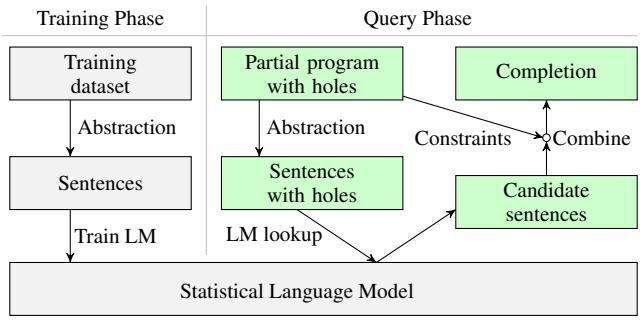
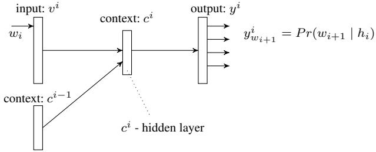

# Code Completion with Statistical Language Models

Veselin Raychev

ETH Z¨urich veselin.raychev@inf.ethz.ch

Martin Vechev ETH Z¨urich martin.vechev@inf.ethz.ch

Eran Yahav Technion yahave@cs.technion.ac.il

# Abstract

We address the problem of synthesizing code completions for programs using APIs. Given a program with holes, we synthesize completions for holes with the most likely sequences of method calls.

Our main idea is to reduce the problem of code completion to a natural-language processing problem of predicting probabilities of sentences. We design a simple and scalable static analysis that extracts sequences of method calls from a large codebase, and index these into a statistical language model. We then employ the language model to find the highest ranked sentences, and use them to synthesize a code completion. Our approach is able to synthesize sequences of calls across multiple objects together with their arguments.

Experiments show that our approach is fast and effective. Virtually all computed completions typecheck, and the desired completion appears in the top 3 results in 90% of the cases.

*Categories and Subject Descriptors* D.2.4 [*Software Engineering*]: Software/Program Verification—Statistical methods; I.2.2 [*Artificial Intelligence*]: Automatic Programming—Program synthesis

# 1. Introduction

To accomplish many common tasks, programmers increasingly rely on the rich functionality provided by numerous libraries and frameworks. Unfortunately, a typical API can involve hundreds of classes with dozens of methods each, and often requires specific sequences of operations to be invoked to perform a single task [\[9,](#page-9-0) [38,](#page-9-1) [39\]](#page-9-2). Even experienced programmers might spend hours trying to understand how to use a simple API [\[23\]](#page-9-3). To address this challenge, recent years have seen increasing interest in code search, recommendation and completion systems [\[7,](#page-9-4) [15,](#page-9-5) [19,](#page-9-6) [23,](#page-9-3) [25](#page-9-7)[–27,](#page-9-8) [29,](#page-9-9) [35,](#page-9-10) [43\]](#page-9-11).

Despite significant progress, existing techniques cannot *synthesize* usable code beyond simple sequences required for instantiation of library objects. No existing technique can synthesize code of the complexity found in real tutorials and code examples. In fact, most existing approaches to code completion target completion based on shallow semantic information, and cannot capture the temporal information required for synthesizing correct code using a library. Some specification-mining techniques do capture rich temporal information (see Sec. [8\)](#page-8-0), but do not attempt to synthesize usable code.

PLDI '14, June 09–11, 2014, Edinburgh, United Kingdom. Copyright c 2014 ACM 978-1-4503-2784-8/14/06. . . \$15.00. http://dx.doi.org/10.1145/2594291.2594321

*Our Approach: Synthesis with Statistical Language Models* Statistical language models have been successfully used to model regularities in natural languages and applied to problems such as speech recognition, optical character recognition, and others [\[28\]](#page-9-12).

Our main idea is to reduce the problem of code completion to a *natural-language processing* problem of predicting probabilities of sentences: we use regularities found in sequences of method invocations to predict and synthesize a likely method invocation sequence for code completion.

*Big Data, Small Programs* To construct the statistical language model, we use static analysis to extract a large number of *histories* of API method calls from a massive number of *code snippets* obtained from [GitHub](https://github.com/) and other repositories. The extracted histories are used as training sentences for the statistical language model. We show that the quality of the synthesized completion depends on the aliasing information used during the history extraction phase. Our synthesizer represents a powerful *combination* of statistical language models with program analysis techniques.

The synthesizer takes as input a partial program with holes and outputs a program where all of the holes are filled in with (sequences of) method invocations. Computing the "small program" required for code completion, is based on the language model constructed from "big data". Specifically, we employ the language model to find the highest ranked sentences, and use them to synthesize a code completion.

Our synthesizer can: (i) discover sequences of invocations across multiple types, (ii) complete both invocations *and* arguments of invocations, (iii) complete multiple holes as well as each hole with a sequence of invocations, and (iv) infer fused completions which do not exist in the training set.

*Contributions* The main contributions of this paper are:

- A new approach to code completion for programs using APIs. Our approach reduces the problem of code completion to a natural-language processing problem of predicting probabilities of sentences.
- A scalable static analysis that extracts sequences of method calls from large codebases, and indexes them into statistical language models such as N-gram and Recurrent Neural Networks.
- A *synthesis procedure* that takes as input a partial program with holes and leverages probabilities learned in the language model to discover code completions for the holes. Our approach is able to synthesize sequences of calls across multiple objects together with their arguments.
- An implementation of our approach in a tool called SLANG and an experimental evaluation on a number of real world programming scenarios expressed with partial programs. Our results show that SLANG is fast and effective. Virtually all completions synthesized by SLANG typecheck, and the desired completion appears in the top 3 results in more than 90% of the cases.

Permission to make digital or hard copies of all or part of this work for personal or classroom use is granted without fee provided that copies are not made or distributed for profit or commercial advantage and that copies bear this notice and the full citation on the first page. Copyrights for components of this work owned by others than ACM must be honored. Abstracting with credit is permitted. To copy otherwise, or republish, to post on servers or to redistribute to lists, requires prior specific permission and/or a fee. Request permissions from permissions@acm.org.



<span id="page-1-0"></span>Figure 1. The architecture of SLANG.

# 2. Overview

The overall flow of SLANG is shown in Fig. [1.](#page-1-0) During the training phase, we use program analysis to extract sequences of API calls from the entire code base. Then, a statistical language model is trained on this extracted data. In this work we use the N-gram model, Recurrent Neural Networks and a combination of these two. The result of the training phase is a probability associated with each of the extracted sequences of method invocations. To interact with SLANG, the programmer provides a partial program with holes. Our program analysis extracts the sequences from this partial program, and uses the statistical language model to compute a set of candidate completion sequences. The final completion for all the holes is selected based on the highest probability and on whether the completion satisfies the constraints posed by each hole.

The effectiveness of SLANG is due to a careful *combination* of statistical models with program analysis. In particular, we use a form of alias and history analysis to extract relatively precise sequences of method invocations from the code base, which are then used to train the language model. Training on sequences extracted *without* performing program analysis produces poor results and fails to produce completions (let alone desired ones) for many examples. Our combination of program analysis and language models makes the difference between not obtaining any solution at all versus obtaining the desired solution at the top of the list.

*Example* To illustrate our approach, consider a representative Android example shown in Fig. [2.](#page-1-1) The Android MediaRecorder API is known to be quite involved. The official documentation for this API includes a state-machine with 7 different states[1](#page-1-2) , corresponding to internal states of the media recorder.

Consider a programmer trying to work with the MediaRecorder API and interested in combining this API with other APIs from classes such as Camera and SurfaceHolder. The programmer may have partial knowledge about MediaRecorder, for instance, she may know that she needs to set an audio and video source as well as the exact API calls and parameters for doing so. However, she may still be missing some of the details.

Using SLANG, a programmer can write the partial program of Fig. [2\(](#page-1-1)a), and rely on the synthesizer to complete the missing details. The partial program uses the statement "**?**" to denote a "hole", missing code to be completed by the synthesizer. The program of Fig. [2\(](#page-1-1)a) has four different holes, marked with comments (H1)-(H4). Each hole is a query to the synthesizer asking it to infer a sequence of method invocations using (some of) the variables that are in scope. The hole can be constrained to only use certain variables by specifying a set of variable names. In this example, holes (H1)-(H2) are not bound to specific variables, while (H3)-(H4) are limited to only infer invocations that use the variable rec (either

```
1
 see http://goo.gl/PZRic
```
void exampleMediaRecorder() throws IOException { Camera camera = Camera.open(); camera.setDisplayOrientation(90); **?** // **(H1)** SurfaceHolder holder = getHolder(); holder.addCallback(this); holder.setType(SurfaceHolder.SURFACE\_TYPE\_PUSH\_BUFFERS); MediaRecorder rec = new MediaRecorder(); **?** // **(H2)** rec.setAudioSource(MediaRecorder.AudioSource.MIC); rec.setVideoSource(MediaRecorder.VideoSource.DEFAULT); rec.setOutputFormat(MediaRecorder.OutputFormat.MPEG\_4); **? {rec}** // **(H3)** rec.setOutputFile("file.mp4"); rec.setPreviewDisplay(holder.getSurface()); rec.setOrientationHint(90); rec.prepare(); **? {rec}** // **(H4)** } (a) void exampleMediaRecorder() throws IOException { Camera camera = Camera.open();

camera.setDisplayOrientation(90); **camera.unlock()**; SurfaceHolder holder = getHolder(); holder.addCallback(this); holder.setType(SurfaceHolder.SURFACE\_TYPE\_PUSH\_BUFFERS); rec = new MediaRecorder(); **rec.setCamera(camera);** rec.setAudioSource(MediaRecorder.AudioSource.MIC); rec.setVideoSource(MediaRecorder.VideoSource.DEFAULT); rec.setOutputFormat(MediaRecorder.OutputFormat.MPEG\_4); **rec.setAudioEncoder(1); rec.setVideoEncoder(3);** rec.setOutputFile("file.mp4"); rec.setPreviewDisplay(holder.getSurface()); rec.setOrientationHint(90); rec.prepare(); **rec.start();** } (b)

<span id="page-1-1"></span>Figure 2. (a) A partial program using MediaRecorder and other APIs, and (b) its completion as synthesized by SLANG.

passed in as an argument or as the receiver). In Section [5,](#page-4-0) we describe other forms of queries that can relay additional information to the synthesizer. Given the partial program of Fig. [2\(](#page-1-1)a), SLANG automatically synthesizes completions for the holes using the most likely sequences of method invocations, shown in bold in Fig. [2\(](#page-1-1)b).

*Key Aspects* This example highlights four key aspects of SLANG:

- Completion across multiple types: the completion of (H1) as camera.unlock() is an invocation on an object of type Camera, the completions for (H2-H4) are invocations on an object of type MediaRecorder. Further, the completion of (H2) as rec.setCamera(camera) uses parameter of type Camera in a completed invocation for MediaRecorder.
- Completion of parameters: the completion of (H3) using the two invocations rec.setAudioEncoder(1) and rec.setVideoEncoder(3) includes not only the invocations, but also the required parameters.
- Holes as sequences: The completion of (H3) uses a sequence of two invocations to complete a single hole. In general, our approach can generate a sequence of invocations to complete a hole (up to some specified length).
- New fused completions: Our system can infer fused sequences that *did not exist* before. Neither of the sequences for Camera or MediaRecorder were in the training set, yet SLANG successfully synthesized an invocation that involves both of these in order to complete the hole (H2).

# <span id="page-2-2"></span>3. Model

In this section, we provide basic definitions of an *event* and a sequence of events (history) that we use in the rest of the paper. In Section [3.1,](#page-2-0) we provide a simple instrumented semantics for tracking sequences of events over objects. Because there is no a priori bound on the number of dynamically allocated objects, and no a priori bound on the length of a history, the concrete semantics is generally non computable. In Section [3.2,](#page-2-1) we present an abstract semantics that provides a bounded representation for histories, and tracks a bounded set of bounded histories for each (abstract) object.

### <span id="page-2-0"></span>3.1 Concrete Semantics

We define an instrumented concrete semantics that tracks the concrete sequence of events for each concrete object. We refer to the concrete sequence of events as the *concrete history* of the concrete object. We start with a standard concrete semantics for an imperative object-oriented language, defining a program state and evaluation of an expression in a program state.

*Objects and Program State* Restricting attention to reference types, the semantic domains are defined as follows:

| \<br>L                                   | ∈ | P(objects\<br>)                       |
|------------------------------------------|---|---------------------------------------|
| \<br>v                                   | ∈ | Val = objects\ ∪ {null}               |
| \<br>ρ                                   | ∈ | Env = VarIds → Val                    |
| \<br>π                                   | ∈ | Heap = objects\ ×<br>FieldIds → Val   |
| state\ =<br>\<br>, ρ\<br>, π\<br>hL<br>i | ∈ | States = P(objects\<br>) × Env × Heap |

where *objects*\ is an unbounded set of dynamically allocated objects, *VarIds* is a set of local variable identifiers, and *FieldIds* is a set of field identifiers. A *program state* tracks the set L \ of allocated objects, an *environment* ρ \ mapping local variables to (reference) values, and a heap π \ mapping fields of allocated objects to values.

*Instrumented Semantics: Events and Histories* In our instrumented semantics, each concrete object is mapped to a "concrete history" that records the sequence of *events* that has occurred for that object. That is, we employ a form of per-object cartesian abstraction. An *event* for an object o corresponds to an invocation of an API method involving the object o: o can either be the receiver object (this), the return value returned by the API invocation, or one of the arguments to the method invocation.

More formally, an *event* is a pair hm(t1, . . . , tk), pi, of a method signature m(t1, . . . , tk), and a position argument p denoting the position of the object o in the invocation of m. The position p can be 0 denoting this, or a value denoting one of the positions 1, . . . , k. We also use a designated position value ret to denote the case where o is a new object returned from the invocation of m. To simplify presentation, we assume that an object appears in at most one position of a given method invocation, and that methods are not invoked with a *null* argument. Our implementation deals with the more general case where an object can appear in multiple positions (by replacing the position argument p to be a set of positions), and correctly handles invocations with *null* arguments.

Given an API A with methods m1, . . . , mn, we use Σ<sup>A</sup> to denote the set of all events over the API. When the API is clear from context, we omit the subscript A. We define the notion of a *concrete history* for an API simply as a sequence of events Σ ∗ . We denote the empty concrete history by and denote the set of all concrete histories by H. The instrumented semantics is obtained by augmenting every concrete state hL \ , ρ\ , π\ i with an additional mapping that maps each allocated object to its concrete history, that is his\ : L \ \* H. Given a state hL \ , ρ\ , π\ , his\ i, the semantics generates a new state hL \ 0 , ρ\ 0 , π\ 0 , his\ 0 i when evaluating each statement. We assume a standard interpretation for statements updating L \ , ρ \ , and π \ . The his\ component changes on object allocations and method invocations:

- *Object Allocation:* The statement x = new T() allocates a fresh object onew ∈ *objects*\ \ L \ initialized with the emptysequence history his\ 0 (onew) = .
- *Method Invocation:* For an invocation x0.m (x1, . . . , xn) of a method with signature m(t1, . . . , tn), the history of every object o = ρ \ (xi) (where 0 ≤ i ≤ n) is extended with an event e = hm(t1, . . . , tn), ii, that is: his\ 0 (o) = his\ (o) · e, adding an event to the history to reflect the invocation of m. If the invocation of m returns an object r, its history his\ (r) is extended with hm(t1, . . . , tn), reti.

### <span id="page-2-1"></span>3.2 Abstract Semantics

The instrumented concrete semantics is generally non-computable as there are no a priori bounds on the number of dynamically allocated objects, or on the length of histories. We now present an abstract semantics that provides a bounded representation.

*Heap Abstraction* We use a flow-insensitive Steensgaard style [\[33\]](#page-9-13) points-to analysis to partition the *objects*\ set into a bounded set of abstract objects called *objects*.

*History Abstraction* Our goal is to extract a set of *sentences* that can be given as input to language models (see Section [4\)](#page-3-0). Towards that end, we bound the number of loop iterations in our analysis to guarantee that collected histories are of bounded length. We define the notion of an *abstract history* as a set of concrete histories of bounded length, namely an abstract history h ⊆ H. That is, while a concrete history describes a unique sequence of events, an abstract history represents potentially many concrete histories capturing the different control flows through the program.

*Abstract State* The tuple hL, ρ, π, hisi denotes an instrumented abstract program state consisting of the set of allocated abstract objects, the local variables which point to abstract objects, the abstract heap and the abstract history for each abstract object. The definition of the first three components is computed in a standard way. We next discuss the definition of his which is now lifted to abstract objects and abstract histories as follows: his: L \* P(H).

*Abstract Semantics of* his The abstract semantics for updating his follow the structure of the concrete semantics except that it is lifted to deal with abstract objects, and abstract histories.

- *Object Allocation:* The statement x = new T() results in an abstract object anew ∈ *objects* with a set containing a new empty history: his(anew) ∪ = {}.
- *Method Invocation:* For an invocation x0.m (x1, . . . , xn) of a method with signature m(t1, . . . , tn), the abstract history of every abstract object o = ρ(xi) (0 ≤ i ≤ n) is extended with e = hm(t1, . . . , tn), ii, that is, his<sup>0</sup> (o) = {h · e | h ∈ his(o)}, adding an event to each concrete history of the abstract history. If the invocation returns an object r, the abstract history his(r) is extended with hm(t1, . . . , tn), reti.

*Joins* Whenever a join of the control-flow occurs, the new history for each abstract object is computed by combining the histories for that abstract object arriving from each of the branches (by applying union to the corresponding sets). As long as the domain of abstract histories is bounded, the analysis is guaranteed to terminate. However, in practice, it can suffer from an exponential blowup due to branching control flow. To mitigate potential exponential blowup, we limit the number of collected histories by some threshold. Once that threshold has been met, we randomly evict older histories to make room for new ones. In our experiments, we used the threshold 16 which was sufficient for 99.5% of the analyzed methods.

# <span id="page-3-0"></span>4. Statistical Language Models

Statistical language models have been used to model the regularities in natural languages and improve the performance of problems such as speech recognition, statistical machine translation, optical character recognition, and others [\[28\]](#page-9-12). In this work, we use regularities found in sequences of method invocations to predict and synthesize a likely method invocation sequence in the context of code completion. In this section, we first define the necessary statistical language modeling background, and then show how these can be leveraged for synthesis of code completions.

Statistical language models are based on the concepts of words and sentences, where each sentence is an ordered sequence of words. Every word w is taken from a set D also called a dictionary. A language is informally defined as all sentences that are used in some particular domain. The goal of a language model is to build a probabilistic distribution over all possible sentences in a language. This is, given a sentence s, the language model estimates its probability P r(s). For a sentence s = w<sup>1</sup> · w<sup>2</sup> · ... · wm, many language modeling approaches estimate its probability as follows:

$$Pr(s) = \prod\_{i=1}^{m} Pr(w\_i \mid h\_{i-1})$$

where we refer to the sequence h<sup>i</sup> = w<sup>1</sup> · w<sup>2</sup> · ... · w<sup>i</sup> as a history. That is, the probability of a sentence can be calculated by generating it word by word using conditional probabilities on the already generated words. Furthermore, language models are usually constructed on a finite amount of training data that is used to estimate the actual probabilities of sentences. Because not all possible sentences in the language or their prefixes will be in the training data (also referred to as the problem of sparse data [\[28\]](#page-9-12)), the model uses other statistical techniques to estimate probabilities.

### 4.1 N-gram language models

In order to deal with the sparseness of the data, an N-gram data model estimates the probability of a sentence by modeling a language as a Markov source of order n − 1:

$$Pr(s) = \prod\_{i=1}^{m} Pr(w\_i \mid w\_{i-n+1} \cdot \dots \cdot w\_{i-1})$$

That is, the probability of the next word w<sup>i</sup> depends only on the previous n − 1 words. In our work we use the trigram language model where the probability of a word depends on a pair of previous words. That is, for the trigram language model, we have P r(s) = Q<sup>m</sup> <sup>i</sup>=1 P r(w<sup>i</sup> | wi−<sup>2</sup> · wi−1). Such probabilities are estimated by counting the number of occurrences of trigrams and bigrams in the training data.

*Smoothing* Even for small n, these models can still suffer from the problem of data sparseness. For example, some n-grams may only occur once or not at all in the training data and yet their probabilities must be estimated. To mitigate this problem, practical ngram language models use counts for n-grams, (n − 1)-grams and for all lengths down to unigrams. Further, they smooth the probability by using models of lower length [\[20,](#page-9-14) [21\]](#page-9-15) when sparseness problems in estimating sentence probabilities occur. In our work, we use Witten-Bell smoothing [\[40\]](#page-9-16), which is applicable even when we remove rare words from the training data.

### 4.2 Recurrent Neural Networks (RNNs)

In recent years, the increased availability of computational resources for training led to wider adoption of neural networks for predicting probabilities of sentences [\[22\]](#page-9-17). These approaches are conceptually interesting in the fact that they do not capture only regularities between a word and a fixed number of predecessor



<span id="page-3-1"></span>Figure 3. A scheme of a recurrent neural network (RNN). The input is a word vector for the i-th word in a sentence, the output is probabilities for different possible words at position i + 1.

words, but may also capture longer distance relations between words. Initially proposed by Elman [\[13\]](#page-9-18), recurrent neural networks (RNNs) predict probabilities of the (i+ 1)-st word according to the scheme in Fig. [3.](#page-3-1)

In the schema, v i and y i are vectors of |D| real numbers, where D is the dictionary such that every possible word x ∈ D has a corresponding index in v i and y i (referred as v i <sup>x</sup> and y i <sup>x</sup>). Let c i (for every i) be a vector of p real numbers. The number p is also called the size of the hidden layer and the entire network is referred to as RNN-p. RNN uses two functions f and g and estimates word probabilities iteratively on a sentence s = w<sup>1</sup> · ... · w<sup>m</sup> by performing the following actions for every word w<sup>i</sup> ∈ s : i) set all positions of v i to zeros, except position v i wi to one. ii) Compute c <sup>i</sup> = f(v i , c<sup>i</sup>−<sup>1</sup> ) and y <sup>i</sup> = g(c i ). Then the vector y i is used as an estimator of the probabilities for the next word wi+1:

$$\Pr(w\_{i+1} \mid w\_1 \cdot \ldots \cdot w\_i) \approx y\_{w\_{i+1}}^i$$

During training, the functions f and g are learned from data to minimize the error rate of the estimates y i (details are in [\[22\]](#page-9-17)). What is essential for RNNs however is that they can capture long distance regularities in the language via the hidden layer c i . The values in c i act as an internal state of an automaton and at every step i, the previous internal state c i−1 is used for computing c i .

In SLANG, we use RNNME-p – a faster variant of RNN with a hidden layer size of p that combines RNN-p with a class-based maximum entropy model [\[24\]](#page-9-19).

*Combination models* Due to the different natures of the models based on n-grams and RNNs, it is possible that averaging the probability of two models performs better than each model individually. Indeed, in our experiments in Section [7,](#page-6-0) our combined language model between a 3-gram and a RNNME-40 language model ranks the correct completion as a first result in more cases that the two base models individually.

### <span id="page-3-2"></span>4.3 Sentence Completion with Language Models

In addition to computing probabilities for single sentences, we can leverage a language model to complete missing holes in a sentence (with the most likely completions). As a simple example, consider the following natural language sentence with a missing word:

#### The quick brown ? jumped

If the word ? is replaced with an actual natural language word from the dictionary of words D, a statistical language model is useful as a scoring function of the most probable completion. However, certain language models are also useful to suggest very likely completions of the holes. For example, a bigram model keeps all pairs of sequential words that are present in the training data. In our example, these could be the pairs hbrown, foxi, hbrown, dogi, etc. Then, if the word preceding the hole is a (e.g., a = brown), we can suggest filling the hole only with words x, such that ha, xi are bigrams in the training data. This procedure significantly reduces the set of words that are candidate completions of the sentence holes by producing candidates which a language model may score high.

In this work, we use such a bigram model to generate candidate sentences and later use another language model such as N-gram and RNN to assign probabilities to these sentences.

### 4.4 Training on Program Data

In this work we propose an approach which connects statistical language models with features extracted via program analysis. In particular, in Section [3,](#page-2-2) we presented a history abstraction that maps every (abstract) object to a set of histories (i.e., sentences). These sentences can be automatically extracted via program analysis and then fed to a statical language model which can train on this data.

Our abstraction nicely matches the two worlds of program analysis and language models: an event in the semantics corresponds to a language word and a history sequence h ∈ H corresponds to a language sentence. To train a language model on a large set of programs, we: (i) use program analysis to extract the abstract objects and their corresponding (history) sequences; and (ii) discard the abstract objects, treat the extracted histories as sentences in the language, and train a statistical language model over this data.

# <span id="page-4-0"></span>5. Synthesis

So far we discussed the training phase of our system. We next discuss how code completion works. The synthesizer takes as input a partial program (augmented with holes) and outputs a program where the holes are filled with (sequences of) method invocations. To enable programmers to use our approach and specify partial programs, we introduce the following construct for specifying holes:

#### ? lvars:l:u

where lvars ∈ P(V arIds) is a set of (reference) local variables and l and u are natural numbers which constrain the length of the sequence from below and from above. All of these are optional parameters which are provided as a convenience to the programmer in case she would like to constrain the possible completions. Informally, this construct directs the synthesizer to search for a valid replacement of ? lvars:l:u with a sequence of method invocations where lvars participates in each invocation and where the length of the sequence is between l and u. For example, the hole ? directs the synthesizer to look for the most likely sequence of method invocations of *any* length. A more restrictive hole would be ?{x} which instructs the synthesizer to find sequences where variable x participates in the method invocation: either a method on x was invoked *or* x is passed in as an argument to some other method. That is, in the sequence, for each of the method invocations, the variable x should participate in some form. The meaning of a query such as ?{x,y}:1:1 is that the suggested sequence must consist of exactly 1 method invocation where *both* x and y participate in that invocation.

*Code Completion: Step-by-Step* We now present the procedure which takes as input a partial program that may contain multiple holes and infers the most likely completions for the holes. To avoid clutter, we describe the case where all of the holes require l and u to be equal to 1, that is, all holes have the shape: ?lvars:1:1. This means that every hole has to be replaced with exactly one method invocation (there could be multiple variables constraining the hole). We can translate holes of the more general shape ?lvars:l:u to u − l + 1 separate queries: for every i ∈ [l, u], perform a query with i sequentially placed holes where each hole has the shape ?lvars:1:1.

```
SmsManager smsMgr = SmsManager.getDefault();
int length = message.length();
if (length > MAX_SMS_MESSAGE_LENGTH) {
  ArrayList<String> msgList =
      smsMgr.divideMsg(message);
  ? {smsMgr, msgList} // (H1)
} else {
  ? {smsMgr, message} // (H2)
}
                         (a)
SmsManager smsMgr = SmsManager.getDefault();
int length = message.length();
if (length > MAX_SMS_MESSAGE_LENGTH) {
  ArrayList<String> msgList =
      smsMgr.divideMsg(message);
  smsMgr.sendMultipartTextMessage(...msgList...);
} else {
  smsMgr.sendTextMessage(...message...);
}
                         (b)
```
<span id="page-4-1"></span>Figure 4. (a) A partial program built from an example on Stack-Overflow [\[3\]](#page-9-20), and (b) its completion as automatically synthesized by SLANG (the full list of parameters is omitted for clarity).

Before we explain the steps of our algorithm, let us introduce some necessary notation. Recall that a concrete history is a sequence of events where each event (see Section [3.1\)](#page-2-0) represents a method invocation. However, with partial programs, we now have hole statements which are to be replaced with sequences of events. Therefore, we define a set of histories with holes H◦ = (Σ ∪ G) ∗ where G represents all possible holes.

Next, we explain our algorithm and illustrate each step on the example in Fig. [4.](#page-4-1) Here, we have a partial program Fig. [4\(](#page-4-1)a), for which SLANG must synthesize the completion in Fig. [4\(](#page-4-1)b). That is, the tool must infer that if the message was divided into parts, the most likely method to call is sendMultipartTextMessage, while otherwise it is sendTextMessage. The first and the second hole are assigned unique identifiers **H1** and **H2** respectively.

*Step 1: Extract abstract histories with holes* Given a partial program, for each abstract object, we automatically extract its abstract histories with holes (as described in Section [3.2,](#page-2-1) except that we now also have holes appearing in abstract histories). The output of this step is a function hispt : L \* P(H◦ ). For our running example, the output of this step will be a map hispt defined as follows:

$$\begin{array}{lcl} \mathsf{smsMgr} & \mapsto & \{\langle \mathsf{get.Dofaut.}, \mathsf{rat.} \rangle \cdot \langle \mathsf{H2} \rangle \} \\ & & \langle \mathsf{get.Dofaut.}, \mathsf{rat} \rangle \cdot \langle \mathsf{di.vidaMsg}, 0 \rangle \cdot \langle \mathsf{H1} \rangle \} \\\\ \mathsf{message} & \mapsto & \{\langle \mathsf{length}, 0 \rangle \; , \quad \langle \mathsf{length}, 0 \rangle \cdot \langle \mathsf{H2} \rangle \} \\\\ \mathsf{megLást} & \mapsto & \{\langle \mathsf{di.vi.eloMsg}, \mathsf{r.et} \rangle \cdot \langle \mathsf{H1} \rangle \} \end{array}$$

*Step 2: Compute candidate completions* We next compute the set of candidate completions for all of the abstract histories obtained from Step 1. For our example, this set of partial histories is shown in the first column of Fig. [5.](#page-5-0) To aid the subsequent completion, we slightly overload the notation for holes and to each hole, we also add the abstract object for which the partial abstract history was built. For instance, if SLANG suggests hsendTextMessage, 0i for replacing h**H2**, **smsMgr**i, then **smsMgr** will be placed at position 0, essentially denoting the invocation **smsMgr**.sendTextMessage(...).

For each partial abstract history, we compute a *sorted* list of possible histories *without* holes. The way we do that is via a twostep approach. In the first step, we use the bigram model in order to suggest candidate completions to the holes and obtain histories without holes (as discussed in Section [4.3\)](#page-3-2). Then, in the second

| Partial History                                   |    | Candidate Completions                                              |        |  |  |
|---------------------------------------------------|----|--------------------------------------------------------------------|--------|--|--|
| hgetDefault, reti · hH2, smsMgri                  | 11 | hgetDefault, reti · hsendTextMessage, 0i                           | 0.0073 |  |  |
|                                                   | 12 | hgetDefault, reti · hsendMultipartTextMessage, 0i                  | 0.0010 |  |  |
| hgetDefault, reti · hdivideMsg, 0i · hH1, smsMgri | 21 | hgetDefault, reti · hdivideMsg, 0i · hsendMultipartTextMessage, 0i | 0.0033 |  |  |
|                                                   | 22 | hgetDefault, reti · hdivideMsg, 0i · hsendTextMessage, 0i          | 0.0016 |  |  |
|                                                   | 31 | hlength, 0i · hlength, 0i                                          |        |  |  |
| hlength, 0i · hH2, messagei                       | 32 | hlength, 0i · hsplit, 0i                                           |        |  |  |
|                                                   | 33 | hlength, 0i · hsendTextMessage, 3i                                 |        |  |  |
|                                                   | 34 | hlength, 0i · hsendMultipartTextMessage, 1i                        |        |  |  |
| hdivideMsg, reti · hH1, msgListi                  | 41 | hdivideMsg, reti · hsendMultipartTextMessage, 3i                   |        |  |  |

<span id="page-5-0"></span>Figure 5. The partial sequences extracted from the program in Fig. [4](#page-4-1) and their candidate completions (with probabilities).

step, we use an N-gram language model or an RNN model to rank these completed candidate histories.

Finally, we end up with a map candidates: H◦ \* H<sup>∗</sup> where for a partial abstract history, the list candidates(h) is sorted by the probability of the sequence (history without holes). That is, more likely sequences appear ahead of less likely sequences. For our example, the candidate completions together with the probability of each sequence are shown in the last two columns of Fig. [5.](#page-5-0)

*Step 3: Compute an Optimum and Consistent Solution* Finally, in this step we compute the map completion: H◦ \* H. That is, for each partial abstract history h ∈ H◦ , we need to select a history from candidates(h) which completes h. However, even though the list candidates(h) is sorted by probability, we may not always pick the first sequence in that list. The reason we cannot always pick the first sequence is because we need to make a *global* decision for *all* suggested completions, rather than a *local* per-history choice. In our algorithm, we iterate over the map candidates (over the sorted lists in candidates), following the sorted priority order and build a map completion for each abstract history. In particular, the completion which we return satisfies two criteria:

• *Global optimality*: Let T = hispt(L) denote all partial abstract histories. Then, the returned completion should maximize the score:

$$\frac{\sum\_{h \in T} (Pr(completion(h)))}{|T|}$$

• *Consistency*: A proposed completion should also be consistent: we make sure that the completion satisfies certain constraints imposed by the programming language and by the constraints of the hole. First, if a hole appears multiple times (e.g., due to loop unrolling), then we make sure that the hole is always filled in with the same completion in every history of completion's range (to yield a syntactically valid program). Second, if we have a hole of type ?{x,y,...}:1:1 which involves more than one variable (which do not alias), we make sure that the variables x, y,..., appear as parameters at different positions in the corresponding suggestion.

Since our completion algorithm starts with the highest scoring completion and exhaustively generates candidates in reverse score order until a consistent completion is obtained, our procedure is guaranteed to always find the best scoring completion. Finally, given a completion, we extract the methods found for each hole and suggest those to the developer.

*Completions for our example* Back to our example, if we choose the completions 11, 21, 31, and 41 in Fig. [5,](#page-5-0) we get the highest probability according to the Global optimality equation above. However the combination of these sentences is *inconsistent* because completion 11 suggests that we fill the hole **H2** with method sendTextMessage while 31 suggests that we use sendTextMessage. This is clearly impossible when the hole is of size one. Thus, we continue to generate candidate completions in the order of their probabilities until we find the first consistent completion – using sentences 11, 21, 33, and 41. According to this choice of sentences, **H1** is filled with sendMultiPartTextMessage, and **H2** is filled with sendTextMessage. This is the completion returned to the developer, also shown in Fig. [4](#page-4-1) (b).

# 6. Implementation

We implemented SLANG as a series of utilities that train statistical language models on massive codebases and perform completions on partial programs with holes. SLANG is implemented in Java and C++ and depends on a Java compiler for compiling the code, the Soot [\[36\]](#page-9-21) framework for obtaining an intermediate representation (we work with Jimple) useful for program analysis, SRILM [\[34\]](#page-9-22) for n-gram language models, and RNNLM [\[34\]](#page-9-22) for recurrent neural networks. We have designed SLANG to be scalable and efficient: it can handle most queries in few seconds. Next, we discuss the implementation of the different components of SLANG.

### 6.1 Program Analysis: Heap and Sequences

We aimed at a simple, fast and scalable program analysis that can quickly process massive amounts of data. To abstract the heap, we implemented an intra-procedural Steensgaard-style alias analysis [\[33\]](#page-9-13) due to its near linear time complexity and the fact that it can process classes and methods independently. At the start of every method, we assume that all reference arguments in the method do not alias. Generally, an assumption of this (or similar) kind is required, because at both training time and query time we do not have the entire context in which the method will execute. Further, for our problem of suggesting code completions, we are not limited to only consider over-approximations.

In our implementation of the history abstraction, we bound the number of loop iterations L in order to avoid exponential blowup in space and time (in the number of generated sequences). Further, we do not consider extracted sequences with more than K words (invocations) per abstract object. We can easily vary both L and K, though in our experiments we set those to 2 and 16 respectively.

### 6.2 Language Models: preprocessing

Once the sentences (histories) from the training data are obtained via the program analysis, we index them into a language model. As with natural languages, sentences include some commonly occurring words, but there is a heavy long tail of very rare words. However, the rarely occurring words are of little value for our code completion problem. The reason is that these words are likely to represent events that are specific to only a few projects in our index. Thus, we have added a preprocessing step that replaces words that occur less than a certain number of times in the training corpus with placeholder unknown words. This replacement has no observable effect on the availability of results other than for very rare API calls. However, it enables us to obtain compact n-gram language models and a small dictionary is essential for RNNs [\[10\]](#page-9-23).

Once the preprocessing step is complete, SLANG invokes a language modeling system in order to generate an N-gram language model or an RNN-model of the training data and in addition also builds a bigram model of the training data in order to create candidate completions as described in Section [4.3.](#page-3-2) These two steps are independent and can be performed in any order.

### 6.3 Query Processing

To perform a query in SLANG, the user provides a partial program with holes which are to be filled-in by the tool. Given a query, SLANG discovers a mapping from holes to (sequences of) method invocations. The completions include method names, as well as non-constant parameters given to the method call. That is, SLANG can infer both method invocations as well as the reference arguments passed to the invocation. To also infer constants, we train a simple, but effective model that given a method call and a parameter position, returns the most likely constant to pass as a parameter.

*Constant model* We estimate the probability of a constant value as a parameter of a method m by counting the number of times each constant was given as a parameter to m in the training data and dividing it by the total number of calls to m in the training data. This simple model assumes that the constant values are independent of the context of the method or other parameters, yet the approach is fast, feasible and enables our completion to include complete method invocations.

# <span id="page-6-0"></span>7. Evaluation

In this section we discuss an experimental evaluation of SLANG. Our main objective was to study how effective the combination of a statistical language model with a history abstraction is for code completion purposes. Towards that, we collected 3, 090, 194 Android methods and used them as training data. We obtained Android source code from various source repositories, and then compiled these sources using a specially modified version of the partial compiler [\[12\]](#page-9-24), extended to handle more cases.

### 7.1 Training Parameters

To evaluate the effect of various parameters on the quality of code completion, we experimented with three knobs: the size of the data set, the precision of the program analysis abstraction, and the different choices for the language models.

For the size of the training data set, we considered three choices. The first data set includes the entire codebase we have collected. The second (smaller) data set contains 10% of the files of the codebase. The third (smallest) data set contains 1% of the files. For the program analysis abstraction, we experimented with both options: enabling or disabling the alias analysis. Finally, we experimented with the following options for training the statistical language model: (i) A 3-gram language model with Witten-Bell smoothing, (ii) A RNNME-40 recurrent neural network language model, (iii) A combination of the previous two language models.

### 7.2 Training phase

We ran our experiments on a standard desktop workstation with a 3.5GHz Core i7 2600K processor, 16GB RAM, a solid state drive storage, and running 64-bit Ubuntu 12.04 with OpenJDK 1.7. Our system takes the Jimple input data and produces a language model as an output. Our system can parallelize some steps of the computation by performing the analysis on multiple cores, however we report runtimes only using a single thread.

Running times of our training phase are summarized in Table [1.](#page-6-1) First, we provide the time to extract the abstract histories (i.e.,

| Phase                              | Running time on dataset |         |          |  |
|------------------------------------|-------------------------|---------|----------|--|
|                                    | 1%                      | 10%     | all data |  |
| training without alias analysis    |                         |         |          |  |
| Sequence extraction                | 4.682s                  | 54.187s | 9m 3s    |  |
| 3-gram language model construction | 0.352s                  | 2.366s  | 10.187s  |  |
| RNNME-40 model construction        | 5m 46s                  | 0h 53m  | 5h 31m   |  |
| training with alias analysis       |                         |         |          |  |
| Sequence extraction                | 3.556s                  | 34.846s | 5m 34s   |  |
| 3-gram language model construction | 0.442s                  | 3.239s  | 13.510s  |  |
| RNNME-40 model construction        | 8m 42s                  | 2h 16m  | 9h 34m   |  |

<span id="page-6-1"></span>Table 1. Training phase running times.

| Data statistics                   | Dataset |         |          |  |  |
|-----------------------------------|---------|---------|----------|--|--|
|                                   | 1%      | 10%     | all data |  |  |
| training without alias analysis   |         |         |          |  |  |
| Sequences (file size as text)     | 7.2MiB  | 46.5MiB | 597.4MB  |  |  |
| Number of generated sentences     | 74979   | 759434  | 6989349  |  |  |
| Number of generated words         | 188668  | 1864402 | 16430269 |  |  |
| Average words per sentence        | 2.5163  | 2.4549  | 2.3508   |  |  |
| 3-gram language model file size   | 11.1MiB | 50.9MiB | 72.2MiB  |  |  |
| RNNME-40 language model file size | 19.3MiB | 41.8MiB | 29.7MiB  |  |  |
| training with alias analysis      |         |         |          |  |  |
| Sequences (file size as text)     | 9.3MiB  | 89.1MiB | 761MiB   |  |  |
| Number of generated sentences     | 81477   | 805578  | 7435307  |  |  |
| Number of generated words         | 241004  | 2358302 | 20751368 |  |  |
| Average words per sentence        | 2.9579  | 2.9275  | 2.7909   |  |  |
| 3-gram language model file size   | 14.6MiB | 69.6MiB | 108.1MiB |  |  |
| RNNME-40 language model file size | 22.2MiB | 51.1MiB | 36.0MiB  |  |  |

<span id="page-6-2"></span>Table 2. Data size statistics.

sequences) from the training data. Next, we provide running times for constructing each of the corresponding language models. We provide two pairs of numbers - without heap abstraction (assuming that no two pointers alias), and with a Steensgaard style alias analysis. In all cases, the training phase processes more than 5000 methods per second on average and the main slowdown occurs when we train the neural network. In our experiments, performing the alias analysis did not significantly affect the training time.

Table [2](#page-6-2) provides statistics for the precomputation phase. As seen, by using alias analysis, the data size of the produced sentences increases by around 20%, and average sentence length increases by around 0.45 words. Importantly, the alias analysis enables extraction of more precise histories. All of this reduces noise in the training data and helps the language model learn longer and more precise event sequences from the training data.

In terms of language models, the RNNME-40 language model is significantly slower to train than the 3-gram model (the reason is that the time complexity per processed word in 3-gram is constant, while in RNN, it is linear to the size of the dictionary), but on the other hand the RNN index with all the data is smaller in size.

### 7.3 Code Completion

We designed three different kinds of code completion tasks for evaluating our system:

- 1. *Single object single-method completion*: this task is characterized by a *single* hole of type ?{x}:1:1 placed at the end of a method, meaning that given a local reference variable x, the task of the synthesizer is to discover exactly one method invocation which uses x. That is, the tool predicts the next method call to be performed involving x.
- 2. *General completion*: this task is characterized by *multiple* holes and includes examples like Fig. [2](#page-1-1) and Fig. [4.](#page-4-1)
- 3. *Random completion*: this task completes methods from large programs where one or more holes were introduced at random.

| Column (1)                       | (2)               | (3) | (4)      | (5)                 | (6) | (7)      | (8)                 | (9)               |
|----------------------------------|-------------------|-----|----------|---------------------|-----|----------|---------------------|-------------------|
| Analysis                         | No alias analysis |     |          | With alias analysis |     |          | With alias analysis |                   |
| Language model type              | 3-gram            |     |          | 3-gram              |     |          | RNNME-40            | RNNME-40 + 3-gram |
| Training dataset                 | 1%                | 10% | all data | 1%                  | 10% | all data | all data            | all data          |
| Task 1 (20 examples)             |                   |     |          |                     |     |          |                     |                   |
| Desired completion in top 16     | 11                | 16  | 18       | 12                  | 18  | 20       | 20                  | 20                |
| Desired completion in top 3      | 10                | 12  | 16       | 11                  | 15  | 18       | 18                  | 18                |
| Desired completion at position 1 | 7                 | 8   | 12       | 7                   | 10  | 15       | 14                  | 15                |
| Task 2 (14 examples)             |                   |     |          |                     |     |          |                     |                   |
| Desired completion in top 16     | 3                 | 5   | 7        | 10                  | 10  | 13       | 13                  | 13                |
| Desired completion in top 3      | 3                 | 4   | 6        | 8                   | 8   | 13       | 12                  | 13                |
| Desired completion at position 1 | 3                 | 3   | 5        | 6                   | 6   | 11       | 11                  | 12                |
| Task 3 (50 random examples)      |                   |     |          |                     |     |          |                     |                   |
| Desired completion in top 16     | 13                | 27  | 36       | 21                  | 43  | 48       | 48                  | 48                |
| Desired completion in top 3      | 13                | 23  | 32       | 18                  | 34  | 44       | 40                  | 45                |
| Desired completion at position 1 | 13                | 16  | 25       | 14                  | 25  | 31       | 27                  | 31                |

<span id="page-7-1"></span>Table 4. Accuracy of SLANG on the test datasets depending on the amount of training data, the analysis and the language model.

| Id | Description                                            | Source |
|----|--------------------------------------------------------|--------|
| 1  | Registering a event listener to read the accelerometer | [3]    |
| 2  | Add an account                                         | [3]    |
| 3  | Take a picture with the camera                         | [3]    |
| 4  | Disable the lock screen                                | [3]    |
| 5  | Get Battery Level                                      | [3]    |
| 6  | Get free memory card space                             | [3]    |
| 7  | Get the name of the currently running task             | [3]    |
| 8  | Get the ringer volume                                  | [3]    |
| 9  | Get the SSID of the current WiFi network               | [3]    |
| 10 | Read GPS location                                      | [3]    |
| 11 | Record a video using MediaRecorder                     | [3]    |
| 12 | Create a notification                                  | [3]    |
| 13 | Set display brightness                                 | [4]    |
| 14 | Change the current wallpaper                           | [1]    |
| 15 | Display the onscreen keyboard                          | [3]    |
| 16 | Register an SMS receiver                               | [3]    |
| 17 | Send SMS                                               | [3]    |
| 18 | Load a sound resource to play in SoundPool             | [6]    |
| 19 | Display a web page in a WebView control                | [2]    |
| 20 | Toggle WiFi enabled/disabled                           | [5]    |
|    |                                                        |        |

<span id="page-7-0"></span>Table 3. Description on the examples from task 1 on which we perform prediction.

The first task is similar to functionality provided by many IDEs where when dot is pressed, the IDE displays a complete list of all methods associated with the object on the left of the dot. In our case however, we only display a partial list of methods for which we have confidence given the training data.

*Evaluation data* To evaluate task 1, we came up with 20 tasks that a programmer may want to accomplish. Solving these tasks requires usage of various Android API's. We then inspected some of the popular solutions available on the Web, typically provided in the form of a code snippet. We summarized this set of examples in Table [3.](#page-7-0) To evaluate task 2, we selected 14 code snippets from task 1 where we believed it makes sense to extend the snippet to contain more than one hole and with more complex constraints. For both tasks, we introduced holes in the code snippets accordingly. We made sure to not include the evaluation data into the training data in order to avoid statistical problems such as overfitting.

For task 3, we took code from open source projects and randomly introduced holes in 50 methods with objects interacting with multiple Android APIs. For 23 of the random tests, multiple holes need to be completed. We ensured that the projects we evaluate on were not included in the training data.

*Experiments* We studied how the different knobs in our system affect the quality of code completion. We considered three accuracy metrics, based on the number of examples for which the: (i) desired method invocation is found in the list of results (we limit the size of the list to 16), (ii) desired method invocation was found in the top 3 results, and (iii) desired method invocation was ranked first in the suggested candidates list.

We evaluated a number of parameter choices and summarized the results in Table [4.](#page-7-1) Columns 2-7 contain the effect of the abstraction and the training data size. The system trained on the complete dataset with alias analysis is able to predict all examples in our first task, and the correct completion is in the first 3 results for 90% of the examples. Without alias analysis and with decrease of the training data, the accuracy significantly decreases and we can roughly quantify that *using a better program analysis component has the same effect as adding an order of magnitude more data*.

For our second task, one example could not be solved even by our best system, because SLANG was unable to collect sufficient information for the Notification.Builder class during training. The reason for this is that developers may use the class via a chain of calls builder.setSmallIcon(\_).setAutoCancel(\_) that make it difficult for an intra-procedural analysis to discover calls on the same object. We believe that adding a more advanced (interprocedural) analysis could lead to further improvements of SLANG.

Two tests from the random tests task could not be solved by our best system. We believe one of them is due to a limitation of the partial compiler that prevented us to collect data for a class at training time, while the other is a completion that scores below the top 16 results.

*Language model types* Columns 7, 8 and 9 of Table [4](#page-7-1) summarize the effect of the language models (we compare the models with the full data size and with alias analysis). As discussed in Section [4,](#page-3-0) ngram and RNN differ significantly in the way they express histories of sequences. While n-gram discover regularities between the last n − 1 method calls, RNN is capable of discovering longer distance relations.

In our experiments, the two models differ in how they ranked the completions for some tests: while RNNME-40 was better in examples with long distance relations similar to the one in Fig. [2,](#page-1-1) it occasionally misses some short distance relations. On the other hand, the 3-gram language model consistently found all short distance relations. Both, RNNME-40 and the 3-gram model, were outperformed by a combined model that averages their probabilities.

*Type checking accuracy* To evaluate how many completions typechecked, we took our best combined system and manually inspected all of the 1032 possible completions that SLANG returned (for all of our examples). In this experiment, we found only 5 completions which did not typecheck and they were always among the worst ranked completions for the examples. We believe one of the reasons for such outlier completions to appear in the results is imprecision of the alias analysis at training time, which leads to impossible sequences in the model. To guarantee no type errors, we plan to implement a typechecker on the results of SLANG that discards the bad solutions.

*Constant model* Our constant model worked reasonably well. Out of the 41 constants that needed to be inferred in the first two tasks, 25 were produced by SLANG as the first result and 3 as the second result. However, we believe that prediction of certain constants can be difficult: e.g., guessing URLs, passwords, etc.

*Performance* Our query time performance was dominated by the time necessary to load the language model files. For our best system which combines the two language models, we observed average time per example of 2.78 seconds. To allow for interactive completions within an IDE, we plan to load language models only once at startup.

*Summary* We have shown that SLANG is effective in completing partial programs with holes. Our experiments show that using alias analysis is important and has the effect of an order of magnitude more training data. Combining language models has positive effect on the ranking of the completions in our tests and with our best system, we return the correct completion as a first result in 58 out of 84 test cases.

# <span id="page-8-0"></span>8. Related work

The work of Hindle et al. [\[17\]](#page-9-30) outlines a vision which suggests that techniques from natural language processing (e.g., n-gram language model) may be useful in various programming tasks such as code completion, code search, property computation, etc. We wholeheartedly agree with the authors that this is a direction worth studying in depth. Their paper also presents a simple code completion scheme built on top of Eclipse which uses an n-gram language model to predict the next tokens, and compares the advantages and disadvantages of this scheme versus the traditional code completion already provided by Eclipse.

Our work investigates the potential of these high-level ideas in greater depth. We study the effectiveness of several language models (i.e., n-gram and recurrent neural networks) in the context of a specific application: predicting the sequence of API calls. Further, we show that language models alone are sub-optimal for consistently producing quality sequences of completions and show how to combine these ideas with classic programming languages concepts such as alias analysis. This combination significantly improves the quality of the result. We believe that such combinations of statistical methods with programming language techniques hold a great promise and are worth further exploration.

*Code completion and Synthesis* The last few years have seen a renewed interest in various synthesis techniques which promise to simplify various software development tasks. Many of these techniques deal with some form of program "completion", typically by combining a predefined set of building blocks (e.g., expressions of some kind). For a broader survey in recent program synthesis techniques, see Gulwani [\[14\]](#page-9-31). Below, we briefly discuss the approaches that deal with completion of general user-level code. Prospector [\[23\]](#page-9-3) is an approach which automatically discovers a sequence of API calls that transform an object of a given input type into an object of a given output type. PARSEWeb [\[35\]](#page-9-10) also suggests a sequence of API calls but this time the search for the sequence is guided by the source code available on the Web, thus helping to eliminate many otherwise undesirable sequences. More recent work [\[15,](#page-9-5) [16,](#page-9-32) [26\]](#page-9-33) focuses on code completion by (statically) synthesizing expressions of a given type at a particular program point (these works examine the program context around that point). To find the most likely expressions desired by the programmer, these approaches also rely on ranking algorithms to handle the large numbers of potential candidates. As opposed to these (static) approaches, MatchMaker [\[42\]](#page-9-34) synthesizes code based on observed API usage in dynamic executions of real-world programs.

*Code Search and Specification Mining* There has been a lot of work on *dynamic* specification mining (e.g., [\[8,](#page-9-35) [11,](#page-9-36) [41\]](#page-9-37)), most of it for extracting various forms of temporal specifications. As always with dynamic analyses, the barrier to wide application of these approaches is the ability to execute code samples, and to obtain workloads that provide reasonable coverage. However, when they are applicable, our approach can benefit from such dynamic methods as an additional source of sentences provided to the learning phase.

MAPO [\[43\]](#page-9-11) uses static analysis to extract common API usage patterns. MAPO employs a simple static analysis followed by an algorithm for finding common sequences, which are later used for recommending code snippets to users. In contrast, our goal is to synthesize code completions, and we do so directly based on probability of sequences. The Strathcona [\[18\]](#page-9-38) code recommendation system matches the structure of the code under development to the code in the examples. The query in this case is implicit and consists of the prefix of the currently written code. The search is performed over a sample repository (e.g., the existing project). Temporal information such as the order of method invocations is not considered.

Recently, [\[25\]](#page-9-7) presented a typestate-based code search technique that is able to perform limited code completion. Their approach is based on an inherently expensive and limited abstract representation of automata. For instance, on 1% of the training data, it took [\[25\]](#page-9-7) about 3 hours to complete (our system takes 5 seconds with a 3-gram model and 9 minutes with RNN). Further, SLANG can complete parameters of method calls whereas [\[25\]](#page-9-7) can only produce completions of method names. Upon manual inspection of the resulting automata mined by [\[25\]](#page-9-7), 10 of the 20 examples in our set 1 were not even accepted by their automata, let alone ranked.

Technically, a key shortcoming of these clustering approaches is their limited ability to generalize to sequences that did not exist in the training data.

*Synthesis with Partial Programs* The concept of a partial program has proven effective in various synthesis contexts. Partial programs allow users to naturally express the parts about the program that they know, while leaving parts they are not sure about, empty. The synthesizer then automatically figures out how to complete the holes in a way that some property of the resulting program holds. Examples where partial programs are used heavily include the sketching approach [\[30\]](#page-9-39) to program synthesis. In this line of work, the partial program is referred to as a "sketch", where typically, the programmer specifies a space of possible expressions which can be used to fill in the holes. The synthesizer then searches for completions that satisfy a given property. Partial programs, or templates, have also been effectively used for synthesis of various problems including classic sequential algorithms [\[32\]](#page-9-40), bit-ciphers [\[31\]](#page-9-41), and concurrent algorithms [\[37\]](#page-9-42).

In our work, we also leverage partial programs as we believe they are an effective mechanism for capturing programmer's intent. However, fundamentally, unlike all of these works, we learn the candidate completions of a hole in the partial program by examining and leveraging the vast amount of data available on the Web (in our case, in the form of API usage). In the future, we believe that it will be fruitful to combine these two approaches: for instance, by leveraging the power of SMT solvers to infer fine-grained numerical expressions with our approach which can predict likely API completions and their parameters.

# 9. Conclusion

In this paper we presented a new approach to code completion based on a novel combination of program analysis with statistical language models, and implemented that approach in a tool called SLANG. Given a massive codebase, using program analysis, SLANG first extracts abstract histories from the data. Then, these histories are fed to a language model such as an n-gram model or recurrent neural network model, which treats the histories as sentences in a natural language and learns probabilities for each sentence.

The way a developer interacts with our system is via partial programs with holes. The developer produces a partial program leaving unknowns which are to be completed by the synthesizer. The synthesizer then completes the holes with suggested sequences of method invocations computed based on the probabilities of the language model. Our system can synthesize complete method invocation sequences, including the arguments for each invocation.

Our experimental results indicate that the approach is fast and effective: on a set of real-world programming scenarios expressed with partial programs, virtually all of the completions suggested by SLANG typecheck and in 90% of the cases the desired completion appears in the top 3 candidates.

# Acknowledgements

We thank the anonymous reviewers for their helpful suggestions which made the paper better. We also thank [Codota](http://www.codota.com) for providing the code snippets on which we trained the statistical models. Finally, we thank David F. Bacon for suggesting the idea of code completion in the statistical context.

# References

- <span id="page-9-26"></span>[1] Android-er. http://android-er.blogspot.ch/2011/03/set-wallpaperusing-wallpapermanager.html.
- <span id="page-9-28"></span>[2] Android how-to's. https://sites.google.com/site/androidhowto/how-to-1/display-a-web-page.
- <span id="page-9-20"></span>[3] Stack overflow. http://www.stackoverflow.com/.
- <span id="page-9-25"></span>[4] Tutorial for android. http://www.tutorialforandroid.com/2009/01/changingscreen-brightness.html.
- <span id="page-9-29"></span>[5] Tutorial for android. http://www.tutorialforandroid.com/2009/10/turnoff-turn-on-wifi-in-android-using.html.
- <span id="page-9-27"></span>[6] Vogella tutorials. http://www.vogella.com/articles/AndroidMedia/article.html.
- <span id="page-9-4"></span>[7] ALNUSAIR, A., ZHAO, T., AND BODDEN, E. Effective API navigation and reuse. In *IRI* (aug. 2010), pp. 7 –12.
- <span id="page-9-35"></span>[8] AMMONS, G., BODÍK, R., AND LARUS, J. R. Mining specifications. In *POPL '02* (2002).
- <span id="page-9-0"></span>[9] BECKMAN, N., KIM, D., AND ALDRICH, J. An empirical study of object protocols in the wild. In *ECOOP'11*.
- <span id="page-9-23"></span>[10] BENGIO, Y., DUCHARME, R., VINCENT, P., AND JANVIN, C. A neural probabilistic language model. *J. Mach. Learn. Res. 3* (Mar. 2003), 1137–1155.
- <span id="page-9-36"></span>[11] COOK, J. E., AND WOLF, A. L. Discovering models of software processes from event-based data. *ACM Trans. Softw. Eng. Methodol. 7*, 3 (1998), 215–249.
- <span id="page-9-24"></span>[12] DAGENAIS, B., AND HENDREN, L. J. Enabling static analysis for partial Java programs. In *OOPSLA'08*, pp. 313–328.
- <span id="page-9-18"></span>[13] ELMAN, J. L. Finding structure in time. *Cognitive Science 14*, 2 (1990), 179–211.
- <span id="page-9-31"></span>[14] GULWANI, S. Dimensions in program synthesis. In *symp. on Principles and practice of declarative programming* (2010), PPDP '10.
- <span id="page-9-5"></span>[15] GVERO, T., KUNCAK, V., KURAJ, I., AND PISKAC, R. Complete completion using types and weights. In *PLDI '13* (2013).
- <span id="page-9-32"></span>[16] GVERO, T., KUNCAK, V., AND PISKAC, R. Interactive synthesis of code snippets. In *CAV'11*, vol. 6806 of *LNCS*. 2011.
- <span id="page-9-30"></span>[17] HINDLE, A., BARR, E. T., SU, Z., GABEL, M., AND DEVANBU, P. On the naturalness of software. In *ICSE 2012* (2012).
- <span id="page-9-38"></span>[18] HOLMES, R., AND MURPHY, G. C. Using structural context to recommend source code examples. In *ICSE '05*.
- <span id="page-9-6"></span>[19] HOLMES, R., WALKER, R. J., AND MURPHY, G. C. Strathcona example recommendation tool. In *FSE'05*, pp. 237–240.
- <span id="page-9-14"></span>[20] KATZ, S. M. Estimation of probabilities from sparse data for the language model component of a speech recognizer. In *IEEE Trans. on Acoustics, Speech and Singal processing* (March 1987), vol. ASSP-35.
- <span id="page-9-15"></span>[21] KNESER, R., AND NEY, H. Improved backing-off for m-gram language modeling. In *Proceedings of the IEEE International Conference on Acoustics, Speech and Signal Processing* (May 1995), vol. I.
- <span id="page-9-17"></span>[22] KOMBRINK, S., MIKOLOV, T., KARAFIÁT, M., AND BURGET, L. Recurrent neural network based language modeling in meeting recognition. In *INTERSPEECH* (2011), pp. 2877–2880.
- <span id="page-9-3"></span>[23] MANDELIN, D., XU, L., BODÍK, R., AND KIMELMAN, D. Jungloid mining: Helping to navigate the api jungle. In *PLDI '05* (2005).
- <span id="page-9-19"></span>[24] MIKOLOV, T., DEORAS, A., POVEY, D., BURGET, L., AND CER-NOCKY, J. Strategies for training large scale neural network language models. In *ASRU 2011* (2011), IEEE Signal Processing Society.
- <span id="page-9-7"></span>[25] MISHNE, A., SHOHAM, S., AND YAHAV, E. Typestate-based semantic code search over partial programs. In *OOPSLA '12* (2012).
- <span id="page-9-33"></span>[26] PERELMAN, D., GULWANI, S., BALL, T., AND GROSSMAN, D. Type-directed completion of partial expressions. In *PLDI* (2012).
- <span id="page-9-8"></span>[27] REISS, S. P. Semantics-based code search. In *ICSE'09*.
- <span id="page-9-12"></span>[28] ROSENFELD, R. Two decades of statistical language modeling: Where do we go from here. In *Proceedings of the IEEE* (2000), p. 2000.
- <span id="page-9-9"></span>[29] SHOHAM, S., YAHAV, E., FINK, S., AND PISTOIA, M. Static specification mining using automata-based abstractions. In *ISSTA '07* (2007).
- <span id="page-9-39"></span>[30] SOLAR-LEZAMA, A. The sketching approach to program synthesis. In *APLAS '09* (2009).
- <span id="page-9-41"></span>[31] SOLAR-LEZAMA, A., TANCAU, L., BODÍK, R., SESHIA, S. A., AND SARASWAT, V. A. Combinatorial sketching for finite programs. In *ASPLOS* (2006), pp. 404–415.
- <span id="page-9-40"></span>[32] SRIVASTAVA, S., GULWANI, S., AND FOSTER, J. S. From program verification to program synthesis. In *POPL '10* (2010).
- <span id="page-9-13"></span>[33] STEENSGAARD, B. Points-to analysis in almost linear time. In *Proceedings of the 23rd ACM SIGPLAN-SIGACT symposium on Principles of programming languages* (1996), POPL '96, pp. 32–41.
- <span id="page-9-22"></span>[34] STOLCKE, A. SRILM-an Extensible Language Modeling Toolkit. *International Conference on Spoken Language Processing* (2002).
- <span id="page-9-10"></span>[35] THUMMALAPENTA, S., AND XIE, T. Parseweb: a programmer assistant for reusing open source code on the web. In *ASE '07* (2007).
- <span id="page-9-21"></span>[36] VALLÉE-RAI, R., ET AL. Soot - a Java Optimization Framework. In *Proceedings of CASCON 1999* (1999), pp. 125–135.
- <span id="page-9-42"></span>[37] VECHEV, M., AND YAHAV, E. Deriving linearizable fine-grained concurrent objects. In *PLDI '08* (2008).
- <span id="page-9-1"></span>[38] WASYLKOWSKI, A., AND ZELLER, A. Mining temporal specifications from object usage. In *Autom. Softw. Eng.* (2011), vol. 18.
- <span id="page-9-2"></span>[39] WEIMER, W., AND NECULA, G. Mining temporal specifications for error detection. In *TACAS'05*, vol. 3440 of *LNCS*. 2005, pp. 461–476.
- <span id="page-9-16"></span>[40] WITTEN, I. H., AND BELL, T. C. The zero-frequency problem: Estimating the probabilities of novel events in adaptive text compression. *IEEE Transactions on Information Theory 37*, 4 (1991), 1085–1094.
- <span id="page-9-37"></span>[41] YANG, J., EVANS, D., BHARDWAJ, D., BHAT, T., AND DAS, M. Perracotta: mining temporal API rules from imperfect traces. In *ICSE '06*, pp. 282–291.
- <span id="page-9-34"></span>[42] YESSENOV, K., XU, Z., AND SOLAR-LEZAMA, A. Data-driven synthesis for object-oriented frameworks. In *OOPSLA '11* (2011).
- <span id="page-9-11"></span>[43] ZHONG, H., XIE, T., ZHANG, L., PEI, J., AND MEI, H. MAPO: Mining and recommending API usage patterns. In *ECOOP'09*.