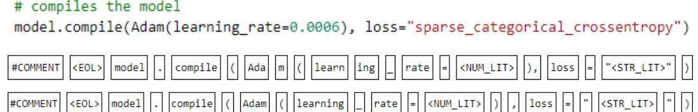
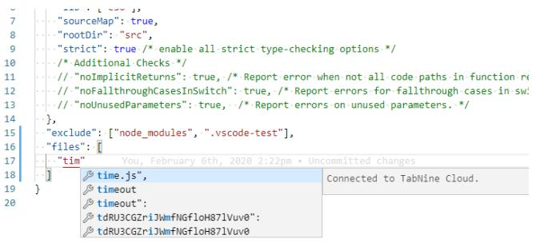
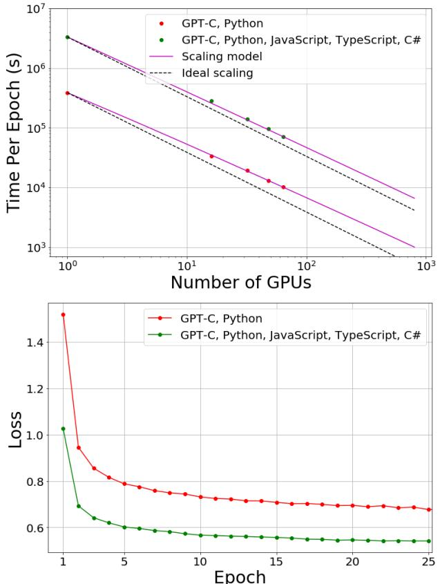
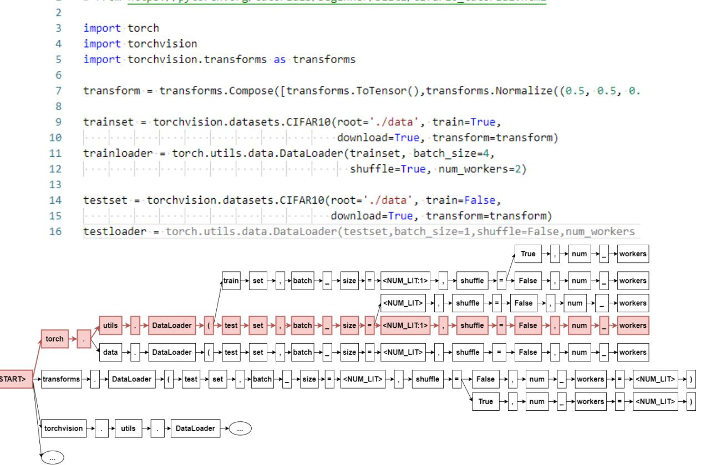

# IntelliCode Compose: Code Generation using Transformer

Alexey Svyatkovskiy∗ Microsoft Redmond, WA, USA alsvyatk@microsoft.com

Shengyu Fu Microsoft Redmond, WA, USA shengyfu@microsoft.com

#### ABSTRACT

In software development through integrated development environments (IDEs), code completion is one of the most widely used features. Nevertheless, majority of integrated development environments only support completion of methods and APIs, or arguments.

In this paper, we introduce IntelliCode Compose – a generalpurpose multilingual code completion tool which is capable of predicting sequences of code tokens of arbitrary types, generating up to entire lines of syntactically correct code. It leverages stateof-the-art generative transformer model trained on 1.2 billion lines of source code in Python, C#, JavaScript and TypeScript programming languages. IntelliCode Compose is deployed as a cloud-based web service. It makes use of client-side tree-based caching, efficient parallel implementation of the beam search decoder, and compute graph optimizations to meet edit-time completion suggestion requirements in the Visual Studio Code IDE and Azure Notebook.

Our best model yields an average edit similarity of 86.7% and a perplexity of 1.82 for Python programming language.

### CCS CONCEPTS

• Software and its engineering → Integrated and visual development environments; • Computing methodologies → Neural networks.

#### KEYWORDS

Code completion, neural networks, naturalness of software

#### ACM Reference Format:

Alexey Svyatkovskiy, Shao Kun Deng, Shengyu Fu, and Neel Sundaresan. 2020. IntelliCode Compose: Code Generation using Transformer. In Proceedings of the 28th ACM Joint European Software Engineering Conference and Symposium on the Foundations of Software Engineering (ESEC/FSE '20), November 8–13, 2020, Virtual Event, USA. ACM, New York, NY, USA, [11](#page-10-0) pages. <https://doi.org/10.1145/3368089.3417058>

ESEC/FSE '20, November 8–13, 2020, Virtual Event, USA

© 2020 Copyright held by the owner/author(s). Publication rights licensed to ACM. ACM ISBN 978-1-4503-7043-1/20/11. . . \$15.00 <https://doi.org/10.1145/3368089.3417058>

Shao Kun Deng∗ Microsoft Redmond, WA, USA shade@microsoft.com

Neel Sundaresan Microsoft Redmond, WA, USA neels@microsoft.com

#### 1 INTRODUCTION

Machine learning has shown a great promise towards improving automated software engineering across all stages. Some of the early applications of machine learning of source code include code search [\[1,](#page-9-0) [2\]](#page-9-1), bug detection and localization [\[3\]](#page-9-2), program synthesis [\[4\]](#page-9-3), code summarization [\[5\]](#page-10-1) and code completion [\[6](#page-10-2)[–10\]](#page-10-3).

There are numerous code completion systems capable of effectively recommending method and API calls [\[6,](#page-10-2) [9–](#page-10-4)[11\]](#page-10-5), or finding the correct argument [\[12](#page-10-6)[–14\]](#page-10-7). Majority of argument completion systems would, however, only work when the name of the method or API call is already typed in, thus leaving the task of completing the method calls to software developers.

In this paper, we introduce IntelliCode Compose – a generalpurpose code completion framework, capable of generating code sequences of arbitrary token types, including local variables, methods or APIs, arguments, as well as punctuation, language keywords, and delimiters. IntelliCode Compose serves as a universal programming language modeling tool, effectively generating syntactically correct code in multiple programming languages, capable of completing an entire line of code in a couple of key strokes, with a user experience inspired by Gmail Smart Compose [\[15\]](#page-10-8). The proposed system is able to learn to infer types of programming language identifiers and long-range code semantics without inputs extracted by means of a static analyzer explicitly passed to the model as features.

The nature of the problem of code sequence completion makes statistical language modeling approach a promising starting point. To predict a whole line of source code tokens given an existing code context and vocabulary , we train a neural model to generate tokens { } ⊂ , = 0..., conditioned on a sequence of preceding tokens { }, = 0... of code snippet .

The main contributions of the paper are as follows: (i) we introduce and pretrain a multi-layer generative transformer model for code (GPT-C), which is a variant of the GPT-2 [\[16\]](#page-10-9) trained from scratch on a large unsupervised multilingual source code dataset (cf. sections [3](#page-1-0) and [4\)](#page-1-1), comparing it to the monolingual counterparts, and a simple n-gram language modeling baseline, (ii) we propose and deploy a novel end-to-end code sequence completion system called IntelliCode Compose based on the GPT-C and an efficient client-side caching system (cf. sections [7](#page-4-0) and [8\)](#page-5-0), (iii) we evaluate the quality of language model pretraining of GPT-C using perplexity, showing that our best model achieves a perplexity of 1.82; we also show that IntelliCode Compose achieves an average edit similarity

∗Equal contribution.

Permission to make digital or hard copies of all or part of this work for personal or classroom use is granted without fee provided that copies are not made or distributed for profit or commercial advantage and that copies bear this notice and the full citation on the first page. Copyrights for components of this work owned by others than the author(s) must be honored. Abstracting with credit is permitted. To copy otherwise, or republish, to post on servers or to redistribute to lists, requires prior specific permission and/or a fee. Request permissions from permissions@acm.org.

of 86.7% (cf. section [10\)](#page-7-0), (iv) we introduce MultiGPT-C – a multilingual version of our model, discuss and compare various approaches to multilingual modeling (cf section [9\)](#page-6-0), (v) finally, we discuss and document practical challenges of training intermediate-sized neural transformer models on high-performance computing clusters, and cloud-based model deployment (cf. section [12\)](#page-8-0).

#### 2 MOTIVATING EXAMPLE

Fig. [1](#page-2-0) shows an example method completion and an argument completion in C# programming language served by the Intellicode [\[17\]](#page-10-10) extension in Visual Studio IDE[1](#page-1-2) , as well as the whole-line of code completion generated by IntelliCode Compose, with the novel completion user experience. Previously existing code completion tools have focused on specific token types or features, often failing to have a holistic view of the surrounding context. For example, having selected a method to call on the s variable, there are still numerous combinations of arguments to be passed to StartsWith, making this task non-trivial. Correctly suggesting a whole-line of code requires the model to infer types of the target token for method completion, and the correct local variables to be passed as arguments to the methods. Furthermore, additional structural and semantic information needs to be extracted from the context in order to make accurate statement-level suggestions.

#### 3 DATASET

We collect a large unsupervised source code dataset to train and evaluate the code sequence completion model. It comprises over 1.2 billion lines of source code in Python, C#, JavaScript and TypeScript programming languages, as summarized in Tab. [1.](#page-2-1) A total of over 52000 top-starred (non-fork) projects in GitHub has been selected, containing libraries from a diverse set of domains, with over 4.7 million source code files.

We split the dataset into development and test sets in the proportion 70-30 on the repository level. The development set is then split at random into training and validation sets in the proportion 80-20. The final deployed model is retrained using the entire dataset.

#### 4 APPROACH

#### 4.1 Baseline Code Sequence Completion Model

We use statistical language modeling approach based on the ngram model as a baseline in this work. The n-gram model is the probabilistic Markov chain model for predicting text given the context consisting of n-1 preceding tokens.

Given context tokens { }, = 0... − 1, the model estimates the next token probabilities based on the relative frequency counts:

$$P(m|\mathbf{c}\_0, \mathbf{c}\_1, \dots \mathbf{c}\_{n-1}) = \frac{N(\mathbf{c}\_0, \mathbf{c}\_1, \dots \mathbf{c}\_{n-1}, m)}{\sum N(\mathbf{c}\_0, \mathbf{c}\_1, \dots \mathbf{c}\_{n-1})},\tag{1}$$

here, numerator gives the count of all0, 1, ...−1, n-grams in the training corpus, while the denominator gives the cumulative n-gram count that share common prefix 0, 1, ...−1. During training, the n-grams are extracted by rolling the window of size n sub-tokens, with stride one (see more details on tokenization in section [\(5.1\)](#page-2-2)).

#### 4.2 Neural Code Sequence Completion Model

Transformers [\[18–](#page-10-11)[21\]](#page-10-12) are a family of neural networks designed to process ordered sequential data. They have found numerous applications in the fields of natural language processing (NLP) and natural language understanding (NLU), including machine translation, question answering, and document summarization.

Several transformer models such as GPT-2, BERT, XLNet, and RoBERTa [\[16,](#page-10-9) [20–](#page-10-13)[22\]](#page-10-14) have demonstrated the ability to learn effectively from unlabeled data to perform a wide variety of downstream tasks given supervised discriminative fine-tuning on each specific task. In this work we build on the progress of transformers in NLP and NLU, applying it to an emerging field of source code understanding: a form of NLU with additional structural constraints and insights from lexemes, abstract syntax tree (AST) or concrete syntax tree (CST), and dataflow graph.

A transformer block will typically consist of a multi-head selfattention, followed by a two-layer multi-layer perceptron (MLP) [\[18\]](#page-10-11), optionally containing residual connections and layer normalization [\[23\]](#page-10-15). Recent neural architecture searches of transformer models have shown that using depth-wise separable convolutions along with self-attention may speed up training without loss of accuracy [\[24\]](#page-10-16). A typical transformer architecture for a sequence-tosequence task will have an encoder (a stack of transformer blocks) and a decoder stack. Unlike the vanilla recurrent neural networks (RNNs) or their gated variants, including LSTM and GRU, transformers do not require tokens in a sequence to be processed in a specific order, thus allowing more options for training parallelization [\[25\]](#page-10-17). Composed of feed-forward layers, convolutions, and self-attention, transformers are easy to quantize and serve in production.

GPT-2 is an auto-regressive pre-trained model consisting of a decoder-only transformer stack and one or more output layers, often referred to as "heads". GPT-2 for language modeling task has a linear output layer with softmax output activation. IntelliCode Compose is built around a multi-layer generative pretrained transformer model for code (GPT-C), which is a variant of the GPT-2 trained from scratch on source code data, with weights of the output linear layer tied to the input embedding matrix, having specific hyperparameters as described in Tab. [4.](#page-5-1)

In order to predict a sequence of response tokens = { }, = 0..., conditioned on code snippet typed in by a software developer { }, = 0... , we need to estimate the following conditional probability distribution:

$$P(m\_0, m\_1, \ldots, m\_N | c\_0, \ldots c\_T) = \prod\_{i=1}^{N} P(m\_i | c\_0, c\_1, \ldots c\_T, m\_0, \ldots m\_{i-1}).\tag{2}$$

With the autoregressive approach, the objective is to maximize the following log-likelihood:

$$L(M) = \sum\_{i} \log P(m\_i | \mathbf{c}\_0, \mathbf{c}\_1, \dots \mathbf{c}\_T, m\_{i-k}, m\_{i-k+1}, \dots m\_{i-1}; \Theta) \tag{3}$$

where is the length of predicted code sequence, and the conditional probability is modeled using a neural network with parameters Θ. These parameters are learned via stochastic gradient descent optimization procedure.

GPT-C applies a multi-headed self-attention operation over the input context tokens followed by position-wise feed-forward layers

1https://visualstudio.microsoft.com/vs/

#### IntelliCode Compose: Code Generation using Transformer ESEC/FSE '20, November 8–13, 2020, Virtual Event, USA

Figure 1: Comparison of code completion scenarios. Top: method completion and argument completion served by Intellicode. Bottom: whole-line of code completion served by the IntelliCode Compose.

Table 1: Summary of the training dataset.

| Programming language | Number of files (×103 ) | Number of lines (×106 ) | Number of repositories |
|----------------------|----------------------------|----------------------------|------------------------|
| C#                   | 1172                       | 201                        | 4836                   |
| Python               | 1200                       | 240                        | 18174                  |
| JavaScript           | 1982                       | 681                        | 26553                  |
| TypeScript           | 437                        | 85                         | 3255                   |

(7)

to produce an output distribution over target tokens:

$$\begin{array}{rcl} \boldsymbol{h}\_{0} & = & \boldsymbol{W}\_{\boldsymbol{e}} \cdot \boldsymbol{C} + \boldsymbol{W}\_{\boldsymbol{\mathcal{P}}}, \end{array} \tag{4}$$

$$h\_l \quad = \texttt{ trans} \,\texttt{for}\,\texttt{mec}\,r\,\texttt{bloc}(h\_{l-1}), \forall l = 1...n,\quad(5)$$

 () = = softmax(ℎ · ), = 0... , (6)

where = − , −+1 , ...−1 is the context vector of tokens, is the number of layers, ∈ | |× is the tokens embedding matrix, and ∈ × is the position embedding matrix, which encodes relative positions of tokens in a sequence. is the length of the sequence attended to (context length), | | is vocabulary size, and is the embedding dimension.

We are reusing the input token embedding matrix as the output classification matrix [\[26\]](#page-10-18), which allows to remove the large fully connected layer reducing the number of parameters by 25%. More specifically, we introduce a projection matrix = () ∈ × initialized according to a random uniform distribution. Given an encoded code context and a hidden state at the last temporal step ℎ ( ) ∈ , we obtain the predicted token embedding vector by multiplying the two together as = (w ) ∈ as:

$$\mathbf{w}\_{j}^{pred} = \sum\_{i} h\_{\mathrm{n}i}(T) a\_{i\bar{f}}.\tag{8}$$

Subsequently, the logits are obtained as:

$$y\_k = \sum\_{j} w\_{kj} w\_j^{pred} + b\_k \tag{9}$$

where , = 0...| | −1 is the bias vector, and is the number of hidden units per transformer block.

During inference, beam-search decoding algorithm is applied to iteratively extract best token sequences according to a negative log-likelihood optimization objective. This is explained in more detail in section [7.](#page-4-0)

#### 5 PREPROCESSING

In what follows, we treat the source code data as a sequence of tokens corresponding to the output of a lexical analyzer. Incidentally, this can also be constructed through an in-order traversal of the terminal nodes of a concrete syntax tree (CST). In this work, we do not leverage high-level structural representation such as abstract or concrete syntax trees or control flow graphs, as it introduces additional overhead and dependencies which slows down the inference and reduces coverage of the code completion system. Additionally, for most programming languages, such representations can only be correctly retrieved on complete code snippets that are syntactically correct, which is often not available for a code completion system.

Our approach is based on statistical language modeling of source code, with several normalization rules extracted from concrete syntax tree of a program. To overcome the issue of different styles and white space or tab conventions, we transform the code into symbolic program tokens using custom tokenizers and regenerate the code with a common style. During preprocessing, we parse program code in each file, extract information about token types and apply it to normalize the code, extract subtoken vocabulary and encode the sequences. This is done both for training and inference.

#### 5.1 Overcoming a Closed Vocabulary Problem

A typical language model will attempt to generate a probability distribution over all tokens in the vocabulary. This requires the model to have access to encodings of all such tokens. In vanilla language models this is achieved with a fixed vocabulary matrix, thus limiting model coverage to unseen tokens.

The issues of coverage can be addressed by using finer-level encodings for tokens. Instead of learning representations for each token, we learn representations for subtokens or combinations of Unicode characters. This both reduces the need to store an entire vocabulary and makes the model more robust to out-of-vocabulary tokens. This allows us to potentially generalize to previously unseen methods, APIs, other language identifiers, or even training code completion models for multiple programming languages.

We experiment with two specific ways of tokenization:

- (1) Byte-Pair Encoding (BPE) tokenization unsupervised tokenization, in which the most frequently occurring pair of Unicode characters is recursively replaced with a character that does not occur in the vocabulary – the approach adopted by various contextual language models in NLP.
- (2) Tokenization by splitting programming language identifiers using casing conventions, such as camelCase, and PascalCase or snake\_case – the approach that has been shown to work for programming languages, though not applicable to natural languages.

We use the sentencepiece[2](#page-3-0) tokenizer to extract subtoken level vocabulary, with special tokens for control flow and code structure representation. More specifically, we add control flow tokens <BOF> and <EOF> to mark the beginning and ending of a file in order to disambiguate similar identifier names in different files, and <EOL> to mark the ending of a line. Additionally, since Python uses white-spaces and indentation to demarcate code scope, we introduce <INDENT> and <DEDENT> tokens to represent those scope delimiters. Fig. [2](#page-4-1) illustrates the tokenization approaches.

## 5.2 Exposing Sensitive Data through Code Suggestions

Production-level code completion systems based on statistical language modeling are commonly trained on vast amounts of source code mined from GitHub or other version control systems. As large amount of public data is ingested, it is unavoidable to encounter cases where people unintentionally leave sensitive information in their code, as part of string literals, code comments, or configuration files. Fig. [3](#page-4-2) shows an example completion served by the Tab-Nine [\[27\]](#page-10-19) system exposing irrelevant and potentially sensitive data. To tackle this problem, the training process needs to be shielded from inadvertently gaining access to secrets or personally identifiable data. For this reason, we identify and normalize numeric literals, string literals and comments, including docstrings, to <NUM\_LIT>, <STR\_LIT> and <COMMENT> special tokens[3](#page-3-1) , respectively. However, we have found that the most frequently used literals often contain relevant information and can be used directly in the completions. For each language, a number of top most frequent numeric and string literals are preserved as <STR\_LIT:lit> where lit is the original literal. For instance: "\_\_main\_\_", "POST", "en",

| Table 2: Number of literals kept for each type, and the per |  |
|-------------------------------------------------------------|--|
| centile they represent for each training dataset.           |  |

|        | Number kept | Python | C# | JS,TS |
|--------|-------------|--------|----|-------|
| String | 200         | 18     | 13 | 20    |
| Number | 50          | 63     | 58 | 70    |
| Char   | 20          | -      | 42 | -     |
| RegEx  | 50          | -      | -  | 17    |

"default". We did, however, leave identifier names to make code suggestions context-dependent. The exact number of literals kept as well as the percentage they represent in the training data are shown in Table. [2.](#page-3-2)

#### 6 MODEL TRAINING

Optimizing transformer neural networks is a computationally intensive problem which requires the engagement of high-performance computing (HPC) clusters in order to improve time to solution. Selection of well-performing hyperparameters requires searching a high-dimensional space. To evaluate a neural architecture or a set of hyperparameters entails running full model training and inference.

We scale up the training using synchronous data-parallel distributed training algorithm with local gradient accumulation. The learning rate controlling the magnitude of the weight update during gradient optimization is lowered upon completion of each epoch according to the cosine decay. In a distributed regime, we increase the learning rate during the first few epochs ("warm-up" period) to facilitate reliable model convergence.

The offline training module of the IntelliCode Compose system is implemented as a Python library integrating PyTorch and Horovod [\[28\]](#page-10-20) with Adasum algorithm for gradient summation[4](#page-3-3) . The software stack makes use of CUDA 10, GPU accelerated deep learning primitives from CuDNN 7, and PyTorch 1.2.0, NCCL collective communication library. We have trained our models on 5 Lambda V100 boxes, each having sixteen V100 GPUs with 32 GB HBM2 memory, eight 100 GB InfiniBand, and one 100 GB Ethernet connection, managed with Kubernetes.

With the data-parallel implementation, pure computation time ℎ per mini-batch step remains constant in the number of worker GPUs. The amount of data processed during one mini-batch step increases linearly with the number of engaged workers . Synchronization between workers performed by means of a tree-like allreduce, would yield logarithmic complexity ∝ log . Thus, the number of mini-batches would decrease linearly with , giving a following scaling model:

$$T\_{epoch} = \frac{1}{N} \cdot (T\_{batch} + T\_{sync}) = \frac{1}{N} \cdot (A + B \cdot \log(N)) = O(\frac{\log(N)}{N}) \tag{10}$$

Overall, the model architecture, tokenization, and training procedure produce a large number of hyperparameters that must be tuned to maximize predictive performance. These hyperparameters include numerical values such as the learning rate and number of transformer layers, dimension of embedding space, but also abstract categorical variables such as the precise model architecture or the

2https://github.com/google/sentencepiece

3 For C#, in addition to <STR\_LIT> and <NUM\_LIT>, we also introduce <CHAR\_LIT> for character literals. For JavaScript, we also introduce <RE\_LIT> for regular expression literals.

4https://github.com/horovod/horovod/pull/1484

Figure 2: Illustration of tokenization approaches. From top to bottom: a raw code snippet consisting of a comment and an API call with arguments, corresponding BPE split using sentencepiece, and corresponding split based on casing conventions.

Figure 3: Example completion served by the TabNine system exposing a fragment of hash value.

Table 3: Neural network training performance summary for monolingual (Python) and multilingual (C#, Python, JavaScript and TypeScript) 24-layer GPT-C models on 80 GPU workers.

|                       | Monolingual   | Multilingual  |
|-----------------------|---------------|---------------|
| Cumulative batch size | 160           | 160           |
| Time per epoch        | 2.8 hours     | 19.7 hours    |
| Samples / second      | 163 ± 5       | 148 ± 5       |
| Tokens / second       | 167000 ± 5000 | 152000 ± 5000 |

source code normalization algorithm. The number of trainable parameters in the GPT-C transformer model scales near-linearly as a function of number of transformer blocks, and quadratically with the number of hidden units per block as: ·(| |+ )+·· 2 . The constant here is defined by the parameters of the MLP part of the transformer.

The best performing monolingual GPT-C models have 24 layers, scaled dot-product attention with 16 heads, and are trained with BPE vocabulary size of 50000, while the best multilingual version has 26 transformer layers, 16 heads, and the vocabulary size of 60000 subtokens. The rest of the model architecture parameters is summarized in Tab. [4.](#page-5-1)

We train GPT-C using Adam stochastic optimization scheme with weight decay fix, base learning rate of 6.25×10−5 , cumulative batch size of 128, learning rate decay of 0.98 per epoch, and categorical cross-entropy loss. For multilingual model, each training mini-batch

Figure 4: Top: time required to complete one pass over the dataset (one "epoch") during training versus the number of worker GPUs engaged. Experimental data are compared with a semi-empirical theoretical scaling model and ideal scaling. Bottom: training loss as a function of epoch for monolingual and multilingual models.

has to be composed of sentences coming from the same language, which is sampled at random from the set of all available languages.

#### 7 SEQUENCE DECODING

Each inference call to the model yields a probability distribution vector over subtokens in the vocabulary. This can be conceptualized

Table 4: Well-performing values of model architecture hyperparameters.

| Hyperparameter | Explanation              | Best value |
|----------------|--------------------------|------------|
| 𝑑𝑚𝑜𝑑𝑒𝑙         | Hidden units per layer   | 1024       |
| 𝑁𝑐𝑡𝑥           | Code context length      | 1024       |
| 𝑑𝑥             | Embedding dimension      | 1024       |
| 𝑁ℎ𝑒𝑎𝑑          | Attention heads          | 16         |
| Dropout        | Dropout keep probability | 0.9        |

Table 5: Inference speed comparison for search scenarios with different beam widths and sequence lengths , with different beam search setup.

| 𝐿  | k  | Sequential (ms) | Parallel (ms) | Cached (ms) |
|----|----|-----------------|---------------|-------------|
| 10 | 1  | 250             | 250           | 220         |
| 10 | 10 | 1700            | 1000          | 820         |
| 25 | 15 | 7500            | 3000          | 2700        |

as an -ary tree of subtokens rooted in the last subtoken of the code context typed in by a developer. The depth of the tree is defined as a length of the desired completion sequence. Each code sequence suggestion is effectively a path on the tree, from the root node to a terminal node. The beam search algorithm is employed to explore and rank those paths, improving recommendation relevance of code sequences. At every step, the results are aggregated and the top k results are selected, where k is the beam width. Decoding continues for a preset number of subtokens or until a break token is reached. The set of break tokens includes the <EOL> (end-of-line) token as well as other language-specific tokens that often precede end-of-line under common code style patterns.

A naive beam search implementation would iterate over the top k candidates at every step to produce the output vector. However, for a sequence of length , this would require × inference calls to the model, significantly increasing the inference time and degrading the overall real-time user experience. Instead, we aggregate top k candidates and perform batched inference calls at every decoding step, which reduces the number of inference calls to . Tab. [5](#page-5-2) provides a comparison of the inference speeds for scenarios with different beam widths and sequence lengths, quoting speed-ups gained through parallelization.

Given sequential nature of the beam search decoding, we cache the attention keys and values of the transformer blocks as computed by the model for previous step (token), passing it as input to the model at the current step instead of recalculating from scratch. This further speeds up inference by 10%. The speed improvement with parallel and cached search is most apparent for large .

#### 8 CLIENT-SIDE POST-PROCESSING

#### 8.1 Completion Caching

During our user experience study, we have found that a response time under 100 ms is necessary to avoid any feeling of delay or lag. To achieve this in a cloud-based model deployment setting, we introduce caching on the client-side. Any time a developer types a non-alphanumeric character, suggestions are queried from the server. Those suggestions, each as a list of tokens along with their scores, are stored into a trie[5](#page-5-3) , and this trie is then placed into a cache. The cache key is the piece of code preceding the point where the suggestion was queried. This approach allows us to prune the tree efficiently at a character-level as the user continues typing. To obtain the final completion suggestion, we simply traverse this tree greedily by always branching to the node with the highest score.

Through experimentation, we have found that the model occasionally returns multiple similar but equally valid suggestions. In order to preserve accuracy, we terminate the completion-tree traversal if none of the child nodes has a score that is equal to or larger than the score of its parent multiplied by a ratio , defined as: 

$$R = \frac{u}{1 + e^{\frac{-L}{\kappa}}}.\tag{11}$$

This early-stopping allows us to break the suggestion at points where the model is equally confident in multiple valid suggestions. Here, is the position of the root node of the trie, is the relaxation factor, and is the curvature factor. is used to adjust the values of for very small or very large values of . A lower value of would relax the policy producing longer completion suggestions, while a value closer to 1.0 would tighten the policy producing shorter suggestions. controls the rate of increase of the . A smaller would give a steeper curve for smaller values of , producing shorter suggestions, while a larger value of would yield a flatter curve resulting in longer completion suggestion. In our deployment, we select = 0.8 and = 10 to gain a balance between suggestion length and relevance. We have found this approach to yield the highest increase in productivity, allowing software developers to retain a certain level of control over the suggestions. Fig. [5](#page-6-1) shows an example code completion suggestion and the corresponding completion-tree.

#### 8.2 Suggestion Processing

As mentioned in section [5,](#page-2-3) we introduce several new tokens that are not present literally in the input code. As we decode the output sequences, the model would generate those new tokens at the appropriate locations. In order to incorporate those tokens fluently into the completion sequences, we need to post-process them on the client side into printable characters using the following rules:

- (1) <BOF> and <EOF> tokens are ignored, as they almost never seen in the suggestion sequence and do not provide any additional information relevant to the completion sequence.
- (2) <EOL> serves as a break token for beam search decoder. We truncate the completion at this token as it indicates the end of the line.
- (3) <STR\_LIT> and <NUM\_LIT> tokens become placeholders and are replaced by the default literals (empty string and number 0, respectively). Visual Studio Code provides the ability to insert code snippets with placeholders in them, which the user can easily navigate through using TAB key. For raw literal tokens such as <STR\_LIT:\_\_main\_\_>, as

5A trie is a tree-like data structure where each node is a sub-string and strings can be composed by traversing down a path from the root.

IntelliCode Compose: Code Generation using Transformer ESEC/FSE '20, November 8–13, 2020, Virtual Event, USA

Figure 5: Top: code snippet and the completion suggestion served by the model in Visual Studio Code. Bottom: completion-tree reconstructed by the client application, with the highlighted path shown in red (lower section of the tree is truncated to reduce visual clutter).

mentioned in section [5.2,](#page-3-4) we use the raw literal image as the placeholder instead.

#### 9 MULTILINGUAL MODEL

Multilingual approach allows low-resource programming languages to benefit from more popular languages in terms of modeling quality. Multilingual models also hold a promise of being easier to maintain and serve in production.

To prepare a multilingual version of the IntelliCode Compose, we have extracted a shared sub-token vocabulary for Python, C#, JavaScript and TypeScript programming languages using the BPE tokenizer. We explored and compared the following four ways of training multilingual GPT-C models:

- (1) Language-agnostic baseline completely disregards the language type information, effectively attempting to train the model as monolingual. We have found this approach to underperform significantly as compared to the monolingual versions for each language.
- (2) Language-type embedding. Looking for a stronger baseline, we introduced the language type embedding matrix ∈ × , combining it via addition with the token and

position embedding matrices of GPT-C model for each token in the sequences during the forward pass, given by Eq. [4,](#page-2-4) according to: ℎ0 = ·+ + . denotes the number of programming languages in the training dataset.

- (3) Language specific control codes, is an approach introduced in [\[29,](#page-10-21) [30\]](#page-10-22) that uses target prefixes to facilitate constrained language modeling or multitask learning. In what follows, for each programming language we insert a sequence of tokens in the beginning of each training sample according to: "lang ∗ remaining token sequence", where lang ∈ {Python, C#, JavaScript, TypeScript}. In expectation, control codes would signal the neural network that a given sequence belongs to a particular programming language. As shown in Tab. [6](#page-8-1) this approach works rather well, yielding results comparable with monolingual counterparts.
- (4) Finally, we add a programming language classification task during model pretraining, an approach inspired by natural language inference (NLI) RocStories and SWAG tasks [\[31,](#page-10-23) [32\]](#page-10-24). As such, the model is trained using two optimization objectives: language modeling and multiple choice classification to

detect programming language. Given one-dimensional monolingual arrays of subtokens.

As seen from Tab. [6,](#page-8-1) language specific control codes provide necessary supervision to constrain language generation for each specific language. The multitask approach of language modeling combined with multiple choice classification provides a further improvement. As such, the double heads multilingual model, referred to as MultiGPT-C throughout the paper, is selected for multilingual deployment candidate.

#### 10 EVALUATION

#### 10.1 Evaluation Metrics

We use perplexity to evaluate the quality of language model pretraining of GPT-C models, defined as:

$$PPL = \exp(-\sum\_{i}^{T} P(\mathbf{x}\_{i}) \log P(\mathbf{x}\_{i})), \forall i \in \mathbf{0} \dots T. \tag{12}$$

where is the truth label and () is the model output. A model with lower perplexity assigns higher probabilities to the true tokens, and is expected to perform better.

Besides perplexity, we consider two evaluation metrics to measure offline performance of the code sequence completion system: the Recall-Oriented Understudy for Gisting Evaluation score (ROUGE) [\[33\]](#page-10-25) and the Levenshtein similarity.

The output sequences served by the IntelliCode Compose may consist of up to 20–30 characters, including identifier, literals, language keywords, punctuation marks, whitespaces, and delimiters. From our online telemetry, we have observed that the accepted suggestions are on average 25 characters long, with 25% of accepted suggestions being longer than 45 characters. Accuracy could measure correctness of the exact match, failing, however, to capture the proximity when a completion suggestion partially matches the target sequence, which could still be a valid completion suggestion.

For instance, given model suggestion: tf.train. AdamOptimizer(learning\_rate=<NUM\_LIT>) and target sequence tf.train.GradientDescentOptimizer(), we see that the model correctly captures the intent of software developer to create an optimizer, suggesting the AdamOptimizer with the learning rate parameter, while the target is the standard gradient descent optimizer, with default value of the learning rate parameter.

The ROUGE score is the metric commonly used to evaluate machine translation models. Its ROUGE-L variant is based on the Longest Common Subsequence (LCS) [\[34\]](#page-10-26) statistics. LCS takes into account structure similarity and identifies longest co-occurring -grams.

The Levenshtein distance measures how many single-character edits – including insertion, substitution, or deletion – does it take to transform one sequence of tokens to another. Quite often, even if a suggested completion is only an approximate match, developers are willing to accept it, making appropriate edits afterwards. As such, the Levenshtein edit similarity is a critical evaluation metric.

ROUGE score and edit similarity capture string similarity of completion suggestions and the target code. However, not all kinds of imperfections in the code suggestions generated by the model are accepted equally by the end users. In particular, syntax errors are relatively easy-to-find bugs which are considered "silly" by software developers. We utilize tree-sitter [6](#page-7-1) parser to estimate syntactic correctness of the completion suggestions generated by the tool, by parsing the file-level code context together with the suggestion generated by the model. Given the IntelliCode Compose line-ofcode completions may represent partial code statements, for this experiment, we remove end-of-line token from the list of break tokens for beam search decoder, capturing the latest complete statement decoded. We use the Black [7](#page-7-2) formatter to compress multi-line statements to single lines to minimize the amount of partial code statements generated by the tool. We observe 93% of completion suggestions in Python programming language are syntactically correct. By visually inspecting several completion suggestions which have failed to parse by tree-sitter, we conclude that roughly a half of those can be attributed to partially generated statements.

#### 10.2 Evaluation Results

We start by comparing our monolingual GPT-C model for Python programming language against the simple n-gram language models with n = 3, 5, and 7. As seen in Tab. [7,](#page-8-2) performance of the simple n-gram language model is significantly lower, improving for intermediate n, then drops again for n = 7. Inspecting model suggestions visually, we identified that the n-gram approach is highly sensitive to out-of-vocabulary tokens, especially for seven-gram, which represents the main limitation of this approach.

Next, Tab. [8](#page-9-4) provides a detailed summary of evaluation results for a selected subset of well-performing models. As seen, the best monolingual validation level performance in terms of edit similarity and the ROUGE-L precision and recall is achieved for Python programming language. We explain it using the notion of "naturalness" of source code introduced in [\[37\]](#page-10-27). Naturalness of code has a strong connection with the fact that developers prefer to write and read code that is conventional, idiomatic, and familiar as it helps understanding and maintaining software systems, leading to code predictability. Python is also the most popular programming language, according to PopularitY of Programming Language index[8](#page-7-3) , leading to more code adoption and reuse.

Remarkably, multilingual model achieves a comparable performance in terms of edit similarity and ROUGE-L precision, but yielding a a significantly lower ROUGE-L recall for C# programming language. For JavaScript and TypeScript programming languages, however, all the metrics are improved with the multilingual model.

#### 10.3 Online Evaluation

As we roll out IntelliCode Compose internally for performance and user experience evaluation, we have collected anonymous usage data and telemetry. Since we are not aware of any existing code completion system that offers a similar experience, selecting the correct metric to evaluate online performance was particularly challenging. The key online evaluation metrics that we are measuring are the surfacing rate (SR) and the click-through rate (CTR) over a period of time. The SR is the total number of completions displayed divided by the total number of times a completion could

6https://tree-sitter.github.io/tree-sitter/

7https://black.readthedocs.io/en/stable/

8http://pypl.github.io/PYPL.html

Table 6: Detailed evaluation results for various multilingual modeling approaches based on GPT-C. Model performance metrics are reported on multilingual test sample.

| Model                     | PPL  | ROUGE-L   |        |      |      | Edit similarity (%) | Model size |
|---------------------------|------|-----------|--------|------|------|---------------------|------------|
|                           |      | Precision | Recall |      |      |                     |            |
| Baseline                  | 2.15 | 0.25      | 0.24   | 56.3 | 374M |                     |            |
| Language Embedding        | 1.94 | 0.52      | 0.66   | 71.7 | 379M |                     |            |
| Control codes             | 1.73 | 0.64      | 0.75   | 81.5 | 374M |                     |            |
| MultiGPT-C (double heads) | 1.65 | 0.66      | 0.76   | 82.1 | 374M |                     |            |

Table 7: Python n-gram language model baseline performance comparison against the monolingual GPT-C model pre-trained on Python programming language.

| Model     | ROUGE-L   |        | Edit similarity (%) |  |
|-----------|-----------|--------|---------------------|--|
|           | Precision | Recall |                     |  |
| 3-gram LM | 0.16      | 0.28   | 37.8                |  |
| 5-gram LM | 0.40      | 0.45   | 59.7                |  |
| 7-gram LM | 0.34      | 0.34   | 39.2                |  |
| GPT-C     | 0.80      | 0.86   | 86.7                |  |

potentially be shown, which is after every character typed into a code document when the extension is active. The CTR is defined as the fraction of accepted completions over the total number of completions displayed. Over 150 thousands requests, we have seen a SR of 9.2% and a CTR of 10%, which roughly translates to suggestions being shown every 11 characters and users committing

The SR is not only dependent on the accuracy of the model but also on the typing speed of a user and their network reliability. The low CTR can be partially attributed to the momentum in typing. As the users type, it is unlikely they will stop after every keystroke to examine suggestions. Similar to traditional code completion scenarios, users tend to overshoot for a few characters before committing a desired suggestion. Due to this momentum effect, the surfacing rate captured in our telemetry is systematically lower as compared to what a user may actually experience.

#### 11 KNOWLEDGE DISTILLATION

Knowledge distillation [\[38\]](#page-10-28) is the model compression technique in which a smaller model – the student network – is trained to reproduce the results of a larger model – the teacher network. It has been shown in literature [\[39,](#page-10-29) [40\]](#page-10-30), that it is possible to reach comparable performance on various tasks using distilled neural networks, resulting in models that are lighter and faster at inference time.

Inspired by DistilBERT [\[40\]](#page-10-30), we scale down our pretrained transformer models by reducing the number of transformer blocks, while keeping the architecture of the transformer block and embedding layers intact. The GPT-C model size scales near-linearly with the number of transformer blocks.

We experiment with student models having 8 and 12 transformer blocks, having our best 26 layer model serve as a teacher, initializing the student models with pretrained teacher weights and biases. Tab. [9](#page-9-5) summarizes the distillation results for JavaScript and Type-Script programming languages, comparing it to the monolingual teacher model trained on JavaScript and TypeScript. As seen, distillation from 26 to 12 layers speeds up the inference by a factor of 2.7, incurring 6% edit similarity loss and 5% ROUGE-L precision loss. In a more extreme scenario, distilling a 26 layer model down to only 8 layers, we obtained a 4.5× inference speed up at a cost of 8% edit similarity and 9% ROUGE-L precision.

#### 12 MODEL DEPLOYMENT

The IntelliCode Compose service is designed as two-layer service: the server-side model inference module and the client-side completion provider module. The main reason for this setup is to minimize the inference time for the best user experience. As we deploy the model on a cloud-based server, we have control over the hardware setup and can guarantee resource availability.

The server-side module is deployed as a containerized web application to Azure Kubernetes Service[9](#page-8-3) and listens on a HTTPS endpoint. It processes completion requests and returns the model output. It is implemented in Python and executes model inference using PyTorch and ONNX runtime[10](#page-8-4). We employ several graphlevel model optimizations, including constant folding, and operator fusion for layer normalization and GELU sub-graphs.

The client-side completion provider is a Visual Studio Code extension implemented in TypeScript. The completion provider monitors user inputs and is responsible for communicating with the web service as well as post-processing model outputs as described in section [8.](#page-5-0)

#### 13 RELATED WORK

This work is related to a large set of literature in the area of NLP, and NLU, as well as deep learning and particularly transformers. We refer the interested reader to the numerous publications about transformer models [\[16,](#page-10-9) [20–](#page-10-13)[22\]](#page-10-14), and focus on code completion for the remainder of this section.

Numerous intelligent code completion systems for both statically and dynamically typed languages have been proposed [\[6,](#page-10-2) [11,](#page-10-5) [41,](#page-10-31) [42\]](#page-10-32). Best Matching Neighbor (BMN) and statistical language models such as -grams, as well as RNN-based approaches leveraging sequential nature of the source code have been particularly effective at creating such systems.

9https://azure.microsoft.com/en-us/services/kubernetes-service/ 10https://github.com/microsoft/onnxruntime

Table 8: Detailed evaluation results for our best-performing monolingual (GPT-C) and multilingual (MultiGPT-C) models, including the zero-shot performance of Python model on C# programming language, as well as the open source Hugging-Face [\[35\]](#page-10-33) medium-sized GPT-2 checkpoint pretrained on WebText [\[36\]](#page-10-34) dataset. Multilingual model performance metrics are reported separately for each of the programming languages from the training set.

| Model              | Test (Train) Languages   | PPL  | ROUGE-L   |        | Edit similarity (%) | Model size |
|--------------------|--------------------------|------|-----------|--------|---------------------|------------|
|                    |                          |      | Precision | Recall |                     |            |
| GPT-C              | C# (C#)                  | 1.91 | 0.57      | 0.79   | 76.8                | 366M       |
| GPT-C              | Python (Python)          | 1.82 | 0.80      | 0.86   | 86.7                | 366M       |
| GPT-C              | JS,TS (JS,TS)            | 1.40 | 0.58      | 0.72   | 84.1                | 366M       |
| GPT-C, zero-shot   | C# (Python)              | –    | 0.39      | 0.50   | 57.6                | 366M       |
| GPT-2, HuggingFace | Python (WebText)         | –    | 0.25      | 0.38   | 34.6                | 355M       |
| MultiGPT-C         | C# (C#,Python,JS,TS)     | 2.01 | 0.53      | 0.66   | 74.6                | 374M       |
| MultiGPT-C         | Python (C#,Python,JS,TS) | 1.83 | 0.76      | 0.80   | 84.1                | 374M       |
| MultiGPT-C         | JS,TS (C#,Python,JS,TS)  | 1.36 | 0.68      | 0.82   | 87.6                | 374M       |

Table 9: Performance of distilled monolingual models of various sizes that are trained and evaluated on JavaScript and Type-Script programming languages, as compared to the teacher model. The inference speed is calculated using the beam search depth of =25 and width of =15.

| Model              | ROUGE-L   |        | Edit similarity (%) | Model size | Inference speed |
|--------------------|-----------|--------|---------------------|------------|-----------------|
|                    | Precision | Recall |                     |            |                 |
| DistilGPT-C, tiny  | 0.53      | 0.58   | 78.0                | 96M        | 600ms           |
| DistilGPT-C, small | 0.55      | 0.65   | 79.3                | 124M       | 1000ms          |
| GPT-C, teacher     | 0.58      | 0.72   | 84.1                | 366M       | 2700ms          |

Among the models that have found practical applications in IDEs are that of [\[9\]](#page-10-4) – for method and API completion based on a neural language model and ASTs. The approach described in [\[10\]](#page-10-3) reformulates code completion as a task of learning to rank the valid completion suggestions computed from static analyses in order to improve computational speed and memory efficiency, effectively superseding [\[9\]](#page-10-4). The code completion system based on [\[9\]](#page-10-4) is deployed as part of IntelliCode [\[17\]](#page-10-10) extension in Visual Studio Code IDE, and [\[6\]](#page-10-2) – snippet matching based on frequency models and BMN – has been deployed as part of Eclipse Code Recommenders [\[43,](#page-10-35) [44\]](#page-10-36).

Closest to our work is probably Tabnine [\[27\]](#page-10-19), which uses GPT-2 to serve ranked lists of code sequence suggestions. However, this tool does not attempt to complete longer sequences of 20–30 characters long, up to a whole line of code, and we are not aware of any currently deployed tool that does so.

#### 14 CONCLUSIONS

We have introduced and deployed a general-purpose AI-powered code completion system called IntelliCode Compose, capable of generating code sequences of arbitrary token types, including local variables, methods or APIs, arguments, as well as language keywords, and delimiters. IntelliCode Compose serves as a universal programming language modeling tool, effectively generating syntactically correct code in multiple programming languages, capable of completing a whole-line of code in a couple of key strokes.

IntelliCode Compose is built around the GPT-C – a multi-layer generative pretrained transformer model for code, which is a variant of the GPT-2 trained from scratch on source code data. Our best model yields an average edit similarity of 86.7% and perplexity of 1.82 for Python programming language.

We have documented and overcome several practical challenges of training transformer neural networks on HPC clusters, model deployment in the cloud, and client-side caching to meet the edittime code completion inference speed requirement of at most 100 ms per call. We have also thoroughly studied and documented the multilingual modeling approaches on a dataset consisting of four programming languages.

In the future, we are planning to extend IntelliCode Compose capabilities by focusing on completion personalization, and finetuning on custom user code. Besides code completion, we plan to apply large-scale unsupervised language model pretraining on source code to tackle several other automated software engineering tasks, including automatic program repair, and code search.

#### REFERENCES

- [1] Xiaodong Gu, Hongyu Zhang, Dongmei Zhang, and Sunghun Kim. Deep API learning. CoRR, abs/1605.08535, 2016.
- [2] Xiaodong Gu, Hongyu Zhang, and Sunghun Kim. Deep code search. In Proceedings of the 40th International Conference on Software Engineering, ICSE '18, page 933–944, New York, NY, USA, 2018. Association for Computing Machinery.
- [3] Song Wang, Taiyue Liu, and Lin Tan. Automatically learning semantic features for defect prediction. In Proceedings of the 38th International Conference on Software Engineering, ICSE '16, page 297–308, New York, NY, USA, 2016. Association for Computing Machinery.
- [4] Richard Shin, Miltiadis Allamanis, Marc Brockschmidt, and Oleksandr Polozov. Program synthesis and semantic parsing with learned code idioms. CoRR, abs/1906.10816, 2019.

IntelliCode Compose: Code Generation using Transformer ESEC/FSE '20, November 8–13, 2020, Virtual Event, USA

- [5] Uri Alon, Omer Levy, and Eran Yahav. code2seq: Generating sequences from structured representations of code. CoRR, abs/1808.01400, 2018.
- [6] Marcel Bruch, Martin Monperrus, and Mira Mezini. Learning from examples to improve code completion systems. In Proceedings of the Joint Meeting of the European Software Engineering Conference and the Symposium on the Foundations of Software Engineering (ESEC/FSE), 2009.
- [7] Abram Hindle, Earl T Barr, Zhendong Su, Mark Gabel, and Premkumar Devanbu. On the naturalness of software. In Proceedings of the International Conference on Software Engineering (ICSE), 2012.
- [8] Tung Thanh Nguyen, Anh Tuan Nguyen, Hoan Anh Nguyen, and Tien N Nguyen. A statistical semantic language model for source code. In Proceedings of the Joint Meeting of the European Software Engineering Conference and the Symposium on the Foundations of Software Engineering (ESEC/FSE), 2013.
- [9] Alexey Svyatkovskiy, Ying Zhao, Shengyu Fu, and Neel Sundaresan. Pythia: Ai-assisted code completion system. In Proceedings of the 25th ACM SIGKDD International Conference on Knowledge Discovery & Data Mining, KDD '19, page 2727–2735, New York, NY, USA, 2019. Association for Computing Machinery.
- [10] Alexey Svyatkovskiy, Sebastian Lee, Anna Hadjitofi, Maik Riechert, Juliana Franco, and Miltiadis Allamanis. Fast and memory-efficient neural code completion, 2020.
- [11] Muhammad Asaduzzaman, Chanchal Roy, Kevin Schneider, and Daqing Hou. Cscc: Simple, efficient, context sensitive code completion. Proceedings - 30th International Conference on Software Maintenance and Evolution, ICSME 2014, pages 71–80, 12 2014.
- [12] Cheng Zhang, Juyuan Yang, Yi Zhang, Jing Fan, Xin Zhang, Jianjun Zhao, and Peizhao Ou. Automatic parameter recommendation for practical api usage. In Proceedings - 34th International Conference on Software Engineering, ICSE 2012, Proceedings - International Conference on Software Engineering, pages 826–836, 7 2012.
- [13] Mattia Fazzini, Qi Xin, and Alessandro Orso. Automated api-usage update for android apps. In Proceedings of the 28th ACM SIGSOFT International Symposium on Software Testing and Analysis, ISSTA 2019, page 204–215, New York, NY, USA, 2019. Association for Computing Machinery.
- [14] Hui Liu, Qiurong Liu, Cristian-Alexandru Staicu, Michael Pradel, and Yue Luo. Nomen est omen: Exploring and exploiting similarities between argument and parameter names. In Proceedings of the 38th International Conference on Software Engineering, ICSE '16, page 1063–1073, New York, NY, USA, 2016. Association for Computing Machinery.
- [15] Mia Xu Chen, Benjamin N. Lee, Gagan Bansal, Yuan Cao, Shuyuan Zhang, Justin Lu, Jackie Tsay, Yinan Wang, Andrew M. Dai, Zhifeng Chen, and et al. Gmail smart compose: Real-time assisted writing. In Proceedings of the 25th ACM SIGKDD International Conference on Knowledge Discovery & Data Mining, KDD '19, page 2287–2295, New York, NY, USA, 2019. Association for Computing Machinery.
- [16] Alec Radford, Jeff Wu, Rewon Child, David Luan, Dario Amodei, and Ilya Sutskever. Language models are unsupervised multitask learners. 2019.
- [17] Microsoft Corporation. Ai-assisted development. [https://marketplace.](https://marketplace.visualstudio.com/items?itemName=VisualStudioExptTeam.VSIntelliCode) [visualstudio.com/items?itemName=VisualStudioExptTeam.VSIntelliCode.](https://marketplace.visualstudio.com/items?itemName=VisualStudioExptTeam.VSIntelliCode) Visited Jan 2020.
- [18] Ashish Vaswani, Noam Shazeer, Niki Parmar, Jakob Uszkoreit, Llion Jones, Aidan N. Gomez, Lukasz Kaiser, and Illia Polosukhin. Attention is all you need, 2017.
- [19] Alec Radford. Improving language understanding by generative pre-training. 2018.
- [20] Jacob Devlin, Ming-Wei Chang, Kenton Lee, and Kristina Toutanova. BERT: pretraining of deep bidirectional transformers for language understanding. CoRR, abs/1810.04805, 2018.
- [21] Zhilin Yang, Zihang Dai, Yiming Yang, Jaime G. Carbonell, Ruslan Salakhutdinov, and Quoc V. Le. Xlnet: Generalized autoregressive pretraining for language understanding. CoRR, abs/1906.08237, 2019.
- [22] Yinhan Liu, Myle Ott, Naman Goyal, Jingfei Du, Mandar Joshi, Danqi Chen, Omer Levy, Mike Lewis, Luke Zettlemoyer, and Veselin Stoyanov. Roberta: A robustly
- optimized BERT pretraining approach. CoRR, abs/1907.11692, 2019.
- [23] Jimmy Lei Ba, Jamie Ryan Kiros, and Geoffrey E. Hinton. Layer normalization, 2016.
- [24] David R. So, Chen Liang, and Quoc V. Le. The evolved transformer. CoRR, abs/1901.11117, 2019.
- [25] Mohammad Shoeybi, Mostofa Patwary, Raul Puri, Patrick LeGresley, Jared Casper, and Bryan Catanzaro. Megatron-lm: Training multi-billion parameter language models using model parallelism, 2019.
- [26] Hakan Inan, Khashayar Khosravi, and Richard Socher. Tying word vectors and word classifiers: A loss framework for language modeling. CoRR, abs/1611.01462, 2016.
- [27] Jacob Jackson. Autocompletion with deep learning. [https://tabnine.com/blog/](https://tabnine.com/blog/deep/) [deep/.](https://tabnine.com/blog/deep/) Visited Sep 2019.
- [28] Alexander Sergeev and Mike Del Balso. Horovod: fast and easy distributed deep learning in TensorFlow. arXiv preprint arXiv:1802.05799, 2018.
- [29] Colin Raffel, Noam Shazeer, Adam Roberts, Katherine Lee, Sharan Narang, Michael Matena, Yanqi Zhou, Wei Li, and Peter J. Liu. Exploring the limits of transfer learning with a unified text-to-text transformer. arXiv e-prints, 2019.
- [30] Nitish Shirish Keskar, Bryan McCann, Lav R. Varshney, Caiming Xiong, and Richard Socher. Ctrl: A conditional transformer language model for controllable generation, 2019.
- [31] Nasrin Mostafazadeh, Nathanael Chambers, Xiaodong He, Devi Parikh, Dhruv Batra, Lucy Vanderwende, Pushmeet Kohli, and James Allen. A corpus and cloze evaluation for deeper understanding of commonsense stories. In Proceedings of the 2016 Conference of the North American Chapter of the Association for Computational Linguistics: Human Language Technologies, pages 839–849, San Diego, California, June 2016. Association for Computational Linguistics.
- [32] Rowan Zellers, Yonatan Bisk, Roy Schwartz, and Yejin Choi. Swag: A large-scale adversarial dataset for grounded commonsense inference, 2018.
- [33] Chin-Yew Lin. ROUGE: A package for automatic evaluation of summaries. In Text Summarization Branches Out, pages 74–81, Barcelona, Spain, July 2004. Association for Computational Linguistics.
- [34] Chin-Yew Lin and Franz Josef Och. Automatic evaluation of machine translation quality using longest common subsequence and skip-bigram statistics. In Proceedings of the 42nd Annual Meeting of the Association for Computational Linguistics (ACL-04), pages 605–612, Barcelona, Spain, July 2004.
- [35] Thomas Wolf, Lysandre Debut, Victor Sanh, Julien Chaumond, Clement Delangue, Anthony Moi, Pierric Cistac, Tim Rault, R'emi Louf, Morgan Funtowicz, and Jamie Brew. Huggingface's transformers: State-of-the-art natural language processing. ArXiv, abs/1910.03771, 2019.
- [36] Aaron Gokaslan and Vanya Cohen. Openwebtext corpus. [http://Skylion007.](http://Skylion007.github.io/OpenWebTextCorpus) [github.io/OpenWebTextCorpus,](http://Skylion007.github.io/OpenWebTextCorpus) 2019.
- [37] Miltiadis Allamanis, Earl T. Barr, Premkumar T. Devanbu, and Charles A. Sutton. A survey of machine learning for big code and naturalness. CoRR, abs/1709.06182, 2017.
- [38] Geoffrey Hinton, Oriol Vinyals, and Jeff Dean. Distilling the knowledge in a neural network, 2015.
- [39] Raphael Tang, Yao Lu, Linqing Liu, Lili Mou, Olga Vechtomova, and Jimmy Lin. Distilling task-specific knowledge from bert into simple neural networks, 2019.
- [40] Victor Sanh, Lysandre Debut, Julien Chaumond, and Thomas Wolf. Distilbert, a distilled version of bert: smaller, faster, cheaper and lighter, 2019.
- [41] Veselin Raychev, Martin Vechev, and Eran Yahav. Code completion with statistical language models. In ACM SIGPLAN Notices, volume 49, pages 419–428. ACM, 2014.
- [42] Sebastian Proksch, Johannes Lerch, and Mira Mezini. Intelligent code completion with bayesian networks. ACM Transactions on Software Engineering and Methodology (TOSEM), 25(1):3, 2015.
- [43] Eclipse Foundation. Code Recommenders. [www.eclipse.org/recommenders.](https://www.eclipse.org/recommenders/) Visited June 2017.
- [44] Eclipse Recommenders. Eclipse SnipMatch. [http://www.eclipse.org/](http://www.eclipse.org/recommenders/manual/#snipmatch) [recommenders/manual/#snipmatch,](http://www.eclipse.org/recommenders/manual/#snipmatch) 2014. Visited Jun 2017.