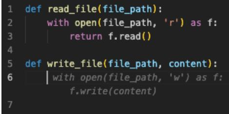
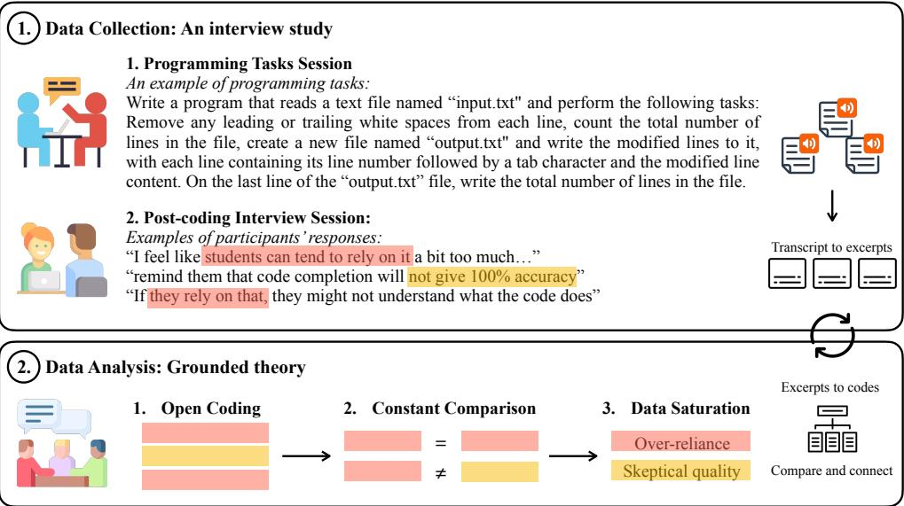
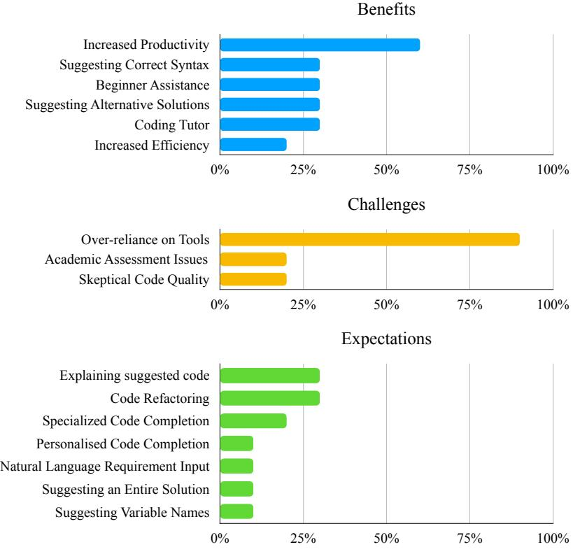

# Students' Perspectives on AI Code Completion: Benefits and Challenges

Wannita Takerngsaksiri *Faculty of Information Technology Monash University* Melbourne, Australia wannita.takerngsaksiri@monash.edu

Cleshan Warusavitarne *Faculty of Information Technology Monash University* Melbourne, Australia cwar0007@student.monash.edu

Matthew Hee Keng Hou *Faculty of Information Technology Monash University* Melbourne, Australia mhee0019@student.monash.edu

*Faculty of Information Technology Monash University* Melbourne, Australia cyaa0001@student.monash.edu

Christian Yaacoub

Chakkrit Tantithamthavorn *Faculty of Information Technology Monash University* Melbourne, Australia chakkrit@monash.edu

*Abstract*—AI Code Completion (e.g., GitHub's Copilot) has revolutionized how computer science students interact with programming languages. However, AI code completion has been studied from the developers' perspectives, not the students' perspectives who represent the future generation of our digital world. In this paper, we investigated the benefits, challenges, and expectations of AI code completion from students' perspectives. To facilitate the study, we first developed an open-source Visual Studio Code Extension tool *AutoAurora*, powered by a state-ofthe-art large language model StarCoder, as an AI code completion research instrument. Next, we conduct an interview study with ten student participants and apply grounded theory to help analyze insightful findings regarding the benefits, challenges, and expectations of students on AI code completion. Our findings show that AI code completion enhanced students' productivity and efficiency by providing correct syntax suggestions, offering alternative solutions, and functioning as a coding tutor. However, the over-reliance on AI code completion may lead to a surface-level understanding of programming concepts, diminishing problem-solving skills and restricting creativity. In the future, AI code completion should be explainable and provide best coding practices to enhance the education process.

*Index Terms*—AI Code Completion, Software Engineering, Programming Education

#### I. INTRODUCTION

The breakthrough in Large Language Models (LLMs) [\[1\]](#page-5-0), [\[2\]](#page-5-1) has advanced AI code completion to work alongside developers in the software development process. Integrated into IDEs (Integrated Development Environments), the AI code completion is capable of assisting developers' productivity by auto-completing the user's code in real-time, reducing typo errors and saving keystrokes. User studies were conducted to scrutinize the usability and how developers interact with AI code completion as a coding assistant [\[3\]](#page-5-2), [\[4\]](#page-5-3), [\[5\]](#page-5-4). Existing research mentioned that the advent of AI code completion could shift the way developers work in software development [\[6\]](#page-5-5).

However, developers are not the only group influenced by AI code completion. In reality, AI code completion has also profoundly reshaped the way students learn and engage with programming. Computer science students are required to learn a wide range of programming knowledge, from programming language syntax to advanced algorithms. In the past, the traditional code completion that completes code by tokenlevel (i.e., one code unit) was not able to aid in enhancing such knowledge. Nevertheless, modern code completion or AI code completion that automatically suggests the full chuck of complete code, will be able to change the programming education. Researchers have started to study the impact of AI code completion for programming education [\[7\]](#page-5-6), [\[8\]](#page-5-7), [\[9\]](#page-5-8). The findings unveil the performance of AI code completion in classrooms and how the students interact with the AI code completion tools. However, the perspectives of the students who adopt the AI code completion tools and are the future generation of our digital world, remain largely unexplored.

*In this paper*, we investigated the benefits, challenges, and expectations when adopting AI code completion from students' perspectives. Our objective is to ascertain the students' point of view when engaging with AI code completion within the educational setting, aiming to provide valuable insights into its implications for teaching and learning outcomes in computer science education.

To facilitate the study, we first developed an open-source Visual Studio Code Extension, *AutoAurora*, from an existing state-of-the-art code completion model, StarCoder [\[2\]](#page-5-1) as an AI code completion research instrument. Next, we conduct an interview study with undergraduate students in computer science. The interview comprises two sessions: the programming tasks session and the post-coding interview session. We apply grounded theory methodology to analyze our interview data, aiming to develop a comprehensive taxonomy of benefits, challenges, and expectations of AI code completion from students' perspectives. By the end of our interviews with ten participants, the insightful pattern emerging in our data enables us to answer the following research questions.

# RQ1) What are the students' benefits when adopting the AI code completion tool?

Results Students articulate that AI code completion enhanced their productivity and efficiency by providing correct syntax suggestions, offering alternative solutions, and functioning as a coding tutor.

RQ2) What are the students' challenges when adopting the AI code completion tool?

> Results 90% of the students express concerns about the over-reliance on AI code completion. This dependency may lead to a surface-level understanding of programming concepts, diminishing problem-solving skills and restricting creativity.

RQ3) What are the students' expectations when adopting the AI code completion tool?

> Results Majority of the students expect that in the future, AI code completion should be able to explain their suggested code and provide alternative best practices to facilitate the learning of coding concepts.

#### II. BACKGROUND AND RELATED WORKS

#### *A. AI Code Completion*

Code completion is a feature designed to assist developers writing code by automatically suggesting the next pieces of code from a previous code context. Code completion can help increase developers' productivity by reducing keystrokes, eliminating typo errors, and correcting syntax [\[11\]](#page-5-9).

Traditional code completion approaches leverage heuristic [\[12\]](#page-5-10) and statistical language techniques [\[13\]](#page-5-11) to suggest code from a given context. However, these techniques rely heavily on manually crafted rules and patterns, which are costly and time-consuming. To address this limitation, deep learning techniques have been applied for code completion.

Modern code completion or AI code completion approaches apply deep learning techniques such as LSTM-based model [\[14\]](#page-5-12) and Transformers-based models [\[15\]](#page-5-13), [\[2\]](#page-5-1) to suggest code. To illustrate, Li *et al.* [\[2\]](#page-5-1) proposed StarCoder which is a Transformers-based LLM of 15.5B model parameters trained on a one trillion tokens dataset comprised of more than 80 programming languages.

Recently, software industry has brought attentions to the AI code completion field. For example, OpenAI released one of the most powerful generative AI models, ChatGPT [\[1\]](#page-5-0), which is capable of generating natural language text and performing a wide range of coding tasks in real-time. Various models are integrated into IDE platforms as AI coding assistants, e.g., GitHub Copilot [\[16\]](#page-5-14). However, most of the available LLM tools are not accessible for free public use. Thus, we developed an AI code completion plug-in utilizing the existing state-ofthe-art LLM to serve as our research instrument in this work.

# *B. AI Code Completion User Studies*

*"it's likely that a programmer's approach to software development will shift, moving the focus from writing typical code to working alongside generative AI assistants to design and* *develop code solutions"* – stated by Bull *et al.* [\[6\]](#page-5-5) from their exploratory interviews with industry professionals.

Table [I](#page-2-0) shows the summary of existing works in this area. The emergence of AI code completion tools has raised attention to investigating their impact on the software engineering community. To illustrate, Liang *et al.* [\[3\]](#page-5-2) conducted a largescale survey on 410 developers with diverse backgrounds to assess the usability of AI coding assistants. The findings shed light on usage characteristics, revealing that the primary motivation for participants to use AI coding assistants is to minimize the number of their keystrokes. Conversely, the primary impediment for participants not to use the tools is the inaccurately generated code to the participant's intention. Vaithilingam *et al.* [\[4\]](#page-5-3)study how programmers use and perceive GitHub Copilot. They found that, while GitHub Copilot did not necessarily improve the speed and success rate of task completion, most participants preferred to use the tool in daily programming as it provides useful starting points and saves online searching time. Similarly, Barke *et al.* [\[5\]](#page-5-4) present the first grounded theory analysis of how programmers interact with GitHub Copilot. They discuss two main interactions: the acceleration mode where the programmer uses GitHub Copilot to speed up completing the known tasks, and the exploration mode where the programmer is uncertain of the next steps and uses the tool to explore their options.

#### *C. AI Code Completion for Programming Education*

*"The nature of learning programming will change dramatically with AI-driven development Environments (AIDEs). Whether these assistants will speed up or slow down the learning process is currently an open question."* – stated by Ernst and Bavota [\[7\]](#page-5-6).

As AI code completion has been integrated into modern IDEs, learning programming has not only become more convenient but also challenging. Researchers have started to examine the effect of AI code completion on education. For example, Puryear *et al.* [\[8\]](#page-5-7) investigated the quality of generated code provided by GitHub Copilot in a classroom. They found that GitHub Copilot is able to generate code with high humangraded scores ranging from 68% to 95% and low plagiarism scores in the introductory assignments. Align with the previous work, Kazemitabaar *et al.* [\[9\]](#page-5-8) investigated the performance of novice programmers using OpenAI Codex [\[17\]](#page-5-15). They found that using Codex significantly increases the code completion rate by 1.15x and score by 1.8x while not decreasing the manual code-modification speed. Prather *et al.* [\[10\]](#page-5-16) also studied how novice programmers interact with GitHub Copilot via introductory programming assignments and interviews. They identify and discuss four design implications (i.e., Interactions, Cognitive, Purpose and Speculation) for the novice programmer experience. While many research studies investigated the performance of AI code completion in introductory programming education, little has known about the benefits, challenges, and expectations when adopting AI code completion from students' perspectives.

| Paper                   | Method     | Participant | Focus                         | Key Findings                                              |
|-------------------------|------------|-------------|-------------------------------|-----------------------------------------------------------|
| Liang et al. [3]        | Survey     | Programmers | Understanding usability and   | Motivation: reduce keystrokes and finish a task faster.   |
| (ICSE'24)               | Questions  | (n=410)     | motivations to use / not use  | Demotivation: difficulty in controlling the tool to       |
|                         |            |             | AI coding assistants          | generate the desired output.                              |
| Vaithilingam et al. [4] | Tasks and  | Programmers | User validation and usabil    | Quantitative: tools did not improve the performance.      |
| (CHI'22)                | Survey     | (n=24)      | ity of GitHub Copilot and     | Qualitative: users still prefer to use tools for a useful |
|                         | Questions  |             | Intellisense                  | starting point.                                           |
| Barke et al. [5]        | Grounded   | Programmers | How programmers interact      | Discover 2 interaction modes: 1. acceleration mode        |
| (PACMPL'23)             | Theory     | (n=20)      | with GitHub Copilot.          | and 2. exploration mode.                                  |
| Bull et al. [6]         | Interview  | Programmers | To understand current prac    | Discussion on programmers' approach will shift to         |
| (IEEE Software'23)      |            | (n=5)       | tice and challenges of AI     | work alongside AI coding assistants. However, hu          |
|                         |            |             | coding assistants from pro    | man supervisors still need fundamental programming        |
|                         |            |             | fessionals' perspectives.     | knowledge to verify the code correctness.                 |
| Puryear et al. [8]      | Coding     | Students    | To evaluate GitHub Copilot    | Copilot can generate mostly unique code solutions         |
| (CCSC'23)               | Tasks      | (n=32)      | generated programming as      | that can solve introductory assignments with high         |
|                         |            |             | signment solutions.           | human-graded scores.                                      |
| Kazemitabaar et al. [9] | Coding     | Students    | To explore the implications   | Students using Codex have 1.15x increased comple          |
| (CHI'23)                | Tasks      | (n=69)      | of AI coding assistants have  | tion rate and 1.8x higher scores.                         |
|                         |            |             | introductory program on |                                                           |
|                         |            |             | ming using Codex              |                                                           |
| Prather et al. [10]     | Tasks and  | Students    | How novice programmers        | Discussion on usability and four design implications      |
| (TOCHI'23)              | Interviews | (n=19)      | interact with Copilot.        | for novice programming experiences.                       |

TABLE I A SUMMARY OF RELATED WORKS ON AI CODE COMPLETION USER STUDIES.

Fig. 1. An example of read/write file function suggested by our AutoAurora code completion tool in the Visual Studio Code.

# III. USER STUDY METHODOLOGY

#### *A. Goal and Research Questions*

In this paper, we aim to investigate AI code completion from students' perspectives. To achieve this goal, we formulated the following research questions:

RQ1. What are the students' benefits when adopting the AI code completion tool?

RQ2. What are the students' challenges when adopting the AI code completion tool?

RQ3. What are the students' expectations when adopting the AI code completion tool?

#### *B. AutoAurora: An Open-source AI Code Completion Tool.*

AutoAurora is a free Visual Studio Code extension that we developed to facilitate a controlled research instrument to enhance participants' understanding of AI code completion. The extension is built on top of the 15.5B parameters StarCoder model [\[2\]](#page-5-1) which is one of the state-of-the-art large language models for the code completion task. We also devise several configurations for the extension, such as the number of lines to generate and the number of suggestions to provide, allowing students to explore and modify AI code completion tools. This process enables them to catch a glimpse of the potential expectations and functionalities of such tools.

Figure [1](#page-2-1) presents an example scenario of AutoAurora completing a code function. The AI code completion model is activated when the user prompts their code input (Lines 1-5). Then, the model will generate suggestions displayed as a greycolored code segment (Line 6). Users can choose to accept the suggestions or continue writing code in their preference. We make AutoAurora publicly available, open-source, and easy to install via Visual Studio Marketplace.[1](#page-2-2)

#### *C. Data Collection: An Interview Study*

Figure [2](#page-3-0) shows the overview of our interview study. We interviewed undergraduate students in computer science at Monash University, Australia. Participants were invited to join the study through in-class announcements. Eligible participants must have a minimum of one year of programming experience. During the three weeks of the recruitment campaign and interview process, ten participants (aged 18-22 years old) were engaged in our study. Our interview study comprises two sessions: the programming tasks session and the post-coding interview session. Below are details of each interview session.

1) Programming Tasks Session: To familiarize the participants with the AI Code Completion tool, each participant is assigned to use AutoAurora, our AI code completion VS Code extension, to complete two Python competitive programming tasks. An example of the tasks is shown in Figure [2.](#page-3-0) The tasks encompassed:

> Task 1 String and text file manipulation. Task 2 Matrix manipulation.

1https://marketplace.visualstudio.com/items?itemName= PyCoder.AutoAurora

Fig. 2. An Overview of our Research Methodology for Students' Perspectives on AI Code Completion.

2) Post-coding Interview Session: After completing the assigned tasks, or after the allotted time had expired, a post-coding interview consisting of open-ended questions was administered to gather participants' feedback on code completion tools in the context of educational purposes.

The interview is recorded and transcribed by the second, third and fourth authors. Ethical Permission was obtained from Monash University Human Research Ethics Committee (MUHREC, Project ID 38109) before conducting the research.

# *D. Data Analysis: Grounded Theory*

Conceptually, our analysis aims to discern and identify the patterns that represent students' perspectives toward AI code completion. Therefore, we apply grounded theory to structure the collected data into insightful categories.

Grounded theory is a systematic qualitative research methodology that is suitable for exploring complex empirical data such as an interview study. The process iteratively encompasses open coding of participant transcripts, constant comparison between coding categories, and data saturation. Below are the details of the data analysis process.

- 1) Open Coding: We break down participants' transcripts into small, meaningful excerpts and assign code to each of the excerpts. If we agree that the codes are identical, we group related codes into a category. For example, a student states "...tend to rely on it (code completion) a bit too much." is coded to 'over-reliance' . While a student states "code completion will not give 100% accuracy" is coded to 'skeptical quality' .
- 2) Constant Comparison: We continuously compare new coding categories to existing codes and categories as we progress through the coding process. For example, later another student states "they rely on that (code

completion)"; thus, we code them in the existing coding category of 'over-reliance' . We validate the results across authors until agreements are reached to ensure consistency.

3) Data Saturation: We continued coding and comparing until we reached data saturation, where we no longer found new information or categories in the data. In this example case, we conclude to have two coding categories of 'over-reliance' and 'skeptical quality' .

#### IV. RESEARCH FINDINGS

Figure [3](#page-4-0) presents a summary of our analysis of students' perspective when adopting AI code completion.

# *A. RQ1. What are the students' benefits when adopting the AI code completion tool?*

Increased Productivity: AI code completion tools can help students write code faster. By suggesting code snippets and providing context-aware recommendations, students can reduce the time it takes to write and debug their code. For example, a participant stated that *"Most of my time is saved from typing"*. This confirms that AI code completion can save coding time by reducing typing efforts and eliminating the need to search for unfamiliar commands.

Suggesting Correct Syntax: Programming syntax can be challenging for students with less programming experience due to unfamiliarity. For example, a participant stated that *"It helps learning syntax for language in terms of teaching as opposed to actually teaching programming concepts"*. This confirms that AI code completion is helpful in learning new programming languages.

Beginner Assistance: Students found that AI code completion can provide templates and explanations as a starting code, helping students learn more about programming languages,

Fig. 3. A summary of the benefits, challenges, and expectations of students' perspective when adopting AI code completion. The y-axis presents categories and the x-axis presents the percentage of students mentioning the category during the interviews.

syntax and coding conventions. For example, a participant stated that *"it provides a hint where I should start with and give an example of a function"*, showing AI code completion tools can help students with a coding template, reducing the time and frustration associated with searching code examples.

Suggesting Alternative Solutions: AI code completion tools can often suggest code refactoring options to improve code readability and performance. This might include suggesting more efficient algorithms or alternative code structures. For example, a participant stated that *"it shows me a solution that I didn't know existed"*. Thus, with alternative solution suggestions, students can learn by seeing how certain tasks are implemented and gain insights into best practices.

Coding Tutor: Students perceive AI code completion tools as akin to having a coding tutor guide them in their coding journey. For example, a participant stated that *"like a tutor just sitting next to you and guiding you through the code"*, showing AI code completion not only assists in initial learning but also provides continuous support throughout the coding process.

Increased Efficiency: Apart from guiding introductory coding, AI code completion also profoundly impacts advanced coding. For example, a participant stated that *"you can spend more time thinking about higher-level solutions"*. By handling repetitive tasks, AI code completion enables students to focus on refining the core algorithm, elevating their concentration on more complex problem-solving aspects.

*B. RQ2. What are the students' challenges when adopting the AI code completion tool?*

Over-reliance on tools: Nearly every student raises concerns about the risks associated with over-reliance on AI code completion tools, hindering students' growth in problemsolving. In particular, adopting AI code completion tools may lead to a surface-level understanding of programming concepts, where students might not fully grasp the underlying logic and syntax, as the tool completes the code for them. This can hinder students' ability to apply knowledge to the new and complex problems. For example, a participant expressed, *"you have to think about your logic but it just does the work for you"*, highlighting that the learning process may be impeded as the tool often accomplishes tasks without students comprehending the code.

Academic Assessment Issues: It can be challenging for educators to assess a student's true coding abilities if they heavily rely on the tools. For instance, a participant expressed, *"if you've got an autocomplete to help you write the algorithm, you're just proving that you know how to use an autocomplete"*, grading becomes more complex when it's unclear how much of the work is genuinely the student's own. To address this challenge, several mitigation strategies are recommended including documentation (explanation of code's logic), oral examination (students discuss their code and explain their thought process), and randomized assessments, etc.

Skeptical Code Quality: In principle, AI code completion is not specifically designed for generating high-quality code [\[18\]](#page-5-17). Thus, AI code completion may not generate highquality and accurate code solutions for every problem. For example, a participant stated that *"remind them that code completion will not give 100% accuracy"*. This finding confirms that code quality issues become a central concern for students. Thus, students should only use AI code completion as a coding assistance, not an AI programmer. Students should still be able to evaluate whether to accept or reject the suggestions by the AI code completion tool.

# *C. RQ3. What are the students' expectations when adopting the AI code completion tool?*

Explaining Suggested Code: To enhance comprehension, students anticipate that AI code completion tools should have the capability to provide detailed explanations of the suggested code, whether through comments or hovering information. For example, a participant emphasized, *"if we have a comment between the lines for a better explanation that would be helpful for students"*. This underscores students' desire to ascertain the suggested code highlighting the significance of providing explanations alongside the suggested code to facilitate the learning of coding concepts, particularly for the beginner level.

Code Refactoring: Students anticipate that AI code completion can assist in recommending improved versions of their code. Particularly in the initial learning stages, students might not be familiar with the best coding practices. For instance, a participant highlighted, *"Suggesting a better way to write something, if it is inefficient or not following good coding practices"*. Therefore, this capability would effectively aid students in improving their code by recommending more efficient or better coding practices.

Specialized/Personalized Code Completion: Students anticipate a code completion model optimized for solving specific tasks. As one participant mentioned, *"Having an autocomplete model that has been purely trained for a specific use case"*. Moreover, another participant desires a personalized code completion model capable of adapting to their coding style, referring to it as *"more personalized"*. Therefore, students expect to have AI code completion tailored to their unique needs and preferences.

Other Expectations: From the students' perspective, other expectations include: Incorporating natural language input to provide better context for AI code completion; AI code completion suggests an entire solution at once, rather than suggesting line by line; and providing suggestions for meaningful variable names.

#### V. CONCLUSION

The advent of AI code completion has fundamentally transformed the learning experience and interaction of computer science students with programming languages. In this paper, we studied the benefits, challenges, and student expectations when adopting AI code completion, utilizing our Visual Studio Code Extension, *AutoAurora*. Through an interview study of ten participants, our study unveils that, according to students' perceptions, AI code completion could enhance productivity and efficiency, operating as an effective coding tutor throughout the learning process. However, a predominant concern arises regarding over-reliance on these tools, potentially impeding students' abilities to solve complex problems and presenting challenges in academic assessments. As these tools continue to evolve, their integration into programming education is inevitable; hence, the need for educators to thoughtfully consider a balance between automation and genuine learning when evaluating student performance is urgently required.

#### REFERENCES

- [1] OpenAI, "Gpt-4 technical report," 2023.
- [2] R. Li, L. B. Allal, Y. Zi, N. Muennighoff, D. Kocetkov, C. Mou, M. Marone, C. Akiki, J. Li, J. Chim *et al.*, "Starcoder: may the source be with you!" *arXiv preprint arXiv:2305.06161*, 2023.
- [3] J. T. Liang, C. Yang, and B. A. Myers, "Understanding the usability of ai programming assistants," *arXiv preprint arXiv:2303.17125*, 2023.
- [4] P. Vaithilingam, T. Zhang, and E. L. Glassman, "Expectation vs. experience: Evaluating the usability of code generation tools powered by large language models," in *Chi conference on human factors in computing systems extended abstracts*, 2022, pp. 1–7.
- [5] S. Barke, M. B. James, and N. Polikarpova, "Grounded copilot: How programmers interact with code-generating models," *Proc. ACM Program. Lang.*, vol. 7, no. OOPSLA1, apr 2023. [Online]. Available: <https://doi.org/10.1145/3586030>
- [6] C. Bull and A. Kharrufa, "Generative ai assistants in software development education: A vision for integrating generative ai into educational practice, not instinctively defending against it." *IEEE Software*, 2023.
- [7] N. A. Ernst and G. Bavota, "Ai-driven development is here: Should you worry?" *IEEE Software*, vol. 39, no. 2, pp. 106–110, 2022.
- [8] B. Puryear and G. Sprint, "Github copilot in the classroom: learning to code with ai assistance," *Journal of Computing Sciences in Colleges*, vol. 38, no. 1, pp. 37–47, 2022.
- [9] M. Kazemitabaar, J. Chow, C. K. T. Ma, B. J. Ericson, D. Weintrop, and T. Grossman, "Studying the effect of ai code generators on supporting novice learners in introductory programming," in *Proceedings of the 2023 CHI Conference on Human Factors in Computing Systems*, 2023, pp. 1–23.
- [10] J. Prather, B. N. Reeves, P. Denny, B. A. Becker, J. Leinonen, A. Luxton-Reilly, G. Powell, J. Finnie-Ansley, and E. A. Santos, "" it's weird that it knows what i want": Usability and interactions with copilot for novice programmers," *arXiv preprint arXiv:2304.02491*, 2023.
- [11] S. S. E. Maxim Tabachnyk and G. R. Stoyan Nikolov, Senior Engineering Manager. (2022) Ml-enhanced code completion improves developer productivity. [Online]. Available: [https://ai.googleblog.com/](https://ai.googleblog.com/2022/07/ml-enhanced-code-completion-improves.html) [2022/07/ml-enhanced-code-completion-improves.html](https://ai.googleblog.com/2022/07/ml-enhanced-code-completion-improves.html)
- [12] D. Hou and D. M. Pletcher, "Towards a better code completion system by api grouping, filtering, and popularity-based ranking," in *Proceedings of the 2nd International Workshop on Recommendation Systems for Software Engineering*, 2010, pp. 26–30.
- [13] R. Robbes and M. Lanza, "How program history can improve code completion," in *2008 23rd IEEE/ACM International Conference on Automated Software Engineering*. IEEE, 2008, pp. 317–326.
- [14] J. Li, Y. Wang, M. R. Lyu, and I. King, "Code completion with neural attention and pointer networks," *arXiv preprint arXiv:1711.09573*, 2017.
- [15] W. Takerngsaksiri, C. Tantithamthavorn, and Y.-F. Li, "Syntax-aware on-the-fly code completion," *Information and Software Technology*, p. 107336, 2023.
- [16] Github. (2024) The world's most widely adopted ai developer tool. [Online]. Available: <https://github.com/features/copilot>
- [17] M. Chen, J. Tworek, H. Jun, Q. Yuan, H. P. d. O. Pinto, J. Kaplan, H. Edwards, Y. Burda, N. Joseph, G. Brockman *et al.*, "Evaluating large language models trained on code," *arXiv preprint arXiv:2107.03374*, 2021.
- [18] Y. Liu, T. Le-Cong, R. Widyasari, C. Tantithamthavorn, L. Li, X.-B. D. Le, and D. Lo, "Refining chatgpt-generated code: Characterizing and mitigating code quality issues," *arXiv preprint arXiv:2307.12596*, 2023.