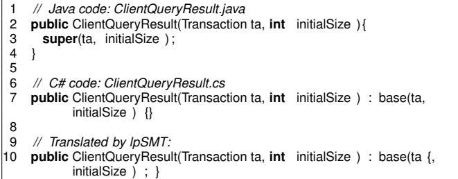
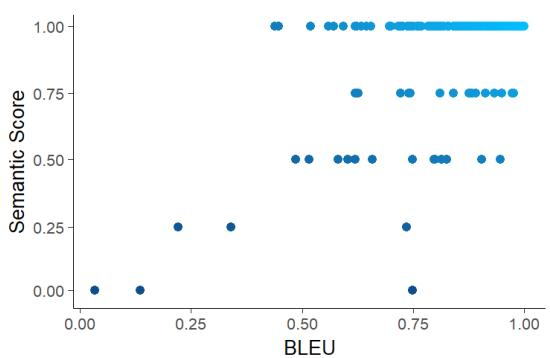
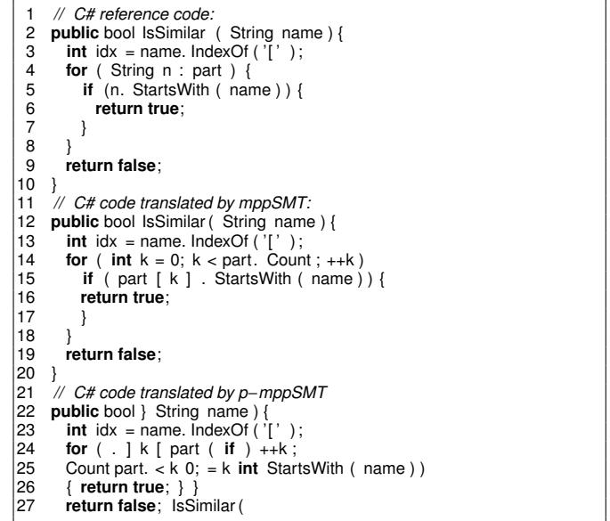

# arXiv:1906.04903v1 [cs.SE] 12 Jun 2019

# Does BLEU Score Work for Code Migration?

Ngoc Tran<sup>∗</sup> , Hieu Tran<sup>∗</sup> , Son Nguyen<sup>∗</sup> , Hoan Nguyen† , and Tien N. Nguyen<sup>∗</sup>

<sup>∗</sup>Computer Science Department, The University of Texas at Dallas, USA,

Email: {nmt140230,trunghieu.tran,sonnguyen,tien.n.nguyen}@utdallas.edu

†Computer Science Department, Iowa State University, USA, Email: hoan@iastate.edu

*Abstract*—Statistical machine translation (SMT) is a fastgrowing sub-field of computational linguistics. Until now, the most popular automatic metric to measure the quality of SMT is BiLingual Evaluation Understudy (BLEU) score. Lately, SMT along with the BLEU metric has been applied to a Software Engineering task named *code migration*. (In)Validating the use of BLEU score could advance the research and development of SMT-based code migration tools. Unfortunately, there is no study to approve or disapprove the use of BLEU score for source code. In this paper, we conducted an empirical study on BLEU score to (in)validate its suitability for the code migration task due to its inability to reflect the semantics of source code. In our work, we use human judgment as the ground truth to measure the semantic correctness of the migrated code. Our empirical study demonstrates that BLEU does not reflect translation quality due to its weak correlation with the semantic correctness of translated code. We provided counter-examples to show that BLEU is ineffective in comparing the translation quality between SMT-based models. Due to BLEU's ineffectiveness for code migration task, we propose an alternative metric RUBY, which considers lexical, syntactical, and semantic representations of source code. We verified that RUBY achieves a higher correlation coefficient with the semantic correctness of migrated code, 0.775 in comparison with 0.583 of BLEU score. We also confirmed the effectiveness of RUBY in reflecting the changes in translation quality of SMTbased translation models. With its advantages, RUBY can be used to evaluate SMT-based code migration models.

*Keywords*-Code Migration, Statistical Machine Translation

### I. INTRODUCTION

Statistical Machine Translation (SMT) [\[1\]](#page-10-0) is a natural language processing (NLP) approach that uses statistical learning to derive the translation "rules" from a training data and applies the trained model to translate a sequence from the source language to the target one. SMT models are trained from a corpus of corresponding texts in two languages. SMT has been successful in translating natural-language texts. Google Translate [\[2\]](#page-10-1) is an SMT-based tool that support text translation of over 100 languages. Microsoft Translator [\[3\]](#page-10-2) also supports instant translation for more than 60 languages.

The statistical machine translation community relies on the *BiLingual Evaluation Understudy* (BLEU) metric for the purpose of evaluating SMT models. *BLEU metric*, also called *BLEU score*, measures translation quality by the accuracy of translating text phrases to the reference with various phrases' lengths. BLEU score was shown to be highly correlated with human judgments on the translated texts from natural-language SMT tools [\[4\]](#page-10-3). BLEU remains a popular automated and inexpensive metric to evaluate the quality of translation models.

In recent years, several researchers in Software Engineering (SE) and Programming Languages have been exploring the NLP techniques and models to build automated SE tools. SMT has been directly used or adapted to be used to translate/migrate source code in different programming languages [\[5\]](#page-10-4)–[\[9\]](#page-10-5). The problem is called *code migration*. In the modern world of computing, code migration is important. Software vendors often develop a product for multiple operating platforms in different languages. For example, a mobile app could be developed for iOS (in Objective-C), Android (in Java), and Windows Phone (in C#). Thus, there is an increasing need for migration of source code from one programming language to another.

Unlike natural-language texts, source code follows syntactic rules and has well-defined semantics with respect to programming languages. A natural question is *how effective BLEU score is in evaluating the results of migrated source code in language migration*. The answer to this question is important because if it does, we could establish an automated metric to evaluate the quality of SMT-based code migration tools. Unfortunately, there has not yet any empirical evidence to either validate or invalidate the effectiveness of BLEU score in applying to source code in language migration.

Because BLEU score measures the lexical phrase-to-phrase translation while source code has well syntax and dependencies, we hypothesized that *BLEU score is not effective in evaluating migrated source code*. We proved this hypothesis by contradiction. First, we assumed that *BLEU score is effective in evaluating migrated source code*. With respect to the use of BLEU for the translation results by a single model or its use to compare the results across models, the above assumption leads to *two necessary conditions* (1) BLEU reflects well the semantic accuracy of migrated source code with regard to the original code when they are translated by a model, and (2) the quality comparison between translation models can be drawn by using the BLEU metric. We then conducted experiments to provide counterexamples to empirically invalidate those two conditions. We choose the code migration task because it is a popular SE task that applies SMT.

For the first condition, we chose the migration models that focus on phrase translation, for example, lpSMT [\[5\]](#page-10-4) that adapts a phrase-to-phrase translation model [\[10\]](#page-10-6). This type of models produces migrated code with high lexical accuracy, *i.e.,* high correctness for sequences of code tokens. However, several tokens or sequences of tokens are placed in incorrect locations. This results in a higher BLEU score but with a lower semantic accuracy in migrated code. We also chose the migration models

that focus on structures. Specifically, we picked mppSMT [\[8\]](#page-10-7) whose results have high semantic accuracy but a wide range of BLEU scores. In this case, we aimed to show that BLEU has weak correlation with semantic accuracy of the translated code. For the second condition, adapting Callison-Burch *et al.* [\[11\]](#page-10-8)'s method, we constructed an artificial model, p-mppSMT, from mppSMT [\[8\]](#page-10-7) that produces the migrated code with the same BLEU score as the result from mppSMT. However, a result from p-mppSMT for a given method contains a minor lexical difference from the one from mppSMT, thus, creating as a consequence the considerable differences in program semantics. That is, p-mppSMT produces migrated code that has the same BLEU score but is functionally different. Finally, since the two necessary conditions are false, the assumption statement is false, thus, BLEU is ineffective in evaluating migrated source code.

In our experiment, we used a dataset of 34,209 pairs of methods in 9 projects that were manually migrated from Java to C# by developers. The dataset was used in evaluating existing code migration models [\[8\]](#page-10-7). We ran those above SMTbased migration models on those methods. We then manually investigated 375 randomly-selected pairs of methods for each model. For each pair of the manually migrated method and the automatically migrated one from a tool, we assigned a semantic accuracy score and computed the BLEU score. The semantic accuracy score was given by a developer after examining the original code in Java, the manually migrated code in C# and the code in C# migrated by a tool. In total, 2,250 translated results were manually checked and assigned with semantic scores in about 45 hours. For the necessary condition (1), we then computed the correlation between the BLEU scores and semantic scores of all the pairs. Our result shows that the BLEU metric has a weak correlation with the semantic accuracy of the migrated code. For the necessary condition (2), we compared the translated results of the same set of 375 methods for mppSMT [\[8\]](#page-10-7) and its artificial variant, p-mppSMT. We showed that the equivalence of BLEU scores of models does not indicate the equivalence in the quality of their translation results. From those results, we concluded that BLEU is not an effective metric in evaluating SMT-based migration tools.

In this work, we also introduce, RUBY, a novel metric to evaluate the results of the SMT-based code migration tools. The intuition is that the metric that measures the results in the higher abstraction level, the better metric for reflecting the semantics accuracy. However, in code migration, the translated code might miss information that is required to construct the higher level representations. Therefore, we propose a *multilevel metric to evaluate the quality of translated code, that integrates the measurement in three representation levels of source code in a multi-layer and increasing manner from lexeme (text), abstract syntax tree (AST), to program dependence graph (PDG)*. For a translated result, RUBY score is the similarity score between the migrated code and the expected result in the highest representation level that can be constructed for both versions. Furthermore, we also conducted two experiments to evaluate RUBY on the abilities to reflect the semantic accuracy and the comparison in translation quality between

models. Our results show that the new metric RUBY is highly correlated to the semantic accuracy of the resulting migrated code. The average correlation coefficients between RUBY and semantic accuracy is 0.775, in comparison to 0.583 of BLEU score. Our consistent results of RUBY with semantic scores also demonstrate the effectiveness of RUBY in comparing SMT-based code migration models.

In summary, in this paper, our main contributions include:

- An empirical evidence to show that BLEU metric does not only reflect well the semantic accuracy of the migrated code for SMT-based migration tools, but is also not effective in comparing translation quality of models.
- RUBY, a novel metric to evaluate the results of the SMTbased code migration tools, that integrates the scores at the lexical, syntactical, and semantic levels in source code.
- An extensive empirical study to evaluate RUBY on multiple SMT-based code migration systems.

## II. BACKGROUND

### *A. Statistical Machine Translation*

Machine Translation aims to translate texts or speech from a language to another. Statistical Machine Translation (SMT) is a machine translation paradigm that uses statistical models to learn to derive the translation "rules" from a training corpus in order to translate a sequence from the source language (*L*S) to the target language (*L*<sup>T</sup> ). The text in the *L*<sup>S</sup> is tokenized into a sequence *s* of words. The model searches the most relevant target sequence *t* with respect to *s*. Formally, the model searches for the target sequence *t* that has the maximum probability:

$$P\left(t \mid s\right) = \frac{P\left(s \mid t\right)P\left(t\right)}{P\left(s\right)}$$

To do that, it utilizes two models: 1) the language model, and 2) the translation model. The language model learns from the monolingual corpus of *L*<sup>T</sup> to derive the possibility of feasible sequences in it (*P*(*t*): how likely sequence *t* occurs in *L*<sup>T</sup> ). On the other hand, the translation model computes the likelihood *P*(*s* | *t*) of the mapping between *s* and *t*. The mapping is calculated by analyzing the bilingual dual corpus to learn the alignment between the words or sequences of two languages.

### *B. SMT-based Code Migration*

Traditionally, SMT is widely used in translating naturallanguage texts [\[1\]](#page-10-0). With the success of SMT, several researchers have adapted it to use in programming languages to migrate source code from one language to another (called *code migration* or *language migration*). lpSMT [\[5\]](#page-10-4) is a model that directly applies Phrasal, a phrase-based SMT tool, to migrate Java code to C#. Source code is treated as a sequence of code tokens and a Java code fragment is migrated into a fragment in C#. Despite that the migrated code is textually similar to the manually migrated code, the percentage of migrated methods that are semantically incorrect is high (65.5%). Karaivanov *et al.* [\[7\]](#page-10-9) also follow phrase-based SMT to migrate C# to Java. They use prefix grammar to consider only the phrases that are potentially the beginning of some syntactic units.

Nguyen *et al.* [\[8\]](#page-10-7) developed mppSMT by using a divideand-conquer approach [\[12\]](#page-10-10) with syntax-directed translation. mppSMT constructs from the code the sequence of annotations for code token types and data types. mppSMT then uses phrasebased SMT three times on three sequences built from source code: lexemes, syntactic and type annotations. It integrates the resulting translated code at the lexical level for all syntactic units into a larger code. The type annotations help with the translation of data types and APIs. codeSMT [\[9\]](#page-10-5) improves over lpSMT by using well-defined semantics in programming languages to build a context to guide SMT translation process. It integrates five types of contextual features related to semantic relations among code tokens including occurrence association among elements, data and control dependencies among program entities, visibility constraints of entities, and the consistency in declarations and accesses of variables, fields, and methods.

### *C. BLEU Metric*

Manual evaluation on SMT's results is time consuming and expensive for frequent developing tasks of SMT models [\[4\]](#page-10-3). (BiLingual Evaluation Understudy) [\[4\]](#page-10-3) (BLEU) is an automated metric to replace human efforts in evaluating machine translation quality. BLEU uses the modified form of *n*-grams precision and length difference penalty to evaluate the quality of text generated by SMT compared to referenced one. BLEU measures translation quality by the accuracy of translating *n*grams to *n*-grams with various values of *n* (phrases to phrases):

### *BLEU* <sup>=</sup> *BP*.*<sup>e</sup>* 1 n (logP1+...+logPn)

where *BP* is the *brevity penalty value*, which equals to 1 if the total length (*i.e.,* the number of words) of the resulting sentences is longer than that of the *reference sentences* (*i.e.,* the correct sentences in the oracle). Otherwise, it equals to the ratio between those two lengths. *P*<sup>i</sup> is the metric for the overlapping between the bag of *i*-grams (repeating items are allowed) appearing in the resulting sentences and that of *i*grams appearing in the reference sentences. Specifically, if *S* i re f and *S* i tr ans are the bags of *i*-grams appearing in the reference code and in the translation code respectively, *P*<sup>i</sup> = |*S* i re f ∩ *S* i tr ans| / |*S* i tr ans|. The value of BLEU is between 0–1. The higher it is, the higher the n-grams precision.

Since *P*<sup>i</sup> represents the accuracy in translating phrases with *i* consecutive words, the higher the value of *i* is used, the better BLEU measures translation quality. For example, assume that a translation Tr has a high *P*<sup>1</sup> value but a low *P*2. That is, Tr has high word-to-word accuracy but low accuracy in translating 2-grams to 2-grams (*e.g.,* the word order might not be respected in the result). Thus, using both *P*<sup>1</sup> and *P*<sup>2</sup> will measure Tr better than using only *P*1. If translation sentences are shorter, BP is smaller and BLEU is smaller. If they are too long and more incorrect words occur, *P*<sup>i</sup> values are smaller, thus, BLEU is smaller. *P*is are often computed for *i*=1–4.

### III. HYPOTHESIS AND METHODOLOGY

BLEU has been widely used in evaluating the translation quality of SMT models in NLP. It has been empirically validated to be correlated with human judgments for the translation quality in natural-language texts [\[4\]](#page-10-3). However, using BLEU metric to evaluate the SMT-based code migration models would raise two issues. First, programming languages have welldefined syntaxes and program dependencies. Source code has strict syntactic structure while natural-language texts are less strict in that aspect. Second, there is a gap between the purpose of BLEU and the task of evaluating migrated code. BLEU measures the lexical precision of translating results. However, when evaluating translated source code, it is more important to consider the semantics/functionality of the generated code. The closer the semantics/functionality between the translated code and the reference code, the better translation quality is.

Due to those two intuitive reasons, we have the hypothesis that *BLEU score does not measure well the quality of translated results that is estimated based on the semantic/functionality similarity between the migrated source code and the reference one*. We prove this by contradiction. First, we assume that *BLUE measure well the quality of translated code*. From that assumption statement, we derive two *two necessary conditions*:

Cond\_1 [Semantic Similarity]. BLEU score reflects well the semantic similarity between the translated source code and the reference code in the ground truth.

Cond\_2 [Model Comparison]. BLEU is effective in comparing the translation quality of SMT-based migration models.

### *A. Counter-Examples and Model Selections*

We conducted experiments to provide counterexamples to empirically invalidate the two above conditions.

If BLEU is a good metric for language migration, it should be independent of SMT-based migration models and programming languages. Therefore, choosing programming languages does not affect our assessment for BLEU. In this work, we choose the language migration task from Java to C#, which is considered as one of the most popular tasks in language migration.

To disprove Cond\_1, we provide counterexamples to show that BLEU score is not strongly correlated to the semantic accuracy of migrated code. That is, for a specific translation model, the higher BLEU score does not reflect the higher semantic accuracy of translated code, and the higher semantic accuracy results are not necessarily reflected by higher BLEU scores.

*1)* Higher BLEU score does not necessarily reflect higher semantic accuracy*:* We chose the migration models that focus on phrase translation, for example, lpSMT [\[5\]](#page-10-4), [\[7\]](#page-10-9) that adapts phrase-to-phrase translation models [\[10\]](#page-10-6). This type of models produces migrated code with high lexical accuracy, *i.e.,* high correctness on the sequences of code tokens. However, several tokens or sequences of tokens are placed in incorrect locations. This results in a higher BLEU score but with lower semantic accuracy in migrated code.

Let us take an example of the resulting migrated code from the tool lpSMT [\[5\]](#page-10-4) (*Call to Parent Class' Constructor super(...)*). Fig. [1](#page-3-0) shows an example of the lpSMT model translating a call to the constructor of a parent class via super (lines 2–4). In Java, a call to super is made inside the method's body. In contrast, in C#, a call to the constructor is made

<span id="page-3-0"></span>

$$\text{Fig. 1: lpSMT Example [S]}$$

via base and occurs in the method signature, *i.e.,* prior to the method's body as in base(ta,initialSize) (line 7). However, in the translation version, this call was broken into two pieces: one in the method signature 'base(ta' and one in the method body ', initialSize);' (line 10). Thus, the translation code is syntactically incorrect. In this case, lpSMT translated based on the lexemes of tokens in the method signature and the body, however, does not consider the entire syntactic unit of a constructor call to the parent class in super for translation. For this example, the BLEU score with *n*=4 is 0.673. However, the translated code is not even compiled due to that syntactic error. The effort to find the misplacement and to correct it is not trivial.

*2)* Higher semantic accuracy is not necessarily reflected via higher BLEU score*:* To validate this, we chose the migration model mppSMT [\[8\]](#page-10-7), which has high semantic accuracy but probably with a wide range of BLEU scores. The key idea behind this choice is that mppSMT uses syntax-directed translation, *i.e.,* it translates the code within syntactic structures first, and then aggregates the translated code for all structures to form the final migrated code. To improve semantic accuracy, mppSMT integrates during the translation process the mappings of types and API usages between two languages. This strategy has been efficient in achieving higher syntactic and semantic accuracy than other existing techniques [\[8\]](#page-10-7). An important characteristic of mppSMT is that there is a considerable percentage of translated code that is semantically correct, however, are different from the manual-migrated code. Specifically, those correct code involves 1) code with different local variables' names from a reference method, but all variables are consistently renamed; 2) code with namespaces being added/deleted to/from a type (*e.g.,*new P.A() vs new A()); 3) code with 'this' being added/deleted to/from a field or method; and 4) code with different uses of syntactic units and APIs having the same meaning, *e.g.,* field accesses versus getters or array accesses versus method calls. These variations are all correct, however, the BLEU scores among the pairs of the reference and translated code are quite different.

To disprove Cond\_2, we provide a counterexample to empirically show the ineffectiveness of BLEU in comparing the SMT-based migration models. Specifically, we will show that *the equivalence of BLEU scores of the results translated by two models is not consistent with the equivalence in the translation quality of these models*.

To provide the counterexample, we construct a *permuted*

TABLE I: Parallel Corpus

<span id="page-3-1"></span>

| Project       |       | Java      |                  |        | C#        |                  | M.Meth |
|---------------|-------|-----------|------------------|--------|-----------|------------------|--------|
|               | Ver   | File      | Meth             | Ver    | File      | Meth             |        |
| Antlr [13]    | 3.5.0 | 226       | 3,303            | 3.5.0  | 223       | 2,718            | 1,380  |
| db4o [14]     |       |           | 7.2 1,771 11,379 |        |           | 7.2 1,302 10,930 | 8,377  |
| fpml [15]     | 1.7   | 138       | 1,347            | 1.7    | 140       | 1,342            | 506    |
| Itext [16]    | 5.3.5 | 500       | 6,185            | 5.3.5  | 462       | 3,592            | 2,979  |
| JGit [17]     |       | 2.3 1,008 | 9,411            |        | 2.3 1,078 | 9,494            | 6,010  |
| JTS [18]      | 1.13  | 449       | 3,673            | 1.13   | 422       | 2,812            | 2,010  |
| Lucene [19]   | 2.4.0 | 526       | 5,007            | 2.4.0  | 540       | 6,331            | 4,515  |
| Neodatis [20] | 1.9.6 | 950       | 6,516            | 1.9b-6 | 946       | 7,438            | 4,399  |
| POI [21]      | 3.8.0 | 880       | 8,646            | 1.2.5  | 962       | 5,912            | 4,452  |

*model, p-mppSMT*, from mppSMT, that applies the same principle as in Callison-Burch *et al.* [\[11\]](#page-10-8). Their idea is that BLEU *does not impose explicit constraints on the orders of all matching phrases* between the translated code and the reference code, even though it enforces the order among the tokens in a *n*-gram matching phrase. For example, given the reference, "A B C D", the BLEU scores of the two translated results, *t*1: "A B E C D", *t*2: "C D E A B" are the same, because the number of matching phrases such as "A B" and "C D" in the two results is similar. Therefore, for a given reference code and a translated result, there are many possible variants that have the same BLEU scores as the translated one. However, for migrated results, the difference in the order of phrases between two results might lead to the considerable semantic difference between them. For instance, if "A B", "E", and "C D" represent for the blocks of code for opening a file, reading the opened file, and closing it, *t*<sup>1</sup> and *t*<sup>2</sup> are significantly different in term of functionality. Hence, *by following that principle, the results from p-mppSMT achieve the BLEU score equivalent to the results of mppSMT, but possibly with a lower semantic score*.

### *B. Data Collection*

We collected a parallel corpus of 34,209 pairs of methods written in both Java and C#. Those methods were created manually by developers, and used in 9 open-source systems that were originally developed in Java and then ported to C#. Both Java and C# versions have been used in practice and research [\[8\]](#page-10-7). Not all of the methods in Java version has a respective one in the C# version. To collect respective methods in each pair of corresponding versions, we built a tool to conservatively search for only the methods having the same signatures in the classes with the same/similar names in the same/similar directory structures in both versions. Such pairs of methods likely implement the same functionality. We also manually verified a randomly selected sample set to have high confidence that the method pairs are in fact the respective ones. In total, we collected 34,209 respective methods (Table [I\)](#page-3-1).

We used the chosen SMT-based migration tools described earlier on the above dataset. We applied ten-fold cross validation by dividing all aligned methods into ten folds with equal numbers of methods. To test for a fold, we used the remaining folds for training. The resulting methods were compared against the referenced ones in the ground truth.

### *C. Semantic Accuracy*

Remind that our goal of the experiment is to (in)validate whether BLEU evaluates effectively the translated results based on the semantic accuracy of the migrated code from the tools with regard to the manual-migrated code in the ground truth. *Semantic accuracy* between the result from an SMT-based migration tool and the reference code from the ground truth is the similarity between their respective functionality. If two methods perform similar operations on the respective given inputs, they are semantically similar, even interchangeable. A pair of methods can have the same functionality despite of their difference in term of code structure and code elements. For example, a method using a for loop and another using a while loop, they still can perform the same functionality even though their lexical representations are much different. To evaluate similar functionality between the translated code and the original code, we adopted the same methodology as in the work by *Tsvetkov et al.* [\[22\]](#page-10-20) by using human judgment in measuring semantic accuracy. Specifically, we conducted a study with a human subject to manually evaluate the migrated code from the SMT-based migration tools.

*1. Sample Size*. With our dataset containing 34,209 pairs translated methods, we aimed to achieve the confidence level of 95% and the margin of error of 5%. Thus, for one model, according to Wiley Statistics Online Reference [\[23\]](#page-10-21), we randomly sampled 375 pairs of methods from the dataset for evaluation.

*2. Setting*. The human subject of our study is a developer who is fluent and has more than 8 years of programming experience in both Java and C#. The evaluator was given each pair of methods in C#: one is the translated by a SMT tool and another one is the reference code originally written by developers. (S)he was also given the original Java code to understand the requirements of the migration task for this method. Moreover, (s)he was provided with the Github links to the corresponding projects from which those methods were extracted (in both Java and C# versions). This would give him/her the context of the migrated code.

*3. Scoring.* The developer as the human subject was told to give a score for each of 375 pairs of methods. The key criterion for evaluating the migrated results is the semantic accuracy with regard to the same functionality between the migrated code and the reference code in C#.

If (s)he recognizes the same functionality between them, a perfect, highest score of 4 must be given to the totally correct result. If (s)he finds that the migrated code and the original one do not perform the same functionality, a score of lower than 4 must be given (inaccuracy). In this case of inaccurate results, we could ask the evaluator to give a score to indicate the degree of semantic inaccuracy. If so, the evaluator needs to quantify how close the migrated methods in C# are with respect to the functionality of the respective reference code. It is not straightforward to provide a guideline for such quantification of the functional similarities across several pairs of resulting code and original code. On the other hand, the more the translated code functionally similar to the original code, the more likely the users are willing to use the translated code as the starting point for their migration task. That is, the willingness to reuse the migrated code reflects its degree of translation accuracy. Therefore, for the cases of inaccurate results, we chose to ask the evaluator the questions relevant to the willingness to spend efforts to reuse such results.

Particularly, if the migrated result was totally incorrect and (s)he finds it totally useless and does not want to fix it, (s)he must give a lowest score of 0 (*i.e.,* the migrated code is totally incorrect). If (s)he is willing to fix the migrated code and reuse it, a score of 3 must be given (code seems to be not exactly correct, however, the human subject is willing to fix it). In contrast, if (s)he finds the migrated code incorrect, and is not willing to reuse it, (s)he must give a score of 1 (code seems to be incorrect in which some parts could be reused). Finally, if the human subject is undecidable on whether to reuse the migrated code, (s)he must give a neutral score of 2.

With this scheme, we are able to evaluate the quality of the migrated code with the integration of both the semantic accuracy of the resulting code with regard to the reference code in the ground truth, and the willingness to correct the translated code to achieve the same functionality as the original code.

In summary, the score range is as follows:

- Four: A score of 4 means that the pairs of methods are identical in term of functionality, and the translated method can be used as-is.
- Three: A score of 3 means that the translated code seems to be correct. Even though it needs some minor modifications, one is willing to reuse the result.
- Two: A score of 2 means that the human subject cannot decide whether to reuse the translated code or not.
- One: A score of 1 means that the translated code seems to be incorrect, and even though some parts of the result are reusable, one is *not* willing to fix the code.
- Zero: a score of 0 means that the translated code is totally incorrect and useless, and it is better to re-write it entirely rather than reuse the result.

We conducted the same human study for the translated results from all above models with a total of 2,250 manual assignments of such scores. Let us call them *semantic scores*.

### IV. EMPIRICAL RESULTS ON BLEU SCORES

### <span id="page-4-0"></span>*A. Correlation between BLEU Scores and Semantic Scores*

To disprove Cond\_1 (BLEU score reflects well the semantic accuracy of results translated by a particular model), we show the relation between BLEU scores and human judgments via semantic scores. We use Spearman's correlation coefficient [\[23\]](#page-10-21) to gauge how strong their relation is. The correlation coefficient has a value between [-1, 1], where 1 indicates the strongest positive relation, -1 indicates the strongest negative relation, and 0 indicates no relation.

Fig. [2](#page-5-0) and Fig. [3](#page-5-1) show the scatter plots between two metrics: BLEU and Semantic. Each point represents the scores of a pair of methods where its *x*-axis value is for BLEU scores and y-axis value is for semantic scores. The correlation coefficient between BLEU and semantic scores for the model mppSMT is

<span id="page-5-0"></span>

<span id="page-5-1"></span>Fig. 2: BLEU Scores vs Semantic Scores (lpSMT Model)



Fig. 3: BLEU Scores vs Semantic Scores (mppSMT Model)

0.523 and for the model lpSMT is 0.570. These positive values are closer to 0.5 than to 1.0. This means there is a *positive but weak relation* between BLEU score and semantic score. The weak correlations between the metrics on the results translated by lpSMT and mppSMT are demonstrated in Fig. [2](#page-5-0) and Fig. [3.](#page-5-1)

*1)* Higher BLEU does not necessarily reflect higher semantic accuracy*:* In Fig. [2,](#page-5-0) for many specific values of BLEU, the corresponding semantic scores spread out in a wide range. For instance, for the BLEU score of 0.75, the corresponding semantic scores are 0.25–1. Thus, from this observation, we conclude that the results migrated by these models with *high BLEU scores might not achieve high semantic scores*.

There are two main reasons for this result in our dataset. First, the translated methods might have multiple correct phrases, but in an incorrect order, those methods can be incorrect, even not compilable. For example, in Fig. [1,](#page-3-0) the translated method misplaces the position of '{', making the method have a low semantic score, however, it has high BLEU score. In other cases, the migrated results are incomplete code missing the elements that are trivial for the translation model, yet important with respect to the syntactic rules of the target language. For example, the result contains mostly keywords and separators such as if, public, (), but misses out the important program elements such as function calls or variable names. In this case, it will have low semantic score while having a moderate to high BLEU score. These cases indicate the limitation of BLEU metric in evaluating the translated results in programming language in which syntax rules are well-defined.

<span id="page-5-2"></span>

Fig. 4: Translated Code and the Corresponding Reference Code

*2)* Higher semantic accuracy is not necessarily reflected by higher BLEU score*:* In the results translated by mppSMT (Fig. [3\)](#page-5-1), for a particular value of the semantic score, there can be many corresponding BLEU values spreading out in a wide range. Specifically, with the semantic score of 1, the BLEU scores can vary from 0.5 to 1.0. Thus, it can be concluded that for this model, the migrated code achieving *higher semantic score does not necessarily have higher BLEU score*.

From our data, we observe that there are two main reasons leading to that result. First, a translated method can use code structure different from the reference one to perform the same functionality. Fig. [4](#page-5-2) shows an example that got a maximum semantic score, but has low BLEU score of 0.4. In this example, the translated method uses a for loop instead of a foreach loop as in the reference code. The second reason is the whitespace issue. For example, in Fig. [4,](#page-5-2) the translated code has the tokens IsSimilar(, but the reference code has IsSimilar (. The former is interpreted as one token while the latter is interpreted as two. This situation reduces the precision on phrases, but the human subject still evaluated the result with a high semantic score. By this experiment, we also empirically verify that the focus on the lexical precision of BLEU makes it unable to capture other coderelated aspects such as program dependencies that contribute to program semantics. This might lead to the ineffectiveness of BLEU in reflecting the semantic accuracy of translated results.

In brief, *BLEU does not reflect well the semantics of source code, and it is not suitable for evaluating the semantic accuracy of the result from an SMT-based code migration model*.

### *B. The Use of BLEU in Comparing SMT Migration Models*

To confirm the difference in the semantic scores for the two models even though their results have the same BLEU score, we performed the paired *t*-test [\[23\]](#page-10-21) on 375 results translated by mppSMT and p-mppSMT with the confidence level of 0.95

and a null hypothesis that *the semantic scores of two models are equal*. With such setting for this data set, the *t*-critical value is 1.967, and the confidence interval for the difference between the mean semantic scores of two models is <sup>±</sup>0.04. It means the difference must be larger than 0.04 to be considered significant. The *p*-value (the probability that the results occurred by chance) of our test is 2.81E-85, which is much smaller than significant level of 0.05. Thus, we rejected the null hypothesis and concluded that the semantic scores of two models are different with the confidence level of 95%.

Additionally, in our experiment on the results translated by mppSMT and p-mppSMT, the average BLEU score for these models are identical. Meanwhile, the overall semantic score for p-mppSMT is 0.62, which is lower than the average for mppSMT of 0.88. This means that the deviant of BLEU in comparing the two models is nearly two levels of semantic score lower, despite that they have identical BLEU score.

Examining the translated code, we found that p-mppSMT produces the code with lower semantic accuracy due to the swapping of the locations of the expressions and/or statements in the code. That leads to the completely different program semantics and even not compilable code. For example, in Fig. [4,](#page-5-2) the phrase with the method name isSimilar is placed at the end of line 27, making the code incorrect. Therefore, the semantic score of such result is lower than the result from mppSMT.

In our work, we additionally conducted another experiment in the same manner on two pairs of SMT-based migration models: lpSMT [\[24\]](#page-10-22) and GNMT [\[25\]](#page-10-23), and mppSMT [\[8\]](#page-10-7) and GNMT [\[25\]](#page-10-23). The results from our *t*-tests allowed us to conclude that an improvement in BLEU score is not sufficient nor necessary to reflect a higher semantic score with the confidence of 0.95. Thus, the experimental results also invalidate the conditions. All results can be found on our website [\[26\]](#page-10-24).

In brief, *BLEU is not effective in comparing SMT-based code migration models*. Finally, because both of the above necessary conditions are false, we can conclude that *BLEU score does not measure well the quality of translated results*.

### V. ALTERNATIVE METRICS

<span id="page-6-0"></span>As Section [IV](#page-4-0) shows that BLEU is ineffective in evaluating translated code, in this section, we will present our evaluation of the effectiveness of various other metrics. The effectiveness of a metric is expressed in its abilities to measure the similarity between the reference code and the migrated code in term of program semantics according to a programming language.

In general, a programming language can be characterized by three important parts: lexeme, syntax, and semantics, which correspond with three important parts in a natural language: vocabulary, grammar, and meaning. These parts of a programming language could be represented respectively in three abstractions: tokens (text), abstract syntax tree (AST), and program dependence graph (PDG). There are a number of clone detection approaches [\[27\]](#page-10-25), which are token-based [\[28\]](#page-10-26), tree-based [\[29\]](#page-10-27), [\[30\]](#page-10-28), and PDG-based [\[31\]](#page-10-29) to measure the similarity of source code in these three representations. These techniques have shown that the duplication of source code

in term of functionality can be detected more precisely when the higher level representations are applied from text, AST, to PDG [\[27\]](#page-10-25), [\[31\]](#page-10-29). Based on that, we have the following research question: *Does the metric that measures results in the higher abstraction level reflect better the similarity of the translated code and the reference code in term of program semantics?*

To answer the question, we conduct our experiments to evaluate the effectiveness of three metrics: *string similarity*, *tree similarity*, and *graph similarity* that measure the results in the text, tree and graph representations for code respectively, in reflecting the semantic accuracy of translated results.

### *A. Code Similarity Metrics*

We define the similarity scores on token-based, tree-based and graph-based representations between the translated and the reference code as the complement of string edit distance [\[32\]](#page-10-30), tree edit distance [\[33\]](#page-10-31), and graph edit distance [\[34\]](#page-10-32), respectively.

*String similarity (STS)* is the metric to compare the similarity of source code that is represented as a sequence of tokens. The similarity between the translated result *T* and its reference code *R* is computed as:

$$STS(R, T) = 1 - \frac{SED(S\_R, S\_T)}{\max\left(length(S\_R), length(S\_T)\right)}$$

where *SED*(*S*R, *<sup>S</sup>*<sup>T</sup> ) is the string edit distance between the reference sequence *S*<sup>R</sup> and the translated sequence *S*<sup>T</sup> . *SED* measures efforts that a user must edit in term of the tokens that need to be deleted/added to transform the resulting code into the correct one; *len*g*th*(*t*) refers to the length of the sequence *t*.

*Tree similarity (TRS)* is the metric used to measure the similarity between two ASTs representing for the translated code *T* and the reference code *R*:

$$TRS(R, T) = 1 - \frac{TED(AST\_R, AST\_T)}{size(AST\_R) + size(AST\_T)}$$

where *T ED*(*AST*R, *AST*<sup>T</sup> ) is the edit distance between the ASTs of the reference code *AST*<sup>R</sup> and the translated code *AST*<sup>T</sup> . *T ED* is calculated by the minimum number of editing operations on AST nodes (*add*, *delete*, *replace*, and *move*) to sequentially make *AST*<sup>R</sup> and *AST*<sup>T</sup> identical [\[33\]](#page-10-31); and *size*(*t*) returns the number of nodes in the AST *t*.

In this work, we define *graph similarity (GRS)* between the translated result *T* and the reference code *R* represented as PDGs by using graph edit distance [\[34\]](#page-10-32). That is:

$$GRS(R,T) = 1 - \frac{GED(PDG\_R, PDG\_T)}{size(PDG\_R) + size(PDG\_T)}$$

where *GED*(*PDG*R,*PDG*<sup>T</sup> ) is the edit distance between the PDG of the reference code *PDG*<sup>R</sup> and the PDG of the translated code *PDG*<sup>T</sup> ; *size*(g) is the sum of the number of vertexes and edges of the graph <sup>g</sup>. Specifically, *GED*(*PDG*R,*PDG*<sup>T</sup> ) is computed as the minimum number of graph edit operations to transform one graph to another. The feasible graph edit operations on vertexes and edges include *insert*, *delete*, and *substitute*. However, computing the graph edit distance between two graphs is NP-hard. In this work, we use Exas [\[35\]](#page-10-33), a highly precise approximate technique to compute *GED*.

<span id="page-7-0"></span>TABLE II: Correlation between Metrics with Semantic Score

|        | STS   | TRS   | GRS   |
|--------|-------|-------|-------|
| mppSMT | 0.549 | 0.820 | 0.910 |
| lpSMT  | 0.533 | 0.786 | 0.823 |
| GNMT   | 0.692 | 0.734 | 0.927 |

### *B. Experimental Results on Alternative Metrics*

To evaluate the abilities of STS, TRS and GRS in reflecting the semantic accuracy of translated code, we conducted three experiments for these three metrics in the same manner as the experiment described in Section [IV.](#page-4-0)

The correlation coefficient results between each of the three metrics with the semantic score are displayed in Table [II.](#page-7-0) These results follow a similar trend: for each model, the correlation coefficients increase accordingly to the abstraction levels of code from text, syntax, to semantic representations in three metrics. For example, for mppSMT, the correlation coefficient between STS and semantic score is 0.549, whereas that for TRS is much greater at 0.820. The highest value is the correlation coefficient between GRS and semantic score at 0.910. A reason for this phenomenon is that for a pair of source code, if they are textually identical, they have the same AST representation, and the exact-match in AST leads to the equivalence between the corresponding PDGs. Meanwhile, the equivalence in a higher abstraction level does not necessarily mean the equivalence in a lower abstraction. For example, Fig. [4](#page-5-2) shows two methods with equivalent PDGs, but with textually different.

From these results, we conclude that the metric that measures the results in the higher abstraction level is better in reflecting semantics accuracy. Therefore, we propose a metric to evaluate the quality of translated code, which uses the measurement of the similarity of translated code and expected results in multiple representations at different abstraction levels (Section [VI\)](#page-7-1).

### <span id="page-7-1"></span>VI. RUBY-AN EFFECTIVE METRIC FOR CODE MIGRATION

### *A. Design*

In this work, we introduce RUBY, a novel metric to evaluate SMT-based code migration tools. From the empirical results listed in Section [V,](#page-6-0) we can observe that the metric measuring translated results in a higher level representation can achieve higher correlation coefficient with semantic score. However, the higher representation like PDG cannot always be constructed due to the missing syntactic or semantic-related information in the translated results that is required to construct ASTs and PDGs. For example, the sets of methods that are translated by lpSMT, and applicable for GRS and TRS are quite limited, 75 and 123 (out of 375 methods), respectively (the respective numbers for mppSMT are 239 and 292, and those for GNMT are 128 and 155). In brief, we cannot use GRS as a sole metric to evaluate the migrated code because *not all resulting migrated code is sufficiently correct to build the PDGs or even ASTs*.

To address this problem, we adopt an idea from machine learning, called *ensemble methods* [\[36\]](#page-10-34). Ensemble methods use multiple learning models to obtain better predictive performance than could be obtained from any of the constituent learning models alone. To apply to our problem, we would use the decision made by the most reliable metric, which is GRS metric. In the case that the most reliable metric is not available (due to the fact that a PDG cannot be built from incorrectly migrated code), we would use the next reliable one, which is TRS. TRS in turn would face the same issue if the migrated code is not syntactically correct. In this case, we would resolve to use STS as it is always computable for any given piece of code with regard to the reference code. In this work, we design RUBY as an ensemble expert-based metric. Generally, RUBY is computed by the following formula:

$$RUBY(R,T) = \begin{cases} GRS(R,T), & \text{if } PDGs \text{ are applicable} \\ TRS(R,T), & \text{if } ASTs \text{ are applicable} \\ STS(R,T), & \text{otherwise} \end{cases}$$

 where *R* and *T* are the reference and translated code respectively; *GRS*, *T RS*, and *ST S* were defined in Section [V.](#page-6-0)

### *B. Empirical Results for* RUBY

*1) Correlation of* RUBY *and Semantic Scores:* To evaluate the effectiveness of RUBY in comparison to BLEU, we conducted experiments in the same manner with BLEU on three models GNMT, mppSMT, and lpSMT.

Our result shows that the correlation coefficients between RUBY and semantic score are 0.764, 0.815, and 0.747 for the three models GNMT, mppSMT, and lpSMT respectively. They are higher comparing to the correlation of BLEU of 0.658, 0.523, and 0.570. These values indicate a strong positive linear relationship between two quantitative metrics. Thus, they show the effectiveness of RUBY in reflecting semantic accuracy.

In general, the correlation coefficient between RUBY and semantic score cannot be stronger than GRS or even TRS. However, RUBY scores are available for any pair of the translated result and the reference code, while GRS and TRS are applicable only to a subset of translated results.

*2) The Use of* RUBY *in Model Comparison:* We performed an evaluation on RUBY being used in comparing the two models mppSMT and p-mppSMT. Then, we also evaluated RUBY in comparing three real-world SMT-based migration models lpSMT [\[24\]](#page-10-22), mppSMT [\[8\]](#page-10-7), and GNMT [\[25\]](#page-10-23). For any two models *M* and *M*<sup>0</sup> , we proceeded as follows. First, we performed *t*-test (at the confidence level of 95%) with the mean values of semantic scores on the two sets of results migrated by the two models. We then processed *t*-test in the same manner on the two sets of RUBY's scores for the results migrated by the two models. If the decision whether *M* is better than *M*<sup>0</sup> by RUBY is consistent with that by the semantic scores, we consider RUBY as effective in comparing the models.

Comparing mppSMT and p-mppSMT: In this experiment, to compare the two models mppSMT and p-mppSMT, by using *t*-test, we were able to reject the null hypothesis that *the semantic scores of two models are equal* with *p*-value of 2.81E-85. Because the average semantic score of mppSMT is greater than p-mppSMT by 0.268, we conclude that the translation quality of mppSMT is better than p-mppSMT based on the

TABLE III: *p*-value Results in Model Comparison

<span id="page-8-0"></span>

|          | GNMT & mppSMT | lpSMT & mppSMT | lpSMT & GNMT |
|----------|---------------|----------------|--------------|
| Semantic | 1.70E-35      | 3.32E-4        | 3.22E-26     |
| RUBY     | 2.27E-25      | 1.10E-3        | 9.72E-26     |

<span id="page-8-1"></span>TABLE IV: Mean Semantic Scores and RUBY Scores

|          | GNMT  | lpSMT | mppSMT |
|----------|-------|-------|--------|
| Semantic | 0.714 | 0.879 | 0.914  |
| RUBY     | 0.743 | 0.886 | 0.905  |

semantic scores. To compare mppSMT and p-mppSMT using RUBY, we performed another *t*-test with the null hypothesis that *the* RUBY *scores of two models are equal*. We were able to reject it with *p*-value of 7.78E-65. The confidence interval for the difference between means is <sup>±</sup>0.<sup>01</sup> at 95% level of confidence. For mppSMT, the mean value of RUBY scores is higher than that of p-mppSMT (0.258). Hence, the conclusion that mppSMT is better than p-mppSMT is consistently stated by RUBY and by the semantic scores. Thus, the effectiveness of RUBY in comparing those two models is confirmed.

Comparing real-world models: We also made pairwise comparison among the three models lpSMT [\[24\]](#page-10-22), mppSMT [\[8\]](#page-10-7), and GNMT [\[25\]](#page-10-23). In our *t*-tests, for all pairs, we were able to reject the null hypotheses that *the semantic scores of two models are equal* and *the* RUBY *scores of two models are equal*. When comparing the average scores, RUBY's decision is always consistent with the semantic scores. The results including the *p*-values and the mean values for the translated results of the models are shown in Tables [III](#page-8-0) and [IV.](#page-8-1) As seen, for all pairs of models, an improvement in RUBY scores when comparing the models always reflects an improvement in translation quality (represented by semantic scores). In brief, RUBY *can be used in comparison SMT-based code migration models because it reflects well the semantic scores in such comparison*.

### *C. Further Study*

*Experimental procedure:* To empirically investigate further the characteristics of RUBY in reflecting the semantic accuracy in migrated results, we collect the subsets of the results in the set of all translation results that RUBY scores reflect well and not so well the translation quality. The subset of results in which RUBY reflects well the translation quality is the set with the RUBY scores that correlate well with the semantic scores. Therefore, we aim to collect in our sample dataset the largest subset of the results whose RUBY scores correlate highest to the semantic scores. The subset of results in which RUBY does reflect well their translation quality, contains the remaining translation results in the sample dataset.

To do that, we make use of Random Sample Consensus (RANSAC) algorithm [\[37\]](#page-10-35) to select two subsets of the sample dataset of the results: 1) the largest subset of the results that have highest correlation coefficient between RUBY scores and semantic scores (Subset 1); and 2) the remaining translation results in the sample dataset, in which they have inconsistencies between semantic scores and RUBY scores (Subset 2).

RANSAC algorithm at first selects randomly the minimum number of results to determine the model parameters. Therefore, the chosen subsets depend on randomization. In order to achieve the Subsets 1 and 2, we independently run RANSAC 10 times on the sample dataset of translation results. The size of each subset for each time ranges from 224 to 315, while their correlation values are at the high rate (between 0.93 and 0.95). In our experiment, we chose to investigate the subset with the median of the correlation, 0.955, with the size of 308.

Subset 1: On this subset, the code features related to program dependencies and syntaxes that contribute to the semantics of the translated methods are captured by RUBY. By manually analyzing Subset 1, we categorize them into the following cases.

First, there are 32 out of 308 cases that RUBY is able to capture program elements having the same functionality but with the lexical tokens different from the reference code. This feature is only fully captured by using PDGs in RUBY. For example, in Fig. [4,](#page-5-2) the translated code uses a for loop, which is the same meaning as foreach in the reference code. Moreover, access to an array element could be implemented in different ways such as via part[k] or Iterator.

Additionally, there are 66 translation results that correctly contain the key program elements such as API elements, method calls, and variables as in the reference code, even though their usages are incorrect. By comparing tree representations with TRS, RUBY can capture these elements based on the common subtrees of translated and reference code. In function TestImaginaryTokenNoCopyFromTokenSetText of Fig. [5,](#page-9-0) the variables grammar and found, and the method call Assert.AreEqual appear in both translated and reference code, but the first parameter is not correct.

Finally, in Subset 1, there are the translation results containing the same structures and data flows as in the reference code, but lexically differ from one another. For example, in Fig. [5,](#page-9-0) the structure of the method CurveTo in the translated version is similar to the reference one with the condition branches if and throwing exception IllegalPdfSyntaxException. RUBY reflects this similarity via the similarity in the data and control dependencies among program entities.

Subset 2: RUBY also suffers limitations. RUBY aims to measure the similarity between the translated code and the reference one in the highest applicable representation level among text, AST, and PDG. However, in our sample set, there are some results that are syntactically incorrect but still meaningful in human perspective. In these cases, the effectiveness level of RUBY is only achieved at the lexical level via STS. Thus, it is not as effective.

### *D. Threats to Validity*

The dataset of 9 subject projects with +34K method pairs that we used in our experiments might not be representative. However, it has been used to evaluate SMT-based code migration models in existing work [\[8\]](#page-10-7), [\[9\]](#page-10-5), [\[24\]](#page-10-22). For RUBY, it is impossible to perform the experiments on all migration models from any programming language to another. We mitigate this threat by using it on the most popular SMT-based

```
1 // Reference code
 2 public void TestImaginaryTokenNoCopyFromTokenSetText() {
 3 string grammar = "grammar_T;\n" + "options_{output=AST;}\n" + ...
 4 string found = execParser("T.g", grammar, "TParser", "TLexer", ...;
 5 Assert.AreEqual("(block_a_b_c)" + NewLine, found);
 6 }
 7 // Translated code
 8 public void TestImaginaryTokenNoCopyFromTokenSetText() {
 9 string grammar = "grammar_T;\n" + ...;
10 string found = execParser("T.g", grammar, ...;
11 Assert.AreEqual( < unk > + NewLine, found );
12 }
13 // Reference code
14 public void CurveTo ( float x1 , float y1 ...) {
15 if ( inText ) {
16 if ( writer .IsTagged()) {
17 EndText();
18 } else {
19 throw new IllegalPdfSyntaxException(...);
20 }
21 }
22 content.Append(x1).Append(' ').Append(y1)...;
23 }
24 // Translated code
25 public void CurveTo ( float x1 , float y1 ...) {
26 if ( inText ) {
27 if ( writer .IsTagged()) {
28 EndText();
29 } else {
30 throw new IllegalPdfSyntaxException(...).Append(font.).Append(...
31 Append( < unk > ) ...
32 }
33 }
34 }
```
Fig. 5: Examples that RUBY Reflects Well Semantic Accuracy

migration models and from Java to C#. Our semantic scores were built by a human subject, which might make mistakes. Our statistical validation methods might have statistical errors.

### VII. RELATED WORK

There exist many studies aiming to measure the functionality similarity of source code, which utilize the similarities of structures and dependencies [\[27\]](#page-10-25)–[\[31\]](#page-10-29), [\[38\]](#page-10-36)–[\[41\]](#page-10-37). Specifically, several approaches in the *code clone detection* literature have been proposed [\[27\]](#page-10-25), [\[38\]](#page-10-36). Generally, they can be classified based on their code representations. The typical categories are *text-based* [\[42\]](#page-10-38), *token-based* [\[28\]](#page-10-26), [\[39\]](#page-10-39), [\[40\]](#page-10-40), [\[43\]](#page-10-41), *treebased* [\[29\]](#page-10-27), [\[30\]](#page-10-28), and *graph-based* [\[31\]](#page-10-29), [\[41\]](#page-10-37), [\[44\]](#page-10-42).

The text-based [\[42\]](#page-10-38) and token-based [\[28\]](#page-10-26) approaches are efficient, scalable, and independent of the programming languages. However, they cannot detect the code clones with different syntactic structures. AST-based approaches [\[29\]](#page-10-27) overcome that limitation but is language-dependent and has higher computational complexity. Other approaches [\[30\]](#page-10-28), [\[35\]](#page-10-33) make use of vector computation to represent tree-based structures to reduce such complexity. Deckard [\[30\]](#page-10-28) introduced the use of vectors in clone detection. In Exas [\[35\]](#page-10-33), the authors showed that vector representation for tree-based fragments is more generalized. Deckard counts only distinct AST node types in a subtree for a fragment, while Exas captures structural features via paths and sibling sets. NICAD [\[45\]](#page-10-43) detects near-miss clones using flexible pretty-printing and code normalization.

Graph-based clone detection approaches, though providing clones of the higher level of abstraction, are of high complexity in detecting similar subgraphs. Krinke's tool detects code clones via a program dependence graph (PDG) [\[46\]](#page-10-44). It finds the maximal isomorphic subgraphs in a PDG by calculating the maximal *k*-limited path induced subgraphs. Such induced subgraphs are defined as the maximal similar subgraphs that are induced by *k*-limited paths starting at two vertices. Their approach is more heavy-weight than the use of vector-based calculation after structural feature extraction in Exas.

Our study is similar in nature to Callison-Burch *et al.* [\[11\]](#page-10-8)'s in NLP area. There exists criticism on BLEU as the authors argued that an improvement in BLEU metric is not sufficient nor necessary to show an improvement in translation quality.

The statistical NLP approaches have been applied in software engineering. Hindle *et al.* [\[47\]](#page-10-45) use *n*-gram [\[48\]](#page-10-46) with lexical tokens to show that source code has high repetitiveness. Raychev *et al.* [\[49\]](#page-10-47) capture common sequences of API calls with *n*-gram to predict next API call. NATURALIZE [\[50\]](#page-10-48) is a *n*-gram-based statistical model that learns coding conventions to suggest natural identifier names and formatting conventions. *n*-gram is also used to find code templates for a task [\[51\]](#page-11-0), for large-scale code mining [\[52\]](#page-11-1), for model testing [\[53\]](#page-11-2), etc.

Tu *et al.* [\[54\]](#page-11-3) improve *n*-gram model with caching capability for recently seen tokens to increase next-token prediction accuracy. SLAMC [\[24\]](#page-10-22) associates to code tokens the semantic annotations including their token and data types. Maddison and Tarlow [\[55\]](#page-11-4) use probabilistic context free grammars and neuro-probabilistic language models to build language model for source code. Their model is generative and does not use semantic context. Oda *et al.* [\[56\]](#page-11-5) uses SMT to generate English and Japanese pseudo-code from source code.

### VIII. CONCLUSION

In this work, we invalidated the use of BLEU for code migration. We showed counterexamples to prove that BLEU is not effective in reflecting the semantic accuracy of translated code and in comparing different SMT-based code migration systems. Our empirical study illustrated that BLEU has weak correlation with human judgment in the task of measuring semantics of translated source code. Also, BLEU's decision on the difference between models' translation quality is inconsistent with that from semantic scores. We concluded that BLEU is not suitable for source code migration, and proposed a new alternative metric RUBY to replace BLEU. RUBY is a novel ensemble metric that takes into account three representation levels of source code. We validated RUBY on multiple SMT-based code migration models to show its reliability in estimating semantic accuracy and comparing translation quality between those models. RUBY is always definable for any code fragment even when AST or PDG representations cannot be built. With its advantages, RUBY can be used to evaluate SMT-based code migration models.

### ACKNOWLEDGMENT

This work was supported in part by the US National Science Foundation (NSF) grants CCF-1723215, CCF-1723432, TWC-1723198, CCF-1518897, and CNS-1513263.

### REFERENCES

- <span id="page-10-0"></span>[1] P. Koehn, *Statistical Machine Translation*. The Cambridge Press, 2010.
- <span id="page-10-1"></span>[2] "Google Translate," http://translate.google.com/.
- <span id="page-10-2"></span>[3] "Microsoft Translator," http://www.bing.com/translator.
- <span id="page-10-3"></span>[4] K. Papineni, S. Roukos, T. Ward, and W.-J. Zhu, "Bleu: A method for automatic evaluation of machine translation," in *Proceedings of the 40th Annual Meeting on Association for Computational Linguistics*, ser. ACL '02. Stroudsburg, PA, USA: Association for Computational Linguistics, 2002, pp. 311–318.
- <span id="page-10-4"></span>[5] A. T. Nguyen, T. T. Nguyen, and T. N. Nguyen, "Lexical statistical machine translation for language migration," in *FSE*, 2013, pp. 651–654.
- [6] ——, "Migrating code with statistical machine translation," in *ICSE Demonstration*, 2014, pp. 544–547.
- <span id="page-10-9"></span>[7] S. Karaivanov, V. Raychev, and M. Vechev, "Phrase-based statistical translation of programming languages," in *Onward!*, 2014, pp. 173–184.
- <span id="page-10-7"></span>[8] A. T. Nguyen, T. T. Nguyen, and T. N. Nguyen, "Divide-and-conquer approach for multi-phase statistical migration for source code (t)," in *2015 30th IEEE/ACM International Conference on Automated Software Engineering (ASE)*, Nov 2015, pp. 585–596.
- <span id="page-10-5"></span>[9] A. T. Nguyen, Z. Tu, and T. N. Nguyen, "Do contexts help in phrasebased, statistical source code migration?" in *2016 IEEE International Conference on Software Maintenance and Evolution (ICSME)*, Oct 2016, pp. 155–165.
- <span id="page-10-6"></span>[10] D. Cer, M. Galley, D. Jurafsky, and C. D. Manning, "Phrasal: A statistical machine translation toolkit for exploring new model features," in *NAACL*, 2010, pp. 9–12.
- <span id="page-10-8"></span>[11] C. Callison-Burch, M. Osborne, and P. Koehn, "Re-evaluating the role of bleu in machine translation research," in *In EACL*, 2006, pp. 249–256.
- <span id="page-10-10"></span>[12] K. Sudoh, K. Duh, H. Tsukada, T. Hirao, and M. Nagata, "Divide and translate: Improving long distance reordering in statistical machine translation," in *Proceedings of the Joint Fifth Workshop on Statistical Machine Translation and MetricsMATR*, ser. WMT '10. Association for Computational Linguistics, 2010, pp. 418–427.
- <span id="page-10-11"></span>[13] "Antlr," https://github.com/antlr/.
- <span id="page-10-12"></span>[14] "db4o," http://sourceforge.net/projects/db4o/.
- <span id="page-10-13"></span>[15] "fpml," http://sourceforge.net/projects/fpml-toolkit/.
- <span id="page-10-14"></span>[16] "iText," http://sourceforge.net/projects/itext/.
- <span id="page-10-15"></span>[17] "JGit," https://github.com/eclipse/jgit/.
- <span id="page-10-16"></span>[18] "JTS," http://sourceforge.net/projects/jts-topo-suite/.
- <span id="page-10-17"></span>[19] "Lucene," http://lucene.apache.org/.
- <span id="page-10-18"></span>[20] "NeoDatis," http://sourceforge.net/projects/neodatis-odb/.
- <span id="page-10-19"></span>[21] "POI," http://poi.apache.org/.
- <span id="page-10-20"></span>[22] Y. Tsvetkov, M. Faruqui, W. Ling, G. Lample, and C. Dyer, "Evaluation of word vector representations by subspace alignment," in *Proceedings of the 2015 Conference on Empirical Methods in Natural Language Processing*, ser. ACL '15. Association for Computational Linguistics, 2015, pp. 2049–2054.
- <span id="page-10-21"></span>[23] C. Geek, "Wiley statsref: Statistics reference online," *CHOICE: Current Reviews for Academic Libraries*, vol. 52, no. 11, p. 1820, 2015. [Online]. Available:<http://onlinelibrary.wiley.com/book/10.1002/9781118445112>
- <span id="page-10-22"></span>[24] T. T. Nguyen, A. T. Nguyen, H. A. Nguyen, and T. N. Nguyen, "A statistical semantic language model for source code," in *Proceedings of the 2013 Joint Meeting on Foundations of Software Engineering*, ser. ESEC/FSE 2013. ACM, 2013, pp. 532–542.
- <span id="page-10-23"></span>[25] Y. Wu, M. Schuster, Z. Chen, Q. V. Le, M. Norouzi, W. Macherey, M. Krikun, Y. Cao, Q. Gao, K. Macherey, J. Klingner, A. Shah, M. Johnson, X. Liu, L. Kaiser, S. Gouws, Y. Kato, T. Kudo, H. Kazawa, K. Stevens, G. Kurian, N. Patil, W. Wang, C. Young, J. Smith, J. Riesa, A. Rudnick, O. Vinyals, G. Corrado, M. Hughes, and J. Dean, "Google's neural machine translation system: Bridging the gap between human and machine translation," *CoRR*, vol. abs/1609.08144, 2016. [Online]. Available:<http://arxiv.org/abs/1609.08144>
- <span id="page-10-24"></span>[26] "Ruby website," https://doubleblindbleu.github.io/studyBLEU/, GitHub.
- <span id="page-10-25"></span>[27] S. Bellon, R. Koschke, G. Antoniol, J. Krinke, and E. Merlo, "Comparison and evaluation of clone detection tools," *IEEE Trans. Softw. Eng.*, vol. 33, no. 9, pp. 577–591, Sep. 2007.
- <span id="page-10-26"></span>[28] T. Kamiya, S. Kusumoto, and K. Inoue, "CCFinder: a multilinguistic token-based code clone detection system for large scale source code," *IEEE Trans. Softw. Eng.*, vol. 28, no. 7, pp. 654–670, 2002.
- <span id="page-10-27"></span>[29] I. D. Baxter, A. Yahin, L. Moura, M. Sant'Anna, and L. Bier, "Clone detection using abstract syntax trees," in *ICSM '98: Proceedings of the International Conference on Software Maintenance*. IEEE Computer Society, 1998, p. 368.
- <span id="page-10-28"></span>[30] L. Jiang, G. Misherghi, Z. Su, and S. Glondu, "Deckard: Scalable and accurate tree-based detection of code clones," in *ICSE '07: Proceedings of the 29th International Conference on Software Engineering*. IEEE Computer Society, 2007, pp. 96–105.
- <span id="page-10-29"></span>[31] M. Gabel, L. Jiang, and Z. Su, "Scalable detection of semantic clones," in *Proceedings of the 30th International Conference on Software Engineering*, ser. ICSE '08. ACM, 2008, pp. 321–330.
- <span id="page-10-30"></span>[32] V. I. Levenshtein, "Binary codes capable of correcting deletions, insertions, and reversals," in *Soviet physics doklady*, vol. 10, no. 8, 1966, pp. 707–710.
- <span id="page-10-31"></span>[33] H. A. Nguyen, T. T. Nguyen, G. Wilson, Jr., A. T. Nguyen, M. Kim, and T. N. Nguyen, "A graph-based approach to API usage adaptation," in *Proceedings of the ACM international conference on Object oriented programming systems languages and applications*, ser. OOPSLA '10. ACM, 2010, pp. 302–321.
- <span id="page-10-32"></span>[34] A. Sanfeliu and K. S. Fu, "A distance measure between attributed relational graphs for pattern recognition," *IEEE Transactions on Systems, Man, and Cybernetics*, vol. SMC-13, no. 3, pp. 353–362, May 1983.
- <span id="page-10-33"></span>[35] H. A. Nguyen, T. T. Nguyen, N. H. Pham, J. M. Al-Kofahi, and T. N. Nguyen, "Accurate and efficient structural characteristic feature extraction for clone detection," in *FASE '09*. Springer Verlag, 2009, pp. 440–455.
- <span id="page-10-34"></span>[36] T. G. Dietterich, "Ensemble methods in machine learning," in *Multiple Classifier Systems*. Berlin, Heidelberg: Springer Berlin Heidelberg, 2000, pp. 1–15.
- <span id="page-10-35"></span>[37] M. A. Fischler and R. C. Bolles, "Random sample consensus: A paradigm for model fitting with applications to image analysis and automated cartography," *Commun. ACM*, vol. 24, no. 6, pp. 381–395, Jun. 1981.
- <span id="page-10-36"></span>[38] C. K. Roy, J. R. Cordy, and R. Koschke, "Comparison and evaluation of code clone detection techniques and tools: A qualitative approach," *Sci. Comput. Program.*, vol. 74, no. 7, pp. 470–495, May 2009.
- <span id="page-10-39"></span>[39] B. S. Baker, "Parameterized duplication in strings: Algorithms and an application to software maintenance," *SIAM J. Comput.*, vol. 26, no. 5, pp. 1343–1362, 1997.
- <span id="page-10-40"></span>[40] Z. Li, S. Lu, and S. Myagmar, "Cp-miner: Finding copy-paste and related bugs in large-scale software code," *IEEE Trans. Softw. Eng.*, vol. 32, no. 3, pp. 176–192, 2006.
- <span id="page-10-37"></span>[41] R. Komondoor and S. Horwitz, "Using slicing to identify duplication in source code," in *SAS '01: Proceedings of the 8th International Symposium on Static Analysis*. Springer-Verlag, 2001, pp. 40–56.
- <span id="page-10-38"></span>[42] S. Ducasse, M. Rieger, and S. Demeyer, "A language independent approach for detecting duplicated code," in *Proceedings of the IEEE International Conference on Software Maintenance*, ser. ICSM '99. IEEE Computer Society, 1999, pp. 109–.
- <span id="page-10-41"></span>[43] T. Mende, F. Beckwermert, R. Koschke, and G. Meier, "Supporting the grow-and-prune model in software product lines evolution using clone detection," in *12th European Conference on Software Maintenance and Reengineering, CSMR 2008, April 1-4, 2008, Athens, Greece*, 2008, pp. 163–172.
- <span id="page-10-42"></span>[44] H. Liu, Z. Ma, L. Zhang, and W. Shao, "Detecting duplications in sequence diagrams based on suffix trees," in *APSEC '06: Proceedings of the XIII Asia Pacific Software Engineering Conference*. IEEE CS, 2006, pp. 269–276.
- <span id="page-10-43"></span>[45] C. K. Roy and J. R. Cordy, "Nicad: Accurate detection of near-miss intentional clones using flexible pretty-printing and code normalization," in *Proceedings of the 2008 The 16th IEEE International Conference on Program Comprehension*, ser. ICPC '08. IEEE Computer Society, 2008, pp. 172–181.
- <span id="page-10-44"></span>[46] J. Krinke, "Identifying similar code with program dependence graphs," in *Proceedings of the Eighth Working Conference on Reverse Engineering (WCRE'01)*. IEEE CS, 2001, p. 301.
- <span id="page-10-45"></span>[47] A. Hindle, E. T. Barr, Z. Su, M. Gabel, and P. Devanbu, "On the naturalness of software," in *Proceedings of the 2012 International Conference on Software Engineering*, ser. ICSE 2012. IEEE Press, 2012, pp. 837–847.
- <span id="page-10-46"></span>[48] C. D. Manning and H. Schütze, *Foundations of statistical natural language processing*. Cambridge, MA, USA: MIT Press, 1999.
- <span id="page-10-47"></span>[49] V. Raychev, M. Vechev, and E. Yahav, "Code completion with statistical language models," in *Proceedings of the 35th ACM SIGPLAN Conference on Programming Language Design and Implementation*, ser. PLDI '14. ACM, 2014, pp. 419–428.
- <span id="page-10-48"></span>[50] M. Allamanis, E. T. Barr, C. Bird, and C. Sutton, "Learning natural coding conventions," in *Proceedings of the 22nd ACM SIGSOFT International Symposium on Foundations of Software Engineering*, ser. FSE 2014. ACM, 2014, pp. 281–293.
- <span id="page-11-0"></span>[51] F. Jacob and R. Tairas, "Code template inference using language models," in *Proceedings of the 48th Annual Southeast Regional Conference*, 2010, pp. 104:1–104:6.
- <span id="page-11-1"></span>[52] M. Allamanis and C. Sutton, "Mining source code repositories at massive scale using language modeling," in *Proceedings of the 10th Working Conference on Mining Software Repositories*, ser. MSR '13. IEEE Press, 2013, pp. 207–216.
- <span id="page-11-2"></span>[53] P. Tonella, R. Tiella, and C. D. Nguyen, "Interpolated n-grams for model based testing," in *Proceedings of the 36th International Conference on Software Engineering*, ser. ICSE 2014. ACM, 2014, pp. 562–572.
- <span id="page-11-3"></span>[54] Z. Tu, Z. Su, and P. Devanbu, "On the localness of software," in *Proceedings of the 22nd ACM SIGSOFT International Symposium on*

*Foundations of Software Engineering*, ser. FSE 2014. ACM, 2014, pp. 269–280.

- <span id="page-11-4"></span>[55] C. J. Maddison and D. Tarlow, "Structured generative models of natural source code," in *Proceedings of the 31st International Conference on International Conference on Machine Learning - Volume 32*, ser. ICML'14. JMLR.org, 2014, pp. II–649–II–657.
- <span id="page-11-5"></span>[56] Y. Oda, H. Fudaba, G. Neubig, H. Hata, S. Sakti, T. Toda, and S. Nakamura, "Learning to generate pseudo-code from source code using statistical machine translation (t)," in *Proceedings of the 30th IEEE/ACM International Conference on Automated Software Engineering (ASE)*, 2015, pp. 574–584.