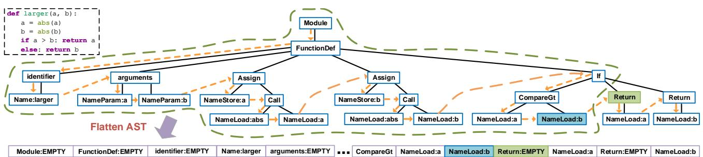
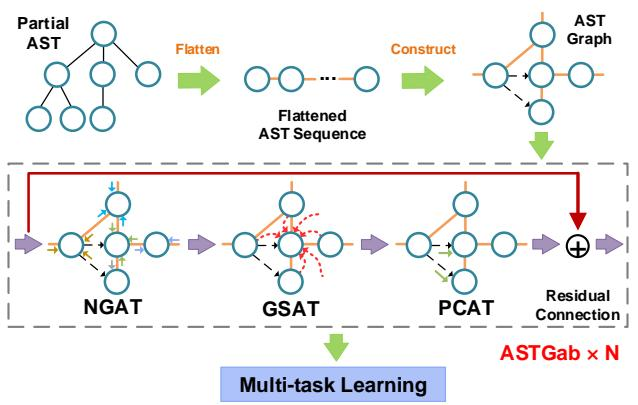
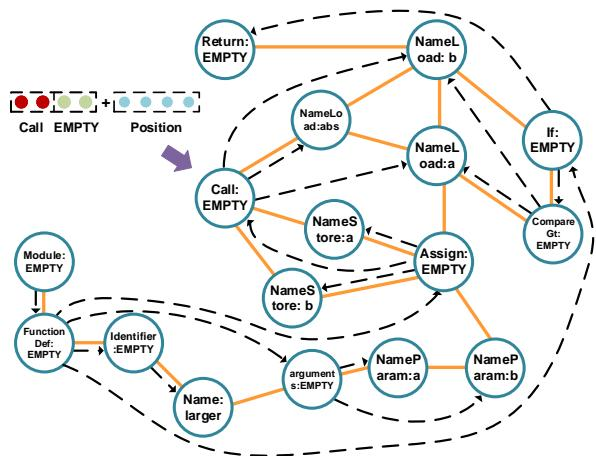
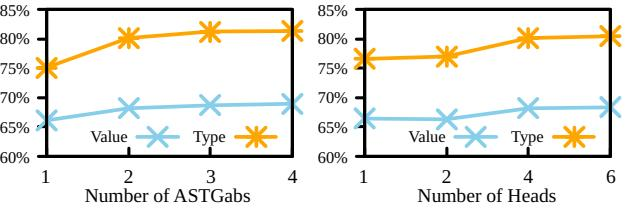
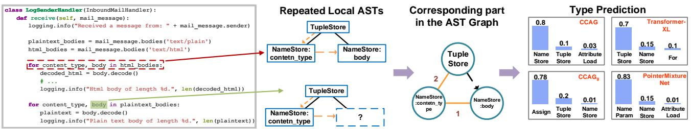

# Code Completion by Modeling Flattened Abstract Syntax Trees as Graphs

Yanlin Wang,1 Hui Li2\*

1 Microsoft Research Asia 2 School of Informatics, Xiamen University yanlwang@microsoft.com, hui@xmu.edu.cn

#### Abstract

Code completion has become an essential component of integrated development environments. Contemporary code completion methods rely on the abstract syntax tree (AST) to generate syntactically correct code. However, they cannot fully capture the sequential and repetitive patterns of writing code and the structural information of the AST. To alleviate these problems, we propose a new code completion approach named CCAG, which models the flattened sequence of a partial AST as an AST graph. CCAG uses our proposed AST Graph Attention Block to capture different dependencies in the AST graph for representation learning in code completion. The sub-tasks of code completion are optimized via multi-task learning in CCAG, and the task balance is automatically achieved using uncertainty without the need to tune task weights. The experimental results show that CCAG has superior performance than state-of-the-art approaches and it is able to provide intelligent code completion.

### 1 Introduction

Code completion, which provides code suggestions for developers, is one of the most attractive features in integrated development environments (IDEs). According to the study of [Murphy, Kersten, and Findlater](#page-8-0) [\(2006\)](#page-8-0), users of Eclipse IDE used the code suggestion of Eclipse as much as the common editing commands (e.g., copy and paste) since it reduces the required amount of typing and eliminates typos.

[Hindle et al.](#page-8-1) [\(2012\)](#page-8-1) firstly reduce code completion to a natural language processing (NLP) problem. Thereafter, many researchers leverage NLP techniques to design code completion engines [\(Allamanis et al. 2018;](#page-8-2) [Le, Chen, and](#page-8-3) [Babar 2020\)](#page-8-3). Early works generate code as a sequence of code tokens [\(Hindle et al. 2012\)](#page-8-1). However, directly modeling tokens of code sequences sometimes fails to produce syntactically correct code [\(Brockschmidt et al. 2019\)](#page-8-4). Recent works [\(Liu et al. 2016;](#page-8-5) [Li et al. 2018\)](#page-8-6) alleviate this issue by using the target language's grammar to generate abstract syntax trees (ASTs) which are syntactically correct by construction. They show that AST based code completion, which contains value prediction and type prediction as sub-tasks, can provide more intelligent code suggestions, and it has been adopted in several IDEs (e.g., Visual Studio Code IDE [\(Svyatkovskiy et al. 2019\)](#page-8-7)). In this paper, the term "code completion" refers to AST based code completion.

To model the tree structure of AST, most code completion methods opt to flatten the AST using pre-order depthfirst traversal [\(Liu et al. 2016;](#page-8-5) [Li et al. 2018\)](#page-8-6). Then, powerful deep learning techniques (e.g., LSTMs and Transformer) can be adopted for learning the representation of the flattened AST sequence for later use in code completion. In addition to code completion, recent works on learning program representations [\(Allamanis, Brockschmidt, and](#page-8-8) [Khademi 2018;](#page-8-8) [Brockschmidt et al. 2019\)](#page-8-4) for other downstream tasks (e.g., variable prediction and hole completion) have shed some light on the benefits of modeling an AST as a graph of which the representation can be learned using Graph Neural Network (GNN) [\(Wu et al. 2020\)](#page-9-0).

However, neither of the two paradigms can fully model ASTs for the code completion task since they neglect the sequential and repetitive patterns of humans on writing code, and the structural information of AST: (1) Firstly, when writing code, the skeleton (i.e., function declaration) is often written first and other statements in the body of the function are written one by one just like the pre-order depth-first traversal of AST [\(Yang 2020\)](#page-9-1). Such sequential information is important to code completion. (2) Moreover, code completions are surprisingly repetitive [\(Hellendoorn et al. 2019\)](#page-8-9). For example, the study of [Aye and Kaiser](#page-8-10) [\(2020\)](#page-8-10) on a codebase from GitHub shows that there is a 59.8% probability that any keyword, identifier, or literal repeats one of the previous 100 tokens. Capturing such a repetitive pattern can enhance code completion. (3) Lastly, the structural information of AST provides strong indications on the dependencies between linked nodes which should be considered. Simple sequential modeling ignores the repetitive pattern and the structural information while the vanilla graph based modeling neglects the sequential and repetitive patterns. In addition to the problem of AST modeling, some code completion methods [\(Liu et al. 2016,](#page-8-5) [2020\)](#page-8-11) model the sub-tasks (i.e., value prediction and type prediction) via multi-task learning [\(Vandenhende et al. 2020\)](#page-8-12), but the task weights are manually set. Therefore, these methods suffer from the task imbalance which will impede proper training in multi-task learning [\(Chen et al. 2018;](#page-8-13) [Vandenhende et al. 2020\)](#page-8-12).

To address the problems mentioned above, we propose an

\*Hui Li is the corresponding author.

Copyright © 2021, Association for the Advancement of Artificial Intelligence (www.aaai.org). All rights reserved.

Figure 1: The AST of a Python function. The orange dashed arrows show the traversal for the flattening. The green dashed line indicates a partial AST with NameLoad:b being the *right-most* node and Return (i.e., Return:EMPTY in the flattened AST) being the next node to predict.

effective Code Completion method by modeling flattened ASTs as Graphs (CCAG for short). Compared to previous methods, the contributions of our work are:

- CCAG models a flattened AST derived from the pre-order depth-first traversal of a partial AST as a graph, and it is tailored to include the sequential and repetitive patterns of writing code and the structural information of the AST.
- CCAG uses our proposed AST Graph Attention Block (ASTGab) comprised of three different attention based layers. Each layer captures differing dependencies among AST nodes. ASTGab is further enhanced with the residual connection so that multiple ASTGabs can be stacked to improve the performance.
- CCAG adopts an uncertainty based method to automatically balance the two sub-tasks of code completion in multi-task learning without the need to tune task weights.

We conduct extensive experiments on benchmark data for evaluating code completion. Results show that CCAG surpasses state-of-the-art code completion approaches.

### 2 Preliminary

Any programming language has an explicit context-free grammar (CFG), and it can be used to parse source code into an AST which represents the abstract syntactic structure of source code. An AST is a tree where each non-leaf node corresponds to a *non-terminal* in the CFG specifying structural information (e.g., ForStatement and IfStatement). Each leaf node corresponds to a *terminal* (e.g., variable names and operators) in the CFG encoding program text. An AST can be converted back into source code easily. Fig. [1](#page-1-0) provides an example of the AST for a python function. We can see that each non-leaf node contains a type attribute (e.g., Module) and each leaf node contains a type attribute and a value attribute (e.g., NameLoad:a means that the type is NameLoad and the value is a).

Code completion consumes a partial AST as the input:

Definition 1 (Partial AST [\(Liu et al. 2016\)](#page-8-5)). Given a complete AST T, a partial AST is a subtree T 0 of T, such that for each node n in T 0 , its left sequence LT (n) with respect to T is a subset of T 0 , i.e., LT (n) ⊆ T 0 . Here, the left sequence LT (n) is defined as all the nodes that are visited earlier than n in the pre-order depth-first traversal sequence of T.

For example, the green dashed line in Fig. [1](#page-1-0) illustrates a partial AST. Following [Li et al.](#page-8-6) [\(2018\)](#page-8-6), we append EMPTY as the value to each non-leaf node when flattening the AST. The formal definition of code completion is as follows:

Definition 2 (Code Completion [\(Liu et al. 2016\)](#page-8-5)). Each partial AST T 0 has one *right-most* node nR, and all other nodes of T 0 form its left sequence LT (nR). We call the next node after nR in the pre-order depth-first traversal sequence of the complete AST T as the next node following T 0 . Given a partial AST T 0 , the task of code completion is to predict the value and the type of the next node following T 0 .

For the partial AST shown in Fig. [1,](#page-1-0) the right-most node is NameLoad:b and the next node to predict is Return (i.e., Return:EMPTY). A successful model should give both the value EMPTY and the type Return as predictions.

The traversal order of ASTs in code completion[1](#page-1-1) is consistent with the way that developers implement a function: the function declaration is often written first and then other statements are written one by one [\(Yang 2020\)](#page-9-1).

### 3 Learning to Complete Code with CCAG

In this section, we will describe the details of CCAG. Fig. [2](#page-2-0) provides an overview of CCAG.

#### 3.1 Program Representation

CCAG models each flattened AST sequence of a partial AST as an AST graph. Fig. [3](#page-2-1) shows how CCAG represents the partial AST in Fig. [1](#page-1-0) as a graph. Duplicated nodes in the flattened AST are merged into one node in the graph. Each *node-node* edge in the graph indicates that the two linked nodes are adjacent in the flattened AST sequence. Nodenode edges are undirected, allowing information propagation in both directions. The weight of a node-node edge is the frequency of the occurrence of the edge in the corresponding flattened AST sequence.

However, flattening a partial AST into a sequence may result in the information loss of the tree structure. Following [Li](#page-8-6)

1[Note that some works use in-order depth-first traversal to de](#page-8-6)[fine the problem \(Liu et al. 2016; Li et al. 2018; Liu et al. 2020\).](#page-8-6) [But the AST examples in their papers and the code completion task](#page-8-6) [in their experiments use pre-order depth-first traversal.](#page-8-6)

Figure 2: Overview of CCAG. In graphs, orange lines show the traversal for flattening the AST or the node-node edges, and black dashed lines are parent-child edges.

[et al.](#page-8-6) [\(2018\)](#page-8-6), we record the parent node of each node in original ASTs since parent-child information can help the model learn the hierarchical structure of the AST. Then, we add *parent-child* edges to the AST graph. Parent-child edges are directed (from parent to child) and unweighted to retain the structure. Each node may have more than one parent node.

One remaining issue is that the positional information of each node in the flattened AST sequence is missing in the graph, since repeated AST nodes are merged into one node in the graph. To remedy it, we record the distance between the last occurrence of each node and the right-most node in the flattened AST sequence as the positional encoding. For instance, assuming that the flattened AST sequence is {n1, n2, n3, n2} with n2 being the right-most node, the position embeddings p1, p2, p3 for n1, n2 and n3 are vectors with all dimensions being 3, 0 and 1, respectively. Note that the position embeddings are fixed and will not be updated.

For a node ni , we embed its value and type into two separate spaces. vi , ti ∈ R d , pi ∈ R 2d are its value embedding vector, type embedding vector and position embedding vector, respectively. The representation hi of ni is as follows:

$$\mathbf{h}\_{i} = ReLU\{\mathbf{W}^{(p)}(\left[\mathbf{t}\_{i} \,\middle|\,\,\mathbf{v}\_{i}\right] + \mathbf{p}\_{i}) + \mathbf{b}^{(p)}\},\tag{1}$$

where || indicates the concatenation operation, W(p) ∈ R d×2d is a parameter matrix and b (p) is the bias vector.

Since we first flatten the partial AST and then derive the AST graph from the flattened AST sequence, one may ask why using such indirect modeling. Here, we provide discussions on alternatives to justify the rationality of our design. In Sec. [4.2,](#page-5-0) we will also show that our design leads to superior performance than the alternatives.

- Alternative 1: Directly modeling the original partial AST as a graph/tree. In such a design, sequential information is missing, and repeated nodes may be located in different parts of the graph which makes it hard for the model to capture the repetitive pattern. A tree can be viewed as a special graph and has same issues as mentioned above.
- Alternative 2: Directly modeling the flattened AST sequence. Directly modeling the flattened AST sequence

Figure 3: The AST graph in CCAG for the partial AST in Fig. [1.](#page-1-0) Orange lines show the node-node edges and black dashed lines indicate the parent-child edges.

also makes capturing the repetitive pattern harder since repeated nodes can be physically distant from each other in the sequence. Additionally, simple sequential modeling will result in the loss of the structural information of the partial AST.

Differently, in CCAG, the sequential pattern is incorporated by modeling the flattened AST sequence, the repetitive pattern can be captured via the merged repeated nodes and the weights of node-node edges, and the structural information is retained via the parent-child edges.

#### 3.2 AST Graph Attention Block (ASTGab)

We adopt the idea of GNN to design an AST Graph Attention Block (ASTGab) for learning the representation of the AST graph. GNN is well-suited for learning AST graphs since it is designed to automatically extract features from the rich node connections in the graph data [\(Wu et al. 2020\)](#page-9-0). The input to the ASTGab is the initial embeddings of all AST nodes in one AST graph derived from a partial AST. An ASTGab consists of three different layers which extract node features at different levels, as shown in Fig. [2.](#page-2-0) The output is handled by a residual connection to overcome the difficulty of training deep neural networks.

Neighbor Graph Attention Layer (NGAT). The initial embeddings are first fed into a NGAT which extracts features from the *first-order* neighborhood along the node-node edges in the AST graph. Strong dependencies typically exist between first-order neighbors. For instance, the comparison operators are normally followed by loading the variable. In the AST graph, this indicates a node-node edge between two AST nodes (e.g., the node-node edge between CompareGt:EMPTY and NameLoad:a in Fig. [3\)](#page-2-1).

Inspired by [Velickovic et al.](#page-8-14) [\(2018\)](#page-8-14), we perform selfattention on every pairs of the first-order neighbors connected by the node-node edges in the AST graph and compute the first-order neighbor attention coefficient in NGAT:

$$e\_{i,j}^{(n)} = a(\mathbf{W}^{(n)} \mathbf{h}\_i, \mathbf{W}^{(n)} \mathbf{h}\_j, w\_{i,j}),\tag{2}$$

where e (n) i,j shows the attention coefficient between firstorder neighbors i and j, a is an attention mechanism, W(n) ∈ R d×d is the shared weight matrix for all first-order node pairs, and wi,j is the weight of the node-node edge between i and j. The first-order neighbor attention coefficients are then normalized across all the first-order neighbors of an AST node using softmax. There are many choices for the design of a. We adopt a single-layer feedforward neural network followed by a LeakyReLU non-linearity unit with a negative input slope of 0.2 as [Velickovic et al.](#page-8-14) [\(2018\)](#page-8-14). This is equivalent to the following expression:

$$\alpha\_{i,j}^{(n)} = \frac{\exp\left(\mathop{\rm LeakyReLU}\left(\mathbf{a}^{(n)^T} \left[\mathbf{W}^{(n)} \mathbf{h}\_i \, ||\, \mathbf{W}^{(n)} \mathbf{h}\_j \, ||\, \boldsymbol{w}\_{i,j} \right]\right)\right)}{\sum\_{k \in \mathcal{N}\_i} \exp\left(\mathop{\rm LeakyReLU}\left(\mathbf{a}^{(n)^T} \left[\mathbf{W}^{(n)} \mathbf{h}\_i \, ||\, \mathbf{W}^{(n)} \mathbf{h}\_k \, ||\, \boldsymbol{w}\_{i,k} \right]\right)\right)},\tag{3}$$

where Ni indicates the set of first-order neighbors of node i along node-node edges, and a (n) ∈ R 2d+1 and W(n) ∈ R d×d are parameter vector and matrix, respectively. Then, the node feature for each AST node is updated as:

$$\mathbf{h}\_i^{(n)} = ReLU\left(\sum\_{j \in \mathcal{N}\_i} \alpha\_{i,j}^{(n)} \mathbf{W}^{(a)} \mathbf{h}\_j\right),\tag{4}$$

where W(a) ∈ R d×d is the weight matrix.

As suggested by [Velickovic et al.](#page-8-14) [\(2018\)](#page-8-14), we employ multi-head attention [\(Vaswani et al. 2017\)](#page-8-15) in order to stabilize the learning of NGAT. Specifically, we perform M independent transformations in Eq. [4](#page-3-0) and use the average of the M results as the representation of each AST node:

$$\mathbf{h}\_i^{(n)} = ReLU\left(\frac{1}{M} \sum\_{m=1}^{M} \sum\_{j \in \mathcal{N}\_i} \alpha\_{i,j,m}^{(n)} \mathbf{W}\_m^{(a)} \mathbf{h}\right),\tag{5}$$

where W(a) m ∈ R d×d is the parameter matrix for m-th head, and α (n) i,j,m is the normalized attention coefficient obtained by the m-th attention mechanism in Eq. [4.](#page-3-0)

Global Self-attention Layer (GSAT). The second component GSAT captures the importance of each node to other nodes in the graph. Compared to NGAT, which focuses on the local neighborhood, GSAT brings a global vision of the AST graph to CCAG. Since the AST graph only contains unique AST nodes of which the number is much smaller than the original AST, we can feed the entire AST graph into GSAT, and then the self-attention mechanism is adopted to draw the global dependencies:

$$\mathbf{H}^{(g)} = \operatorname{softmax} \left( \frac{(\mathbf{W}^{(k)} \mathbf{H}^{(n)})^T (\mathbf{W}^{(q)} \mathbf{H}^{(n)})}{\sqrt{d}} \right) \left( \mathbf{W}^{(v)} \mathbf{H}^{(n)} \right)^T,\tag{6}$$

where H(n) are the representations of AST nodes from NGAT, and W(k) ,W(q) ,W(v) ∈ R d×d are parameters.

Parent-child Attention Layer (PCAT). The third layer PCAT captures the structural information from parent-child edges and refine the node features from GSAT. Precisely, we adopt a two-layer attention mechanism in PCAT:

$$\begin{aligned} \mathbf{p}\_i &= ReLU\{\mathbf{W}\_1^{(p1)} \mathbf{h}\_i^{(g)} + \frac{1}{j \in |\mathcal{P}\_i|} \mathbf{W}\_2^{(p1)} \sum\_{j \in \mathcal{P}\_i} \mathbf{h}\_j^{(g)} + \mathbf{b}^{(p1)}\} \\ \mathbf{h}\_i^{(p)} &= ReLU\{\mathbf{W}^{(p2)} \mathbf{p}\_i + \mathbf{b}^{(p2)}\} \end{aligned} \tag{7}$$

where h (p) i is the representation for node i outputted by PCAT and it incorporates the feature(s) from its parent node(s). Pi indicates the set of parent nodes of node i, |Pi | is the set size of Pi , h (g) i ∈ H(g) is the representation for node i from GSAT, W(p1) 1 ,W(p1) 2 ,W(p2) ∈ R d×d are learnable parameter matrices, and b (p1) , b (p2) are bias vectors.

Residual Connection. As shown in Fig. [2,](#page-2-0) we can stack multiple ASTGabs to increase the non-linearities of CCAG and the input to each ASTGab is the output from the previous ASTGab. However, deeper neural networks face the difficulty of training. Thus, we add a residual connection [\(He](#page-8-16) [et al. 2016\)](#page-8-16) to each ASTGab to ease the difficulty:

$$\begin{aligned} \mathbf{r}\_i &= ReLU\left(\mathbf{W}^{(r1)}\mathbf{h}\_i^{(p)} + \mathbf{b}^{(r1)}\right) \\ \mathbf{h}\_i^{(r)} &= \mathbf{W}^{(r2)}\mathbf{r}\_i + \mathbf{b}^{(r2)} + \mathbf{h}\_i \end{aligned} \tag{8}$$

where W(r1) ,W(r2) ∈ R d×d are learnable weight matrices, and b (r1) , b (r2) are bias vectors. h (r) i is the final output of one ASTGab for the AST node i.

#### 3.3 Predicting Next AST Nodes and Optimization

As the right-most node has the most useful information of the next node, we use a soft-attention mechanism to incorporate the relevance of each node to the right-most node when generating the global representation of the AST graph:

$$\begin{aligned} \beta\_{i,n\_j} &= \mathbf{z}^{(t1)} \sigma \Big( \mathbf{W}\_1^{(t1)} \mathbf{h}\_i^{(r)} + \mathbf{W}\_2^{(t1)} \mathbf{h}\_{n\_j}^{(r)} + \mathbf{b}^{(t1)} \Big) \\ \mathbf{s}\_j &= \sum\_{i \in \mathcal{G}\_j} \beta\_{i,n\_j} \mathbf{h}\_i^{(r)} \end{aligned} \tag{9}$$

where Gj is the set of all unique AST nodes in the AST graph j, and h (r) nj is the output from ASTGab(s) for the right-most node of the AST graph j. W(t1) 1 ,W(t1) 2 ∈ R d×d are weight matrices, b (t1) is a bias vector, σ is the sigmoid function, z (t1) ∈ R d is a learnable parameter vector, and sj indicates the global representation of the AST graph j.

The global representation sj is then projected to the value/type vocabulary space followed by softmax to generate the value/type probability distribution for the next node:

$$\begin{aligned} \mathfrak{F}\_{j}^{(v)} &= \mathbf{W}^{(v)} \mathbf{s}\_{j} + \mathbf{b}^{(v)}, \ \mathfrak{F}\_{j}^{(v)} = softmax\{\mathfrak{F}\_{j}^{(v)}\} \\ \mathfrak{F}\_{j}^{(t)} &= \mathbf{W}^{(t)} \mathbf{s}\_{j} + \mathbf{b}^{(t)}, \ \mathfrak{F}\_{j}^{(t)} = softmax\{\mathfrak{F}\_{j}^{(t)}\} \end{aligned} \tag{10}$$

where W(v) ∈ R V ×d ,W(t) ∈ R T ×d are parameters, b (t) ∈ R V and b (t) ∈ R T are bias vectors, and V /T is the vocabulary size of node value/type. ˆy (v) j ∈ R V and ˆy (t) j ∈ R T are the predicted value and type probability distributions of the next node to the partial AST corresponding to j.

Cross-entropy loss can be used for the optimization:

$$\mathcal{L}\_v = -\sum\_{j \in \mathcal{AG}} \mathbf{y}\_j^{(v)} \log(\hat{\mathbf{y}}\_j^{(v)}), \quad \mathcal{L}\_t = -\sum\_{j \in \mathcal{AG}} \mathbf{y}\_j^{(t)} \log(\hat{\mathbf{y}}\_j^{(t)}), \tag{11}$$

where Lv and Lt are the loss functions for value prediction and type prediction, respectively. AG is the set of all AST graphs generated from the data (i.e., one AST graph for one partial AST). y (v) j and y (t) j are two one-hot encodings of the ground-truth value and type for the next node, respectively.

There are two prediction tasks in code completion, and two paradigms of training exist: (1) Train two models independently [\(Li et al. 2018\)](#page-8-6). One uses Lv for value prediction and the other uses Lt for type prediction. (2) Leverage multi-task learning [\(Vandenhende et al. 2020\)](#page-8-12), and train one model with a global loss function [\(Liu et al. 2016,](#page-8-5) [2020\)](#page-8-11): L = wvLv + wtLt, where wv and wt are task weights. We choose the second training method. The reason is that value and type are two related attributes in code completion where the type can serve as a constraint to the value, and vice versa [\(Liu et al. 2020\)](#page-8-11). Training two relevant tasks jointly via multi-task learning can benefit both tasks. Nevertheless, previous multi-task learning based code completion methods [\(Liu et al. 2016,](#page-8-5) [2020\)](#page-8-11) treat two tasks equally (i.e., fix wv = wt = 1) during optimization, while the two tasks may have different and changing converge speeds in multitask learning [\(Chen et al. 2018\)](#page-8-13). Task imbalance will impede proper training because they manifest as imbalances between backpropagated gradients. However, the cost for manually tuning and updating task weights is unaffordable. To alleviate this issue, we use the idea of *uncertainty* [\(Kendall,](#page-8-17) [Gal, and Cipolla 2018\)](#page-8-17) to automatically weigh two tasks during optimization without the need to tune task weights. As a result, the joint loss[2](#page-4-0) used by CCAG is:

$$\begin{split} \mathcal{L} & \approx \frac{1}{\theta^2} \mathcal{L}\_v + \frac{1}{\tau^2} \mathcal{L}\_t + \log \theta + \log \tau \\ & = \exp(-2\theta') \cdot \mathcal{L}\_v + \exp(-2\tau') \cdot \mathcal{L}\_t + \theta' + \tau', \end{split} \tag{12}$$

where θ and τ are learnable scalars. Their magnitudes indicate how "uniform" the discrete distributions are, which is related to the *uncertainty* as measured in entropy [\(Kendall,](#page-8-17) [Gal, and Cipolla 2018\)](#page-8-17). We let θ 0 = log θ, τ 0 = log τ , and train CCAG to learn θ 0 and τ 0 instead of unconstrained θ and τ for the numerical stability. The reason is that 1 θ 2 and 1 τ 2 may encounter the overflow error for very small θ and τ , and log θ and log τ will have the math domain error for nonpositive θ and τ . θ 0 and τ 0 are automatically learned parameters and can be interpreted as the task weights in multitask learning [\(Kendall, Gal, and Cipolla 2018\)](#page-8-17). This way, we avoid manually setting the task weights and the two tasks are automatically balanced in multi-task learning so that CCAG can provide accurate predictions for both tasks. All the parameters of CCAG including θ 0 and τ 0 can be updated by gradient descent based methods.

### 4 Experiments

#### 4.1 Experimental Setup

Data. We choose two benchmark datasets[3](#page-4-1) JavaScript (JS) and Python (PY) used in previous studies [\(Li et al. 2018;](#page-8-6) [Liu](#page-8-11) [et al. 2020\)](#page-8-11). Each dataset contains 150,000 program files and their corresponding ASTs. We use the official train/test split, i.e., 100,000 in the training set and 50,000 in the test set.

We follow the method of [Li et al.](#page-8-6) [\(2018\)](#page-8-6) for data preprocessing. We first flatten ASTs into sequences using preorder depth-first traversal. JS and PY have 95 and 330 types, respectively. We then divide each program into segments consisting of 50 consecutive AST nodes. Since the number of values is too large, we keep K most frequent values in the training data to construct the value vocabulary where K={1,000, 10,000, 50,000}. Values which are not included in the value vocabulary are replaced with UNK. For non-leaf nodes, EMPTY is used as the value. This way, we have 6 datasets: JS1k, JS10k, JS50k, PY1k, PY10k and PY50k. For each flattened sequence with l AST nodes, we predict the value/type of the r-th (2 ≤ r ≤ l) AST node based on its preceding r − 1 nodes [\(Li et al. 2018;](#page-8-6) [Liu et al. 2020\)](#page-8-11).

Baselines. We compare CCAG with several state-of-theart code completion methods. It is worth pointing out that some of them are simultaneously proposed in different papers with a slight difference in the design of the prediction layer. We group methods with similar designs as one baseline and describe the prediction layer we use. These baselines include:

- • VanillaLSTM [\(Liu et al. 2016;](#page-8-5) [Li et al. 2018;](#page-8-6) [Svy](#page-8-7)[atkovskiy et al. 2019\)](#page-8-7) adopts LSTM to extract AST node features from flattened AST sequences. The inputs to each LSTM cell are previous hidden state and the concatenation of the type and value embeddings of the current AST node. The last output hidden state is fed to a prediction layer consisting of a single-layer feedforward neural network followed by softmax.
- ParentLSTM [\(Li et al. 2018\)](#page-8-6) is an improved version of VanillaLSTM. It computes the attention weights between the current hidden state and all the previous hidden states within a context window to produce a context vector. The input to the prediction layer is the concatenation of the current hidden state, the context vector and the hidden state of the parent node of the current node.
- PointerMixtureNet [\(Bhoopchand et al. 2016;](#page-8-18) [Li](#page-8-6) [et al. 2018\)](#page-8-6) improves ParentLSTM using Pointer Network [\(Vinyals, Fortunato, and Jaitly 2015\)](#page-9-2). When predicting, it chooses the value/type for the next node from either a predefined global vocabulary or the context window according to the produced probability from the model.
- Transformer [\(Kim et al. 2020;](#page-8-19) [Svyatkovskiy et al.](#page-8-20) [2020a\)](#page-8-20) improves VanillaLSTM by replacing LSTM with Transformer [\(Vaswani et al. 2017\)](#page-8-15).
- Transformer-XL [\(Liu et al. 2020\)](#page-8-11) adopts an improved Transformer architecture [\(Dai et al. 2019\)](#page-8-21) to model the flattened AST sequence and the path from the predicting node to the root in the AST is fed to a BiLSTM to capture the structural information. The naive multi-task learning is used, and task weights are fixed to be equal.

Transformer-XL and CCAG (and its variants) adopt multitask learning for training. For other methods, value prediction and type prediction are trained independently.

Hyper-parameters. For a fair comparison, we use 128 as the embedding size, hidden size and batch size for all meth-

2 Its derivation can be found in the appendix.

3 <https://www.sri.inf.ethz.ch/research/plml>

|                   | JS1k    |         | JS10k   |         | JS50k   |         | PY1k     |         | PY10k   |         | PY50k   |         |
|-------------------|---------|---------|---------|---------|---------|---------|----------|---------|---------|---------|---------|---------|
|                   | value   | type    | value   | type    | value   | type    | value    | type    | value   | type    | value   | type    |
| VanillaLSTM       | 53.19%  | 69.52%  | 58.04%  | 71.16%  | 59.70%  | 72.08%  | 49.99%   | 68.08%  | 52.67%  | 68.86%  | 53.66%  | 69.09%  |
| ParentLSTM        | 56.45%  | 71.99%  | 61.54%  | 73.46%  | 63.39%  | 74.24%  | 52.57%   | 70.10%  | 55.87%  | 76.25%  | 56.93%  | 71.00%  |
| PointerMixtureNet | 56.49%  | 71.95%  | 62.33%  | 74.28%  | 64.14%  | 76.01%  | 52.98%   | 69.98%  | 56.91%  | 76.94%  | 57.22%  | 70.91%  |
| Transformer       | 58.40%  | 73.29%  | 63.93%  | 74.78%  | 65.31%  | 75.89%  | 53.49%   | 70.63%  | 57.52%  | 71.45%  | 59.05%  | 71.91%  |
| Transformer-XL    | 59.23%  | 72.11%  | 62.82%  | 74.09%  | 66.41%  | 76.23%  | 55.13%   | 72.45%  | 58.21%  | 73.19%  | 60.00%  | 72.42%  |
| CCAG              | 62.79%  | 75.72%  | 66.69%  | 78.55%  | 68.19%  | 80.14%  | 61.92%   | 76.71%  | 63.24%  | 80.90%  | 64.22%  | 75.31%  |
|                   | (6.01%) | (3.32%) | (4.32%) | (5.04%) | (2.68%) | (5.13%) | (12.32%) | (5.88%) | (8.64%) | (5.15%) | (7.03%) | (3.99%) |

Table 1: Results on six datasets. Results of CCAG and the best baselines are in bold. The percentages in brackets indicate the improvements of CCAG over the best baselines.

|        |        | JS50k  | PY50k  |        |  |  |
|--------|--------|--------|--------|--------|--|--|
|        | value  | type   | value  | type   |  |  |
| CCAGg  | 66.20% | 75.97% | 62.05% | 73.22% |  |  |
| CCAGn  | 67.94% | 78.69% | 63.15% | 74.20% |  |  |
| CCAGb  | 65.27% | 75.10% | 59.22% | 71.45% |  |  |
| CCAGp  | 66.73% | 76.11% | 63.05% | 74.00% |  |  |
| CCAGr  | 66.76% | 76.31% | 62.35% | 73.64% |  |  |
| CCAGng | 37.36% | 49.66% | 30.36% | 45.60% |  |  |
| CCAGgs | 67.44% | 78.23% | 62.45% | 73.79% |  |  |
| CCAGpe | 67.98% | 79.90% | 62.01% | 73.17% |  |  |
| CCAG   | 68.19% | 80.14% | 64.22% | 75.31% |  |  |

Table 2: Comparisons among variants of CCAG.

ods. All methods are optimized with Adam [\(Kingma and](#page-8-22) [Ba 2015\)](#page-8-22) using an initial learning rate of 0.001. For VanillaLSTM, ParentLSTM and PointerMixtureNet, the learning rate is multiplied by 0.6 after each epoch, the gradient norm is clipped to 5, and the size of context windows is set to 50 as suggested by [Li et al.](#page-8-6) [\(2018\)](#page-8-6). For Transformer based methods, we search the settings of heads and layer number in 1-6 and 1-8, respectively. Then, their best results are reported. Following [Li et al.](#page-8-6) [\(2018\)](#page-8-6), for methods using parentchild relations, the hidden state of one parent node will be replaced with the hidden state of the immediate predecessor to the current node, if the parent node and the current node are not in the same segment. By default, we use 2 ASTGabs and 4 heads in CCAG and its variants, but we also report the impacts of varying these hyper-parameters in Sec[.4.2.](#page-5-0)

Metrics. We use accuracy as the evaluation metric for the code completion task [\(Li et al. 2018\)](#page-8-6). It shows the proportion of correctly predicted values/types for next AST nodes.

### 4.2 Experimental Results

We run each method 3 times and report the average results. We conduct the Wilcoxon signed-rank test to test whether the improvements of CCAG are statistically significant and all the p-values are less than 0.01. We now analyze the results to answer several research questions:

RQ1: How does CCAG perform compared to baselines? Tab. [1](#page-5-1) shows all methods' performance of both value prediction and type prediction on 6 datasets. We can see that CCAG consistently surpasses the best baselines, by 2.68%- 12.32% in value prediction and 3.32%-5.88% in type prediction. CCAG also outperforms VanillaLSTM, which is used in Visual Studio Code IDE [\(Svyatkovskiy et al. 2019\)](#page-8-7), by 7.03%-23.86% in value prediction and 8.92%-17.48% in type prediction. This demonstrates CCAG's effectiveness.

Figure 4: Impacts of hyper-parameters on CCAG for JS50k. Left: Varying numbers of ASTGabs when 4 heads are used. Right: Varying numbers of heads when 2 ASTGabs are used.

RQ2: Does each component of CCAG contribute to the improvement of accuracy? We conduct an ablation study to investigate whether each component of CCAG contributes to its performance. Tab. [2](#page-5-2) reports the results of the following variants of CCAG on JS50k and PY50k:

- CCAGg models the original partial AST (instead of the flattened AST) as a graph, following the idea of [Allama](#page-8-8)[nis, Brockschmidt, and Khademi](#page-8-8) [\(2018\)](#page-8-8); [Brockschmidt](#page-8-4) [et al.](#page-8-4) [\(2019\)](#page-8-4). The representation of each AST node is the concatenation of its type and value embeddings.
- CCAGn fixes task weights in multi-task learning.
- CCAGb directly models the original partial AST as a graph, fixes task weights in multi-task learning and does not include PCAT and the residual connection.
- CCAGp, CCAGr, CCAGng, CCAGgs and CCAGpe do not include PCAT, the residual connection, NGAT, GSAT and the position embeddings, respectively.

Except the above differences, other parts of these variants are the same as CCAG. From Tab. [2,](#page-5-2) we can see that CCAGg does not perform as well as CCAG, which confirms the superiority of our design to construct AST graphs based on flattened ASTs instead of original partial ASTs. CCAGn has worse accuracy than CCAG, showing that using the uncertainty based method to automatically weigh the two tasks in multi-task learning can provide better results. CCAGb only includes the core parts NGAT and GSAT, of which the idea comes from GNN (e.g., GAT [\(Velickovic et al. 2018\)](#page-8-14)). CCAGb has comparable performance to the best baselines in Tab. [1.](#page-5-1) Nevertheless, it performs worse than other variants with more components, showing that using more sophisticated neural networks like GNN is not the only reason for the superiority of CCAG. All of CCAGp, CCAGr, CCAGng, CCAGgs and CCAGpe perform worse than CCAG, which

Figure 5: A code completion example. The type of the next AST node NameStore:body is predicted by four methods. The orange lines illustrate the traversal for flattening the AST or the node-node edges. The black lines show parent-child edges.

verifies that all components contribute to the effectiveness of CCAG. CCAGng shows the worst result among all variants. The reason is that ASTGab is based on GNN which updates node representations using information from the neighborhood. Hence, NGAT which aggregates information from neighbors is the most important component in AST-Gab to implement GNN, and ASTGab without NGAT (i.e., CCAGng) does not work at all.

RQ3: What are the impacts when changing the hyperparameters of CCAG? We conduct a study of the impacts of hyper-parameters on CCAG. We show part of the results on JS50k in Fig. [4.](#page-5-3) For other settings and datasets, similar trends exist. Specifically, increasing the number of ASTGabs improves accuracy, but using more than 2 AST-Gabs will not bring a significant gain. Besides, using more heads instead of a single head brings a noticeable improvement of accuracy. However, employing more than 4 heads does not improve accuracy too much.

Case Study. Fig. [5](#page-6-0) shows a program file in GitHub which is used to illustrate how the incoming email is handled in Google Cloud. It is also contained in the test set of PY. NameStore:body highlighted with green is the next node to predict. We provide the probabilities of the top-3 types predicted by four methods. CCAGg gives high probabilities to the types of the first-order neighbors of the next node in the AST graph based on the original partial AST. Transformer-XL mainly gives high probabilities to the types of nodes along the path from the predicting node to the root in the original partial AST, and PointerMixtureNet gives high probabilities to the frequent types. Differently, CCAG successfully captures the repetitive pattern (the repeated local ASTs) via the corresponding part in our AST graph which contains the repetitive pattern in edges and edge weights. Given the key part in our designed AST graph, it is easy for CCAG to predict the next type NameStore.

### 5 Related Work

The pioneering work for code completion [\(Bruch, Monper](#page-8-23)[rus, and Mezini 2009\)](#page-8-23) adopts Best Matching Neighbor algorithm, which is later improved by [Proksch, Lerch, and](#page-8-24) [Mezini](#page-8-24) [\(2015\)](#page-8-24) with Bayesian Networks. [Hindle et al.](#page-8-1) [\(2012\)](#page-8-1) find that most software can be processed by NLP techniques, and they use n-gram language model for code completion.

Recently, deep learning techniques such as RNNs [\(Ray](#page-8-25)[chev, Vechev, and Yahav 2014\)](#page-8-25), GRUs [\(Aye and Kaiser](#page-8-10) [2020\)](#page-8-10), LSTMs [\(Liu et al. 2016;](#page-8-5) [Svyatkovskiy et al. 2019;](#page-8-7) [Yang 2020\)](#page-9-1), Transformer and its variants [\(Kim et al. 2020;](#page-8-19) [Svyatkovskiy et al. 2020a;](#page-8-20) [Liu et al. 2020\)](#page-8-11), and multi-task learning [\(Liu et al. 2016,](#page-8-5) [2020\)](#page-8-11) have been introduced to code completion and significantly improved the accuracy of code completion engines. Besides, some works consider modeling more context information. [Bhoopchand et al.](#page-8-18) [\(2016\)](#page-8-18); [Li](#page-8-6) [et al.](#page-8-6) [\(2018\)](#page-8-6) adopt Pointer Network [\(Vinyals, Fortunato, and](#page-9-2) [Jaitly 2015\)](#page-9-2) and keep the context representations of previous tokens to enhance code completion. [Li et al.](#page-8-6) [\(2018\)](#page-8-6) consider the parent-child relation in AST to capture the structure of AST. [Liu et al.](#page-8-11) [\(2020\)](#page-8-11) model the path from the next node to the root in the AST to improve code completion. [Svyatkovskiy et al.](#page-8-26) [\(2020b\)](#page-8-26) explore different neural architectures (e.g., CNNs) for better context encoding.

In addition to code completion, there are some works studying learning general program representations for different downstream tasks [\(Allamanis et al. 2018;](#page-8-2) [Le, Chen, and](#page-8-3) [Babar 2020\)](#page-8-3). Some of them extract AST-node-level [\(Wang,](#page-9-3) [Liu, and Tan 2016\)](#page-9-3) or AST-path-level features [\(Alon et al.](#page-8-27) [2018,](#page-8-27) [2019a,](#page-8-28)[b\)](#page-8-29). Other works model ASTs as trees [\(Mou](#page-8-30) [et al. 2016;](#page-8-30) [Jayasundara et al. 2019;](#page-8-31) [Zhang et al. 2019\)](#page-9-4) or graphs [\(Nguyen and Nguyen 2015;](#page-8-32) [LeClair et al. 2020;](#page-8-33) [Al](#page-8-8)[lamanis, Brockschmidt, and Khademi 2018;](#page-8-8) [Brockschmidt](#page-8-4) [et al. 2019\)](#page-8-4) and generate program representations.

### 6 Conclusion

This paper illustrates how to model the flattened AST as an AST graph to provide intelligent code completion. Our proposed CCAG uses ASTGab to capture different dependencies in the AST graph and the sub-tasks of code completion are automatically balanced in optimization using uncertainty. Experimental results on benchmark data have demonstrated the effectiveness of CCAG. In the future, we plan to explore the potential of modeling other representations of code (e.g., data flow graphs) to improve CCAG further.

### Acknowledgments

Hui Li was partially supported by the National Natural Science Foundation of China (No. 62002303, 62036004), the Natural Science Foundation of Fujian Province of China (No. 2020J05001) and China Fundamental Research Funds for the Central Universities (No. 20720200089).

## Appendix

#### Derivation of Eq. [12](#page-4-2)

Existing code completion methods, which use multi-task learning, trains one model with a global loss function [\(Liu](#page-8-5) [et al. 2016,](#page-8-5) [2020\)](#page-8-11):

$$
\mathcal{L} = w\_v \mathcal{L}\_v + w\_t \mathcal{L}\_t,\tag{13}
$$

where Lv and Lt are defined in Eq. 11 of our submission. wv and wt are task weights for value prediction and type prediction, respectively. wv and wt are fixed and set to be equal [\(Liu et al. 2020\)](#page-8-11). However, the two tasks may have different and changing converge speeds during multi-task learning [\(Chen et al. 2018;](#page-8-13) [Vandenhende et al. 2020\)](#page-8-12). Task imbalances will impede proper training because they manifest as imbalances between backpropagated gradients. However, the cost for manually tuning and updating task weights is unaffordable. To alleviate this issue, we use the idea of *uncertainty* [\(Kendall, Gal, and Cipolla 2018\)](#page-8-17) and automatically weigh the two tasks during optimization without the need to tune task weights.

To be specific, we adapt the *scaled* version of the value prediction for the next node of the partial AST j:

$$\Pr\left(y\_j^{(v)}|\mathfrak{F}\_j^{(v)},\theta\right) = \operatorname{softmax}\left(\frac{1}{\theta^2}\mathfrak{F}\_j^{(v)}\right),\tag{14}$$

where ¯y (v) j is the unnormalized probability distribution for the value of the next AST node as defined in Eq. 10 of Sec. [3.3.](#page-3-1) θ is a positive scalar. Eq. [14](#page-7-0) can be interpreted as a Boltzmann distribution (also called Gibbs distribution) [\(Kendall, Gal, and Cipolla 2018\)](#page-8-17). The magnitude of θ indicates how "uniform" the discrete distribution is, which is related to its *uncertainty* as measured in entropy [\(Kendall,](#page-8-17) [Gal, and Cipolla 2018\)](#page-8-17).

Taking the negative logarithm of the likelihood of next node value being value c, we have:

$$\begin{split} \mathcal{L}\_v(y\_j^{(v)} = c) &= -\log s \operatorname{softmax} \{ y\_j^{(v)} = c, \mathfrak{F}\_j^{(v)} \} \\ &= -\mathfrak{F}\_j^{(v)}(c) + \log \sum\_{k \in \mathcal{V}, k \neq c} \exp \left( \mathfrak{F}\_j^{(v)}(k) \right), \end{split} \tag{15}$$

where V is the vocabulary of AST node value, and ¯y (v) j (c) is the c-th dimension of ¯y (v) j . Using Eq. [15,](#page-7-1) the log likelihood for the output being node value c in Eq. [14](#page-7-0) can be derived as:

$$\begin{split} &\log Pr(y\_j^{(v)} = c | \mathfrak{F}\_j^{(v)}, \boldsymbol{\theta}) \\ &= \frac{1}{\theta^2} \mathfrak{F}\_j^{(v)}(c) - \log \sum\_{k \in \mathcal{V}, k \neq c} \exp\left(\frac{1}{\theta^2} \mathfrak{F}\_j^{(v)}(k)\right) \\ &= -\frac{1}{\theta^2} \mathcal{L}\_v(y\_t = c) + \log \left(\sum\_{k \in \mathcal{V}, k \neq c} \exp\left(\mathfrak{F}\_j^{(v)}(k)\right)\right)^{\frac{1}{\theta^2}} \\ &\quad - \log \sum\_{k \in \mathcal{V}, k \neq c} \exp\left(\frac{1}{\theta^2} \mathfrak{F}\_j^{(v)}(k)\right). \end{split} \tag{16}$$

Applying the approximation proposed by [Kendall, Gal,](#page-8-17) [and Cipolla](#page-8-17) [\(2018\)](#page-8-17):

$$\frac{1}{\theta} \sum\_{k \in \mathcal{V}, k \neq c} \exp\left(\frac{1}{\theta^2} \mathfrak{F}\_j^{\{v\}}(k)\right) \approx \left(\sum\_{k \in \mathcal{V}, k \neq c} \left(\exp\left(\mathfrak{F}\_j^{\{v\}}(k)\right)\right)\right)^{\frac{1}{\theta^2}},\tag{17}$$

we have:

$$\begin{split} & \log Pr\left(y\_{j}^{(j)} = c | \mathfrak{F}\_{j}^{(v)}, \theta\right) \\ &= -\frac{1}{\theta^{2}} \mathcal{L}\_{v}(y\_{j} = c) - \log \frac{\sum\_{k \in \mathcal{V}, k \neq c} \exp\left(\frac{1}{\theta^{2}} \mathfrak{F}\_{j}^{(v)}(k)\right)}{\left(\sum\_{k \in \mathcal{V}, k \neq c} \exp\left(\mathfrak{F}\_{j}^{(v)}(k)\right)\right)^{\frac{1}{\theta^{2}}}} \\ & \approx -\frac{1}{\theta^{2}} \mathcal{L}\_{v}(y\_{j}^{(v)} = c) - \log \theta. \end{split} \tag{18}$$

Similarly, for type prediction, we can get:

$$\log Pr\left(y\_j^{(t)} = e \middle| \mathfrak{F}\_j^{(t)}, \tau\right) \approx -\frac{1}{\tau^2} \mathcal{L}\_t(y\_j^{(t)} = e) - \log \tau,\quad(19)$$

where τ is a positive scalar, e is a type, and ¯y (t) j is the unnormalized probability distribution for the type of the next AST node as defined in Eq. 10 of our submission.

Given Eq. [18](#page-7-2) and Eq. [19,](#page-7-3) the joint loss with ground-truth value and type for the next node being c and e can be derived as:

$$\begin{split} \mathcal{L}(y\_j^{(v)} = c, y\_j^{(t)} = e, \theta, \tau) &= \\ = -\log\left(Pr(y\_j^{(v)} = c | \mathsf{F}\_j^{(v)}, \theta) \cdot Pr(y\_j^{(t)} = e | \mathsf{F}\_j^{(t)}, \tau)\right) \\ \approx \frac{1}{\theta^2} \mathcal{L}\_v(y\_j^{(v)} = c) + \frac{1}{\tau^2} \mathcal{L}\_t(y\_j^{(t)} = e) + \log \theta + \log \tau. \\ = \exp(-2\theta') \cdot \mathcal{L}\_v(y\_j^{(v)} = c) + \exp(-2\tau') \cdot \mathcal{L}\_t(y\_j^{(t)} = e) \\ + \theta' + \tau'. \end{split} \tag{20}$$

Then, taking all the next nodes into consideration, we have the join loss (i.e., Eq. [12](#page-4-2) in Sec. [3.3\)](#page-3-1):

$$\begin{split} \mathcal{L} & \approx \frac{1}{\theta^2} \mathcal{L}\_v + \frac{1}{\tau^2} \mathcal{L}\_t + \log \theta + \log \tau \\ & = \exp(-2\theta') \cdot \mathcal{L}\_v + \exp(-2\tau') \cdot \mathcal{L}\_t + \theta' + \tau'. \end{split} \tag{21}$$

In the last transition of Eqs. [20](#page-7-4) and [21,](#page-7-5) we let θ 0 = log θ and τ 0 = log τ , and train the model to learn θ 0 and τ 0 instead of the unconstrained scalars θ and τ . This is for the numerical stability since 1 θ 2 and 1 τ 2 may encounter the overflow error for very small θ and τ , and log θ and log τ will have the math domain error for nonpositive θ and τ .

θ 0 and τ 0 are automatically learned parameters and can be interpreted as the task weights in multi-task learning [\(Kendall, Gal, and Cipolla 2018\)](#page-8-17). They are regularized by the last two terms in Eq. [20](#page-7-4) to prevent overfitting. This way, we avoid manually setting the task weights and the two tasks are automatically balanced in multi-task learning so that CCAG can provide accurate predictions for both tasks. All the parameters of CCAG including θ 0 and τ 0 can be updated by gradient descent based methods.

### References

Allamanis, M.; Barr, E. T.; Devanbu, P. T.; and Sutton, C. A. 2018. A Survey of Machine Learning for Big Code and Naturalness. *ACM Comput. Surv.* 51(4): 81:1–81:37.

Allamanis, M.; Brockschmidt, M.; and Khademi, M. 2018. Learning to Represent Programs with Graphs. In *ICLR*.

Alon, U.; Brody, S.; Levy, O.; and Yahav, E. 2019a. code2seq: Generating Sequences from Structured Representations of Code. In *ICLR*.

Alon, U.; Zilberstein, M.; Levy, O.; and Yahav, E. 2018. A general path-based representation for predicting program properties. In *PLDI*, 404–419.

Alon, U.; Zilberstein, M.; Levy, O.; and Yahav, E. 2019b. code2vec: learning distributed representations of code. *Proc. ACM Program. Lang.* 3(POPL): 40:1–40:29.

Aye, G. A.; and Kaiser, G. E. 2020. Sequence Model Design for Code Completion in the Modern IDE. *Arxiv Preprint* URL [https://arxiv.org/abs/2004.05249.](https://arxiv.org/abs/2004.05249)

Bhoopchand, A.; Rocktaschel, T.; Barr, E. T.; and Riedel, ¨ S. 2016. Learning Python Code Suggestion with a Sparse Pointer Network. *Arxiv Preprint* URL [https://arxiv.org/abs/](https://arxiv.org/abs/1611.08307) [1611.08307.](https://arxiv.org/abs/1611.08307)

Brockschmidt, M.; Allamanis, M.; Gaunt, A. L.; and Polozov, O. 2019. Generative Code Modeling with Graphs. In *ICLR*.

Bruch, M.; Monperrus, M.; and Mezini, M. 2009. Learning from examples to improve code completion systems. In *ESEC/FSE*, 213–222.

Chen, Z.; Badrinarayanan, V.; Lee, C.; and Rabinovich, A. 2018. GradNorm: Gradient Normalization for Adaptive Loss Balancing in Deep Multitask Networks. In *ICML*, volume 80, 793–802.

Dai, Z.; Yang, Z.; Yang, Y.; Carbonell, J. G.; Le, Q. V.; and Salakhutdinov, R. 2019. Transformer-XL: Attentive Language Models beyond a Fixed-Length Context. In *ACL*, 2978–2988.

He, K.; Zhang, X.; Ren, S.; and Sun, J. 2016. Deep Residual Learning for Image Recognition. In *CVPR*, 770–778.

Hellendoorn, V. J.; Proksch, S.; Gall, H. C.; and Bacchelli, A. 2019. When code completion fails: a case study on realworld completions. In *ICSE*, 960–970.

Hindle, A.; Barr, E. T.; Su, Z.; Gabel, M.; and Devanbu, P. T. 2012. On the naturalness of software. In *ICSE*, 837–847.

Jayasundara, V.; Bui, N. D. Q.; Jiang, L.; and Lo, D. 2019. TreeCaps: Tree-Structured Capsule Networks for Program Source Code Processing. In *NeurIPS Workshop on ML for Systems*.

Kendall, A.; Gal, Y.; and Cipolla, R. 2018. Multi-Task Learning Using Uncertainty to Weigh Losses for Scene Geometry and Semantics. In *CVPR*, 7482–7491.

Kim, S.; Zhao, J.; Tian, Y.; and Chandra, S. 2020. Code Prediction by Feeding Trees to Transformers. *Arxiv Preprint* URL [https://arxiv.org/abs/2003.13848.](https://arxiv.org/abs/2003.13848)

Kingma, D. P.; and Ba, J. 2015. Adam: A Method for Stochastic Optimization. In *ICLR*.

Le, T. H. M.; Chen, H.; and Babar, M. A. 2020. Deep Learning for Source Code Modeling and Generation: Models, Applications, and Challenges. *ACM Comput. Surv.* 53(3): 62:1– 62:38.

LeClair, A.; Haque, S.; Wu, L.; and McMillan, C. 2020. Improved Code Summarization via a Graph Neural Network. In *ICPC*.

Li, J.; Wang, Y.; Lyu, M. R.; and King, I. 2018. Code Completion with Neural Attention and Pointer Networks. In *IJ-CAI*, 4159–4165.

Liu, C.; Wang, X.; Shin, R.; Gonzalez, J. E.; and Song, D. 2016. Neural Code Completion. *OpenReview.net* URL [https:](https://openreview.net/pdf?id=rJbPBt9lg) [//openreview.net/pdf?id=rJbPBt9lg.](https://openreview.net/pdf?id=rJbPBt9lg)

Liu, F.; Li, G.; Wei, B.; Xia, X.; Fu, Z.; and Jin, Z. 2020. A Self-Attentional Neural Architecture for Code Completion with Multi-Task Learning. In *ICPC*, 37–47.

Mou, L.; Li, G.; Zhang, L.; Wang, T.; and Jin, Z. 2016. Convolutional Neural Networks over Tree Structures for Programming Language Processing. In *AAAI*, 1287–1293.

Murphy, G. C.; Kersten, M.; and Findlater, L. 2006. How Are Java Software Developers Using the Eclipse IDE? *IEEE Softw.* 23(4): 76–83.

Nguyen, A. T.; and Nguyen, T. N. 2015. Graph-Based Statistical Language Model for Code. In *ICSE*, volume 1, 858– 868.

Proksch, S.; Lerch, J.; and Mezini, M. 2015. Intelligent Code Completion with Bayesian Networks. *ACM Trans. Softw. Eng. Methodol.* 25(1): 3:1–3:31.

Raychev, V.; Vechev, M. T.; and Yahav, E. 2014. Code completion with statistical language models. In *PLDI*, 419–428.

Svyatkovskiy, A.; Deng, S. K.; Fu, S.; and Sundaresan, N. 2020a. IntelliCode Compose: Code Generation Using Transformer. In *ESEC/FSE*, 1433–1443.

Svyatkovskiy, A.; Lee, S.; Hadjitofi, A.; Riechert, M.; Franco, J.; and Allamanis, M. 2020b. Fast and Memory-Efficient Neural Code Completion. *Arxiv Preprint* URL [https://arxiv.org/abs/1611.08307.](https://arxiv.org/abs/1611.08307)

Svyatkovskiy, A.; Zhao, Y.; Fu, S.; and Sundaresan, N. 2019. Pythia: AI-assisted Code Completion System. In *KDD*, 2727–2735.

Vandenhende, S.; Georgoulis, S.; Proesmans, M.; Dai, D.; and Gool, L. V. 2020. Revisiting Multi-Task Learning in the Deep Learning Era. *Arxiv Preprint* URL [https://arxiv.org/](https://arxiv.org/abs/2004.13379) [abs/2004.13379.](https://arxiv.org/abs/2004.13379)

Vaswani, A.; Shazeer, N.; Parmar, N.; Uszkoreit, J.; Jones, L.; Gomez, A. N.; Kaiser, L.; and Polosukhin, I. 2017. Attention is All you Need. In *NIPS*, 5998–6008.

Velickovic, P.; Cucurull, G.; Casanova, A.; Romero, A.; Lio,` P.; and Bengio, Y. 2018. Graph Attention Networks. In *ICLR*.

Vinyals, O.; Fortunato, M.; and Jaitly, N. 2015. Pointer Networks. In *NIPS*, 2692–2700.

Wang, S.; Liu, T.; and Tan, L. 2016. Automatically learning semantic features for defect prediction. In *ICSE*, 297–308.

Wu, Z.; Pan, S.; Chen, F.; Long, G.; Zhang, C.; and Yu, P. S. 2020. A Comprehensive Survey on Graph Neural Networks. *IEEE Trans. Knowl. Data Eng.* .

Yang, Y. 2020. Improving the Robustness to Data Inconsistency between Training and Testing for Code Completion by Hierarchical Language Model. *Arxiv Preprint* URL [https://arxiv.org/abs/2003.08080.](https://arxiv.org/abs/2003.08080)

Zhang, J.; Wang, X.; Zhang, H.; Sun, H.; Wang, K.; and Liu, X. 2019. A novel neural source code representation based on abstract syntax tree. In *ICSE*, 783–794.