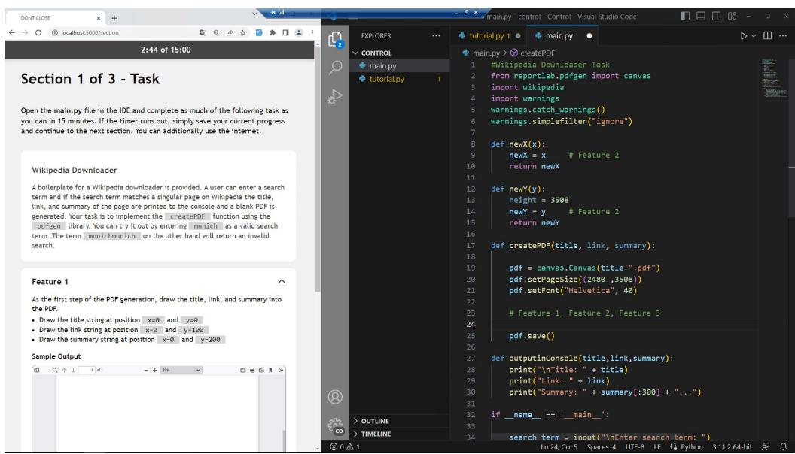
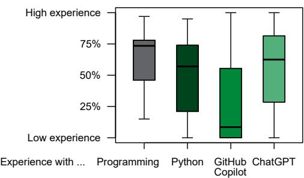
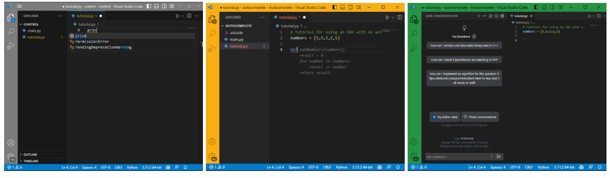
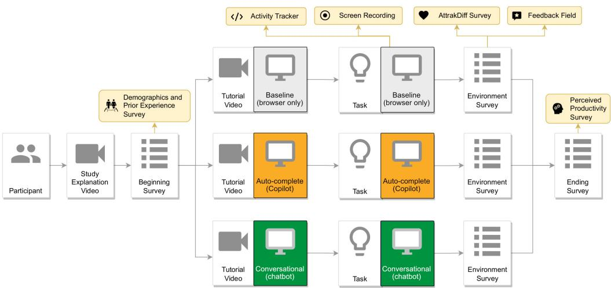
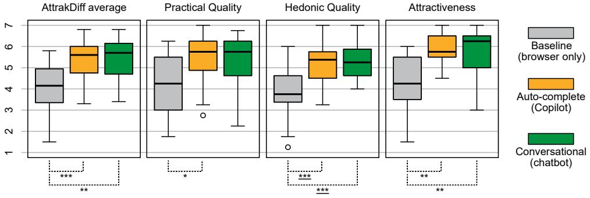
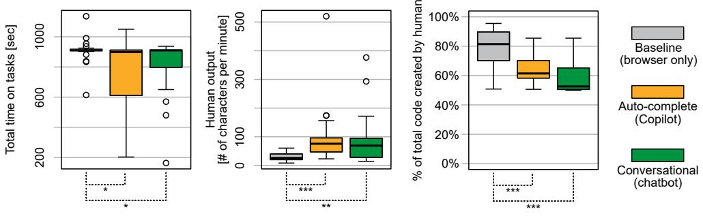
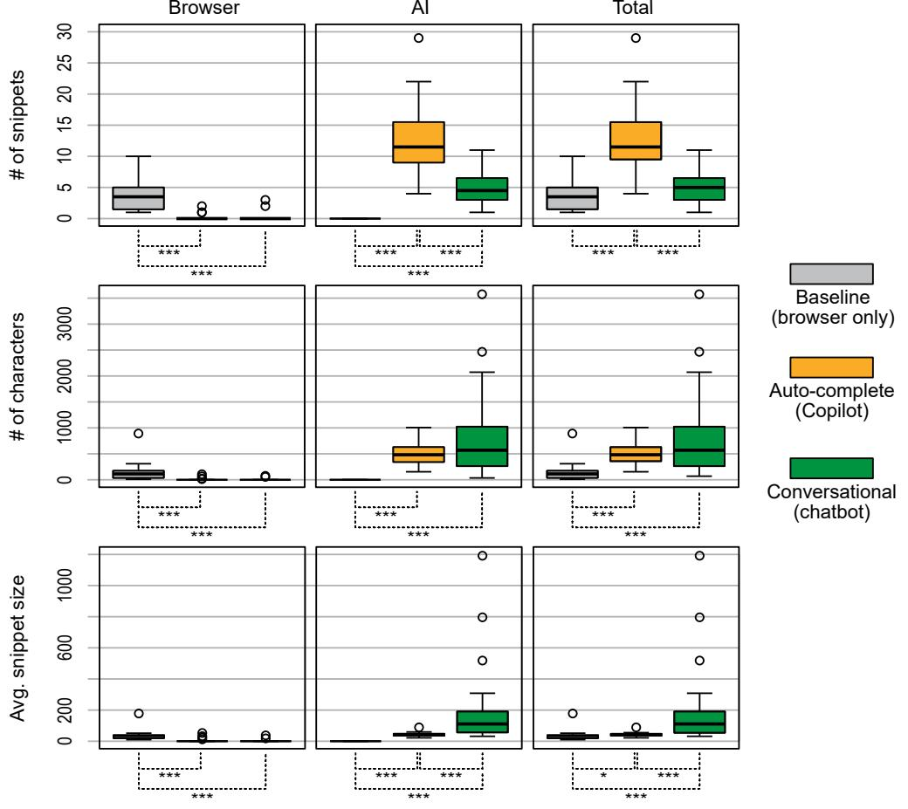
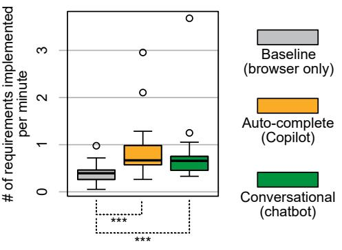
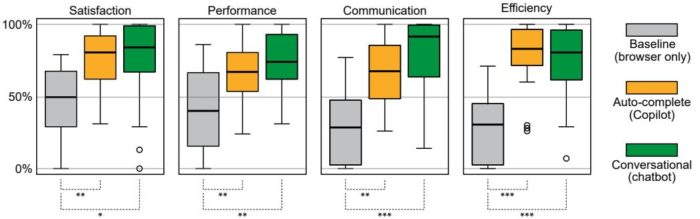

# Significant Productivity Gains through Programming with Large Language Models

[THOMAS WEBER,](HTTPS://ORCID.ORG/0000-0002-6894-605X) LMU Munich, Germany [MAXIMILIAN BRANDMAIER,](HTTPS://ORCID.ORG/0009-0005-4184-7763) LMU Munich, Germany [ALBRECHT SCHMIDT,](HTTPS://ORCID.ORG/0000-0003-3890-1990) LMU Munich, Germany [SVEN MAYER,](HTTPS://ORCID.ORG/0000-0001-5462-8782) LMU Munich, Germany

Large language models like GPT and Codex drastically alter many daily tasks, including programming, where they can rapidly generate code from natural language or informal specifications. Thus, they will change what it means to be a programmer and how programmers act during software development. This work explores how AI assistance for code generation impacts productivity. In our user study (N=24), we asked programmers to complete Python programming tasks supported by a) an auto-complete interface using GitHub Copilot, b) a conversational system using GPT-3, and c) traditionally with just the web browser. Aside from significantly increasing productivity metrics, participants displayed distinctive usage patterns and strategies, highlighting that the form of presentation and interaction affects how users engage with these systems. Our findings emphasize the benefits of AI-assisted coding and highlight the different design challenges for these systems.

CCS Concepts: • Human-centered computing → Interaction paradigms; User studies; • Software and its engineering; • Computing methodologies → Artificial intelligence;

Additional Key Words and Phrases: software development, programming, language models, gpt, github copilot, user study

# ACM Reference Format:

Thomas Weber, Maximilian Brandmaier, Albrecht Schmidt, and Sven Mayer. 2024. Significant Productivity Gains through Programming with Large Language Models. Proc. ACM Hum.-Comput. Interact. 8, EICS, Article 256 (June 2024), [29](#page-28-0) pages. <https://doi.org/10.1145/3661145>

# 1 INTRODUCTION

Modern Machine Learning (ML) systems like Large Language Models (LLMs) promise to support humans across many fields. They can process large volumes of information and consolidate it into a more usable format. Popular applications for a general audience are conversational systems where users can query the system using natural language prompts and receive meaningful responses. There are more specialized applications as well, e.g., in professional software development, where these systems can be used to generate code from more informal descriptions. If an adequate natural language prompt can almost instantly generate a complex piece of software, this could greatly boost development productivity. Additionally, LLMs can also process existing code and take over tedious tasks like debugging and bug fixing [\[39,](#page-26-0) [42,](#page-26-1) [54\]](#page-27-0) or generating explanations, documentation, and test cases [\[58,](#page-27-1) [59\]](#page-27-2). However, the effectiveness of AI-supported coding is not yet understood.

Authors' Contact Information: [Thomas Weber,](https://orcid.org/0000-0002-6894-605X) LMU Munich, Munich, Germany, thomas.weber@ifi.lmu.de; [Maximilian](https://orcid.org/0009-0005-4184-7763) [Brandmaier,](https://orcid.org/0009-0005-4184-7763) LMU Munich, Munich, Germany, m.brandmaier@campus.lmu.de; [Albrecht Schmidt,](https://orcid.org/0000-0003-3890-1990) LMU Munich, Munich, Germany, albrecht.schmidt@ifi.lmu.de; [Sven Mayer,](https://orcid.org/0000-0001-5462-8782) LMU Munich, Munich, Germany, sven.mayer@ifi.lmu.de.

[This work is licensed under a Creative Commons Attribution International 4.0 License.](https://creativecommons.org/licenses/by/4.0/) © 2024 Copyright held by the owner/author(s). ACM 2573-0142/2024/6-ART256 <https://doi.org/10.1145/3661145>

Recent advances in AI, particularly with LLMs, have greatly boosted what is possible in terms of code generation. While it is possible with more general LLMs like the family of GPT models [\[6\]](#page-24-0), there are dedicated models specifically tailored for this use case [\[6,](#page-24-0) [9–](#page-24-1)[11,](#page-25-0) [15,](#page-25-1) [29\]](#page-26-2). Developers can access these models through a wide variety of modalities, from a conversational format like ChatGPT [\[45,](#page-26-3) [51\]](#page-27-3), integrated into their familiar coding environment like GitHub's Copilot [\[4,](#page-24-2) [25,](#page-25-2) [33,](#page-26-4) [70\]](#page-28-1) or even with new tools, built around these models, like the Cursor Code Editor[1](#page-1-0) . These different tools use a variety of different interaction patterns for accessing LLMs, ranging from an auto-complete approach, as is already common in development tools, to a conversational style, as found in modern chatbot systems. GitHub Copilot recently also extended its functionality to offer both variants for the same underlying models [\[69\]](#page-28-2). While the underlying model may be the same, the different forms of interactions play an important role from the human perspective and can have wide-ranging effects, from how efficiently these tools can be used to what code is generated in actuality. For example, the type of interaction affects how prompts may be written, which impacts which information is provided to the LLM and, thus, what the responses look like. Thus, the presentation and interaction are essential components to ensure that developers can use the LLMs productively in their work [\[4,](#page-24-2) [25,](#page-25-2) [70\]](#page-28-1). However, in a field that is evolving as this, the development of new tools is often driven through a technology-focused perspective, while the human perspective lacks systematic analysis and is instead frequently supported more by anecdotal evidence.

To advance our understanding of how interaction design affects productivity in this domain, we compare two AI-supported approaches to traditional coding supported by searching the internet using a web browser (Baseline). In detail, we compare an AI-supported auto-complete interface using GitHub Copilot (Auto-complete) and a conversational system using GPT-3 (Conversational) against a baseline with only conventional support mechanisms. In a within-subjects study (N=24 ), we determined how the support mechanisms affect developer productivity and satisfaction, and how much they rely on these support mechanisms in different scenarios. To assess their impact, we asked participants to complete three Python programming tasks, with AI support and without.

Our within-subject study with 24 participants demonstrates the benefit of using AI assistants and how they can benefit the different aspects of productivity. With participants in our study showing distinctive usage patterns, it furthermore showcases how AI is integrated and which form of interaction it allows, which can greatly affect how it is used. This demonstrates that the success of AI-support mechanisms does not just rely on the underlying technical implementation but is greatly affected by interface and interaction design. Thus, our contribution is twofold: (1) we offer insights into how AI coding assistants in their current state of development affect software developers and their productivity, and (2) we do this using a more holistic perspective on this area, taking into account a diverse set of factors that contribute to overall productivity. We hope that this broader perspective will be adopted in future investigations in this highly dynamic research field, thus allowing us to gain a better, more rounded understanding of how the continuing development of AI assistants has affected and will affect humans.

#### 2 RELATED WORK

By now, software development tools have evolved far beyond just being input-output programs. One quite ubiquitous feature in many modern editors is simple code completion [\[34\]](#page-26-5), which suggests what code the developer might type next. Over the years, researchers and industry have explored different mechanisms how these suggestions and code completions can be generated, from semantic analysis of the source code [\[3,](#page-24-3) [22,](#page-25-3) [28,](#page-26-6) [48,](#page-27-4) [49\]](#page-27-5) to machine learning approaches [\[43,](#page-26-7) [57\]](#page-27-6)

1<https://www.cursor.so>

and different combinations [\[7,](#page-24-4) [47\]](#page-27-7). While these systems can play an important role in productive development [\[28\]](#page-26-6), there is still limited research regarding their impact on developer behavior [\[26\]](#page-26-8).

Recent advancements in the area of Large Language Models (LLMs) have furthermore enabled new means not just to support developers with suggestions, but to generate larger pieces of software from simple, natural language prompts. This will likely impact and change how developers use code completion. Thus, our work explores how these modern AI tools affect developer behavior, specifically productivity. To this end, we will first briefly outline some of the work on AI code generation and how it produced modern coding assistants. We will then summarize different aspects of developer productivity and highlight literature that explores how these AI support mechanisms affect them.

### 2.1 AI-Assisted Programming

Automated code completion is a technology that has been used in one way or another for many years. While single statement auto-complete with syntactically valid expressions is likely the most common way, e.g., Microsoft's IntelliSense, there are other forms as well, which can generate larger code snippets. Frequently, these relied on a clear specification in a format like state machines [\[13\]](#page-25-4).

Recent developments in Machine Learning and Natural Language Processing have led to a type of code generation tool that allows more flexibility and the use of natural language to describe the software's behavior. These systems rely on the Transformer architecture [\[61\]](#page-27-8) and resulting Large Language Models like Generative Pre-Trained (GPT) Transformers [\[6\]](#page-24-0) or Bidirectional Encoder Representations from Transformers (BERT) systems [\[12\]](#page-25-5). These systems are pre-trained with a large volume of data, which may include natural language text, code, etc., which shapes for which tasks these systems can be used [\[53\]](#page-27-9). The pre-trained system can then be fine-tuned for specific tasks [\[23,](#page-25-6) [46,](#page-26-9) [53\]](#page-27-9). By prompting a pre-trained system with specific requests, a user can then use such a system to generate desirable outputs, e.g., in our use case, pieces of source code. These systems are already capable of producing code, often at least on par with what human developers can create [\[32\]](#page-26-10).

In the last years, a number of these systems have become widely available, e.g., GPT-3 [\[6\]](#page-24-0), GPT-4, etc. and their popular chat-based interface ChatGPT[2](#page-2-0) , Codex [\[9\]](#page-24-1), a GPT-3 based system specializing in source code, which GitHub Copilot also uses, and many more [\[10,](#page-25-7) [11,](#page-25-0) [15,](#page-25-1) [29\]](#page-26-2). These examples also demonstrate that different interaction paradigms are viable with these systems: ChatGPT uses an interface where users prompt input to the system, and its output is presented as a chat. Using the Codex system, GitHub Copilot can directly integrate into coding editors like Visual Studio Code or IDEs [\[67\]](#page-27-10). While these types of presentations have a negligible impact on the system's behavior and output, the user interface may affect how accessible it is to the user and how it is used. This can have downstream effects, which still affect the software that is created with them.

We have found several evaluation efforts to assess the quality of the generated software (e.g. [\[2,](#page-24-5) [9,](#page-24-1) [30,](#page-26-11) [68\]](#page-28-3)). Many of those, however, focus on purely technical quality, typically how much of the code a model generates satisfies the requirements. While software development remains an exercise that involves humans, as developers, end users, etc., these metrics alone will not suffice. Instead, we must also consider human factors, e.g., how productively a software developer can work with these tools [\[21\]](#page-25-8). This is echoed by Bird et al. [\[5\]](#page-24-6). They highlight how rapidly the underlying models can change but emphasize that the activities of humans also change and require continued evaluation as this field evolves. Their findings are based on an earlier version of GitHub Copilot. Using different methods, they found improvements in perceived productivity and efficiency with early adopters and first-time users.

2<https://openai.com/chatgpt>

# 2.2 Quantifying Productivity

Quantifying how productive programmers are during software development is useful not just for research but also, for example, for project management or to collaborate efficiently. Naturally, there is a wide body of research on different metrics and aspects that help to gauge developer productivity.

A fairly simple but common way is to use the Lines of Code (LoC), which a developer creates, deletes, or modifies, as a proxy for productivity [\[41\]](#page-26-12). As Petersen [\[41\]](#page-26-12) point out, though, this metric requires some context to be useful since LoC can widely vary due to other factors, e.g., programming language and programming style. Therefore, it is essential to very clearly define what counts as an LoC and the inferred productivity. Petersen [\[41\]](#page-26-12) and Hernández-López et al. [\[20\]](#page-25-9) describe a second approach using Function Points. Function Points quantify the functionality a piece of software delivers and consider the complexity of inputs, outputs, internal files, and external interfaces. While they consider more context than LoC, it becomes more challenging to accurately and consistently assign Function Points [\[41\]](#page-26-12).

Recently, Oliveira et al. [\[36\]](#page-26-13) reviewed the use of additional metrics. These included Lines of Code by Time, which puts the absolute number of LoC into context, the Halstead Effort by Time, which assesses the complexity of the code the developer works with, and the Code Owned by Time, which signifies how much a developer contributed to a project's code base. In larger software projects that use version control, the commit history becomes an additional source of information. Oliveira et al. [\[36\]](#page-26-13) also analyzed commit based metrics, like Commits by Time, the Committed Lines of Code by Time, and the Committed Characters by Time. Based on their analysis and feedback from team leaders in software development projects, Lines of Code by Time and Code Ownership by Time correlate strongly to the subjective perception of the project team leaders.

The importance of time-relative metrics matches with the findings of a literature review by Hernández-López et al. [\[20\]](#page-25-9) who found that Lines of Code by Time or Functions Points by Time, or Tasks Completed by Time in long term projects, are commonly used metrics. In their review, they also point out that some contextual aspects are still rarely considered. They argue that metrics like "customer satisfaction, worker responsibility, task importance, perceived productivity, and absenteeism should be included in productivity measurement" [\[20\]](#page-25-9).

Beyond these code-centric metrics, Storey et al. [\[56\]](#page-27-11) emphasizes the importance of developer satisfaction, and Meyer et al. [\[31\]](#page-26-14) emphasize the focus on developers' subjective perception. Thus, they conducted a survey with developers on which code metrics they found to be most useful. The feedback indicated that some of the time-based metrics like Number of Work Items (Tasks, Bugs) Closed, Time Spend on Each Work Item Time Spend Writing Code are considered important but also a number of metrics focusing on collaboration like Time Spend Reviewing Code Number of Code Reviews Contributed To, and Time Spent in Meetings.

Forsgren et al. [\[17\]](#page-25-10) combines several perspectives and advocates for a holistic approach to measuring productivity. They propose a framework for productivity measurement using five categories: Satisfaction, Performance, Activity, Communication, and Efficiency. This "SPACE" framework does not dictate specific scales or metrics for each of these categories, though. The goal of the Satisfaction dimension is to include the users' subjective perception, for example, developers. Performance ensures that code quality is included, since just because developers write a lot, they "may not be producing high-quality code" [\[17\]](#page-25-10). Static analysis of the code base is one way to quantify this. Activity is the "count of actions or outputs completed in the course of performing work" [\[17\]](#page-25-10). Depending on the context and the requirements, this can be recorded at different levels of granularity, from individual actions in an interface to commits and also to larger, project-level tasks. Most software projects happen in collaboration, so Communication includes how effectively information

different contributors interact with each other. Lastly, Efficiency puts the development efforts into time context and considers how distractions, interruptions, etc., affect productivity.

#### 2.3 Productivity of AI-Assisted Programming

In the last few years, particularly since LLMs have become easily accessible, the use of AI as a support mechanism in software development projects has increased. Consequently, there are also a number of studies that investigate how AI assistants impact developer productivity.

In the domain of auto-complete systems, Peng et al. [\[40\]](#page-26-15) conducted a between-groups experiment where participants had to create an HTTP server using JavaScript. One of the groups used GitHub Copilot, while the other group had no access to AI support. Using Copilot led to a significant reduction in task completion time by more than half. Participants noted the increase in speed but estimated it to be only about 35%. Furthermore, while the control group took a bit longer, the task success rate was not significantly different. In contrast, Vaithilingam et al. [\[60\]](#page-27-12) found that participants failed to complete tasks more often using Copilot compared to just using IntelliSense, and it did not have a significant impact on task completion time. One reason for this appears to be an overreliance on the AI so that erroneous solutions were accepted without a thorough review, which led to "time-consuming debugging" [\[60\]](#page-27-12). On a larger scale, an analysis of the usage data of 2047 GitHub Copilot users [\[70\]](#page-28-1) showed that the subjective perception of productivity is primarily influenced by the number of accepted suggestions, not necessarily how valuable or lasting they are. The pure acceptance rate, however, is influenced by other factors, such as a user's work context, with suggestions during non-working hours being less likely to be accepted. It appears that in a professional context, users are focusing more on speed, which can lead to the aforementioned quality issues.

In contrast to the above-discussed auto-complete systems, such as GitHub Copilot, we see an additional trend of support, which is rooted in conversational systems. For example, Qureshi [\[45\]](#page-26-3) investigated the use of ChatGPT as a support mechanism in a study with 24 students. They asked them to complete group exercises for an undergraduate computer science course on "Data Structures and Algorithms" [\[45\]](#page-26-3). Half of the students were given access to ChatGPT, while the other half had to solve them without. While the students with AI assistance were able to achieve significantly better scores, there was a shift in tasks, with more time being spent on debugging.

With GitHub now offering both types of systems, GitHub Copilot and GitHub Copilot Chat, they are in a position to provide additional insights from their customer data and evaluations. According to that, they claim a significant increase in speed of about 55% using Copilot in the auto-completion form [\[27\]](#page-26-16). Rodriguez [\[50\]](#page-27-13) provided no information on task completion time but reported that AI assistance led to faster code reviews using the chat variant. Considering broader aspects of productivity, between the two reports, they saw an increase of satisfaction, from 60–70% ˜ using auto-completion [\[27\]](#page-26-16) to 88% using the chat [\[50\]](#page-27-13)

These studies demonstrate that the various activities, aspects, and the perception of productivity are all differently affected by the use of AI assistants. [Table 1](#page-5-0) provides an overview of these and further studies, which study various aspects of productivity in AI-assisted programming. From our findings in the literature, we concluded that most research so far has focused on individual AI assistants. Ross et al. [\[51\]](#page-27-3) emphasize that the different forms of AI assistants will each have different trade-offs for productivity, though. Furthermore, prior work [\[4,](#page-24-2) [25,](#page-25-2) [70\]](#page-28-1) also suggests that comparing the different forms of AI assistants could lead to valuable insights into how productivity is affected.

The state of the literature thus paints a heterogeneous picture of different AI assistants affecting productivity, sometimes more and sometimes less. Given the fast-paced nature of the field, this is unsurprising, since technical advancements and the enthusiasm they can generate will continue Table 1. Overview of previous studies that evaluate the impact of LLM-based programming assistants on developer productivity.

| Author                      | Study                                                                                     | Assistant                                                                                                                           | Productivity Dimensions                                                                                          | Productivity Results                                                                                                                                                                                                                                                                                                                          |
|-----------------------------|-------------------------------------------------------------------------------------------|-------------------------------------------------------------------------------------------------------------------------------------|------------------------------------------------------------------------------------------------------------------|-----------------------------------------------------------------------------------------------------------------------------------------------------------------------------------------------------------------------------------------------------------------------------------------------------------------------------------------------|
| Peng et al. [40]            | Between-subjects study that contrasts no assistant with GitHub Copilot           | GitHub Copilot (autocomplete interface, context-aware)                                                                     | Task Completion Time (Efficiency)                                                                             | The group with access to GitHub Copilot completed the task 55.8% faster. In an additional self-assessment, the developers slightly underestimated the measured effect by suspecting a 35% increase in speed.                                                                                                                      |
| Vaithilingam et al. [60] | Within-subjects study that contrasts IntelliSense and Copilot                    | GitHub Copilot (autocomplete interface, context-aware)                                                                     | Task Completion Time (Efficiency), Interaction Patterns (Communication), Tool Preference (Satisfaction) | No significant effect on task completion time since over-reliance lead to developers not reviewing code and facing debugging rabbit holes later. Developers preferred Copilot over IntelliSense.                                                                                                                                  |
| Qureshi [45]                | Between-subjects study that contrasts printed-out documentation with ChatGPT  | ChatGPT (conversational interface, context-aware)                                                                          | Task Completion Time (Efficiency), Code Correctness (Quality)                                              | The group that utilized ChatGPT as a programming assistant achieved higher scores in less time. ChatGPT requires a deep understanding of the tool's capabilities and Do prompting skills to generate solutions for complex problems. wn                                                                                  |
| Sandoval et al. [52]     | Between-subjects study that contrasts no assistant with GitHub Copilot           | GitHub Copilot (autocomplete interface, context-aware)                                                                     | Functional Correctness (Quality), Absence of Security Bugs (Quality)                                       | loa The incidence rate of severe security bugs de does not increase when developers are d f assisted by GitHub Copilot in the context of rom C programming.                                                                                                                                                              |
| Barke et al. [4]            | Observation of how developers use GitHub Copilot                                    | GitHub Copilot (autocomplete interface, context-aware)                                                                     | Interaction patterns (Communication)                                                                          | th The communication happens either in e A acceleration mode, where developers know CM what to program and prefer small code-based suggestions, or in exploration mode, where D developers conceptualize the solution and igi communicate in natural language more to tal find abstract approaches. Li |
| Jiang et al. [25]           | Observation of how developers use a self-made LLM-based assistant                | Self-made snippet generator generates HTML snippets from comments in code (autocomplete interface, context blind) | Interaction patterns (Communication)                                                                          | bra Participants find the tool useful for facilitating API look-ups and generating ry boilerplate code They use it primarily to on generate small code snippets equivalent to a A single line of code. Prompts were reiterated pri to improve suggestions. l 7 , 2                                        |
| Mozannar et al. [33]     | Observation of how developers use GitHub Copilot                                    | GitHub Copilot (autocomplete interface, context-aware)                                                                     | Interaction patterns (Communication)                                                                          | Copilot-related activities account for more 02 than half of the total time and most time is 5. spent verifying suggestions. Furthermore, the time spent looking at documentation is low.                                                                                                                                       |
| Ziegler et al. [70]      | Comparison of a developer survey to telemetry data gathered by GitHub Copilot | Github Copilot (autocomplete interface, context-aware)                                                                     | Acceptance Rate of Suggestions (Communication)                                                             | The acceptance rate of recommendations is a strong predictor of the perceived productivity and increases in the usual working hours of a single developer.                                                                                                                                                                           |
| Ross et al. [51]            | Observation of how developers use a self-made LLM-based assistant                | Self-made chatbot powered by react-chatbot-kit and Codex (conversational interface, context-aware)                | Interaction Patterns (Communication), Tool Preference (Satisfaction)                                       | The conversational interface facilitates programming discussions, generates relevant code, and promotes the use of follow-up questions. Participants perceived the assistant as beneficial for their productivity. Autocomplete, conversational, and search interfaces offer complementary support.                         |

to affect how these systems are perceived and how effectively users utilize them to increase productivity. Different studies from prior work also had to rely on older versions of coding assistants and underlying models, as they were available at the time. Thus, our work contributes to an updated understanding of these tools. Furthermore, the heterogeneity also stems from the fact that different studies focus on different types of assistance and aspects of productivity. At this point, we contribute

Proc. ACM Hum.-Comput. Interact., Vol. 8, No. EICS, Article 256. Publication date: June 2024.

Fig. 1. Instructions were displayed in the web browser (left) and needed to be completed in Visual Studio Code (right). Visual Studio Code was automatically configured for each study condition to include the correct level of support mechanisms.

insights into the current state of AI-assisted software development from a broader perspective using the SPACE framework. A continued understanding of the human factors will be essential to steer the field in the right direction. Still, empirical findings will always present only a snapshot of the current time, and any technical improvements of these systems in the future will require continued efforts to make them useful and valuable to their users.

# 3 METHODS

To investigate the effect of different forms of AI assistants, we conducted a within-subject user study to compare different variants of LLM-supported programming. In total, we compare three levels of SupportMechanisms: a Baseline without AI support, Auto-complete using Github Copilot[3](#page-6-0) , and Conversational support using chatbot-like interactions with GPT-3[4](#page-6-1) . We used VSC extensions to enable direct support, see [Figure 1.](#page-6-2) In each condition, we allowed participants to use the browser to search for additional information online, as this is common practice and makes for a more realistic scenario.

# 3.1 Participants

To determine the proper benefits of AI assistants for programming, we recruited participants with programming expertise. During recruiting, we aimed for a diverse set of participants to keep the ecological validity high. For this reason, we recruited through a variety of channels, including social media, mailing lists of three institutions working in the area of computer science and software engineering, and by directly contacting industry professionals from these fields. The call for participants contained information about the purpose of the study and that only basic

3<https://marketplace.visualstudio.com/items?itemName=GitHub.copilot>

4via <https://marketplace.visualstudio.com/items?itemName=genieai.chatgpt-vscode>

Fig. 2. When rating their experience on a 100-point scale, participants showed a wide range of experience in general programming and using AI assistants.

knowledge is sufficient to participate in the study, further ensuring that we recruit a diverse sample and not only experts.

We only required participants who have basic knowledge of the Python programming language to participate in the study. General knowledge of the syntax was sufficient, though. We selected the Python language not only because it is one of the most popular, general-purpose programming language[5](#page-7-0) . Additionally, it is frequently used in introductory programming lectures or for occasional scripting. Due to this, many programmers of any skill level are generally familiar with the language, even if they do not use it daily or in large software projects. While the invitation for the study mentioned the use of AI for programming, knowledge or experience with any of the AI assistants used in the study was explicitly not required.

From this, we got 29 people who participated in our study. We had to exclude five participants as they either did not complete any of the programming tasks or violated the constraints of the study. For these cases, we note that they used ChatGPT in the browser in our baseline condition, hinting that they believe ChatGPT can enhance their skills. Of the remaining 24 participants, four identified as female, while the remainder identified as male, with an average age of 26.8 years (SD: 3.6). Regarding their education, five participants had a completed Master's degree, 16 completed a Bachelor's program, and three were currently pursuing their first university degree. Nine participants answered that they were currently involved with software development in a professional capacity. The other participants had coding experience through their study program and personal projects. Thus, we gathered a cross-section of potential users for programming assistants.

Consequently, according to their self-assessment in the survey, participants also covered a wide spectrum of prior knowledge, as displayed in [Figure 2.](#page-7-1) This is especially the case for the AI assistant tools, where the group covered the whole spectrum for LLMs as chatbots, like ChatGPT, and in GitHub Copilot.

# 3.2 Apparatus

We conducted this study online. By pre-installing and running the software on an online virtual machine (VM), we had a common environment with consistent starting conditions for all participants. The VM was provisioned with ten vCores and 18 GB of RAM to ensure smooth interactions. Participants accessed this setup from their own computers, which opened the study to more than just people in the vicinity. We asked them to use a 1080p monitor and, before the study, verified that

5<https://www.tiobe.com/tiobe-index/>

(a) Baseline without AI assistant (b) Auto-complete interface (c) Conversational interface

Fig. 3. The interfaces for the three different study conditions. The correct extensions, files, and context for Visual Studio Code were automatically loaded for each.

the interaction via remote desktop worked. We ran the Windows operating system on the machine with Visual Studio Code (VSC) and the Chrome web browser pre-installed. Upon connecting via a remote desktop connection, we displayed instructions using the web browser. While participants followed these instructions, a background script automatically opened a Visual Studio Code instance whenever participants had to use it side-by-side with the instructions, see [Figure 1.](#page-6-2) These VSC instances were configured in such a way that only the necessary files for each task were accessible, and only those extensions were available, which facilitated the type of AI assistance for each study condition (see [Figure 3\)](#page-8-0).

In the Baseline (browser only) without AI assistant, we presented users with a pure VSC without extensions (see [Figure 3a\)](#page-8-0) and the browser (Google Chrome) to the side. Thus, the baseline replicates a standard setup where users use the World Wide Web to understand the context and potential error messages. This allowed, for instance, looking up information on Stack Overflow, a typical development behavior [\[1,](#page-24-7) [65\]](#page-27-15).

The Auto-complete (Copilot) condition uses the GitHub Copilot extension for the auto-completion suggestions of code snippets as the user types in place, i.e., directly behind the cursor (see [Figure 3b\)](#page-8-0). Users can then choose to accept the suggestion, which is inserted into the editor. Alternatively, users simply continue typing their code when they reject the suggestion.

The Conversational (chatbot)) condition uses a chat panel integrated into VSC (see [Figure 3c\)](#page-8-0). However, it has some additional contextual interactions, e.g., users can select code and directly send it to the chat for further inquiry. Likewise, code generated in the chat interface can be inserted with the click of a button. Working with GPT3 models under the hood, both systems are subject to the limitations of these models, particularly regarding how much contextual token can be considered for newly generated output.

The surveys between the test conditions were displayed in the browser between task descriptions. Aside from the answers to the survey questions, additional interaction data was recorded automatically, and we screen-recorded the whole study. Additionally, to catch any errors and facilitate observations, we supervised each study participant via screen sharing but kept interaction with the participants to a minimum.

#### 3.3 Procedure

Upon connecting to the remote machine, participants saw an introductory video that explained the study procedure and its goal. This was followed by a short survey, which included the consent form, demographic information questions, and prior knowledge about programming questions.

Fig. 4. Following an introductory survey, each participant performed three tasks and provided feedback. These tasks were permuted by the Latin Square method. Afterward, the study was completed with a final survey about overall impressions.

Additionally, we used this step to explain the study setup generally. After this, participants worked through our three SupportMechanisms (Baseline, Auto-complete, and Conversational), each with a different programming task. Each task was preceded by a video explanation of the tasks and the tools used in the respective conditions. The sequence and combination of task and ToolEnvironment were systematically varied using the Latin Square method to reduce effects of order or by specific tasks.

For each programming task, participants first watched a short video tutorial and could code along with this tutorial. These videos briefly explained the tool's functionality, which participants would use, and allowed them to get familiar with it. For this phase, we did not set a time limit so that participants could complete it at their own pace. After this, we showed the actual task, for which participants then had 15 minutes to complete it. After these 15 minutes, participants filled out a survey for this specific study condition.

Upon completing all three conditions, we asked participants to complete a final survey about their overall impression of the different tools used in the study. For their participation, they were compensated with an equivalent of 10 US\$ per hour.

# 3.4 Tasks

To assess these three levels of support, we selected three tasks considering literature in this domain [\[4,](#page-24-2) [32,](#page-26-10) [33,](#page-26-4) [55,](#page-27-16) [60,](#page-27-12) [66\]](#page-27-17) and popular software projects (e.g. [\[44,](#page-26-17) [62\]](#page-27-18)):

- Task A Text Analysis: For the text analysis task, participants had to perform text analysis of a scraped website, extracting the number of words, unique words, and average word length. We then asked them to produce a list of stopwords and filter the website's content, after which they should calculate a word count to determine the most used words in the text.
- Task B CSV Transformation: The CSV transformation task requires participants to read and write a CSV file. The goal was to process and transform car production data from Wikipedia in multiple steps, and calculate new information from this data.

Task C PDF Editing: In the final task, participants were asked to generate a PDF from a template and add text to it, which required some calculations for proper text formatting and placement.

We iterated the type of task, their subtasks, and their wording during a pilot study phase with three users of different skill levels until they considered them to be similarly complex and to require roughly the same amount of time to complete. The pre-test also showed that it would be possible to complete the tasks entirely by providing the requirements to an AI assistant. For this reason, we split the instructions into smaller sub-tasks of roughly equal size, some of which would build upon earlier ones. Since this enforced some sequence, it also ensured that participants would not pick only requirements that they considered easy to implement, thus skewing the number of features they could implement in the time frame. Furthermore, we provided an initial code snippet, which participants were required to use and extend. While it would still be possible to complete these tasks with AI assistance with few prompts, this setup encouraged participants to engage more with the code and the instructions.

The relatively guided nature of the tutorial, of course, meant that the degree of freedom and creativity to solve the tasks was reduced. Typically, a key part of programming is to decide how to decompose a larger problem into smaller sub-tasks. While the study design reduced this aspect, using equivalent tutorials in all study conditions meant that it was equally reduced. Thus, we consider the comparison between the study conditions to be valid.

While we constructed these tasks to be similar, they are not identical, and different solutions to them may require different amounts of code and time. Thus, we permuted the combination of tool and task using the Latin Square method for a balanced combination and order of SupportMechanisms and tasks across all participants.

# 3.5 Recorded Data

To assess developer productivity, we use the five dimensions of the SPACE framework [\[17\]](#page-25-10). For each of its dimensions, we collected both data from the interactions directly and subjective feedback through the surveys.

3.5.1 Satisfaction. Participants completed the short AttrakDiff [\[16,](#page-25-11) [18,](#page-25-12) [19\]](#page-25-13) after each test condition to quantify satisfaction. This survey contains ten questions resulting in measures forpragmatic quality, hedonic quality, and attractiveness, which are closely related to user satisfaction [\[18\]](#page-25-12). In addition, participants provided additional feedback about their perceived satisfaction across all three environments at the end using a survey with agree-disagree Likert scales as suggested by Forsgren et al. [\[17\]](#page-25-10).

3.5.2 Performance. Hernández-López et al. [\[20\]](#page-25-9) call for the inclusion of quality metrics into a holistic assessment of productivity, particularly including metrics for output quality. For this reason, we include the correctness of the code that participants created during the task, which corresponds to the number of work items (bugs, tasks) closed [\[31\]](#page-26-14) and the absence of bugs [\[17\]](#page-25-10). Specifically, we test whether each implemented feature performs as expected using pre-defined unit tests. From this, we calculate the percentage of correctly implemented features out of all implemented features. Furthermore, we include the Maintainability Index [\[37,](#page-26-18) [38\]](#page-26-19) as a metric, which combines multiple static code metrics, like Cyclomatic Complexity and Halstead Volume [\[37,](#page-26-18) [63\]](#page-27-19). Similar to the previous dimension, participants also provided an additional self-assessment of how they rate the quality of the code they produced after completing all tasks.

3.5.3 Activity. Developer activity typically is a measure of working hours, produced code, or number of commits. Given the constrained nature of a user study, these metrics are not feasible. Instead, we looked at actions at a finer granularity, namely the number of individual inputs, e.g., typed characters. While breaking down complex interaction patterns into individual interactions is a well-established pattern [\[8\]](#page-24-8), prior work (e.g., Forsgren et al. [\[17\]](#page-25-10) typically considers a higher number of interactions as indicative of high activity. Since any number of arbitrary interactions can occur independent of the study tasks, we only consider those interactions that contribute to the resulting code, i.e., typing, copying and pasting, and restructuring. Ultimately, this is similar to the common Lines of Code metric [\[17,](#page-25-10) [41\]](#page-26-12), albeit at an even finer granularity.

In our study, the total time was constrained, though, with some participants taking the full 15 minutes or slightly more while others did not need the full time. Thus, we normalized the number of characters by time.

Since code can also be automatically generated in our study, we make sure to differentiate from where the input is coming from, i.e., whether it was a genuine interaction by the user or generated by a support mechanism. We therefore consider the percentage of code that was written by the human, as opposed to generated by the AI tool, an additional metric for the Activity category.

3.5.4 Communication. Software development typically happens in teams, so effective communication with collaborators is essential. While participants completed the study alone, they did, in parts, collaborate with their AI support mechanisms. Thus, we focus on how developers retrieve information from their support mechanisms, i.e., the AI-powered chatbot, the auto-completion of GitHub Copilot, but also how they utilize the browser to access information. First, we record how frequently participants accept code recommendations, i.e., how frequently participants decided to use a code snippet from an outside source, e.g., the browser or any of the AI assistants. Since the browser was also available in the study conditions with AI assistant, we differentiated the source and normalized the number of code snippets over the time required to complete the tasks. An accepted code snippet, in this case, is any piece of code that ends up as part of the code base, either by copying and pasting, typing it out manually, or using auto-completion. Not all code snippets are equal, so we also record the overall length in characters of any such accepted code snippet. For this, as before, we only consider executable code, though, i.e., we exclude comments, as these have different degrees of verbosity in different environments. We count the length of the code snippet at the time of acceptance. From these two values, we can then also calculate the average size of accepted code snippets. The subjective assessment after the three tasks furthermore asks for subjective perception of how easy it was to retrieve code snippets.

3.5.5 Efficiency. Finally, efficiency describes the amount of work a developer can perform in a given time. Since the time for our study was fixed, we recorded how many of the features and requirements each participant was able to implement in this timeframe. With multiple smaller tasks, this also helps alleviate the limitation described by Vaithilingam et al. [\[60\]](#page-27-12), that participants may not be able to complete their task fully. While we set the subtasks in a way that, under normal circumstances, participants should not run out of them in the allotted 15 minutes, we normalized the results by total task completion time, thus preventing skewed results from very quick participants. Efficiency was also part of the self-assessment at the end of the survey.

3.5.6 Additional Data. Besides the feedback for each category after each task and once more at the end, our survey also recorded additional, more general feedback. This includes positive and negative comments for each study condition and a subjective assessment of how well participants felt supported by the different tools and how they felt these tools affected their work.

# 4 RESULTS

In the following, we report the recorded information from the participants. We first cover the categories of the SPACE framework for productivity, followed by additional feedback, including

Fig. 5. The AttrakDiff questionnaire shows some significant differences across its categories, with a consistent picture of both AI assistants similarly outperforming the baseline. (\*: < 0.05, \*\*: < 0.01, \*\*: < 0.001, pairwise Wilcoxon test/t-test, Bonferroni adjusted).

the qualitative responses by the participants. The underlying anonymized data is available as part of the supplementary material.

For each task, participants created code ranging from 45 to 135 LOC. To complete the CSV task, participants required significantly more code (mean: 95 LOC) than the PDF (mean: 67 LOC, < 0.001, pairwise Wilcoxon test, Bonferroni adjusted) and Text task (mean: 72 LOC, = 0.002). While we accounted for these differences between the tasks by permuting task and tool combinations and their order, we additionally checked the resulting data for effects. In it, we could not determine any notable differences where the task had a significant effect on the performance metrics.

As mentioned before, since we split the tasks into smaller sub-tasks, participants could, in theory, have skipped through each task and generated a complete solution at the end with the full set of instructions. However, we did not observe any such behavior in the screen recordings or the size and timings of the accepted code snippets.

When reporting statistical testing in the following, we always picked the appropriate test given the normality of the data test using the Shapiro–Wilk test. Based on that, we run Friedman tests with Wilcoxon signed-rank test as post hoc tests or repeated measures ANOVAs with t-test as post hoc tests using R. Moreover, we adjusted the p-values of the post hoc test using Bonferroni correction. We performed all statistical tests using R.

### 4.1 Satisfaction

User satisfaction, as recorded via the AttrakDiff questionnaire, varied most notably between the baseline and the auto-complete condition, where we found significant differences in all three sub-categories (Pragmatic Quality ( = 0.027, Wilcoxon test), Hedonic Quality ( < 0.001, paired t-test), and Attractiveness ( = 0.001, Wilcoxon test)). The conversational test condition showed similar significant differences for Hedonic Quality ( < 0.001, paired t-test) and Attractiveness ( = 0.003, Wilcoxon test), but none for practical quality. We could not determine any significant differences between the two AI assistants, with their responses being distributed quite similarly, as shown in [Figure 5.](#page-12-0)

#### 4.2 Performance

To assess the participants' performance, we analyzed the code they produced and determined its quality. The majority (control: 14, auto-complete: 12, conversational: 13) of participants managed to implement the requirements so that each fulfilled our testing criteria. Based on this, we could not

|                   | via                                                  | Shapiro-Wilk Test |            | Friedman Test / ANOVA |              |            |                         |
|-------------------|------------------------------------------------------|-------------------|------------|-----------------------|--------------|------------|-------------------------|
| SPACE Category |                                                      | W                 | p          | 𝜒 2 / F         | df p      |            | Kendall's W / 𝜂 2 |
| Satisfaction      | AttrakDiff (Avg.)                                    | 0.953             | 0.009      | 21.447                | 2 < 0.001 | ***        | 0.447                   |
|                   | Pragmatic Quality                                    | 0.917             | < 0.001 | 7.467                 | 2            | 0.024 * | 0.156                   |
|                   | Hedonic Quality                                      | 0.979             | 0.259      | 19.764                | 2 < 0.001 | ***        | 0.349                   |
|                   | Attractiveness                                       | 0.925             | < 0.001 | 18.782                | 2 < 0.001 | ***        | 0.391                   |
| Performance       | % of correctly imple mented requirements | 0.724             | < 0.001 | 0.636                 | 2            | 0.728      | 0.013                   |
|                   | Maintainability Index                                | 0.950             | 0.007      | 0.065                 | 2            | 0.967      |                         |
|                   | Percentage of comments                               | 0.925             | < 0.001 | 8.583                 | 2            | 0.014 * | 0.179                   |
|                   | Character output per                           | 0.627             | < 0.001 | 23.083                | 2 < 0.001 | ***        | 0.481                   |
| Activity          | minute % of code created by hu man             | 0.931             | < 0.001 | 27.750                | 2 < 0.001 | ***        | 0.578                   |
|                   | # of Snippets (Browser)                              | 0.690             | < 0.001 | 41.325                | 2 < 0.001 | ***        | 0.861                   |
|                   | # of Characters (Browser)                            | 0.470             | < 0.001 | 41.325                | 2 < 0.001 | ***        | 0.861                   |
| Communication     | Avg. Snippet Size (Browser)                 | 0.576             | < 0.001 | 41.325                | 2 < 0.001 | ***        | 0.861                   |
|                   | # of Snippets (AI)                                   | 0.854             | < 0.001 | 42.750                | 2 < 0.001 | ***        | 0.891                   |
|                   | # of Characters (AI)                                 | 0.700             | < 0.001 | 36.333                | 2 < 0.001 | ***        | 0.757                   |
|                   | Avg. Snippet Size (AI)                               | 0.450             | < 0.001 | 42.750                | 2 < 0.001 | ***        | 0.891                   |
|                   | # of Snippets (Total)                                | 0.874             | < 0.001 | 31.043                | 2 < 0.001 | ***        | 0.647                   |
|                   | # of Characters (Total)                              | 0.695             | < 0.001 | 27.583                | 2 < 0.001 | ***        | 0.575                   |
|                   | Avg. Snippet Size (Total)                            | 0.418             | < 0.001 | 25.083                | 2 < 0.001 | ***        | 0.523                   |
| Efficiency        | # of requirements imple mented per minute         | 0.714             | < 0.001 | 6.583                 | 2            | 0.037 * | 0.137                   |

|  |  | Table 2. After using each environment and support mechanism, participants rated them with respect to |  |  |  |
|--|--|------------------------------------------------------------------------------------------------------|--|--|--|
|  |  | different productivity metrics using quasi-continuous Likert scales.                                 |  |  |  |

determine any significant differences between the three groups. Likewise, the Maintainability Index for the code from all three groups was consistent in the interval from 61 to 86, with each having a median of 73±1. In fact, a pairwise Kolmogorov Smirnov test (see [Table 3\)](#page-14-0) further supports the assumption that the Maintainability Index for all three groups follows the same distribution.

Within the code structure of the task results, there are some minor differences, though: using the auto-complete mechanism of GitHub Copilot, participants submitted code that contained significantly more comments than the code from the control condition. Code from the conversational condition contained more comments on average, as well, but this difference was not significant.

# 4.3 Activity

While we set the time limit per task to 15 minutes, some participants took less time, while others exceeded it. Yet, we did not abruptly stop participants who required more time, but let them complete their current activity. This results in a distribution of task completion time as seen in [Figure 7](#page-15-0) with the AI assistants displaying significantly different task completion times than the control condition (auto-complete: = 0.028, conversational: = 0.025, pairwise Wilcoxon test,

Fig. 6. With or without AI support, there are no significant differences in the quality of the produced code. However, using the auto-complete AI tool yielded code with significantly more comments. (\*: < 0.05, pairwise Wilcoxon test, Bonferroni adjusted)

Bonferroni adjusted). Given these differences, we normalized any time-based metric to take into account the time each participant required for the tasks.

Based on this, we determined a significant increase in how many characters each of the participants typed out per minute in the two AI assistant conditions, compared to the control condition (auto-complete: < 0.001, conversational: = 0.002, pairwise Wilcoxon test, Bonferroni adjusted).

While this only considers the characters a user has entered, we also saw an overall increase in code volume for the AI assistants, which matches the fact that even though the character count increased, the percentage of the code originating with the user decreased in the AI-assisted conditions (auto-complete: < 0.001, conversational: < 0.001, pairwise Wilcoxon test, Bonferroni adjusted). Note, though, that the source of the external code differs, as highlighted in the following section.

# 4.4 Communication

As previously mentioned, communication in our study setup happens exclusively between humans and available support mechanisms. These support mechanisms can either be the two AI assistants, which were available only in their respective study conditions, or the browser, which was available in any of the three conditions. Participants did use the browser in all three conditions. Still, when the AI assistants were available, this was done only by a minority (four participants in the auto-complete condition, and two participants in the conversational condition). Thus, we observe a significant difference between the control condition and the AI assistants for the number of code snippets from the browser, the total volume of code, and the average size of each snippet ( =< 0.001 for each, pairwise Wilcoxon test, Bonferroni adjusted), but no difference between the two AI assisted conditions.

We see a different pattern when investigating AI as the source of code snippets. While, naturally, the control condition cannot provide code from an AI, we still observe that participants accept

Table 3. Results of a pairwise Kolmogorov Smirnov test suggest that the Maintainability Index of the code in all test conditions follows the same distribution.

| D              | Control | Auto-complete | p              | Control | Auto-complete |
|----------------|---------|---------------|----------------|---------|---------------|
| Auto-complete  | 0.208   | —             | Auto-complete  | 0.679   | —             |
| Conversational | 0.167   | 0.125         | Conversational | 0.898   | 0.994         |

Proc. ACM Hum.-Comput. Interact., Vol. 8, No. EICS, Article 256. Publication date: June 2024.

256:16 Weber et al.

Fig. 7. Using AI support, participants produced significantly more code, even though the AI contributed an increasing percentage to it. (\*: < 0.05, \*\*: < 0.01, \*\*: < 0.001, pairwise Wilcoxon test, Bonferroni adjusted)

significantly more code snippets in the auto-complete condition (mean: 12.6, median: 11.5) compared to the conversational (mean: 5.0, median: 4.5; < 0.001, Wilcoxon test, Bonferroni adjusted). While the total number of characters created by the two AI assistants does not significantly differ (autocomplete mean: 514.0, median: 482.0; conversational mean: 818.4, median: 596.5), it still results in a significant difference for the average size of individual code fragments (auto-complete mean: 42.9, median: 41.8; conversational mean: 205.4, median: 110.9; =< 0.001, Wilcoxon test, Bonferroni adjusted).

Taking those two sources of code together, we see that the number of code snippets from an external source differs between the control condition and when using the auto-complete support ( =< 0.0001, Wilcoxon test, Bonferroni adjusted) and between the two AI assisted conditions ( =< 0.001, Wilcoxon test, Bonferroni adjusted), but not between the control condition and the conversational AI assistant ( = 0.083, Wilcoxon test, Bonferroni adjusted). Overall, the use of AI does result in more code being produced, which matches the previous finding that the volume of code increases, but the percentage created by the user decreases.

Finally, the average size of accepted code snippets from any source differs significantly between all three conditions, with the smallest average snippet size in the control condition (mean: 36.1, median: 31.2), closely followed by the auto-complete condition (mean: 42.4, median: 41.8), and the conversational support tool resulting the largest snippets on average (mean: 204.6, median: 110.9).

# 4.5 Efficiency

Lastly, to assess productivity, we consider how many of the given requirements participants were capable of implementing. Since not all participants used the allotted 15 minutes exactly, we compared the average number of implemented requirements per minute. Here, both AI assistant conditions performed significantly better than the baseline with only the browser. Notable are the outliers, where some of the participants used the AI tools to great effect, implementing up to three times as many requirements per minute as their peers.

While we set the task to take approximately 15 minutes, not all participants took this much time. While the majority spent about this much or slightly longer on the tasks, two participants took less than half the time. P19 completed the task in the auto-complete condition in just shy of four minutes, which can be attributed to the fact that they copied the feature description and let the system generate the majority of the code. Additionally, from what we could tell, they did not thoroughly verify whether the code worked and trusted the AI instead. Unfortunately, they

Fig. 8. Participants communicated with their support mechanisms to a varying degree between the different environments, highlighting how the AI assistants essentially replaced the browser as the source of information. The significant differences additionally show distinctive usage patterns between conversational and autocomplete AI. (\*: < 0.05, \*\*: < 0.01, \*\*: < 0.001, pairwise Wilcoxon test, Bonferroni adjusted). The first column of graphs indicates how frequently the browser was used in the three different study conditions. The second column indicates how frequently AI assistance was used. While the AI was unavailable in the baseline condition, the zero value is left for completion. The third column is the sum of the previous two.

provided no additional feedback about this. The other participant, P24, took even less time, three and a half minutes for the auto-complete condition and less than three minutes with the conversational system. This participant did state they had very high prior knowledge of both AI tools.

# 4.6 Self-Assessment

The responses to the Likert scale questions, where participants rated how they perceived each of the interfaces in some of the SPACE categories, generally match the previous findings: both AI assistants significantly outperform the baseline, while there are no significant differences between how the two AI tools are rated. As seen in [Figure 10,](#page-17-0) there are some outliers, though, with some 256:18 Weber et al.

Fig. 9. The assistance of AI tools allowed participants to complete the implementation of the provided requirements significantly faster. (\*: < 0.05, \*\*: < 0.01, \*\*: < 0.001, pairwise Wilcoxon test, Bonferroni adjusted)

Fig. 10. The subjective assessment paints a consistent picture, with the AI-supported conditions being rated more positively. This highlights the perceived benefits of AI assistants for programming. (\*: < 0.05, \*\*: < 0.01, \*\*\*: < 0.001, pairwise Wilcoxon test, Bonferroni adjusted)

participants being very unsatisfied with the conversational interfaces. Regarding efficiency and speed, both AIs also received a sub-par rating from some participants.

Table 4. Participants provided a self-assessment for multiple productivity metrics in a survey after testing the three test conditions. A Friedman test indicates significant differences between the three conditions.

|               |       | Shapiro-Wilk Test |        |    | Friedman Test |             |  |  |  |
|---------------|-------|-------------------|--------|----|---------------|-------------|--|--|--|
|               | W     | p                 | 𝜒 2 | df | p             | Effect size |  |  |  |
| Satisfaction  | 0.914 | < 0.001           | 21.894 | 2  | < 0.001       | 0.456       |  |  |  |
| Performance   | 0.954 | 0.001             | 18.087 | 2  | < 0.001       | 0.377       |  |  |  |
| Communication | 0.925 | < 0.001           | 18.083 | 2  | < 0.001       | 0.377       |  |  |  |
| Efficiency    | 0.901 | < 0.001           | 25.333 | 2  | < 0.001       | 0.528       |  |  |  |

Proc. ACM Hum.-Comput. Interact., Vol. 8, No. EICS, Article 256. Publication date: June 2024.

### 4.7 Qualitative Feedback

After each study condition and at the end of the survey, participants had an additional opportunity to provide additional, unstructured feedback on the different support tools.

For both AI-supported study conditions, 21 participants highlighted some positive aspects, while only four did so for the baseline with just the browser. In their feedback, they typically emphasized how the AI assistants were beneficial for productivity (auto-complete: 11, conversational: 13) or pointed out how these tools affect their workflow. P6, for example, noted that the auto-completion "(increases their) productivity [sic] since (they) don't have to open Stack Overflow anymore." In the case where participants did not have AI assistance, just three participants noted the familiarity of the interface as a positive aspect.

Five participants also highlighted that using AI support tools positively affects the entry barrier and reduces the effort to get started with a coding task. P4 stated that they "had no clue about the imported modules" but with the help of AI, they were "able to start working on the code immediately [sic]." However, this meant that they "tended to put less effort (into understanding) the code." P11 meanwhile opted to first generate the code and only "read over (it) afterward to understand it." P12 also preferred "to see the whole generated code at once" first using the conversational system. However, this tends "to generate more content than needed." (P12)

P12 also pointed out that in a regular context, they rarely "have the coding tasks layed [sic] out in a way that (they) can just copy (them and thus writing) the input that's needed for the generative tool also takes time."

In addition, participants were also critical of the two AI interfaces, highlighting a number of issues. Using the auto-complete feature to generate code led to some participants (5) struggling to understand the generated code quickly. They also were sometimes unhappy with the interaction, where lines would not be generated as expected (5) or the model generated clearly incorrect code (2). According to the feedback, the conversational system suffered from being a separate interface, which required a context switch from editor to chat (6) and providing too much information (3). The elaborate answers of the chatbot were criticized for being distracting and can "hinder (developers from focusing) on the code itself." (P6) Given the speed at which code was generated, P4 also noted that they "tended to put in less efforts [sic] to understand the code."

Finally, participants also highlighted that the perception of the AI tools might greatly be influenced by individual differences, e.g., "a user (who has) gotten used to using AI tools (for) coding (relying again on) Google searches (can feel) very inefficient" (P21). Meanwhile, using the editor without AI assistance may "(require) a skilled developer who new [sic] Python code (...) inside and out" (P21). P13 also suggested that the more elaborate completion of GitHub Copilot and the longer answers of GPT-3 that may be beneficial for novices. P29 meanwhile summarized that their experience "depends on what (they) expect from the (tool)" and that without AI experience, they would "not expect (their editor) to solve (...) coding tasks for (them)."

However, during our analysis, we investigated whether prior knowledge significantly affected the different productivity metrics and whether there were any differences between experienced and novice or professional and amateur users. During this analysis, we could only identify a significant effect of experience on the task completion time, with more experienced programmers being slightly faster (two-way ANOVA, = 7.029, = 1, = 0.01). For all other metrics, there was no significant effect of or notable correlations with the prior experience across the whole group. Instead, we noted more individual differences.

# 4.8 Individual Differences

Given this potential for individual differences and the number of outliers in a number of metrics above, we inspected these participants' feedback and performance to determine whether the outliers allow us to learn more about individual, distinct usage patterns. We consider any datum an outlier that falls outside 1.5 IQR. With this, we found 72 outliers from 20 participants across all metrics and study conditions. While some of these are simply participants who happened to yield an outlier datum in one or two categories, more than half (40) of these outliers stem from just six participants (namely P2, P4, P14, P19, P22, and P24) suggesting a more fundamental difference. We thus screened their behavior and their responses for additional insights.

In terms of prior knowledge, on average, the group of outliers did not differ from the remainder of the participants in any significant way. Regarding prior knowledge about the AI assistants, the group split into two camps, one with very high levels of prior knowledge (P2, P14, P19, P24) and one with barely any prior experience (P4, P22). However, these groups exist across all participants, albeit not as pronounced.

In the latter group, the two participants employed two distinctly different approaches to using the AI: P22 barely used it in either study condition. Instead, they relied mostly on their own knowledge and used AI assistance only when stuck. P4, on the other hand, actively used the AI tools but struggled when the generated responses did not fit immediately.

For the participants who indicated a high degree of prior knowledge, we also noted some behaviors that differentiated them. Since these participants were familiar with both types of interfaces before the study, we observed a mixing of interaction patterns. P2, for example, attempted to use the auto-complete interface in a conversational style by typing questions for the AI as inline comments. Generally, though, three of the four participants (P2, P14, P24) used the auto-complete interface to generate code quickly line by line, with short prompts, and the conversational interface to generate functions or whole scripts with longer, more elaborate prompts. Only P19 did this the other way around. For using the conversational system, all four participants generously copied the task description to provide context for the system. This also shows in the metrics for snippet size (cf. [Figure 8\)](#page-16-0) where the outliers in the conversational system P14, P20, and P24, all indicated a high degree of ChatGPT experience. However, we observed that higher experience also led to them accepting the results with little checking, particularly P19. P24 meanwhile postulated that with code writing moved to the AI, the task of the developer should shift more towards supervision.

Knowledge of the AI tools also helped the participants complete the tasks quickly, with P14, P19, and P24, all experienced with AI, completing both AI-supported tools faster than most of the other participants. Only P24 showed a similar speed in the control condition. This pattern is also reflected in the number of correctly implemented requirements, where P24 again excelled in all three categories, although more so with AI support, and P19 also performed above average.

# 5 DISCUSSION

Our collected results paint a clear picture and allow us to draw some conclusions as to the developers' behavior and how AI assistants can be utilized for productive programming. Next, we will outline some of these patterns, the potential reasoning behind them, and what these findings mean in the context of the study and for software development more broadly.

# 5.1 Programming Productivity

The participants' performance and their feedback are very consistent across most of the metrics we recorded. From this, it is quite clear that with either form of interaction, AI assistants provide a strong benefit for developer productivity overall and many of the individual aspects of the SPACE

framework. The relative improvements, e.g., the fact that developers implemented about 65% more requirements with either AI assistant, also match the findings from prior work, for example, the 56% improvement in task completion time found by Peng et al. [\[40\]](#page-26-15).

Overall satisfaction with the system and the coding experience with them is high, and the self-reported satisfaction closely matches the results of the AttrakDiff questionnaire. While the conversational system has an ever so slightly higher mean and median satisfaction, it also has two outliers who rated this tool rather poorly (0 and 29 out of 100). However, neither of these participants had any notable trouble with the system. Based on the qualitative feedback, one reason for this may be the comparison to the auto-complete condition, where one participant noted that this method was perceived to be "more efficient than using (the conversational interface)" (P20) as it did not require a context switch. Similarly, the same participants who were unsatisfied also provided a low rating for the perceived efficiency of the conversational system, noting that the volume of information "hinders (them) to focus on the code itself" (P6). P2 also highlighted that typing out a prompt can take quite some time, and the response may not always be satisfactory or provide an "overload of reply info, (and) too much (...) to read (...) to find specific answers." It appears that in order to use conversational systems efficiently, some work still needs to be done to focus the output of LLMs on what is actually relevant. There are many approaches one can take to this, e.g., training these systems to give more concise answers, different forms of presentation that lead the attention to the relevant parts, or personalization of the output, reducing the information to what the individual user typically focuses on.

#### 5.2 Usage Strategies

For the most part, participants used the AI tools fairly conservatively, in that they followed the intended steps of writing a prompt, inline or in the chat, and then accepted, rejected, or refined their prompt. Considering the relative novelty of these tools, it is quite likely that users have not yet developed strong, individualized usage patterns or personal preferences. Overall, the use of AI resulted in a larger code base, but an increasing part of it originated with the AI and not the user. This is more pronounced and explicitly noted by the participants for the conversational system.

In the categories of Activity and Communication of the SPACE framework, we saw considerable differences between the two types of AI tools, though. Based on the data on how much and how frequently it was accepted, we clearly see that code snippets from the chatbot tend to be larger, while the auto-complete interface seems to favor more but smaller code snippets. The typically single-line, auto-completed code snippets are still quite quick to grasp and understand, while larger snippets require more dedicated mental effort to read through them and determine whether they can be accepted or not.

This indicates distinct usage strategies for the two systems: for the auto-complete interface, participants appear to use high-frequency, short snippets, while the conversational system is used for longer blocks. While this skews the acceptance rate in favor of the auto-completion interface, the total volume of generated code remains quite similar since the conversational code snippets, while fewer, are larger in size. These strategies were present across the spectrum of prior experience, suggesting that this comes to programmers naturally and does not require much learning. Only at the higher levels of experience did we see that participants started to mix the paradigms, using the chatbot for short, rapid-fire requests or the auto-complete interface like a conversational system. To us, this indicates that the different types of interaction may have different use cases. The larger code snippet, often with explanations, of the conversational systems appears to be an alternative to the conventional method of searching for code via the browser. Rather than querying an online search engine for information, participants seem to prompt the chatbot instead. This is indicated by the similar frequency in accepted code snippets between the conversational system and browser, which was noted in the comments of seven participants. This also aligns with broader changes in the software development landscape, e.g., the decrease in traffic on Q&A sites like StackOverflow, which is in part attributed to them being replaced by tools like ChatGPT [\[24\]](#page-25-14). The two different usage patterns in our study also provide quantifiable evidence for the qualitative findings by [\[4\]](#page-24-2), who also found different usage modes, an "explorative mode", equivalent to how participants used the chat interface for more explorative search queries, and an "acceleration mode" for more productive coding through more, rapid-fire completions.

If the conversational system is not available, experienced users will try to emulate the interaction with the chatbot rather than switch to the browser. At the same time, sometimes the participants used the chatbot for quick, line-by-line suggestions but then noted that the context switch was an unnecessary overhead. These two strategies further suggest that both interfaces have distinct use cases, which warrants the existence of both. Combining the two, e.g., an auto-complete interface that allows inline chatbot-style interaction, may be a hybrid solution. However, trying to cater to both use cases may decrease the quality of the model and may incur unnecessary usability overhead. Another way to combine the interaction patterns may be in computational notebooks, where the code is structured in distinct cells anyway with dedicated textual cells in between. Presenting the conversation with an AI as a sequence of textual and code cells that can be executed at will, may be an avenue worth exploring.

While these types of interaction may come naturally, experience with AI systems does seem to affect working practices. While the less experienced participants sometimes struggled to get the AI to generate well-integrated code, the more experienced users appear to be familiar with the idea that they must provide a certain level of context to the AI. This demonstrates that there is a learning curve to these tools. Learning to write good prompts for conversational systems and good prompt comments for auto-completion will likely become an essential skill. At the same time, an understanding of how these systems work can also be beneficial to understanding how best to use them.

While these results already look promising and support the hypothesis that AI will yield a considerable productivity benefit, we are likely only at the beginning of a shift in work practices in software development. Not only does this mean that new tools may emerge that upset established patterns again, but it will also affect how developers use these tools. Given more time to get familiar with them, developers may explore and refine usage patterns, learn the intricacies of these systems, and generally learn how to use them better. Thus, productivity may even further increase in the future.

#### 5.3 Code Quality

The one aspect where the use of AI assistants did not lead to much of an increase is the performance category, where we measured objective code quality metrics. The very similar quality of the resulting code can be considered a positive, though, meaning that the AI assistants produce code that is about equally good as what a human can produce. Furthermore, when software projects increase in size, it becomes challenging for developers to maintain an overview, especially when they rely on code from legacy projects, coworkers, libraries, etc. Consolidating this large volume of information is one of the strengths of LLMs. Thus, in larger projects, they can help find existing functionality, reduce code duplication, provide suggestions in a consistent code style, and much more. Considering that LLMs reproduce patterns found in their training data, and they are typically trained with human-written code, this should not be too surprising.

While the objective code metrics did not vary much across the different test conditions, the subjective perception of this did. Participants tended to rate the performance and quality of the AI assistants as superior to the baseline, which may suggest a degree of overtrust in the AI. While the quick and often functioning responses from AI tools can be impressive, it appears necessary to temper expectations. A broader knowledge of how these systems generate code may be one way. Still, it may also simply be a matter of habituation, i.e., people getting used to these tools and then losing their novelty factor. In addition, any effort to increase the quality of these systems, i.e., bringing their quality closer to the users' expectations, will also alleviate this.

Additionally, mechanisms to quickly and easily verify the quality are probably desirable either way. One way for this may be to give users a way to quickly verify whether the code snippets do what they claim to do. There are already some changes that can facilitate this, e.g., the ability to execute code directly in ChatGPT [\[14,](#page-25-15) [35\]](#page-26-20). Automatically generating easy-to-understand unit tests along with the code may be another approach, which will not only verify that the code works upon generation but also increase overall test coverage and can thus provide a long-term benefit for the software project. Code documentation is another aspect where using LLMs can help and contribute to better and particularly easier-to-understand code. While the significantly higher amount of comments in the auto-complete condition may suggest that this is already the case, it needs to be noted that this may be a consequence of the tools function: to trigger GitHub Copilot to generate code, one way is to describe the desired functionality in a comment first. This naturally leads to more comments, then. However, looking at the code of the participants, it becomes clear that the comments are more descriptive and less explanatory. This means that these comments contain very similar information to the following line of code, not an explanation or a rationale behind the code, which would offer greater value.

With advances in many of these areas, it is no surprise that many vendors of software development tools are already actively working on integrating them into their tool suites. As our findings demonstrate, the form of interaction plays an important role in how people use these tools, though. The seeming popularity of some interface types should not be construed as a superiority, though. The different usage patterns between conversational and auto-completion in our study strongly suggest the different forms of interaction have specific situations where they excel. Thus, it is advisable not to focus on just one form of presentation and interaction for LLMs in software development, but rather offer developers the flexibility to choose their tools according to their needs from situation to situation. However, this also means that a transition between different interaction forms should be relatively seamless to minimize overhead and the need to learn the idiosyncrasies of different tools.

Thus, open research remains, since overcoming these challenges and improving the user experience may lead to wider adoption of AI support systems and thus increase productivity. However, other challenges play a similarly important role, e.g. technical improvements of the underlying models to create suggestions with better fit and quality or legal requirements to ensure that generated code does not introduce, e.g., licensing issues. Addressing these challenges will also be necessary for a broad adoption and long term benefits of AI-powered support tools.

#### 5.4 Limitations

Considering that the sample of participants in our study leans towards the younger side, they may be particularly affected by these current developments: If younger developers learn to program with these tools early on, they may closely integrate them into their workflows. More senior developers could be reluctant to use AI tools. Still, it may also be the case that they see different usage patterns when combining their conventional experience with the new options in AI-assisted programming. While we recorded prior knowledge and expertise, we could not determine any effects or notable correlations between the level of expertise and productivity. Considering that LLMs for coding have only been available for a relatively short time, any effect of their novelty seems to be fairly limited or at least consistent across the whole sample. It may also be the case that even more

experienced users have not had the time to develop enough expertise to have an effect. Future studies specifically targeting long-term users may yield further insights. Aside from the effect of expertise on the individual, it may also be interesting to see how development teams with multiple humans and AI assistants collaborate and how both expertise in AI and traditional development change the group dynamics.

Conducting studies like this in the field may not just yield results that are closer to group dynamics but also give the opportunity to use real-world coding tasks. While we picked the tasks in our study to reflect common development tasks, they were limited in scope to accommodate the study setup. Since the tasks are based on prior work, this helps contextualize the results with prior research, but field studies may still present different observations. Recording the activities and output of different development teams in the field, with or without AI support, over a longer period will likely emphasize the productivity benefits. Still, it may also show larger interaction patterns, e.g., during which phases of development AI can be most useful or how human-AI teams collaborate. Additionally, not all requirements will be as clearly structured into sub-tasks as they were in our study. In fact, properly translating high-level requirements into concrete programming steps is an essential aspect of computational thinking [\[64\]](#page-27-20) and an important part of the development process. Here, too, LLMs could assist by translating vague requirements into concrete steps, which humans can check before being translated into code. For now, our study focused on the production of code, thus deferring this part of the development process to future studies. While this is a limitation, since the activities in the study were not an exact representation of open, creative programming, the constrained nature of the tutorial was consistent across all study conditions. By permuting the tasks, we expect no adverse effect or bias from excluding the task decomposition step from the development process and thus expect the comparison between the study conditions to be valid

Finally, since LLMs are inherently probabilistic, the specific model we used in our study may be a factor that influences the generated code and how useful it was. Additionally, the AI-assisted conditions used related but not identical models, which can further skew the data. Still, since the two underlying models share a base, and based on the fact that the generated code was quite similar in its general functionality and according to a number of quality metrics, it does not appear that this played any notable role. Finally, current LLMs only present a snapshot in a quickly evolving field. It is very likely that technological improvements will further impact what is possible and thus affect developers' behavior.

#### 6 CONCLUSION

In this paper, we have compared the two prominent forms of how modern AI coding assistants are commonly presented, either as inline auto-complete or as a chatbot. Our comparison focused on various aspects of productivity, following the categories of the SPACE framework. The feedback from our user study shows how AI support tools can successfully enhance developer productivity. This is the case for both types of presentation, but there are also some distinct differences in how they are used. The inline auto-complete appears to favor many shorter code snippets, while developers use the chatbot for longer interactions, resulting in more elaborate code suggestions. While both use cases result in about the same level of productivity in our study, the larger volume of information and the longer turnaround time for the chatbot can occasionally lead to lower user satisfaction. Overall, participants were positively inclined towards the AI assistants, even with a slight tendency to overtrust them.

From these findings, we conclude that both forms of presentation and interaction achieve their purpose, assisting developers, and which one to use will likely come down to personal preference, what aspect of the code or project is being worked on, and what task needs to be solved. The distinctive usage patterns between auto-complete and conversational systems may also inform

future development for utilizing and extending their interfaces. Since auto-completion appears to favor short snippets, any efforts to concisely present relevant choices will support this usage pattern. Meanwhile, the chatbot interface is already favored for longer prompts and responses, offering more space for explanatory context. Reducing the overhead of context switching may further elevate this system beyond replacing online searches. Efforts into explanatory systems or program comprehension can also help users process the information quickly and effectively.

In their current state, LLMs already provide a clear benefit for productivity and will likely make a lasting impact on software development and the ecosystem of developer tools. With technological advances, understanding the human perspective and how it affects software projects, development tools, and teams will be important in ensuring productive use. Clearly, there are still many challenges, but there is an equal amount of potential in programming with LLMs.

# OPEN SCIENCE

We encourage readers to reproduce and extend our results and analysis methods. Therefore, our experimental setup, links to the collected datasets, and analysis scripts are available at [https:](https://osf.io/a3vxc/?view_only=824f768b08e44c408837c9aa38589caa) [//osf.io/a3vxc/?view\\_only=824f768b08e44c408837c9aa38589caa.](https://osf.io/a3vxc/?view_only=824f768b08e44c408837c9aa38589caa)

#### REFERENCES

- [1] Rabe Abdalkareem, Emad Shihab, and Juergen Rilling. 2017. What do developers use the crowd for? a study using stack overflow. IEEE Software 34, 2 (2017), 53–60. <https://doi.org/10.1109/MS.2017.31>
- [2] Rajas Agashe, Srinivasan Iyer, and Luke Zettlemoyer. 2019. JuICe: A Large Scale Distantly Supervised Dataset for Open Domain Context-based Code Generation. In Proceedings of the 2019 Conference on Empirical Methods in Natural Language Processing and the 9th International Joint Conference on Natural Language Processing (EMNLP-IJCNLP). Association for Computational Linguistics, Hong Kong, China, 5436–5446. <https://doi.org/10.18653/v1/D19-1546>
- [3] Muhammad Asaduzzaman, Chanchal K. Roy, Kevin A. Schneider, and Daqing Hou. 2014. CSCC: Simple, Efficient, Context Sensitive Code Completion. In 2014 IEEE International Conference on Software Maintenance and Evolution. IEEE, New York, NY, USA, 71–80. <https://doi.org/10.1109/ICSME.2014.29>
- [4] Shraddha Barke, Michael B. James, and Nadia Polikarpova. 2022. Grounded Copilot: How Programmers Interact with Code-Generating Models. <https://doi.org/10.48550/ARXIV.2206.15000>
- [5] Christian Bird, Denae Ford, Thomas Zimmermann, Nicole Forsgren, Eirini Kalliamvakou, Travis Lowdermilk, and Idan Gazit. 2023. Taking Flight with Copilot: Early Insights and Opportunities of AI-Powered Pair-Programming Tools. Queue 20, 6 (jan 2023), 35–57. <https://doi.org/10.1145/3582083>
- [6] Tom B. Brown, Benjamin Mann, Nick Ryder, Melanie Subbiah, Jared Kaplan, Prafulla Dhariwal, Arvind Neelakantan, Pranav Shyam, Girish Sastry, Amanda Askell, Sandhini Agarwal, Ariel Herbert-Voss, Gretchen Krueger, Tom Henighan, Rewon Child, Aditya Ramesh, Daniel M. Ziegler, Jeffrey Wu, Clemens Winter, Christopher Hesse, Mark Chen, Eric Sigler, Mateusz Litwin, Scott Gray, Benjamin Chess, Jack Clark, Christopher Berner, Sam McCandlish, Alec Radford, Ilya Sutskever, and Dario Amodei. 2020. Language Models are Few-Shot Learners. [https://doi.org/10.48550/ARXIV.](https://doi.org/10.48550/ARXIV.2005.14165) [2005.14165](https://doi.org/10.48550/ARXIV.2005.14165)
- [7] Marcel Bruch, Martin Monperrus, and Mira Mezini. 2009. Learning from Examples to Improve Code Completion Systems. In Proceedings of the 7th Joint Meeting of the European Software Engineering Conference and the ACM SIGSOFT Symposium on The Foundations of Software Engineering (Amsterdam, The Netherlands) (ESEC/FSE '09). Association for Computing Machinery, New York, NY, USA, 213–222. <https://doi.org/10.1145/1595696.1595728>
- [8] Stuart K. Card, Thomas P. Moran, and Allen Newell. 1980. The Keystroke-Level Model for User Performance Time with Interactive Systems. Commun. ACM 23, 7 (jul 1980), 396–410. <https://doi.org/10.1145/358886.358895>
- [9] Mark Chen, Jerry Tworek, Heewoo Jun, Qiming Yuan, Henrique Pondé de Oliveira Pinto, Jared Kaplan, Harrison Edwards, Yuri Burda, Nicholas Joseph, Greg Brockman, Alex Ray, Raul Puri, Gretchen Krueger, Michael Petrov, Heidy Khlaaf, Girish Sastry, Pamela Mishkin, Brooke Chan, Scott Gray, Nick Ryder, Mikhail Pavlov, Alethea Power, Lukasz Kaiser, Mohammad Bavarian, Clemens Winter, Philippe Tillet, Felipe Petroski Such, Dave Cummings, Matthias Plappert, Fotios Chantzis, Elizabeth Barnes, Ariel Herbert-Voss, William Hebgen Guss, Alex Nichol, Alex Paino, Nikolas Tezak, Jie Tang, Igor Babuschkin, Suchir Balaji, Shantanu Jain, William Saunders, Christopher Hesse, Andrew N. Carr, Jan Leike, Joshua Achiam, Vedant Misra, Evan Morikawa, Alec Radford, Matthew Knight, Miles Brundage, Mira Murati, Katie Mayer, Peter Welinder, Bob McGrew, Dario Amodei, Sam McCandlish, Ilya Sutskever, and Wojciech Zaremba. 2021. Evaluating Large Language Models Trained on Code. CoRR abs/2107.03374 (2021), 35. arXiv[:2107.03374](https://arxiv.org/abs/2107.03374) <https://arxiv.org/abs/2107.03374>
- [10] Aakanksha Chowdhery, Sharan Narang, Jacob Devlin, Maarten Bosma, Gaurav Mishra, Adam Roberts, Paul Barham, Hyung Won Chung, Charles Sutton, Sebastian Gehrmann, Parker Schuh, Kensen Shi, Sasha Tsvyashchenko, Joshua Maynez, Abhishek Rao, Parker Barnes, Yi Tay, Noam Shazeer, Vinodkumar Prabhakaran, Emily Reif, Nan Du, Ben Hutchinson, Reiner Pope, James Bradbury, Jacob Austin, Michael Isard, Guy Gur-Ari, Pengcheng Yin, Toju Duke, Anselm Levskaya, Sanjay Ghemawat, Sunipa Dev, Henryk Michalewski, Xavier Garcia, Vedant Misra, Kevin Robinson, Liam Fedus, Denny Zhou, Daphne Ippolito, David Luan, Hyeontaek Lim, Barret Zoph, Alexander Spiridonov, Ryan Sepassi, David Dohan, Shivani Agrawal, Mark Omernick, Andrew M. Dai, Thanumalayan Sankaranarayana Pillai, Marie Pellat, Aitor Lewkowycz, Erica Moreira, Rewon Child, Oleksandr Polozov, Katherine Lee, Zongwei Zhou, Xuezhi Wang, Brennan Saeta, Mark Diaz, Orhan Firat, Michele Catasta, Jason Wei, Kathy Meier-Hellstern, Douglas Eck, Jeff Dean, Slav Petrov, and Noah Fiedel. 2022. PaLM: Scaling Language Modeling with Pathways. [https:](https://doi.org/10.48550/ARXIV.2204.02311) [//doi.org/10.48550/ARXIV.2204.02311](https://doi.org/10.48550/ARXIV.2204.02311)
- [11] Colin B. Clement, Dawn Drain, Jonathan Timcheck, Alexey Svyatkovskiy, and Neel Sundaresan. 2020. PyMT5: multimode translation of natural language and Python code with transformers. [https://doi.org/10.18653/v1/2020.emnlp](https://doi.org/10.18653/v1/2020.emnlp-main.728)[main.728](https://doi.org/10.18653/v1/2020.emnlp-main.728) arXiv[:2010.03150](https://arxiv.org/abs/2010.03150) [cs.LG]
- [12] Jacob Devlin, Ming-Wei Chang, Kenton Lee, and Kristina Toutanova. 2019. BERT: Pre-training of Deep Bidirectional Transformers for Language Understanding. In Proceedings of the 2019 Conference of the North American Chapter of the Association for Computational Linguistics: Human Language Technologies, Volume 1 (Long and Short Papers). Association for Computational Linguistics, Minneapolis, Minnesota, 4171–4186. <https://doi.org/10.18653/v1/N19-1423>
- [13] Eladio Domınguez, Beatriz Pérez, Ángel L. Rubio, and Marıa A. Zapata. 2012. A systematic review of code generation proposals from state machine specifications. Information and Software Technology 54, 10 (2012), 1045–1066. [https:](https://doi.org/10.1016/j.infsof.2012.04.008) [//doi.org/10.1016/j.infsof.2012.04.008](https://doi.org/10.1016/j.infsof.2012.04.008)
- [14] Margaret Efron. 2023. Curious about the new ChatGPT Code Interpreter plug-in? Here's how to get started. [https://medium.com/learning-data/curious-about-the-new-chatgpt-code-interpreter-plug-in-heres-how-to](https://medium.com/learning-data/curious-about-the-new-chatgpt-code-interpreter-plug-in-heres-how-to-get-started-541fd998c017)[get-started-541fd998c017](https://medium.com/learning-data/curious-about-the-new-chatgpt-code-interpreter-plug-in-heres-how-to-get-started-541fd998c017)
- [15] Zhangyin Feng, Daya Guo, Duyu Tang, Nan Duan, Xiaocheng Feng, Ming Gong, Linjun Shou, Bing Qin, Ting Liu, Daxin Jiang, and Ming Zhou. 2020. CodeBERT: A Pre-Trained Model for Programming and Natural Languages. <https://doi.org/10.48550/ARXIV.2002.08155>
- [16] Patrick Tobias Fischer, Saskia Kuliga, Mark Eisenberg, and Ibni Amin. 2018. Space is Part of the Product: Using AttrakDiff to Identify Spatial Impact on User Experience with Media Façades. In Proceedings of the 7th ACM International Symposium on Pervasive Displays (Munich, Germany) (PerDis '18). Association for Computing Machinery, New York, NY, USA, Article 5, 8 pages. <https://doi.org/10.1145/3205873.3205875>
- [17] Nicole Forsgren, Margaret-Anne D. Storey, Chandra Shekhar Maddila, Thomas Zimmermann, Brian Houck, and Jenna L. Butler. 2021. The SPACE of Developer Productivity: There's more to it than you think. ACM Queue 19, 1 (February 2021), 20–48. <https://doi.org/10.1145/3454122.3454124>
- [18] Marc Hassenzahl, Michael Burmester, and Franz Koller. 2003. AttrakDiff: Ein Fragebogen zur Messung wahrgenommener hedonischer und pragmatischer Qualität. In Mensch & Computer 2003. Vieweg+Teubner Verlag, Wiesbaden, 187–196. [https://doi.org/10.1007/978-3-322-80058-9\\_19](https://doi.org/10.1007/978-3-322-80058-9_19)
- [19] Marc Hassenzahl and Andrew Monk. 2010. The Inference of Perceived Usability From Beauty. Human–Computer Interaction 25, 3 (2010), 235–260. <https://doi.org/10.1080/07370024.2010.500139> arXiv[:https://www.tandfonline.com/doi/pdf/10.1080/07370024.2010.500139](https://arxiv.org/abs/https://www.tandfonline.com/doi/pdf/10.1080/07370024.2010.500139)
- [20] Adrián Hernández-López, Ricardo Colomo-Palacios, and Ángel García-Crespo. 2013. Software engineering job productivity-a systematic review. International Journal of Software Engineering and Knowledge Engineering 23, 03 (apr 2013), 387–406. <https://doi.org/10.1142/s0218194013500125>
- [21] Geert Heyman, Rafael Huysegems, Pascal Justen, and Tom Van Cutsem. 2021. Natural Language-Guided Programming. In Proceedings of the 2021 ACM SIGPLAN International Symposium on New Ideas, New Paradigms, and Reflections on Programming and Software (Chicago, IL, USA) (Onward! 2021). Association for Computing Machinery, New York, NY, USA, 39–55. <https://doi.org/10.1145/3486607.3486749>
- [22] Reid Holmes and Gail C. Murphy. 2005. Using Structural Context to Recommend Source Code Examples. In Proceedings of the 27th International Conference on Software Engineering (St. Louis, MO, USA) (ICSE '05). Association for Computing Machinery, New York, NY, USA, 117–125. <https://doi.org/10.1145/1062455.1062491>
- [23] Jeremy Howard and Sebastian Ruder. 2018. Universal Language Model Fine-tuning for Text Classification. In Proceedings of the 56th Annual Meeting of the Association for Computational Linguistics (Volume 1: Long Papers). Association for Computational Linguistics, Melbourne, Australia, 328–339. <https://doi.org/10.18653/v1/p18-1031>
- [24] Kevin Hurler. 2023. Stack Overflow Traffic Drops as Coders Opt for ChatGPT Help Instead. [https://gizmodo.com/stack](https://gizmodo.com/stack-overflow-traffic-drops-as-coders-opt-for-chatgpt-1850427794)[overflow-traffic-drops-as-coders-opt-for-chatgpt-1850427794](https://gizmodo.com/stack-overflow-traffic-drops-as-coders-opt-for-chatgpt-1850427794)
- [25] Ellen Jiang, Edwin Toh, Alejandra Molina, Kristen Olson, Claire Kayacik, Aaron Donsbach, Carrie J Cai, and Michael Terry. 2022. Discovering the Syntax and Strategies of Natural Language Programming with Generative Language

Models. In Proceedings of the 2022 CHI Conference on Human Factors in Computing Systems (New Orleans, LA, USA) (CHI '22). Association for Computing Machinery, New York, NY, USA, Article 386, 19 pages. [https://doi.org/10.1145/](https://doi.org/10.1145/3491102.3501870) [3491102.3501870](https://doi.org/10.1145/3491102.3501870)

- [26] Xianhao Jin and Francisco Servant. 2018. The Hidden Cost of Code Completion: Understanding the Impact of the Recommendation-List Length on Its Efficiency. In Proceedings of the 15th International Conference on Mining Software Repositories (Gothenburg, Sweden) (MSR '18). Association for Computing Machinery, New York, NY, USA, 70–73. <https://doi.org/10.1145/3196398.3196474>
- [27] Eirini Kalliamvakou. 2022. Research: Quantifying github copilot's impact on developer productivity and happiness. (2022). [https://github.blog/2022-09-07-research-quantifying-github-copilots-impact-on-developer-productivity-and](https://github.blog/2022-09-07-research-quantifying-github-copilots-impact-on-developer-productivity-and-happiness/)[happiness/](https://github.blog/2022-09-07-research-quantifying-github-copilots-impact-on-developer-productivity-and-happiness/)
- [28] Mik Kersten and Gail C. Murphy. 2006. Using Task Context to Improve Programmer Productivity. In Proceedings of the 14th ACM SIGSOFT International Symposium on Foundations of Software Engineering (Portland, Oregon, USA) (SIGSOFT '06/FSE-14). Association for Computing Machinery, New York, NY, USA, 1–11. <https://doi.org/10.1145/1181775.1181777>
- [29] Yujia Li, David Choi, Junyoung Chung, Nate Kushman, Julian Schrittwieser, Ré mi Leblond, Tom Eccles, James Keeling, Felix Gimeno, Agustin Dal Lago, Thomas Hubert, Peter Choy, Cyprien de Masson d'Autume, Igor Babuschkin, Xinyun Chen, Po-Sen Huang, Johannes Welbl, Sven Gowal, Alexey Cherepanov, James Molloy, Daniel J. Mankowitz, Esme Sutherland Robson, Pushmeet Kohli, Nando de Freitas, Koray Kavukcuoglu, and Oriol Vinyals. 2022. Competitionlevel code generation with AlphaCode. Science 378, 6624 (dec 2022), 1092–1097. <https://doi.org/10.1126/science.abq1158>
- [30] Jiawei Liu, Chunqiu Steven Xia, Yuyao Wang, and Lingming Zhang. 2023. Is Your Code Generated by ChatGPT Really Correct? Rigorous Evaluation of Large Language Models for Code Generation. arXiv[:2305.01210](https://arxiv.org/abs/2305.01210) [cs.SE]
- [31] André N. Meyer, Thomas Fritz, Gail C. Murphy, and Thomas Zimmermann. 2014. Software Developers' Perceptions of Productivity. In Proceedings of the 22nd ACM SIGSOFT International Symposium on Foundations of Software Engineering (Hong Kong, China) (FSE 2014). Association for Computing Machinery, New York, NY, USA, 19–29. [https://doi.org/10.](https://doi.org/10.1145/2635868.2635892) [1145/2635868.2635892](https://doi.org/10.1145/2635868.2635892)
- [32] Arghavan Moradi Dakhel, Vahid Majdinasab, Amin Nikanjam, Foutse Khomh, Michel C. Desmarais, and Zhen Ming (Jack) Jiang. 2023. GitHub Copilot AI pair programmer: Asset or Liability? , 111734 pages. [https:](https://doi.org/10.1016/j.jss.2023.111734) [//doi.org/10.1016/j.jss.2023.111734](https://doi.org/10.1016/j.jss.2023.111734) arXiv[:2206.15331](https://arxiv.org/abs/2206.15331) [cs.SE]
- [33] Hussein Mozannar, Gagan Bansal, Adam Fourney, and Eric Horvitz. 2022. Reading Between the Lines: Modeling User Behavior and Costs in AI-Assisted Programming. <https://doi.org/10.48550/ARXIV.2210.14306>
- [34] Gail C. Murphy, Mik Kersten, and Leah Findlater. 2006. How are Java software developers using the Eclipse IDE? IEEE Software 23, 4 (2006), 76–83. <https://doi.org/10.1109/MS.2006.105>
- [35] Adel Nehme. 2023. How to Use ChatGPT Code Interpreter. [https://www.datacamp.com/tutorial/how-to-use-chat](https://www.datacamp.com/tutorial/how-to-use-chat-gpt-code-interpreter)[gpt-code-interpreter](https://www.datacamp.com/tutorial/how-to-use-chat-gpt-code-interpreter)
- [36] Edson Oliveira, Eduardo Fernandes, Igor Steinmacher, Marco Cristo, Tayana Conte, and Alessandro Garcia. 2020. Code and commit metrics of developer productivity: a study on team leaders perceptions. Empirical Software Engineering 25, 4 (apr 2020), 2519–2549. <https://doi.org/10.1007/s10664-020-09820-z>
- [37] Paul Oman and Jack Hagemeister. 1992. Metrics for assessing a software system's maintainability. In Proceedings Conference on Software Maintenance 1992. IEEE Computer Society, Los Alamitos, CA, USA, 337,338,339,340,341,342,343,344. <https://doi.org/10.1109/ICSM.1992.242525>
- [38] Paul Oman, Jack Hagemeister, and Dan Ash. 1992. A definition and taxonomy for software maintainability. Technical Report. Software Engineering Test Laboratory, University of Idaho. 91–08 pages.
- [39] Hammond Pearce, Benjamin Tan, Baleegh Ahmad, Ramesh Karri, and Brendan Dolan-Gavitt. 2021. Examining Zero-Shot Vulnerability Repair with Large Language Models. <https://doi.org/10.48550/ARXIV.2112.02125>
- [40] Sida Peng, Eirini Kalliamvakou, Peter Cihon, and Mert Demirer. 2023. The Impact of AI on Developer Productivity: Evidence from GitHub Copilot. <https://doi.org/10.48550/ARXIV.2302.06590>
- [41] Kai Petersen. 2011. Measuring and predicting software productivity: A systematic map and review. Information and Software Technology 53, 4 (apr 2011), 317–343. <https://doi.org/10.1016/j.infsof.2010.12.001>
- [42] Julian Aron Prenner and Romain Robbes. 2021. Automatic Program Repair with OpenAI's Codex: Evaluating QuixBugs. <https://doi.org/10.48550/ARXIV.2111.03922>
- [43] Sebastian Proksch, Johannes Lerch, and Mira Mezini. 2015. Intelligent Code Completion with Bayesian Networks. ACM Trans. Softw. Eng. Methodol. 25, 1, Article 3 (dec 2015), 31 pages. <https://doi.org/10.1145/2744200>
- [44] Python-World. 2022. Python-Mini-Projects. <https://github.com/Python-World/python-mini-projects>
- [45] Basit Qureshi. 2023. Exploring the Use of ChatGPT as a Tool for Learning and Assessment in Undergraduate Computer Science Curriculum: Opportunities and Challenges. <https://doi.org/10.48550/ARXIV.2304.11214>
- [46] Alec Radford, Karthik Narasimhan, Tim Salimans, and Ilya Sutskever. 2018. Improving language understanding by generative pre-training. Technical Report. OpenAI.
- [47] Veselin Raychev, Martin Vechev, and Eran Yahav. 2014. Code Completion with Statistical Language Models. In Proceedings of the 35th ACM SIGPLAN Conference on Programming Language Design and Implementation (Edinburgh, United Kingdom) (PLDI '14). Association for Computing Machinery, New York, NY, USA, 419–428. [https://doi.org/10.](https://doi.org/10.1145/2594291.2594321) [1145/2594291.2594321](https://doi.org/10.1145/2594291.2594321)
- [48] Romain Robbes and Michele Lanza. 2008. How Program History Can Improve Code Completion. In 2008 23rd IEEE/ACM International Conference on Automated Software Engineering. IEEE, New York, NY, USA, 317–326. [https:](https://doi.org/10.1109/ASE.2008.42) [//doi.org/10.1109/ASE.2008.42](https://doi.org/10.1109/ASE.2008.42)
- [49] Romain Robbes and Michele Lanza. 2010. Improving code completion with program history. Autom. Softw. Eng. 17, 2 (2010), 181–212. <https://doi.org/10.1007/s10515-010-0064-x>
- [50] Mario Rodriguez. 2023. Research: Quantifying GitHub Copilot's impact on code quality. (2023). [https://github.blog/2023-](https://github.blog/2023-10-10-research-quantifying-github-copilots-impact-on-code-quality/) [10-10-research-quantifying-github-copilots-impact-on-code-quality/](https://github.blog/2023-10-10-research-quantifying-github-copilots-impact-on-code-quality/)
- [51] Steven I. Ross, Fernando Martinez, Stephanie Houde, Michael Muller, and Justin D. Weisz. 2023. The Programmer's Assistant: Conversational Interaction with a Large Language Model for Software Development. In Proceedings of the 28th International Conference on Intelligent User Interfaces (Sydney, NSW, Australia) (IUI '23). Association for Computing Machinery, New York, NY, USA, 491–514. <https://doi.org/10.1145/3581641.3584037>
- [52] Gustavo Sandoval, Hammond Pearce, Teo Nys, Ramesh Karri, Siddharth Garg, and Brendan Dolan-Gavitt. 2022. Lost at C: A User Study on the Security Implications of Large Language Model Code Assistants. [https://doi.org/10.48550/](https://doi.org/10.48550/ARXIV.2208.09727) [ARXIV.2208.09727](https://doi.org/10.48550/ARXIV.2208.09727)
- [53] Advait Sarkar, Andrew D. Gordon, Carina Negreanu, Christian Poelitz, Sruti Srinivasa Ragavan, and Ben Zorn. 2022. What is it like to program with artificial intelligence? <https://doi.org/10.48550/ARXIV.2208.06213>
- [54] Dominik Sobania, Martin Briesch, Carol Hanna, and Justyna Petke. 2023. An Analysis of the Automatic Bug Fixing Performance of ChatGPT. <https://doi.org/10.48550/ARXIV.2301.08653>
- [55] Dominik Sobania, Martin Briesch, and Franz Rothlauf. 2022. Choose Your Programming Copilot: A Comparison of the Program Synthesis Performance of Github Copilot and Genetic Programming. In Proceedings of the Genetic and Evolutionary Computation Conference (Boston, Massachusetts) (GECCO '22). Association for Computing Machinery, New York, NY, USA, 1019–1027. <https://doi.org/10.1145/3512290.3528700>
- [56] Margaret-Anne Storey, Thomas Zimmermann, Christian Bird, Jacek Czerwonka, Brendan Murphy, and Eirini Kalliamvakou. 2021. Towards a Theory of Software Developer Job Satisfaction and Perceived Productivity. IEEE Transactions on Software Engineering 47, 10 (oct 2021), 2125–2142. <https://doi.org/10.1109/tse.2019.2944354>
- [57] Alexey Svyatkovskiy, Ying Zhao, Shengyu Fu, and Neel Sundaresan. 2019. Pythia: AI-Assisted Code Completion System. In Proceedings of the 25th ACM SIGKDD International Conference on Knowledge Discovery & Data Mining (Anchorage, AK, USA) (KDD '19). Association for Computing Machinery, New York, NY, USA, 2727–2735. [https:](https://doi.org/10.1145/3292500.3330699) [//doi.org/10.1145/3292500.3330699](https://doi.org/10.1145/3292500.3330699)
- [58] Anna Trudova, Michal Dolezel, and Alena Buchalcevová. 2020. Artificial Intelligence in Software Test Automation: A Systematic Literature Review. In Proceedings of the 15th International Conference on Evaluation of Novel Approaches to Software Engineering. SCITEPRESS, Prague, Czech Republic, 181–192. <https://doi.org/10.5220/0009417801810192>
- [59] Michele Tufano, Dawn Drain, Alexey Svyatkovskiy, Shao Kun Deng, and Neel Sundaresan. 2020. Unit Test Case Generation with Transformers and Focal Context. <https://doi.org/10.48550/ARXIV.2009.05617>
- [60] Priyan Vaithilingam, Tianyi Zhang, and Elena L. Glassman. 2022. Expectation vs. Experience: Evaluating the Usability of Code Generation Tools Powered by Large Language Models. In Extended Abstracts of the 2022 CHI Conference on Human Factors in Computing Systems (New Orleans, LA, USA) (CHI EA '22). Association for Computing Machinery, New York, NY, USA, Article 332, 7 pages. <https://doi.org/10.1145/3491101.3519665>
- [61] Ashish Vaswani, Noam Shazeer, Niki Parmar, Jakob Uszkoreit, Llion Jones, Aidan N. Gomez, Lukasz Kaiser, and Illia Polosukhin. 2017. Attention Is All You Need. <https://doi.org/10.48550/ARXIV.1706.03762>
- [62] w3resource. 2022. Python Projects. <https://www.w3resource.com/projects/python/index.php>
- [63] Kurt D Welker. 2001. The software maintainability index revisited. CrossTalk 14 (2001), 18–21.
- [64] Jeannette M. Wing. 2006. Computational thinking. Commun. ACM 49, 3 (2006), 33–35. [https://doi.org/10.1145/1118178.](https://doi.org/10.1145/1118178.1118215) [1118215](https://doi.org/10.1145/1118178.1118215)
- [65] Yuhao Wu, Shaowei Wang, Cor-Paul Bezemer, and Katsuro Inoue. 2019. How do developers utilize source code from stack overflow? Empirical Software Engineering 24, 2 (01 Apr 2019), 637–673. <https://doi.org/10.1007/s10664-018-9634-5>
- [66] Frank F. Xu, Bogdan Vasilescu, and Graham Neubig. 2022. In-IDE Code Generation from Natural Language: Promise and Challenges. ACM Transactions on Software Engineering and Methodology 31, 2 (mar 2022), 1–47. [https://doi.org/10.](https://doi.org/10.1145/3487569) [1145/3487569](https://doi.org/10.1145/3487569)
- [67] Burak Yetistiren, Isik Ozsoy, and Eray Tuzun. 2022. Assessing the Quality of GitHub Copilot's Code Generation. In Proceedings of the 18th International Conference on Predictive Models and Data Analytics in Software Engineering (Singapore, Singapore) (PROMISE 2022). Association for Computing Machinery, New York, NY, USA, 62–71. [https:](https://doi.org/10.1145/3558489.3559072) [//doi.org/10.1145/3558489.3559072](https://doi.org/10.1145/3558489.3559072)

- [68] Pengcheng Yin, Wen-Ding Li, Kefan Xiao, Abhishek Rao, Yeming Wen, Kensen Shi, Joshua Howland, Paige Bailey, Michele Catasta, Henryk Michalewski, Alex Polozov, and Charles Sutton. 2022. Natural Language to Code Generation in Interactive Data Science Notebooks. arXiv[:2212.09248](https://arxiv.org/abs/2212.09248) [cs.CL]
- [69] Shuyin Zhao. 2023. GitHub Copilot Chat beta now available for all individuals. (2023). [https://github.blog/2023-09-20](https://github.blog/2023-09-20-github-copilot-chat-beta-now-available-for-all-individuals/) [github-copilot-chat-beta-now-available-for-all-individuals/](https://github.blog/2023-09-20-github-copilot-chat-beta-now-available-for-all-individuals/)
- [70] Albert Ziegler, Eirini Kalliamvakou, X. Alice Li, Andrew Rice, Devon Rifkin, Shawn Simister, Ganesh Sittampalam, and Edward Aftandilian. 2022. Productivity Assessment of Neural Code Completion. In Proceedings of the 6th ACM SIGPLAN International Symposium on Machine Programming (San Diego, CA, USA) (MAPS 2022). Association for Computing Machinery, New York, NY, USA, 21–29. <https://doi.org/10.1145/3520312.3534864>

First Submitted February 2024; Accepted April 2024